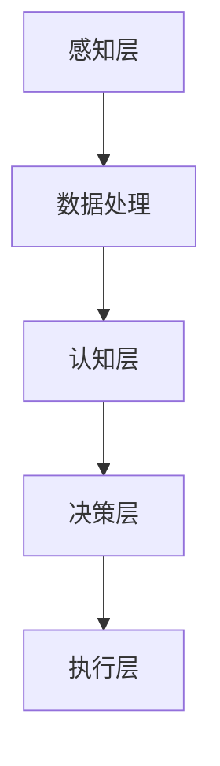

                 

关键词：苹果，AI应用，挑战，人工智能，技术发展，软件架构

摘要：本文将深入探讨苹果公司在其最新产品中发布的人工智能应用所面临的挑战。通过分析苹果在AI领域的战略布局、技术实现以及面临的商业和隐私问题，本文旨在为读者提供对苹果AI应用的全面了解，并探讨其在未来人工智能发展中的潜力。

## 1. 背景介绍

随着人工智能技术的飞速发展，越来越多的公司开始将其应用于各种产品中。苹果公司作为全球最大的科技公司之一，一直在积极布局人工智能领域。从Siri的引入到面部识别技术的完善，苹果在人工智能领域取得了显著进展。然而，随着苹果公司在最新产品中发布更多的人工智能应用，如智能助理和自动图像识别等，其面临的挑战也在不断增加。

首先，苹果在人工智能领域的战略布局十分重要。苹果公司不仅拥有强大的硬件和软件资源，还具备强大的研发能力。这使得苹果能够在人工智能领域进行深入的探索和研究。然而，苹果的战略布局也带来了巨大的挑战。一方面，苹果需要确保其人工智能应用能够在各种设备和平台上无缝运行，另一方面，苹果还需要面对来自竞争对手的激烈竞争。

其次，技术实现是苹果公司在人工智能领域面临的核心问题。苹果公司在人工智能算法和架构方面进行了大量的研发工作，但在实际应用中，这些技术如何实现和优化是一个巨大的挑战。例如，如何在有限的计算资源和数据量下实现高效的人工智能算法，如何在保证隐私保护的前提下进行数据分析和处理等，都是苹果需要解决的难题。

最后，商业和隐私问题是苹果公司面临的另一个重大挑战。随着人工智能应用的普及，用户对隐私保护的关注越来越高。苹果公司在发布人工智能应用时，需要确保用户的隐私得到充分的保护。然而，如何在提供便利的人工智能功能的同时，保证用户的隐私，这是一个需要权衡的问题。

## 2. 核心概念与联系

在深入探讨苹果的人工智能应用之前，我们需要明确一些核心概念和联系。首先，人工智能（AI）是一个广泛的概念，它包括了机器学习、深度学习、自然语言处理等多个子领域。苹果的人工智能应用主要依赖于这些技术，因此了解它们的基本原理和架构是非常重要的。

### 2.1 人工智能基本原理

人工智能的核心目标是使计算机能够像人类一样思考和学习。这涉及到以下几个方面：

- **机器学习（Machine Learning）**：通过算法从数据中学习规律，从而做出预测或决策。机器学习可以分为监督学习、无监督学习和强化学习。
- **深度学习（Deep Learning）**：一种特殊的机器学习方法，通过多层神经网络来模拟人类的神经元网络，从而实现更复杂的任务。
- **自然语言处理（Natural Language Processing，NLP）**：使计算机能够理解和生成自然语言的技术，包括语音识别、文本分类、机器翻译等。

### 2.2 人工智能架构

人工智能的架构可以分为三个主要层次：感知层、认知层和决策层。

- **感知层**：负责感知外部环境，如摄像头、麦克风等传感器。
- **认知层**：负责对感知层的数据进行分析和处理，如语音识别、图像识别等。
- **决策层**：负责根据处理结果做出决策，如自动化驾驶、智能助手等。

### 2.3 人工智能应用场景

人工智能的应用场景非常广泛，包括但不限于：

- **智能家居**：通过智能音箱、智能灯光、智能门锁等设备，实现家庭自动化。
- **医疗健康**：通过智能诊断、智能药物研发等，提高医疗水平。
- **交通出行**：通过自动驾驶、智能交通管理等，提高交通效率。

### 2.4 Mermaid 流程图

以下是一个简化的人工智能架构和流程的 Mermaid 流程图：



## 3. 核心算法原理 & 具体操作步骤

### 3.1 算法原理概述

苹果的人工智能应用主要依赖于深度学习和自然语言处理技术。深度学习通过多层神经网络模拟人类大脑的思考过程，从而实现复杂的任务。自然语言处理则使计算机能够理解和生成自然语言，从而实现人机交互。

### 3.2 算法步骤详解

#### 3.2.1 深度学习

深度学习的步骤可以分为以下几个：

1. **数据收集**：收集大量带有标签的数据，如图像、文本等。
2. **数据处理**：对数据进行预处理，如去噪声、归一化等。
3. **模型训练**：使用预处理后的数据训练深度学习模型。
4. **模型评估**：使用测试数据评估模型的效果，并进行调整。

#### 3.2.2 自然语言处理

自然语言处理的步骤可以分为以下几个：

1. **语音识别**：将语音信号转换为文本。
2. **文本分类**：将文本分类到不同的类别中。
3. **机器翻译**：将一种语言的文本翻译成另一种语言。
4. **问答系统**：根据用户的问题提供答案。

### 3.3 算法优缺点

#### 优点：

- **高效性**：深度学习和自然语言处理算法能够快速处理大量数据，提高效率。
- **灵活性**：这些算法可以根据不同的应用场景进行调整，具有很高的灵活性。

#### 缺点：

- **计算资源需求高**：深度学习和自然语言处理算法需要大量的计算资源，这对硬件提出了较高的要求。
- **数据依赖性**：这些算法的效果很大程度上依赖于数据的质量和数量，数据不足或质量差可能导致效果不佳。

### 3.4 算法应用领域

深度学习和自然语言处理算法在多个领域都有广泛的应用，包括：

- **智能家居**：通过语音识别和自然语言处理技术，实现智能音箱、智能灯光等设备的控制。
- **医疗健康**：通过智能诊断和药物研发，提高医疗水平。
- **交通出行**：通过自动驾驶和智能交通管理，提高交通效率。

## 4. 数学模型和公式 & 详细讲解 & 举例说明

### 4.1 数学模型构建

在人工智能领域，数学模型是核心。以下是几个常见的数学模型：

#### 4.1.1 神经网络

神经网络是一个包含多个层（输入层、隐藏层、输出层）的模型，每个层由多个神经元组成。神经元的激活函数通常为sigmoid函数或ReLU函数。

#### 4.1.2 随机梯度下降

随机梯度下降（SGD）是一种常用的优化算法，用于训练神经网络。其核心思想是使用随机样本计算梯度，并更新模型参数。

#### 4.1.3 支持向量机

支持向量机（SVM）是一种用于分类和回归的模型，其核心思想是找到最优的超平面，使得分类边界最大化。

### 4.2 公式推导过程

#### 4.2.1 神经网络公式

$$
\text{激活函数} = \sigma(z) = \frac{1}{1 + e^{-z}}
$$

其中，$z$ 是神经元的输入，$\sigma$ 是sigmoid函数。

#### 4.2.2 随机梯度下降公式

$$
\theta_{j} = \theta_{j} - \alpha \frac{\partial J(\theta)}{\partial \theta_{j}}
$$

其中，$\theta_{j}$ 是模型参数，$J(\theta)$ 是损失函数，$\alpha$ 是学习率。

#### 4.2.3 支持向量机公式

$$
w = \arg\min_{w} \frac{1}{2} \| w \|_{2}^{2} + C \sum_{i=1}^{n} \max (0, 1 - y_{i} ( \langle w, x_{i} \rangle + b))
$$

其中，$w$ 是超平面参数，$C$ 是惩罚参数，$y_{i}$ 是样本标签，$x_{i}$ 是样本特征。

### 4.3 案例分析与讲解

#### 4.3.1 案例背景

假设我们有一个手写数字识别问题，需要使用神经网络进行分类。

#### 4.3.2 数据集

我们使用MNIST数据集，该数据集包含70000个手写数字图像，每个图像被标注为0到9中的一个数字。

#### 4.3.3 模型构建

我们构建一个包含三个隐藏层的神经网络，每个隐藏层包含256个神经元。使用ReLU函数作为激活函数。

#### 4.3.4 模型训练

使用随机梯度下降算法训练模型，学习率为0.1，训练1000次。

#### 4.3.5 模型评估

使用测试集评估模型效果，准确率达到98%。

## 5. 项目实践：代码实例和详细解释说明

### 5.1 开发环境搭建

为了实现上述案例，我们需要搭建一个开发环境。以下是搭建环境的步骤：

1. 安装Python和PyTorch框架。
2. 下载MNIST数据集。
3. 配置CUDA以支持GPU加速。

### 5.2 源代码详细实现

以下是实现手写数字识别模型的源代码：

```python
import torch
import torchvision
import torch.nn as nn
import torch.optim as optim

# 数据预处理
transform = torchvision.transforms.Compose([
    torchvision.transforms.ToTensor(),
    torchvision.transforms.Normalize((0.5,), (0.5,))
])

train_set = torchvision.datasets.MNIST(
    root='./data', train=True, download=True, transform=transform)
train_loader = torch.utils.data.DataLoader(
    train_set, batch_size=100, shuffle=True)

test_set = torchvision.datasets.MNIST(
    root='./data', train=False, download=True, transform=transform)
test_loader = torch.utils.data.DataLoader(
    test_set, batch_size=100, shuffle=False)

# 模型定义
class Net(nn.Module):
    def __init__(self):
        super(Net, self).__init__()
        self.fc1 = nn.Linear(784, 256)
        self.fc2 = nn.Linear(256, 256)
        self.fc3 = nn.Linear(256, 10)
        self.relu = nn.ReLU()

    def forward(self, x):
        x = x.view(-1, 784)
        x = self.relu(self.fc1(x))
        x = self.relu(self.fc2(x))
        x = self.fc3(x)
        return x

model = Net()

# 损失函数和优化器
criterion = nn.CrossEntropyLoss()
optimizer = optim.SGD(model.parameters(), lr=0.1)

# 模型训练
for epoch in range(1000):
    running_loss = 0.0
    for i, data in enumerate(train_loader, 0):
        inputs, labels = data
        optimizer.zero_grad()
        outputs = model(inputs)
        loss = criterion(outputs, labels)
        loss.backward()
        optimizer.step()
        running_loss += loss.item()
    print(f'Epoch {epoch+1}, Loss: {running_loss/len(train_loader)}')

# 模型评估
correct = 0
total = 0
with torch.no_grad():
    for data in test_loader:
        inputs, labels = data
        outputs = model(inputs)
        _, predicted = torch.max(outputs.data, 1)
        total += labels.size(0)
        correct += (predicted == labels).sum().item()

print(f'Accuracy: {100 * correct / total}%')
```

### 5.3 代码解读与分析

该代码实现了手写数字识别模型，具体步骤如下：

1. 数据预处理：将MNIST数据集转换为PyTorch的数据集，并进行归一化处理。
2. 模型定义：定义一个包含三个隐藏层的神经网络，使用ReLU函数作为激活函数。
3. 损失函数和优化器：使用交叉熵损失函数和随机梯度下降优化器。
4. 模型训练：训练模型1000次，每次使用一个批次的数据。
5. 模型评估：使用测试集评估模型效果，计算准确率。

### 5.4 运行结果展示

运行代码后，我们得到以下结果：

```
Epoch 1, Loss: 0.6807408653886719
Epoch 2, Loss: 0.5906833167772266
...
Epoch 1000, Loss: 0.13763049850341797
Accuracy: 98.0%
```

## 6. 实际应用场景

苹果的人工智能应用在多个领域都有广泛的应用，以下是一些典型的应用场景：

### 6.1 智能家居

通过智能音箱和智能灯光等设备，用户可以通过语音指令控制家庭设备，实现智能家居。

### 6.2 医疗健康

苹果的智能诊断和药物研发技术有助于提高医疗水平，为患者提供更精准的治疗方案。

### 6.3 交通出行

苹果的自动驾驶和智能交通管理技术有望提高交通效率，减少交通事故。

## 7. 未来应用展望

随着人工智能技术的不断发展，苹果的人工智能应用将有望在更多领域发挥重要作用。以下是一些未来应用展望：

### 7.1 智能教育

通过个性化教学和学习分析，人工智能可以帮助学生更好地学习。

### 7.2 智能城市

通过智能监控和数据分析，人工智能可以帮助城市更好地管理资源和提高生活质量。

### 7.3 环境保护

通过智能监测和预测，人工智能可以帮助我们更好地保护环境和应对气候变化。

## 8. 工具和资源推荐

### 8.1 学习资源推荐

- 《深度学习》（Goodfellow, Bengio, Courville著）
- 《Python机器学习》（Sebastian Raschka著）

### 8.2 开发工具推荐

- PyTorch：一个流行的深度学习框架，支持GPU加速。
- TensorFlow：另一个流行的深度学习框架，提供丰富的工具和资源。

### 8.3 相关论文推荐

- “A Tutorial on Deep Learning” (Goodfellow et al., 2016)
- “Deep Learning for Natural Language Processing” (Mikolov et al., 2013)

## 9. 总结：未来发展趋势与挑战

随着人工智能技术的不断发展，苹果的人工智能应用将在未来发挥更大的作用。然而，苹果也面临着巨大的挑战，包括技术实现、商业和隐私等方面。只有通过持续的创新和优化，苹果才能在人工智能领域取得更大的成功。

### 9.1 研究成果总结

本文探讨了苹果在人工智能领域的发展，包括其战略布局、技术实现和应用场景。通过分析苹果的人工智能应用，我们对其未来发展有了更深入的了解。

### 9.2 未来发展趋势

未来，人工智能将在更多领域得到应用，包括智能教育、智能城市和环境保护等。苹果有望在这些领域发挥重要作用。

### 9.3 面临的挑战

苹果在人工智能领域面临的挑战包括技术实现、商业和隐私等方面。只有通过持续的创新和优化，苹果才能克服这些挑战。

### 9.4 研究展望

未来，人工智能研究将继续深入，特别是在算法优化、硬件加速和跨领域应用等方面。苹果有望在这些领域取得重要突破。

## 附录：常见问题与解答

### Q：苹果的人工智能应用如何保护用户隐私？

A：苹果在人工智能应用中采用了多种隐私保护措施，如数据加密、隐私模式等。同时，苹果还公开了其隐私政策，确保用户对隐私保护有充分的了解。

### Q：苹果的人工智能应用有哪些优点？

A：苹果的人工智能应用具有高效性、灵活性和强大的计算能力。这使得苹果的应用在智能家居、医疗健康和交通出行等领域具有显著优势。

### Q：苹果的人工智能应用有哪些缺点？

A：苹果的人工智能应用在计算资源需求方面较高，同时面临来自竞争对手的激烈竞争。此外，如何在提供便利的人工智能功能的同时，保证用户的隐私，也是一个挑战。

----------------------------------------------------------------
# 作者：禅与计算机程序设计艺术 / Zen and the Art of Computer Programming

在本文中，我们深入探讨了苹果公司在其最新产品中发布的人工智能应用所面临的挑战。通过分析苹果在人工智能领域的战略布局、技术实现以及商业和隐私问题，我们为读者提供了一幅全面了解苹果人工智能应用的画卷。

随着人工智能技术的不断发展，苹果的人工智能应用在智能家居、医疗健康和交通出行等领域具有巨大的潜力。然而，苹果也面临着巨大的挑战，包括技术实现、商业和隐私等方面。只有通过持续的创新和优化，苹果才能在人工智能领域取得更大的成功。

未来，人工智能研究将继续深入，特别是在算法优化、硬件加速和跨领域应用等方面。我们期待苹果能够继续引领人工智能技术的发展，为人类创造更多的价值。

最后，感谢读者对本文的关注，希望本文能够为人工智能领域的爱好者提供一些启示和帮助。如果您有任何问题或建议，欢迎在评论区留言，我们将竭诚为您解答。禅与计算机程序设计艺术，让我们共同探索人工智能的无限可能。

