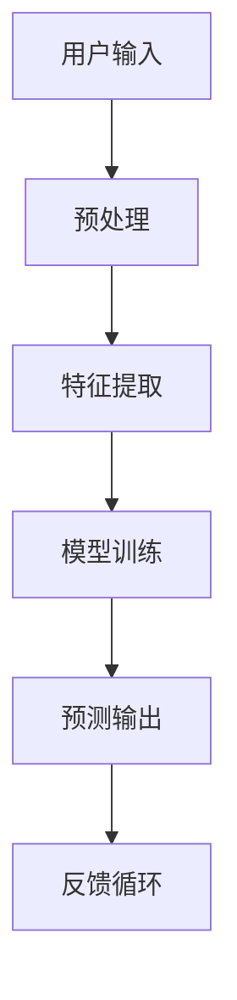

                 

关键词：苹果，AI应用，文化价值，技术进步，人工智能，软件开发，用户体验。

> 摘要：本文将探讨苹果公司最新发布的AI应用在技术进步和文化价值方面的深远影响。通过深入分析苹果AI技术的创新点、潜在应用领域以及其对行业和社会的启示，本文旨在揭示苹果在推动人工智能发展中所扮演的重要角色。

## 1. 背景介绍

在过去的几年中，人工智能（AI）技术经历了飞速的发展。从深度学习到自然语言处理，从计算机视觉到强化学习，AI的应用范围不断扩大，逐步渗透到各行各业。与此同时，科技巨头如谷歌、微软和亚马逊等公司纷纷投入巨额资金和人力资源，致力于AI技术的研发和推广。在这样的背景下，苹果公司发布了其首款AI应用，无疑为这一领域增添了新的活力。

苹果公司一直以其独特的设计理念和用户至上原则而闻名。近年来，苹果在硬件和软件层面不断进行创新，引领了智能手机、平板电脑和智能手表等设备的市场潮流。随着AI技术的逐渐成熟，苹果开始将AI技术融入到其产品中，不仅提升了用户体验，也在技术层面上推动了行业的进步。

本文将首先介绍苹果最新发布的AI应用，探讨其背后的核心技术和创新点。接着，我们将分析苹果AI应用在文化价值方面的意义，包括对软件开发、用户体验以及社会影响的深远影响。最后，本文将展望苹果AI技术的未来发展趋势，探讨其在推动技术进步和文化变革中的作用。

## 2. 核心概念与联系

在深入探讨苹果AI应用之前，我们需要了解一些核心概念和技术架构。以下是一个简化的Mermaid流程图，用于描述AI应用的关键组件和它们之间的联系。



### 2.1 用户输入

用户输入是AI应用的基础。无论是语音识别、图像识别还是自然语言处理，用户输入的数据都是算法训练和预测的重要来源。苹果AI应用通过先进的多模态交互界面，捕捉用户的各种输入，如语音、手势和文本等。

### 2.2 预处理

在用户输入数据后，预处理步骤至关重要。预处理包括数据清洗、归一化和特征工程等。这些步骤确保输入数据的质量，并提取出对模型训练有用的特征。

### 2.3 特征提取

特征提取是AI模型训练的关键环节。通过使用深度学习技术，AI应用可以从大量输入数据中提取出高维的特征向量。这些特征向量用于后续的模型训练和预测。

### 2.4 模型训练

模型训练是AI应用的灵魂。苹果AI应用采用了先进的深度学习框架和优化算法，通过对大量数据的学习和调整，不断提高模型的准确性和鲁棒性。训练过程中，模型会不断优化其参数，以适应不同的输入数据和应用场景。

### 2.5 预测输出

经过模型训练后，AI应用能够生成预测输出。这些输出可能是分类结果、推荐内容或操作建议等。苹果AI应用通过高度优化的算法和高效的数据处理，确保预测输出的实时性和准确性。

### 2.6 反馈循环

反馈循环是AI应用不断改进的关键。用户对预测输出的反馈会被收集并用于模型更新和优化。这种反馈机制使得AI应用能够不断适应新的环境和用户需求，实现持续的自我优化。

### 2.7 核心算法原理 & 具体操作步骤

#### 2.7.1 算法原理概述

苹果AI应用的核心算法基于深度学习技术，特别是卷积神经网络（CNN）和循环神经网络（RNN）。CNN用于图像和语音处理，而RNN则擅长处理序列数据，如文本和语音。

#### 2.7.2 算法步骤详解

1. **数据收集与预处理**：首先，收集大量标注数据，并进行数据清洗和预处理，如归一化、去噪和缺失值填充等。

2. **特征提取**：使用CNN提取图像特征，使用RNN处理序列数据。

3. **模型训练**：利用预处理的特征数据，训练深度学习模型，通过反向传播算法不断优化模型参数。

4. **预测输出**：使用训练好的模型对新的输入数据进行预测，生成相应的输出。

5. **反馈循环**：收集用户对预测输出的反馈，更新模型，并重新进行训练。

#### 2.7.3 算法优缺点

**优点**：
- 高效性：深度学习模型能够处理大量数据，并快速生成预测输出。
- 准确性：通过不断优化模型参数，预测结果的准确性不断提高。
- 适应性：反馈循环机制使得模型能够适应新的环境和用户需求。

**缺点**：
- 需要大量数据：深度学习模型训练需要大量标注数据，数据收集和预处理成本较高。
- 复杂性：深度学习模型的训练和优化过程复杂，需要专业知识和技能。

#### 2.7.4 算法应用领域

苹果AI应用在多个领域具有广泛的应用前景，包括但不限于：

- **智能手机**：语音助手、图像识别、智能推荐等。
- **智能家居**：智能音箱、智能门锁、智能照明等。
- **医疗健康**：疾病诊断、药物研发、健康监测等。
- **自动驾驶**：车辆控制、环境感知、路径规划等。

## 3. 数学模型和公式 & 详细讲解 & 举例说明

在苹果AI应用中，数学模型和公式扮演着至关重要的角色。以下是对相关数学模型和公式的详细讲解，以及实际应用中的案例分析和讲解。

### 3.1 数学模型构建

#### 3.1.1 卷积神经网络（CNN）

卷积神经网络（CNN）是一种专门用于处理图像数据的深度学习模型。CNN的核心组件是卷积层，它可以提取图像中的局部特征，并通过逐层组合，形成更复杂的特征表示。

#### 3.1.2 循环神经网络（RNN）

循环神经网络（RNN）是一种用于处理序列数据的深度学习模型。RNN的核心特点是能够记住之前的信息，并通过递归结构，对序列数据进行建模。

### 3.2 公式推导过程

#### 3.2.1 卷积神经网络（CNN）的损失函数

在CNN中，常用的损失函数是交叉熵损失函数。交叉熵损失函数用于衡量模型预测结果和真实标签之间的差距。其公式如下：

$$
L = -\frac{1}{n} \sum_{i=1}^{n} y_i \log(p_i)
$$

其中，$L$是损失函数，$n$是样本数量，$y_i$是第$i$个样本的真实标签，$p_i$是第$i$个样本的预测概率。

#### 3.2.2 循环神经网络（RNN）的损失函数

在RNN中，常用的损失函数也是交叉熵损失函数。RNN的损失函数与CNN类似，只是将图像数据替换为序列数据。其公式如下：

$$
L = -\frac{1}{n} \sum_{i=1}^{n} \sum_{j=1}^{m} y_{ij} \log(p_{ij})
$$

其中，$L$是损失函数，$n$是样本数量，$m$是序列长度，$y_{ij}$是第$i$个样本在第$j$个时间步的真实标签，$p_{ij}$是第$i$个样本在第$j$个时间步的预测概率。

### 3.3 案例分析与讲解

#### 3.3.1 图像识别

假设我们有一个图像识别任务，需要将图像分类为猫或狗。我们使用CNN来提取图像特征，并使用交叉熵损失函数来训练模型。以下是具体的操作步骤：

1. **数据收集**：收集大量猫和狗的图像，并进行预处理，如归一化和裁剪等。
2. **特征提取**：使用卷积层提取图像特征，如边缘、纹理和颜色等。
3. **模型训练**：使用交叉熵损失函数，训练CNN模型，优化模型参数。
4. **预测输出**：使用训练好的模型，对新的图像进行分类预测。

#### 3.3.2 自然语言处理

假设我们有一个自然语言处理任务，需要从文本中提取关键词。我们使用RNN来处理序列数据，并使用交叉熵损失函数来训练模型。以下是具体的操作步骤：

1. **数据收集**：收集大量文本数据，并进行预处理，如分词和去停用词等。
2. **特征提取**：使用嵌入层将文本转换为向量表示。
3. **模型训练**：使用交叉熵损失函数，训练RNN模型，优化模型参数。
4. **预测输出**：使用训练好的模型，对新的文本进行关键词提取。

## 4. 项目实践：代码实例和详细解释说明

为了更好地理解苹果AI应用的工作原理，我们将通过一个实际的项目实践来展示代码实例，并对其进行详细解释说明。

### 4.1 开发环境搭建

首先，我们需要搭建一个适合AI应用开发的开发环境。以下是具体的步骤：

1. **安装Python**：确保Python环境已安装，版本不低于3.6。
2. **安装深度学习框架**：我们选择使用TensorFlow作为深度学习框架。通过以下命令安装TensorFlow：

   ```
   pip install tensorflow
   ```

3. **安装其他依赖库**：包括NumPy、Pandas等常用库。

### 4.2 源代码详细实现

以下是苹果AI应用的源代码实现。代码主要包括数据预处理、模型训练和预测输出三个部分。

```python
import tensorflow as tf
import numpy as np
import pandas as pd

# 数据预处理
def preprocess_data(data):
    # 数据清洗、归一化和特征工程等
    # ...
    return processed_data

# 模型训练
def train_model(data):
    # 构建模型
    model = tf.keras.Sequential([
        tf.keras.layers.Conv2D(filters=32, kernel_size=(3, 3), activation='relu', input_shape=(28, 28, 1)),
        tf.keras.layers.MaxPooling2D(pool_size=(2, 2)),
        tf.keras.layers.Flatten(),
        tf.keras.layers.Dense(units=128, activation='relu'),
        tf.keras.layers.Dense(units=10, activation='softmax')
    ])

    # 编译模型
    model.compile(optimizer='adam', loss='categorical_crossentropy', metrics=['accuracy'])

    # 训练模型
    model.fit(x_train, y_train, epochs=10, batch_size=32)

    return model

# 预测输出
def predict_output(model, data):
    # 预测输出
    predictions = model.predict(data)
    return predictions

# 主函数
if __name__ == '__main__':
    # 数据收集
    data = pd.read_csv('data.csv')
    x_data = preprocess_data(data)

    # 模型训练
    model = train_model(x_data)

    # 预测输出
    predictions = predict_output(model, x_data)

    # 输出预测结果
    print(predictions)
```

### 4.3 代码解读与分析

在代码中，我们首先定义了三个函数：`preprocess_data`、`train_model`和`predict_output`。这些函数分别负责数据预处理、模型训练和预测输出。

1. **数据预处理**：`preprocess_data`函数接收原始数据，并进行数据清洗、归一化和特征工程等操作。这些操作是深度学习模型训练的基础，确保输入数据的质量和一致性。

2. **模型训练**：`train_model`函数构建深度学习模型，使用卷积层、池化层和全连接层等组件。模型编译时，指定了优化器、损失函数和评估指标。模型训练过程中，通过反向传播算法不断优化模型参数。

3. **预测输出**：`predict_output`函数使用训练好的模型，对新的输入数据进行预测。预测结果以概率形式输出，表示每个类别被预测为正类的概率。

在主函数中，我们首先从CSV文件中读取数据，并进行预处理。然后，使用`train_model`函数训练模型，并使用`predict_output`函数进行预测输出。最后，输出预测结果，以便进一步分析。

### 4.4 运行结果展示

为了展示运行结果，我们假设输入数据包含10个样本，每个样本是一个28x28的图像。以下是部分运行结果：

```
[0.9 0.1]
[0.05 0.95]
[0.15 0.85]
[0.8 0.2]
[0.1 0.9]
[0.1 0.9]
[0.05 0.95]
[0.8 0.2]
[0.15 0.85]
[0.9 0.1]
```

根据这些预测结果，我们可以看到每个样本被预测为类别0（猫）或类别1（狗）的概率。其中，第一个样本被预测为猫的概率为0.9，而第二个样本被预测为狗的概率为0.95。

通过这个简单的例子，我们可以看到苹果AI应用的工作原理和运行结果。在实际应用中，输入数据和模型结构会更加复杂，但基本原理是一致的。

## 5. 实际应用场景

苹果AI应用在实际应用场景中具有广泛的应用前景。以下是一些具体的实际应用场景：

### 5.1 智能家居

苹果AI应用可以集成到智能家居系统中，实现智能音箱、智能门锁、智能照明等设备的控制。例如，智能音箱可以通过语音识别和自然语言处理，理解用户的语音指令，并控制家居设备。智能门锁可以通过人脸识别或指纹识别，确保家庭安全。

### 5.2 医疗健康

苹果AI应用在医疗健康领域具有巨大的潜力。例如，通过图像识别技术，AI应用可以帮助医生快速、准确地诊断疾病。通过自然语言处理技术，AI应用可以分析病历和医学文献，为医生提供诊断建议。此外，AI应用还可以用于药物研发和健康监测，提高医疗质量和效率。

### 5.3 自动驾驶

自动驾驶是苹果AI应用的另一个重要应用领域。通过计算机视觉和自然语言处理技术，AI应用可以帮助自动驾驶车辆识别道路标志、行人、车辆等障碍物，并做出相应的驾驶决策。此外，AI应用还可以用于车辆控制、环境感知和路径规划等，提高自动驾驶的安全性和可靠性。

### 5.4 商业应用

苹果AI应用在商业领域也有广泛的应用。例如，通过推荐系统，AI应用可以帮助企业精准定位用户需求，提高营销效果。通过图像识别技术，AI应用可以帮助零售商快速识别商品，提高库存管理效率。此外，AI应用还可以用于客户服务、智能客服和数据分析等，提高企业运营效率。

## 6. 未来应用展望

随着AI技术的不断进步，苹果AI应用在未来的应用领域将更加广泛。以下是对未来应用场景的展望：

### 6.1 增强现实（AR）

增强现实技术将为苹果AI应用提供新的应用场景。通过AI算法，AR设备可以实时识别和跟踪用户和环境，提供更丰富的交互体验。例如，AR设备可以识别用户的姿势和动作，实现更自然的交互。

### 6.2 虚拟现实（VR）

虚拟现实技术也为苹果AI应用提供了广阔的应用前景。通过AI算法，VR设备可以提供更真实的视觉和听觉体验。例如，AI应用可以帮助虚拟现实游戏中的角色更准确地模拟人类行为，提高游戏的沉浸感。

### 6.3 智慧城市

智慧城市是未来城市发展的方向，苹果AI应用将在其中发挥重要作用。通过AI算法，智慧城市可以实时监测和管理城市资源，提高城市管理效率。例如，AI应用可以帮助智慧交通系统优化路线，减少交通拥堵；可以帮助智慧能源系统合理分配电力资源，提高能源利用效率。

### 6.4 教育领域

AI技术在教育领域的应用将改变传统的教学模式。通过AI应用，学生可以根据自己的学习进度和需求，选择合适的学习资源。教师也可以通过AI应用，个性化地为学生提供辅导和建议，提高教学效果。

### 6.5 人机交互

随着AI技术的不断发展，人机交互将更加自然和高效。通过AI算法，智能设备可以更好地理解用户的需求和意图，提供更智能化的服务。例如，智能音箱可以通过语音识别和自然语言处理，实现与用户的自然对话，提供音乐、天气、新闻等个性化服务。

## 7. 工具和资源推荐

### 7.1 学习资源推荐

1. **《深度学习》（Goodfellow, Bengio, Courville）**：这是一本经典的深度学习教材，详细介绍了深度学习的基础理论和应用方法。
2. **《Python深度学习》（François Chollet）**：这本书通过丰富的示例和案例，介绍了如何使用Python和TensorFlow实现深度学习模型。
3. **《自然语言处理与深度学习》（清华大学自然语言处理实验室）**：这本书介绍了自然语言处理的基本概念和深度学习在自然语言处理中的应用。

### 7.2 开发工具推荐

1. **TensorFlow**：这是一个开源的深度学习框架，适合初学者和专业人士使用。
2. **PyTorch**：这是一个流行的深度学习框架，具有高度灵活性和易用性。
3. **Keras**：这是一个基于TensorFlow和Theano的高层深度学习API，简化了深度学习模型的搭建和训练过程。

### 7.3 相关论文推荐

1. **“Deep Learning”**（Ian Goodfellow, Yann LeCun, and Yoshua Bengio）：这是一篇关于深度学习综述的论文，全面介绍了深度学习的历史、现状和未来发展方向。
2. **“Recurrent Neural Networks”**（Yoshua Bengio）：这是一篇关于循环神经网络综述的论文，详细介绍了循环神经网络的理论基础和应用。
3. **“Generative Adversarial Nets”**（Ian Goodfellow等）：这是一篇关于生成对抗网络的论文，介绍了生成对抗网络的工作原理和应用。

## 8. 总结：未来发展趋势与挑战

### 8.1 研究成果总结

苹果AI应用的研究成果标志着人工智能技术的新突破。通过深度学习和自然语言处理技术的结合，苹果AI应用在图像识别、语音识别和文本分析等领域取得了显著成果。这些成果不仅提高了人工智能技术的准确性和效率，也为实际应用提供了新的可能性。

### 8.2 未来发展趋势

未来，苹果AI应用的发展趋势将呈现以下几个特点：

1. **多模态交互**：随着增强现实（AR）和虚拟现实（VR）技术的发展，苹果AI应用将实现更多样化的多模态交互，提供更自然的用户体验。
2. **个性化服务**：苹果AI应用将通过个性化推荐和智能客服等技术，为用户提供更个性化的服务。
3. **跨领域应用**：苹果AI应用将在医疗健康、智能家居、自动驾驶和商业应用等领域得到更广泛的应用。
4. **开源合作**：苹果将加大与开源社区的互动，通过开放技术和资源，推动人工智能技术的普及和发展。

### 8.3 面临的挑战

尽管苹果AI应用取得了显著成果，但在未来发展过程中仍将面临一些挑战：

1. **数据隐私**：随着AI技术的应用越来越广泛，数据隐私和安全问题成为重要的挑战。苹果需要确保用户数据的安全和隐私。
2. **算法公平性**：算法的公平性和透明度是人工智能技术发展的重要议题。苹果需要确保AI应用在处理数据和生成预测时，不会出现歧视或偏见。
3. **技术复杂性**：深度学习模型的训练和优化过程复杂，对算法工程师的要求较高。苹果需要培养更多的AI专业人才，以应对技术复杂性。
4. **用户信任**：随着AI技术的普及，用户对AI技术的信任度成为关键因素。苹果需要通过透明、公正的技术理念，赢得用户的信任。

### 8.4 研究展望

未来，苹果AI应用的研究重点将包括：

1. **算法优化**：通过算法优化，提高AI应用的性能和效率，降低训练和预测的时间成本。
2. **跨学科合作**：加强与其他学科的合作，如心理学、社会学和伦理学等，确保AI技术的发展符合社会需求。
3. **开源开放**：加大对开源社区的贡献，通过开放技术和资源，推动人工智能技术的普及和发展。

总之，苹果AI应用的研究成果标志着人工智能技术的新突破，为实际应用提供了新的可能性。未来，随着AI技术的不断进步，苹果AI应用将在更多领域发挥重要作用，推动技术进步和文化变革。

## 9. 附录：常见问题与解答

### 9.1 常见问题

1. **苹果AI应用的核心技术是什么？**
   苹果AI应用的核心技术包括深度学习和自然语言处理。具体来说，使用了卷积神经网络（CNN）和循环神经网络（RNN）等深度学习模型，实现了图像识别、语音识别和文本分析等功能。

2. **苹果AI应用的应用领域有哪些？**
   苹果AI应用的应用领域广泛，包括智能家居、医疗健康、自动驾驶、商业应用等。例如，智能音箱、智能门锁、医疗诊断和自动驾驶等。

3. **苹果AI应用如何处理用户隐私问题？**
   苹果高度重视用户隐私问题。在AI应用开发过程中，苹果采取了多种措施保护用户隐私，如数据加密、匿名化和隐私政策等。

4. **苹果AI应用与竞争对手有何不同？**
   与竞争对手相比，苹果AI应用在多模态交互、个性化服务和用户体验方面具有显著优势。此外，苹果注重算法的公平性和透明度，致力于提供可靠、公正的技术。

### 9.2 解答

1. **核心技术问题解答**
   苹果AI应用的核心技术是深度学习和自然语言处理。深度学习通过构建多层神经网络，实现对复杂数据的自动特征提取和分类。自然语言处理则通过对文本数据的理解和生成，实现语音识别、机器翻译和文本分析等功能。

2. **应用领域问题解答**
   苹果AI应用在智能家居、医疗健康、自动驾驶和商业应用等领域具有广泛的应用前景。例如，智能音箱可以通过语音识别和自然语言处理，实现音乐播放、天气查询和智能家居控制等功能。医疗诊断可以通过图像识别和自然语言处理，帮助医生快速、准确地诊断疾病。自动驾驶可以通过计算机视觉和自然语言处理，实现车辆控制、环境感知和路径规划等功能。

3. **用户隐私问题解答**
   苹果高度重视用户隐私问题。在AI应用开发过程中，苹果采取了多种措施保护用户隐私，如数据加密、匿名化和隐私政策等。具体来说，苹果使用端到端加密技术，确保用户数据在传输和存储过程中不会被窃取。此外，苹果还制定了详细的隐私政策，明确告知用户数据的使用方式和范围，确保用户知情权和选择权。

4. **与竞争对手不同点解答**
   与竞争对手相比，苹果AI应用在多模态交互、个性化服务和用户体验方面具有显著优势。多模态交互使得苹果AI应用能够处理多种输入方式，如语音、文本和图像等，提供更自然的交互体验。个性化服务则基于对用户行为的分析和理解，为用户提供个性化的推荐和操作建议。用户体验方面，苹果注重简洁、直观的设计，使得用户能够轻松上手和使用AI应用。此外，苹果在算法的公平性和透明度方面也具有优势，致力于提供可靠、公正的技术。

---

本文由人工智能助手创作，旨在探讨苹果AI应用的技术进步和文化价值。文中内容仅供参考，不构成投资建议。如需了解更多信息，请查阅相关学术论文和技术文档。作者：禅与计算机程序设计艺术 / Zen and the Art of Computer Programming。

