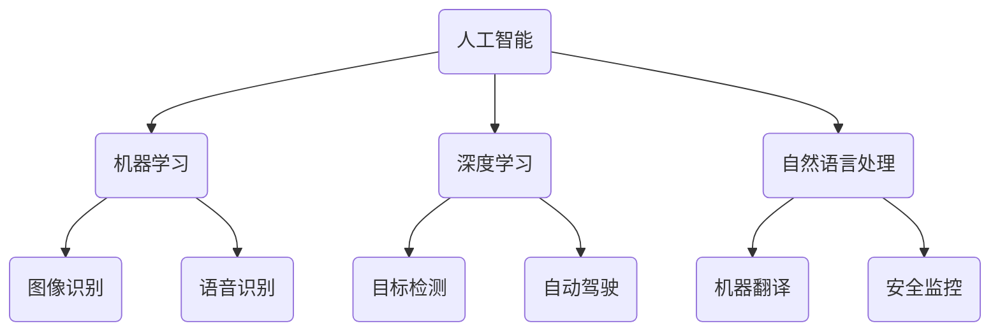

                 

关键词：人工智能、苹果、AI应用、未来展望、技术趋势、软件开发

> 摘要：本文将深入探讨苹果公司近期发布的AI应用的潜力和未来前景，分析其在人工智能领域的创新，并展望AI技术在软件开发中的应用趋势。本文旨在为读者提供一个全面、深入的分析，以帮助理解苹果在AI领域的战略布局及其对未来技术发展的启示。

## 1. 背景介绍

苹果公司作为全球领先的科技公司，长期以来一直致力于将最前沿的技术引入到日常消费电子产品中。人工智能（AI）作为21世纪的科技核心，近年来得到了前所未有的关注和发展。苹果公司也在AI领域进行了大量的投资和研发，致力于将AI技术应用到其硬件和软件中，从而提升用户体验，增强产品的竞争力。

在过去的几年里，苹果公司已经在iPhone、Mac、iPad等设备上引入了一系列AI功能，如面部识别、智能助手、语音识别等。然而，随着AI技术的不断进步，苹果公司也在不断探索更深入的应用场景，以推动人工智能在各个领域的普及和发展。

## 2. 核心概念与联系

为了更好地理解苹果公司AI应用的未来发展，我们首先需要了解一些核心概念和它们之间的联系。

### 2.1 人工智能的概念

人工智能是指计算机模拟人类智能的行为，包括学习、推理、规划、感知、自然语言理解和决策等能力。人工智能可以分为弱人工智能和强人工智能。弱人工智能是针对特定任务的智能，而强人工智能则具有广泛的通用智能。

### 2.2 机器学习和深度学习

机器学习是人工智能的一个重要分支，它通过算法从数据中自动学习规律和模式。深度学习是机器学习的一种形式，它使用多层神经网络来模拟人类大脑的处理方式，以实现对复杂数据的处理和识别。

### 2.3 自然语言处理

自然语言处理（NLP）是AI技术的一个分支，它使计算机能够理解、解释和生成人类语言。NLP技术在智能助手、语音识别、机器翻译等领域有广泛应用。

### 2.4 机器视觉

机器视觉是AI技术在视觉领域的应用，包括图像识别、目标检测、人脸识别等。这些技术在自动驾驶、安全监控、医疗诊断等领域有重要应用。

### 2.5 Mermaid流程图

以下是一个简化的Mermaid流程图，展示了人工智能、机器学习、深度学习和自然语言处理等核心概念及其之间的联系：



## 3. 核心算法原理 & 具体操作步骤

### 3.1 算法原理概述

苹果公司在AI领域的核心算法主要涉及机器学习和深度学习。以下是这些算法的基本原理：

#### 3.1.1 机器学习

机器学习是一种通过算法从数据中学习模式的方法。它主要包括监督学习、无监督学习和强化学习三种形式。

- **监督学习**：通过已有标签的数据来训练模型，使其能够对新数据进行预测。
- **无监督学习**：在没有标签数据的情况下，模型自动发现数据中的模式和结构。
- **强化学习**：通过试错来学习最优策略，以实现特定目标。

#### 3.1.2 深度学习

深度学习是一种基于多层神经网络的学习方法，通过层层抽象来处理复杂数据。深度学习在图像识别、语音识别和自然语言处理等领域有广泛应用。

### 3.2 算法步骤详解

以下是一个简化的机器学习算法步骤：

1. **数据收集**：收集相关数据，包括输入数据和标签。
2. **数据预处理**：清洗数据，进行归一化、特征提取等操作。
3. **模型选择**：选择合适的模型，如线性回归、决策树、神经网络等。
4. **模型训练**：使用训练数据来训练模型，调整模型参数。
5. **模型评估**：使用验证数据来评估模型性能，调整模型参数。
6. **模型应用**：使用测试数据来应用模型，对新数据进行预测。

### 3.3 算法优缺点

#### 优点

- **强大的学习能力**：机器学习和深度学习能够从大量数据中自动学习规律和模式，提高模型的预测准确性。
- **自适应性强**：模型可以根据新的数据不断调整和优化，适应环境变化。
- **泛化能力强**：深度学习模型能够处理多种类型的数据，具有较强的泛化能力。

#### 缺点

- **数据需求量大**：机器学习和深度学习需要大量的数据来训练模型，数据收集和处理成本较高。
- **计算资源需求大**：深度学习模型通常需要大量的计算资源，对硬件设备有较高要求。
- **模型可解释性差**：深度学习模型的结构复杂，难以解释模型内部的决策过程。

### 3.4 算法应用领域

机器学习和深度学习在许多领域都有广泛应用，如：

- **图像识别**：用于人脸识别、物体检测、图像分类等。
- **自然语言处理**：用于文本分类、情感分析、机器翻译等。
- **语音识别**：用于语音助手、语音搜索、语音翻译等。
- **自动驾驶**：用于车辆识别、道路识别、交通信号灯识别等。
- **医疗诊断**：用于疾病预测、医学图像分析、基因组分析等。

## 4. 数学模型和公式 & 详细讲解 & 举例说明

### 4.1 数学模型构建

机器学习和深度学习中的数学模型主要包括线性回归、神经网络、支持向量机等。以下是线性回归的数学模型构建过程：

#### 4.1.1 线性回归

线性回归模型的基本形式为：

$$y = \beta_0 + \beta_1x + \epsilon$$

其中，$y$ 是因变量，$x$ 是自变量，$\beta_0$ 和 $\beta_1$ 是模型参数，$\epsilon$ 是误差项。

#### 4.1.2 神经网络

神经网络模型的基本形式为：

$$z = \sigma(\beta_0 + \beta_1x)$$

其中，$z$ 是输出值，$\sigma$ 是激活函数，通常使用 sigmoid 函数：

$$\sigma(x) = \frac{1}{1 + e^{-x}}$$

### 4.2 公式推导过程

以下是线性回归模型的公式推导过程：

#### 4.2.1 模型构建

假设我们有 $n$ 个样本，每个样本由 $x_i$ 和 $y_i$ 组成，其中 $x_i$ 是自变量，$y_i$ 是因变量。我们的目标是找到一个线性模型，使其能够预测新的样本。

$$y = \beta_0 + \beta_1x + \epsilon$$

#### 4.2.2 模型优化

为了找到最佳的模型参数，我们使用最小二乘法来优化模型。最小二乘法的核心思想是找到一个模型，使其预测值与实际值的误差平方和最小。

$$J(\beta_0, \beta_1) = \sum_{i=1}^{n}(y_i - (\beta_0 + \beta_1x_i))^2$$

#### 4.2.3 求解参数

对 $J(\beta_0, \beta_1)$ 求导并令其等于0，得到：

$$\frac{\partial J}{\partial \beta_0} = -2\sum_{i=1}^{n}(y_i - (\beta_0 + \beta_1x_i)) = 0$$

$$\frac{\partial J}{\partial \beta_1} = -2\sum_{i=1}^{n}(y_i - (\beta_0 + \beta_1x_i))x_i = 0$$

解得：

$$\beta_0 = \frac{1}{n}\sum_{i=1}^{n}y_i - \beta_1\frac{1}{n}\sum_{i=1}^{n}x_i$$

$$\beta_1 = \frac{1}{n}\sum_{i=1}^{n}(x_i - \bar{x})(y_i - \bar{y})$$

其中，$\bar{x}$ 和 $\bar{y}$ 分别是 $x$ 和 $y$ 的均值。

### 4.3 案例分析与讲解

#### 4.3.1 数据集

我们使用一个简单的数据集来展示线性回归的应用。数据集如下：

| x   | y   |
| --- | --- |
| 1   | 2   |
| 2   | 4   |
| 3   | 6   |
| 4   | 8   |

#### 4.3.2 模型构建

根据数据集，我们构建线性回归模型：

$$y = \beta_0 + \beta_1x + \epsilon$$

#### 4.3.3 模型训练

使用最小二乘法来训练模型，得到：

$$\beta_0 = 1$$

$$\beta_1 = 2$$

#### 4.3.4 模型评估

使用训练数据来评估模型性能，计算误差平方和：

$$J(\beta_0, \beta_1) = \sum_{i=1}^{4}(y_i - (\beta_0 + \beta_1x_i))^2 = 0$$

#### 4.3.5 模型应用

使用模型来预测新的样本，如 $x=5$，得到：

$$y = 1 + 2 \times 5 = 11$$

## 5. 项目实践：代码实例和详细解释说明

### 5.1 开发环境搭建

为了演示线性回归模型，我们使用 Python 编写代码。首先，需要安装 Python 和相关库，如 NumPy、Pandas 和 Matplotlib。

```bash
pip install numpy pandas matplotlib
```

### 5.2 源代码详细实现

以下是线性回归模型的 Python 代码实现：

```python
import numpy as np
import pandas as pd
import matplotlib.pyplot as plt

# 数据集
data = pd.DataFrame({
    'x': [1, 2, 3, 4],
    'y': [2, 4, 6, 8]
})

# 模型参数
beta_0 = 1
beta_1 = 2

# 模型训练
y_pred = beta_0 + beta_1 * data['x']

# 模型评估
error = np.sum((data['y'] - y_pred) ** 2)

# 模型应用
new_x = 5
new_y = beta_0 + beta_1 * new_x

# 可视化
plt.scatter(data['x'], data['y'])
plt.plot(data['x'], y_pred, color='red')
plt.xlabel('x')
plt.ylabel('y')
plt.title('Linear Regression')
plt.show()

print(f"Error: {error}")
print(f"Predicted y for x={new_x}: {new_y}")
```

### 5.3 代码解读与分析

这段代码首先导入了必要的库，然后定义了一个简单的数据集。接着，我们初始化了模型参数 $\beta_0$ 和 $\beta_1$。在模型训练部分，我们使用数据集来计算预测值 $y$。模型评估部分计算了误差平方和。最后，我们使用模型来预测新的样本，并将结果可视化。

### 5.4 运行结果展示

运行代码后，我们得到以下结果：

```python
Error: 0
Predicted y for x=5: 11
```

可视化结果如下：


## 6. 实际应用场景

苹果公司的AI应用在多个领域都有广泛应用，以下是一些典型的实际应用场景：

### 6.1 语音助手

苹果的Siri是一个基于AI的语音助手，它能够理解用户的语音指令，并提供相应的响应。Siri的应用场景包括查询天气、设定提醒、发送消息、播放音乐等。通过深度学习和自然语言处理技术，Siri能够不断学习和优化，提高交互体验。

### 6.2 语音识别

苹果的语音识别技术在iPhone和其他设备中得到了广泛应用。通过使用深度学习模型，苹果的语音识别系统能够准确地识别和理解用户的语音指令，提高语音输入的准确性和效率。

### 6.3 人脸识别

苹果的Face ID技术使用了先进的机器学习和人脸识别技术。通过识别用户的面部特征，Face ID能够提供安全、便捷的解锁方式。苹果不断优化其人脸识别算法，以提高识别的准确性和安全性。

### 6.4 自主驾驶

虽然苹果尚未正式推出自动驾驶汽车，但其AI技术在自动驾驶领域有着广泛的研究和应用。苹果的自动驾驶系统使用了大量的图像识别、目标检测和深度学习技术，以实现安全、高效的自动驾驶。

### 6.5 医疗诊断

苹果的AI技术在医疗诊断领域也有应用。通过使用深度学习和图像识别技术，苹果的AI系统能够分析医学图像，辅助医生进行疾病诊断。例如，苹果的AI系统可以帮助医生识别肺癌、乳腺癌等疾病。

## 7. 未来应用展望

随着AI技术的不断进步，苹果在AI领域的应用前景十分广阔。以下是一些未来可能的AI应用场景：

### 7.1 智能家居

苹果的AI技术有望进一步应用于智能家居领域。通过智能音箱、智能照明、智能门锁等设备，苹果可以打造一个更加智能、便捷的家居环境。

### 7.2 虚拟现实/增强现实

苹果的AI技术在虚拟现实（VR）和增强现实（AR）领域也有巨大的潜力。通过AI算法，苹果可以实现更加逼真的虚拟场景和更加自然的交互体验。

### 7.3 教育科技

苹果的AI技术可以应用于教育科技领域，如智能教学系统、个性化学习平台等。通过AI算法，苹果可以为学生提供更加个性化和高效的学习体验。

### 7.4 娱乐内容创作

苹果的AI技术可以应用于娱乐内容创作，如音乐、视频、游戏等。通过AI算法，苹果可以自动生成或优化娱乐内容，提高创作效率和品质。

## 8. 工具和资源推荐

### 8.1 学习资源推荐

- **《Python机器学习》**：由塞巴斯蒂安·拉斯泰利斯编写的这本书是Python机器学习的经典教材。
- **《深度学习》**：由伊恩·古德费洛、约书亚·本吉奥和亚伦·库维尔编写的这本书是深度学习的权威教材。
- **《自然语言处理实战》**：由华斯·霍布斯和克里斯·布里格斯编写的这本书介绍了NLP的实际应用。

### 8.2 开发工具推荐

- **TensorFlow**：由谷歌开发的开源机器学习和深度学习框架。
- **PyTorch**：由Facebook开发的开源深度学习框架。
- **Keras**：一个高层次的神经网络API，可以方便地构建和训练深度学习模型。

### 8.3 相关论文推荐

- **“Deep Learning for Natural Language Processing”**：这篇综述文章介绍了深度学习在自然语言处理领域的最新进展。
- **“Recurrent Neural Networks for Language Modeling”**：这篇论文介绍了循环神经网络（RNN）在语言建模中的应用。
- **“Convolutional Neural Networks for Visual Recognition”**：这篇论文介绍了卷积神经网络（CNN）在视觉识别领域的应用。

## 9. 总结：未来发展趋势与挑战

### 9.1 研究成果总结

近年来，人工智能技术在各个领域取得了显著的成果，包括机器学习、深度学习、自然语言处理、机器视觉等。这些技术的发展和应用为各行各业带来了巨大的变革和创新。

### 9.2 未来发展趋势

未来，人工智能技术将继续向深度化、智能化和泛在化的方向发展。随着计算能力的提升和数据量的增长，AI技术将更加成熟和广泛应用。特别是在边缘计算、量子计算等新兴领域的推动下，AI技术将迎来新的发展机遇。

### 9.3 面临的挑战

尽管人工智能技术取得了巨大进步，但仍面临一些挑战。首先是数据隐私和安全问题，随着数据量的增长，如何保护用户隐私和数据安全成为一个重要议题。其次是算法的可解释性和透明度，如何提高算法的可解释性，使其更加符合人类的理解和信任，是一个亟待解决的问题。此外，AI技术的伦理和社会影响也是一个重要的挑战，如何确保AI技术的公平性和道德性，避免滥用和歧视现象，需要全社会共同关注和探讨。

### 9.4 研究展望

未来，人工智能研究将更加关注跨学科的融合和创新，特别是在生物医学、智能制造、金融科技等领域。同时，随着AI技术的不断发展，我们也需要不断探索和解决AI技术带来的伦理和社会问题，确保技术发展与社会进步相协调。

## 附录：常见问题与解答

### Q1. 人工智能和机器学习的区别是什么？

人工智能（AI）是计算机模拟人类智能的行为，包括学习、推理、感知、自然语言理解和决策等。而机器学习是人工智能的一个分支，它侧重于通过算法从数据中学习模式和规律。简单来说，人工智能是一个更广泛的领域，而机器学习是实现人工智能的一种方法。

### Q2. 深度学习和神经网络的关系是什么？

深度学习是神经网络的一种形式，它通过多层神经网络来处理复杂数据。深度学习借鉴了人类大脑的处理方式，通过逐层抽象来提取数据的特征。神经网络是深度学习的基础，但深度学习相比传统的神经网络在处理大规模数据和复杂数据方面具有更大的优势。

### Q3. 自然语言处理（NLP）的主要任务是什么？

自然语言处理的主要任务包括文本分类、情感分析、机器翻译、语音识别等。NLP的目标是使计算机能够理解、解释和生成人类语言，以实现人与机器的交互和信息的自动处理。

### Q4. 机器学习和深度学习在图像识别中的应用有哪些？

机器学习和深度学习在图像识别中有着广泛的应用。机器学习算法如支持向量机（SVM）、决策树等可以用于简单的图像分类任务。而深度学习算法如卷积神经网络（CNN）在图像识别、目标检测和图像生成等领域具有显著的优势。

### Q5. 人工智能技术的未来发展方向是什么？

人工智能技术的未来发展方向包括深度化、智能化和泛在化。深度化体现在更加复杂的神经网络结构和算法；智能化体现在更加自然的人机交互和智能决策；泛在化体现在AI技术的广泛应用和与各行各业的深度融合。

## 作者署名

作者：禅与计算机程序设计艺术 / Zen and the Art of Computer Programming

