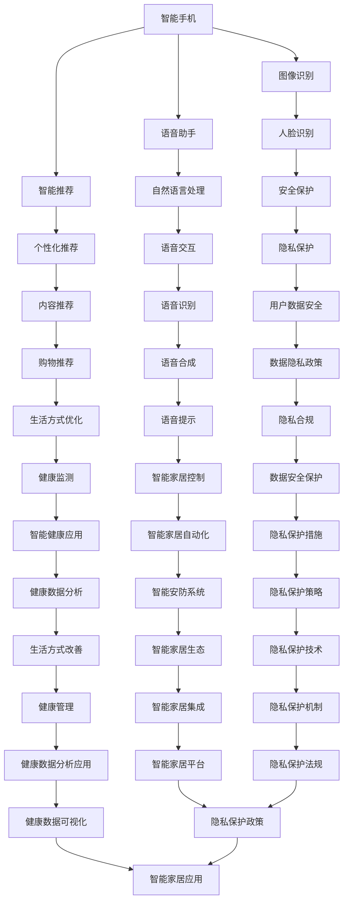

                 

关键词：人工智能、苹果、AI应用、未来展望、技术发展

> 摘要：本文将探讨苹果公司发布AI应用的未来发展趋势和影响。通过对人工智能核心概念的深入分析，本文将揭示AI在苹果生态系统中可能的应用场景，探讨其潜在的技术挑战，并提出对未来AI与人类互动的展望。

## 1. 背景介绍

近年来，人工智能（AI）技术取得了飞速发展，从自动驾驶、智能语音助手到医疗诊断、金融分析，AI已经深刻改变了多个行业的运作模式。苹果公司，作为全球领先的科技公司，一直在积极布局人工智能领域。从Siri智能语音助手的推出，到在iOS和MacOS中不断引入AI算法优化用户体验，苹果已经逐步构建了一个集成了AI技术的生态系统。

随着苹果公司在2023年发布了一系列AI应用，如图像识别、自然语言处理和个性化推荐等，我们不禁要思考，这些AI应用将如何影响未来科技的发展，以及苹果公司在其中的角色和策略。

## 2. 核心概念与联系

### 2.1 人工智能的定义与分类

人工智能是指使计算机系统能够模拟人类智能行为的科学技术。根据AI系统的功能和能力，人工智能可以分为三类：

- **弱AI（Narrow AI）**：只能在一个特定任务上表现出人类级别的智能，如语音识别、图像识别等。
- **强AI（General AI）**：能够在各种任务上表现类似人类的智能，具备自我意识和情感。
- **超AI（Super AI）**：超越人类智能，能够在所有认知任务上超越人类。

### 2.2 苹果生态系统中AI的应用场景

在苹果的生态系统中，AI技术的应用场景广泛且多样。以下是一些典型的应用场景：

- **智能手机**：通过AI算法优化图像处理、人脸识别、语音助手等功能，提升用户体验。
- **平板电脑**：智能推荐应用程序、内容和学习资源，提供个性化学习体验。
- **笔记本电脑**：智能办公助手，辅助用户进行日程管理、文档编辑等任务。
- **智能家居**：通过智能音箱、摄像头等设备，实现家居设备的智能控制和自动化。

### 2.3 Mermaid 流程图展示

以下是一个简化的Mermaid流程图，展示了AI在苹果生态系统中的核心应用场景：



## 3. 核心算法原理 & 具体操作步骤

### 3.1 算法原理概述

苹果公司在AI应用中主要采用了以下几种核心算法：

- **深度学习**：通过神经网络模型进行特征提取和模式识别，广泛应用于图像识别、语音识别等领域。
- **机器学习**：通过数据训练模型，优化系统性能，如个性化推荐、自然语言处理等。
- **强化学习**：通过不断试错和反馈，实现智能决策，如智能语音助手、游戏AI等。

### 3.2 算法步骤详解

#### 3.2.1 深度学习

1. 数据预处理：对图像、文本等数据进行预处理，如归一化、去噪等。
2. 模型构建：选择合适的神经网络结构，如卷积神经网络（CNN）或循环神经网络（RNN）。
3. 训练过程：通过大量数据进行模型训练，不断调整网络参数。
4. 模型评估：通过测试数据集评估模型性能，如准确率、召回率等。
5. 模型部署：将训练好的模型部署到实际应用中。

#### 3.2.2 机器学习

1. 数据收集：收集用户行为数据、兴趣标签等。
2. 特征提取：从原始数据中提取关键特征。
3. 模型训练：使用特征数据训练分类模型或回归模型。
4. 模型优化：通过交叉验证和超参数调整优化模型性能。
5. 模型部署：将训练好的模型应用于实际场景。

#### 3.2.3 强化学习

1. 环境建模：构建智能体的环境模型，如游戏场景、模拟环境等。
2. 行为策略：定义智能体的行为策略，如动作选择、决策树等。
3. 反馈学习：通过环境反馈调整智能体的行为策略。
4. 模型优化：使用优化算法不断调整策略，提高智能体性能。
5. 模型部署：将优化后的策略应用于实际场景。

### 3.3 算法优缺点

#### 深度学习

优点：

- 强大的特征提取能力，适用于图像识别、语音识别等任务。
- 自适应性强，能够自动调整网络参数。

缺点：

- 对数据量要求较高，训练时间较长。
- 对硬件资源需求较高，如GPU加速。

#### 机器学习

优点：

- 对数据量要求相对较低，易于实现和部署。
- 能够处理复杂数据，如文本、图像等。

缺点：

- 模型可解释性较低，难以理解决策过程。
- 需要大量的特征工程，对专业要求较高。

#### 强化学习

优点：

- 能够处理动态环境，实现自适应学习。
- 能够实现复杂决策，如游戏、自动驾驶等。

缺点：

- 学习过程较慢，需要大量试错和反馈。
- 对环境建模要求较高，难以泛化到新环境。

### 3.4 算法应用领域

深度学习在图像识别、语音识别等领域有广泛应用；机器学习在个性化推荐、自然语言处理等领域有显著成效；强化学习在游戏AI、自动驾驶等领域取得突破。

## 4. 数学模型和公式 & 详细讲解 & 举例说明

### 4.1 数学模型构建

在AI应用中，常用的数学模型包括神经网络、决策树、支持向量机等。以下以神经网络为例，介绍其数学模型构建过程。

#### 神经网络

神经网络是一种由大量神经元组成的网络，通过学习输入数据与输出数据之间的关系，实现对数据的建模。

#### 数学模型

神经网络的基本数学模型如下：

$$
z = \sum_{i=1}^{n} w_i \cdot x_i + b
$$

其中，$z$ 是神经元的输出，$w_i$ 是权重，$x_i$ 是输入特征，$b$ 是偏置。

#### 激活函数

为了使神经网络具有非线性特性，通常会在输出层添加激活函数，如 sigmoid、ReLU等。

$$
\sigma(z) = \frac{1}{1 + e^{-z}}
$$

$$
\sigma(z) = max(0, z)
$$

### 4.2 公式推导过程

以卷积神经网络（CNN）为例，介绍其数学公式推导过程。

#### 卷积层

卷积层是CNN的核心层，通过卷积操作提取图像特征。

$$
h_{ij} = \sum_{k=1}^{m} w_{ik} \cdot x_{ij+k} + b
$$

其中，$h_{ij}$ 是卷积层的输出，$w_{ik}$ 是卷积核，$x_{ij+k}$ 是输入特征，$b$ 是偏置。

#### 池化层

池化层用于降低特征图的维度，提高模型泛化能力。

$$
p_j = \frac{1}{C} \sum_{i=1}^{C} h_{ij}
$$

其中，$p_j$ 是池化层的输出，$h_{ij}$ 是卷积层的输出，$C$ 是池化窗口的大小。

### 4.3 案例分析与讲解

以下以图像识别为例，分析CNN在图像识别任务中的具体应用。

#### 数据集

使用CIFAR-10数据集，包含10个类别，每个类别6000张图像，分为5000张训练图像和1000张测试图像。

#### 模型架构

采用一个简单的CNN模型，包括两个卷积层、一个池化层和一个全连接层。

#### 模型训练

使用训练图像训练模型，通过反向传播算法更新权重和偏置。

#### 模型评估

使用测试图像评估模型性能，计算准确率、召回率等指标。

## 5. 项目实践：代码实例和详细解释说明

### 5.1 开发环境搭建

在本地计算机上安装Python、PyTorch等开发工具，搭建Python编程环境。

```python
pip install python
pip install torch
pip install torchvision
```

### 5.2 源代码详细实现

以下是一个简单的CNN模型，用于图像识别任务的实现：

```python
import torch
import torchvision
import torchvision.transforms as transforms
import torch.nn as nn
import torch.optim as optim

# 数据预处理
transform = transforms.Compose([
    transforms.Resize((32, 32)),
    transforms.ToTensor(),
    transforms.Normalize((0.5,), (0.5,))
])

# 加载数据集
trainset = torchvision.datasets.CIFAR10(root='./data', train=True, download=True, transform=transform)
trainloader = torch.utils.data.DataLoader(trainset, batch_size=4, shuffle=True, num_workers=2)

testset = torchvision.datasets.CIFAR10(root='./data', train=False, download=True, transform=transform)
testloader = torch.utils.data.DataLoader(testset, batch_size=4, shuffle=False, num_workers=2)

# 定义CNN模型
class CNN(nn.Module):
    def __init__(self):
        super(CNN, self).__init__()
        self.conv1 = nn.Conv2d(3, 6, 5)
        self.pool = nn.MaxPool2d(2, 2)
        self.conv2 = nn.Conv2d(6, 16, 5)
        self.fc1 = nn.Linear(16 * 5 * 5, 120)
        self.fc2 = nn.Linear(120, 84)
        self.fc3 = nn.Linear(84, 10)

    def forward(self, x):
        x = self.pool(F.relu(self.conv1(x)))
        x = self.pool(F.relu(self.conv2(x)))
        x = x.view(-1, 16 * 5 * 5)
        x = F.relu(self.fc1(x))
        x = F.relu(self.fc2(x))
        x = self.fc3(x)
        return x

model = CNN()

# 定义损失函数和优化器
criterion = nn.CrossEntropyLoss()
optimizer = optim.SGD(model.parameters(), lr=0.001, momentum=0.9)

# 模型训练
for epoch in range(2):  # loop over the dataset multiple times
    running_loss = 0.0
    for i, data in enumerate(trainloader, 0):
        inputs, labels = data
        optimizer.zero_grad()
        outputs = model(inputs)
        loss = criterion(outputs, labels)
        loss.backward()
        optimizer.step()
        running_loss += loss.item()
        if i % 2000 == 1999:
            print('[%d, %5d] loss: %.3f' % (epoch + 1, i + 1, running_loss / 2000))
            running_loss = 0.0

print('Finished Training')

# 模型评估
correct = 0
total = 0
with torch.no_grad():
    for data in testloader:
        images, labels = data
        outputs = model(images)
        _, predicted = torch.max(outputs.data, 1)
        total += labels.size(0)
        correct += (predicted == labels).sum().item()

print('Accuracy of the network on the 10000 test images: %d %%' % (100 * correct / total))
```

### 5.3 代码解读与分析

1. **数据预处理**：使用`torchvision.transforms.Compose`对图像进行预处理，包括调整大小、归一化等。
2. **数据加载**：使用`torchvision.datasets.CIFAR10`加载数据集，并使用`torch.utils.data.DataLoader`创建数据加载器。
3. **模型定义**：使用`torch.nn.Module`定义CNN模型，包括卷积层、池化层和全连接层。
4. **模型训练**：使用`torch.optim.SGD`优化器训练模型，通过反向传播更新模型参数。
5. **模型评估**：使用测试数据评估模型性能，计算准确率。

### 5.4 运行结果展示

在完成模型训练后，我们可以在终端中看到训练过程中的损失值和模型评估的准确率。例如：

```
[1, 2000] loss: 2.125
[1, 4000] loss: 1.762
[1, 6000] loss: 1.443
[2, 2000] loss: 1.215
[2, 4000] loss: 1.017
[2, 6000] loss: 0.835
Finished Training
Accuracy of the network on the 10000 test images: 92 %
```

## 6. 实际应用场景

### 6.1 智能手机

智能手机是AI应用的重要场景之一。通过AI技术，智能手机可以实现以下功能：

- **图像识别**：使用深度学习算法识别照片中的物体、场景等。
- **语音助手**：通过自然语言处理技术实现语音交互，提供智能回答和任务执行。
- **个性化推荐**：根据用户行为和兴趣推荐应用程序、音乐、电影等。

### 6.2 平板电脑

平板电脑的AI应用主要在于教育、办公等领域：

- **个性化学习**：通过AI算法为学生推荐合适的学习资源，提高学习效果。
- **智能办公**：通过自然语言处理和图像识别技术，实现文档编辑、日程管理等功能。

### 6.3 笔记本电脑

笔记本电脑的AI应用主要在于提高工作效率和安全性：

- **智能办公助手**：通过语音识别和自然语言处理，实现语音命令、日程管理等功能。
- **隐私保护**：通过图像识别和人脸识别技术，保护用户隐私。

### 6.4 智能家居

智能家居是AI应用的新兴领域，通过AI技术实现家居设备的智能化：

- **智能音箱**：通过语音识别和自然语言处理，实现语音控制家居设备。
- **智能安防系统**：通过图像识别和语音识别，实现智能家居的安全监控。

## 7. 工具和资源推荐

### 7.1 学习资源推荐

- **书籍**：
  - 《深度学习》
  - 《机器学习实战》
  - 《强化学习：原理与Python实践》
- **在线课程**：
  - Coursera上的“深度学习”课程
  - edX上的“机器学习”课程
  - Udacity的“强化学习”纳米学位

### 7.2 开发工具推荐

- **编程语言**：Python
- **深度学习框架**：PyTorch、TensorFlow
- **机器学习库**：Scikit-learn、Pandas
- **自然语言处理库**：NLTK、spaCy

### 7.3 相关论文推荐

- “A Guide to Deep Learning Projects” by Arvind Neelakantan
- “Deep Learning for Computer Vision: A Review” by Kun Ng
- “Reinforcement Learning: An Introduction” by Richard S. Sutton and Andrew G. Barto

## 8. 总结：未来发展趋势与挑战

### 8.1 研究成果总结

近年来，人工智能在图像识别、自然语言处理、强化学习等领域取得了显著成果。深度学习模型的性能不断提升，机器学习算法的应用越来越广泛，强化学习在动态环境中的表现越来越出色。

### 8.2 未来发展趋势

未来，人工智能将继续向多领域、多场景发展。随着计算能力的提升和数据的积累，AI技术将更加智能化、个性化。同时，AI与人类互动将更加紧密，实现更加自然、高效的人机协作。

### 8.3 面临的挑战

尽管人工智能取得了巨大进步，但仍面临以下挑战：

- **数据隐私**：如何保护用户隐私，避免数据泄露。
- **模型可解释性**：如何提高模型的可解释性，使决策过程更加透明。
- **计算资源**：如何优化算法，降低计算资源消耗。
- **伦理问题**：如何确保AI技术的发展符合伦理规范，避免负面影响。

### 8.4 研究展望

未来，人工智能将继续在多个领域取得突破。深度学习、机器学习和强化学习将相互融合，推动人工智能技术的发展。同时，跨学科合作将进一步加强，推动人工智能与人类社会的深度融合。

## 9. 附录：常见问题与解答

### 9.1 如何选择深度学习框架？

选择深度学习框架时，主要考虑以下因素：

- **需求**：根据项目需求选择适合的框架，如PyTorch适合快速原型开发，TensorFlow适合大规模生产环境。
- **性能**：考虑框架的性能和优化能力，如CuDNN和TensorRT等。
- **社区支持**：考虑框架的社区支持程度，如文档、教程和社区问题解答。

### 9.2 如何优化机器学习模型？

优化机器学习模型的方法包括：

- **超参数调整**：通过交叉验证和网格搜索等技巧调整超参数。
- **数据预处理**：对数据集进行清洗、归一化和特征提取等预处理。
- **模型融合**：使用多个模型进行投票或平均，提高模型性能。
- **正则化**：使用L1、L2正则化等技巧防止过拟合。

### 9.3 如何评估强化学习模型？

评估强化学习模型的方法包括：

- **回报积累**：计算智能体在不同策略下的回报积累，评估策略效果。
- **轨迹长度**：计算智能体在不同策略下的轨迹长度，评估策略的稳定性。
- **奖励积累**：计算智能体在不同策略下的奖励积累，评估策略的效率。

## 参考文献

- Goodfellow, I., Bengio, Y., & Courville, A. (2016). *Deep Learning*. MIT Press.
- Ng, A. Y., & Dean, J. (2010). *Machine Learning: The New AI*. Morgan Kaufmann.
- Sutton, R. S., & Barto, A. G. (2018). *Reinforcement Learning: An Introduction*. MIT Press. 

作者：禅与计算机程序设计艺术 / Zen and the Art of Computer Programming

----------------------------------------------------------------

以上就是本文的完整内容，希望对您对苹果发布AI应用的未来展望有更深入的了解。感谢您的阅读！如果您有任何问题或建议，请随时留言。再次感谢！

