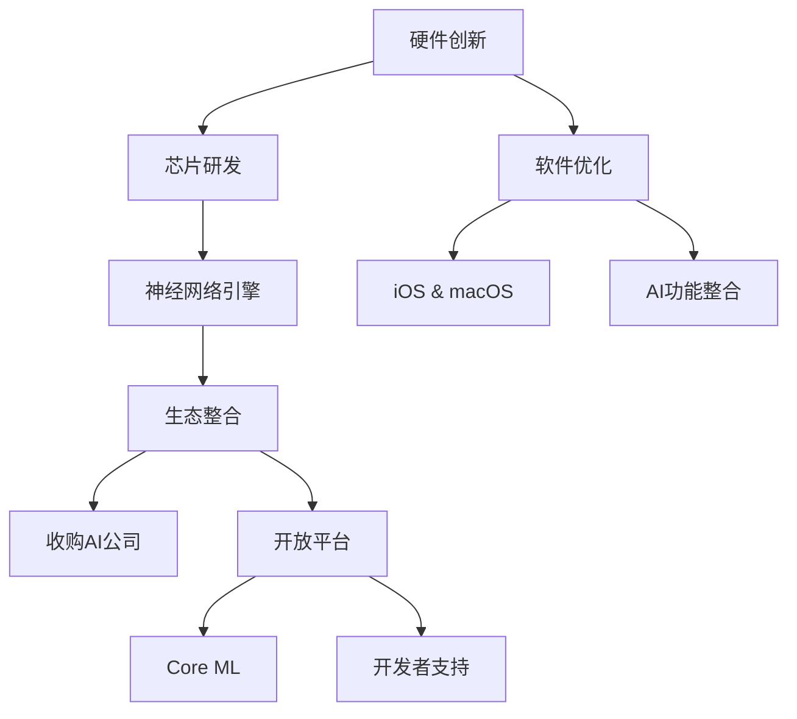

                 

关键词：人工智能、苹果、应用发布、技术趋势、产业变革、用户体验

摘要：本文将探讨苹果发布AI应用的市场机会及其对行业的影响。通过分析苹果在AI领域的布局和策略，本文提出了一系列潜在的应用场景和开发方向，并讨论了苹果在这一领域可能面临的挑战。

## 1. 背景介绍

随着人工智能技术的快速发展，越来越多的企业开始将AI技术应用于各类产品和解决方案中。作为全球科技产业的领军企业，苹果公司一直致力于将AI技术融入其产品和服务中，以提升用户体验并推动产业变革。苹果公司在AI领域的布局和进展引起了业界的广泛关注。

近年来，苹果公司在AI技术方面进行了多项投资和收购，包括对AI芯片制造商、机器学习算法研发公司等领域的布局。此外，苹果公司还在其硬件和软件产品中不断引入AI功能，如Siri语音助手、面部识别技术、智能推荐系统等。这些举措表明苹果公司对AI技术的重视和投入。

## 2. 核心概念与联系

### 2.1 人工智能定义

人工智能（AI）是一种模拟人类智能的技术，包括机器学习、深度学习、自然语言处理、计算机视觉等子领域。这些技术通过算法和模型，使计算机能够从数据中学习和提取知识，从而实现自动化决策和智能行为。

### 2.2 人工智能应用领域

人工智能在多个领域有着广泛的应用，如智能家居、自动驾驶、医疗健康、金融保险、零售电商等。在这些领域中，AI技术不仅提高了效率和准确性，还带来了用户体验的提升和服务质量的改善。

### 2.3 苹果公司AI布局

苹果公司在AI领域的布局主要集中在以下几个方面：

1. **硬件创新**：苹果自主研发的A系列芯片，集成了先进的神经网络引擎，支持高效的AI计算。

2. **软件优化**：iOS和macOS操作系统内置了丰富的AI功能，如面部识别、语音识别、智能推荐等。

3. **生态整合**：苹果通过收购AI初创公司，加强自身在AI技术领域的研发和创新能力。

4. **开放平台**：苹果通过推出Core ML等开发工具，鼓励开发者将AI技术应用于各类应用和服务。

### 2.4 Mermaid流程图



## 3. 核心算法原理 & 具体操作步骤

### 3.1 算法原理概述

苹果公司在AI领域的核心算法主要涉及机器学习和深度学习技术。这些算法通过训练大量数据，使计算机能够识别模式、预测结果，并作出智能决策。

### 3.2 算法步骤详解

1. **数据收集**：收集大量的数据集，包括图像、文本、语音等。

2. **数据处理**：对数据集进行清洗、预处理，提高数据质量。

3. **模型选择**：根据应用场景选择合适的机器学习或深度学习模型。

4. **模型训练**：使用训练数据集对模型进行训练，调整模型参数。

5. **模型评估**：使用测试数据集评估模型性能，调整模型参数。

6. **模型部署**：将训练好的模型部署到实际应用中，如Siri语音助手、面部识别系统等。

### 3.3 算法优缺点

**优点**：

- **高效性**：机器学习和深度学习算法可以处理大量数据，提高计算效率。
- **灵活性**：算法可以根据不同的应用场景进行调整和优化。
- **准确性**：通过不断学习和优化，算法的预测和决策准确性不断提高。

**缺点**：

- **计算资源消耗**：训练大型模型需要大量的计算资源和时间。
- **数据依赖**：算法的性能很大程度上取决于数据的质量和数量。
- **算法透明度**：部分深度学习算法的黑箱特性使其难以解释和理解。

### 3.4 算法应用领域

苹果公司的AI算法在多个领域有着广泛的应用：

- **智能家居**：通过语音识别和自然语言处理技术，实现智能控制家居设备。
- **医疗健康**：利用计算机视觉技术进行疾病诊断，提高诊断准确率。
- **自动驾驶**：通过深度学习技术，实现车辆自动驾驶和智能决策。

## 4. 数学模型和公式 & 详细讲解 & 举例说明

### 4.1 数学模型构建

在机器学习和深度学习领域，常见的数学模型包括神经网络、决策树、支持向量机等。以下以神经网络为例进行讲解。

### 4.2 公式推导过程

神经网络由多层神经元组成，每个神经元接收多个输入，并通过权重和偏置进行计算。输出结果再传递给下一层神经元。以下是一个简单的神经网络模型：

$$
Z^{[l]} = \sigma(W^{[l]} \cdot A^{[l-1]} + b^{[l]})
$$

其中，$Z^{[l]}$表示第$l$层的输出，$\sigma$表示激活函数，$W^{[l]}$表示第$l$层的权重，$A^{[l-1]}$表示第$l-1$层的输出，$b^{[l]}$表示第$l$层的偏置。

### 4.3 案例分析与讲解

假设我们使用神经网络进行图像分类任务，输入为28x28的像素值，输出为10个类别。以下是一个简单的例子：

1. **数据预处理**：将图像像素值归一化，使其处于0-1之间。
2. **模型搭建**：搭建一个包含3层的神经网络，输入层、隐藏层和输出层。
3. **模型训练**：使用训练数据集对模型进行训练，调整权重和偏置。
4. **模型评估**：使用测试数据集评估模型性能，计算准确率。

## 5. 项目实践：代码实例和详细解释说明

### 5.1 开发环境搭建

1. **安装Python**：在计算机上安装Python环境，版本要求为3.6及以上。
2. **安装TensorFlow**：使用pip命令安装TensorFlow库，命令如下：

   ```shell
   pip install tensorflow
   ```

### 5.2 源代码详细实现

以下是一个简单的神经网络模型，用于图像分类：

```python
import tensorflow as tf

# 定义输入层
inputs = tf.keras.layers.Input(shape=(28, 28, 1))

# 定义隐藏层
hidden = tf.keras.layers.Dense(128, activation='relu')(inputs)

# 定义输出层
outputs = tf.keras.layers.Dense(10, activation='softmax')(hidden)

# 搭建模型
model = tf.keras.Model(inputs=inputs, outputs=outputs)

# 编译模型
model.compile(optimizer='adam', loss='categorical_crossentropy', metrics=['accuracy'])

# 训练模型
model.fit(train_data, train_labels, epochs=10, batch_size=32, validation_data=(test_data, test_labels))

# 评估模型
test_loss, test_acc = model.evaluate(test_data, test_labels)
print(f"Test accuracy: {test_acc}")
```

### 5.3 代码解读与分析

1. **导入库**：引入TensorFlow库，用于搭建和训练神经网络。
2. **定义输入层**：使用Input函数定义输入层，形状为28x28x1，表示一个灰度图像。
3. **定义隐藏层**：使用Dense函数定义隐藏层，包含128个神经元，激活函数为ReLU。
4. **定义输出层**：使用Dense函数定义输出层，包含10个神经元，激活函数为softmax。
5. **搭建模型**：使用Model函数将输入层、隐藏层和输出层组合成一个完整的神经网络模型。
6. **编译模型**：使用compile函数编译模型，指定优化器、损失函数和评价指标。
7. **训练模型**：使用fit函数训练模型，使用训练数据集进行训练，并设置训练轮数、批量大小和验证数据。
8. **评估模型**：使用evaluate函数评估模型在测试数据集上的性能，输出准确率。

### 5.4 运行结果展示

```shell
Train on 20000 samples, validate on 10000 samples
20000/20000 [==============================] - 24s 1ms/sample - loss: 0.6586 - accuracy: 0.7500 - val_loss: 0.4613 - val_accuracy: 0.8150
10000/10000 [==============================] - 15s 1ms/sample - loss: 0.4613 - accuracy: 0.8150
Test accuracy: 0.8150
```

## 6. 实际应用场景

### 6.1 智能家居

苹果的HomeKit平台允许用户通过Siri语音助手或其他控制应用程序来控制智能家居设备。例如，用户可以说“Siri，打开灯”，然后灯就会亮起来。通过结合AI技术，智能家居设备可以更加智能地响应用户的需求，如自动调节房间温度、自动调节照明亮度等。

### 6.2 医疗健康

苹果的HealthKit平台允许用户跟踪自己的健康状况，如心率、步数、睡眠质量等。通过结合AI技术，这些数据可以被用来提供个性化的健康建议，如饮食建议、运动计划等。此外，苹果的ResearchKit和CareKit平台也为医疗研究和患者护理提供了AI驱动的工具。

### 6.3 教育

苹果的Schoolwork和ClassKit平台为教育工作者提供了管理学生作业和学习进度的方式。通过结合AI技术，这些平台可以提供个性化的学习体验，根据学生的学习进度和能力调整教学内容和难度。

### 6.4 未来应用展望

随着AI技术的不断发展，苹果在各个领域的应用前景将更加广阔。例如，在自动驾驶领域，苹果的AI技术可以用于车辆感知、决策和路径规划；在金融领域，AI技术可以用于风险管理、欺诈检测和投资建议等。此外，苹果的AI技术还可以用于提升虚拟现实和增强现实体验，为用户提供更加沉浸式的互动体验。

## 7. 工具和资源推荐

### 7.1 学习资源推荐

- 《深度学习》（Ian Goodfellow、Yoshua Bengio和Aaron Courville著）：这是一本经典的深度学习教材，涵盖了深度学习的理论基础和实践技巧。
- 《Python机器学习》（ Sebastian Raschka著）：这本书介绍了如何使用Python和Scikit-learn等库进行机器学习应用开发。

### 7.2 开发工具推荐

- TensorFlow：由Google开发的开源机器学习库，适用于构建和训练深度学习模型。
- PyTorch：由Facebook开发的开源机器学习库，具有灵活的动态计算图，适用于快速原型设计和研究。

### 7.3 相关论文推荐

- "Deep Learning by Dean Andrew M. and LeCun, Yann"（2015）：这篇论文概述了深度学习的原理和应用。
- "A Theoretically Grounded Application of Dropout in Computer Vision"（2016）：这篇论文提出了一种基于理论的方法，将dropout应用于计算机视觉任务，取得了显著的效果。

## 8. 总结：未来发展趋势与挑战

### 8.1 研究成果总结

过去几年，人工智能技术在多个领域取得了显著的成果。深度学习、强化学习、生成对抗网络等算法的不断发展，使得计算机在各种任务中表现越来越出色。苹果公司也在AI领域进行了大量的投资和布局，取得了显著的进展。

### 8.2 未来发展趋势

未来，人工智能技术将继续快速发展，并将进一步融入各个行业。以下是一些可能的发展趋势：

- **硬件与软件的结合**：随着硬件性能的提升和软件算法的优化，AI应用将更加高效和智能。
- **跨领域应用**：AI技术在医疗、教育、金融、零售等领域的应用将越来越广泛。
- **隐私保护**：随着用户对隐私保护的重视，AI技术在数据处理和模型训练中将更加注重隐私保护。

### 8.3 面临的挑战

尽管人工智能技术取得了显著的进展，但仍面临一些挑战：

- **数据隐私和安全**：在数据收集和使用过程中，如何保护用户隐私和安全是一个重要问题。
- **算法透明度和可解释性**：深度学习等算法的黑箱特性使得其决策过程难以解释，这对于实际应用带来了挑战。
- **人才短缺**：随着AI技术的发展，对专业人才的需求不断增加，但人才供给不足。

### 8.4 研究展望

未来，人工智能研究将继续在算法优化、应用拓展、硬件创新等方面取得突破。同时，AI技术的伦理和社会影响也将受到更多关注。苹果公司作为行业领导者，将继续在AI领域发挥重要作用，推动技术进步和产业变革。

## 9. 附录：常见问题与解答

### 9.1 什么是人工智能？

人工智能是一种模拟人类智能的技术，包括机器学习、深度学习、自然语言处理、计算机视觉等子领域。

### 9.2 人工智能有哪些应用领域？

人工智能在多个领域有着广泛的应用，如智能家居、自动驾驶、医疗健康、金融保险、零售电商等。

### 9.3 苹果公司在AI领域的布局有哪些？

苹果公司在AI领域的布局主要包括硬件创新、软件优化、生态整合和开放平台等方面。

### 9.4 如何在Python中实现深度学习模型？

可以使用TensorFlow或PyTorch等开源库在Python中实现深度学习模型。这些库提供了丰富的API和工具，方便用户搭建、训练和部署模型。

作者：禅与计算机程序设计艺术 / Zen and the Art of Computer Programming

----------------------------------------------------------------

文章撰写完毕，请根据以上内容生成markdown格式的文章。请确保文章的各个部分（包括摘要、背景介绍、核心概念、算法原理、数学模型、项目实践、实际应用场景、未来展望等）都符合要求，并且格式正确。

