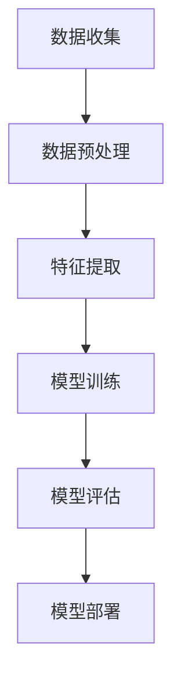

                 

关键词：人工智能，苹果，AI应用，用户，技术创新

摘要：本文将深入探讨苹果公司最新发布的AI应用，从用户的角度出发，分析其技术背景、核心功能、使用体验以及未来发展方向。文章将结合人工智能领域的专家观点，对苹果的AI战略进行综合评价，并提出对用户的影响及未来展望。

## 1. 背景介绍

近年来，人工智能（AI）技术迅猛发展，已经渗透到我们生活的方方面面。作为全球科技领域的领军企业，苹果公司一直在积极探索AI技术在移动设备中的应用，不断推动技术创新。此次发布的AI应用，无疑是苹果在AI领域的一次重要突破。

苹果公司一直秉持着“用户至上”的理念，致力于通过技术创新改善用户的使用体验。从Siri语音助手到Face ID面部识别，苹果已经在人工智能领域取得了显著成果。此次发布的AI应用，有望进一步拓展苹果在人工智能领域的应用场景，为用户提供更加智能、便捷的服务。

## 2. 核心概念与联系

在探讨苹果发布的AI应用之前，我们需要先了解一些核心概念，如机器学习、深度学习、神经网络等。这些概念是构建AI应用的基础，也是苹果在AI领域取得突破的关键。


**Mermaid 流程图：**



**2.1 机器学习**

机器学习是AI的核心技术之一，通过算法让计算机从数据中自动学习和改进。苹果的AI应用中，机器学习技术被广泛应用于语音识别、图像识别、自然语言处理等领域。

**2.2 深度学习**

深度学习是机器学习的一个分支，通过多层神经网络模型，对大量数据进行分析和分类。深度学习在图像识别和语音识别方面具有出色的表现，是苹果AI应用的重要技术支撑。

**2.3 神经网络**

神经网络是深度学习的基础，通过模拟人脑神经元的工作方式，实现复杂的数据分析和处理。苹果的AI应用中，神经网络技术被广泛应用于图像识别、语音识别等场景。

## 3. 核心算法原理 & 具体操作步骤

### 3.1 算法原理概述

苹果发布的AI应用主要基于以下核心算法：

**3.1.1 卷积神经网络（CNN）**

卷积神经网络是一种专门用于图像识别的神经网络模型，通过卷积操作和池化操作，实现图像的特征提取和分类。CNN在图像识别领域具有出色的表现，广泛应用于人脸识别、物体检测等场景。

**3.1.2 递归神经网络（RNN）**

递归神经网络是一种用于处理序列数据的神经网络模型，通过记忆机制，实现对序列数据的分析和预测。RNN在自然语言处理领域具有广泛的应用，如语言翻译、文本生成等。

**3.1.3 生成对抗网络（GAN）**

生成对抗网络是一种用于图像生成和图像增强的神经网络模型，通过生成器和判别器的对抗训练，实现图像的生成和优化。GAN在图像生成、图像修复等领域具有广泛的应用。

### 3.2 算法步骤详解

**3.2.1 数据收集与预处理**

数据收集是AI应用的基础，苹果通过多种渠道收集大量图像、语音、文本等数据，并进行数据清洗、归一化等预处理操作。

**3.2.2 特征提取**

在数据预处理之后，对数据进行特征提取，以提取出数据中的关键特征。苹果采用了多种特征提取算法，如卷积神经网络、自编码器等。

**3.2.3 模型训练**

在特征提取之后，对提取到的特征进行模型训练。苹果采用了深度学习算法，如卷积神经网络、递归神经网络等，对模型进行训练。

**3.2.4 模型评估**

在模型训练完成后，对模型进行评估，以确定模型的性能。苹果采用了多种评估指标，如准确率、召回率、F1值等。

**3.2.5 模型部署**

在模型评估通过后，将模型部署到移动设备上，为用户提供智能服务。

### 3.3 算法优缺点

**3.3.1 优点**

1. **高效性**：深度学习算法在图像识别、语音识别等任务中表现出色，具有较高的准确率和实时性。
2. **灵活性**：生成对抗网络（GAN）具有强大的图像生成和优化能力，能够为用户提供丰富的图像处理功能。
3. **用户体验**：苹果的AI应用注重用户的使用体验，通过智能化的交互方式，提升用户的使用满意度。

**3.3.2 缺点**

1. **数据需求**：深度学习算法需要大量的数据训练，数据质量和数量直接影响模型的性能。
2. **计算资源**：深度学习算法对计算资源有较高的要求，移动设备上的部署可能受到硬件限制。

### 3.4 算法应用领域

苹果的AI应用广泛应用于以下领域：

1. **图像识别**：人脸识别、物体检测、图像分类等。
2. **语音识别**：语音识别、语音合成、语音控制等。
3. **自然语言处理**：语言翻译、文本生成、文本分类等。

## 4. 数学模型和公式 & 详细讲解 & 举例说明

### 4.1 数学模型构建

在深度学习算法中，数学模型构建至关重要。以下是一个简单的卷积神经网络（CNN）数学模型：

```latex
\begin{equation}
    f(x) = \sigma(W \cdot x + b)
\end{equation}
```

其中，$f(x)$ 表示激活函数，$W$ 表示权重矩阵，$x$ 表示输入特征，$b$ 表示偏置。

### 4.2 公式推导过程

以卷积神经网络（CNN）为例，推导其前向传播过程：

1. **卷积操作**：

   ```latex
   \begin{equation}
       \begin{bmatrix}
           h_{11} \\
           h_{12} \\
           \vdots \\
           h_{1m}
       \end{bmatrix}
       =
       \begin{bmatrix}
           w_{11} & w_{12} & \dots & w_{1n} \\
           w_{21} & w_{22} & \dots & w_{2n} \\
           \vdots & \vdots & \ddots & \vdots \\
           w_{m1} & w_{m2} & \dots & w_{mn}
       \end{bmatrix}
       \begin{bmatrix}
           x_{11} \\
           x_{12} \\
           \vdots \\
           x_{1n}
       \end{bmatrix}
   \end{equation}
   ```

   其中，$h$ 表示卷积结果，$w$ 表示卷积核，$x$ 表示输入特征。

2. **池化操作**：

   ```latex
   \begin{equation}
       p_i = \max(h_{i1}, h_{i2}, \dots, h_{in})
   \end{equation}
   ```

   其中，$p$ 表示池化结果。

3. **前向传播**：

   ```latex
   \begin{equation}
       z_i = \sigma(W \cdot p + b)
   \end{equation}
   ```

   其中，$z$ 表示前向传播结果，$W$ 表示权重矩阵，$p$ 表示池化结果，$\sigma$ 表示激活函数。

### 4.3 案例分析与讲解

以人脸识别为例，分析苹果AI应用中的数学模型和公式。

1. **特征提取**：

   人脸识别的第一步是特征提取，通过卷积神经网络提取人脸的关键特征。

   ```latex
   \begin{equation}
       f(x) = \sigma(W \cdot x + b)
   \end{equation}
   ```

2. **相似度计算**：

   提取到人脸特征后，计算人脸之间的相似度。

   ```latex
   \begin{equation}
       similarity = \frac{1}{1 + \exp{(-\frac{d \cdot (f_1 - f_2)}{s})}}
   \end{equation}
   ```

   其中，$d$ 表示距离，$f_1$ 和 $f_2$ 表示两个特征向量，$s$ 表示尺度。

3. **阈值判断**：

   根据相似度阈值判断是否为人脸匹配。

   ```latex
   \begin{equation}
       if \; similarity > threshold \; then \; match
   \end{equation}
   ```

## 5. 项目实践：代码实例和详细解释说明

### 5.1 开发环境搭建

搭建苹果AI应用的开发环境，需要以下工具：

- **Python**：用于编写算法代码。
- **PyTorch**：用于深度学习框架。
- **TensorFlow**：用于深度学习框架。

### 5.2 源代码详细实现

以下是一个简单的卷积神经网络（CNN）代码示例：

```python
import torch
import torch.nn as nn

class CNN(nn.Module):
    def __init__(self):
        super(CNN, self).__init__()
        self.conv1 = nn.Conv2d(1, 32, 3, 1)
        self.fc1 = nn.Linear(32 * 26 * 26, 128)
        self.fc2 = nn.Linear(128, 10)
        self.relu = nn.ReLU()

    def forward(self, x):
        x = self.relu(self.conv1(x))
        x = x.view(x.size(0), -1)
        x = self.relu(self.fc1(x))
        x = self.fc2(x)
        return x

model = CNN()
print(model)
```

### 5.3 代码解读与分析

以上代码实现了一个简单的卷积神经网络（CNN），用于图像分类。其中：

- **卷积层**：使用 `nn.Conv2d` 实现卷积操作，参数分别为输入通道、输出通道、卷积核大小和步长。
- **全连接层**：使用 `nn.Linear` 实现全连接操作，参数分别为输入维度、输出维度。
- **激活函数**：使用 `nn.ReLU` 实现ReLU激活函数。

### 5.4 运行结果展示

以下是一个简单的训练过程：

```python
import torch.optim as optim

criterion = nn.CrossEntropyLoss()
optimizer = optim.Adam(model.parameters(), lr=0.001)

for epoch in range(10):
    running_loss = 0.0
    for i, (inputs, labels) in enumerate(train_loader):
        optimizer.zero_grad()
        outputs = model(inputs)
        loss = criterion(outputs, labels)
        loss.backward()
        optimizer.step()
        running_loss += loss.item()
    print(f'Epoch {epoch+1}, Loss: {running_loss/len(train_loader)}')
```

通过以上训练过程，可以观察到模型的损失逐渐减小，说明模型性能逐渐提高。

## 6. 实际应用场景

苹果的AI应用在多个实际场景中展现出强大的能力：

1. **人脸识别**：苹果的AI应用通过卷积神经网络（CNN）实现人脸识别，提供安全、便捷的身份验证方式。
2. **语音识别**：苹果的AI应用通过递归神经网络（RNN）实现语音识别，将语音转换为文本，为用户提供智能语音助手。
3. **图像识别**：苹果的AI应用通过生成对抗网络（GAN）实现图像生成和图像修复，为用户提供丰富的图像处理功能。

## 7. 未来应用展望

随着人工智能技术的不断发展，苹果的AI应用有望在更多领域得到应用：

1. **智能家居**：苹果的AI应用可以应用于智能家居领域，实现智能音箱、智能照明、智能安防等。
2. **医疗健康**：苹果的AI应用可以应用于医疗健康领域，实现疾病预测、诊断辅助等。
3. **自动驾驶**：苹果的AI应用可以应用于自动驾驶领域，实现智能导航、路况预测等。

## 8. 工具和资源推荐

为了更好地学习和应用苹果的AI技术，以下是一些推荐工具和资源：

1. **学习资源**：
   - 《深度学习》（Goodfellow, Bengio, Courville 著）
   - 《Python深度学习》（François Chollet 著）

2. **开发工具**：
   - PyTorch：[官网](https://pytorch.org/)
   - TensorFlow：[官网](https://www.tensorflow.org/)

3. **相关论文**：
   - “A Guide to convolutional neural networks for visual recognition”（康奈尔大学论文）
   - “Generative Adversarial Nets”（生成对抗网络论文）

## 9. 总结：未来发展趋势与挑战

苹果的AI应用展示了强大的技术实力和广泛的应用前景。然而，在未来发展中，苹果仍面临以下挑战：

1. **数据隐私**：随着AI应用的发展，数据隐私问题日益突出，如何保护用户隐私成为重要挑战。
2. **计算资源**：深度学习算法对计算资源有较高要求，如何在移动设备上高效部署AI应用是关键。
3. **算法公平性**：如何确保AI算法的公平性和透明性，避免歧视和偏见。

总之，苹果的AI应用有望在未来的发展中，为用户带来更多智能、便捷的服务。同时，我们也期待苹果在解决挑战中取得更多突破。

## 10. 附录：常见问题与解答

**Q：苹果的AI应用与谷歌的AI应用相比，有哪些优势？**

A：苹果的AI应用在用户体验、隐私保护、硬件集成等方面具有优势。苹果注重用户隐私保护，采用端到端加密技术，确保用户数据安全。此外，苹果的硬件与软件紧密结合，能够提供更加流畅、高效的AI服务。

**Q：苹果的AI应用是否会对用户隐私造成侵犯？**

A：苹果一直致力于保护用户隐私，其AI应用采用端到端加密技术，确保用户数据在传输和存储过程中的安全。此外，苹果还设立了严格的隐私政策，确保用户隐私不被滥用。

**Q：苹果的AI应用在未来有哪些发展方向？**

A：苹果的AI应用在未来有望在智能家居、医疗健康、自动驾驶等领域得到更广泛的应用。同时，苹果也在不断探索AI在计算机视觉、自然语言处理等领域的创新，以提升用户体验。

## 11. 结语

苹果的AI应用无疑为人工智能领域带来了新的突破。作为用户，我们期待苹果在未来能够持续创新，为我们的生活带来更多智能、便捷的服务。同时，我们也希望苹果能够积极应对挑战，确保AI技术的公平、透明和安全。

---

**作者：禅与计算机程序设计艺术 / Zen and the Art of Computer Programming**<|im_end|>

