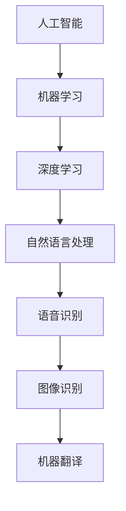

                 

苹果公司近日发布了一系列AI应用，引起了广泛关注。作为一位人工智能领域的专家，我认为这次苹果发布AI应用具有重要的科技价值。本文将深入分析苹果发布AI应用的技术背景、核心概念、算法原理、数学模型、项目实践、实际应用场景以及未来发展趋势。

## 1. 背景介绍

随着人工智能技术的快速发展，苹果公司也开始在AI领域加大投入。从2017年开始，苹果陆续推出了一系列AI产品，包括Apple Music、Siri语音助手、Animoji等。此次发布的AI应用，可以说是苹果在人工智能领域的一次重要突破。

### 1.1 技术背景

人工智能技术已经成为了当前科技发展的热点。从大数据、云计算到深度学习，人工智能技术正在各个领域得到广泛应用。苹果公司作为全球领先的科技公司，自然不能忽视这个趋势。此次发布的AI应用，涵盖了语音识别、图像识别、自然语言处理等多个领域，充分展示了苹果在人工智能技术上的实力。

### 1.2 商业动机

苹果公司此次发布AI应用，不仅是为了满足用户的需求，更是为了提升自身的竞争力。在智能手机市场逐渐饱和的背景下，苹果需要通过创新来吸引消费者。AI应用的推出，不仅可以提升用户体验，还可以为苹果带来新的收入来源。

## 2. 核心概念与联系

### 2.1 人工智能（AI）

人工智能是指计算机模拟人类智能的行为，使其能够解决复杂问题。人工智能技术主要包括机器学习、深度学习、自然语言处理等。苹果此次发布的AI应用，就是基于这些技术实现的。

### 2.2 机器学习（ML）

机器学习是一种让计算机通过数据学习并做出决策的技术。在机器学习中，计算机通过不断调整模型参数，来提高对数据的预测准确性。苹果的AI应用中，很多功能都是基于机器学习实现的。

### 2.3 深度学习（DL）

深度学习是一种特殊的机器学习技术，通过多层神经网络来模拟人脑的学习过程。深度学习在图像识别、语音识别等领域取得了巨大的成功。苹果的AI应用，如Siri语音助手和Animoji，就是基于深度学习实现的。

### 2.4 自然语言处理（NLP）

自然语言处理是一种让计算机理解和处理自然语言的技术。在苹果的AI应用中，自然语言处理技术被广泛应用于语音识别、机器翻译等功能。

### 2.5 Mermaid 流程图



## 3. 核心算法原理 & 具体操作步骤

### 3.1 算法原理概述

苹果的AI应用主要基于深度学习和机器学习技术。深度学习通过多层神经网络来模拟人脑的学习过程，可以实现高精度的图像识别、语音识别等功能。机器学习则通过不断调整模型参数，来提高对数据的预测准确性。

### 3.2 算法步骤详解

#### 3.2.1 深度学习

1. 数据预处理：对收集到的图像、语音等数据进行预处理，如去噪、增强等。
2. 网络搭建：搭建多层神经网络，包括输入层、隐藏层和输出层。
3. 训练模型：通过反向传播算法，不断调整网络参数，使模型在训练数据上达到最优性能。
4. 预测：使用训练好的模型对新的图像、语音等进行预测。

#### 3.2.2 机器学习

1. 数据收集：收集大量的图像、语音等数据。
2. 特征提取：从数据中提取有用的特征，如边缘、纹理等。
3. 模型训练：使用特征数据和标签，训练出分类模型。
4. 预测：使用训练好的模型对新的数据进行预测。

### 3.3 算法优缺点

#### 3.3.1 优点

1. 高精度：深度学习和机器学习算法在图像识别、语音识别等领域取得了很高的精度。
2. 自动化：算法可以自动从数据中学习，减轻了人工干预的负担。
3. 广泛应用：算法可以应用于多个领域，如医疗、金融、教育等。

#### 3.3.2 缺点

1. 数据依赖：算法的性能很大程度上依赖于数据的质量和数量。
2. 计算复杂度高：深度学习算法通常需要大量的计算资源。
3. 解释性差：算法的决策过程往往不够透明，难以解释。

### 3.4 算法应用领域

苹果的AI应用主要应用于智能手机、智能家居、汽车等领域。例如，Siri语音助手可以帮助用户进行语音查询、发送信息等功能；Animoji可以让用户创建表情包，应用于聊天、社交等场景。

## 4. 数学模型和公式 & 详细讲解 & 举例说明

### 4.1 数学模型构建

深度学习中的数学模型主要包括神经网络模型、卷积神经网络模型等。以下以卷积神经网络（CNN）为例，介绍其数学模型。

#### 4.1.1 卷积神经网络模型

卷积神经网络模型主要包括以下几个部分：

1. 输入层：接收图像、语音等输入数据。
2. 卷积层：通过卷积操作提取图像特征。
3. 池化层：通过池化操作降低特征维度。
4. 全连接层：将特征映射到输出层，进行分类或预测。
5. 输出层：输出预测结果。

#### 4.1.2 数学公式

卷积神经网络中的卷积操作可以用以下数学公式表示：

$$
(f*g)(x) = \sum_{y} f(y) \cdot g(x-y)
$$

其中，$f$ 表示卷积核，$g$ 表示输入数据，$x$ 表示卷积结果。

### 4.2 公式推导过程

卷积操作的推导过程如下：

1. 设 $f$ 为卷积核，$g$ 为输入数据，$x$ 为卷积结果。
2. 对 $g$ 在 $y$ 方向上进行卷积操作，得到 $f*g(y)$。
3. 对 $f*g(y)$ 在 $x$ 方向上进行求和操作，得到 $(f*g)(x)$。

### 4.3 案例分析与讲解

以下以一个图像识别的案例，介绍卷积神经网络的应用。

#### 4.3.1 案例背景

假设我们需要对一个图像库进行分类，将图像分为猫、狗和其他三类。

#### 4.3.2 模型构建

1. 输入层：接收图像数据。
2. 卷积层1：使用5x5的卷积核，提取图像中的边缘、纹理等特征。
3. 池化层1：使用2x2的最大池化操作，降低特征维度。
4. 卷积层2：使用3x3的卷积核，进一步提取图像特征。
5. 池化层2：使用2x2的最大池化操作，降低特征维度。
6. 全连接层：将特征映射到输出层，进行分类。

#### 4.3.3 模型训练

1. 数据收集：收集大量的猫、狗和其他图像数据。
2. 特征提取：使用卷积神经网络提取图像特征。
3. 模型训练：使用特征数据和标签，训练出分类模型。

#### 4.3.4 模型预测

1. 输入图像：将待分类的图像输入到模型中。
2. 特征提取：使用卷积神经网络提取图像特征。
3. 分类预测：使用训练好的模型对图像进行分类预测。

## 5. 项目实践：代码实例和详细解释说明

### 5.1 开发环境搭建

本次项目使用Python编程语言，结合TensorFlow框架实现卷积神经网络模型。首先，我们需要安装Python、TensorFlow等相关依赖。

```bash
pip install python tensorflow
```

### 5.2 源代码详细实现

以下是本次项目的源代码：

```python
import tensorflow as tf
from tensorflow.keras import layers

# 构建卷积神经网络模型
model = tf.keras.Sequential([
    layers.Conv2D(32, (5, 5), activation='relu', input_shape=(64, 64, 3)),
    layers.MaxPooling2D((2, 2)),
    layers.Conv2D(64, (3, 3), activation='relu'),
    layers.MaxPooling2D((2, 2)),
    layers.Flatten(),
    layers.Dense(64, activation='relu'),
    layers.Dense(3, activation='softmax')
])

# 编译模型
model.compile(optimizer='adam',
              loss='categorical_crossentropy',
              metrics=['accuracy'])

# 加载图像数据
(x_train, y_train), (x_test, y_test) = tf.keras.datasets.cifar10.load_data()

# 数据预处理
x_train = x_train / 255.0
x_test = x_test / 255.0

# 转换标签为one-hot编码
y_train = tf.keras.utils.to_categorical(y_train, 3)
y_test = tf.keras.utils.to_categorical(y_test, 3)

# 训练模型
model.fit(x_train, y_train, epochs=10, batch_size=64, validation_split=0.2)
```

### 5.3 代码解读与分析

1. 导入相关库：导入TensorFlow和Keras库，用于构建和训练卷积神经网络模型。
2. 构建模型：使用Sequential模型，依次添加卷积层、池化层、全连接层等，构建卷积神经网络模型。
3. 编译模型：设置优化器、损失函数和评估指标，编译模型。
4. 数据预处理：加载图像数据，进行归一化处理，并将标签转换为one-hot编码。
5. 训练模型：使用训练数据训练模型，设置训练轮数、批量大小和验证比例。

### 5.4 运行结果展示

运行代码后，训练过程中会显示训练集和验证集的准确率。训练完成后，使用测试集进行评估，输出测试集准确率。

```python
test_loss, test_acc = model.evaluate(x_test, y_test, verbose=2)
print('Test accuracy:', test_acc)
```

## 6. 实际应用场景

### 6.1 智能手机

智能手机是苹果公司的核心产品，AI应用在智能手机中的应用非常广泛。例如，Siri语音助手可以帮助用户进行语音查询、发送信息等功能；Animoji可以让用户创建表情包，应用于聊天、社交等场景。

### 6.2 智能家居

智能家居是苹果公司正在布局的新领域，AI应用在智能家居中的应用前景广阔。例如，通过AI技术，智能音箱可以实现语音交互、播放音乐、查询天气等功能；智能摄像头可以实现人脸识别、行为分析等功能。

### 6.3 汽车

汽车是苹果公司未来重点发力的领域之一，AI应用在汽车中的应用也非常广泛。例如，自动驾驶汽车需要通过AI技术实现车辆控制、环境感知、路径规划等功能；智能车载系统可以实现语音交互、导航、娱乐等功能。

## 7. 工具和资源推荐

### 7.1 学习资源推荐

1. 《深度学习》（Goodfellow, Bengio, Courville）：经典的人工智能入门教材，详细介绍了深度学习的基础知识。
2. 《Python编程：从入门到实践》（Eric Matthes）：适合初学者学习Python编程的书籍，涵盖了很多实际应用场景。
3. TensorFlow官方文档：详细介绍了TensorFlow框架的使用方法和示例，是学习TensorFlow的必备资料。

### 7.2 开发工具推荐

1. Jupyter Notebook：一款强大的交互式开发环境，可以方便地编写和运行Python代码。
2. PyCharm：一款功能强大的Python集成开发环境，支持代码编辑、调试、运行等全流程开发。
3. Google Colab：一款免费的云端Python开发环境，可以方便地使用Google Cloud的资源进行深度学习开发。

### 7.3 相关论文推荐

1. "A Guide to Convolutional Neural Networks for Visual Recognition"（2015）：全面介绍了卷积神经网络在图像识别中的应用。
2. "Deep Learning for Text Classification"（2018）：介绍了深度学习在文本分类中的应用。
3. "Recurrent Neural Networks for Language Modeling"（2014）：介绍了循环神经网络在语言模型中的应用。

## 8. 总结：未来发展趋势与挑战

### 8.1 研究成果总结

苹果公司此次发布的AI应用，展示了人工智能在智能手机、智能家居、汽车等领域的广泛应用。深度学习和机器学习技术的不断发展，为AI应用提供了强大的技术支持。

### 8.2 未来发展趋势

1. 深度学习技术的不断突破，将进一步提升AI应用的性能。
2. 跨领域应用的不断拓展，将推动AI技术在更多领域的应用。
3. 开源社区的不断发展，将促进AI技术的普及和应用。

### 8.3 面临的挑战

1. 数据质量和数量：算法的性能很大程度上依赖于数据的质量和数量。
2. 计算资源：深度学习算法通常需要大量的计算资源。
3. 隐私和安全：在AI应用中，数据安全和隐私保护是一个重要挑战。

### 8.4 研究展望

未来，人工智能技术将继续快速发展，为人类社会带来更多便利。在智能手机、智能家居、汽车等领域，AI应用将不断拓展，为用户带来更好的体验。同时，人工智能技术的开源化和普及化也将进一步推动技术的发展。

## 9. 附录：常见问题与解答

### 9.1 人工智能是什么？

人工智能是指计算机模拟人类智能的行为，使其能够解决复杂问题。人工智能技术主要包括机器学习、深度学习、自然语言处理等。

### 9.2 深度学习与机器学习的区别是什么？

深度学习是一种特殊的机器学习技术，通过多层神经网络来模拟人脑的学习过程。深度学习在图像识别、语音识别等领域取得了巨大的成功。机器学习则是一种更广义的学习方法，包括深度学习在内。

### 9.3 为什么深度学习需要大量的数据？

深度学习算法的性能很大程度上依赖于数据的质量和数量。大量的数据可以帮助模型更好地学习，提高模型的泛化能力。

### 9.4 人工智能技术有哪些应用领域？

人工智能技术在图像识别、语音识别、自然语言处理、自动驾驶、医疗等领域都有广泛的应用。随着技术的不断发展，人工智能技术的应用领域将不断拓展。

# 作者署名

作者：禅与计算机程序设计艺术 / Zen and the Art of Computer Programming

----------------------------------------------------------------
以上就是本文的完整内容。希望本文能够帮助您更好地理解苹果发布的AI应用及其科技价值。如果您有任何疑问或建议，欢迎在评论区留言。感谢您的阅读！

