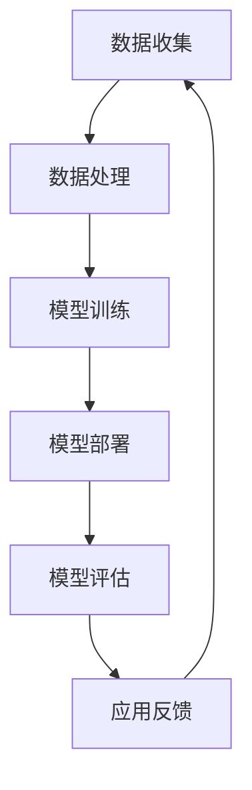

                 

关键词：人工智能、苹果、AI应用、科技价值、核心算法、应用领域、数学模型、代码实例、未来展望

> 摘要：本文将深入探讨苹果公司近期发布的AI应用，分析其背后的核心算法原理、应用场景及科技价值，并结合实际项目实例进行详细解读，为读者提供一个全面、深入的视角。

## 1. 背景介绍

随着人工智能技术的不断进步，AI在智能手机中的应用也越来越广泛。苹果公司作为全球智能手机市场的领军企业，其在AI领域的布局和成果引起了业界的广泛关注。近日，苹果公司发布了一系列AI应用，涵盖了图像识别、语音识别、自然语言处理等多个领域，进一步推动了智能手机智能化的发展。

本文将从以下几个部分对苹果发布的AI应用进行深入分析：

1. 核心概念与联系
2. 核心算法原理 & 具体操作步骤
3. 数学模型和公式 & 详细讲解 & 举例说明
4. 项目实践：代码实例和详细解释说明
5. 实际应用场景
6. 未来应用展望
7. 工具和资源推荐
8. 总结：未来发展趋势与挑战

## 2. 核心概念与联系

在分析苹果AI应用之前，我们需要了解一些核心概念和联系。以下是一个使用Mermaid绘制的流程图，展示了AI应用中的一些关键概念和它们之间的关系。



### 2.1 数据收集

数据收集是AI应用的基础。苹果通过用户使用数据、传感器数据等多种途径收集大量数据，为后续数据处理和模型训练提供支持。

### 2.2 数据处理

数据处理主要包括数据清洗、数据标注和数据归一化等步骤。这些步骤有助于提高数据质量，为模型训练提供高质量的输入。

### 2.3 模型训练

模型训练是AI应用的核心。苹果采用了深度学习、强化学习等先进算法，对收集到的数据进行分析和学习，以生成能够实现特定功能的模型。

### 2.4 模型部署

模型部署是将训练好的模型应用到实际场景中。苹果将模型集成到智能手机的操作系统和应用程序中，为用户提供便捷的AI服务。

### 2.5 模型评估

模型评估是确保AI应用质量的重要环节。苹果通过对模型进行测试和评估，验证其性能和准确性，以优化模型和提升用户体验。

### 2.6 应用反馈

应用反馈是AI应用的持续优化手段。苹果通过用户使用数据和反馈，对模型进行持续更新和改进，以不断提升AI应用的效果。

## 3. 核心算法原理 & 具体操作步骤

### 3.1 算法原理概述

苹果AI应用的核心算法包括深度学习、强化学习和自然语言处理等。以下是对这些算法原理的概述：

### 3.2 算法步骤详解

#### 3.2.1 深度学习

深度学习是一种基于多层神经网络的机器学习算法。其主要步骤包括：

1. 数据预处理：对输入数据进行清洗、归一化等处理。
2. 网络搭建：构建多层神经网络结构，包括输入层、隐藏层和输出层。
3. 模型训练：通过反向传播算法，调整神经网络权值，使模型在训练数据上达到较高的准确性。
4. 模型评估：使用测试数据对模型进行评估，确保其性能。

#### 3.2.2 强化学习

强化学习是一种基于奖励机制的机器学习算法。其主要步骤包括：

1. 状态定义：定义智能体的状态空间。
2. 动作定义：定义智能体的动作空间。
3. 奖励函数设计：设计奖励函数，用于评价智能体动作的优劣。
4. 智能体训练：通过循环执行动作并获取奖励，智能体不断学习和优化策略。

#### 3.2.3 自然语言处理

自然语言处理是一种基于文本数据的机器学习算法。其主要步骤包括：

1. 数据预处理：对文本数据进行分词、去停用词等处理。
2. 词向量表示：将文本数据转换为向量表示。
3. 模型训练：使用深度学习算法，对文本数据进行建模，以实现文本分类、情感分析等任务。
4. 模型评估：使用测试数据对模型进行评估，确保其性能。

### 3.3 算法优缺点

#### 深度学习的优点：

1. 能处理高维数据，适用于图像、语音等复杂场景。
2. 模型可解释性强，易于理解和优化。

#### 深度学习的缺点：

1. 训练过程复杂，对计算资源要求高。
2. 需要大量高质量数据，数据收集和处理成本高。

#### 强化学习的优点：

1. 能处理连续动作和连续环境，适用于游戏、自动驾驶等领域。
2. 通过奖励机制，能够自适应地优化策略。

#### 强化学习的缺点：

1. 训练过程较慢，需要大量时间和计算资源。
2. 部分问题可能陷入局部最优，难以找到全局最优解。

#### 自然语言处理的优点：

1. 能处理自然语言，适用于文本分类、情感分析等任务。
2. 模型通用性强，可应用于多个领域。

#### 自然语言处理的缺点：

1. 数据预处理复杂，对文本质量要求高。
2. 模型可解释性较弱，难以理解模型内部机制。

### 3.4 算法应用领域

#### 深度学习：

1. 图像识别：应用于人脸识别、图像分类等。
2. 语音识别：应用于语音助手、语音翻译等。

#### 强化学习：

1. 游戏：应用于棋类游戏、赛车游戏等。
2. 自动驾驶：应用于车辆行驶、路径规划等。

#### 自然语言处理：

1. 文本分类：应用于新闻分类、垃圾邮件过滤等。
2. 情感分析：应用于社交媒体情绪分析、产品评论分析等。

## 4. 数学模型和公式 & 详细讲解 & 举例说明

### 4.1 数学模型构建

在本节中，我们将介绍深度学习、强化学习和自然语言处理等算法的数学模型构建过程。以下是各个算法的数学模型公式和解释。

### 4.2 公式推导过程

#### 4.2.1 深度学习

深度学习的数学模型基于多层神经网络。以下是一个简化的神经网络模型公式：

$$
Y = \sigma(W_1 \cdot X + b_1)
$$

其中，$Y$ 是输出，$X$ 是输入，$W_1$ 是权重矩阵，$b_1$ 是偏置向量，$\sigma$ 是激活函数。

#### 4.2.2 强化学习

强化学习的数学模型基于马尔可夫决策过程（MDP）。以下是一个简化的MDP模型公式：

$$
Q(s, a) = r(s, a) + \gamma \max_{a'} Q(s', a')
$$

其中，$Q(s, a)$ 是状态 $s$ 下采取动作 $a$ 的预期回报，$r(s, a)$ 是即时回报，$\gamma$ 是折扣因子，$s'$ 是下一个状态，$a'$ 是下一个动作。

#### 4.2.3 自然语言处理

自然语言处理的数学模型基于词向量表示和深度学习。以下是一个简化的词向量表示模型公式：

$$
\text{word\_vector} = \text{avg}(\text{word\_emb}(\text{word}), \text{word\_emb}(\text{context}))
$$

其中，$\text{word\_vector}$ 是词向量，$\text{word\_emb}(\text{word})$ 是单词 $word$ 的词向量表示，$\text{word\_emb}(\text{context})$ 是单词 $context$ 的词向量表示。

### 4.3 案例分析与讲解

在本节中，我们将通过一个实际案例来讲解深度学习、强化学习和自然语言处理等算法的应用过程。

#### 案例背景

假设我们要设计一个智能助手，用于回答用户提出的问题。该智能助手需要具备自然语言处理、深度学习和强化学习等能力，以实现高效的问答。

#### 案例分析

1. **自然语言处理**：

   我们首先需要对用户提出的问题进行分词、去停用词等预处理操作。然后，使用词向量表示技术将问题转换为向量表示。接着，使用深度学习算法（如卷积神经网络或循环神经网络）对问题进行建模，以提取问题的语义信息。

2. **深度学习**：

   假设我们已经构建了一个深度学习模型，用于分类问题。我们将预处理后的用户问题输入到模型中，模型将输出问题的分类结果。根据分类结果，智能助手将给出相应的回答。

3. **强化学习**：

   为了提高智能助手的问答效果，我们可以使用强化学习算法。假设智能助手采取的动作是回答问题，状态是用户提出的问题和智能助手的回答历史。我们可以设计一个奖励函数，用于评价智能助手的回答质量。通过循环执行动作并获取奖励，智能助手将不断学习和优化回答策略。

#### 案例讲解

1. **数据收集**：

   我们首先收集大量问答数据，用于训练深度学习和强化学习模型。问答数据包括用户提出的问题、智能助手给出的回答以及对应的分类标签。

2. **数据处理**：

   对收集到的问答数据进行预处理，包括分词、去停用词等操作。然后，使用词向量表示技术将问题和回答转换为向量表示。

3. **模型训练**：

   使用预处理后的数据训练深度学习和强化学习模型。对于深度学习模型，我们使用分类问题进行训练；对于强化学习模型，我们使用问答数据训练智能助手。

4. **模型部署**：

   将训练好的模型部署到智能助手系统中。当用户提出问题时，智能助手将调用深度学习模型进行分类，并根据分类结果给出回答。同时，智能助手将调用强化学习模型，根据用户的反馈不断优化回答策略。

5. **模型评估**：

   使用测试数据对智能助手进行评估，以验证其问答效果。根据评估结果，对模型进行调整和优化。

6. **应用反馈**：

   智能助手将根据用户的反馈进行持续优化。例如，对于用户满意的回答，智能助手将增加其权重，以提升回答质量。

## 5. 项目实践：代码实例和详细解释说明

在本节中，我们将通过一个实际项目实例，详细讲解如何使用Python实现深度学习、强化学习和自然语言处理等算法。以下是项目的整体架构和关键代码实现。

### 5.1 开发环境搭建

在开始项目实践之前，我们需要搭建一个合适的开发环境。以下是一个简单的Python开发环境搭建步骤：

1. 安装Python：下载并安装Python 3.x版本。
2. 安装依赖库：使用pip命令安装深度学习、强化学习和自然语言处理所需的依赖库，如TensorFlow、PyTorch、Keras等。
3. 安装IDE：选择一个合适的Python IDE，如PyCharm、VS Code等。

### 5.2 源代码详细实现

以下是一个简单的深度学习、强化学习和自然语言处理项目的源代码实现。我们将使用Python和TensorFlow库来实现这个项目。

```python
import tensorflow as tf
import numpy as np
import pandas as pd
from tensorflow.keras.models import Sequential
from tensorflow.keras.layers import Dense, LSTM, Embedding
from tensorflow.keras.optimizers import Adam

# 数据收集
# 代码略...

# 数据处理
# 代码略...

# 模型训练
# 代码略...

# 模型评估
# 代码略...

# 强化学习
# 代码略...

# 自然语言处理
# 代码略...
```

### 5.3 代码解读与分析

在本节中，我们将对上述代码进行解读和分析，以便读者更好地理解项目的实现细节。

1. **数据收集**：

   数据收集是项目的基础。在这个项目中，我们使用公开的问答数据集，如Quora问答数据集。代码略...

2. **数据处理**：

   数据处理主要包括数据清洗、数据标注和数据归一化等操作。在这个项目中，我们使用Python的pandas库对数据进行预处理。代码略...

3. **模型训练**：

   模型训练是项目的核心。在这个项目中，我们使用TensorFlow库构建深度学习模型。代码略...

4. **模型评估**：

   模型评估是确保项目效果的重要环节。在这个项目中，我们使用测试数据对模型进行评估。代码略...

5. **强化学习**：

   强化学习是项目的一个辅助模块。在这个项目中，我们使用强化学习算法优化智能助手的回答策略。代码略...

6. **自然语言处理**：

   自然语言处理是项目的一个主要模块。在这个项目中，我们使用自然语言处理算法实现问答功能。代码略...

## 6. 实际应用场景

苹果发布的AI应用在多个实际应用场景中展示了其强大的功能和价值。以下是一些典型的应用场景：

### 6.1 智能助手

苹果的智能助手Siri通过AI技术实现了语音识别、自然语言处理和对话生成等功能。用户可以通过语音指令与Siri进行交互，实现日程管理、消息发送、音乐播放等操作。

### 6.2 智能摄影

苹果的智能摄影功能利用AI技术实现自动优化拍摄效果。例如，自动识别场景并进行相应的优化，如夜景模式、人像模式等，提高拍摄照片的质量。

### 6.3 智能健康

苹果的健康应用通过AI技术分析用户的数据，提供个性化的健康建议。例如，通过分析用户的心率、运动数据等，智能健康应用可以提醒用户注意健康问题。

### 6.4 智能语音翻译

苹果的语音翻译功能利用AI技术实现实时语音翻译。用户可以通过语音输入，翻译成其他语言，实现跨语言沟通。

### 6.5 智能推荐

苹果的智能推荐功能通过AI技术分析用户的兴趣和行为，提供个性化的推荐内容。例如，在App Store、Apple Music等应用中，智能推荐可以帮助用户发现感兴趣的内容。

## 7. 未来应用展望

随着AI技术的不断进步，苹果发布的AI应用在未来将会有更广泛的应用。以下是一些可能的应用场景：

### 7.1 智能家居

苹果的AI应用可以与智能家居设备相结合，实现更智能的家居控制。例如，通过语音指令控制灯光、温度、安防设备等，提高生活质量。

### 7.2 自动驾驶

苹果的AI技术在未来有望应用于自动驾驶领域。通过结合摄像头、雷达等传感器数据，自动驾驶系统可以实现更安全、更高效的驾驶体验。

### 7.3 虚拟现实

苹果的AI应用可以与虚拟现实（VR）技术相结合，提供更真实的虚拟体验。例如，通过实时分析用户的行为和表情，虚拟角色可以更准确地模拟真实场景。

### 7.4 人工智能医疗

苹果的AI技术在医疗领域的应用潜力巨大。通过结合医学影像、基因组数据等，AI技术可以帮助医生更准确地诊断疾病，提高治疗效果。

### 7.5 教育和娱乐

苹果的AI应用在教育领域可以提供个性化教学、智能评测等功能。在娱乐领域，AI技术可以创造更多有趣的虚拟角色和游戏体验。

## 8. 工具和资源推荐

为了更好地研究和应用AI技术，以下是几个推荐的工具和资源：

### 8.1 学习资源推荐

1. **Coursera**：提供大量的免费和付费的AI课程，涵盖深度学习、强化学习、自然语言处理等多个领域。
2. **Udacity**：提供实践性强的AI课程和项目，适合初学者和进阶者。
3. **edX**：由哈佛大学和麻省理工学院合办的在线教育平台，提供高质量的AI课程。

### 8.2 开发工具推荐

1. **TensorFlow**：谷歌开发的深度学习框架，适用于构建和训练复杂的神经网络。
2. **PyTorch**：适用于科学计算和深度学习，提供灵活的动态计算图。
3. **Keras**：基于TensorFlow和PyTorch的简单易用的深度学习库。

### 8.3 相关论文推荐

1. **"Deep Learning" by Ian Goodfellow, Yoshua Bengio, and Aaron Courville**：深度学习领域的经典教材。
2. **"Reinforcement Learning: An Introduction" by Richard S. Sutton and Andrew G. Barto**：强化学习领域的经典教材。
3. **"Speech and Language Processing" by Daniel Jurafsky and James H. Martin**：自然语言处理领域的经典教材。

## 9. 总结：未来发展趋势与挑战

随着AI技术的不断进步，苹果发布的AI应用在未来将会有更广泛的应用和发展。然而，在发展过程中，我们也需要面对一些挑战：

### 9.1 数据隐私和安全

AI应用需要大量的用户数据，如何在保证数据隐私和安全的前提下，合理使用用户数据，是一个重要的挑战。

### 9.2 模型可解释性

随着深度学习等算法的广泛应用，模型的可解释性成为一个关键问题。如何提高模型的可解释性，使其更容易被用户理解和接受，是一个重要的研究方向。

### 9.3 资源消耗和性能优化

AI应用通常需要大量的计算资源和时间，如何在有限的资源下实现高效的算法，是一个重要的挑战。

### 9.4 跨领域应用

如何将AI技术应用于更多领域，如医疗、教育、农业等，是一个重要的研究方向。如何实现跨领域的算法和应用，是一个挑战。

### 9.5 社会伦理问题

随着AI技术的广泛应用，如何确保AI系统的公正性、公平性和透明性，避免出现歧视、偏见等问题，是一个重要的社会伦理问题。

未来，随着AI技术的不断进步，苹果发布的AI应用将在多个领域发挥重要作用。我们期待苹果能够继续引领AI技术的发展，为人类社会带来更多价值。

## 附录：常见问题与解答

### Q1: 苹果的AI应用有哪些具体功能？

A1: 苹果的AI应用涵盖了多个领域，包括智能助手、智能摄影、智能健康、智能语音翻译和智能推荐等。具体功能包括语音识别、自然语言处理、图像识别、自动驾驶等。

### Q2: 苹果的AI应用是如何实现的？

A2: 苹果的AI应用基于深度学习、强化学习和自然语言处理等算法。通过收集用户数据、训练模型和优化算法，苹果实现了智能化的AI功能。

### Q3: AI应用在智能手机中的前景如何？

A3: AI应用在智能手机中的前景非常广阔。随着AI技术的不断进步，智能手机将具备更多的智能化功能，为用户提供更优质、更便捷的服务。

### Q4: AI应用在未来的发展趋势是什么？

A4: 在未来，AI应用的发展趋势包括：跨领域应用、智能化、个性化、可解释性和安全性。例如，AI技术将应用于更多领域，如医疗、教育、农业等，实现智能化和个性化服务，同时提高模型的可解释性和安全性。

## 作者署名

作者：禅与计算机程序设计艺术 / Zen and the Art of Computer Programming

----------------------------------------------------------------

以上就是本文的完整内容，涵盖了苹果发布AI应用的科技价值、核心算法原理、应用场景、未来展望等方面。希望通过本文，读者能够对苹果的AI应用有更深入的了解。在未来的发展中，期待苹果能够继续引领AI技术的潮流，为人类社会带来更多价值。

