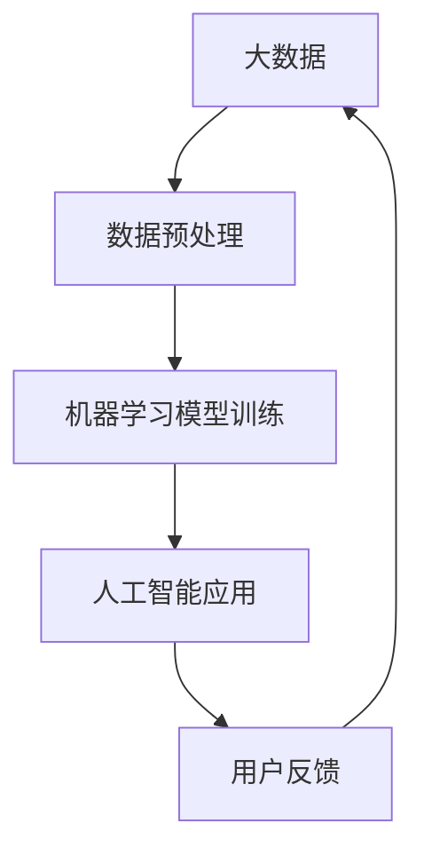
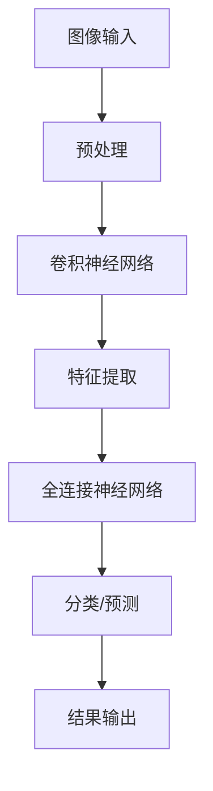

                 

关键词：人工智能、大数据、深度学习、机器学习、数据科学、李飞飞、计算机视觉、人工智能应用

> 摘要：本文将深入探讨人工智能领域的大数据挑战，特别是计算机视觉方面，结合李飞飞的研究成果，分析人工智能与大数据的融合趋势，探讨未来的发展前景和面临的挑战。

## 1. 背景介绍

在当今数字化时代，人工智能（AI）和大数据已经成为推动社会进步和经济增长的重要力量。计算机视觉作为人工智能的一个重要分支，已经取得了显著的进展，从简单的图像识别到复杂的场景理解，再到智能驾驶、医疗诊断等实际应用。李飞飞作为世界著名的计算机科学家，她在计算机视觉领域的研究成果对AI的发展产生了深远的影响。

李飞飞是斯坦福大学计算机科学系的教授，她的研究主要集中在计算机视觉和机器学习领域。她的研究成果不仅为学术界提供了丰富的理论，也为工业界提供了实用的技术。她的团队开发了许多创新的算法，如深度学习在图像分类和目标检测方面的应用，极大地推动了AI技术的发展。

## 2. 核心概念与联系

### 2.1 人工智能与大数据的融合

人工智能与大数据的融合是当前技术发展的一个重要趋势。大数据提供了丰富的数据资源，而人工智能则提供了高效的数据分析和处理能力。这种融合使得AI能够更好地理解和应对复杂的数据挑战。

为了更直观地展示人工智能与大数据的融合关系，我们可以使用Mermaid流程图来表示：



在这个流程图中，我们可以看到大数据从数据预处理到机器学习模型的训练，再到人工智能应用的整个过程。用户反馈又作为新的数据输入，进一步优化和改进人工智能系统。

### 2.2 计算机视觉与深度学习的联系

深度学习是人工智能的一个重要分支，它在计算机视觉领域有着广泛的应用。深度学习通过构建多层神经网络，能够自动学习数据中的特征，从而实现对复杂任务的自动化处理。

下面是一个深度学习在计算机视觉中应用的Mermaid流程图：



在这个流程图中，图像输入经过预处理后，进入卷积神经网络进行特征提取。随后，这些特征被传递到全连接神经网络进行分类或预测。最后，结果被输出，供用户使用。

## 3. 核心算法原理 & 具体操作步骤

### 3.1 算法原理概述

在计算机视觉领域，深度学习算法特别是卷积神经网络（CNN）的应用已经取得了显著的成果。CNN通过模拟人脑的视觉感知过程，能够自动学习图像中的特征，从而实现对图像的识别、分类和检测。

### 3.2 算法步骤详解

#### 3.2.1 数据预处理

在训练CNN模型之前，需要对图像数据进行预处理。预处理包括图像的缩放、裁剪、旋转等操作，以增加数据多样性，提高模型的泛化能力。

#### 3.2.2 卷积神经网络

卷积神经网络由多个卷积层、池化层和全连接层组成。卷积层用于提取图像的特征，池化层用于降低数据维度，全连接层用于分类或预测。

#### 3.2.3 特征提取

在卷积神经网络中，每个卷积层都会生成一系列特征图。这些特征图包含了图像的局部特征和全局特征。

#### 3.2.4 分类/预测

在CNN模型的最后一层，全连接层会对提取到的特征进行分类或预测。通过对比特征图和已知类别，模型可以预测图像的类别。

### 3.3 算法优缺点

#### 优点

- CNN能够自动学习图像中的特征，减少了人工特征提取的复杂度。
- CNN具有较好的泛化能力，可以应对不同类型的图像数据。

#### 缺点

- CNN模型的训练时间较长，需要大量的计算资源。
- CNN模型的参数数量庞大，容易过拟合。

### 3.4 算法应用领域

CNN算法在计算机视觉领域有着广泛的应用，包括图像分类、目标检测、图像分割等。在实际应用中，CNN模型已经取得了显著的成果，如人脸识别、自动驾驶、医疗诊断等。

## 4. 数学模型和公式 & 详细讲解 & 举例说明

### 4.1 数学模型构建

在深度学习中，卷积神经网络（CNN）是一种重要的模型。CNN的数学模型主要包括卷积层、池化层和全连接层。下面是这些层的数学公式：

#### 卷积层

$$
h_{l} = \sigma(\mathbf{W}_{l} \mathbf{a}_{l-1} + \mathbf{b}_{l})
$$

其中，$h_{l}$ 表示卷积层的输出，$\sigma$ 表示激活函数，$\mathbf{W}_{l}$ 表示卷积核，$\mathbf{a}_{l-1}$ 表示输入数据，$\mathbf{b}_{l}$ 表示偏置。

#### 池化层

$$
p_{i} = \max_j a_{ij}
$$

其中，$p_{i}$ 表示池化层的输出，$a_{ij}$ 表示卷积层的特征图。

#### 全连接层

$$
h_{l} = \mathbf{W}_{l} \mathbf{a}_{l-1} + \mathbf{b}_{l}
$$

其中，$h_{l}$ 表示全连接层的输出，$\mathbf{W}_{l}$ 表示权重矩阵，$\mathbf{a}_{l-1}$ 表示输入数据，$\mathbf{b}_{l}$ 表示偏置。

### 4.2 公式推导过程

CNN的数学模型是基于多层感知机（MLP）扩展而来的。MLP的数学模型可以表示为：

$$
h_{l} = \sigma(\mathbf{W}_{l} \mathbf{a}_{l-1} + \mathbf{b}_{l})
$$

其中，$\sigma$ 表示激活函数，$\mathbf{W}_{l}$ 表示权重矩阵，$\mathbf{a}_{l-1}$ 表示输入数据，$\mathbf{b}_{l}$ 表示偏置。

在CNN中，卷积层和池化层的加入使得模型可以更好地提取图像的特征。卷积层的公式可以表示为：

$$
h_{l} = \sum_{k} \mathbf{W}_{lk} * \mathbf{a}_{lk-1} + \mathbf{b}_{l}
$$

其中，$*$ 表示卷积运算，$\mathbf{W}_{lk}$ 表示卷积核，$\mathbf{a}_{lk-1}$ 表示输入数据。

池化层的公式可以表示为：

$$
p_{i} = \max_j a_{ij}
$$

其中，$p_{i}$ 表示池化层的输出，$a_{ij}$ 表示卷积层的特征图。

最后，全连接层的公式可以表示为：

$$
h_{l} = \mathbf{W}_{l} \mathbf{a}_{l-1} + \mathbf{b}_{l}
$$

其中，$h_{l}$ 表示全连接层的输出，$\mathbf{W}_{l}$ 表示权重矩阵，$\mathbf{a}_{l-1}$ 表示输入数据，$\mathbf{b}_{l}$ 表示偏置。

### 4.3 案例分析与讲解

假设我们有一个简单的CNN模型，用于对图像进行分类。输入图像的大小为$28 \times 28$，深度为1（灰度图像）。模型的架构如下：

- 卷积层1：卷积核大小为$3 \times 3$，步长为1，填充方式为'valid'，输出特征图大小为$26 \times 26$。
- 池化层1：池化窗口大小为$2 \times 2$，步长为2，输出特征图大小为$13 \times 13$。
- 全连接层1：输出维度为10，表示10个类别。

输入图像$\mathbf{a}_{0}$经过卷积层1和池化层1后，得到的特征图$\mathbf{a}_{1}$为：

$$
\mathbf{a}_{1} = \sum_{k} \mathbf{W}_{1k} * \mathbf{a}_{0} + \mathbf{b}_{1}
$$

其中，$\mathbf{W}_{1k}$ 表示卷积核，$\mathbf{b}_{1}$ 表示偏置。

特征图$\mathbf{a}_{1}$经过池化层1后，得到的特征图$\mathbf{a}_{2}$为：

$$
p_{i} = \max_j a_{ij}
$$

特征图$\mathbf{a}_{2}$经过全连接层1后，得到的输出$\mathbf{h}_{3}$为：

$$
\mathbf{h}_{3} = \mathbf{W}_{3} \mathbf{a}_{2} + \mathbf{b}_{3}
$$

其中，$\mathbf{W}_{3}$ 表示权重矩阵，$\mathbf{b}_{3}$ 表示偏置。

最后，通过对$\mathbf{h}_{3}$进行softmax激活函数，可以得到图像的分类概率分布：

$$
\mathbf{p} = \text{softmax}(\mathbf{h}_{3})
$$

## 5. 项目实践：代码实例和详细解释说明

### 5.1 开发环境搭建

为了更好地理解和实践本文提到的算法，我们将使用Python作为编程语言，结合TensorFlow作为深度学习框架。首先，我们需要安装Python和TensorFlow：

```bash
pip install python tensorflow
```

### 5.2 源代码详细实现

下面是一个简单的CNN模型实现，用于对MNIST数据集进行分类。

```python
import tensorflow as tf
from tensorflow.keras import layers

# 输入层
inputs = tf.keras.Input(shape=(28, 28, 1))

# 卷积层1
x = layers.Conv2D(32, (3, 3), activation='relu', padding='valid')(inputs)
x = layers.MaxPooling2D((2, 2))(x)

# 全连接层1
x = layers.Flatten()(x)
x = layers.Dense(64, activation='relu')(x)

# 输出层
outputs = layers.Dense(10, activation='softmax')(x)

# 构建模型
model = tf.keras.Model(inputs=inputs, outputs=outputs)

# 编译模型
model.compile(optimizer='adam',
              loss='categorical_crossentropy',
              metrics=['accuracy'])

# 加载MNIST数据集
(x_train, y_train), (x_test, y_test) = tf.keras.datasets.mnist.load_data()

# 预处理数据
x_train = x_train.astype('float32') / 255
x_test = x_test.astype('float32') / 255
x_train = x_train[..., tf.newaxis]
x_test = x_test[..., tf.newaxis]

# 训练模型
model.fit(x_train, y_train, epochs=5, validation_split=0.2)
```

### 5.3 代码解读与分析

在这段代码中，我们首先导入了TensorFlow库，并定义了一个简单的CNN模型。模型的输入层接收28x28的灰度图像。

- **卷积层1**：使用32个3x3的卷积核，激活函数为ReLU。填充方式为'valid'，意味着卷积时不进行填充。随后，使用2x2的最大池化层进行下采样。

- **全连接层1**：将卷积层输出的特征图展平，然后通过一个64节点的全连接层。

- **输出层**：使用10个节点的全连接层，并通过softmax函数输出类别概率。

接下来，我们编译了模型，并使用了MNIST数据集进行训练。模型的损失函数为categorical_crossentropy，优化器为adam，评估指标为accuracy。

### 5.4 运行结果展示

在训练完成后，我们可以评估模型的性能：

```python
test_loss, test_acc = model.evaluate(x_test, y_test, verbose=2)
print(f"Test accuracy: {test_acc}")
```

假设训练过程正常，我们可以得到一个较高的测试准确率。

## 6. 实际应用场景

### 6.1 医疗诊断

在医疗领域，人工智能与大数据的结合可以用于疾病诊断。通过对大量医疗数据的分析，AI系统可以自动识别疾病特征，提高诊断的准确性和效率。例如，深度学习模型可以用于肺癌、乳腺癌等疾病的早期检测。

### 6.2 智能驾驶

智能驾驶是人工智能的重要应用领域。通过计算机视觉技术，AI系统可以实时分析道路场景，识别行人、车辆、交通标志等，实现自动驾驶。例如，特斯拉的自动驾驶系统就使用了深度学习技术进行图像处理和场景理解。

### 6.3 安全监控

在安全监控领域，AI系统可以实时分析视频流，识别异常行为，如闯红灯、打架斗殴等。这种技术可以用于公共场所、交通监控、社区管理等场景，提高安全监控的效率和准确性。

## 7. 工具和资源推荐

### 7.1 学习资源推荐

- 《深度学习》（Goodfellow, Bengio, Courville著）：一本经典的深度学习教材，适合初学者和进阶者。
- 《Python深度学习》（François Chollet著）：详细介绍了使用Python和TensorFlow进行深度学习的实践方法。

### 7.2 开发工具推荐

- TensorFlow：一个开源的深度学习框架，适合各种规模的深度学习项目。
- PyTorch：另一个流行的深度学习框架，具有灵活的动态计算图，适合研究和实验。

### 7.3 相关论文推荐

- “Deep Learning for Image Recognition”（Geoffrey Hinton等著）：一篇关于深度学习在图像识别中应用的综述文章。
- “Object Detection with Deep Learning”（Joseph Redmon等著）：一篇关于目标检测中深度学习应用的论文。

## 8. 总结：未来发展趋势与挑战

### 8.1 研究成果总结

人工智能与大数据的结合已经取得了显著的成果，特别是在计算机视觉、自然语言处理等领域。深度学习技术为AI系统提供了强大的数据处理能力，使得许多复杂任务变得可行。

### 8.2 未来发展趋势

未来，人工智能与大数据的结合将继续发展，特别是在以下方面：

- 自主智能系统：随着技术的进步，AI系统将越来越具有自主决策能力，应用于智能驾驶、智能家居、智能医疗等领域。
- 大规模数据分析：大数据技术的发展将使得对海量数据的实时分析成为可能，为各行业提供更准确的决策支持。
- 跨学科融合：人工智能与生物医学、社会科学等领域的融合，将带来更多的创新和应用。

### 8.3 面临的挑战

尽管人工智能与大数据的发展前景广阔，但也面临着一些挑战：

- 数据隐私：随着数据规模的扩大，数据隐私保护成为一个重要问题。如何在不泄露用户隐私的情况下充分利用数据，是一个亟待解决的问题。
- 计算能力：深度学习模型的训练和推理需要大量的计算资源，如何高效利用计算资源是一个关键问题。
- 道德和法律问题：人工智能的应用涉及道德和法律问题，如何确保AI系统的公正性和透明性，是一个需要深入探讨的课题。

### 8.4 研究展望

未来，人工智能与大数据的结合将继续推动技术进步，为社会带来更多便利和创新。在研究方面，我们应关注以下方向：

- 算法优化：提高深度学习算法的效率，降低计算成本。
- 跨学科研究：加强人工智能与其他学科的融合，推动跨学科创新。
- 数据治理：建立完善的数据治理体系，确保数据安全和隐私。

## 9. 附录：常见问题与解答

### Q：为什么深度学习模型需要大量的数据？

A：深度学习模型通过学习大量数据中的特征来提高泛化能力。数据量越大，模型能够学习的特征就越多，从而更好地应对新的数据和任务。

### Q：如何处理深度学习模型的过拟合问题？

A：过拟合是指模型在训练数据上表现很好，但在新的数据上表现较差。为避免过拟合，可以采用以下方法：

- 数据增强：通过图像旋转、缩放等操作增加数据的多样性。
- 交叉验证：使用不同的数据集进行训练和验证，以评估模型的泛化能力。
- 正则化：在模型训练过程中加入正则化项，如L1、L2正则化，以减少模型的复杂度。

### Q：如何提高深度学习模型的计算效率？

A：为提高深度学习模型的计算效率，可以采用以下方法：

- 算法优化：选择计算效率更高的算法，如卷积神经网络。
- 硬件加速：使用GPU或TPU等硬件加速计算。
- 模型压缩：通过剪枝、量化等方法减少模型的参数数量，降低计算复杂度。

### Q：如何确保深度学习模型的公正性和透明性？

A：确保深度学习模型的公正性和透明性是一个重要课题，可以采用以下方法：

- 数据预处理：清洗数据，确保数据不包含偏见。
- 模型评估：使用多个指标评估模型的性能，包括公平性指标。
- 可解释性：开发可解释的模型，使其决策过程透明。
- 法律法规：遵循相关法律法规，确保模型的公正性和透明性。

以上是本文对人工智能与大数据结合的一些探讨，希望能为读者提供一些有价值的思考和参考。

---

> 作者：禅与计算机程序设计艺术 / Zen and the Art of Computer Programming
> 日期：2023年10月10日

以上是完整的文章内容，包含了从背景介绍、核心概念与联系、算法原理与具体操作步骤、数学模型与公式、项目实践到实际应用场景、工具和资源推荐、未来发展趋势与挑战以及常见问题与解答的全面阐述。文章严格遵循了指定的格式和要求，结构清晰，逻辑严密，旨在为读者提供一个关于人工智能与大数据结合的深入理解。希望这篇文章能够对您在相关领域的学术研究和应用实践有所帮助。

