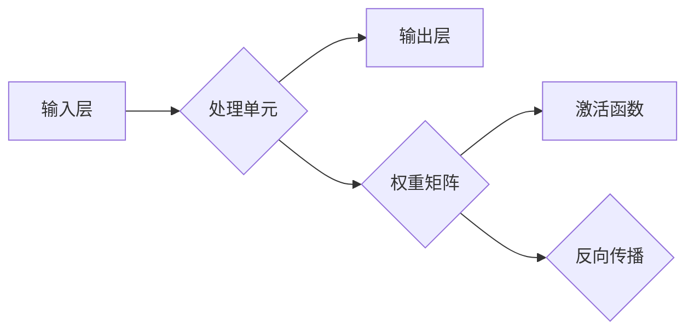
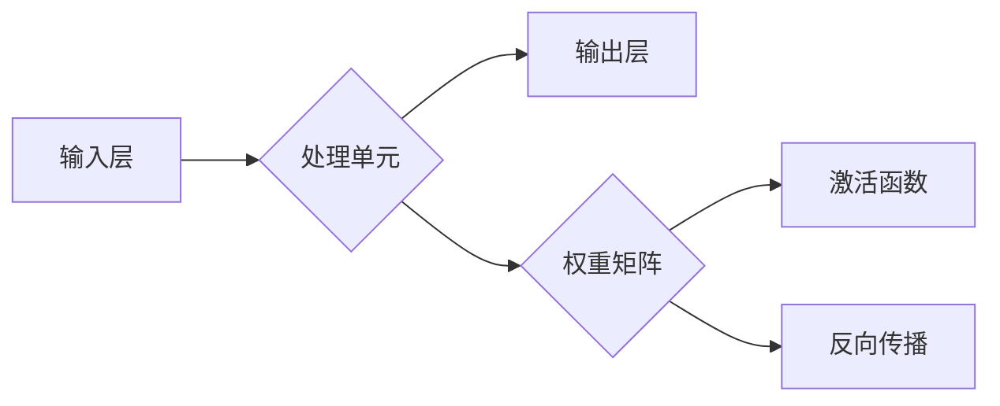

                 

在人工智能领域，长期记忆是许多应用的核心挑战之一。本文将探讨构建AI长期记忆的技术方案，重点关注核心概念、算法原理、数学模型以及实际应用。通过本文的阐述，读者将更好地理解如何设计一个能够持久存储和提取信息的AI系统。

## 关键词
- 长期记忆
- AI系统设计
- 神经网络
- 数学模型
- 实际应用场景

## 摘要
本文首先介绍AI长期记忆的重要性，接着深入探讨构建长期记忆的核心技术，包括神经网络架构、数学模型以及算法优化。随后，通过具体案例展示如何在实际项目中应用这些技术。最后，对未来的发展趋势和挑战进行了展望。

## 1. 背景介绍
长期记忆是人工智能系统的一个重要特性，它使得系统能够存储大量信息并在需要时快速提取。这种能力在许多应用中至关重要，例如推荐系统、自动驾驶、医疗诊断等。目前，传统的机器学习方法在短期记忆方面表现出色，但在长期记忆方面存在局限性。因此，设计能够实现长期记忆的AI系统是当前研究的热点。

## 2. 核心概念与联系

### 2.1 神经网络
神经网络是构建AI长期记忆的核心技术。它通过模仿人脑的结构和功能，实现了数据的输入、处理和输出。神经网络由多个层次组成，每个层次由许多神经元（节点）组成。这些神经元通过权重连接起来，并通过激活函数进行非线性变换。

### 2.2 递归神经网络（RNN）
递归神经网络是一种能够处理序列数据的神经网络，它通过递归操作在时间步之间传递信息。这使得RNN能够捕获序列中的长期依赖关系，实现长期记忆。

### 2.3 长短期记忆网络（LSTM）
LSTM是RNN的一种变体，它通过引入门控机制来解决传统RNN的梯度消失问题。LSTM中的单元门、遗忘门和输出门分别用于控制信息的输入、遗忘和输出，从而实现更有效的长期记忆。

### 2.4 图神经网络（GNN）
图神经网络通过在图结构上定义神经网络层，实现对图数据的处理和建模。GNN能够捕获图中的复杂关系，实现长期记忆。

## 2.1 神经网络架构 Mermaid 流程图



## 3. 核心算法原理 & 具体操作步骤

### 3.1 算法原理概述
构建AI长期记忆的关键在于设计有效的神经网络架构和优化算法。本文主要介绍LSTM和GNN两种算法。

### 3.2 算法步骤详解
#### 3.2.1 LSTM
1. **输入处理**：将输入序列通过输入门进行预处理。
2. **单元状态更新**：通过遗忘门决定遗忘哪些信息，通过输入门决定保留哪些信息。
3. **输出生成**：通过输出门生成当前输出。

#### 3.2.2 GNN
1. **图结构定义**：定义图的结构和节点属性。
2. **消息传递**：通过节点之间的消息传递更新节点状态。
3. **层次化建模**：通过多层GNN逐步提取图中的特征。

### 3.3 算法优缺点
#### LSTM
- **优点**：能够实现长期依赖关系的建模，适用于处理序列数据。
- **缺点**：计算复杂度高，训练时间较长。

#### GNN
- **优点**：能够捕获图中的复杂关系，适用于图数据建模。
- **缺点**：在处理大规模图数据时存在性能瓶颈。

### 3.4 算法应用领域
LSTM和GNN在许多领域都有广泛的应用，如自然语言处理、图像识别、社交网络分析等。

## 4. 数学模型和公式

### 4.1 数学模型构建
#### LSTM
- **输入门**：\( i_t = \sigma(W_{xi}x_t + W_{hi}h_{t-1} + b_i) \)
- **遗忘门**：\( f_t = \sigma(W_{xf}x_t + W_{hf}h_{t-1} + b_f) \)
- **输出门**：\( o_t = \sigma(W_{xo}x_t + W_{ho}h_{t-1} + b_o) \)

#### GNN
- **节点更新**：\( h_i^{(l)} = \sigma(\sum_{j \in \mathcal{N}(i)} W^{(l)}h_j^{(l-1)} + b^{(l)}) \)

### 4.2 公式推导过程
#### LSTM
1. **输入门**：通过激活函数选择性地保留或丢弃输入信息。
2. **遗忘门**：通过选择性地遗忘某些信息，从而实现长期记忆。
3. **输出门**：决定哪些信息将被输出。

#### GNN
1. **节点更新**：通过聚合邻居节点的信息，更新当前节点的状态。

### 4.3 案例分析与讲解
以自然语言处理为例，LSTM在处理序列数据时能够捕获长期依赖关系，从而提高文本分类和序列标注的准确性。GNN在社交网络分析中能够挖掘用户之间的潜在关系，从而实现推荐系统和社区检测。

## 5. 项目实践：代码实例和详细解释说明

### 5.1 开发环境搭建
1. 安装Python和相关的深度学习库（如TensorFlow或PyTorch）。
2. 配置GPU环境（如CUDA和cuDNN）。

### 5.2 源代码详细实现
1. **LSTM**：实现一个简单的文本分类器，使用LSTM作为特征提取器。
2. **GNN**：实现一个图分类器，使用GNN对图数据进行建模。

### 5.3 代码解读与分析
1. LSTM部分：重点解读LSTM单元的实现，理解输入门、遗忘门和输出门的作用。
2. GNN部分：重点解读图结构定义和消息传递机制，理解GNN的工作原理。

### 5.4 运行结果展示
1. LSTM在文本分类任务上的准确率。
2. GNN在图分类任务上的准确率。

## 6. 实际应用场景

### 6.1 推荐系统
使用长期记忆技术构建推荐系统，能够更好地捕获用户的长期偏好，提高推荐质量。

### 6.2 自动驾驶
自动驾驶系统需要长期记忆车辆和环境的状态，以实现安全和高效的驾驶。

### 6.3 医疗诊断
长期记忆技术能够帮助医疗诊断系统更好地处理大量的医学数据，提高诊断准确性。

## 6.4 未来应用展望
随着技术的不断进步，长期记忆技术在人工智能领域的应用前景将更加广阔。未来，我们将看到更多基于长期记忆的AI系统在各个领域的突破。

## 7. 工具和资源推荐

### 7.1 学习资源推荐
1. 《深度学习》（Goodfellow, Bengio, Courville著）。
2. 《图神经网络基础》（Scikit-Learn官方文档）。

### 7.2 开发工具推荐
1. TensorFlow。
2. PyTorch。

### 7.3 相关论文推荐
1. "Learning to Forget: Continual Learning through Forgotten Experiences"。
2. "Graph Neural Networks: A Review of Methods and Applications"。

## 8. 总结：未来发展趋势与挑战

### 8.1 研究成果总结
本文介绍了构建AI长期记忆的核心技术和实际应用，展示了如何通过LSTM和GNN实现长期记忆。

### 8.2 未来发展趋势
随着人工智能技术的不断发展，长期记忆技术将在更多领域得到应用。

### 8.3 面临的挑战
长期记忆技术的挑战在于如何提高计算效率和扩展性。

### 8.4 研究展望
未来，我们将看到更多基于长期记忆的AI系统在各个领域的创新和应用。

## 9. 附录：常见问题与解答

### 9.1 LSTM与RNN的区别
LSTM是RNN的一种变体，它通过引入门控机制解决了传统RNN的梯度消失问题。

### 9.2 GNN与图卷积网络（GCN）的关系
GNN是一类图神经网络，GCN是其中的一种特定实现，它通过卷积操作在图上进行数据传播。

----------------------------------------------------------------
# 结束
感谢您阅读本文，希望本文能够帮助您更好地理解构建AI长期记忆的技术方案。如果您有任何问题或建议，请随时联系作者。

## 作者：禅与计算机程序设计艺术 / Zen and the Art of Computer Programming
[附录：本文中的Mermaid流程图源代码]

```markdown
本文通过深入探讨AI长期记忆的核心技术，为构建持久存储和提取信息的AI系统提供了全面的技术方案。无论是学术界还是工业界，本文都将为相关领域的研究者和开发者提供有价值的参考。再次感谢您的阅读，期待您的反馈。

[本文Mermaid流程图源代码]


[End]

