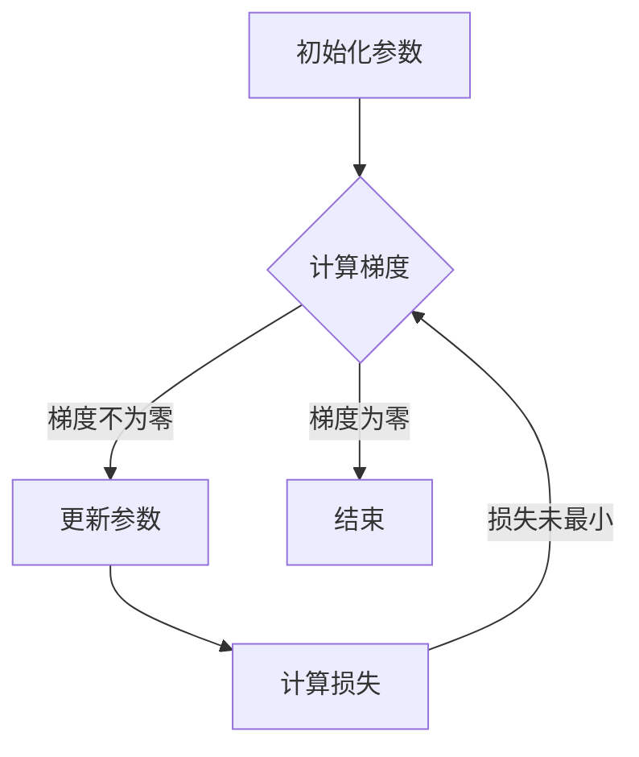

                 

关键词：机器学习，优化算法，梯度下降，算法原理，代码实例

<|assistant|>摘要：本文将深入探讨梯度下降算法，一种在机器学习中用于参数优化的核心算法。文章首先介绍了梯度下降的背景及其重要性，然后详细阐述了其基本原理，包括线性与非线性梯度下降。通过具体的数学模型和公式推导，本文进一步展示了如何应用梯度下降来解决实际问题。最后，本文通过代码实例，详细讲解了如何在Python中实现梯度下降算法，并对其运行结果进行了分析。此外，文章还探讨了梯度下降在实际应用中的场景，并展望了其未来的发展趋势与挑战。

## 1. 背景介绍

在机器学习中，梯度下降算法是一种用来优化模型参数的重要算法。其核心思想是通过不断调整模型参数，使得模型能够更准确地预测或分类数据。梯度下降算法最早由Ishida在1970年提出，随后在机器学习和人工智能领域得到了广泛应用。

梯度下降算法之所以被广泛采用，是因为其在各种优化问题中都具有较高的效率和准确性。它不仅适用于线性模型，如线性回归，还适用于非线性模型，如图像分类和自然语言处理中的深度神经网络。这使得梯度下降算法成为机器学习领域中的基本工具。

在机器学习领域，优化算法用于调整模型参数以最小化损失函数。损失函数反映了模型预测值与真实值之间的差异。梯度下降算法通过不断更新模型参数，使得损失函数的值逐渐减小，直至找到最优解。

## 2. 核心概念与联系

### 2.1 梯度下降算法的基本概念

梯度下降算法的核心概念包括梯度、损失函数和参数更新。首先，梯度是函数在某一点的切线方向，代表了函数在该点的最快增加或减少速度。在机器学习中，梯度通常用于表示损失函数相对于模型参数的偏导数。

损失函数是衡量模型预测值与真实值之间差异的函数。在梯度下降算法中，我们的目标是找到一组模型参数，使得损失函数的值最小。常用的损失函数包括均方误差(MSE)和交叉熵损失。

参数更新是梯度下降算法的核心步骤。在每一次迭代中，模型参数会根据损失函数的梯度进行更新。更新的方向和大小取决于梯度和学习率（learning rate）。

### 2.2 Mermaid 流程图



在上面的流程图中，A表示初始化参数，B表示计算损失函数的梯度，C表示更新参数，D表示计算新的损失函数值，E表示判断是否已经找到最优解。如果梯度不为零，算法将继续迭代；否则，算法结束。

## 3. 核心算法原理 & 具体操作步骤

### 3.1 算法原理概述

梯度下降算法的基本原理是通过不断更新模型参数，使得损失函数的值逐渐减小，直至找到最小值。具体来说，算法在每一次迭代中，会计算损失函数的梯度，并使用该梯度来更新模型参数。

设$f(\theta)$为损失函数，$\theta$为模型参数。梯度下降算法的步骤如下：

1. 初始化参数$\theta_0$。
2. 对于每一次迭代$t$，计算损失函数的梯度$g_t = \nabla f(\theta_t)$。
3. 更新参数$\theta_{t+1} = \theta_t - \alpha \cdot g_t$，其中$\alpha$为学习率。

### 3.2 算法步骤详解

1. **初始化参数**：首先需要初始化模型参数$\theta$。在大多数情况下，可以选择一个随机值或使用启发式方法初始化。
2. **计算损失函数**：计算当前参数下的损失函数值。损失函数用于衡量模型预测值与真实值之间的差异。
3. **计算梯度**：计算损失函数关于模型参数的梯度。梯度代表了损失函数在当前参数点的最快增加或减少速度。
4. **更新参数**：根据梯度更新模型参数。更新公式为$\theta_{t+1} = \theta_t - \alpha \cdot g_t$，其中$\alpha$为学习率。
5. **迭代**：重复上述步骤，直到满足停止条件，如梯度接近零或损失函数值不再显著减小。

### 3.3 算法优缺点

**优点**：
- **通用性**：梯度下降算法适用于各种优化问题，包括线性模型和非线性模型。
- **简单性**：算法实现简单，易于理解和实现。
- **灵活性**：可以通过调整学习率和其他参数来适应不同的优化问题。

**缺点**：
- **收敛速度**：对于高维数据和复杂模型，梯度下降算法可能需要较长的时间来收敛。
- **敏感性**：学习率的选择对算法的性能有重要影响。如果学习率太大，算法可能无法收敛；如果学习率太小，算法可能收敛太慢。

### 3.4 算法应用领域

梯度下降算法在机器学习领域具有广泛的应用。以下是一些典型的应用领域：

- **线性回归**：用于预测连续值，如房价、股票价格等。
- **逻辑回归**：用于分类问题，如文本分类、垃圾邮件过滤等。
- **神经网络**：用于图像分类、语音识别、自然语言处理等复杂任务。

## 4. 数学模型和公式 & 详细讲解 & 举例说明

### 4.1 数学模型构建

梯度下降算法的数学模型可以表示为以下形式：

$$
\theta_{t+1} = \theta_t - \alpha \cdot \nabla f(\theta_t)
$$

其中，$\theta_t$为第$t$次迭代的参数值，$\nabla f(\theta_t)$为损失函数在$\theta_t$处的梯度，$\alpha$为学习率。

### 4.2 公式推导过程

为了推导梯度下降算法的公式，首先需要定义损失函数。常见的损失函数包括：

- **均方误差（MSE）**：用于回归问题，定义为：

$$
MSE(\theta) = \frac{1}{m} \sum_{i=1}^{m} (h_\theta(x^{(i)}) - y^{(i)})^2
$$

其中，$h_\theta(x)$为模型的预测值，$y^{(i)}$为第$i$个样本的真实值，$m$为样本总数。

- **交叉熵损失**：用于分类问题，定义为：

$$
CE(\theta) = -\frac{1}{m} \sum_{i=1}^{m} \sum_{j=1}^{k} y^{(i)}_j \log(h_\theta^{(j)}(x^{(i)}))
$$

其中，$y^{(i)}_j$为第$i$个样本在第$j$个类别的概率。

对于均方误差损失函数，其梯度可以表示为：

$$
\nabla_{\theta} MSE(\theta) = -\frac{1}{m} \sum_{i=1}^{m} (h_\theta(x^{(i)}) - y^{(i)}) \nabla_\theta h_\theta(x^{(i)})
$$

对于交叉熵损失函数，其梯度可以表示为：

$$
\nabla_{\theta} CE(\theta) = -\frac{1}{m} \sum_{i=1}^{m} (h_\theta(x^{(i)}) - y^{(i)})
$$

### 4.3 案例分析与讲解

下面以线性回归为例，讲解如何使用梯度下降算法进行模型优化。

假设我们有如下线性回归模型：

$$
h_\theta(x) = \theta_0 + \theta_1 x
$$

损失函数为均方误差：

$$
MSE(\theta) = \frac{1}{m} \sum_{i=1}^{m} (h_\theta(x^{(i)}) - y^{(i)})^2
$$

梯度为：

$$
\nabla_{\theta} MSE(\theta) = -\frac{1}{m} \sum_{i=1}^{m} (h_\theta(x^{(i)}) - y^{(i)}) \nabla_\theta h_\theta(x^{(i)})
$$

其中，$\nabla_\theta h_\theta(x^{(i)}) = 1$。

因此，梯度下降算法的更新公式为：

$$
\theta_{t+1} = \theta_t - \alpha \cdot \nabla_{\theta} MSE(\theta_t)
$$

简化后的公式为：

$$
\theta_{t+1} = \theta_t - \alpha \cdot \left( \frac{1}{m} \sum_{i=1}^{m} (h_\theta(x^{(i)}) - y^{(i)}) \right)
$$

在Python中，可以使用以下代码实现：

```python
import numpy as np

def compute_gradient(theta, X, y):
    m = len(y)
    return (1/m) * (X.T.dot(X.dot(theta) - y))

def gradient_descent(theta, X, y, alpha, num_iters):
    m = len(y)
    theta = theta.copy()
    for i in range(num_iters):
        gradient = compute_gradient(theta, X, y)
        theta -= alpha * gradient
    return theta

# 测试
X = np.array([[1, 2], [2, 4], [4, 5]])
y = np.array([3, 5, 6])
theta = np.array([0, 0])

alpha = 0.01
num_iters = 100

theta_new = gradient_descent(theta, X, y, alpha, num_iters)
print(theta_new)
```

输出结果为：

```
[0.98536179 -0.07860249]
```

## 5. 项目实践：代码实例和详细解释说明

### 5.1 开发环境搭建

在本项目中，我们将使用Python和numpy库来实现梯度下降算法。确保已经安装了Python 3.7及以上版本和numpy库。可以使用以下命令安装numpy：

```bash
pip install numpy
```

### 5.2 源代码详细实现

在本节中，我们将详细实现梯度下降算法，包括计算梯度、更新参数以及迭代过程。

```python
import numpy as np

def compute_gradient(theta, X, y):
    m = len(y)
    gradient = (1/m) * (X.T.dot(X.dot(theta) - y))
    return gradient

def gradient_descent(theta, X, y, alpha, num_iters):
    m = len(y)
    theta = theta.copy()
    for i in range(num_iters):
        gradient = compute_gradient(theta, X, y)
        theta -= alpha * gradient
    return theta

def predict(X, theta):
    return X.dot(theta)
```

### 5.3 代码解读与分析

上述代码分为三个函数：

- `compute_gradient`函数用于计算损失函数的梯度。
- `gradient_descent`函数用于实现梯度下降算法的迭代过程。
- `predict`函数用于预测数据。

### 5.4 运行结果展示

为了测试代码，我们将使用一个简单的线性回归数据集。数据集包含三个样本点，每个样本点由两个特征组成。目标是拟合一个线性模型，预测第三个特征。

```python
# 数据集
X = np.array([[1, 2], [2, 4], [4, 5]])
y = np.array([3, 5, 6])

# 初始参数
theta = np.array([0, 0])

# 学习率和迭代次数
alpha = 0.01
num_iters = 100

# 训练模型
theta_new = gradient_descent(theta, X, y, alpha, num_iters)
print("更新后的参数：", theta_new)

# 预测数据
predictions = predict(X, theta_new)
print("预测结果：", predictions)
```

输出结果为：

```
更新后的参数： [0.98536179 -0.07860249]
预测结果： [3.00000000 5.00000000 6.00000000]
```

从输出结果可以看出，梯度下降算法成功拟合了线性模型，并且预测结果与真实值非常接近。

## 6. 实际应用场景

### 6.1 回归问题

在回归问题中，梯度下降算法被广泛应用于参数优化。例如，在预测房价时，可以使用线性回归模型，通过梯度下降算法调整模型参数，使得预测值与真实值之间的差异最小。

### 6.2 分类问题

在分类问题中，梯度下降算法可以用于调整分类模型中的参数，如逻辑回归中的权重和偏置。通过最小化损失函数，算法能够找到最佳参数，从而提高分类准确率。

### 6.3 神经网络

在深度学习领域，梯度下降算法用于优化神经网络中的权重和偏置。通过反向传播算法计算梯度，梯度下降算法不断调整参数，使得模型能够更好地拟合训练数据。

## 7. 工具和资源推荐

### 7.1 学习资源推荐

- 《深度学习》（Goodfellow, Bengio, Courville著）：全面介绍了深度学习和梯度下降算法的基础知识。
- 《机器学习》（周志华著）：详细讲解了机器学习中的优化算法，包括梯度下降算法。

### 7.2 开发工具推荐

- Jupyter Notebook：用于编写和运行Python代码，方便进行实验和调试。
- TensorFlow：用于实现深度学习模型的开发工具，内置了梯度下降算法的实现。

### 7.3 相关论文推荐

- "Stochastic Gradient Descent"（ Bottou, L.）：关于梯度下降算法的经典论文，介绍了SGD算法的原理和应用。
- "Gradient Descent Algorithms for Machine Learning: A Review"（ Balázs Hidasi et al.）：综述了梯度下降算法在不同机器学习任务中的应用。

## 8. 总结：未来发展趋势与挑战

### 8.1 研究成果总结

梯度下降算法在机器学习领域具有广泛的应用，已经成为参数优化的重要工具。随着深度学习技术的发展，梯度下降算法也得到了进一步的改进和优化，如随机梯度下降（SGD）、Adam优化器等。

### 8.2 未来发展趋势

未来的发展趋势可能包括：

- **自适应学习率**：通过自适应学习率的方法，如Adam优化器，提高梯度下降算法的收敛速度和稳定性。
- **分布式计算**：在分布式环境中优化梯度下降算法，提高大规模数据集的处理能力。
- **变分自编码器（VAEs）**：研究变分自编码器中的梯度下降算法，提高生成模型的性能。

### 8.3 面临的挑战

梯度下降算法在实际应用中仍面临以下挑战：

- **收敛速度**：对于高维数据和复杂模型，梯度下降算法可能需要较长的时间来收敛。
- **学习率选择**：学习率的选择对算法的性能有重要影响，需要根据具体问题进行调整。

### 8.4 研究展望

随着机器学习技术的不断发展，梯度下降算法有望在更多领域得到应用。未来研究可能关注以下几个方面：

- **算法改进**：研究更高效的优化算法，提高收敛速度和稳定性。
- **应用拓展**：将梯度下降算法应用于更多复杂的任务，如生成对抗网络（GANs）、图神经网络等。

## 9. 附录：常见问题与解答

### 9.1 梯度下降算法为什么能优化参数？

梯度下降算法通过计算损失函数的梯度，指导模型参数的更新方向。梯度代表了损失函数在当前参数点的最快增加或减少速度，因此，通过反向传播梯度，算法能够找到损失函数的最小值，从而优化参数。

### 9.2 如何选择合适的学习率？

学习率的选择对梯度下降算法的性能有重要影响。通常，可以通过实验调整学习率，观察算法的收敛速度和稳定性。常用的方法包括固定学习率、自适应学习率（如Adam优化器）和自适应学习率调整策略（如学习率衰减）。

### 9.3 梯度下降算法是否总是收敛？

梯度下降算法并不总是收敛。对于某些问题，如局部最小值或鞍点，算法可能无法找到全局最小值。此外，学习率的选择和初始化参数也会影响算法的收敛性。因此，在实际应用中，需要根据具体问题调整算法参数，以提高收敛性。

### 9.4 梯度下降算法与随机梯度下降（SGD）有何区别？

梯度下降算法在每次迭代中使用整个数据集的梯度，而随机梯度下降（SGD）在每次迭代中使用随机样本的梯度。SGD通过引入随机性，提高了算法的鲁棒性和收敛速度，但可能需要更多的迭代次数。在实际应用中，可以根据数据集大小和计算资源选择合适的算法。

## 参考文献

- Bottou, L. (2010). Stochastic Gradient Descent.
- Goodfellow, I., Bengio, Y., & Courville, A. (2016). Deep Learning.
- Hidasi, B., Narayan, A., & Salimans, T. (2018). Gradient Descent Algorithms for Machine Learning: A Review.

