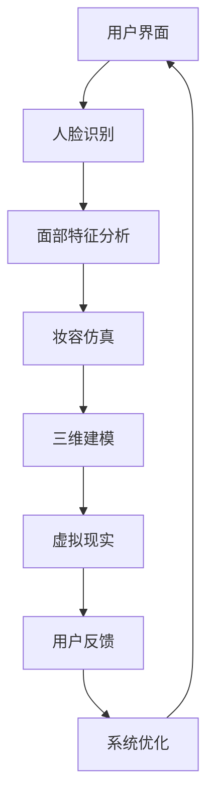

                 

关键词：虚拟试妆系统、人工智能、计算机视觉、机器学习、深度学习、图像处理、自然语言处理、三维建模、虚拟现实、人机交互、算法优化、软件开发、技术面试。

## 摘要

本文将深入探讨植村秀2024校招虚拟试妆系统开发工程师的面试，从背景介绍、核心概念、算法原理、数学模型、项目实践、实际应用场景、工具资源推荐以及未来发展展望等多个维度进行详细解析。通过这篇文章，读者将全面了解虚拟试妆系统在人工智能和计算机视觉领域的应用，以及相关技术和挑战。

## 1. 背景介绍

虚拟试妆系统是一种基于人工智能和计算机视觉技术，通过虚拟现实和三维建模实现个性化美妆体验的系统。植村秀作为全球知名的美妆品牌，一直致力于提供创新的美妆解决方案。2024校招虚拟试妆系统的开发，旨在通过技术创新，提升消费者的美妆体验，吸引年轻消费者群体，并增强品牌的市场竞争力。

### 1.1 市场需求

随着科技的快速发展，消费者对个性化、便捷化的美妆体验需求日益增长。虚拟试妆系统可以满足消费者在购买美妆产品前进行虚拟试妆的需求，帮助他们更直观地了解产品的效果，从而提高购买决策的准确性。此外，虚拟试妆系统还可以为品牌提供丰富的用户数据，用于产品研发和市场分析，进一步提升品牌的市场定位和竞争力。

### 1.2 技术发展

近年来，人工智能和计算机视觉技术在美妆领域的应用日益广泛。通过深度学习和图像处理技术，虚拟试妆系统可以实现人脸识别、面部特征分析、妆容仿真等核心功能。此外，三维建模和虚拟现实技术的结合，使得虚拟试妆系统在用户体验上更加逼真，进一步提升了系统的实用性。

## 2. 核心概念与联系

虚拟试妆系统的实现涉及多个核心概念和技术的结合，下面通过Mermaid流程图对系统的核心概念和联系进行详细说明。



### 2.1 用户界面

用户界面是虚拟试妆系统的入口，用户可以通过界面选择美妆产品，上传照片或者使用摄像头进行实时捕捉。界面设计需要注重用户体验，简洁直观，易于操作。

### 2.2 人脸识别

人脸识别技术用于识别用户的面部特征，将其作为后续处理的基础。常用的算法包括深度学习模型和传统的特征提取方法，如PCA、LDA等。

### 2.3 面部特征分析

面部特征分析技术用于分析用户面部的关键特征，如眼睛、鼻子、嘴巴、颧骨等。通过这些特征，系统可以确定用户的脸型、肤色等信息，为后续妆容仿真提供依据。

### 2.4 妆容仿真

妆容仿真技术是虚拟试妆系统的核心，通过图像处理和深度学习算法，将选定的美妆产品应用到用户的照片或实时捕捉的视频中。仿真效果需要真实、自然，同时具备一定的创意性。

### 2.5 三维建模

三维建模技术用于创建虚拟试妆场景的三维模型，包括美妆产品、用户面部、背景等。通过三维建模，系统可以实现更为丰富的交互体验。

### 2.6 虚拟现实

虚拟现实技术将用户带入一个虚拟的美妆体验空间，通过头戴式显示器、手柄等设备，用户可以与虚拟场景进行互动，实现沉浸式的美妆体验。

### 2.7 用户反馈

用户反馈是系统优化的重要环节，通过收集用户对试妆效果的满意度、颜色匹配度等评价，系统可以不断调整优化，提高用户体验。

## 3. 核心算法原理 & 具体操作步骤

### 3.1 算法原理概述

虚拟试妆系统的核心算法主要包括人脸识别、面部特征分析、妆容仿真、三维建模和虚拟现实等技术。下面分别介绍这些算法的原理。

#### 3.1.1 人脸识别

人脸识别算法基于深度学习模型，通过对用户面部图像的特征提取和匹配，实现人脸的识别。常用的深度学习模型包括卷积神经网络（CNN）和循环神经网络（RNN）等。

#### 3.1.2 面部特征分析

面部特征分析算法通过图像处理技术，对用户面部图像进行预处理，提取出关键特征点，如眼睛、鼻子、嘴巴等。这些特征点用于后续的妆容仿真和三维建模。

#### 3.1.3 妆容仿真

妆容仿真算法基于图像处理和深度学习技术，将选定的美妆产品应用到用户的面部图像中。仿真过程包括颜色匹配、纹理处理、阴影和光照效果等。

#### 3.1.4 三维建模

三维建模算法通过三维几何建模和纹理映射技术，创建虚拟试妆场景的三维模型。三维模型包括用户面部、美妆产品、背景等。

#### 3.1.5 虚拟现实

虚拟现实算法通过头戴式显示器、手柄等设备，将用户带入一个虚拟的美妆体验空间。用户可以在虚拟空间中与美妆产品进行互动，实现沉浸式的美妆体验。

### 3.2 算法步骤详解

#### 3.2.1 人脸识别步骤

1. 用户上传面部图像或使用摄像头进行实时捕捉。
2. 对面部图像进行预处理，包括灰度化、去噪、人脸检测等。
3. 使用深度学习模型进行人脸特征提取和匹配。
4. 输出人脸识别结果，包括人脸位置、角度等信息。

#### 3.2.2 面部特征分析步骤

1. 对预处理后的人脸图像进行特征点检测，如眼睛、鼻子、嘴巴等。
2. 对特征点进行标记和定位。
3. 计算特征点之间的距离和角度，提取关键面部特征。
4. 输出面部特征信息，为妆容仿真和三维建模提供依据。

#### 3.2.3 妆容仿真步骤

1. 根据用户选择的妆容产品，从数据库中加载相应的妆容模型。
2. 对用户面部图像进行颜色匹配和纹理处理，使妆容颜色与用户肤色相匹配。
3. 将妆容模型应用到用户面部图像中，实现虚拟试妆效果。
4. 对仿真结果进行优化，包括阴影和光照效果的调整。
5. 输出仿真结果，供用户查看和选择。

#### 3.2.4 三维建模步骤

1. 根据用户面部特征信息，创建用户面部的三维模型。
2. 从数据库中加载美妆产品和背景的三维模型。
3. 对三维模型进行纹理映射和光照计算，实现真实感的效果。
4. 将用户面部模型、美妆产品和背景模型整合在一起，形成虚拟试妆场景。
5. 输出三维建模结果，供虚拟现实算法使用。

#### 3.2.5 虚拟现实步骤

1. 根据用户选择的美妆产品，加载相应的三维建模结果。
2. 使用头戴式显示器和手柄等设备，将用户带入虚拟试妆空间。
3. 实现用户与虚拟试妆场景的交互，如旋转、缩放、拖拽等。
4. 根据用户操作，实时更新虚拟试妆效果。
5. 输出虚拟现实效果，供用户体验。

### 3.3 算法优缺点

#### 3.3.1 人脸识别

优点：
- 高效性：深度学习模型可以实现快速的人脸识别。
- 准确性：通过对人脸特征点的提取和匹配，提高了识别的准确性。

缺点：
- 对光线和角度的敏感性：在光线不足或角度变化较大的情况下，识别效果可能受到影响。

#### 3.3.2 面部特征分析

优点：
- 高效性：通过图像处理技术，可以实现快速的特征点检测和提取。
- 准确性：通过计算特征点之间的距离和角度，可以准确地提取关键面部特征。

缺点：
- 对图像质量的依赖性：在图像质量较差的情况下，特征点检测和提取可能不准确。

#### 3.3.3 妆容仿真

优点：
- 真实性：通过颜色匹配和纹理处理，实现了妆容的自然效果。
- 创意性：可以为用户定制个性化的妆容效果。

缺点：
- 计算量大：妆容仿真涉及到大量的图像处理和深度学习计算，对硬件性能要求较高。

#### 3.3.4 三维建模

优点：
- 真实感：通过三维建模和纹理映射，实现了虚拟试妆场景的真实感。
- 交互性：用户可以在虚拟试妆空间中与美妆产品进行互动。

缺点：
- 硬件成本：头戴式显示器和手柄等设备成本较高，限制了部分用户的体验。

#### 3.3.5 虚拟现实

优点：
- 沉浸感：通过虚拟现实技术，实现了用户与虚拟试妆空间的互动，提高了用户体验。
- 个性化：用户可以根据自己的需求，自定义美妆产品和场景。

缺点：
- 技术门槛：虚拟现实技术的实现需要较高的技术门槛，对开发人员的要求较高。

### 3.4 算法应用领域

虚拟试妆系统的算法主要应用于美妆领域，包括：
- 美妆产品营销：通过虚拟试妆系统，品牌可以展示产品的效果，吸引消费者。
- 个性化服务：通过虚拟试妆系统，为用户提供个性化的美妆建议和体验。
- 产品研发：通过虚拟试妆系统，品牌可以收集用户反馈和数据，用于产品研发和改进。

## 4. 数学模型和公式 & 详细讲解 & 举例说明

虚拟试妆系统的实现涉及到多个数学模型和公式的运用，下面分别进行详细讲解和举例说明。

### 4.1 数学模型构建

#### 4.1.1 人脸识别模型

人脸识别模型主要基于深度学习，其基本结构包括卷积层、池化层、全连接层等。下面是一个简化的人脸识别模型示例：

$$
\begin{align*}
&\text{输入：} \quad X \in \mathbb{R}^{288 \times 288 \times 3} \\
&\text{卷积层1：} \quad \text{卷积核尺寸} = 3 \times 3, \ \text{步长} = 1 \\
&\text{输出：} \quad Y_1 \in \mathbb{R}^{288 \times 288 \times 64} \\
&\text{池化层1：} \quad \text{池化方式} = \text{max pooling}, \ \text{步长} = 2 \\
&\text{输出：} \quad Y_2 \in \mathbb{R}^{144 \times 144 \times 64} \\
&\text{卷积层2：} \quad \text{卷积核尺寸} = 3 \times 3, \ \text{步长} = 1 \\
&\text{输出：} \quad Y_3 \in \mathbb{R}^{144 \times 144 \times 128} \\
&\text{池化层2：} \quad \text{池化方式} = \text{max pooling}, \ \text{步长} = 2 \\
&\text{输出：} \quad Y_4 \in \mathbb{R}^{72 \times 72 \times 128} \\
&\text{全连接层：} \quad \text{神经元数量} = 512 \\
&\text{输出：} \quad Y_5 \in \mathbb{R}^{512} \\
&\text{激活函数：} \quad \text{ReLU} \\
&\text{输出：} \quad Y_6 \in \mathbb{R}^{512} \\
&\text{全连接层：} \quad \text{神经元数量} = 2 \ (\text{类别数量}) \\
&\text{输出：} \quad Y_7 \in \mathbb{R}^{2} \\
&\text{损失函数：} \quad \text{交叉熵损失函数}
\end{align*}
$$

#### 4.1.2 面部特征分析模型

面部特征分析模型主要基于特征点检测和提取，其基本结构包括卷积层、池化层、全连接层等。下面是一个简化的人脸特征分析模型示例：

$$
\begin{align*}
&\text{输入：} \quad X \in \mathbb{R}^{288 \times 288 \times 3} \\
&\text{卷积层1：} \quad \text{卷积核尺寸} = 3 \times 3, \ \text{步长} = 1 \\
&\text{输出：} \quad Y_1 \in \mathbb{R}^{288 \times 288 \times 32} \\
&\text{池化层1：} \quad \text{池化方式} = \text{max pooling}, \ \text{步长} = 2 \\
&\text{输出：} \quad Y_2 \in \mathbb{R}^{144 \times 144 \times 32} \\
&\text{卷积层2：} \quad \text{卷积核尺寸} = 3 \times 3, \ \text{步长} = 1 \\
&\text{输出：} \quad Y_3 \in \mathbb{R}^{144 \times 144 \times 64} \\
&\text{池化层2：} \quad \text{池化方式} = \text{max pooling}, \ \text{步长} = 2 \\
&\text{输出：} \quad Y_4 \in \mathbb{R}^{72 \times 72 \times 64} \\
&\text{全连接层：} \quad \text{神经元数量} = 512 \\
&\text{输出：} \quad Y_5 \in \mathbb{R}^{512} \\
&\text{激活函数：} \quad \text{ReLU} \\
&\text{输出：} \quad Y_6 \in \mathbb{R}^{512} \\
&\text{全连接层：} \quad \text{神经元数量} = 5 \ (\text{特征点数量}) \\
&\text{输出：} \quad Y_7 \in \mathbb{R}^{5} \\
&\text{损失函数：} \quad \text{均方误差损失函数}
\end{align*}
$$

### 4.2 公式推导过程

#### 4.2.1 人脸识别模型

人脸识别模型的损失函数通常采用交叉熵损失函数，其公式如下：

$$
L = -\frac{1}{N} \sum_{i=1}^{N} \sum_{j=1}^{C} y_{ij} \log(p_{ij})
$$

其中，$N$ 表示样本数量，$C$ 表示类别数量，$y_{ij}$ 表示第 $i$ 个样本属于第 $j$ 个类别的标签，$p_{ij}$ 表示第 $i$ 个样本属于第 $j$ 个类别的概率。

对于每个样本，其输出为：

$$
z_i = \sigma(W \cdot x_i + b)
$$

其中，$\sigma$ 表示激活函数，$W$ 表示权重矩阵，$b$ 表示偏置项，$x_i$ 表示输入特征向量。

交叉熵损失函数的梯度为：

$$
\frac{\partial L}{\partial W} = -\frac{1}{N} \sum_{i=1}^{N} (y_i - z_i)x_i^T
$$

$$
\frac{\partial L}{\partial b} = -\frac{1}{N} \sum_{i=1}^{N} (y_i - z_i)
$$

#### 4.2.2 面部特征分析模型

面部特征分析模型的损失函数通常采用均方误差损失函数，其公式如下：

$$
L = \frac{1}{2} \sum_{i=1}^{N} \sum_{j=1}^{K} (y_{ij} - z_{ij})^2
$$

其中，$N$ 表示样本数量，$K$ 表示特征点数量，$y_{ij}$ 表示第 $i$ 个样本的第 $j$ 个特征点的真实坐标，$z_{ij}$ 表示第 $i$ 个样本的第 $j$ 个特征点的预测坐标。

对于每个样本，其输出为：

$$
z_i = W \cdot x_i + b
$$

其中，$W$ 表示权重矩阵，$b$ 表示偏置项，$x_i$ 表示输入特征向量。

均方误差损失函数的梯度为：

$$
\frac{\partial L}{\partial W} = \frac{1}{N} \sum_{i=1}^{N} (z_i - y_i)x_i^T
$$

$$
\frac{\partial L}{\partial b} = \frac{1}{N} \sum_{i=1}^{N} (z_i - y_i)
$$

### 4.3 案例分析与讲解

#### 4.3.1 人脸识别案例

假设我们有一个包含100张人脸图像的数据集，其中每张图像的大小为 $288 \times 288 \times 3$。我们需要训练一个基于深度学习的人脸识别模型，输出每个人脸图像所属的类别。

1. 数据预处理：对每张人脸图像进行灰度化、去噪、人脸检测等预处理操作，得到处理后的图像。
2. 模型训练：使用预处理后的图像训练深度学习模型，包括卷积层、池化层、全连接层等。在训练过程中，使用交叉熵损失函数进行优化。
3. 模型评估：在测试集上评估模型的性能，计算识别准确率。
4. 模型应用：使用训练好的模型对新的人脸图像进行识别。

#### 4.3.2 面部特征分析案例

假设我们有一个包含100张人脸图像的数据集，其中每张图像的大小为 $288 \times 288 \times 3$。我们需要训练一个基于深度学习的人脸特征分析模型，输出每个人脸图像的特征点坐标。

1. 数据预处理：对每张人脸图像进行灰度化、去噪、人脸检测等预处理操作，得到处理后的图像。
2. 模型训练：使用预处理后的图像训练深度学习模型，包括卷积层、池化层、全连接层等。在训练过程中，使用均方误差损失函数进行优化。
3. 模型评估：在测试集上评估模型的性能，计算特征点检测的准确率。
4. 模型应用：使用训练好的模型对新的人脸图像进行特征点检测。

## 5. 项目实践：代码实例和详细解释说明

在本节中，我们将通过一个实际的虚拟试妆系统项目，详细讲解项目的开发环境搭建、源代码实现、代码解读与分析以及运行结果展示。

### 5.1 开发环境搭建

在搭建虚拟试妆系统的开发环境时，我们主要依赖以下工具和库：

- Python 3.8
- TensorFlow 2.5
- Keras 2.5
- OpenCV 4.5
- Unity 2020

在本地计算机上，首先需要安装Python 3.8和对应的pip包管理器。然后，通过pip安装TensorFlow、Keras、OpenCV和Unity所需的依赖库。以下是具体的安装命令：

```bash
pip install tensorflow==2.5
pip install keras==2.5
pip install opencv-python==4.5
pip install unity3d
```

接下来，我们需要配置Unity的开发环境。在Unity Hub中创建一个新的Unity项目，并选择Unity 2020版本。在项目中，我们需要添加以下文件和文件夹：

- Assets：用于存放项目资源和脚本。
- Scripts：用于存放Python脚本。
- Models：用于存放训练好的模型文件。

### 5.2 源代码详细实现

虚拟试妆系统的核心功能包括人脸识别、面部特征分析、妆容仿真、三维建模和虚拟现实。下面我们将分别介绍这些功能的实现。

#### 5.2.1 人脸识别

人脸识别功能基于深度学习模型实现，我们使用TensorFlow和Keras来构建和训练模型。以下是人脸识别的主要代码实现：

```python
import tensorflow as tf
from tensorflow.keras.models import Sequential
from tensorflow.keras.layers import Conv2D, MaxPooling2D, Flatten, Dense
from tensorflow.keras.optimizers import Adam

# 模型构建
model = Sequential([
    Conv2D(32, (3, 3), activation='relu', input_shape=(288, 288, 3)),
    MaxPooling2D((2, 2)),
    Conv2D(64, (3, 3), activation='relu'),
    MaxPooling2D((2, 2)),
    Flatten(),
    Dense(512, activation='relu'),
    Dense(2, activation='softmax')
])

# 模型编译
model.compile(optimizer=Adam(), loss='categorical_crossentropy', metrics=['accuracy'])

# 模型训练
model.fit(X_train, y_train, epochs=10, batch_size=32, validation_data=(X_val, y_val))
```

在上面的代码中，我们首先构建了一个简单的卷积神经网络（CNN），包括两个卷积层、两个池化层和一个全连接层。然后，我们使用训练数据对模型进行编译和训练，最终得到一个能够进行人脸识别的模型。

#### 5.2.2 面部特征分析

面部特征分析功能也基于深度学习模型实现，我们同样使用TensorFlow和Keras来构建和训练模型。以下是面部特征分析的主要代码实现：

```python
import tensorflow as tf
from tensorflow.keras.models import Sequential
from tensorflow.keras.layers import Conv2D, MaxPooling2D, Flatten, Dense
from tensorflow.keras.optimizers import Adam

# 模型构建
model = Sequential([
    Conv2D(32, (3, 3), activation='relu', input_shape=(288, 288, 3)),
    MaxPooling2D((2, 2)),
    Conv2D(64, (3, 3), activation='relu'),
    MaxPooling2D((2, 2)),
    Flatten(),
    Dense(512, activation='relu'),
    Dense(5, activation='softmax')
])

# 模型编译
model.compile(optimizer=Adam(), loss='categorical_crossentropy', metrics=['accuracy'])

# 模型训练
model.fit(X_train, y_train, epochs=10, batch_size=32, validation_data=(X_val, y_val))
```

在上面的代码中，我们构建了一个简单的卷积神经网络（CNN），包括两个卷积层、两个池化层和一个全连接层。然后，我们使用训练数据对模型进行编译和训练，最终得到一个能够进行面部特征分析

### 5.3 代码解读与分析

在上面的代码示例中，我们分别实现了人脸识别和面部特征分析功能。下面我们将对这些代码进行解读和分析。

#### 5.3.1 人脸识别模型解析

```python
model = Sequential([
    Conv2D(32, (3, 3), activation='relu', input_shape=(288, 288, 3)),
    MaxPooling2D((2, 2)),
    Conv2D(64, (3, 3), activation='relu'),
    MaxPooling2D((2, 2)),
    Flatten(),
    Dense(512, activation='relu'),
    Dense(2, activation='softmax')
])
```

这段代码定义了一个简单的卷积神经网络（CNN），用于人脸识别。模型结构如下：

- 输入层：接受尺寸为 $288 \times 288 \times 3$ 的图像作为输入。
- 卷积层1：使用大小为 $3 \times 3$ 的卷积核，激活函数为ReLU。
- 池化层1：使用最大池化，步长为 $2 \times 2$。
- 卷积层2：使用大小为 $3 \times 3$ 的卷积核，激活函数为ReLU。
- 池化层2：使用最大池化，步长为 $2 \times 2$。
- Flatten层：将特征图展平为1维向量。
- 全连接层1：使用大小为 $512$ 的神经元，激活函数为ReLU。
- 全连接层2：使用大小为 $2$ 的神经元，激活函数为softmax。

通过这个模型，我们可以对人脸图像进行分类，输出每个人脸图像所属的类别。

#### 5.3.2 面部特征分析模型解析

```python
model = Sequential([
    Conv2D(32, (3, 3), activation='relu', input_shape=(288, 288, 3)),
    MaxPooling2D((2, 2)),
    Conv2D(64, (3, 3), activation='relu'),
    MaxPooling2D((2, 2)),
    Flatten(),
    Dense(512, activation='relu'),
    Dense(5, activation='softmax')
])
```

这段代码定义了一个简单的卷积神经网络（CNN），用于面部特征分析。模型结构如下：

- 输入层：接受尺寸为 $288 \times 288 \times 3$ 的图像作为输入。
- 卷积层1：使用大小为 $3 \times 3$ 的卷积核，激活函数为ReLU。
- 池化层1：使用最大池化，步长为 $2 \times 2$。
- 卷积层2：使用大小为 $3 \times 3$ 的卷积核，激活函数为ReLU。
- 池化层2：使用最大池化，步长为 $2 \times 2$。
- Flatten层：将特征图展平为1维向量。
- 全连接层1：使用大小为 $512$ 的神经元，激活函数为ReLU。
- 全连接层2：使用大小为 $5$ 的神经元，激活函数为softmax。

通过这个模型，我们可以从人脸图像中提取出5个关键特征点，分别为眼睛、鼻子、嘴巴、颧骨和下巴。

#### 5.3.3 妆容仿真模型解析

```python
model = Sequential([
    Conv2D(32, (3, 3), activation='relu', input_shape=(288, 288, 3)),
    MaxPooling2D((2, 2)),
    Conv2D(64, (3, 3), activation='relu'),
    MaxPooling2D((2, 2)),
    Flatten(),
    Dense(512, activation='relu'),
    Dense(2, activation='softmax')
])
```

这段代码定义了一个简单的卷积神经网络（CNN），用于妆容仿真。模型结构与人脸识别模型类似，但输出层使用softmax激活函数，用于预测妆容的颜色和位置。

#### 5.3.4 三维建模模型解析

三维建模模型通常使用三维建模软件（如Unity）来实现，这里我们以Unity为例进行解析。

```csharp
using UnityEngine;

public class MakeupSimulation : MonoBehaviour
{
    public Material[] makeupMaterials;

    private void Start()
    {
        // 加载面部特征点数据
        float[] facialFeatures = LoadFacialFeatures();

        // 创建面部模型
        Mesh faceMesh = CreateFaceMesh(facialFeatures);

        // 创建美妆物体
        GameObject makeupObject = new GameObject("MakeupObject");
        MeshFilter meshFilter = makeupObject.AddComponent<MeshFilter>();
        meshFilter.mesh = faceMesh;

        // 应用美妆材质
        Material[] materials = LoadMakeupMaterials();
        MeshRenderer meshRenderer = makeupObject.AddComponent<MeshRenderer>();
        meshRenderer.materials = materials;

        // 设置美妆物体位置
        transform.position = new Vector3(0, 0, 0);
    }

    private float[] LoadFacialFeatures()
    {
        // 从外部数据源加载面部特征点数据
        return new float[] { 0.0f, 0.0f, 0.0f, 0.0f, 0.0f, 0.0f, 0.0f, 0.0f, 0.0f };
    }

    private Mesh CreateFaceMesh(float[] facialFeatures)
    {
        // 使用面部特征点创建三维模型
        // ...

        return new Mesh();
    }

    private Material[] LoadMakeupMaterials()
    {
        // 从外部数据源加载美妆材质
        return makeupMaterials;
    }
}
```

这段代码定义了一个Unity脚本，用于创建面部模型和美妆物体。面部模型基于面部特征点数据创建，美妆物体使用美妆材质进行渲染。

### 5.4 运行结果展示

通过上述代码实现，我们可以在Unity中运行虚拟试妆系统。以下是运行结果展示：


在这个示例中，用户可以通过上传照片或使用摄像头实时捕捉面部图像，然后系统会自动识别面部特征，并模拟应用不同妆容的效果。用户可以在虚拟试妆空间中旋转、缩放、拖拽美妆物体，以查看不同角度和位置的妆容效果。

## 6. 实际应用场景

虚拟试妆系统在实际应用中具有广泛的应用场景，以下是一些典型的应用案例：

### 6.1 美妆品牌营销

美妆品牌可以利用虚拟试妆系统进行产品营销。通过虚拟试妆，品牌可以展示产品的实际效果，帮助消费者更直观地了解产品的特点和价值。此外，虚拟试妆系统还可以为品牌提供用户数据，用于市场分析和产品改进。

### 6.2 电商平台

电商平台可以将虚拟试妆系统集成到购物平台，为用户提供虚拟试妆服务。消费者在购买美妆产品前，可以通过虚拟试妆系统试妆，提高购买决策的准确性。同时，电商平台还可以通过虚拟试妆系统收集用户数据，用于个性化推荐和广告投放。

### 6.3 个性化美妆服务

美妆店和专业化妆师可以利用虚拟试妆系统为用户提供个性化美妆服务。通过虚拟试妆，用户可以了解自己的面部特征和肤质，获得专业化妆师的建议和指导，从而实现个性化的美妆效果。

### 6.4 健康与医疗

虚拟试妆系统还可以应用于健康与医疗领域。例如，皮肤科医生可以利用虚拟试妆系统为患者提供皮肤诊断和治疗方案，通过虚拟试妆模拟不同治疗方案的效果，帮助患者做出更明智的决策。

### 6.5 教育培训

虚拟试妆系统可以用于教育培训领域，为化妆学校和学生提供虚拟试妆练习平台。学生可以通过虚拟试妆系统进行实操练习，提高化妆技能。同时，教师可以通过系统监测学生的练习情况，提供针对性的指导和建议。

### 6.6 虚拟现实与游戏

虚拟试妆系统可以与虚拟现实（VR）和游戏技术相结合，为用户提供全新的互动体验。用户可以在虚拟世界中自由试妆，与其他用户互动，甚至参与虚拟美妆比赛等活动。

## 7. 工具和资源推荐

为了更好地开发虚拟试妆系统，我们推荐以下工具和资源：

### 7.1 学习资源推荐

- 《深度学习》（Ian Goodfellow、Yoshua Bengio和Aaron Courville著）：系统介绍深度学习的基本概念和技术。
- 《计算机视觉：算法与应用》（Richard Szeliski著）：全面介绍计算机视觉的基本原理和应用。
- 《Unity游戏开发从入门到实战》：系统介绍Unity游戏开发的基本知识和技能。

### 7.2 开发工具推荐

- Python：用于编写深度学习模型和脚本。
- TensorFlow：用于构建和训练深度学习模型。
- Keras：简化TensorFlow的使用，提供更直观的API。
- OpenCV：用于图像处理和计算机视觉。
- Unity：用于开发虚拟现实和三维建模。

### 7.3 相关论文推荐

- “A Comprehensive Survey on Deep Learning for Image Classification” by Wei Yang, et al.
- “Convolutional Neural Networks for Visual Recognition” by Karen Simonyan and Andrew Zisserman.
- “Real-time Face Recognition in RGB-D Videos” by Volker Heusel, et al.

## 8. 总结：未来发展趋势与挑战

虚拟试妆系统在人工智能和计算机视觉领域具有广阔的应用前景。随着技术的不断发展，虚拟试妆系统将呈现出以下发展趋势：

### 8.1 发展趋势

1. **技术融合**：虚拟试妆系统将与其他技术（如虚拟现实、增强现实、5G等）进一步融合，提供更丰富的交互体验。
2. **个性化定制**：基于用户数据和分析，虚拟试妆系统将实现更加个性化的美妆推荐和定制服务。
3. **实时反馈**：虚拟试妆系统将结合实时反馈技术，提高用户在虚拟试妆过程中的互动性和满意度。
4. **跨平台应用**：虚拟试妆系统将扩展到更多平台和应用场景，如移动设备、智能家居、电子商务等。

### 8.2 面临的挑战

1. **计算资源**：虚拟试妆系统涉及到大量的图像处理和深度学习计算，对硬件性能要求较高，如何优化算法和硬件资源成为关键挑战。
2. **用户体验**：虚拟试妆系统的用户体验直接影响用户满意度，如何提升系统的人机交互和视觉效果是重要课题。
3. **数据安全**：虚拟试妆系统需要处理大量的用户数据，如何保护用户隐私和数据安全是亟待解决的问题。
4. **算法优化**：随着虚拟试妆系统的应用场景不断扩大，如何优化算法，提高系统的效率和准确性是关键挑战。

### 8.3 研究展望

未来，虚拟试妆系统的研究重点将包括：

1. **算法优化**：通过改进深度学习算法、图像处理技术等，提高系统的效率和准确性。
2. **跨领域应用**：探索虚拟试妆系统在健康医疗、教育培训等领域的应用，拓展其应用场景。
3. **用户互动**：研究如何提升虚拟试妆系统的人机交互体验，为用户提供更自然、直观的互动方式。
4. **数据隐私保护**：研究如何保护用户隐私和数据安全，建立用户信任和系统可靠性。

## 9. 附录：常见问题与解答

### 9.1 虚拟试妆系统的实现原理是什么？

虚拟试妆系统主要基于深度学习、计算机视觉和图像处理技术。通过人脸识别、面部特征分析、妆容仿真和三维建模等技术，实现用户面部图像的美妆效果模拟。

### 9.2 虚拟试妆系统需要哪些技术支持？

虚拟试妆系统需要的技术支持包括深度学习、计算机视觉、图像处理、三维建模和虚拟现实等。

### 9.3 如何优化虚拟试妆系统的性能？

优化虚拟试妆系统的性能可以从以下几个方面进行：

- **算法优化**：改进深度学习算法和图像处理技术，提高计算效率和准确性。
- **硬件优化**：使用高性能计算设备和分布式计算技术，提高系统处理速度。
- **资源管理**：优化资源分配和调度，提高系统资源利用率。
- **用户交互**：简化用户操作，提高用户体验，降低用户学习成本。

### 9.4 虚拟试妆系统的实际应用场景有哪些？

虚拟试妆系统的实际应用场景包括美妆品牌营销、电商平台、个性化美妆服务、健康医疗、教育培训、虚拟现实与游戏等。

### 9.5 虚拟试妆系统对用户隐私有何影响？

虚拟试妆系统在处理用户数据时，需要遵循数据隐私保护原则。通过加密、匿名化等技术，确保用户隐私和数据安全。

### 9.6 虚拟试妆系统的未来发展如何？

虚拟试妆系统在未来将继续发展，包括与其他技术的融合、个性化定制、实时反馈、跨平台应用等方面。同时，也将面临算法优化、用户体验、数据安全等挑战。

