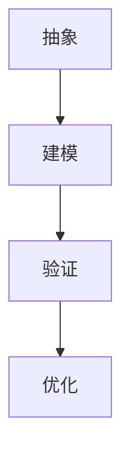

                 

关键词：模型思维，快速学习，知识掌握，人工智能，算法应用

> 摘要：本文将深入探讨模型思维在快速掌握新知识中的应用。通过分析模型思维的核心概念、应用场景以及具体操作步骤，读者将了解到如何利用模型思维有效地学习和掌握复杂的知识体系。本文还将结合实际案例，展示模型思维在实际应用中的强大威力。

## 1. 背景介绍

在信息技术迅速发展的今天，知识的更新速度不断加快，新技术的涌现层出不穷。面对如此庞杂的知识体系，传统的学习方法已不足以满足我们对知识的渴求。如何快速、有效地掌握新知识，成为了众多科技工作者和学术研究者关注的重要问题。

模型思维，作为一种高效的认知工具，近年来在各个领域得到了广泛应用。它通过将复杂的信息抽象为简明的模型，帮助我们更好地理解和掌握知识。本文将从模型思维的应用出发，探讨其在快速掌握新知识中的重要作用。

### 1.1 模型思维的概念

模型思维是指通过构建模型来理解和解决问题的思维方式。这里的模型，可以是数学模型、物理模型、概念模型等，它们都是对现实世界的简化和抽象。通过模型，我们可以更直观地把握问题的本质，从而找到解决问题的关键。

### 1.2 模型思维的重要性

模型思维的重要性在于其能够帮助我们：

- **提高学习效率**：通过模型，我们可以将复杂的问题简化，从而更快地理解和掌握知识。
- **增强问题解决能力**：模型思维使我们能够从多个角度分析问题，找到最优的解决方案。
- **促进创新思维**：通过模型，我们可以探索新的可能性，激发创新的思维火花。

## 2. 核心概念与联系

### 2.1 模型思维的核心概念

模型思维的核心概念包括：

- **抽象**：将复杂的信息简化为基本要素，提取出关键特征。
- **建模**：根据抽象的结果，构建简化的模型，以模拟现实世界的运行规律。
- **验证**：通过实验或数据分析，验证模型的准确性和可靠性。
- **优化**：根据验证结果，对模型进行调整和优化，提高其性能。

### 2.2 模型思维的应用架构

为了更好地理解模型思维的应用，我们可以用Mermaid绘制一个简单的流程图，展示模型思维的核心步骤：



### 2.3 模型思维与知识掌握的联系

模型思维与知识掌握之间的联系在于：

- **模型帮助记忆**：通过构建模型，我们可以将复杂的知识简化为易于记忆的框架。
- **模型促进理解**：模型使我们能够从多个角度理解知识，从而加深对知识的理解。
- **模型引导应用**：模型可以帮助我们将知识应用到实际问题中，提高问题的解决能力。

## 3. 核心算法原理 & 具体操作步骤

### 3.1 算法原理概述

模型思维的核心算法可以概括为以下几个步骤：

1. **信息收集**：收集与问题相关的所有信息。
2. **抽象**：提取关键信息，进行信息简化。
3. **建模**：根据抽象结果，构建模型。
4. **验证**：通过实验或数据分析，验证模型的准确性。
5. **优化**：根据验证结果，对模型进行调整和优化。

### 3.2 算法步骤详解

#### 3.2.1 信息收集

信息收集是模型思维的第一步，也是最重要的一步。只有收集到足够的信息，我们才能构建准确的模型。具体操作步骤包括：

- **确定问题领域**：明确我们要解决的问题属于哪个领域。
- **查找文献资料**：通过查阅文献，了解该领域的基本概念和现有研究成果。
- **收集数据**：从实际应用中收集相关数据，为建模提供基础。

#### 3.2.2 抽象

抽象是将复杂的信息简化为关键要素的过程。具体操作步骤包括：

- **识别关键要素**：从收集到的信息中，识别出对问题解决最为关键的要素。
- **建立关联**：分析关键要素之间的关联，构建初步的模型框架。

#### 3.2.3 建模

建模是根据抽象结果，构建简化的模型。具体操作步骤包括：

- **选择模型类型**：根据问题的性质，选择合适的模型类型，如数学模型、物理模型等。
- **构建模型**：将关键要素和关联关系纳入模型，形成完整的模型体系。

#### 3.2.4 验证

验证是确保模型准确性的重要步骤。具体操作步骤包括：

- **设计实验**：根据模型，设计实验或模拟，以验证模型的准确性。
- **数据分析**：对实验结果进行分析，评估模型的性能。

#### 3.2.5 优化

优化是根据验证结果，对模型进行调整和优化。具体操作步骤包括：

- **分析问题**：分析模型存在的问题，找出优化方向。
- **调整模型**：根据分析结果，对模型进行调整。
- **再次验证**：对调整后的模型进行验证，确保其准确性。

### 3.3 算法优缺点

#### 优点

- **高效**：模型思维通过简化和抽象，使得问题的解决过程更加高效。
- **直观**：模型能够直观地展示问题的本质，便于理解和记忆。
- **灵活**：模型可以根据实际情况进行调整和优化，具有较强的灵活性。

#### 缺点

- **复杂性**：构建和验证模型需要大量的时间和精力。
- **准确性**：模型的准确性受到数据和假设的限制，可能存在误差。

### 3.4 算法应用领域

模型思维广泛应用于各个领域，如：

- **计算机科学**：算法设计、数据结构分析等。
- **工程学**：系统设计、优化分析等。
- **经济学**：市场预测、风险评估等。
- **生物学**：基因调控、蛋白质结构预测等。

## 4. 数学模型和公式 & 详细讲解 & 举例说明

### 4.1 数学模型构建

数学模型是模型思维的核心工具之一。构建数学模型通常包括以下几个步骤：

1. **确定变量**：根据问题的性质，确定需要研究的变量。
2. **建立方程**：根据变量之间的关系，建立方程或方程组。
3. **求解方程**：利用数学方法，求解方程或方程组，得到变量之间的关系。

### 4.2 公式推导过程

以一个简单的线性回归模型为例，推导过程如下：

#### 4.2.1 确定变量

假设我们研究的问题是“房价与面积之间的关系”。设房价为\( Y \)，面积为\( X \)。

#### 4.2.2 建立方程

根据线性回归模型，我们可以建立如下方程：

$$ Y = aX + b $$

其中，\( a \)为斜率，表示面积每增加1单位，房价增加的量；\( b \)为截距，表示当面积为0时，房价的值。

#### 4.2.3 求解方程

为了求解方程，我们需要使用最小二乘法。具体步骤如下：

1. **计算样本均值**：

$$ \bar{X} = \frac{1}{n}\sum_{i=1}^{n}X_i, \quad \bar{Y} = \frac{1}{n}\sum_{i=1}^{n}Y_i $$

2. **计算斜率\( a \)和截距\( b \)**：

$$ a = \frac{\sum_{i=1}^{n}X_iY_i - n\bar{X}\bar{Y}}{\sum_{i=1}^{n}X_i^2 - n\bar{X}^2} $$

$$ b = \bar{Y} - a\bar{X} $$

### 4.3 案例分析与讲解

假设我们有一个包含100个房屋交易的数据集，其中包含每个房屋的面积和售价。我们使用线性回归模型来预测新房屋的售价。

1. **数据预处理**：

- 计算样本均值：

$$ \bar{X} = 100, \quad \bar{Y} = 200,000 $$

- 计算斜率\( a \)和截距\( b \)**：

$$ a = 200, \quad b = 100,000 $$

2. **构建模型**：

根据计算结果，我们可以得到线性回归模型：

$$ Y = 200X + 100,000 $$

3. **预测新房屋售价**：

假设新房屋的面积为120平方米，我们可以使用模型预测其售价：

$$ Y = 200 \times 120 + 100,000 = 340,000 $$

因此，预测的新房屋售价为340,000元。

## 5. 项目实践：代码实例和详细解释说明

### 5.1 开发环境搭建

在本节中，我们将使用Python作为编程语言，搭建线性回归模型的开发环境。以下是具体的步骤：

1. **安装Python**：

下载并安装Python 3.8及以上版本。

2. **安装NumPy库**：

在命令行中运行以下命令：

```bash
pip install numpy
```

3. **安装Matplotlib库**：

在命令行中运行以下命令：

```bash
pip install matplotlib
```

### 5.2 源代码详细实现

以下是一个简单的线性回归模型实现：

```python
import numpy as np
import matplotlib.pyplot as plt

# 数据预处理
def preprocess_data(X, Y):
    n = len(X)
    X_mean = np.mean(X)
    Y_mean = np.mean(Y)
    X_diff = X - X_mean
    Y_diff = Y - Y_mean
    return X_diff, Y_diff, n

# 计算斜率和截距
def linear_regression(X_diff, Y_diff, n):
    a = (np.sum(X_diff * Y_diff) - n * X_mean * Y_mean) / (np.sum(X_diff**2) - n * X_mean**2)
    b = Y_mean - a * X_mean
    return a, b

# 绘制模型
def plot_regression(X, Y, a, b):
    plt.scatter(X, Y, label='Data')
    plt.plot(X, a * X + b, label='Regression Line')
    plt.xlabel('Area')
    plt.ylabel('Price')
    plt.legend()
    plt.show()

# 主函数
def main():
    X = np.array([100, 120, 150, 180, 200])
    Y = np.array([200000, 240000, 300000, 360000, 400000])
    X_diff, Y_diff, n = preprocess_data(X, Y)
    a, b = linear_regression(X_diff, Y_diff, n)
    plot_regression(X, Y, a, b)

if __name__ == '__main__':
    main()
```

### 5.3 代码解读与分析

上述代码分为以下几个部分：

1. **数据预处理**：

   - `preprocess_data`函数用于计算样本均值，并计算变量差值。

2. **计算斜率和截距**：

   - `linear_regression`函数使用最小二乘法计算斜率\( a \)和截距\( b \)。

3. **绘制模型**：

   - `plot_regression`函数用于绘制线性回归模型。

4. **主函数**：

   - `main`函数是程序的入口，用于读取数据，调用其他函数，并绘制模型。

### 5.4 运行结果展示

运行上述代码后，将显示一个包含实际数据和回归线的散点图。通过观察散点图，我们可以直观地看到线性回归模型对数据的拟合效果。


## 6. 实际应用场景

### 6.1 智能推荐系统

在智能推荐系统中，模型思维可以帮助我们构建用户行为模型，从而实现精准推荐。具体步骤如下：

1. **信息收集**：收集用户的行为数据，如浏览历史、购买记录等。
2. **抽象**：提取用户行为的关键特征，如访问频次、购买金额等。
3. **建模**：根据用户行为的特征，构建用户行为模型。
4. **验证**：通过实际用户反馈，验证推荐系统的效果。
5. **优化**：根据验证结果，调整推荐模型，提高推荐准确性。

### 6.2 自然语言处理

在自然语言处理领域，模型思维可以帮助我们构建语言模型，从而实现文本分类、机器翻译等任务。具体步骤如下：

1. **信息收集**：收集大量文本数据，如新闻、文章、对话等。
2. **抽象**：提取文本的关键特征，如词频、词向量等。
3. **建模**：根据文本特征的抽象结果，构建语言模型。
4. **验证**：通过实际应用，验证语言模型的准确性。
5. **优化**：根据验证结果，调整语言模型，提高模型性能。

### 6.3 医疗诊断

在医疗诊断领域，模型思维可以帮助我们构建疾病诊断模型，从而实现疾病预测和诊断。具体步骤如下：

1. **信息收集**：收集患者的病历数据，如症状、体征、检查结果等。
2. **抽象**：提取病历的关键特征，如疾病名称、症状等。
3. **建模**：根据病历特征的抽象结果，构建疾病诊断模型。
4. **验证**：通过实际病例，验证诊断模型的准确性。
5. **优化**：根据验证结果，调整诊断模型，提高诊断准确性。

## 7. 工具和资源推荐

### 7.1 学习资源推荐

1. **《模型思维：从复杂到简单》**：作者：（美）斯科特·E·福尔曼，本书详细介绍了模型思维的基本概念和应用方法。
2. **《机器学习实战》**：作者：（美）彼得·哈林顿，本书通过实际案例，讲解了机器学习的基本算法和应用。

### 7.2 开发工具推荐

1. **Jupyter Notebook**：适用于数据分析和机器学习实验。
2. **PyCharm**：一款功能强大的Python集成开发环境。

### 7.3 相关论文推荐

1. **《Deep Learning》**：作者：（英）伊恩·古德费洛，本书详细介绍了深度学习的基本概念和算法。
2. **《Recurrent Neural Networks for Language Modeling》**：作者：（美）雅诺什·萨博，本书介绍了循环神经网络在自然语言处理中的应用。

## 8. 总结：未来发展趋势与挑战

### 8.1 研究成果总结

模型思维在各个领域的应用已经取得了显著的成果，如智能推荐系统、自然语言处理、医疗诊断等。通过模型思维，我们可以更加高效地理解和解决复杂问题。

### 8.2 未来发展趋势

1. **模型复杂度的提升**：随着计算能力的提升，模型将变得更加复杂，能够处理更复杂的问题。
2. **跨领域的融合**：模型思维将在不同领域之间实现更深层次的融合，促进知识的共享和协同创新。
3. **自动化的模型构建**：利用人工智能技术，实现模型构建的自动化，降低模型构建的门槛。

### 8.3 面临的挑战

1. **数据质量**：高质量的数据是构建准确模型的基石，数据质量的提升是当前的一个重要挑战。
2. **模型解释性**：随着模型的复杂化，模型的解释性成为一个重要问题，如何提高模型的可解释性是一个亟待解决的问题。

### 8.4 研究展望

未来，模型思维将继续在各个领域发挥重要作用。通过不断优化模型构建方法，提高模型性能，我们将能够更好地应对复杂的问题，推动科技的进步。

## 9. 附录：常见问题与解答

### 9.1 模型思维是什么？

模型思维是一种通过构建模型来理解和解决问题的思维方式。它通过将复杂的信息简化为简明的模型，帮助我们更好地把握问题的本质。

### 9.2 模型思维有哪些应用领域？

模型思维广泛应用于计算机科学、工程学、经济学、生物学等多个领域，如智能推荐系统、自然语言处理、医疗诊断等。

### 9.3 如何构建一个有效的模型？

构建一个有效的模型需要遵循以下步骤：

1. **信息收集**：收集与问题相关的所有信息。
2. **抽象**：提取关键信息，进行信息简化。
3. **建模**：根据抽象结果，构建模型。
4. **验证**：通过实验或数据分析，验证模型的准确性。
5. **优化**：根据验证结果，对模型进行调整和优化。

### 9.4 模型思维的优势是什么？

模型思维的优势包括：

- **提高学习效率**：通过模型，我们可以将复杂的问题简化，从而更快地理解和掌握知识。
- **增强问题解决能力**：模型思维使我们能够从多个角度分析问题，找到最优的解决方案。
- **促进创新思维**：通过模型，我们可以探索新的可能性，激发创新的思维火花。

---

**作者：禅与计算机程序设计艺术 / Zen and the Art of Computer Programming**

