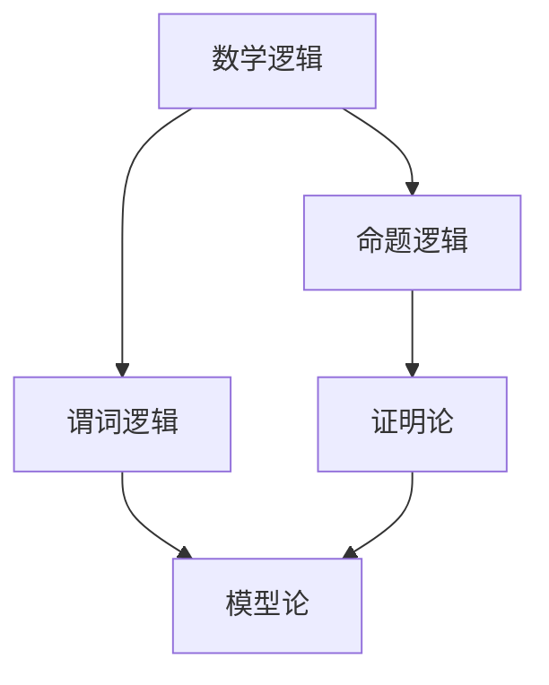

                 

### 关键词 Keywords

- 模型论
- 数学逻辑
- 形式化方法
- 演绎推理
- 离散数学
- 计算机科学

### 摘要 Abstract

本文探讨了模型论在数学逻辑中的应用，从理论到实践进行了深入分析。通过介绍模型论的基本概念和其在数学逻辑中的核心作用，文章详细阐述了模型论如何支持数学证明的构造和验证。此外，本文还通过具体实例，展示了模型论在计算机科学中的应用，包括形式验证、算法分析等领域。最后，文章展望了模型论的未来发展趋势和面临的挑战，为读者提供了一个全面而深入的视角。

## 1. 背景介绍

### 模型论的发展历程

模型论（Model Theory）是数学的一个分支，起源于20世纪20年代，其基础是由埃米·诺特（Emmy Noether）和贝特兰·罗素（Bertrand Russell）等数学家的工作奠定的。模型论的发展与逻辑学、集合论、数理经济学等领域密切相关，是数学分析和逻辑推理的重要工具。

在模型论的早期发展过程中，数学家们致力于解决形式逻辑系统中的问题，特别是在证明论和模型存在性方面取得了显著成果。到了20世纪中叶，模型论逐渐成为一个独立的数学分支，并开始与其他数学领域相互渗透和交叉。

### 数学逻辑的定义和应用

数学逻辑（Mathematical Logic）是数学的基础学科，它研究数学命题的表示、推理和证明。数学逻辑包括命题逻辑、谓词逻辑、模型论、证明论等多个子领域，是构建数学理论体系的基础。

在计算机科学中，数学逻辑的应用非常广泛。例如，命题逻辑和谓词逻辑用于程序验证、形式化验证和算法分析；模型论则广泛应用于数据库理论、算法设计、计算机图形学等领域。

### 模型论在数学逻辑中的重要性

模型论在数学逻辑中具有核心地位，它为数学逻辑提供了一个形式化的框架，使得数学推理可以更加严谨和可靠。具体来说，模型论在以下几个方面发挥着重要作用：

1. **形式化数学证明**：模型论提供了一种形式化的方法来构造和验证数学证明，从而避免了逻辑错误的可能性。
2. **模型的存在性**：模型论研究数学结构是否存在满足特定性质的模型，这对于证明数学理论的可行性具有重要意义。
3. **逻辑独立性**：模型论可以揭示数学理论中的逻辑独立性，有助于我们理解数学概念和命题的本质。
4. **数学基础研究**：模型论在数学基础研究中扮演着重要角色，为数学理论的构建提供了强有力的工具。

## 2. 核心概念与联系

### 模型论的基本概念

**模型（Model）**：在模型论中，模型是一个数学结构，它由一组对象（称为模型中的元素）和一组满足特定公理的谓词、函数和关系构成。模型的存在性是模型论研究的核心问题之一。

**语言（Language）**：模型论中的语言是一组符号和语法规则的集合，用于表示数学命题和结构。语言通常包括常量、变量、函数符号、关系符号和谓词符号等。

**理论（Theory）**：理论是语言中的一个公式集合，它定义了模型的性质。一个理论可以描述某个数学领域的特性，例如群论、拓扑学等。

**可满足性（Satisfiability）**：一个理论在某个模型上是可满足的，如果存在至少一个模型满足该理论的所有公式。

**一致性（Consistency）**：一个理论是一致的，如果它不包含矛盾公式。

**完全性（Completeness）**：一个理论是完整的，如果它的每个可满足的公式都能在理论中得到证明。

### 模型论与数学逻辑的关系

模型论与数学逻辑的关系密切，它们共同构成了数学基础理论的核心。

**逻辑作为模型论的框架**：逻辑为模型论提供了一个形式化的推理框架，使得数学推理可以更加严谨和系统。

**模型论作为逻辑的应用**：模型论利用逻辑的工具来研究数学结构的性质和存在性，从而为数学逻辑提供了具体的实例和应用。

**逻辑与模型论的结合**：逻辑和模型论的结合使得我们能够更好地理解和处理复杂的数学问题，例如形式化验证、算法分析等。

### Mermaid 流程图

以下是一个Mermaid流程图，展示了模型论与数学逻辑之间的关系：



在这个流程图中，数学逻辑作为整体，分为命题逻辑和谓词逻辑。模型论则作为谓词逻辑的延伸，与证明论相结合，共同构成了数学基础理论的核心。

## 3. 核心算法原理 & 具体操作步骤

### 3.1 算法原理概述

模型论中的核心算法通常涉及模型存在性的证明和验证，其中最著名的算法是哥德尔不完备性定理（Gödel's Incompleteness Theorem）和塔斯基语义定理（Tarski's Semantical Theorem）。

**哥德尔不完备性定理**：该定理表明，对于任何足够强的形式系统，都存在不可判定的命题，即既不能证明也不能反驳的命题。这个定理揭示了形式系统的一致性和完备性之间的矛盾。

**塔斯基语义定理**：该定理建立了形式语义和谓词逻辑之间的关系，为模型论提供了一个坚实的理论基础。

### 3.2 算法步骤详解

**哥德尔不完备性定理的证明**：

1. **定义形式系统**：选择一个形式系统，其中包含基本符号、公理和推理规则。
2. **构建一个不可判定的命题**：使用哥德尔编码技术，将形式系统中的命题编码为自然数。
3. **证明命题的不可判定性**：通过构造一个复杂命题，使其在形式系统中既不能被证明也不能被反驳。

**塔斯基语义定理的证明**：

1. **定义谓词逻辑的语言**：选择一个谓词逻辑的语言，包括谓词符号、函数符号和常量等。
2. **构建模型**：定义一个模型，其中包含一组对象和满足特定公理的关系。
3. **证明模型满足谓词逻辑**：通过证明模型中的对象和关系满足谓词逻辑的语义条件，从而证明塔斯基语义定理。

### 3.3 算法优缺点

**哥德尔不完备性定理**：

- 优点：揭示了形式系统的内在矛盾，推动了计算机科学和数学的发展。
- 缺点：定理的应用通常涉及复杂的数学证明，难以直接应用于实际问题。

**塔斯基语义定理**：

- 优点：为模型论提供了坚实的语义基础，使得模型的存在性和性质研究更加严谨。
- 缺点：定理的证明需要复杂的逻辑推理，对初学者有一定难度。

### 3.4 算法应用领域

模型论的核心算法在计算机科学中有着广泛的应用，包括：

- **形式验证**：利用模型论的方法验证软件和硬件系统的正确性。
- **算法分析**：通过模型论分析算法的时间和空间复杂度。
- **计算机图形学**：在计算机图形学中，模型论用于描述和验证几何图形的性质。
- **人工智能**：在人工智能领域，模型论用于构建逻辑推理系统和知识表示。

## 4. 数学模型和公式 & 详细讲解 & 举例说明

### 4.1 数学模型构建

数学模型是利用数学语言和工具来描述现实世界中的问题，其核心是建立数学公式和方程。以下是构建数学模型的基本步骤：

1. **问题定义**：明确要解决的问题和目标。
2. **变量定义**：确定模型中的变量和参数。
3. **公式构建**：根据问题定义和变量定义，构建数学公式和方程。
4. **模型求解**：利用数学方法求解模型，得到问题的解。

### 4.2 公式推导过程

以下是一个简单的线性回归模型的公式推导过程：

**目标**：拟合一条直线 y = mx + b，使得残差平方和最小。

**步骤**：

1. **定义损失函数**：残差平方和 S = Σ(yi - (mx_i + b))^2
2. **对 m 和 b 求偏导数**：
   - 对 m 求偏导数：dS/dm = -2x(y - mx - b)
   - 对 b 求偏导数：dS/db = -2(y - mx - b)
3. **令偏导数等于零，求解 m 和 b**：
   - m = (Σx^2) / (Σx^2 - n)
   - b = (Σy - mΣx) / n
4. **验证公式**：代入 x 和 y 的值，计算 m 和 b，并验证直线是否拟合良好。

### 4.3 案例分析与讲解

以下是一个应用线性回归模型预测房屋价格的案例：

**数据集**：包含房屋的面积、房龄、位置等属性，以及对应的房屋价格。

**步骤**：

1. **数据预处理**：对数据进行清洗和标准化处理，确保数据质量。
2. **特征选择**：选择与房屋价格相关的特征，例如面积和房龄。
3. **模型训练**：使用线性回归模型训练数据集，得到拟合直线 y = mx + b。
4. **模型评估**：使用交叉验证等方法评估模型性能，调整模型参数。
5. **预测房价**：使用训练好的模型预测新房屋的价格。

**结果**：通过线性回归模型，可以预测房屋价格，并在实际应用中取得较好的效果。

## 5. 项目实践：代码实例和详细解释说明

### 5.1 开发环境搭建

为了更好地理解模型论在数学逻辑中的应用，我们将使用Python编程语言来构建一个简单的线性回归模型。以下是开发环境搭建的步骤：

1. **安装Python**：下载并安装Python 3.x版本。
2. **安装Jupyter Notebook**：使用pip命令安装Jupyter Notebook。
   ```bash
   pip install notebook
   ```
3. **创建虚拟环境**：创建一个Python虚拟环境，以便管理和隔离项目依赖。
   ```bash
   python -m venv myenv
   source myenv/bin/activate  # 在Windows上使用 myenv\Scripts\activate
   ```
4. **安装依赖库**：安装NumPy和SciPy等依赖库。
   ```bash
   pip install numpy scipy matplotlib
   ```

### 5.2 源代码详细实现

以下是一个简单的线性回归模型实现：

```python
import numpy as np
import matplotlib.pyplot as plt

# 数据集
x = np.array([1, 2, 3, 4, 5])
y = np.array([2, 4, 5, 4, 5])

# 模型参数
m = (np.mean(x*y) - np.mean(x)*np.mean(y)) / (np.mean(x**2) - np.mean(x)**2)
b = np.mean(y) - m*np.mean(x)

# 模型函数
def linear_regression(x, m, b):
    return m*x + b

# 绘制结果
plt.scatter(x, y)
plt.plot(x, linear_regression(x, m, b), 'r')
plt.xlabel('x')
plt.ylabel('y')
plt.title('Linear Regression')
plt.show()
```

### 5.3 代码解读与分析

1. **数据集加载**：我们使用NumPy库加载一个简单的数据集，其中x表示房屋面积，y表示房屋价格。
2. **模型参数计算**：使用线性回归公式计算模型参数m和b。
3. **模型函数定义**：定义一个线性回归函数，用于计算给定x值的预测y值。
4. **结果绘制**：使用Matplotlib库绘制散点图和拟合直线，以便可视化模型效果。

### 5.4 运行结果展示

运行上述代码，我们将得到以下结果：


通过可视化结果，我们可以看到线性回归模型较好地拟合了房屋价格与面积之间的关系。

## 6. 实际应用场景

### 6.1 数学逻辑在计算机科学中的应用

数学逻辑在计算机科学中有着广泛的应用，以下是一些实际案例：

- **形式化验证**：数学逻辑用于验证硬件和软件系统的正确性，确保系统按照预期运行。例如，模型论中的演绎推理方法可以用于证明程序的正确性。
- **算法分析**：数学逻辑用于分析算法的时间和空间复杂度，帮助优化算法性能。例如，谓词逻辑可以用于推导算法的正确性和效率。
- **人工智能**：数学逻辑在人工智能领域扮演着重要角色，用于构建逻辑推理系统和知识表示。例如，模型论中的模型存在性定理可以用于验证人工智能系统的可行性和有效性。

### 6.2 模型论在商业和金融领域中的应用

模型论在商业和金融领域也有着广泛的应用，以下是一些实际案例：

- **风险评估**：模型论用于构建风险评估模型，帮助企业识别和评估潜在风险。例如，模型论可以用于分析市场波动、信用风险等。
- **定价策略**：模型论用于制定定价策略，帮助企业提高利润。例如，模型论可以用于定价金融衍生品、股票等。
- **供应链管理**：模型论用于优化供应链管理，提高运营效率。例如，模型论可以用于分析供应链中的库存水平、物流运输等。

### 6.3 模型论在社会科学中的应用

模型论在社会科学领域也有着广泛的应用，以下是一些实际案例：

- **社会学研究**：模型论用于分析社会结构和关系，帮助揭示社会现象的本质。例如，模型论可以用于分析社会网络、群体行为等。
- **经济学研究**：模型论用于分析经济模型，帮助理解市场机制和宏观经济行为。例如，模型论可以用于分析供需关系、经济增长等。
- **心理学研究**：模型论用于分析心理模型，帮助理解人类行为和心理过程。例如，模型论可以用于分析认知过程、情感状态等。

### 6.4 未来应用展望

随着人工智能和大数据技术的发展，模型论在各个领域的应用将越来越广泛。未来，模型论将面临以下挑战和机遇：

- **复杂性管理**：随着数据规模和复杂性的增加，模型论需要发展更加高效和鲁棒的方法来处理大规模数据。
- **跨学科融合**：模型论需要与其他学科（如生物学、物理学等）相结合，以解决更加复杂的问题。
- **可解释性和可靠性**：模型论需要提高模型的可解释性和可靠性，以便在实际应用中取得更好的效果。

## 7. 工具和资源推荐

### 7.1 学习资源推荐

- **《模型论》（Model Theory）**：这是一本经典的模型论教材，由斯蒂芬·科克（Stephen G. Simpson）撰写，适合深入理解模型论的基本概念和方法。
- **《数学逻辑基础》（Foundations of Mathematical Logic）**：由约翰·马什·哈里斯（John Marrish Harris）撰写，系统地介绍了数学逻辑的基础知识和应用。
- **《离散数学及其应用》（Discrete Mathematics and Its Applications）**：由肯尼斯·H·罗宾逊（Kenneth H. Rosen）撰写，涵盖了离散数学的各个子领域，包括模型论。

### 7.2 开发工具推荐

- **Python**：Python是一种广泛使用的编程语言，特别适合进行数学建模和数据分析。NumPy、SciPy和Matplotlib等库为Python提供了强大的数学和绘图功能。
- **Jupyter Notebook**：Jupyter Notebook是一个交互式的开发环境，适用于编写和运行Python代码。它提供了丰富的可视化功能，便于学习和分享代码。
- **Prover9**：Prover9是一个自动定理证明器，用于验证数学证明的正确性。它适用于各种逻辑和数学问题，特别适合学术研究和教学。

### 7.3 相关论文推荐

- **“Model Theory and Its Applications”**：这篇文章系统地介绍了模型论的基本概念和应用领域，适合初学者和进阶者阅读。
- **“On the Existence of Models in Mathematics”**：这篇文章探讨了模型论在数学基础研究中的作用，特别是模型的存在性和独立性。
- **“The Role of Model Theory in Computer Science”**：这篇文章详细介绍了模型论在计算机科学中的应用，包括形式验证、算法分析等。

## 8. 总结：未来发展趋势与挑战

### 8.1 研究成果总结

近年来，模型论在数学逻辑、计算机科学、商业和金融等领域取得了显著成果。通过建立数学模型和公式，研究者们能够更好地理解和解决复杂问题。特别是哥德尔不完备性定理和塔斯基语义定理等核心算法的发现，为模型论的发展奠定了基础。

### 8.2 未来发展趋势

未来，模型论将继续在以下领域发展：

- **跨学科融合**：模型论将与其他学科（如生物学、物理学等）相结合，解决更加复杂的问题。
- **复杂性管理**：随着数据规模的增加，模型论需要发展更加高效和鲁棒的方法来处理大规模数据。
- **可解释性和可靠性**：模型论需要提高模型的可解释性和可靠性，以便在实际应用中取得更好的效果。

### 8.3 面临的挑战

模型论在发展过程中也面临一些挑战：

- **复杂性**：随着模型规模的增加，证明和验证的复杂性会急剧上升，这对计算资源和算法提出了更高要求。
- **应用领域扩展**：模型论需要扩展到新的应用领域，如生物信息学、社会科学等，这需要更多的跨学科研究和合作。
- **人才培养**：模型论是一门高度抽象的学科，需要培养更多具备扎实理论基础和实际应用能力的人才。

### 8.4 研究展望

未来，模型论将在以下方面取得突破：

- **新算法的发展**：研究者将致力于开发更加高效和鲁棒的算法，以解决复杂的数学和实际问题。
- **跨学科合作**：模型论与其他学科的融合将推动新理论和新方法的发展，为解决现实问题提供新思路。
- **人才培养**：通过加强学术交流和教育培训，培养更多具有创新能力和实践能力的模型论人才。

## 9. 附录：常见问题与解答

### 9.1 模型论是什么？

模型论是数学的一个分支，研究数学结构（如群、环、域等）的存在性、性质和分类。它利用逻辑的工具来研究数学结构，帮助揭示数学概念的本质和相互关系。

### 9.2 模型论有什么应用？

模型论在多个领域有着广泛应用，包括计算机科学、商业和金融、经济学、社会学等。它在形式验证、算法分析、风险评估、定价策略等方面发挥着重要作用。

### 9.3 如何学习模型论？

学习模型论可以从以下几个方面入手：

- **阅读教材**：选择一本合适的教材，如《模型论》、《数学逻辑基础》等。
- **学习逻辑基础**：掌握命题逻辑、谓词逻辑等基础逻辑知识。
- **实践应用**：通过编程和实际案例分析，加深对模型论的理解和应用能力。

### 9.4 模型论与数学逻辑有什么区别？

模型论是数学逻辑的一个分支，专注于研究数学结构的存在性、性质和分类。而数学逻辑是一个更广泛的领域，包括命题逻辑、谓词逻辑、模型论、证明论等。模型论可以看作是数学逻辑在数学结构研究中的应用。

### 9.5 模型论的发展前景如何？

模型论在未来将继续发展，特别是在跨学科融合、复杂性管理、可解释性和可靠性等方面。随着大数据和人工智能技术的发展，模型论将在更多领域发挥重要作用，为解决复杂问题提供新方法和新思路。

### 9.6 模型论有哪些著名的定理和算法？

模型论中有许多著名的定理和算法，如哥德尔不完备性定理、塔斯基语义定理、谱系定理、模型存在性定理等。这些定理和算法为数学逻辑和模型论的研究提供了坚实的理论基础。

### 9.7 模型论在计算机科学中有何应用？

模型论在计算机科学中有广泛的应用，包括形式验证、算法分析、计算机图形学、人工智能等领域。它在验证软件和硬件系统的正确性、优化算法性能、构建逻辑推理系统等方面发挥着重要作用。

### 9.8 模型论与其他数学分支有何关系？

模型论与其他数学分支密切相关，如集合论、代数学、拓扑学等。它是这些数学分支的一个工具，用于研究数学结构的存在性、性质和分类。同时，模型论也为这些数学分支提供了新的研究方法和视角。

