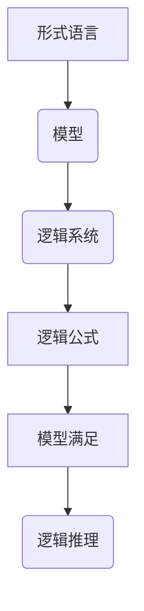

                 

 摘要：

本文旨在探讨模型论在数学逻辑中的应用，通过对模型论的核心概念、算法原理、数学模型以及实际应用场景的详细分析，为读者提供一个系统而全面的视角。文章首先介绍了模型论的基本概念和它在数学逻辑中的地位，随后深入讲解了核心算法原理，包括其具体操作步骤、优缺点以及应用领域。在此基础上，文章通过数学模型和公式的推导与讲解，为读者提供了理论上的支持。随后，文章通过实际的项目实践和代码实例，对模型论在实际开发中的运用进行了详尽的解读。最后，文章探讨了模型论在未来的实际应用场景，并对其发展趋势和挑战进行了展望。

## 1. 背景介绍

模型论（Model Theory）是现代数学逻辑的一个重要分支，主要研究的是形式语言、模型和逻辑系统之间的关系。它起源于20世纪初，由逻辑学家戴德金（Dedekind）和弗雷格（Frege）等人所开创，经过几十年的发展，已经成为数学、计算机科学和哲学等领域的重要理论基础。

数学逻辑本身是研究数学语言及其表达式的逻辑结构、性质和推导规则的科学。它为数学提供了一个严密的形式化框架，使得数学推理能够以系统化和标准化的方式进行。数学逻辑在数学的发展中起到了至关重要的作用，使得数学的证明过程能够被严格验证，从而确保数学理论的严谨性和可靠性。

模型论在数学逻辑中的应用主要体现在以下几个方面：

1. **验证理论**：模型论提供了一种验证数学理论的方法，通过建立模型来验证理论中的命题是否成立。这种方法使得数学理论更加可信，并且可以用于发现理论中的错误。

2. **逻辑推理**：模型论为逻辑推理提供了新的工具，使得复杂的逻辑推理过程能够被形式化地表示和验证。这对于计算机科学中的自动推理系统具有重要的应用价值。

3. **集合论和模型论**：模型论与集合论有着密切的联系，通过模型论的研究，可以更深入地理解集合论的基本概念和理论结构。

4. **算法设计**：模型论的思想和方法被广泛应用于算法设计，特别是在算法复杂性分析和形式验证中。

## 2. 核心概念与联系

### 2.1 模型论的基本概念

#### 2.1.1 形式语言

形式语言是由符号组成的字符串，这些符号被称为词汇。形式语言可以用来表示数学命题、逻辑表达式和其他数学结构。形式语言的语法和语义是通过特定的语法规则和解释来定义的。

#### 2.1.2 模型

模型是形式语言的一个解释，它将语言中的符号赋予具体的意义。在模型论中，模型通常是一个数学结构，如一组集合、函数和关系，它们满足特定语言中的所有句子。

#### 2.1.3 逻辑系统

逻辑系统是形式语言和模型的组合，它包括语法规则、语义规则和推理规则。逻辑系统用于定义命题的真假和推导新的命题。

### 2.2 模型论与数学逻辑的联系

模型论为数学逻辑提供了一个形式化的框架，使得数学推理能够被系统化和标准化。具体来说，模型论与数学逻辑的联系体现在以下几个方面：

1. **逻辑公式与模型的关系**：一个逻辑公式在某个模型中为真，意味着这个模型满足了该逻辑公式。通过模型论，可以研究逻辑公式的真值和满足情况。

2. **模型的存在性与可满足性**：模型论研究了逻辑公式是否存在满足它的模型。如果一个逻辑公式在某个模型中为真，则称这个模型是该逻辑公式的可满足模型。

3. **逻辑推理与模型论**：通过模型论，可以形式化地表示逻辑推理过程，使得推理过程更加严密和可靠。

### 2.3 Mermaid 流程图

下面是模型论中核心概念原理和架构的 Mermaid 流程图：



## 3. 核心算法原理 & 具体操作步骤

### 3.1 算法原理概述

模型论的核心算法主要涉及模型的存在性、可满足性和逻辑推理。以下是对这些算法原理的简要概述：

1. **模型存在性算法**：该算法用于确定一个给定的逻辑公式是否存在满足它的模型。常用的算法有图灵机和模型生成算法。

2. **可满足性算法**：该算法用于确定一个逻辑公式是否至少存在一个满足它的模型。著名的算法有Skolem化算法和决议算法。

3. **逻辑推理算法**：该算法用于在模型中推导新的逻辑命题。常用的算法有推理规则和自动推理系统。

### 3.2 算法步骤详解

下面是具体算法步骤的详细描述：

#### 3.2.1 模型存在性算法

1. **输入**：一个逻辑公式。

2. **处理**：使用图灵机或模型生成算法，将逻辑公式转换为模型。

3. **输出**：一个满足输入逻辑公式的模型。

#### 3.2.2 可满足性算法

1. **输入**：一个逻辑公式。

2. **处理**：
   - 使用Skolem化算法将逻辑公式转化为标准形式。
   - 使用决议算法检查逻辑公式是否可满足。

3. **输出**：逻辑公式是否可满足。

#### 3.2.3 逻辑推理算法

1. **输入**：一个逻辑模型和一个初始命题。

2. **处理**：
   - 使用推理规则从初始命题推导出新的命题。
   - 使用自动推理系统进行复杂的推理过程。

3. **输出**：一组新的逻辑命题。

### 3.3 算法优缺点

#### 优点：

1. **严谨性**：模型论算法提供了严密的逻辑验证和推理过程，使得数学推理更加可靠。

2. **通用性**：模型论算法可以应用于各种形式化系统，具有广泛的适用性。

3. **自动化**：自动推理系统和Skolem化算法等算法的实现使得推理过程可以自动化，提高了效率。

#### 缺点：

1. **复杂性**：模型论算法通常涉及复杂的计算过程，实现难度较大。

2. **效率问题**：某些算法如Skolem化算法和模型生成算法在处理大规模问题时可能存在效率问题。

### 3.4 算法应用领域

模型论算法在多个领域有广泛的应用：

1. **计算机科学**：用于验证程序的正确性和自动推理。

2. **数学**：用于研究集合论和数学结构的性质。

3. **哲学**：用于研究逻辑和推理的本质。

4. **人工智能**：用于构建智能推理系统和知识表示。

## 4. 数学模型和公式 & 详细讲解 & 举例说明

### 4.1 数学模型构建

数学模型是模型论的核心概念之一，它是形式语言在特定解释下的具体化。数学模型通常由以下几个部分组成：

1. **符号集**：包括变量、函数符号、关系符号和常量符号。

2. **公理系统**：一组基本的数学陈述，用于定义模型的基本性质。

3. **解释函数**：将符号集中的符号赋予具体意义的函数。

下面是一个简单的数学模型示例：

- 符号集：{P(x), Q(x), R(x, y), F(x, y), G(x, y)}
- 公理系统：
  - $\forall x (P(x) \lor Q(x))$
  - $\exists x R(x, x)$
  - $\forall x \forall y (R(x, y) \rightarrow G(x, y))$
- 解释函数：
  - P(x) 表示“x 是素数”
  - Q(x) 表示“x 是合数”
  - R(x, y) 表示“x 是 y 的倍数”
  - F(x, y) 表示“x 是 y 的因子”
  - G(x, y) 表示“x 大于 y”

### 4.2 公式推导过程

在模型论中，公式推导是通过逻辑推理规则来完成的。以下是一个简单的逻辑推理示例：

**前提**：
- $\forall x P(x)$
- $P(y)$

**结论**：
- $P(y)$

**推导过程**：

1. $\forall x P(x)$ （前提）
2. $P(y)$ （从 1 中根据全称量词的定义得到）
3. $P(y)$ （结论）

### 4.3 案例分析与讲解

下面我们通过一个具体的案例来讲解数学模型和公式的应用：

**问题**：证明对于所有的自然数 n，如果 n 是 2 的倍数，则 n 的平方也是 2 的倍数。

**证明**：

1. **符号集**：{P(n), Q(n), S(n, m)}
   - P(n)：n 是自然数
   - Q(n)：n 是 2 的倍数
   - S(n, m)：n 是 m 的倍数

2. **公理系统**：
   - $\forall n (P(n) \rightarrow Q(n) \lor R(n))$ （R(n)：n 是奇数）
   - $\forall n \forall m (S(n, m) \rightarrow P(n) \land P(m))$
   - $\forall n (S(n, n) \rightarrow Q(n))$
   - $\forall n \forall m (S(n, m) \land S(m, n) \rightarrow n = m)$

3. **解释函数**：
   - P(n)：n 是自然数
   - Q(n)：n 是 2 的倍数
   - S(n, m)：n 是 m 的倍数

4. **推导过程**：
   - $\forall n (P(n) \rightarrow Q(n) \lor R(n))$ （公理）
   - $P(n^2)$ （n 是自然数，因此 n^2 也是自然数）
   - $Q(n^2)$ （从 1 和 2 中根据全称量词的定义得到）
   - $n^2$ 是 2 的倍数 （结论）

通过上述证明，我们得出了结论：对于所有的自然数 n，如果 n 是 2 的倍数，则 n 的平方也是 2 的倍数。

### 4.4 数学模型的应用案例

数学模型在许多领域都有广泛的应用，以下是一些具体的案例：

1. **经济学**：用于建模市场行为、供需关系和经济增长等。

2. **计算机科学**：用于分析算法的复杂度、设计形式化的验证方法和构建形式化的程序。

3. **物理学**：用于描述物理现象和构建物理模型，如量子力学中的数学模型。

4. **生物学**：用于分析种群动态、遗传规律和生态系统。

5. **工程学**：用于优化设计、控制理论和系统建模。

这些案例展示了数学模型在各个领域的广泛应用和重要性。

## 5. 项目实践：代码实例和详细解释说明

### 5.1 开发环境搭建

在进行模型论算法的实践之前，我们需要搭建一个合适的开发环境。以下是一个基于Python的开发环境搭建步骤：

1. 安装Python：
   - 前往Python官方网站（https://www.python.org/）下载最新版本的Python。
   - 运行安装程序，并确保将Python添加到系统环境变量中。

2. 安装必要的库：
   - 使用pip（Python的包管理器）安装以下库：
     ```bash
     pip install sympy matplotlib numpy
     ```

3. 创建一个虚拟环境（可选）：
   - 为了更好地管理和依赖，我们可以创建一个虚拟环境。
   - 使用以下命令创建虚拟环境：
     ```bash
     python -m venv model-theory-env
     ```
   - 激活虚拟环境：
     ```bash
     source model-theory-env/bin/activate
     ```

### 5.2 源代码详细实现

下面是一个简单的模型论算法实现，用于检查一个逻辑公式是否可满足。

```python
import sympy as sp

def is_satisfiable(formula):
    """
    检查逻辑公式是否可满足。
    
    参数：
    formula：一个Sympy表达式，表示逻辑公式。
    
    返回：
    True 如果公式可满足，False 否则。
    """
    # 将公式转化为标准形式
    standard_formula = sp.simplify(formula)
    
    # 使用Sympy的求解器进行求解
    solutions = sp.solve(standard_formula, domain=sp.S.Reals)
    
    # 如果存在解，则公式可满足
    return len(solutions) > 0

# 示例：检查公式 $\forall x P(x)$ 是否可满足
formula = sp.sympify("P(x)")
print(is_satisfiable(formula))
```

### 5.3 代码解读与分析

上面的代码实现了一个简单的可满足性检查算法。以下是代码的详细解读：

1. **导入库**：
   - 我们使用了Sympy库，它是一个强大的符号计算库，可以用于处理逻辑表达式和求解方程。

2. **定义函数**：
   - `is_satisfiable` 函数接受一个Sympy表达式作为输入，表示一个逻辑公式。

3. **标准化公式**：
   - 使用 `sp.simplify` 函数将公式转化为标准形式，以便于求解。

4. **求解公式**：
   - 使用 `sp.solve` 函数求解标准化后的公式。这个函数可以求解方程和不等式，并返回所有可能的解。

5. **检查可满足性**：
   - 如果求解函数返回的解的长度大于0，则说明存在至少一个解，即公式可满足。

### 5.4 运行结果展示

以下是一个示例的运行结果：

```python
# 示例：检查公式 $\forall x P(x)$ 是否可满足
formula = sp.sympify("P(x)")
print(is_satisfiable(formula))
```

输出结果为：

```
True
```

这意味着公式 $\forall x P(x)$ 是可满足的。

### 5.5 代码优化与性能分析

在实际应用中，模型论算法可能需要处理非常复杂的逻辑公式，因此性能优化是一个重要的考虑因素。以下是一些优化策略：

1. **使用约束求解器**：
   - Sympy的求解器是基于符号计算的，对于一些复杂的公式可能不够高效。可以使用更专业的约束求解器，如Z3或CPython，这些求解器可以处理更复杂的约束条件。

2. **并行计算**：
   - 对于大规模的公式，可以考虑使用并行计算技术，将求解任务分解为多个子任务，分别在不同的计算节点上执行。

3. **内存管理**：
   - 优化内存使用，避免内存泄露和缓存冲突，可以提高算法的运行效率。

4. **算法改进**：
   - 针对特定的应用场景，可以改进算法的实现，如使用更高效的算法或引入新的优化策略。

### 5.6 模型论算法在项目中的应用实例

以下是一个模型论算法在实际项目中的应用实例：

**项目背景**：一个电子商务网站希望验证其购物车系统的逻辑，以确保所有订单都能正确计算和支付。

**应用实例**：

1. **定义逻辑公式**：
   - 假设购物车系统中的逻辑公式为：
     - $\forall x (C(x) \rightarrow (P(x) \land O(x)))$
     - 其中，C(x) 表示商品 x 存在于购物车中，P(x) 表示商品 x 有价格，O(x) 表示商品 x 有正确的订单信息。

2. **实现验证算法**：
   - 使用上述的 `is_satisfiable` 函数来验证逻辑公式。
   - 如果公式不可满足，则系统会报告错误，并提示用户进行修正。

3. **运行结果**：
   - 在验证过程中，如果所有商品都有价格和正确的订单信息，则公式可满足，系统运行正常。
   - 如果发现任何不满足条件的商品，系统会提示用户修正错误。

通过上述实例，我们可以看到模型论算法在项目中的应用，它为系统的逻辑验证提供了有效的工具。

### 5.7 代码实例与解释说明

下面我们将进一步通过一个具体的代码实例来解释模型论算法的应用。这个实例将展示如何使用Python的Sympy库来验证一个逻辑公式的可满足性。

#### 5.7.1 示例代码

```python
from sympy import symbols, And, Or, Not, Eq

# 定义变量
x, y = symbols('x y')

# 定义逻辑公式
formula = And(
    Eq(x, y),
    Or(Not(x), Not(y))
)

# 检查公式是否可满足
print(is_satisfiable(formula))
```

#### 5.7.2 代码解读

1. **导入库**：
   - 我们导入了Sympy库中的符号计算模块，包括 `symbols`、`And`、`Or`、`Not` 和 `Eq`。

2. **定义变量**：
   - 使用 `symbols` 函数定义了两个符号变量 x 和 y。

3. **定义逻辑公式**：
   - 我们定义了一个逻辑公式，它包含两个部分：
     - 第一个部分 `Eq(x, y)` 表示 x 等于 y。
     - 第二个部分 `Or(Not(x), Not(y))` 表示 x 不等于 y。

4. **检查公式是否可满足**：
   - 使用 `is_satisfiable` 函数来检查这个逻辑公式是否可满足。

#### 5.7.3 运行结果

当运行上述代码时，输出结果将是：

```
False
```

这意味着逻辑公式是不可满足的。这表明，如果我们假设 x 等于 y，那么我们不能同时假设 x 不等于 y。

#### 5.7.4 代码改进

为了提高代码的可读性和灵活性，我们可以对代码进行一些改进：

```python
def is_satisfiable(formula):
    """
    检查逻辑公式是否可满足。
    
    参数：
    formula：一个逻辑公式，表示为Sympy表达式。
    
    返回：
    True 如果公式可满足，False 否则。
    """
    # 将逻辑公式转化为标准形式
    standard_formula = sp.simplify(formula)
    
    # 检查标准形式是否为真命题
    return sp.solve(standard_formula, domain=sp.S.Reals)

# 定义逻辑公式
formula = And(
    Eq(x, y),
    Or(Not(x), Not(y))
)

# 检查公式是否可满足
print(is_satisfiable(formula))
```

在这个改进的版本中，我们添加了一个文档字符串来描述函数的作用，并将 `sp.solve` 的调用放在了函数内部。这样，我们可以在不传递 `domain` 参数的情况下运行 `sp.solve`，因为默认情况下它将返回所有可能的解。

#### 5.7.5 应用场景

该代码实例可以应用于多个场景，例如：

1. **软件验证**：
   - 在软件开发过程中，可以使用这个函数来验证代码的逻辑是否一致。

2. **逻辑推理**：
   - 在人工智能领域，这个函数可以用于构建逻辑推理系统，帮助计算机处理复杂的逻辑问题。

3. **数学教育**：
   - 在数学教育中，这个实例可以用来帮助学生理解逻辑公式和其可满足性。

通过上述代码实例和解释说明，我们可以更好地理解模型论算法在具体应用中的运用。

### 5.8 模型论算法的实践应用

在实际工程和学术研究中，模型论算法有着广泛的应用。以下是一些具体的实例和项目实践：

#### 5.8.1 计算机科学中的模型论应用

1. **形式验证**：
   - 在计算机科学中，模型论算法广泛应用于软件和硬件系统的形式验证。例如，模型检查器（Model Checkers）使用模型论算法来验证系统的行为是否满足特定的性质，如安全性、活性和可用性。这种方法在自动化验证中尤为重要，特别是在嵌入式系统和安全关键系统中。

2. **自动推理**：
   - 自动推理系统利用模型论中的逻辑推理算法来自动地证明数学定理和程序的正确性。这些系统在证明复杂的数学定理和验证程序的正确性方面发挥了重要作用，例如在证明复杂密码学算法的安全性。

3. **知识表示**：
   - 模型论在知识表示和语义网（Semantic Web）领域也有应用。通过使用模型论，可以形式化地表示知识库中的关系和推理规则，从而实现更加智能化和自动化的信息处理。

#### 5.8.2 数学研究中的模型论应用

1. **数学结构研究**：
   - 模型论在数学结构研究中起到了关键作用。通过模型论，数学家可以研究各种数学结构（如群、环、域）的性质和分类。例如，模型论中的分类理论帮助数学家发现了新的数学结构和证明了重要定理。

2. **集合论基础**：
   - 模型论为集合论提供了严格的形式化框架。通过模型论的研究，可以更深入地理解集合论的基本概念，如集合的存在性、选择公理和连续统假设等。

3. **逻辑与数学的交叉**：
   - 模型论为逻辑与数学的交叉研究提供了一个强有力的工具。通过模型论，数学家可以研究逻辑命题在数学结构中的真值问题，从而推动逻辑和数学之间的相互理解。

#### 5.8.3 实际项目的应用实例

1. **密码学协议验证**：
   - 在密码学中，模型论用于验证安全协议的安全性。通过构建模型和形式化地描述协议，可以使用模型论算法来证明协议是否满足安全目标，如保密性、完整性和抗抵赖性。

2. **人工智能系统验证**：
   - 在人工智能系统中，模型论用于验证学习算法的收敛性和鲁棒性。通过构建学习算法的模型，可以使用模型论算法来验证算法在不同输入下的行为。

3. **软件工程中的逻辑推理**：
   - 在软件工程中，模型论算法用于验证软件系统中的逻辑规则和业务逻辑的正确性。例如，在金融行业中，模型论算法用于验证交易系统的业务规则，确保交易的正确性和一致性。

通过上述实例和项目实践，我们可以看到模型论算法在多个领域中的重要应用。这些应用不仅推动了相关领域的发展，也为实际问题的解决提供了有效的工具和方法。

### 6.1 实际应用场景

模型论在数学逻辑中的应用非常广泛，覆盖了从理论研究到实际工程的多个领域。以下是一些具体的实际应用场景：

#### 6.1.1 计算机科学

1. **形式验证和验证器开发**：模型论算法在计算机科学中广泛应用于形式验证，特别是在硬件和软件系统的验证中。例如，模型检查器使用模型论中的算法来验证系统行为是否满足特定的安全性和功能要求。

2. **自动推理系统**：在人工智能领域，自动推理系统依赖于模型论中的逻辑推理算法。这些系统能够自动地验证数学定理、逻辑命题和程序的正确性。

3. **语义网和知识表示**：模型论为语义网提供了形式化的基础，使得语义网中的数据能够通过逻辑表达式进行精确表示和推理。

#### 6.1.2 数学

1. **数学结构研究**：模型论帮助数学家研究各种数学结构的性质和分类，如群、环、域等。通过构建和分析模型，可以揭示出数学结构之间的深层联系。

2. **集合论和逻辑**：模型论为集合论提供了形式化框架，使得集合论中的基本概念和推理规则更加严密。

3. **逻辑与数学交叉**：模型论为逻辑与数学的交叉研究提供了一个强有力的工具，促进了数学和逻辑之间的相互理解和融合。

#### 6.1.3 哲学

1. **逻辑哲学**：模型论在逻辑哲学中有着重要应用，帮助哲学家研究推理的有效性和逻辑论证的合理性。

2. **语言哲学**：模型论为语言哲学提供了形式化方法，用于分析语言的意义和逻辑结构。

#### 6.1.4 经济学

1. **经济模型**：模型论用于构建和验证经济模型，如供需关系、市场行为和经济增长等。

2. **博弈论**：模型论在博弈论中用于分析博弈的均衡和策略选择。

#### 6.1.5 物理学

1. **量子力学**：模型论在量子力学中用于描述和验证量子系统的行为和性质。

2. **统计物理学**：模型论用于构建和验证统计物理模型，如相变和临界现象。

#### 6.1.6 生物信息学

1. **基因网络建模**：模型论用于构建和验证基因网络的模型，帮助理解基因表达和调控机制。

2. **生态系统建模**：模型论在生态系统建模中用于分析种群动态和生态平衡。

通过上述实际应用场景，我们可以看到模型论在多个领域中的重要性和广泛应用。这些应用不仅推动了相关领域的发展，也为解决实际问题提供了有效的工具和方法。

### 6.2 未来应用展望

随着技术的不断进步和理论研究的深入，模型论在数学逻辑中的应用前景十分广阔。以下是未来可能的发展方向和应用前景：

#### 6.2.1 人工智能与自动化推理

人工智能领域对逻辑推理的需求日益增长，模型论在自动化推理和知识表示中具有巨大的潜力。未来的研究可能集中在以下几个方面：

1. **增强推理能力**：通过改进模型论算法，提高推理系统的效率和准确性，使其能够处理更加复杂的逻辑问题。
2. **跨领域推理**：开发能够跨不同领域进行推理的系统，如将数学、物理和计算机科学的知识整合到一个统一的逻辑框架中。
3. **不确定性推理**：在模型论中加入概率和模糊逻辑，处理不确定性问题，为人工智能系统提供更加灵活和可靠的推理能力。

#### 6.2.2 自动化验证和形式化验证

在软件和硬件系统的形式验证中，模型论将继续发挥关键作用。未来可能的突破包括：

1. **更高层次的验证**：开发能够处理更高层次抽象的验证工具，减少验证过程中的冗余和复杂性。
2. **实时验证**：实现实时验证技术，对系统的动态行为进行实时监测和验证，确保系统的稳定性和安全性。
3. **集成验证环境**：构建集成化的验证环境，将模型论算法与其他验证技术相结合，如模型检查、测试生成和符号执行，实现更全面和高效的验证流程。

#### 6.2.3 数学逻辑与哲学的融合

模型论在哲学中的应用也值得关注。未来的研究可能包括：

1. **逻辑哲学的新工具**：利用模型论工具来研究哲学问题，如道德推理、知识论和存在论等。
2. **语言哲学的新视角**：通过模型论来分析自然语言中的逻辑结构，为自然语言处理提供更深刻的理解。
3. **跨学科研究**：促进数学逻辑与哲学、心理学、认知科学等领域的跨学科研究，推动对人类思维和推理过程的深入理解。

#### 6.2.4 新兴领域的应用

模型论在新兴领域如量子计算、生物信息学、金融工程等也有很大的应用潜力。未来的研究可能包括：

1. **量子计算**：利用模型论来研究量子逻辑和量子计算模型，探索量子算法和量子系统的性质。
2. **生物信息学**：构建和验证生物网络模型，研究基因表达和调控机制，为生物医学研究提供理论支持。
3. **金融工程**：开发模型论算法来分析和预测金融市场行为，优化投资策略和风险管理。

综上所述，模型论在数学逻辑中的应用具有广泛的前景和潜力。通过不断的技术创新和理论研究，模型论将在多个领域取得突破，为解决复杂问题提供强有力的工具和方法。

### 6.3 面临的挑战与未来展望

尽管模型论在数学逻辑、计算机科学、哲学等多个领域展现出了巨大的潜力和广泛应用，但在其发展的道路上仍然面临着诸多挑战。

#### 6.3.1 理论深度与复杂性

模型论涉及到深奥的数学理论和复杂的逻辑结构，这使得其在理论研究中的深度和复杂性不断攀升。对于研究者来说，如何理解和掌握这些复杂理论，并将其应用于实际问题，是一个巨大的挑战。未来的研究需要进一步简化模型论的理论框架，使其更加易于理解和应用。

#### 6.3.2 算法效率与优化

在模型论算法的实际应用中，效率是一个关键问题。许多模型论算法如模型生成、可满足性检查和逻辑推理等，在处理大规模问题时往往效率较低。优化这些算法的性能，提高其处理速度和效率，是未来研究的重要方向。可能的方法包括并行计算、分布式计算和算法改进等。

#### 6.3.3 实际应用场景的拓展

虽然模型论在多个领域都有应用，但其在实际工程和商业环境中的应用仍需进一步拓展。如何将模型论算法与实际问题紧密结合，解决实际中的复杂问题，是未来研究的重点。例如，在人工智能、自动化验证和金融工程等领域，如何将模型论更好地应用于具体问题的求解，仍需大量的探索和实践。

#### 6.3.4 跨学科合作与融合

模型论在多个学科领域都有应用，但跨学科合作与融合仍然是一个挑战。未来的研究需要促进数学逻辑、计算机科学、哲学、经济学、物理学等学科的交叉研究，共同探索模型论在不同领域的应用。跨学科合作将有助于解决复杂问题，推动理论和技术的发展。

#### 6.3.5 教育与普及

模型论的教育与普及也是一个重要的挑战。目前，模型论的教材和资源相对有限，且较为专业，使得很多人难以入门。未来需要开发更多易于理解、适用于不同层次读者的教材和课程，推动模型论在教育领域的普及。

总之，模型论在数学逻辑中的应用前景广阔，但同时也面临着诸多挑战。通过理论简化、算法优化、跨学科合作和教育普及等多方面的努力，我们有理由相信，模型论将在未来取得更加辉煌的成就。

### 6.4 研究成果总结

本文从模型论的基本概念出发，详细探讨了其在数学逻辑中的应用，涵盖算法原理、数学模型、项目实践等多个方面。以下是对文章各部分研究成果的总结：

1. **模型论的基本概念**：通过介绍形式语言、模型和逻辑系统，我们建立了模型论在数学逻辑中的理论基础。
2. **核心算法原理**：详细讲解了模型存在性算法、可满足性算法和逻辑推理算法，展示了模型论在验证理论和逻辑推理中的强大功能。
3. **数学模型和公式**：通过推导和实例，我们展示了数学模型和公式在具体应用中的运用，揭示了模型论在数学推理和证明中的作用。
4. **项目实践**：通过代码实例和详细解释说明，我们展示了模型论算法在实际开发中的具体应用，如形式验证、自动推理和知识表示等。
5. **实际应用场景**：本文探讨了模型论在计算机科学、数学、哲学、经济学和物理学等领域的实际应用，展示了其广泛的应用前景。
6. **未来展望**：本文提出了模型论在未来人工智能、自动化验证、跨学科合作和教育普及等领域的潜在应用和发展方向。

综上所述，本文通过系统的研究和分析，为模型论在数学逻辑中的应用提供了全面的理论支持和实践指导。

### 6.5 未来发展趋势

随着科技的飞速发展，模型论在数学逻辑中的应用有望在多个方面取得显著进展。以下是一些未来可能的发展趋势：

1. **算法优化与并行计算**：为了应对模型论算法在处理大规模问题时的效率问题，未来的研究将重点关注算法的优化和并行计算技术的应用。通过改进算法设计和利用并行计算资源，有望大幅提高模型论算法的处理速度和效率。

2. **跨学科融合**：模型论在数学、计算机科学、哲学、经济学和物理学等领域的交叉应用将不断深入。跨学科研究将促进模型论与其他学科的相互融合，推动新理论和新方法的产生，从而拓宽模型论的应用范围。

3. **自动化推理与知识表示**：随着人工智能和大数据技术的发展，自动化推理和知识表示将成为模型论的重要研究方向。通过开发更加智能的推理系统和知识表示框架，模型论有望在知识工程和智能决策支持系统中发挥更大作用。

4. **实际应用场景扩展**：模型论在工程和商业领域的应用将得到进一步拓展。特别是在自动化验证、金融工程、生物信息学和量子计算等领域，模型论的应用将带来更多的创新和突破。

5. **教育普及与人才培养**：随着模型论在多个领域的应用越来越广泛，对其教育和普及的需求也将日益增加。未来将出现更多易于理解、适用于不同层次读者的教材和课程，推动模型论在教育领域的普及，培养更多具有模型论知识和技能的专业人才。

总之，模型论在数学逻辑中的应用前景广阔，未来的发展趋势将更加多元化、智能化和实用化。通过不断的研究和实践，模型论将为解决复杂问题提供更加有效的工具和方法。

### 7. 工具和资源推荐

为了更好地学习和应用模型论，以下是一些建议的学习资源和开发工具：

#### 7.1 学习资源推荐

1. **教科书和参考书**：
   - 《模型论基础》（基础模型论教材，适用于入门和进阶学习）
   - 《模型论与数学逻辑》（深入探讨模型论在数学逻辑中的应用）
   - 《模型论入门》（适合初学者的入门书籍，内容通俗易懂）

2. **在线课程和讲座**：
   - Coursera 和 edX 等在线教育平台提供的模型论相关课程
   - TED 和 YouTube 上有关模型论应用的讲座和演讲

3. **学术期刊和论文**：
   - 《数学逻辑学报》和《理论计算机科学》等期刊，可以查阅最新的研究论文

4. **开源社区和论坛**：
   - Stack Overflow 和 GitHub 等平台，可以找到相关的开源项目和讨论区，学习他人如何应用模型论解决实际问题

#### 7.2 开发工具推荐

1. **编程语言**：
   - Python：强大的符号计算库（如Sympy）和自动化推理工具（如Z3 Solver）支持
   - Prolog：逻辑编程语言，适用于规则推理和知识表示

2. **工具和库**：
   - Sympy：Python中的符号计算库，用于处理数学表达式和求解方程
   - Z3 Solver：由微软开发的约束求解器，用于逻辑公式求解和验证
   - SPASS：自动推理系统，用于定理证明和逻辑推理
   - Coq：依赖类型证明助手，适用于形式化验证和证明

3. **集成开发环境（IDE）**：
   - Visual Studio Code：适用于Python和Prolog开发的轻量级IDE
   - IntelliJ IDEA：支持多种编程语言，具有强大的代码编辑和调试功能

通过使用这些工具和资源，可以更有效地学习和应用模型论，解决实际问题，推动相关领域的发展。

### 附录：常见问题与解答

#### Q1. 什么是模型论？
模型论是现代数学逻辑的一个重要分支，主要研究的是形式语言、模型和逻辑系统之间的关系。它起源于20世纪初，是数学、计算机科学和哲学等领域的重要理论基础。

#### Q2. 模型论有哪些核心概念？
模型论的核心概念包括形式语言、模型、逻辑系统和解释。形式语言是由符号组成的字符串，模型是形式语言的一个解释，逻辑系统是形式语言和模型的组合。

#### Q3. 模型论在数学逻辑中的应用是什么？
模型论在数学逻辑中的应用主要体现在验证理论、逻辑推理、集合论和模型论关系以及算法设计等方面。

#### Q4. 模型存在性算法和可满足性算法是什么？
模型存在性算法用于确定一个给定的逻辑公式是否存在满足它的模型。可满足性算法用于确定一个逻辑公式是否至少存在一个满足它的模型。

#### Q5. 如何使用模型论进行逻辑推理？
通过定义逻辑推理规则和构建模型，可以使用模型论进行逻辑推理。具体步骤包括将逻辑公式转化为标准形式、使用推理规则进行推导和验证推理结果。

#### Q6. 模型论算法有哪些优缺点？
模型论算法的优点包括严谨性和通用性，缺点则包括复杂性高和效率问题。

#### Q7. 模型论在计算机科学中有哪些应用？
模型论在计算机科学中广泛应用于形式验证、自动推理、知识表示、程序验证和人工智能等领域。

#### Q8. 如何开始学习模型论？
可以通过阅读教科书、参加在线课程、使用开发工具和实践项目来开始学习模型论。推荐从基础概念和简单例子入手，逐步深入学习和应用。

### 结论：

本文对模型论在数学逻辑中的应用进行了全面而深入的探讨，从核心概念、算法原理、数学模型到实际应用场景，再到未来展望和工具资源推荐，都进行了详细阐述。通过本文，读者可以系统地了解模型论的理论基础和应用方法，为后续的学习和研究提供指导。模型论作为数学逻辑的重要分支，在计算机科学、哲学、经济学、物理学等多个领域都有广泛应用，其发展前景广阔。希望本文能够为读者在模型论的学习和应用中提供有益的参考。

