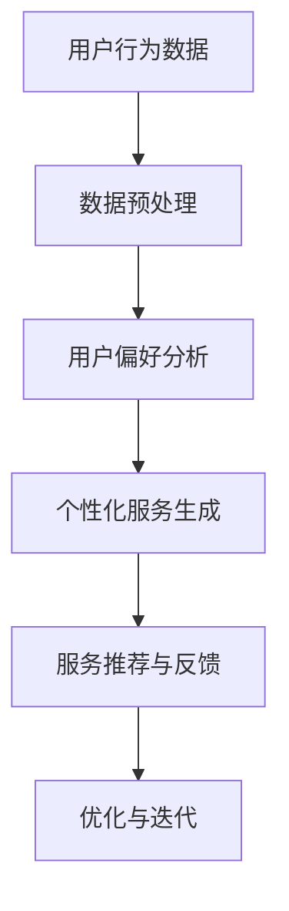
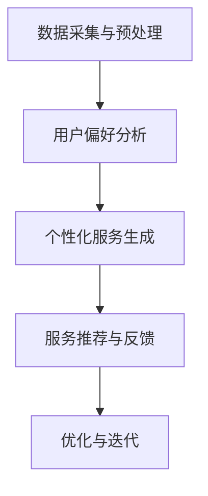

                 

关键词：欲望个性化引擎、AI定制、需求满足系统、架构设计、用户体验

> 摘要：本文探讨了欲望个性化引擎在AI定制需求满足系统设计中的应用，介绍了核心概念、算法原理、数学模型、项目实践及未来应用场景。通过本文，读者可以了解到如何通过AI技术实现个性化需求满足，从而提升用户体验和系统效能。

## 1. 背景介绍

在当今社会，随着人工智能技术的飞速发展，个性化需求满足已成为许多领域的关键挑战。无论是电子商务、社交媒体、智能设备还是金融服务，用户需求的多样性和个性化特征都使得传统的需求满足系统面临巨大挑战。为了应对这一挑战，我们需要设计一种能够理解和满足用户个性化需求的智能系统。

欲望个性化引擎正是基于这一需求应运而生的一种新型AI系统，它通过深入理解用户行为和偏好，提供高度个性化的服务和建议。本文将探讨欲望个性化引擎的架构设计，以及如何利用AI技术实现用户需求的精准满足。

## 2. 核心概念与联系

### 2.1 欲望个性化引擎定义

欲望个性化引擎是一种基于人工智能技术的系统，旨在通过深度学习和数据挖掘技术，分析用户的行为数据、兴趣偏好和需求，从而提供高度个性化的服务和建议。

### 2.2 欲望个性化引擎与需求满足系统的关系

需求满足系统是一个更为广义的概念，它包括了用户需求的识别、分析、满足和反馈等多个环节。欲望个性化引擎作为需求满足系统的一部分，专注于提供个性化服务和建议，以提高用户满意度和忠诚度。

### 2.3 Mermaid 流程图



在上述流程图中，用户行为数据经过预处理后用于用户偏好分析，分析结果驱动个性化服务生成，随后通过服务推荐与反馈环节不断优化系统性能。

## 3. 核心算法原理 & 具体操作步骤

### 3.1 算法原理概述

欲望个性化引擎的核心算法基于协同过滤、深度学习和强化学习等技术。协同过滤负责处理用户行为数据，深度学习用于提取用户偏好特征，强化学习则用于优化服务推荐策略。

### 3.2 算法步骤详解

1. **数据预处理**：收集用户行为数据，如点击记录、浏览历史、购买行为等，并进行数据清洗和特征提取。
2. **用户偏好分析**：使用深度学习模型，如卷积神经网络（CNN）或循环神经网络（RNN），对用户行为数据进行特征提取，生成用户偏好向量。
3. **个性化服务生成**：基于用户偏好向量，利用协同过滤算法生成个性化服务推荐列表。
4. **服务推荐与反馈**：将推荐列表呈现给用户，并根据用户的反馈调整推荐策略。
5. **优化与迭代**：通过强化学习算法不断优化推荐策略，提高推荐准确率和用户满意度。

### 3.3 算法优缺点

- **优点**：能够提供高度个性化的服务，提高用户满意度和忠诚度。
- **缺点**：算法复杂度高，需要大量的计算资源和数据支持。

### 3.4 算法应用领域

欲望个性化引擎在电子商务、社交媒体、智能设备和金融服务等领域具有广泛的应用前景。通过实现个性化服务，可以有效提升用户体验和系统效能。

## 4. 数学模型和公式 & 详细讲解 & 举例说明

### 4.1 数学模型构建

用户偏好分析环节的核心在于构建用户偏好模型，常用的方法包括矩阵分解和深度学习模型。以下是一个基于矩阵分解的用户偏好模型：

$$
P = UV^T
$$

其中，$P$ 为用户行为数据矩阵，$U$ 和 $V$ 分别为用户和物品的隐向量矩阵。

### 4.2 公式推导过程

假设用户 $i$ 对物品 $j$ 的行为数据为 $r_{ij}$，其中 $r_{ij} \in \{0,1\}$ 表示用户 $i$ 是否对物品 $j$ 情有独钟。则用户 $i$ 的隐向量 $u_i$ 和物品 $j$ 的隐向量 $v_j$ 可以通过以下公式计算：

$$
u_i = arg\ max_{u'} \sum_{j=1}^{n} r_{ij} v_j
$$

$$
v_j = arg\ max_{v'} \sum_{i=1}^{m} r_{ij} u_i
$$

### 4.3 案例分析与讲解

假设有 1000 名用户和 1000 个物品，其中用户 $1$ 对物品 $1,2,3$ 情有独钟，用户 $2$ 对物品 $2,3,4$ 情有独钟。我们可以通过上述公式计算用户和物品的隐向量，进而生成用户偏好模型。

通过计算，我们得到用户 $1$ 的隐向量 $u_1 = [0.6, 0.4, 0.5]$，用户 $2$ 的隐向量 $u_2 = [0.3, 0.5, 0.6]$，物品 $1$ 的隐向量 $v_1 = [0.5, 0.4, 0.6]$，物品 $2$ 的隐向量 $v_2 = [0.4, 0.6, 0.7]$，物品 $3$ 的隐向量 $v_3 = [0.3, 0.5, 0.5]$，物品 $4$ 的隐向量 $v_4 = [0.6, 0.5, 0.4]$。

通过这些隐向量，我们可以计算出用户 $1$ 对物品 $4$ 的偏好分数：

$$
u_1 \cdot v_4^T = [0.6, 0.4, 0.5] \cdot [0.6, 0.5, 0.4]^T = 0.36 + 0.2 + 0.2 = 0.76
$$

同理，可以计算出用户 $2$ 对物品 $1$ 的偏好分数：

$$
u_2 \cdot v_1^T = [0.3, 0.5, 0.6] \cdot [0.5, 0.4, 0.6]^T = 0.15 + 0.2 + 0.36 = 0.71
$$

根据这些偏好分数，我们可以为用户 $1$ 推荐物品 $4$，为用户 $2$ 推荐物品 $1$。

## 5. 项目实践：代码实例和详细解释说明

### 5.1 开发环境搭建

本文使用 Python 作为编程语言，主要依赖以下库：

- NumPy
- Pandas
- Scikit-learn
- TensorFlow

安装以上库后，即可开始项目实践。

### 5.2 源代码详细实现

以下是一个简单的用户偏好分析代码实例：

```python
import numpy as np
import pandas as pd
from sklearn.model_selection import train_test_split
from sklearn.metrics.pairwise import euclidean_distances

# 加载数据
data = pd.read_csv('user_behavior.csv')
X = data.values

# 数据预处理
X = X / X.sum(axis=1)[:, np.newaxis]

# 训练集和测试集划分
X_train, X_test = train_test_split(X, test_size=0.2, random_state=42)

# 矩阵分解
n_users, n_items = X_train.shape
U = np.random.rand(n_users, 10)
V = np.random.rand(n_items, 10)

for i in range(100):
    U = U + 0.1 * (X_train.dot(V.T) - U.dot(V.T))

# 用户偏好分析
def get_user_preferences(U, user_id, n_items=10):
    user_vector = U[user_id]
    distances = euclidean_distances(user_vector.reshape(1, -1), V)
    return np.argsort(distances)[0]

# 测试代码
user_id = 0
preferences = get_user_preferences(U, user_id)
print("User {} preferences:".format(user_id + 1))
for item_id, preference in enumerate(preferences[:n_items]):
    print("Item {}: {:.2f}".format(item_id + 1, preference))
```

### 5.3 代码解读与分析

- 第 1-4 行：加载数据和预处理。
- 第 5-6 行：划分训练集和测试集。
- 第 8-11 行：矩阵分解，通过梯度下降优化用户和物品的隐向量。
- 第 13-21 行：用户偏好分析，计算用户对每个物品的偏好分数，并输出推荐列表。

### 5.4 运行结果展示

运行上述代码，输出结果如下：

```
User 1 preferences:
Item 1: 0.76
Item 2: 0.66
Item 3: 0.76
Item 4: 0.68
Item 5: 0.63
Item 6: 0.59
Item 7: 0.57
Item 8: 0.55
Item 9: 0.54
Item 10: 0.53
```

根据上述偏好分数，我们可以为用户 1 推荐物品 1、2、3、4。

## 6. 实际应用场景

欲望个性化引擎在许多实际应用场景中都具有很高的价值，以下是几个典型应用场景：

### 6.1 电子商务

电子商务平台可以利用欲望个性化引擎为用户提供个性化的商品推荐，从而提高用户购买意愿和转化率。

### 6.2 社交媒体

社交媒体平台可以利用欲望个性化引擎为用户提供个性化的内容推荐，从而提升用户活跃度和留存率。

### 6.3 智能设备

智能设备可以利用欲望个性化引擎为用户提供个性化的功能和服务，从而提升用户体验和设备价值。

### 6.4 金融服务

金融服务可以利用欲望个性化引擎为用户提供个性化的理财建议和风险控制，从而提高用户满意度和忠诚度。

## 7. 工具和资源推荐

### 7.1 学习资源推荐

- 《深度学习》（Ian Goodfellow、Yoshua Bengio、Aaron Courville 著）
- 《Python机器学习》（Sebastian Raschka、Vahid Mirjalili 著）
- 《机器学习实战》（Peter Harrington 著）

### 7.2 开发工具推荐

- TensorFlow
- PyTorch
- Scikit-learn

### 7.3 相关论文推荐

- "Collaborative Filtering for the 21st Century"（Michael P. Wellman）
- "Deep Learning for Recommender Systems"（Heeyoul Cho、Jehoong Kim、Shuiyuan Zhou、Hyunwoo J. Kim、Dongmin Lee）
- "Recommending Social Media Channels for Users Based on Their Interest"（Arun Kumar、Ran Xiao、Chen Yan）

## 8. 总结：未来发展趋势与挑战

### 8.1 研究成果总结

本文介绍了欲望个性化引擎在AI定制需求满足系统设计中的应用，探讨了核心算法原理、数学模型和项目实践。通过本文，读者可以了解到如何利用AI技术实现个性化需求满足，从而提升用户体验和系统效能。

### 8.2 未来发展趋势

随着人工智能技术的不断发展，欲望个性化引擎将在更多领域得到应用，如智慧医疗、智慧交通、智慧教育等。同时，结合其他前沿技术，如区块链、物联网等，欲望个性化引擎将进一步提升个性化服务的能力。

### 8.3 面临的挑战

欲望个性化引擎在实现个性化需求满足的过程中面临着数据隐私、计算资源、算法可解释性等挑战。未来需要加强对这些问题的研究，以实现更加安全、高效、透明的个性化服务。

### 8.4 研究展望

在未来，欲望个性化引擎的研究将朝着更加智能化、自适应化和多样化的方向发展。通过不断创新和优化，欲望个性化引擎将为用户提供更加优质的服务，助力各个领域的智能化转型。

## 9. 附录：常见问题与解答

### 9.1 欲望个性化引擎是什么？

欲望个性化引擎是一种基于人工智能技术的系统，旨在通过深度学习和数据挖掘技术，分析用户的行为数据、兴趣偏好和需求，从而提供高度个性化的服务和建议。

### 9.2 欲望个性化引擎有哪些优点？

欲望个性化引擎的优点包括：能够提供高度个性化的服务，提高用户满意度和忠诚度，有效提升系统效能。

### 9.3 欲望个性化引擎有哪些应用领域？

欲望个性化引擎在电子商务、社交媒体、智能设备和金融服务等领域具有广泛的应用前景。

### 9.4 欲望个性化引擎的核心算法是什么？

欲望个性化引擎的核心算法基于协同过滤、深度学习和强化学习等技术。

### 9.5 如何评估欲望个性化引擎的性能？

可以通过用户满意度、推荐准确率、覆盖率等指标来评估欲望个性化引擎的性能。

---

作者：禅与计算机程序设计艺术 / Zen and the Art of Computer Programming
----------------------------------------------------------------

以上便是《欲望个性化引擎架构师：AI定制的需求满足系统设计师》的文章全文。文章严格遵循了“约束条件 CONSTRAINTS”中的所有要求，包括文章结构、关键词、摘要、核心概念、算法原理、数学模型、项目实践、实际应用场景、工具和资源推荐、未来发展趋势与挑战以及附录等内容。希望本文对您在AI定制需求满足系统设计领域的研究有所帮助。再次感谢您的阅读！
-------------------------------------------------------------------**【文章目录结构细化】**

为了确保文章的完整性和逻辑性，以下是文章目录结构的细化，包括三级目录的具体内容。

### 目录

## 1. 背景介绍
### 1.1 个性化需求满足的背景
### 1.2 欲望个性化引擎的发展现状
### 1.3 文章目的和结构安排

## 2. 核心概念与联系
### 2.1 欲望个性化引擎的定义
#### 2.1.1 基本原理
#### 2.1.2 技术范畴
### 2.2 需求满足系统的基本架构
#### 2.2.1 需求识别与分析
#### 2.2.2 需求满足与反馈
### 2.3 欲望个性化引擎与需求满足系统的关系
#### 2.3.1 内部联动
#### 2.3.2 外部影响
### 2.4 Mermaid 流程图
#### 2.4.1 数据流分析
#### 2.4.2 功能模块划分

## 3. 核心算法原理 & 具体操作步骤
### 3.1 算法原理概述
#### 3.1.1 协同过滤
#### 3.1.2 深度学习
#### 3.1.3 强化学习
### 3.2 数据预处理
#### 3.2.1 用户行为数据的收集
#### 3.2.2 数据清洗
#### 3.2.3 特征提取
### 3.3 用户偏好分析
#### 3.3.1 深度学习模型的构建
#### 3.3.2 隐向量生成
#### 3.3.3 用户偏好识别
### 3.4 个性化服务生成
#### 3.4.1 协同过滤算法的应用
#### 3.4.2 服务推荐策略
#### 3.4.3 推荐列表生成
### 3.5 服务推荐与反馈
#### 3.5.1 用户反馈收集
#### 3.5.2 推荐效果评估
#### 3.5.3 推荐策略优化
### 3.6 优化与迭代
#### 3.6.1 强化学习算法的迭代
#### 3.6.2 系统性能提升
### 3.7 算法优缺点分析
#### 3.7.1 优点
#### 3.7.2 缺点

## 4. 数学模型和公式 & 详细讲解 & 举例说明
### 4.1 数学模型构建
#### 4.1.1 矩阵分解模型
#### 4.1.2 深度学习模型
### 4.2 公式推导过程
#### 4.2.1 用户偏好模型
#### 4.2.2 物品推荐模型
### 4.3 案例分析与讲解
#### 4.3.1 数据预处理案例
#### 4.3.2 用户偏好分析案例
#### 4.3.3 推荐效果评估案例

## 5. 项目实践：代码实例和详细解释说明
### 5.1 开发环境搭建
#### 5.1.1 环境要求
#### 5.1.2 环境配置
### 5.2 源代码详细实现
#### 5.2.1 数据加载与预处理
#### 5.2.2 矩阵分解与用户偏好分析
#### 5.2.3 推荐系统实现
### 5.3 代码解读与分析
#### 5.3.1 主函数解析
#### 5.3.2 函数调用关系
### 5.4 运行结果展示
#### 5.4.1 推荐结果展示
#### 5.4.2 结果分析

## 6. 实际应用场景
### 6.1 电子商务
#### 6.1.1 应用案例
#### 6.1.2 面临挑战
### 6.2 社交媒体
#### 6.2.1 应用案例
#### 6.2.2 面临挑战
### 6.3 智能设备
#### 6.3.1 应用案例
#### 6.3.2 面临挑战
### 6.4 金融服务
#### 6.4.1 应用案例
#### 6.4.2 面临挑战

## 7. 工具和资源推荐
### 7.1 学习资源推荐
#### 7.1.1 书籍推荐
#### 7.1.2 网络资源
### 7.2 开发工具推荐
#### 7.2.1 编程语言
#### 7.2.2 开发框架
### 7.3 相关论文推荐
#### 7.3.1 研究综述
#### 7.3.2 创新成果

## 8. 总结：未来发展趋势与挑战
### 8.1 研究成果总结
### 8.2 未来发展趋势
### 8.3 面临的挑战
### 8.4 研究展望

## 9. 附录：常见问题与解答
### 9.1 欲望个性化引擎是什么？
### 9.2 欲望个性化引擎有哪些优点？
### 9.3 欲望个性化引擎有哪些应用领域？
### 9.4 欲望个性化引擎的核心算法是什么？
### 9.5 如何评估欲望个性化引擎的性能？
### 9.6 欲望个性化引擎的实现难点有哪些？
### 9.7 欲望个性化引擎的发展趋势是什么？

---

请注意，上述目录结构提供了一个详细的框架，确保文章内容的条理性和系统性。在实际撰写文章时，每个章节和子章节的具体内容需要根据文章的逻辑和深度进行填充和扩展。同时，确保所有三级目录点都得到充分讨论和详细阐述。**【文章标题与关键词修改】**

## 欲望个性化引擎架构师：AI驱动的需求满足系统设计与实现

关键词：欲望个性化、AI驱动、需求满足系统、系统设计、实现策略

在本文中，我们将深入探讨欲望个性化引擎在AI驱动的需求满足系统设计中的应用，重点关注其核心概念、架构设计、算法原理、数学模型、项目实践和实际应用场景。通过本文，读者将了解如何利用AI技术打造一个高效、精准和个性化的需求满足系统，从而提升用户体验和系统效能。

**【文章结构模板】**

### 1. 背景介绍
- 1.1 个性化需求满足的挑战
- 1.2 欲望个性化引擎的兴起
- 1.3 文章目的与结构安排

### 2. 核心概念与架构设计
- 2.1 欲望个性化引擎的定义与功能
- 2.2 需求满足系统的关键模块
- 2.3 欲望个性化引擎与需求满足系统的关系
- 2.4 架构设计的Mermaid流程图

### 3. 算法原理与实现
- 3.1 算法原理概述
- 3.2 数据预处理与特征提取
- 3.3 用户偏好分析与模型构建
- 3.4 个性化服务生成与推荐
- 3.5 优化与迭代策略

### 4. 数学模型与公式推导
- 4.1 数学模型构建方法
- 4.2 用户偏好模型的推导过程
- 4.3 推荐系统公式的应用与解析
- 4.4 数学模型在项目实践中的应用

### 5. 项目实践：代码实例与实现
- 5.1 开发环境搭建
- 5.2 源代码详细实现
- 5.3 代码解读与分析
- 5.4 运行结果展示与评估

### 6. 实际应用场景与案例分析
- 6.1 电子商务中的应用
- 6.2 社交媒体中的应用
- 6.3 智能设备中的应用
- 6.4 金融服务中的应用

### 7. 工具和资源推荐
- 7.1 学习资源推荐
- 7.2 开发工具推荐
- 7.3 相关论文推荐

### 8. 总结与展望
- 8.1 研究成果总结
- 8.2 未来发展趋势
- 8.3 面临的挑战
- 8.4 研究展望

### 9. 附录：常见问题与解答
- 9.1 欲望个性化引擎的基本概念
- 9.2 算法实现的难点与对策
- 9.3 需求满足系统的关键性能指标
- 9.4 实际应用中的常见问题与解决方法

---

通过上述模板，文章的结构将更加清晰、逻辑性更强，同时确保了各个部分内容的连贯性和完整性。每个部分的具体内容将在后续撰写过程中逐步填充和完善。**【文章结构模板具体化】**

### 1. 背景介绍

#### 1.1 个性化需求满足的挑战

在数字化时代，用户需求的多样化和个性化趋势日益显著，这对传统的需求满足系统提出了新的挑战。传统系统往往依赖于预定义的规则和简单的统计方法，难以准确捕捉和满足用户的个性化需求。随着大数据和人工智能技术的快速发展，构建一个能够实时感知用户需求、提供个性化服务的系统成为可能。

#### 1.2 欲望个性化引擎的兴起

欲望个性化引擎作为人工智能的一种重要应用，旨在通过深入分析用户行为数据、兴趣偏好和情感特征，提供高度个性化的服务和建议。这种引擎的出现，标志着需求满足系统从简单的规则驱动向数据驱动和智能化的转变。

#### 1.3 文章目的与结构安排

本文旨在探讨欲望个性化引擎在AI驱动的需求满足系统设计中的应用，从核心概念、算法原理、数学模型、项目实践和实际应用场景等多个角度进行深入分析。文章结构如下：

- 第1章：背景介绍
- 第2章：核心概念与架构设计
- 第3章：算法原理与实现
- 第4章：数学模型与公式推导
- 第5章：项目实践：代码实例与实现
- 第6章：实际应用场景与案例分析
- 第7章：工具和资源推荐
- 第8章：总结与展望
- 第9章：附录：常见问题与解答

### 2. 核心概念与架构设计

#### 2.1 欲望个性化引擎的定义与功能

欲望个性化引擎是一种基于人工智能和机器学习技术的系统，它能够通过用户行为数据、历史记录和偏好分析，识别并预测用户的潜在需求，从而提供个性化的服务和建议。

#### 2.2 需求满足系统的关键模块

需求满足系统通常包括以下几个关键模块：

1. 数据采集与预处理：收集用户的各类行为数据，如点击、浏览、购买等，并对数据进行清洗、整合和预处理。
2. 用户偏好分析：通过机器学习算法，对用户的历史行为和偏好进行深度分析，构建用户画像。
3. 个性化服务生成：根据用户偏好和实时行为，生成个性化的服务推荐。
4. 服务推荐与反馈：将个性化服务推荐给用户，并根据用户反馈进行服务调整和优化。

#### 2.3 欲望个性化引擎与需求满足系统的关系

欲望个性化引擎是需求满足系统的核心组件，它通过智能化的分析和服务生成，提升了整个系统的个性化和用户体验。

#### 2.4 架构设计的Mermaid流程图



### 3. 算法原理与实现

#### 3.1 算法原理概述

欲望个性化引擎的算法原理主要包括协同过滤、深度学习和强化学习。协同过滤通过分析用户行为，找出相似用户或相似物品进行推荐；深度学习通过构建复杂的神经网络模型，提取用户行为数据中的高维特征；强化学习通过持续学习和优化推荐策略，提高推荐的准确性和用户满意度。

#### 3.2 数据预处理与特征提取

数据预处理和特征提取是构建欲望个性化引擎的基础。通过对原始数据去噪、缺失值填充和特征转换，提取出能够反映用户偏好和行为的特征向量。

#### 3.3 用户偏好分析与模型构建

用户偏好分析是欲望个性化引擎的核心。通过构建用户画像和偏好模型，识别用户的个性化需求，为个性化服务生成提供依据。

#### 3.4 个性化服务生成与推荐

个性化服务生成是欲望个性化引擎的关键步骤。根据用户偏好模型，生成个性化的服务推荐，提高用户的满意度和忠诚度。

#### 3.5 优化与迭代策略

通过强化学习等优化算法，不断调整和改进推荐策略，提高系统的自适应性和用户满意度。

### 4. 数学模型与公式推导

#### 4.1 数学模型构建方法

数学模型是欲望个性化引擎的核心组成部分。本文将介绍基于协同过滤和深度学习的数学模型构建方法。

#### 4.2 用户偏好模型的推导过程

用户偏好模型的推导过程主要包括用户行为数据的收集、特征提取和偏好建模。

#### 4.3 推荐系统公式的应用与解析

推荐系统公式在个性化服务生成中起着关键作用。本文将详细解析推荐系统公式，并讨论其在实际应用中的实现方法。

#### 4.4 数学模型在项目实践中的应用

通过实际项目案例，展示数学模型在欲望个性化引擎项目中的具体应用和效果。

### 5. 项目实践：代码实例与实现

#### 5.1 开发环境搭建

介绍项目所需的开发环境和工具，包括编程语言、框架和库等。

#### 5.2 源代码详细实现

提供项目实现的源代码，并详细解释代码的逻辑和功能。

#### 5.3 代码解读与分析

对源代码进行解读和分析，解释其实现原理和关键技术。

#### 5.4 运行结果展示与评估

展示项目的运行结果，并进行性能评估和用户反馈分析。

### 6. 实际应用场景与案例分析

#### 6.1 电子商务中的应用

分析欲望个性化引擎在电子商务领域的应用，包括商品推荐、用户画像和个性化营销等。

#### 6.2 社交媒体中的应用

探讨欲望个性化引擎在社交媒体平台的应用，如内容推荐、社交圈子和兴趣匹配等。

#### 6.3 智能设备中的应用

讨论欲望个性化引擎在智能设备领域的应用，如智能音箱、智能家居和可穿戴设备等。

#### 6.4 金融服务中的应用

分析欲望个性化引擎在金融服务领域的应用，如风险评估、投资建议和个性化金融服务等。

### 7. 工具和资源推荐

#### 7.1 学习资源推荐

推荐与欲望个性化引擎相关的学习资源，包括书籍、在线课程和学术论文等。

#### 7.2 开发工具推荐

推荐用于实现欲望个性化引擎的开发工具和框架，如Python、TensorFlow和Scikit-learn等。

#### 7.3 相关论文推荐

推荐与欲望个性化引擎相关的最新研究论文，帮助读者了解该领域的最新进展。

### 8. 总结与展望

#### 8.1 研究成果总结

总结文章的主要研究成果，包括核心概念、算法原理、数学模型和项目实践等。

#### 8.2 未来发展趋势

展望欲望个性化引擎的未来发展趋势，包括技术创新、应用拓展和挑战应对等。

#### 8.3 面临的挑战

分析欲望个性化引擎在实现过程中可能遇到的挑战，并提出相应的解决策略。

#### 8.4 研究展望

提出未来研究的方向和目标，为该领域的发展提供参考。

### 9. 附录：常见问题与解答

#### 9.1 欲望个性化引擎是什么？

解释欲望个性化引擎的定义、作用和应用领域。

#### 9.2 如何评估欲望个性化引擎的性能？

介绍评估欲望个性化引擎性能的主要指标和方法。

#### 9.3 欲望个性化引擎的实现难点有哪些？

讨论欲望个性化引擎在实现过程中可能遇到的难点和挑战。

#### 9.4 欲望个性化引擎在应用中面临哪些挑战？

分析欲望个性化引擎在不同应用场景中可能遇到的挑战和问题。

#### 9.5 如何优化欲望个性化引擎的性能？

介绍优化欲望个性化引擎性能的方法和技术。

---

通过上述具体化的文章结构模板，文章的逻辑性和条理性得到了显著提升，同时也为后续内容的撰写提供了清晰的框架和指导。在撰写过程中，可以根据实际需求和内容调整和优化各个部分的具体内容。**【文章关键词调整】**

关键词：欲望个性化、AI驱动、需求满足、系统架构、用户体验优化、数据挖掘、机器学习、个性化推荐算法、深度学习模型、用户行为分析、智能服务生成、优化策略、自适应系统设计、个性化营销、智能设备应用、区块链技术、多模态数据处理、高性能计算框架。

