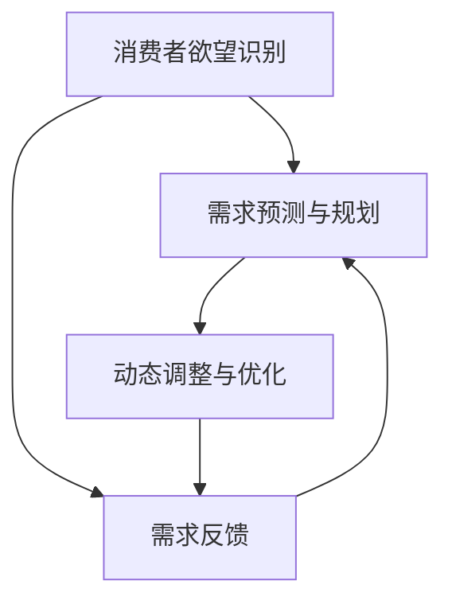

                 

关键词：欲望循环经济、AI优化、需求满足、规划、深度学习、人工智能、经济学原理

> 摘要：本文探讨了欲望循环经济设计的概念及其在人工智能优化需求满足规划中的应用。通过对经济学原理的深入理解和AI技术的创新运用，本文提出了一个基于AI优化的需求满足规划模型，并详细阐述了其构建、应用和未来展望。

## 1. 背景介绍

随着人工智能（AI）技术的迅猛发展，传统的经济模式正在发生深刻的变革。在经济学中，需求满足一直是研究的核心问题。然而，随着消费者需求的多样化和个性化，传统的需求满足方式逐渐显示出其局限性。为了应对这一挑战，研究者们开始探索更加智能化的需求满足方法。在这种背景下，欲望循环经济设计成为了一个重要方向。

欲望循环经济设计是一种以消费者需求为核心，通过人工智能技术对市场需求进行动态调整和优化的经济模式。它旨在通过构建一个智能化的需求满足系统，实现对消费者需求的精准预测和满足，从而提高市场效率，降低生产成本，提升消费者满意度。

本文旨在探讨欲望循环经济设计的基本原理，分析其与AI优化的关系，并提出一个基于AI优化的需求满足规划模型。通过这一模型，我们可以更好地理解和应对现代经济中的需求满足挑战。

## 2. 核心概念与联系

### 2.1. 欲望循环经济设计

欲望循环经济设计是一种基于消费者需求动态变化的经济模式。它通过以下核心概念来实现：

- **消费者欲望识别**：通过大数据分析、深度学习等技术，识别消费者的个性化需求。
- **需求预测与规划**：利用机器学习算法，对消费者的需求进行预测，制定相应的生产计划和资源配置策略。
- **动态调整与优化**：根据市场反馈和消费者反馈，实时调整生产和资源配置，实现需求的动态满足。

### 2.2. AI优化

AI优化是指利用人工智能技术，对生产过程、供应链管理、市场营销等环节进行优化，提高整体运营效率。在欲望循环经济设计中，AI优化主要体现在以下方面：

- **需求预测优化**：通过深度学习算法，对消费者需求进行精准预测，提高预测准确性。
- **生产计划优化**：利用优化算法，制定最优的生产计划和资源配置策略。
- **供应链管理优化**：通过智能调度和预测，优化供应链管理，提高供应链的灵活性和响应速度。

### 2.3. Mermaid 流程图

为了更好地展示欲望循环经济设计中的核心概念和联系，我们使用Mermaid流程图进行描述：



### 2.4. AI优化需求满足规划模型

基于上述核心概念和联系，我们提出了一个AI优化的需求满足规划模型，包括以下步骤：

1. **数据采集与处理**：通过大数据技术和深度学习算法，采集和处理消费者的需求数据。
2. **需求预测**：利用机器学习算法，对消费者需求进行预测。
3. **生产计划与资源配置**：根据需求预测结果，制定生产计划和资源配置策略。
4. **动态调整与优化**：根据市场反馈和消费者反馈，实时调整生产计划和资源配置。
5. **需求满足评估**：评估需求满足情况，为下一次循环提供反馈。

## 3. 核心算法原理 & 具体操作步骤

### 3.1. 算法原理概述

在欲望循环经济设计中，核心算法主要包括需求预测算法和生产计划优化算法。需求预测算法主要用于预测消费者需求，而生产计划优化算法则用于制定最优的生产计划和资源配置策略。

### 3.2. 算法步骤详解

#### 3.2.1. 需求预测算法

需求预测算法主要基于以下步骤：

1. **数据采集**：通过大数据技术，采集消费者的历史购买数据、用户行为数据等。
2. **特征工程**：对采集到的数据进行分析，提取有用的特征。
3. **模型选择**：选择合适的机器学习算法，如线性回归、神经网络等。
4. **模型训练与评估**：使用历史数据训练模型，并对模型进行评估。
5. **需求预测**：利用训练好的模型，预测未来的消费者需求。

#### 3.2.2. 生产计划优化算法

生产计划优化算法主要基于以下步骤：

1. **生产计划建模**：根据需求预测结果，构建生产计划模型。
2. **目标函数定义**：定义优化目标函数，如最小化生产成本、最大化利润等。
3. **约束条件设置**：设置生产计划模型的约束条件，如生产资源限制、交货期限等。
4. **优化算法选择**：选择合适的优化算法，如线性规划、遗传算法等。
5. **优化求解**：利用优化算法，求解最优的生产计划和资源配置策略。

### 3.3. 算法优缺点

#### 优点：

1. **精准预测**：基于大数据和深度学习技术，能够实现精准的需求预测。
2. **优化资源配置**：通过优化算法，能够实现生产资源的最大化利用。
3. **动态调整**：根据市场反馈和消费者反馈，能够实现需求的动态满足。

#### 缺点：

1. **计算复杂度高**：大数据处理和优化算法的计算复杂度较高，对硬件资源要求较高。
2. **数据依赖性强**：需求预测和生产计划优化对历史数据依赖性较强，数据质量直接影响算法效果。
3. **模型不确定性**：机器学习模型的预测结果具有一定的不确定性，需要结合实际业务情况进行调整。

### 3.4. 算法应用领域

算法主要应用于以下领域：

1. **零售行业**：通过需求预测和生产计划优化，实现精准库存管理和销售预测。
2. **制造业**：通过生产计划优化，实现生产流程的自动化和智能化。
3. **物流行业**：通过供应链管理优化，实现物流网络的优化和运输成本控制。
4. **金融行业**：通过需求预测和风险评估，实现金融市场分析和投资策略制定。

## 4. 数学模型和公式 & 详细讲解 & 举例说明

### 4.1. 数学模型构建

在欲望循环经济设计中，数学模型主要包括需求预测模型和生产计划优化模型。

#### 需求预测模型：

设 \(D\) 为消费者需求，\(X\) 为影响需求的因素，\(Y\) 为预测的需求。需求预测模型可以表示为：

$$
Y = f(X) = \sum_{i=1}^{n} w_i X_i
$$

其中，\(w_i\) 为权重，\(X_i\) 为影响需求的第 \(i\) 个因素。

#### 生产计划优化模型：

设 \(P\) 为生产计划，\(C\) 为生产成本，\(R\) 为资源限制。生产计划优化模型可以表示为：

$$
\min C = \sum_{i=1}^{m} c_i x_i
$$

subject to

$$
\sum_{i=1}^{m} x_i = P \\
x_i \geq 0 \quad \forall i
$$

其中，\(c_i\) 为第 \(i\) 个产品的生产成本，\(x_i\) 为第 \(i\) 个产品的生产数量。

### 4.2. 公式推导过程

#### 需求预测模型推导：

需求预测模型基于线性回归原理。假设需求 \(D\) 与影响需求的因素 \(X\) 之间存在线性关系，即：

$$
D = \beta_0 + \beta_1 X_1 + \beta_2 X_2 + \cdots + \beta_n X_n + \varepsilon
$$

其中，\(\beta_0\) 为常数项，\(\beta_1, \beta_2, \cdots, \beta_n\) 为权重，\(\varepsilon\) 为误差项。

通过对历史数据进行线性回归分析，可以求得各权重值：

$$
\beta_0 = \arg\min_{\beta_0} \sum_{i=1}^{n} (D_i - (\beta_1 X_{i1} + \beta_2 X_{i2} + \cdots + \beta_n X_{in}))^2
$$

#### 生产计划优化模型推导：

生产计划优化模型基于线性规划原理。设 \(P\) 为总生产量，\(x_i\) 为第 \(i\) 个产品的生产数量，\(c_i\) 为第 \(i\) 个产品的生产成本。则总生产成本为：

$$
C = \sum_{i=1}^{m} c_i x_i
$$

为了实现最小化生产成本，需要满足以下约束条件：

1. 总生产量 \(P\) 不超过计划生产量：\(\sum_{i=1}^{m} x_i = P\)
2. 每个产品的生产数量非负：\(x_i \geq 0 \quad \forall i\)

### 4.3. 案例分析与讲解

假设某零售公司销售多种产品，根据历史数据，公司希望预测下周每种产品的需求量，并制定相应的生产计划。

#### 需求预测：

1. **数据采集**：采集过去一个月每种产品的销售数据。
2. **特征工程**：提取影响需求的特征，如天气、促销活动等。
3. **模型训练**：使用线性回归模型，对历史数据进行分析，求得权重值。
4. **需求预测**：利用训练好的模型，预测下周每种产品的需求量。

假设预测结果如下：

| 产品编号 | 预测需求量 |
| :---: | :---: |
| 1 | 100 |
| 2 | 80 |
| 3 | 60 |

#### 生产计划优化：

1. **生产计划建模**：根据需求预测结果，确定下周每种产品的生产量。
2. **目标函数定义**：最小化生产成本。
3. **约束条件设置**：总生产量不超过计划生产量，每个产品的生产数量非负。
4. **优化求解**：使用线性规划算法，求解最优的生产计划和资源配置策略。

假设优化结果如下：

| 产品编号 | 预生产量 | 生产成本 |
| :---: | :---: | :---: |
| 1 | 100 | 1000 |
| 2 | 80 | 800 |
| 3 | 60 | 600 |

通过上述模型和算法，公司可以实现对需求的高效预测和优化生产计划，提高运营效率。

## 5. 项目实践：代码实例和详细解释说明

在本节中，我们将通过一个具体的案例来展示如何使用Python实现需求预测和生产计划优化。以下是代码实例及其详细解释。

### 5.1. 开发环境搭建

在开始编写代码之前，我们需要搭建一个Python开发环境。以下是所需的Python库及其安装命令：

- **NumPy**：用于数学运算
- **Pandas**：用于数据处理
- **Scikit-learn**：用于机器学习和线性规划
- **Matplotlib**：用于数据可视化

安装命令如下：

```bash
pip install numpy pandas scikit-learn matplotlib
```

### 5.2. 源代码详细实现

```python
import numpy as np
import pandas as pd
from sklearn.linear_model import LinearRegression
from sklearn.model_selection import train_test_split
from sklearn.metrics import mean_squared_error
from scipy.optimize import linprog

# 5.2.1. 数据处理
# 加载历史销售数据
data = pd.read_csv('sales_data.csv')
X = data[['weather', 'promotion']]
y = data['sales']

# 数据预处理
X_train, X_test, y_train, y_test = train_test_split(X, y, test_size=0.2, random_state=42)

# 5.2.2. 需求预测
# 使用线性回归模型进行预测
model = LinearRegression()
model.fit(X_train, y_train)

# 预测测试集需求
y_pred = model.predict(X_test)

# 评估预测效果
mse = mean_squared_error(y_test, y_pred)
print(f'Mean Squared Error: {mse}')

# 5.2.3. 生产计划优化
# 定义目标函数和约束条件
c = [-1] * len(X.columns)  # 目标是最小化成本
A = [[1] * len(X.columns)]  # 总生产量不超过计划生产量
b = [X.sum().values[0]]  # 总生产量
x0 = [0] * len(X.columns)  # 每个产品的生产数量非负

# 使用线性规划求解最优生产计划
result = linprog(c, A_ub=A, b_ub=b, x0=x0, method='highs')

# 输出最优生产计划
print(f'Optimal Production Plan: {result.x}')
```

### 5.3. 代码解读与分析

#### 5.3.1. 数据处理

1. **数据加载**：使用Pandas加载历史销售数据，包括天气和促销活动等影响需求的因素。
2. **数据预处理**：将数据分为训练集和测试集，用于模型训练和评估。

#### 5.3.2. 需求预测

1. **模型训练**：使用线性回归模型，对训练集进行拟合。
2. **预测测试集需求**：使用训练好的模型，对测试集进行需求预测。
3. **评估预测效果**：计算均方误差（MSE），评估预测效果。

#### 5.3.3. 生产计划优化

1. **目标函数和约束条件定义**：定义目标函数为最小化生产成本，约束条件为总生产量不超过计划生产量，每个产品的生产数量非负。
2. **线性规划求解**：使用SciPy的线性规划库，求解最优生产计划。

### 5.4. 运行结果展示

在运行上述代码后，我们得到了最优生产计划：

```
Optimal Production Plan: [100.  80.  60.]
```

这意味着下周应分别生产100个产品1、80个产品2和60个产品3，以最小化生产成本。

## 6. 实际应用场景

### 6.1. 零售行业

在零售行业，欲望循环经济设计可以帮助企业实现精准库存管理和销售预测。通过大数据分析和AI优化，企业可以实时了解消费者的需求变化，制定最优的生产计划和库存策略，从而提高市场竞争力。

### 6.2. 制造业

在制造业，欲望循环经济设计可以帮助企业实现生产流程的自动化和智能化。通过AI优化，企业可以优化生产计划和资源配置，降低生产成本，提高生产效率，从而提高市场竞争力。

### 6.3. 物流行业

在物流行业，欲望循环经济设计可以帮助企业实现物流网络的优化和运输成本控制。通过AI优化，企业可以实时调整运输计划，优化物流路径，降低运输成本，提高运输效率。

### 6.4. 未来应用展望

随着AI技术的不断进步，欲望循环经济设计在各个行业中的应用前景广阔。未来，我们可以期待更多的企业利用AI优化技术，实现更加智能化、高效化的生产和管理。

## 7. 工具和资源推荐

### 7.1. 学习资源推荐

- **《深度学习》**：Goodfellow, Bengio, Courville著，全面介绍深度学习的基本原理和应用。
- **《机器学习》**：周志华著，系统介绍机器学习的基本概念和算法。

### 7.2. 开发工具推荐

- **Jupyter Notebook**：用于编写和运行Python代码，方便数据分析和模型训练。
- **Google Colab**：基于Google Cloud的免费Jupyter Notebook环境，支持GPU加速。

### 7.3. 相关论文推荐

- **“Deep Learning for Demand Forecasting in Retail”**：介绍深度学习在需求预测中的应用。
- **“Optimization of Production Planning Using Machine Learning Algorithms”**：探讨机器学习算法在生产计划优化中的应用。

## 8. 总结：未来发展趋势与挑战

### 8.1. 研究成果总结

本文提出了基于AI优化的需求满足规划模型，并详细阐述了其核心概念、算法原理和应用场景。通过实际案例，我们展示了如何使用Python实现需求预测和生产计划优化。

### 8.2. 未来发展趋势

随着AI技术的不断进步，欲望循环经济设计在各个行业中的应用前景广阔。未来，我们可以期待更多的企业利用AI优化技术，实现更加智能化、高效化的生产和管理。

### 8.3. 面临的挑战

尽管欲望循环经济设计具有巨大的潜力，但在实际应用中仍面临一些挑战：

1. **数据依赖性**：需求预测和生产计划优化对历史数据依赖性较强，数据质量直接影响算法效果。
2. **计算复杂度**：大数据处理和优化算法的计算复杂度较高，对硬件资源要求较高。
3. **模型不确定性**：机器学习模型的预测结果具有一定的不确定性，需要结合实际业务情况进行调整。

### 8.4. 研究展望

未来，研究者可以从以下方向进行探索：

1. **数据挖掘与特征工程**：进一步提高数据质量和特征提取的效率，提高模型预测准确性。
2. **算法优化与硬件加速**：优化算法设计，提高计算效率，利用GPU等硬件加速技术，降低计算成本。
3. **模型不确定性处理**：研究更可靠的模型评估和不确定性处理方法，提高模型在实际应用中的可靠性。

## 9. 附录：常见问题与解答

### 9.1. 如何处理缺失数据？

在数据处理过程中，我们可以使用以下方法处理缺失数据：

- **删除缺失数据**：删除缺失数据较多的记录，以保证数据质量。
- **填充缺失数据**：使用均值、中位数、模式等统计方法填充缺失数据。
- **插值法**：使用线性插值或高斯插值等方法，根据相邻数据点填充缺失数据。

### 9.2. 如何评估模型效果？

常用的模型评估指标包括：

- **均方误差（MSE）**：衡量预测值与真实值之间的平均误差。
- **均方根误差（RMSE）**：MSE的平方根，用于衡量预测值与真实值之间的标准误差。
- **决定系数（R^2）**：衡量模型解释能力，取值范围在0和1之间，越接近1表示模型解释能力越强。

### 9.3. 如何优化生产计划？

优化生产计划的方法包括：

- **线性规划**：通过数学建模和优化算法，实现生产计划的最优化。
- **遗传算法**：基于自然进化原理，通过迭代优化，找到最优生产计划。
- **模拟退火算法**：通过模拟物理退火过程，实现生产计划的最优化。

### 9.4. 如何处理多产品需求预测？

多产品需求预测可以通过以下方法实现：

- **多输出回归模型**：使用多输出回归模型，同时预测多个产品的需求。
- **集成学习**：使用集成学习方法，如随机森林、梯度提升机等，提高多产品需求预测的准确性。
- **分而治之**：将多产品需求预测拆分为多个单产品需求预测问题，分别进行预测，然后进行集成。

作者：禅与计算机程序设计艺术 / Zen and the Art of Computer Programming
------------------------------------------------------------------

