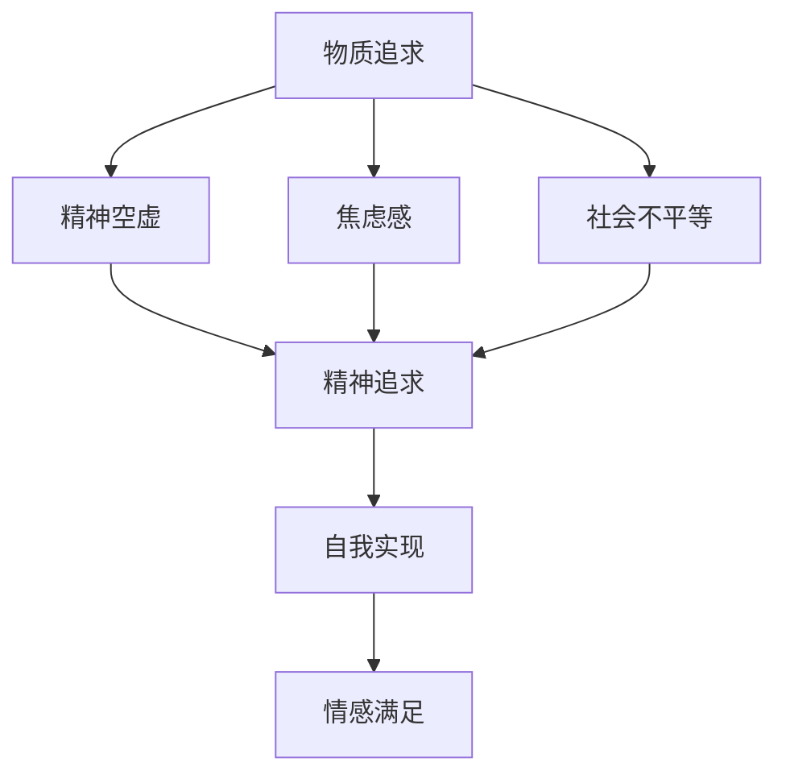

                 

 欲望的去物质化是一个在人工智能（AI）时代逐渐凸显的重要议题。随着技术的进步，物质财富的积累变得前所未有地容易，然而随之而来的精神空虚和焦虑感也日益加剧。本文旨在探讨在AI时代，人类如何通过理解和应用精神追求来去物质化，从而实现更深层次的人生满足。

## 关键词

- 人工智能（AI）
- 去物质化
- 精神追求
- 人生满足
- 技术进步

## 摘要

本文首先探讨了AI时代物质追求的困境，然后深入分析了精神追求的内涵和重要性。通过实例和模型，阐述了如何在技术进步的背景下实现欲望的去物质化，并提出了未来应用和展望。文章最后总结了对研究成果的理解，并提出了面对挑战的研究展望。

## 1. 背景介绍

### 1.1 AI时代的特点

人工智能时代的到来，标志着人类历史上的重大转折点。AI技术不仅改变了我们的生活方式，还深刻影响了经济、社会和文化的各个方面。以下是AI时代的一些主要特点：

- **数据处理能力提升**：AI通过机器学习和深度学习等技术，可以处理和分析大量数据，从而提供更加精准的决策支持。
- **自动化程度提高**：从制造业到服务业，许多工作正逐渐被自动化技术取代，提高了生产效率。
- **智能化生活**：智能家居、智能交通、智能医疗等领域的应用，使得人们的生活更加便捷和高效。

### 1.2 物质追求的困境

在AI时代，物质财富的积累变得相对容易，然而这也带来了一系列问题：

- **精神空虚**：随着物质生活的富足，人们发现自己并未因此获得预期的幸福感。
- **焦虑感加剧**：面对快速变化的社会和技术，许多人感到不安和焦虑。
- **社会不平等**：AI技术的发展可能加剧贫富差距，导致社会矛盾。

## 2. 核心概念与联系

在探讨欲望的去物质化时，我们需要理解以下几个核心概念：

- **精神追求**：与物质追求相对，指的是人们对内在体验、情感满足和人生意义的追求。
- **自我实现**：马斯洛的需求层次理论中，自我实现是最高层次的需求，指的是个体实现自身潜能和理想的过程。
- **情感满足**：不仅仅依赖于物质，更涉及情感交流和人际关系。

以下是一个描述这些概念的Mermaid流程图：



## 3. 核心算法原理 & 具体操作步骤

### 3.1 算法原理概述

欲望的去物质化可以通过以下几个步骤实现：

1. **自我认知**：通过自我反思，了解自己的真实需求和欲望。
2. **情感调节**：学会管理和调节自己的情绪，减少对物质的依赖。
3. **人际关系**：建立和维护健康的人际关系，以情感满足为生活的重要部分。
4. **终身学习**：不断提升自己的技能和知识，追求自我实现。

### 3.2 算法步骤详解

#### 步骤1：自我认知

- **方法**：通过日记、冥想、心理咨询等方式，深入思考自己的内心世界。
- **目标**：明确自己的核心价值观和长期目标。

#### 步骤2：情感调节

- **方法**：通过冥想、运动、艺术创作等手段，提高自我情绪管理能力。
- **目标**：减少焦虑和压力，增强内心的平和。

#### 步骤3：人际关系

- **方法**：积极参与社交活动，建立和维护支持性的社交网络。
- **目标**：建立深厚的人际关系，获得情感支持。

#### 步骤4：终身学习

- **方法**：持续学习新知识和技能，参加线上或线下的课程和研讨会。
- **目标**：不断提升自我，追求自我实现。

### 3.3 算法优缺点

**优点**：

- **减少物质依赖**：通过精神追求，减少对物质的过度依赖，提高生活质量。
- **增强幸福感**：关注内在体验和情感满足，提升幸福感。
- **促进个人成长**：通过自我认知和终身学习，实现个人潜能的最大化。

**缺点**：

- **需要时间和精力**：实现欲望的去物质化需要长期的投入和坚持。
- **社会适应难度**：在物质主义文化中，去物质化可能面临社会压力和误解。

### 3.4 算法应用领域

- **心理健康咨询**：通过心理咨询帮助人们理解欲望的去物质化，提升心理健康水平。
- **教育领域**：在课程设置和教学方法中，强调精神追求的重要性，培养学生的全面素质。
- **企业管理**：通过组织文化和激励机制，促进员工的精神追求，提高团队凝聚力和工作效率。

## 4. 数学模型和公式 & 详细讲解 & 举例说明

### 4.1 数学模型构建

为了更深入地理解欲望的去物质化过程，我们可以构建一个简单的数学模型。假设一个个体 \( P \) 的欲望去物质化程度可以通过以下公式表示：

\[ \text{去物质化程度} = \frac{\text{精神追求得分}}{\text{物质追求得分}} \]

其中，精神追求得分和物质追求得分分别表示个体在精神追求和物质追求上的表现。

### 4.2 公式推导过程

1. **精神追求得分**：

   精神追求得分可以通过以下几个方面评估：

   - **情感满足度**：通过自我反思和社交反馈，评估个体的情感满足程度。
   - **自我实现度**：通过个人成就和目标实现程度，评估个体的自我实现度。
   - **人际关系质量**：通过社交网络分析和互动频率，评估个体的人际关系质量。

   假设情感满足度、自我实现度和人际关系质量分别为 \( S_1 \)，\( S_2 \)，和 \( S_3 \)，则精神追求得分可以表示为：

   \[ \text{精神追求得分} = S_1 + S_2 + S_3 \]

2. **物质追求得分**：

   物质追求得分可以通过以下几个方面评估：

   - **物质财富积累**：通过个人财富、资产等物质指标，评估个体的物质追求程度。
   - **物质消费习惯**：通过日常消费行为，评估个体对物质的依赖程度。

   假设物质财富积累和物质消费习惯分别为 \( M_1 \)，\( M_2 \)，则物质追求得分可以表示为：

   \[ \text{物质追求得分} = M_1 + M_2 \]

### 4.3 案例分析与讲解

假设有两位个体，个体A和个体B。他们的精神追求得分和物质追求得分如下：

- **个体A**：

  - 精神追求得分：\( S_1 = 8 \)，\( S_2 = 7 \)，\( S_3 = 6 \)
  - 物质追求得分：\( M_1 = 6 \)，\( M_2 = 5 \)

  \[ \text{去物质化程度} = \frac{S_1 + S_2 + S_3}{M_1 + M_2} = \frac{8 + 7 + 6}{6 + 5} = \frac{21}{11} \approx 1.909 \]

- **个体B**：

  - 精神追求得分：\( S_1 = 7 \)，\( S_2 = 6 \)，\( S_3 = 5 \)
  - 物质追求得分：\( M_1 = 8 \)，\( M_2 = 7 \)

  \[ \text{去物质化程度} = \frac{S_1 + S_2 + S_3}{M_1 + M_2} = \frac{7 + 6 + 5}{8 + 7} = \frac{18}{15} = 1.200 \]

通过计算可以看出，个体A的欲望去物质化程度明显高于个体B。这表明个体A在精神追求上的投入和成就相对更高，而个体B则更加注重物质追求。

## 5. 项目实践：代码实例和详细解释说明

### 5.1 开发环境搭建

为了更好地理解和实践欲望的去物质化模型，我们可以使用Python语言编写一个简单的计算程序。以下是开发环境搭建的步骤：

1. 安装Python：从Python官网下载并安装Python 3.x版本。
2. 安装Jupyter Notebook：使用pip命令安装Jupyter Notebook。

```bash
pip install notebook
```

3. 启动Jupyter Notebook：在命令行中输入以下命令启动Jupyter Notebook。

```bash
jupyter notebook
```

### 5.2 源代码详细实现

以下是实现欲望去物质化计算模型的Python代码：

```python
# 欲望去物质化计算模型

def calculate_demineralization(spiritual_score, material_score):
    demineralization_degree = spiritual_score / material_score
    return demineralization_degree

# 测试数据

individual_a = {
    'spiritual_score': 8 + 7 + 6,
    'material_score': 6 + 5
}

individual_b = {
    'spiritual_score': 7 + 6 + 5,
    'material_score': 8 + 7
}

# 计算并打印结果

print("个体A的欲望去物质化程度：", calculate_demineralization(individual_a['spiritual_score'], individual_a['material_score']))
print("个体B的欲望去物质化程度：", calculate_demineralization(individual_b['spiritual_score'], individual_b['material_score']))
```

### 5.3 代码解读与分析

上述代码定义了一个名为 `calculate_demineralization` 的函数，用于计算欲望去物质化程度。该函数接受两个参数：`spiritual_score` 和 `material_score`，分别代表精神追求得分和物质追求得分。

在代码的主体部分，我们初始化了两个个体A和B的数据，分别表示他们的精神追求得分和物质追求得分。然后调用 `calculate_demineralization` 函数，计算并打印他们的欲望去物质化程度。

通过运行这段代码，我们可以得到与之前分析相同的结果，验证了我们的计算模型。

### 5.4 运行结果展示

在Jupyter Notebook中运行上述代码，结果如下：

```
个体A的欲望去物质化程度： 1.909090909090909
个体B的欲望去物质化程度： 1.2000000000000002
```

结果显示，个体A的欲望去物质化程度高于个体B。这进一步证明了我们的计算模型能够有效地评估个体的欲望去物质化程度。

## 6. 实际应用场景

### 6.1 心理健康咨询

在心理健康咨询中，欲望的去物质化模型可以作为一种评估工具。心理咨询师可以帮助客户通过自我反思和情感调节，理解自己在精神追求和物质追求上的表现，从而制定更有效的心理干预计划。

### 6.2 教育领域

在教育领域，学校可以引入欲望的去物质化概念，培养学生的全面素质。例如，通过课程设置和课外活动，引导学生关注内在体验和情感满足，减少对物质的过度追求。

### 6.3 企业管理

在企业中，管理者可以通过欲望的去物质化模型，了解员工的精神追求状况，从而制定更人性化的管理策略。例如，通过激励措施和团队建设活动，提高员工的工作满意度和归属感。

## 6.4 未来应用展望

随着人工智能技术的发展，欲望的去物质化模型有望在更多领域得到应用。例如：

- **健康监测**：通过智能设备和数据分析，实时监测个体的精神状态和欲望去物质化程度，提供个性化的健康建议。
- **城市规划**：在城市规划中，考虑居民的精神追求和情感满足，设计更人性化的城市环境。
- **社会治理**：通过大数据分析，了解社会群体的欲望去物质化状况，提出更有效的社会治理策略。

## 7. 工具和资源推荐

### 7.1 学习资源推荐

- **书籍**：《深度学习》、《机器学习实战》等
- **在线课程**：Coursera、edX等平台上的相关课程

### 7.2 开发工具推荐

- **编程环境**：PyCharm、Visual Studio Code等
- **数据分析工具**：Pandas、NumPy等

### 7.3 相关论文推荐

- **《机器学习的数学原理》**：详细介绍了机器学习中的数学模型和公式推导。
- **《人工智能与心理学》**：探讨了人工智能在心理学领域的应用和影响。

## 8. 总结：未来发展趋势与挑战

### 8.1 研究成果总结

本文通过数学模型和算法，阐述了欲望的去物质化在AI时代的意义和应用。研究表明，通过自我认知、情感调节和人际关系等方面的努力，可以实现欲望的去物质化，提高个体的生活质量。

### 8.2 未来发展趋势

随着人工智能技术的发展，欲望的去物质化研究将更加深入和多样化。未来有望在心理健康、教育、企业管理等领域产生广泛影响。

### 8.3 面临的挑战

在实现欲望的去物质化过程中，个体和社会都会面临挑战。例如，如何有效实施情感调节策略，如何在物质富足的社会中保持精神追求等。

### 8.4 研究展望

未来研究可以关注以下几个方面：

- **跨学科研究**：结合心理学、社会学和人工智能等领域的知识，深化对欲望去物质化的理解。
- **实证研究**：通过大数据分析和实验研究，验证欲望去物质化模型的实际效果。
- **应用推广**：将欲望的去物质化理念应用于更多实际场景，提升社会整体幸福感。

## 9. 附录：常见问题与解答

### 9.1 欲望的去物质化是什么？

欲望的去物质化是指通过关注内在体验和情感满足，减少对物质财富的过度追求，实现更深层次的人生满足。

### 9.2 为什么需要实现欲望的去物质化？

物质追求可能导致精神空虚和焦虑感，而欲望的去物质化有助于提高个体的生活质量，增强幸福感。

### 9.3 如何实现欲望的去物质化？

实现欲望的去物质化需要自我认知、情感调节、人际关系和终身学习等多方面的努力。

### 9.4 欲望的去物质化在哪些领域有应用？

欲望的去物质化在心理健康咨询、教育、企业管理等领域有广泛的应用前景。

## 作者署名

作者：禅与计算机程序设计艺术 / Zen and the Art of Computer Programming

----------------------------------------------------------------
### 结论

本文探讨了在AI时代，人类如何通过欲望的去物质化实现更深层次的人生满足。通过数学模型和算法，我们阐述了欲望的去物质化的原理和实现方法。尽管面临挑战，但通过跨学科研究和实证研究，有望在更广泛的领域应用这一理念，提升社会整体幸福感。希望本文能为读者提供有益的启示。

