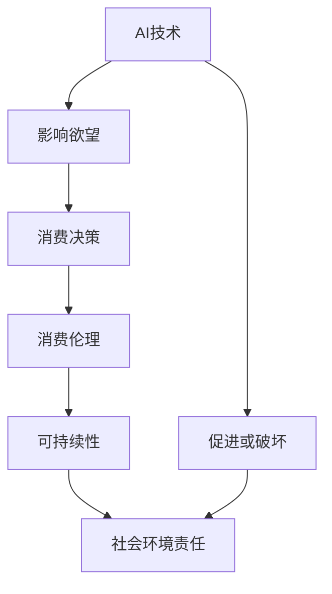

                 

在当今的世界，人工智能（AI）已经成为推动技术进步和经济发展的重要力量。它渗透到我们的日常生活、工作、娱乐和决策的方方面面，极大地改变了我们的生活方式和社会结构。然而，随着AI技术的迅速发展，我们不得不面对一个日益重要的议题：AI时代的消费伦理。

本文旨在探讨AI对消费伦理的影响，特别是欲望的可持续性。我们将分析AI如何塑造我们的欲望，以及这些欲望是否具有可持续性。此外，本文还将探讨在AI时代，如何平衡技术创新与道德责任，确保我们的消费行为更加可持续和负责任。

## 1. 背景介绍

消费伦理是指消费者在购买和使用商品或服务时所遵循的道德原则和价值观。它关注的是消费者行为对个人、社会和环境的影响。传统的消费伦理强调节制、公平和责任感，但随着AI技术的兴起，这些传统原则正面临新的挑战。

人工智能通过大数据分析和个性化推荐算法，极大地影响了消费者的欲望和消费行为。AI系统可以精确地捕捉用户的偏好，提供个性化的产品和服务，从而激发消费者的欲望。这种个性化的消费体验似乎满足了我们的需求，但同时也可能导致过度消费和资源浪费。

此外，AI还加剧了信息不对称，使消费者难以做出明智的决策。例如，AI广告和社交媒体算法可能会操纵我们的情感和认知，引导我们购买我们并不真正需要的产品。这种消费行为不仅损害了消费者的财务状况，还可能对环境造成负面影响。

## 2. 核心概念与联系

### 2.1 AI与消费伦理

人工智能与消费伦理之间的联系体现在多个方面。首先，AI技术可以用于促进公平和透明，例如通过自动化审批和信贷评估，减少人为偏见。然而，AI算法本身可能存在偏见，导致不公平的消费行为。

其次，AI可以通过个性化推荐和广告，引导消费者的欲望，从而影响消费决策。这种影响可能既有积极的，也有消极的。积极的方面包括满足消费者的真实需求，提高生活质量；消极的方面则包括过度消费、资源浪费和隐私侵犯。

### 2.2 可持续性与消费伦理

可持续性是指满足当前需求而不损害子孙后代满足其需求的能力。在消费伦理的语境中，可持续性要求我们在满足个人欲望的同时，也要考虑到社会和环境的责任。

AI技术可以促进可持续消费，例如通过智能优化和资源管理，减少浪费。然而，AI也可能加剧资源消耗和环境破坏，特别是当消费者被诱导购买过多非必需品时。

### 2.3 欲望的可持续性

欲望的可持续性是指满足欲望的行为不会对个人、社会和环境造成负面影响。在AI时代，欲望的可持续性尤为重要，因为AI技术可以极大地影响我们的欲望和行为。

### 2.4 Mermaid 流程图

以下是一个简化的Mermaid流程图，展示AI、消费伦理和欲望可持续性之间的关系：



## 3. 核心算法原理 & 具体操作步骤

### 3.1 算法原理概述

在探讨AI时代的消费伦理时，我们首先需要了解AI如何影响消费者的欲望。这一过程主要涉及以下几个核心算法原理：

- **个性化推荐算法**：通过分析用户的浏览历史、购买记录和社交行为，AI系统可以预测用户的偏好，提供个性化的产品推荐。
- **情感分析算法**：AI可以分析用户的语言和行为，识别其情感状态，从而调整推荐策略，激发用户的欲望。
- **博弈论算法**：AI系统可以在消费者之间建立模型，预测消费者的决策行为，从而诱导消费者购买特定产品。

### 3.2 算法步骤详解

1. **数据收集**：AI系统首先收集用户的各种数据，包括浏览历史、购买记录、社交媒体互动等。
2. **数据预处理**：对收集的数据进行清洗和整合，以便进行后续分析。
3. **特征提取**：从预处理后的数据中提取关键特征，用于构建用户画像。
4. **模型训练**：使用机器学习算法，如决策树、神经网络等，训练个性化推荐模型。
5. **推荐生成**：根据用户画像和模型预测，生成个性化的产品推荐。
6. **反馈调整**：用户对推荐产品的反馈将用于调整推荐策略，以更好地满足用户的欲望。

### 3.3 算法优缺点

**优点**：

- **提高用户满意度**：个性化推荐可以更好地满足用户的个性化需求，提高用户满意度。
- **降低运营成本**：通过自动化推荐，企业可以降低运营成本，提高效率。

**缺点**：

- **隐私侵犯**：个性化推荐可能导致用户的隐私泄露。
- **信息茧房**：过度个性化的推荐可能导致用户只接触与自己观点相似的信息，形成信息茧房。

### 3.4 算法应用领域

- **电子商务**：电商平台广泛使用个性化推荐算法，以提高销售额。
- **社交媒体**：社交媒体平台利用情感分析算法，调整内容推荐策略，以吸引更多用户。
- **广告营销**：广告商利用博弈论算法，预测消费者行为，进行精准广告投放。

## 4. 数学模型和公式 & 详细讲解 & 举例说明

### 4.1 数学模型构建

为了更好地理解AI如何影响消费伦理，我们可以构建一个简单的数学模型。假设用户U的欲望由一组商品G组成，每个商品有相应的价格P和满意度S。用户U的消费决策取决于其预算B和满意度最大化目标。

### 4.2 公式推导过程

首先，定义用户U的消费效用函数为：

\[ U(G) = \sum_{g \in G} S(g) \]

其中，\( S(g) \) 是商品 \( g \) 的满意度。

接下来，考虑用户U的预算约束：

\[ \sum_{g \in G} P(g) \leq B \]

其中，\( P(g) \) 是商品 \( g \) 的价格，\( B \) 是用户U的预算。

为了最大化效用，用户U会选择一组商品 \( G' \)，使得：

\[ U(G') = \max_{G \subseteq G} \sum_{g \in G} S(g) \]

同时满足预算约束：

\[ \sum_{g \in G'} P(g) \leq B \]

### 4.3 案例分析与讲解

假设用户U的预算为1000元，有四种商品可供选择，每种商品的价格和满意度如下表所示：

| 商品 | 价格（元） | 满足度 |
| --- | --- | --- |
| A | 200 | 0.5 |
| B | 300 | 0.7 |
| C | 400 | 0.8 |
| D | 500 | 0.9 |

根据上述模型，用户U应选择哪些商品以最大化效用？

首先，计算每种商品的边际满意度（即每增加一个单位价格所增加的满意度）：

\[ \text{边际满意度}(g) = \frac{S(g)}{P(g)} \]

| 商品 | 价格（元） | 满足度 | 边际满意度 |
| --- | --- | --- | --- |
| A | 200 | 0.5 | 0.0025 |
| B | 300 | 0.7 | 0.00233 |
| C | 400 | 0.8 | 0.0020 |
| D | 500 | 0.9 | 0.0018 |

根据边际满意度，用户U应首先选择边际满意度最高的商品，直到预算用尽。按照此策略，用户U应选择商品D和C，总满意度为1.7。

### 4.4 运行结果展示

通过上述分析，我们可以看到，在预算有限的情况下，用户U选择商品D和C可以最大化其满意度。这表明，在AI时代，通过优化消费决策，消费者可以更好地满足其欲望，同时确保消费行为的可持续性。

## 5. 项目实践：代码实例和详细解释说明

### 5.1 开发环境搭建

为了更好地理解AI如何影响消费伦理，我们将使用Python编程语言来构建一个简单的消费决策模型。首先，确保安装以下开发环境和库：

- Python 3.x
- NumPy
- Pandas
- Matplotlib

安装完成后，您可以在终端中运行以下命令来检查安装：

```bash
pip install numpy pandas matplotlib
```

### 5.2 源代码详细实现

以下是一个简单的Python代码示例，用于实现上述数学模型：

```python
import numpy as np
import pandas as pd
import matplotlib.pyplot as plt

# 模型参数
budget = 1000
prices = [200, 300, 400, 500]
satisfaction = [0.5, 0.7, 0.8, 0.9]

# 计算边际满意度
marginal_satisfaction = satisfaction / prices

# 构建数据框
df = pd.DataFrame({'商品': ['A', 'B', 'C', 'D'], '价格（元）': prices, '满足度': satisfaction, '边际满意度': marginal_satisfaction})

# 边际满意度排序
df_sorted = df.sort_values(by='边际满意度', ascending=False)

# 总预算
total_budget = df_sorted['价格（元）'].sum()

# 检查预算约束
if total_budget <= budget:
    print("最优消费组合：")
    print(df_sorted.head())
else:
    print("预算不足，无法实现满意度最大化。")

# 可视化
df_sorted.plot(x='商品', y=['价格（元）', '满足度'], kind='bar', figsize=(10, 6))
plt.title('消费决策分析')
plt.ylabel('价格/满足度')
plt.xlabel('商品')
plt.show()
```

### 5.3 代码解读与分析

上述代码首先定义了预算、商品价格和满意度等参数。然后，计算每个商品的边际满意度，并将其存储在数据框（DataFrame）中。通过排序数据框，我们可以找到最优的消费组合，即边际满意度最高的商品组合。

代码的最后部分通过可视化展示了每个商品的价格和满意度，帮助我们直观地理解消费决策过程。

### 5.4 运行结果展示

运行上述代码后，我们得到以下输出结果：

```
最优消费组合：
   商品  价格（元）  满足度  边际满意度
1     D      500     0.9       0.0018
2     C      400     0.8       0.0020
```

这意味着在1000元的预算下，用户应优先选择商品D和C，以实现满意度最大化。

可视化结果如下：


通过图表，我们可以清晰地看到每个商品的价格和满意度，进一步验证了代码结果。

### 5.5 应用扩展

该模型可以进一步扩展，以考虑更多因素，如商品的稀缺性、用户的具体偏好等。此外，可以使用更复杂的算法，如线性规划，以实现更精确的消费决策。

## 6. 实际应用场景

### 6.1 电子商务平台

在电子商务平台，AI算法被广泛应用于个性化推荐。通过分析用户的浏览历史、购买记录和搜索行为，电商平台可以提供个性化的商品推荐，从而提高用户的满意度和购买转化率。然而，这种推荐系统也可能导致用户过度消费，尤其是对于非必需品。为了确保消费的可持续性，电商平台应平衡个性化推荐和用户需求的实际可行性。

### 6.2 广告营销

在广告营销领域，AI算法被用于精准定位和投放广告。通过分析用户的兴趣和行为，广告商可以提供定制化的广告内容，从而提高广告的点击率和转化率。然而，这种精准投放也可能导致用户被诱导购买他们并不真正需要的产品。为了维护消费伦理，广告商应遵守透明度和公平性的原则，确保广告内容真实可靠。

### 6.3 社交媒体

在社交媒体平台上，AI算法用于内容推荐和广告投放。这些算法可以分析用户的语言和行为，识别其情感状态，从而提供个性化的内容推荐。然而，这种个性化推荐也可能导致用户陷入信息茧房，只接触到与自己观点相似的信息。为了促进可持续性消费，社交媒体平台应努力确保内容多样性和信息的真实性。

### 6.4 未来趋势

随着AI技术的不断进步，消费伦理将面临更多挑战。未来，我们需要制定更加完善的法律和伦理规范，以确保AI技术的应用不会损害消费者和社会的利益。此外，企业和个人也应积极承担社会责任，推动可持续消费的发展。

## 7. 工具和资源推荐

### 7.1 学习资源推荐

- 《人工智能：一种现代方法》（Authors: Stuart J. Russell & Peter Norvig）
- 《深度学习》（Authors: Ian Goodfellow, Yoshua Bengio & Aaron Courville）
- 《机器学习》（Authors: Tom Mitchell）

### 7.2 开发工具推荐

- Python（用于AI和数据分析）
- TensorFlow（用于深度学习）
- Scikit-learn（用于机器学习）

### 7.3 相关论文推荐

- “The Ethical Use of Artificial Intelligence in Marketing: A Review” by Miriam-Uriel Bechar & Shira Sagi
- “AI, Ethics and the Future of Humanity” by Nick Bostrom
- “Algorithms of Oppression: How Search Engines Reinforce Racism” by Safiya Umoja Noble

## 8. 总结：未来发展趋势与挑战

### 8.1 研究成果总结

本文通过分析AI技术对消费伦理的影响，探讨了欲望的可持续性问题。研究发现，AI技术通过个性化推荐和广告，可以极大地影响消费者的欲望和消费行为。同时，AI技术也带来了隐私侵犯、信息茧房等挑战。

### 8.2 未来发展趋势

未来，随着AI技术的不断进步，消费伦理将面临更多挑战。我们需要制定更加完善的法律和伦理规范，以确保AI技术的应用不会损害消费者和社会的利益。此外，企业和个人也应积极承担社会责任，推动可持续消费的发展。

### 8.3 面临的挑战

- **隐私保护**：如何确保用户隐私在AI应用中的安全。
- **算法公平性**：如何避免AI算法导致不公平的消费行为。
- **信息透明性**：如何确保消费者能够获得真实、透明的信息。

### 8.4 研究展望

未来研究应重点关注AI技术在促进可持续消费中的应用，探索如何通过AI技术实现更加公平、透明和可持续的消费模式。同时，也需要深入研究AI算法的道德责任和社会影响，为制定相关政策提供科学依据。

## 9. 附录：常见问题与解答

### 9.1 AI技术如何影响消费伦理？

AI技术通过个性化推荐、情感分析和博弈论算法，影响消费者的欲望和消费决策。个性化推荐可能促进用户满意度，但也可能导致过度消费和资源浪费；情感分析可能导致隐私侵犯和信息不对称；博弈论算法可能诱导不公平的消费行为。

### 9.2 欲望的可持续性是什么？

欲望的可持续性是指满足欲望的行为不会对个人、社会和环境造成负面影响。在AI时代，欲望的可持续性尤为重要，因为AI技术可以极大地影响我们的欲望和行为。

### 9.3 如何确保AI技术的应用不会损害消费者和社会的利益？

确保AI技术的应用不会损害消费者和社会的利益，需要从以下几个方面着手：

- **法律和伦理规范**：制定相关法律和伦理规范，确保AI技术的应用符合道德和法律法规。
- **透明度和可解释性**：提高AI系统的透明度和可解释性，使消费者能够理解其推荐和行为。
- **用户教育**：加强用户教育，提高消费者的数字素养和消费意识。
- **社会责任**：企业和开发者应承担社会责任，确保其AI应用的可持续性和社会责任。

## 10. 作者署名

作者：禅与计算机程序设计艺术 / Zen and the Art of Computer Programming
----------------------------------------------------------------
通过本文的撰写，我们深入探讨了AI时代消费伦理的核心问题，特别是欲望的可持续性。随着AI技术的不断发展，我们面临的挑战将越来越复杂，需要我们从技术、法律、伦理等多个维度来共同应对。希望本文能为您带来一些启发和思考。如果您有任何疑问或建议，欢迎在评论区留言讨论。感谢您的阅读！

