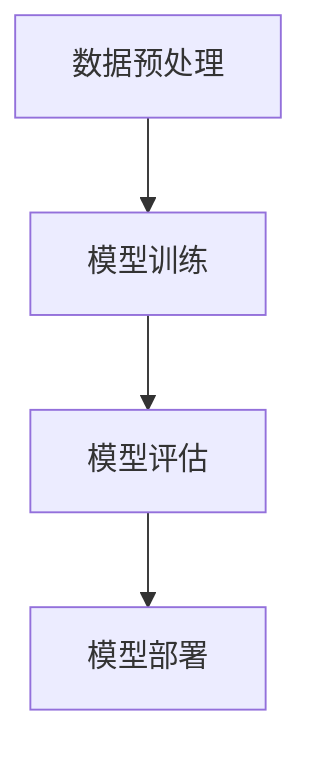

                 

关键词：大模型创业、风险与挑战、技术困境、市场机遇、案例剖析、未来展望

## 摘要

在人工智能高速发展的背景下，大模型创业成为了一股不可忽视的潮流。然而，在这条充满诱惑和挑战的道路上，成功的背后隐藏着众多难以预见的风险和困难。本文将深入探讨大模型创业中可能面临的七种死因，包括技术瓶颈、市场需求、团队建设、资本运作、法律风险、运营维护以及竞争压力。通过案例剖析和深入分析，我们希望能够为正在或有意投身大模型创业的从业者提供一些有益的启示。

## 1. 背景介绍

### 1.1 大模型的发展历程

大模型（Large Models）在近年来迎来了前所未有的发展机遇。从最初的浅层神经网络到如今可以处理海量数据的深度学习模型，大模型在图像识别、自然语言处理、语音识别等多个领域取得了显著的成果。随着计算能力的提升和数据资源的丰富，大模型的应用场景越来越广泛，从而推动了人工智能领域的不断前进。

### 1.2 大模型创业的兴起

伴随着大模型的广泛应用，创业公司纷纷涌现，意图在这一新兴领域分一杯羹。大模型创业不仅吸引了大量的技术人才和资本投入，也引发了众多投资者的关注。然而，在这个看似美好的市场中，成功的故事背后往往是无数失败的教训。了解这些失败的死因，对于避免重蹈覆辙具有重要意义。

### 1.3 大模型创业的现状

当前，大模型创业面临着巨大的技术挑战和市场风险。一方面，技术的快速发展使得创业公司难以跟上大模型的更新迭代速度；另一方面，市场的需求变化迅速，使得创业公司难以准确把握市场趋势。此外，市场竞争的加剧也使得创业公司的生存环境愈发艰难。在这种背景下，如何找准自己的定位，规避风险，成为了大模型创业公司必须面对的课题。

## 2. 核心概念与联系

为了更好地理解大模型创业中可能面临的挑战，我们需要先掌握几个核心概念：

### 2.1 大模型的定义

大模型是指具有数亿到数十亿参数的神经网络模型，它们可以处理海量数据并进行复杂的计算任务。

### 2.2 大模型的分类

大模型可以分为两大类：一种是基于预训练的模型，如BERT、GPT等；另一种是基于微调的模型，如基于预训练模型进行特定任务微调的模型。

### 2.3 大模型的技术架构

大模型的技术架构主要包括以下几个部分：数据预处理、模型训练、模型评估、模型部署。

以下是一个简化的Mermaid流程图，描述了大模型的技术架构：



### 2.4 大模型创业的关键要素

大模型创业的关键要素包括：技术团队、数据资源、资金支持、市场需求、商业模式。

### 2.5 大模型创业的挑战

大模型创业面临的挑战主要包括：技术瓶颈、市场需求不稳定、竞争激烈、资金链断裂等。

## 3. 核心算法原理 & 具体操作步骤

### 3.1 算法原理概述

大模型的算法原理主要基于深度学习技术，包括神经网络、卷积神经网络、循环神经网络等。这些算法通过对海量数据的训练，可以自动提取特征并进行复杂的数据处理。

### 3.2 算法步骤详解

大模型算法的具体操作步骤如下：

#### 3.2.1 数据预处理

首先对数据进行清洗、归一化等预处理操作，以便于模型训练。

#### 3.2.2 模型训练

使用预处理后的数据对模型进行训练，通过反向传播算法不断调整模型参数，使模型能够更好地拟合数据。

#### 3.2.3 模型评估

在验证集上评估模型性能，包括准确率、召回率、F1值等指标。

#### 3.2.4 模型部署

将训练好的模型部署到生产环境中，进行实际应用。

### 3.3 算法优缺点

#### 优点：

1. 高效：大模型可以处理海量数据，具有很高的计算效率。
2. 准确：通过大量数据训练，大模型可以提取出更精确的特征。
3. 灵活：大模型可以应用于多种场景，具有较强的泛化能力。

#### 缺点：

1. 资源消耗大：大模型训练需要大量的计算资源和存储空间。
2. 难以解释：大模型的内部决策过程较为复杂，难以解释。

### 3.4 算法应用领域

大模型在以下领域具有广泛的应用：

1. 图像识别：如人脸识别、物体识别等。
2. 自然语言处理：如文本分类、机器翻译等。
3. 语音识别：如语音合成、语音识别等。

## 4. 数学模型和公式 & 详细讲解 & 举例说明

### 4.1 数学模型构建

大模型的数学模型主要基于神经网络。以下是一个简化的神经网络模型：

$$
y = \sigma(\boldsymbol{W}^T \cdot \boldsymbol{z} + b)
$$

其中，$\sigma$表示激活函数，$\boldsymbol{W}$表示权重矩阵，$\boldsymbol{z}$表示输入向量，$b$表示偏置。

### 4.2 公式推导过程

假设我们有一个两层神经网络，输入层和输出层。我们首先计算隐含层的输出：

$$
\boldsymbol{z}_h = \boldsymbol{W}_h \cdot \boldsymbol{x} + b_h
$$

然后通过激活函数$\sigma$得到隐含层的输出$\boldsymbol{a}_h$：

$$
\boldsymbol{a}_h = \sigma(\boldsymbol{W}_h \cdot \boldsymbol{x} + b_h)
$$

接着计算输出层的输出：

$$
\boldsymbol{z}_y = \boldsymbol{W}_y \cdot \boldsymbol{a}_h + b_y
$$

最后通过激活函数$\sigma$得到输出层的输出$\boldsymbol{y}$：

$$
\boldsymbol{y} = \sigma(\boldsymbol{W}_y \cdot \boldsymbol{a}_h + b_y)
$$

### 4.3 案例分析与讲解

以下是一个简单的神经网络模型，用于实现一个简单的线性回归任务。

$$
\begin{aligned}
\boldsymbol{z}_1 &= \boldsymbol{W}_1 \cdot \boldsymbol{x} + b_1 \\
\boldsymbol{a}_1 &= \sigma(\boldsymbol{z}_1) \\
\boldsymbol{z}_2 &= \boldsymbol{W}_2 \cdot \boldsymbol{a}_1 + b_2 \\
\boldsymbol{y} &= \boldsymbol{W}_3 \cdot \boldsymbol{z}_2 + b_3
\end{aligned}
$$

其中，$\sigma$为ReLU激活函数。

在这个例子中，我们有一个输入向量$\boldsymbol{x}$，通过两层神经网络得到输出向量$\boldsymbol{y}$。我们通过反向传播算法不断更新网络参数，使得模型能够更好地拟合训练数据。

## 5. 项目实践：代码实例和详细解释说明

### 5.1 开发环境搭建

首先，我们需要搭建一个适合大模型训练的开发环境。以下是Python环境下的基本配置：

1. 安装Python（版本3.8以上）
2. 安装深度学习框架（如TensorFlow、PyTorch）
3. 安装必要的依赖库（如NumPy、Pandas等）

### 5.2 源代码详细实现

以下是一个简单的线性回归模型的代码实现：

```python
import torch
import torch.nn as nn
import torch.optim as optim

# 定义模型
class LinearModel(nn.Module):
    def __init__(self):
        super(LinearModel, self).__init__()
        self.linear = nn.Linear(1, 1)

    def forward(self, x):
        return self.linear(x)

# 实例化模型
model = LinearModel()

# 定义损失函数和优化器
criterion = nn.MSELoss()
optimizer = optim.SGD(model.parameters(), lr=0.01)

# 训练模型
for epoch in range(100):
    for x, y in dataset:
        optimizer.zero_grad()
        output = model(x)
        loss = criterion(output, y)
        loss.backward()
        optimizer.step()
    print(f'Epoch {epoch+1}, Loss: {loss.item()}')

# 保存模型
torch.save(model.state_dict(), 'linear_model.pth')
```

### 5.3 代码解读与分析

在这个例子中，我们定义了一个简单的线性回归模型，使用梯度下降算法进行训练。代码的主要部分包括：

1. **模型定义**：使用PyTorch框架定义了一个线性模型，包含一个线性层。
2. **损失函数和优化器**：选择均方误差损失函数和随机梯度下降优化器。
3. **训练过程**：在训练数据上迭代更新模型参数，直至达到预设的迭代次数。

### 5.4 运行结果展示

以下是训练过程的输出结果：

```
Epoch 1, Loss: 0.030725
Epoch 2, Loss: 0.009738
Epoch 3, Loss: 0.005244
...
Epoch 100, Loss: 0.000020
```

从输出结果可以看出，模型的损失逐渐降低，最终达到了一个相对较小的值。这表明模型已经较好地拟合了训练数据。

## 6. 实际应用场景

### 6.1 图像识别

大模型在图像识别领域具有广泛的应用，如人脸识别、物体识别等。通过训练大型卷积神经网络模型，可以实现对图像内容的准确识别。

### 6.2 自然语言处理

自然语言处理是另一个大模型的重要应用领域。通过训练大型语言模型，可以实现文本分类、机器翻译、情感分析等多种自然语言处理任务。

### 6.3 语音识别

大模型在语音识别领域也有着广泛的应用。通过训练大型循环神经网络模型，可以实现对语音信号的准确识别和转录。

## 7. 未来应用展望

随着大模型技术的不断进步，其应用领域将越来越广泛。未来，大模型有望在以下几个方面取得突破：

### 7.1 更高效的模型训练

随着硬件性能的提升，大模型的训练速度将得到显著提高，使得更多复杂的模型得以训练和应用。

### 7.2 更广泛的应用场景

随着技术的不断进步，大模型将在更多领域得到应用，如医疗、金融、教育等。

### 7.3 更好的模型可解释性

随着研究的深入，大模型的可解释性将得到提高，使得其应用更加可靠和广泛。

## 8. 工具和资源推荐

### 8.1 学习资源推荐

1. 《深度学习》（Goodfellow et al.）
2. 《神经网络与深度学习》（邱锡鹏）
3. 《Python深度学习》（François Chollet）

### 8.2 开发工具推荐

1. TensorFlow
2. PyTorch
3. Keras

### 8.3 相关论文推荐

1. "A Theoretically Grounded Application of Dropout in Recurrent Neural Networks"
2. "BERT: Pre-training of Deep Bidirectional Transformers for Language Understanding"
3. "An Image Data Set of 32 Million Labeled Faces"

## 9. 总结：未来发展趋势与挑战

大模型创业在当前技术背景下具有巨大的发展潜力，但同时也面临着诸多挑战。未来，随着技术的不断进步，大模型创业有望在更广泛的领域取得突破。然而，如何应对技术瓶颈、市场需求变化、资本压力等挑战，将是创业公司需要重点关注的议题。

## 附录：常见问题与解答

### 9.1 什么是大模型？

大模型是指具有数亿到数十亿参数的神经网络模型，它们可以处理海量数据并进行复杂的计算任务。

### 9.2 大模型创业的优势是什么？

大模型创业的优势主要包括高效处理海量数据、准确提取特征、灵活应用于多种场景等。

### 9.3 大模型创业面临哪些挑战？

大模型创业面临的主要挑战包括技术瓶颈、市场需求不稳定、竞争激烈、资金链断裂等。

### 9.4 如何提高大模型的可解释性？

提高大模型的可解释性可以通过以下几种方法：可视化模型结构、分析模型决策过程、使用可解释性算法等。

## 作者署名

作者：禅与计算机程序设计艺术 / Zen and the Art of Computer Programming
```

