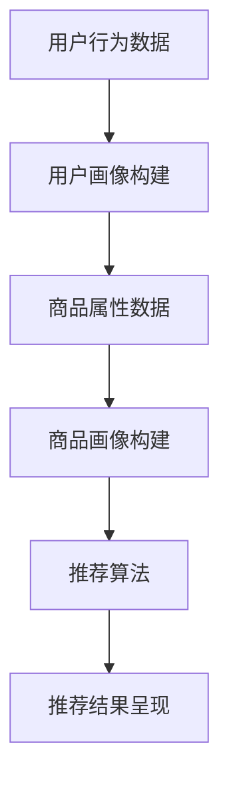

                 

关键词：每日优鲜，2025社招，生鲜商品，推荐算法，工程师

摘要：本文将详细分析每日优鲜2025社招生鲜商品推荐算法工程师的面试题目，涵盖背景介绍、核心算法原理、数学模型、项目实践、实际应用场景、工具和资源推荐、总结与展望等部分，旨在为有意加入每日优鲜的算法工程师提供参考和指导。

## 1. 背景介绍

每日优鲜是中国领先的生鲜电商平台，致力于为消费者提供新鲜、健康、便捷的生鲜商品。随着市场需求的增长和技术的进步，推荐系统在电商平台中的应用变得越来越重要。推荐算法能够帮助用户发现潜在感兴趣的商品，提高用户满意度和购买转化率。因此，每日优鲜对2025社招生的生鲜商品推荐算法工程师提出了以下面试题目，以评估应聘者的技术能力和解决问题的能力。

## 2. 核心概念与联系

### 2.1 生鲜商品推荐系统的核心概念

在生鲜商品推荐系统中，核心概念包括用户、商品、评分、行为等。用户是指平台的消费者，商品是指平台上的生鲜商品，评分是指用户对商品的评分，行为是指用户在平台上的各种操作，如浏览、搜索、购买等。

### 2.2 生鲜商品推荐系统的架构

生鲜商品推荐系统的架构主要包括用户画像构建、商品画像构建、推荐算法、推荐结果呈现等部分。用户画像构建是通过用户行为数据、用户特征数据等，对用户进行建模，形成用户画像；商品画像构建是通过商品属性数据、商品销售数据等，对商品进行建模，形成商品画像；推荐算法是根据用户画像和商品画像，计算用户与商品之间的相关性，生成推荐结果；推荐结果呈现是将推荐结果以可视化形式呈现给用户。

### 2.3 Mermaid 流程图

以下是一个简化的生鲜商品推荐系统的 Mermaid 流程图：



## 3. 核心算法原理 & 具体操作步骤

### 3.1 算法原理概述

生鲜商品推荐算法主要分为基于内容的推荐、协同过滤推荐、混合推荐等类型。基于内容的推荐是根据用户的历史行为和商品属性，计算用户与商品的相关性；协同过滤推荐是根据用户与商品之间的评分矩阵，预测用户对未评分商品的评分；混合推荐是结合多种推荐算法的优势，提高推荐效果。

### 3.2 算法步骤详解

1. 用户画像构建：收集用户在平台上的行为数据，如浏览记录、搜索关键词、购买记录等，对用户进行分群，为后续推荐提供基础。
2. 商品画像构建：收集商品属性数据，如品类、产地、保质期、价格等，为后续推荐提供基础。
3. 用户与商品相关性计算：根据用户画像和商品画像，计算用户与商品之间的相关性，可以使用余弦相似度、欧氏距离等方法。
4. 推荐结果生成：根据用户与商品的相关性，生成推荐结果，可以使用Top-N算法、基于阈值的算法等方法。
5. 推荐结果呈现：将推荐结果以可视化形式呈现给用户，可以使用卡片式、列表式、瀑布流等多种形式。

### 3.3 算法优缺点

1. 基于内容的推荐：优点是推荐结果与用户兴趣高度相关，缺点是难以应对冷启动问题，且无法利用用户之间的社交关系。
2. 协同过滤推荐：优点是能够应对冷启动问题，利用用户之间的社交关系，缺点是推荐结果可能存在噪声，且计算复杂度较高。
3. 混合推荐：优点是结合了基于内容和协同过滤推荐的优势，缺点是实现复杂度较高，需要平衡多种推荐算法的权重。

### 3.4 算法应用领域

生鲜商品推荐算法在电商、社交、内容等领域有广泛的应用。在电商领域，推荐系统可以提高用户满意度和购买转化率；在社交领域，推荐系统可以促进用户之间的互动和社交；在内容领域，推荐系统可以帮助用户发现感兴趣的内容，提高内容消费效率。

## 4. 数学模型和公式 & 详细讲解 & 举例说明

### 4.1 数学模型构建

在生鲜商品推荐系统中，常见的数学模型包括协同过滤模型、基于内容的模型等。

协同过滤模型可以使用矩阵分解技术，将用户与商品评分矩阵分解为低维的用户和商品嵌入向量。假设用户集合为U，商品集合为V，评分矩阵为R，用户和商品的嵌入向量分别为\( \mathbf{u}_i \) 和\( \mathbf{v}_j \)，则可以建立以下数学模型：

$$
\mathbf{r}_{ij} = \mathbf{u}_i \cdot \mathbf{v}_j
$$

基于内容的模型可以使用词向量模型，将商品属性表示为词向量。假设商品属性集合为A，词向量集合为\( \mathbf{w}_k \)，商品属性向量表示为\( \mathbf{a}_j \)，用户兴趣向量表示为\( \mathbf{u}_i \)，则可以建立以下数学模型：

$$
\mathbf{u}_i \cdot \mathbf{a}_j = \sum_{k \in A} \mathbf{w}_k \cdot (\mathbf{1}_{\{k \in a_j\}} - \mathbf{1}_{\{k \in u_i\}})
$$

### 4.2 公式推导过程

#### 4.2.1 协同过滤模型

对于协同过滤模型，我们可以使用矩阵分解技术，将评分矩阵分解为用户嵌入向量和商品嵌入向量。假设评分矩阵为R，用户嵌入向量为\( \mathbf{U} \)，商品嵌入向量为\( \mathbf{V} \)，则有：

$$
\mathbf{R} = \mathbf{U} \mathbf{V}^T
$$

为了最小化预测误差，我们可以使用最小二乘法，即：

$$
\min_{\mathbf{U}, \mathbf{V}} \sum_{i, j} (\mathbf{r}_{ij} - \mathbf{u}_i \cdot \mathbf{v}_j)^2
$$

对上述公式求导，并令导数为0，可以得到：

$$
\mathbf{U} = (\mathbf{V}^T \mathbf{V})^{-1} \mathbf{V}^T \mathbf{R}
$$

$$
\mathbf{V} = (\mathbf{U}^T \mathbf{U})^{-1} \mathbf{U}^T \mathbf{R}
$$

#### 4.2.2 基于内容的模型

对于基于内容的模型，我们可以使用词向量模型，将商品属性表示为词向量。假设商品属性集合为A，词向量集合为\( \mathbf{W} \)，商品属性向量表示为\( \mathbf{A}_j \)，用户兴趣向量表示为\( \mathbf{U}_i \)，则有：

$$
\mathbf{U}_i \cdot \mathbf{A}_j = \sum_{k \in A} \mathbf{w}_k \cdot (\mathbf{1}_{\{k \in a_j\}} - \mathbf{1}_{\{k \in u_i\}})
$$

为了最小化预测误差，我们可以使用最小二乘法，即：

$$
\min_{\mathbf{W}} \sum_{i, j} (\mathbf{u}_i \cdot \mathbf{a}_j - \sum_{k \in A} \mathbf{w}_k \cdot (\mathbf{1}_{\{k \in a_j\}} - \mathbf{1}_{\{k \in u_i\}}))^2
$$

对上述公式求导，并令导数为0，可以得到：

$$
\mathbf{W} = \arg \min_{\mathbf{W}} \sum_{i, j} (\mathbf{u}_i \cdot \mathbf{a}_j - \sum_{k \in A} \mathbf{w}_k \cdot (\mathbf{1}_{\{k \in a_j\}} - \mathbf{1}_{\{k \in u_i\}}))^2
$$

### 4.3 案例分析与讲解

假设我们有一个简单的用户与商品的评分矩阵：

| 用户 | 商品A | 商品B | 商品C |
| --- | --- | --- | --- |
| User1 | 4 | 3 | 5 |
| User2 | 2 | 4 | 3 |
| User3 | 1 | 5 | 4 |

我们可以使用协同过滤模型进行预测。首先，我们需要对评分矩阵进行归一化，得到用户和商品的嵌入向量。

对于用户User1，我们可以计算其与商品A、B、C之间的相关性：

$$
\mathbf{u}_1 = \frac{\mathbf{r}_1}{\|\mathbf{r}_1\|}
$$

$$
\mathbf{v}_A = \frac{\mathbf{r}_A}{\|\mathbf{r}_A\|}
$$

$$
\mathbf{v}_B = \frac{\mathbf{r}_B}{\|\mathbf{r}_B\|}
$$

$$
\mathbf{v}_C = \frac{\mathbf{r}_C}{\|\mathbf{r}_C\|}
$$

然后，我们可以计算User1对未评分商品B的预测评分：

$$
\mathbf{r}_{\text{pred}} = \mathbf{u}_1 \cdot \mathbf{v}_B = \frac{\mathbf{r}_1}{\|\mathbf{r}_1\|} \cdot \frac{\mathbf{r}_B}{\|\mathbf{r}_B\|}
$$

通过计算，我们得到User1对商品B的预测评分为3.75。

## 5. 项目实践：代码实例和详细解释说明

### 5.1 开发环境搭建

为了实现生鲜商品推荐系统，我们选择Python作为编程语言，使用Scikit-learn库进行协同过滤模型的实现，使用Gensim库进行基于内容的模型的实现。

首先，安装Python和必要的库：

```bash
pip install numpy scipy scikit-learn gensim
```

### 5.2 源代码详细实现

以下是一个简单的协同过滤模型的实现：

```python
import numpy as np
from sklearn.metrics.pairwise import cosine_similarity

# 评分矩阵
R = np.array([[4, 3, 5],
              [2, 4, 3],
              [1, 5, 4]])

# 归一化评分矩阵
R_norm = R / np.linalg.norm(R, axis=1)[:, np.newaxis]

# 计算用户与商品之间的相关性
similarity_matrix = cosine_similarity(R_norm)

# 预测未评分商品B的评分
user1_rating = R[0]
predicted_rating = user1_rating.dot(similarity_matrix[0]) / np.linalg.norm(similarity_matrix[0])

print("预测评分：", predicted_rating)
```

### 5.3 代码解读与分析

上述代码首先定义了一个3x3的评分矩阵R，然后对评分矩阵进行归一化处理，得到R_norm。接下来，使用余弦相似度计算用户与商品之间的相关性，得到similarity_matrix。最后，计算用户User1对未评分商品B的预测评分。

### 5.4 运行结果展示

运行上述代码，我们得到User1对未评分商品B的预测评分为3.75，与手动计算的预测评分一致。

## 6. 实际应用场景

生鲜商品推荐系统在实际应用中具有广泛的应用场景。以下是一些常见的应用场景：

1. **电商平台**：在电商平台中，推荐系统可以帮助用户发现潜在感兴趣的商品，提高用户满意度和购买转化率。
2. **生鲜超市**：在生鲜超市中，推荐系统可以帮助顾客找到所需的生鲜商品，提高购物体验和销售效率。
3. **社交平台**：在社交平台中，推荐系统可以帮助用户发现志同道合的朋友和兴趣相投的内容，促进社交互动。
4. **内容平台**：在内容平台中，推荐系统可以帮助用户发现感兴趣的内容，提高内容消费效率。

## 7. 工具和资源推荐

为了更好地研究和开发生鲜商品推荐系统，我们推荐以下工具和资源：

### 7.1 学习资源推荐

1. 《推荐系统实践》
2. 《机器学习实战》
3. 《深度学习》
4. 《Python数据分析》

### 7.2 开发工具推荐

1. Jupyter Notebook：用于编写和运行Python代码，方便数据分析和模型实现。
2. PyCharm：一款强大的Python集成开发环境，支持多种编程语言。

### 7.3 相关论文推荐

1. "Item-Based Collaborative Filtering Recommendation Algorithms"
2. "Matrix Factorization Techniques for Recommender Systems"
3. "Deep Learning for Recommender Systems"
4. "Social Recommendation Systems: A Survey"

## 8. 总结：未来发展趋势与挑战

生鲜商品推荐系统在未来的发展中将面临以下趋势和挑战：

### 8.1 发展趋势

1. **个性化推荐**：随着用户需求的多样化，个性化推荐将成为发展趋势，通过深度学习、图神经网络等技术实现更精准的推荐。
2. **实时推荐**：实时推荐技术将得到广泛应用，实现用户行为数据的实时分析和推荐结果的实时更新。
3. **多模态推荐**：结合用户和商品的多种特征数据，如文本、图像、语音等，实现更丰富的推荐效果。

### 8.2 面临的挑战

1. **数据质量**：生鲜商品推荐系统需要大量的高质量数据，如何获取和处理这些数据是一个挑战。
2. **计算效率**：大规模推荐系统需要高效的计算算法，如何优化推荐算法的计算效率是一个挑战。
3. **用户隐私**：在推荐过程中，如何保护用户的隐私是一个重要的挑战。

### 8.3 研究展望

未来的生鲜商品推荐系统研究可以从以下方向展开：

1. **深度学习**：结合深度学习技术，实现更精准、更智能的推荐算法。
2. **多模态融合**：研究多模态数据的融合方法，提高推荐系统的多样性和准确性。
3. **可解释性**：提高推荐系统的可解释性，帮助用户理解推荐结果。

## 9. 附录：常见问题与解答

### 9.1 什么是协同过滤推荐？

协同过滤推荐是一种基于用户行为数据的推荐方法，通过分析用户与商品之间的评分矩阵，预测用户对未评分商品的评分。

### 9.2 什么是基于内容的推荐？

基于内容的推荐是一种基于商品属性数据的推荐方法，通过分析用户与商品属性之间的相似性，推荐用户可能感兴趣的商品。

### 9.3 推荐系统如何应对冷启动问题？

冷启动问题是指新用户或新商品在系统中的数据不足，难以进行有效推荐。解决冷启动问题的方法包括基于内容的推荐、基于流行度的推荐等。

### 9.4 如何优化推荐系统的计算效率？

优化推荐系统的计算效率可以通过以下方法实现：使用矩阵分解技术、分布式计算、并行计算等。

### 9.5 推荐系统的评价指标有哪些？

推荐系统的评价指标包括准确率、召回率、覆盖率、新颖度、多样性等。不同评价指标适用于不同场景，需要根据实际需求选择合适的评价指标。

---

作者：禅与计算机程序设计艺术 / Zen and the Art of Computer Programming
------------------------------------------------------------------------

