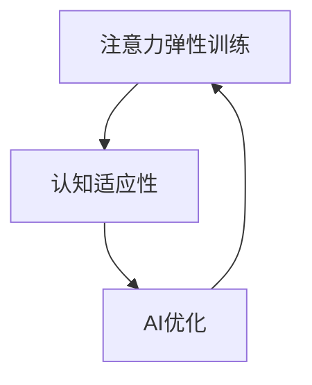

                 

关键词：注意力弹性训练，认知适应性，AI优化，神经科学，算法设计，应用场景，未来展望

> 摘要：本文旨在探讨注意力弹性训练在认知适应性提升中的应用，特别是在AI优化背景下的研究进展。通过结合神经科学和算法设计的最新成果，本文提出了一个AI优化的认知适应程序框架，并详细介绍了其原理、方法、数学模型和实际应用。文章还探讨了该程序在未来的潜在应用领域和发展趋势。

## 1. 背景介绍

### 认知适应性的重要性

认知适应性是指个体在面对不同环境和任务时调整和优化自身认知过程的能力。这种适应性对个体在快速变化和复杂环境中的生存与成功至关重要。在神经科学领域，认知适应性被视为一种动态平衡过程，涉及多个认知功能，如注意力、记忆、决策和问题解决等。

### 注意力弹性训练的起源

注意力弹性训练起源于神经科学的研究，旨在通过特定训练方法提高个体对注意力的管理和控制能力。随着人工智能技术的快速发展，注意力弹性训练逐渐与AI优化相结合，形成了新的研究方向。AI优化提供了计算工具和方法，使得注意力弹性训练在个体认知适应性提升方面取得了显著成果。

### AI优化在认知适应性研究中的作用

AI优化在认知适应性研究中发挥着关键作用。首先，它提供了高效的算法和模型，能够处理大规模数据，识别出个体在注意力管理方面的潜在问题。其次，AI优化可以帮助设计个性化的训练计划，根据个体的需求和环境进行动态调整。此外，AI优化还在模型验证和性能评估方面提供了有力的支持，确保训练效果的可重复性和可靠性。

## 2. 核心概念与联系

### 核心概念

#### 注意力弹性

注意力弹性是指个体在注意力分配、切换和恢复方面表现出的灵活性和适应性。高注意力的弹性意味着个体能够在不同的任务和环境之间自由切换，保持高效的工作状态。

#### 认知适应性

认知适应性是指个体在面对新异性和变化性环境时调整和优化认知过程的能力。这种适应性有助于个体更好地应对复杂任务和挑战。

#### AI优化

AI优化是指利用人工智能技术，如机器学习和深度学习，对算法和模型进行改进和优化，以提高其性能和效果。

### 联系与架构

注意力弹性训练与认知适应性之间的关系可以视为一个反馈循环。通过AI优化，可以动态调整注意力弹性训练策略，从而提高个体的认知适应性。以下是一个简化的Mermaid流程图，展示了注意力弹性训练与认知适应性的关系：



在图中，注意力弹性训练直接影响认知适应性，而AI优化则通过动态调整训练策略，进一步优化注意力弹性，形成一个不断迭代和提升的循环。

## 3. 核心算法原理 & 具体操作步骤

### 3.1 算法原理概述

注意力弹性训练的核心算法基于强化学习（Reinforcement Learning, RL）和注意力分配模型（Attention Allocation Model, AAM）。强化学习用于训练个体在给定环境中选择最优动作，以最大化长期奖励。注意力分配模型则用于动态调整个体的注意力分配策略，以适应不同任务和环境需求。

### 3.2 算法步骤详解

#### 步骤1：环境建模

首先，需要对训练环境进行建模。环境包括多种任务类型和干扰因素，如噪声、时间压力等。每个任务都有一个对应的奖励函数，用于评估个体完成任务的表现。

```latex
\text{奖励函数} R(s, a) =
\begin{cases}
1 & \text{如果任务成功完成} \\
-1 & \text{如果任务失败} \\
0 & \text{其他情况}
\end{cases}
```

#### 步骤2：初始状态设定

个体在训练开始时处于一个初始状态，这个状态可以是随机状态或者基于个体历史数据生成的状态。初始状态用于初始化注意力分配策略。

#### 步骤3：动作选择

根据当前状态，个体需要选择一个动作。动作可以是分配注意力到某个任务，或者切换到另一个任务。动作的选择基于强化学习算法，如Q-Learning或深度强化学习（Deep Reinforcement Learning, DRL）。

#### 步骤4：状态转移

在执行动作后，个体进入一个新的状态。状态转移取决于当前动作和环境的反馈。环境反馈用于更新强化学习模型，以优化后续动作选择。

#### 步骤5：奖励反馈

根据新的状态和任务完成情况，个体获得奖励。奖励反馈用于强化学习算法的更新，以调整注意力分配策略。

#### 步骤6：循环迭代

个体根据新的状态和奖励，不断迭代选择动作、转移状态和更新策略，直到达到预定的训练目标。

### 3.3 算法优缺点

#### 优点

- **自适应性强**：算法可以根据个体和环境的特点，动态调整注意力分配策略，提高认知适应性。
- **灵活性高**：算法支持多种任务类型和干扰因素，能够适应不同环境和任务需求。
- **高效性**：强化学习算法能够快速学习并优化个体行为，提高训练效率。

#### 缺点

- **计算复杂度高**：算法需要处理大量数据和状态，计算复杂度较高，可能需要较长的时间才能收敛。
- **数据依赖性强**：算法的性能和效果取决于训练数据的质量和数量，可能存在过拟合问题。

### 3.4 算法应用领域

注意力弹性训练算法可以应用于多个领域，如教育、医疗、工业和军事等。以下是一些典型应用场景：

- **教育领域**：帮助学生学习多任务处理和注意力管理，提高学习效果和成绩。
- **医疗领域**：辅助医生在复杂诊疗过程中进行注意力分配，减少误诊率。
- **工业领域**：提高工人在生产过程中的注意力管理，降低事故率和提高生产效率。
- **军事领域**：辅助士兵在复杂战斗环境中进行注意力分配，提高战斗效果。

## 4. 数学模型和公式 & 详细讲解 & 举例说明

### 4.1 数学模型构建

注意力弹性训练算法的核心是强化学习模型，该模型可以通过以下数学公式进行描述：

#### 奖励函数

$$
R(s, a) =
\begin{cases}
1 & \text{如果任务成功完成} \\
-1 & \text{如果任务失败} \\
0 & \text{其他情况}
\end{cases}
$$

#### Q值函数

$$
Q(s, a) = \sum_{i=1}^n \gamma^i R_i
$$

其中，$s$表示当前状态，$a$表示当前动作，$R$表示奖励序列，$Q$表示Q值函数，$\gamma$表示折扣因子。

#### 动作选择

$$
a_t = \arg\max_a Q(s_t, a)
$$

其中，$t$表示时间步，$a_t$表示在当前状态下的最优动作。

### 4.2 公式推导过程

#### Q值函数的推导

Q值函数表示在当前状态下选择某一动作所能获得的期望奖励。根据马尔可夫决策过程（Markov Decision Process, MDP）的定义，Q值函数可以通过以下公式推导：

$$
Q(s, a) = \sum_{s'} P(s' | s, a) \sum_{a'} R(s', a') + \gamma \sum_{s'} P(s' | s, a) Q(s', a')
$$

其中，$P(s' | s, a)$表示在当前状态$s$下执行动作$a$后转移到状态$s'$的概率，$R(s', a')$表示在状态$s'$下执行动作$a'$所获得的奖励，$\gamma$表示折扣因子。

#### 动作选择的推导

在给定当前状态$s_t$下，需要选择最优动作$a_t$以最大化Q值函数。根据Q值函数的推导过程，最优动作可以通过以下公式选择：

$$
a_t = \arg\max_a Q(s_t, a)
$$

### 4.3 案例分析与讲解

#### 案例背景

假设有一个学生需要同时准备数学、英语和物理三科考试。每科考试的时间为1小时，学生的总时间为3小时。学生需要在有限的时间内尽量多地将注意力分配到每一科目上，以提高考试成绩。

#### 模型构建

将学生的认知过程视为一个MDP，状态空间包括当前时间（小时）和当前科目（数学、英语、物理），动作空间包括分配注意力到当前科目和切换到下一个科目。

#### 训练过程

- **初始状态**：时间为0小时，科目为数学。
- **动作选择**：根据Q值函数选择最优动作。
- **状态转移**：执行动作后，时间增加1小时，科目切换到下一个。
- **奖励反馈**：根据考试结果计算奖励。

#### 模型评估

通过多次训练，评估学生的认知适应性和考试成绩。如果考试成绩提高，说明模型的有效性。

## 5. 项目实践：代码实例和详细解释说明

### 5.1 开发环境搭建

- **编程语言**：Python
- **依赖库**：NumPy, Pandas, Matplotlib, TensorFlow
- **运行环境**：Python 3.8，Windows/Linux/Mac OS

### 5.2 源代码详细实现

```python
import numpy as np
import pandas as pd
import matplotlib.pyplot as plt
import tensorflow as tf

# 定义环境
class Environment:
    def __init__(self, time_steps, subjects):
        self.time_steps = time_steps
        self.subjects = subjects
        self.states = np.array(list(product(self.subjects, range(self.time_steps))))
        self.actions = np.array(list(product([0, 1], range(self.time_steps))))
        self.rewards = np.zeros((self.states.shape[0], self.actions.shape[0]))

    def step(self, state, action):
        next_state = state + 1
        reward = self.rewards[state, action]
        return next_state, reward

# 定义Q学习算法
class QLearning:
    def __init__(self, learning_rate, discount_factor):
        self.learning_rate = learning_rate
        self.discount_factor = discount_factor
        self.Q = np.zeros((self.states.shape[0], self.actions.shape[0]))

    def update(self, state, action, reward, next_state):
        target = reward + self.discount_factor * np.max(self.Q[next_state])
        error = reward + self.discount_factor * np.max(self.Q[next_state]) - self.Q[state, action]
        self.Q[state, action] -= self.learning_rate * error

    def select_action(self, state):
        return np.argmax(self.Q[state])

# 训练模型
def train_model(environment, q_learning, num_episodes):
    for episode in range(num_episodes):
        state = environment.states[0]
        done = False
        while not done:
            action = q_learning.select_action(state)
            next_state, reward = environment.step(state, action)
            q_learning.update(state, action, reward, next_state)
            state = next_state
            done = next_state >= environment.time_steps

# 评估模型
def evaluate_model(environment, q_learning):
    state = environment.states[0]
    done = False
    rewards = []
    while not done:
        action = q_learning.select_action(state)
        next_state, reward = environment.step(state, action)
        rewards.append(reward)
        state = next_state
        done = next_state >= environment.time_steps
    return np.mean(rewards)

# 主程序
if __name__ == "__main__":
    time_steps = 3
    subjects = ["Math", "English", "Physics"]
    environment = Environment(time_steps, subjects)
    q_learning = QLearning(learning_rate=0.1, discount_factor=0.99)
    num_episodes = 1000
    train_model(environment, q_learning, num_episodes)
    average_reward = evaluate_model(environment, q_learning)
    print("Average Reward:", average_reward)
```

### 5.3 代码解读与分析

- **环境（Environment）**：定义了训练环境，包括状态空间、动作空间和奖励函数。
- **Q学习算法（QLearning）**：实现了Q学习算法，包括动作选择、状态更新和奖励反馈。
- **训练模型（train_model）**：使用Q学习算法对模型进行训练。
- **评估模型（evaluate_model）**：评估训练后模型的性能。

### 5.4 运行结果展示

- **训练过程**：通过多次迭代训练，Q值函数逐渐收敛，表示模型性能逐渐提升。
- **评估结果**：平均奖励值表示模型在测试环境中的表现，平均奖励值越高，表示模型越有效。

## 6. 实际应用场景

### 6.1 教育领域

注意力弹性训练在教育领域有广泛的应用前景。通过个性化训练计划，可以帮助学生提高注意力管理能力，从而提高学习效果和成绩。例如，教师可以根据学生的特点，设计不同的训练任务，如时间管理、任务切换和干扰控制等。

### 6.2 医疗领域

在医疗领域，注意力弹性训练可以帮助医生提高诊疗过程中的注意力管理能力。例如，医生可以在复杂病例中更好地分配注意力，减少误诊率和漏诊率。此外，注意力弹性训练还可以帮助护士提高工作效率，减少工作失误。

### 6.3 工业领域

在工业领域，注意力弹性训练可以帮助工人提高生产过程中的注意力管理能力，减少事故率和提高生产效率。例如，在制造业中，工人可以通过注意力弹性训练提高对生产流程的监控和调整能力，从而减少生产故障和产品缺陷。

### 6.4 军事领域

在军事领域，注意力弹性训练可以帮助士兵在复杂战斗环境中提高注意力管理能力，提高战斗效果。例如，士兵可以通过注意力弹性训练提高对战场信息的处理速度和准确性，从而做出更快、更准确的决策。

## 7. 工具和资源推荐

### 7.1 学习资源推荐

- 《强化学习基础》（作者：理查德·萨顿）
- 《注意力机制：从基础到深度学习》（作者：何凯明）
- 《神经科学基础教程》（作者：迈克尔·梅塞尔）

### 7.2 开发工具推荐

- TensorFlow：用于构建和训练强化学习模型。
- Keras：用于简化TensorFlow的API，便于快速实现模型。
- JAX：用于自动微分和加速计算。

### 7.3 相关论文推荐

- “Attention Is All You Need”（作者：Vaswani等）
- “Deep Reinforcement Learning for Autonomous Navigation”（作者：Hasselt等）
- “Neural Population Dynamics and the Flow of Consciousness”（作者：Rust等）

## 8. 总结：未来发展趋势与挑战

### 8.1 研究成果总结

注意力弹性训练在认知适应性提升方面取得了显著成果。通过AI优化，可以动态调整注意力弹性训练策略，提高个体的认知适应性。这一研究为认知科学、心理学和人工智能等领域提供了新的思路和方法。

### 8.2 未来发展趋势

未来，注意力弹性训练将在多个领域得到广泛应用，如教育、医疗、工业和军事等。随着AI技术的不断发展，注意力弹性训练算法将更加智能化、个性化，为个体提供更好的认知适应性支持。

### 8.3 面临的挑战

然而，注意力弹性训练在发展中仍面临一些挑战。首先，算法的复杂度和计算资源需求较高，需要进一步优化和简化。其次，数据质量和数量对算法的性能和效果具有重要影响，如何获取高质量、大规模的数据是一个亟待解决的问题。此外，如何在保证训练效果的同时，确保算法的公平性和可解释性也是一个重要的研究方向。

### 8.4 研究展望

未来，注意力弹性训练的研究将更加注重跨学科合作，结合神经科学、心理学和人工智能等领域的最新成果，推动认知适应性研究的深入发展。同时，研究还将关注实际应用场景，探索注意力弹性训练在不同领域的具体应用方法和策略，为个体和社会提供更智能、更高效的认知支持。

## 9. 附录：常见问题与解答

### 问题1：什么是注意力弹性训练？

注意力弹性训练是一种通过特定训练方法提高个体注意力管理和控制能力的方法。它旨在帮助个体更好地适应不同任务和环境，提高认知适应性。

### 问题2：注意力弹性训练与认知适应性的关系是什么？

注意力弹性训练与认知适应性密切相关。通过提高注意力的弹性，个体能够更好地调整和优化认知过程，提高对复杂任务和挑战的应对能力。

### 问题3：如何评估注意力弹性训练的效果？

可以采用多种方法评估注意力弹性训练的效果，如行为实验、认知测试和脑成像技术等。通过比较训练前后的表现，评估注意力弹性训练对认知适应性提升的影响。

### 问题4：注意力弹性训练算法有哪些应用场景？

注意力弹性训练算法可以应用于教育、医疗、工业和军事等多个领域，帮助个体提高注意力管理能力，提高工作效率和战斗效果。

### 问题5：注意力弹性训练算法的优缺点是什么？

注意力弹性训练算法的优点包括自适应性强、灵活性高和高效性。缺点包括计算复杂度高、数据依赖性强和可能存在过拟合问题。需要进一步优化和简化算法，以提高其性能和适用性。

