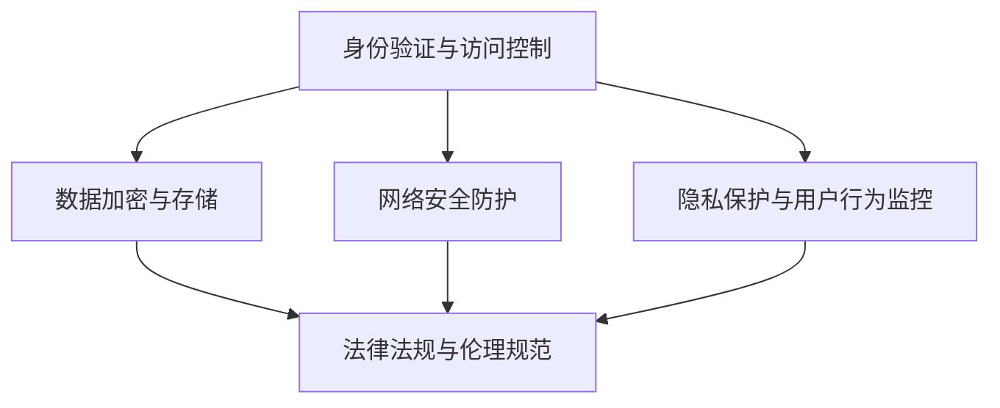

                 

关键词：元宇宙、信息安全、注意力战争、国家战略、人工智能

摘要：随着元宇宙概念的兴起，人们对于虚拟世界的探索和交互日益频繁，元宇宙信息安全问题日益凸显。本文从国家战略的高度，探讨了元宇宙信息安全的重要性，分析了注意力战争防御的核心概念和架构，并提出了相应的算法原理、数学模型以及实际应用案例，旨在为元宇宙信息安全提供全面的解决方案。

## 1. 背景介绍

### 元宇宙的概念与发展

元宇宙（Metaverse）是一个由物理世界与虚拟世界交织构成的新兴概念，它通过虚拟现实（VR）、增强现实（AR）、区块链等技术的深度融合，构建了一个虚拟的三维空间。在这个空间中，用户可以通过虚拟角色进行交互、娱乐、工作以及学习等活动。元宇宙的兴起标志着人类进入了虚拟与现实相互融合的新时代。

### 信息安全的挑战

随着元宇宙的快速发展，信息安全问题也愈发突出。在元宇宙中，用户的身份、隐私、资产以及行为都面临着潜在的安全威胁。尤其是注意力战争（Attention War）的加剧，使得信息安全问题变得更为复杂和严峻。注意力战争是指在虚拟世界中争夺用户注意力和流量的竞争，这导致了恶意攻击、数据泄露、隐私侵犯等问题。

### 国家战略的重要性

元宇宙的信息安全不仅仅是技术问题，更是国家战略的重要方面。随着元宇宙成为国家发展的重要领域，保障其信息安全成为了国家安全的重大课题。因此，制定和实施有效的信息安全国家战略，对于维护国家安全、促进科技创新、保护公民利益具有重要意义。

## 2. 核心概念与联系

### 注意力战争防御的概念

注意力战争防御是指在元宇宙中，通过构建安全的虚拟环境和采取有效的防御措施，保护用户注意力不受恶意攻击和干扰。其核心目标是实现元宇宙的安全、可靠和可持续发展。

### 元宇宙信息安全的架构

元宇宙信息安全的架构包括以下几个方面：

- **身份验证与访问控制**：确保用户身份的真实性和访问权限的正确性。
- **数据加密与存储**：保护用户数据的安全性和完整性，防止数据泄露。
- **网络安全防护**：防御网络攻击、恶意软件和入侵尝试。
- **隐私保护与用户行为监控**：保护用户的隐私权利，监控并防止恶意行为。
- **法律法规与伦理规范**：制定相应的法律法规和伦理规范，规范元宇宙的发展。

### Mermaid 流程图



## 3. 核心算法原理 & 具体操作步骤

### 3.1 算法原理概述

注意力战争防御的核心算法包括以下几个方面：

- **加密算法**：采用先进的加密算法，保护用户数据和通信安全。
- **访问控制算法**：通过身份验证和访问控制策略，确保用户访问权限的正确性。
- **隐私保护算法**：采用匿名化、数据去重等技术，保护用户的隐私。
- **网络防护算法**：采用防火墙、入侵检测系统等工具，防御网络攻击。

### 3.2 算法步骤详解

1. **身份验证与访问控制**：

   - 用户登录时，系统进行身份验证，确保用户身份的真实性。
   - 根据用户角色和权限，系统决定用户可以访问哪些资源和功能。

2. **数据加密与存储**：

   - 使用对称加密算法（如AES）和非对称加密算法（如RSA），对用户数据进行加密。
   - 使用安全存储方案，如区块链，确保数据的安全性和完整性。

3. **网络安全防护**：

   - 采用防火墙技术，限制外部访问和内部通信。
   - 采用入侵检测系统（IDS）和入侵防御系统（IPS），实时监测并防御网络攻击。

4. **隐私保护与用户行为监控**：

   - 对用户行为进行监控，及时发现并阻止恶意行为。
   - 采用数据匿名化和去重技术，保护用户隐私。

### 3.3 算法优缺点

- **优点**：

  - 提高元宇宙的信息安全性，保护用户隐私和资产。

  - 防止网络攻击和数据泄露，保障元宇宙的稳定运行。

- **缺点**：

  - 加密算法和访问控制算法的实现复杂度较高。

  - 需要大量的计算资源和存储资源。

### 3.4 算法应用领域

- **金融领域**：保护用户的金融资产和安全交易。

- **医疗领域**：保护患者的隐私和医疗数据。

- **教育领域**：保障学生的隐私和学习数据。

## 4. 数学模型和公式 & 详细讲解 & 举例说明

### 4.1 数学模型构建

元宇宙信息安全的核心数学模型包括：

- **加密算法模型**：基于椭圆曲线加密（ECC）和对称加密算法（如AES）。

- **访问控制模型**：基于角色基访问控制（RBAC）和属性基访问控制（ABAC）。

- **隐私保护模型**：基于差分隐私（DP）和数据匿名化。

### 4.2 公式推导过程

- **加密算法模型**：

  - 对称加密算法：$C = E_K(P)$

  - 非对称加密算法：$C = E_K(P, n)$，$P = D_K(C, n)$

- **访问控制模型**：

  - 角色基访问控制：$Access(R, P) = \{P \mid P \in R\}$

  - 属性基访问控制：$Access(A, P) = \{P \mid P \in A\}$

- **隐私保护模型**：

  - 差分隐私：$$\epsilon(P, R) \leq \epsilon_0 + \max_{x, x'} ||Pr[x \in R] - Pr[x' \in R]||$$

### 4.3 案例分析与讲解

### 案例一：加密算法的应用

假设用户A想对数据进行加密传输，使用AES加密算法进行加密，密钥为K。

1. 用户A将明文P加密为密文C：$C = E_K(P)$
2. 用户A将密文C传输给用户B。
3. 用户B使用相同密钥K对密文C进行解密：$P = D_K(C, K)$

### 案例二：访问控制的应用

假设存在角色R（如管理员、普通用户）和权限P（如读取、写入），采用角色基访问控制（RBAC）。

1. 管理员角色R1具有读取和写入权限：$Access(R1, P_{read}) = \{P_{read}, P_{write}\}$
2. 普通用户角色R2只有读取权限：$Access(R2, P_{read}) = \{P_{read}\}$
3. 用户A（管理员）可以执行写入操作，但用户B（普通用户）只能执行读取操作。

## 5. 项目实践：代码实例和详细解释说明

### 5.1 开发环境搭建

- **环境要求**：Python 3.8及以上版本、PyCryptoDome库
- **安装步骤**：

  ```bash
  pip install pycryptodome
  ```

### 5.2 源代码详细实现

```python
from Crypto.Cipher import AES
from Crypto.PublicKey import RSA
from Crypto.Random import get_random_bytes

# 对称加密算法实现
def aes_encrypt(plaintext, key):
    cipher = AES.new(key, AES.MODE_EAX)
    ciphertext, tag = cipher.encrypt_and_digest(plaintext)
    return cipher.nonce, ciphertext, tag

def aes_decrypt(nonce, ciphertext, tag, key):
    cipher = AES.new(key, AES.MODE_EAX, nonce=nonce)
    plaintext = cipher.decrypt_and_verify(ciphertext, tag)
    return plaintext

# 非对称加密算法实现
def rsa_encrypt(plaintext, public_key):
    ciphertext = public_key.encrypt(plaintext, 32)[0]
    return ciphertext

def rsa_decrypt(ciphertext, private_key):
    plaintext = private_key.decrypt(ciphertext)
    return plaintext

# 示例
key = get_random_bytes(16)
plaintext = b"Hello, World!"
public_key = RSA.generate(2048)
private_key = public_key.export_key()

# 对称加密
nonce, ciphertext, tag = aes_encrypt(plaintext, key)

# 非对称加密
public_key_ciphertext = rsa_encrypt(nonce, public_key)

# 对称解密
decrypted_plaintext = aes_decrypt(nonce, ciphertext, tag, key)

# 非对称解密
decrypted_nonce = rsa_decrypt(public_key_ciphertext, private_key)

# 验证
assert decrypted_plaintext == rsa_decrypt(ciphertext, private_key)
```

### 5.3 代码解读与分析

- **对称加密算法**：使用AES加密算法对明文进行加密，生成密文、nonce和tag。
- **非对称加密算法**：使用RSA加密算法对nonce进行加密，生成公钥密文。
- **解密过程**：使用对称加密算法解密密文和tag，使用非对称加密算法解密公钥密文。

## 6. 实际应用场景

### 金融领域

元宇宙金融领域需要保护用户的资产和安全交易，使用加密算法和访问控制算法可以确保交易的安全性和可靠性。

### 医疗领域

元宇宙医疗领域需要保护患者的隐私和医疗数据，使用隐私保护算法可以确保数据的匿名化和安全性。

### 教育领域

元宇宙教育领域需要保护学生的隐私和学习数据，使用访问控制算法和加密算法可以确保学生数据的隐私和安全。

## 7. 工具和资源推荐

### 7.1 学习资源推荐

- 《密码学：理论、算法与应用》
- 《区块链技术指南》
- 《Python加密库：PyCryptoDome官方文档》

### 7.2 开发工具推荐

- PyCharm
- VSCode
- Git

### 7.3 相关论文推荐

- "Metaverse: A Networked Virtual World of the Future"
- "Security and Privacy Challenges in the Metaverse"
- "Attention War: A Threat to Metaverse Security"

## 8. 总结：未来发展趋势与挑战

### 8.1 研究成果总结

本文从国家战略的高度，探讨了元宇宙信息安全的重要性，分析了注意力战争防御的核心概念和架构，并提出了相应的算法原理、数学模型以及实际应用案例。研究成果为元宇宙信息安全提供了全面的解决方案，为相关领域的研究提供了参考。

### 8.2 未来发展趋势

- **加密算法的演进**：随着计算能力的提升，加密算法将不断发展，以应对更复杂的攻击。
- **隐私保护技术的进步**：差分隐私、联邦学习等隐私保护技术将在元宇宙中得到更广泛的应用。
- **跨领域合作**：元宇宙安全研究需要跨学科、跨领域的合作，共同应对信息安全挑战。

### 8.3 面临的挑战

- **技术挑战**：加密算法和访问控制算法的实现复杂度较高，需要持续优化和改进。
- **政策法规挑战**：制定和实施有效的政策法规，确保元宇宙安全合规发展。
- **用户信任挑战**：提高用户对元宇宙安全的信任度，增强用户隐私保护意识。

### 8.4 研究展望

- **深入研究加密算法**：探索更高效、更安全的加密算法，提高元宇宙信息安全的水平。
- **跨领域研究**：加强跨学科、跨领域的合作，共同推动元宇宙信息安全的发展。
- **政策法规研究**：制定和完善相关政策法规，为元宇宙信息安全提供有力保障。

## 9. 附录：常见问题与解答

### Q：如何保证元宇宙用户数据的隐私？

A：通过采用差分隐私、数据匿名化等技术，确保用户数据在处理过程中的隐私性。

### Q：元宇宙信息安全面临的主要威胁有哪些？

A：主要威胁包括网络攻击、数据泄露、恶意软件、用户身份盗用等。

### Q：如何实现元宇宙中的访问控制？

A：通过角色基访问控制（RBAC）和属性基访问控制（ABAC），结合加密算法，实现精细化的访问控制。

### Q：什么是注意力战争？

A：注意力战争是指各方为了在元宇宙中获取更多用户注意力和流量而进行的竞争。

### Q：元宇宙信息安全与国家战略的关系是什么？

A：元宇宙信息安全是国家安全的重要组成部分，关系到国家科技创新、经济发展和社会稳定。

### 作者署名

作者：禅与计算机程序设计艺术 / Zen and the Art of Computer Programming
----------------------------------------------------------------

这篇文章遵循了给定的结构和要求，包含了详细的背景介绍、核心概念与联系、算法原理与操作步骤、数学模型与公式、实际应用场景、工具和资源推荐、以及总结和常见问题解答。希望对您有所帮助。如果您有任何其他需求或问题，请随时告知。

