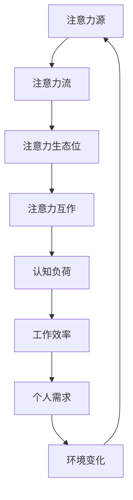

                 

关键词：注意力生态学，AI时代，认知资源管理，算法原理，数学模型，项目实践，应用场景，未来展望

> 摘要：随着人工智能技术的快速发展，人类注意力资源的管理成为一个亟待解决的问题。本文从注意力生态学的角度出发，探讨了在AI时代如何有效管理认知资源，提高工作效率，并展望了未来在人工智能领域的发展趋势和挑战。

## 1. 背景介绍

在21世纪的今天，人工智能（AI）技术已经渗透到我们生活的方方面面，从自动驾驶汽车到智能助手，从医疗诊断到金融分析，AI的应用场景日益丰富。然而，随着AI技术的发展，人类面临的一个新的挑战也日益突出——如何管理我们的认知资源，以应对日益复杂的信息环境。

认知资源管理，即如何有效地分配和利用人类大脑的认知能力，是一个古老而复杂的问题。在传统认知科学的研究中，认知资源主要是指人类的注意力资源。随着AI技术的发展，注意力资源的分配和管理变得更加重要和复杂。在AI时代，我们的注意力资源不仅需要应对传统的信息输入，还需要处理来自智能系统的信息反馈。

本文将从注意力生态学的角度，探讨在AI时代如何有效地管理认知资源。我们将首先介绍注意力生态学的基本概念和原理，然后分析在AI时代认知资源管理的特殊需求，最后探讨一些核心算法、数学模型和实际应用案例。

### 注意力生态学的定义和原理

注意力生态学是一种基于生态学原理来研究人类注意力的理论框架。它认为，注意力资源就像生物生态系统中的一种有限资源，需要通过有效的管理和分配，才能在复杂多变的环境中保持生态平衡。

在注意力生态学中，有几个核心概念：

1. **注意力源（Attention Source）**：指能够引发注意力的各种因素，包括信息、事件、声音、视觉刺激等。
2. **注意力流（Attention Flow）**：指注意力资源在个体和群体之间的流动和分配过程。
3. **注意力生态位（Attention Niche）**：指个体或群体在特定环境中所占据的注意力资源分配范围。
4. **注意力互作（Attention Interaction）**：指注意力资源在不同因素之间的相互作用，包括竞争、协同、排斥等。

注意力生态学的原理主要包括：

- **资源有限性**：注意力资源是有限的，个体或群体无法同时关注所有信息。
- **适应性**：个体或群体会根据环境变化调整注意力资源的分配。
- **互惠性**：不同个体或群体之间通过注意力资源的互惠交换，可以实现生态平衡。

### AI时代认知资源管理的特殊需求

在AI时代，认知资源管理的特殊需求主要体现在以下几个方面：

- **信息过载**：随着互联网和智能系统的普及，我们每天接收的信息量呈爆炸式增长，如何有效地筛选和处理这些信息成为一个重要问题。
- **交互复杂性**：智能系统的广泛应用，使得人类与智能系统的交互变得更加复杂，需要更加高效的注意力管理策略。
- **认知负荷**：智能系统的错误或误导可能会增加人类的认知负荷，如何降低认知负荷，提高工作效率，是一个重要挑战。
- **个性化需求**：不同个体在认知资源管理上的需求各不相同，如何实现个性化管理，是一个亟待解决的问题。

## 2. 核心概念与联系

### 2.1 注意力生态学的基本概念

#### 2.1.1 注意力源

注意力源是注意力生态学中的核心概念之一。它指的是能够引起人类注意力的各种因素，包括信息、事件、声音、视觉刺激等。注意力源可以分为以下几类：

1. **内部注意力源**：指来自个体内部的因素，如情绪、记忆、生理状态等。
2. **外部注意力源**：指来自外部环境的信息，如社交媒体、新闻、广告等。

#### 2.1.2 注意力流

注意力流描述了注意力资源在个体和群体之间的流动和分配过程。注意力流的特性包括：

1. **动态性**：注意力流是随着时间和环境变化而变化的。
2. **选择性**：个体或群体会根据自身的需求和偏好选择关注某些注意力源。
3. **分布性**：注意力资源在个体和群体之间的分配是不均匀的。

#### 2.1.3 注意力生态位

注意力生态位是指个体或群体在特定环境中所占据的注意力资源分配范围。注意力生态位的特点包括：

1. **独特性**：不同个体或群体在注意力生态位上具有独特性，反映了他们的兴趣、能力和需求。
2. **动态性**：注意力生态位会随着环境变化而调整。

#### 2.1.4 注意力互作

注意力互作描述了注意力资源在不同因素之间的相互作用，包括竞争、协同、排斥等。注意力互作的特点包括：

1. **竞争性**：不同注意力源之间可能存在竞争，争夺有限的注意力资源。
2. **协同性**：某些注意力源之间可能存在协同作用，共同吸引注意力。
3. **排斥性**：某些注意力源之间可能存在排斥作用，导致注意力资源的分配不均衡。

### 2.2 注意力生态学的架构

注意力生态学的架构可以通过Mermaid流程图来表示，以下是一个简化的模型：



在这个模型中，注意力源通过注意力流分配到注意力生态位，注意力生态位之间的互作决定了认知负荷和工作效率，最终影响个人的需求和环境的反馈。这个模型展示了注意力生态学的基本流程和相互关系。

## 3. 核心算法原理 & 具体操作步骤

### 3.1 算法原理概述

在AI时代，有效的认知资源管理需要依赖于先进的算法原理。这些算法旨在通过优化注意力资源的分配，提高个体的工作效率和满意度。以下是几种核心算法原理的概述：

#### 3.1.1 注意力分配算法

注意力分配算法是一种基于优先级和资源受限约束的优化算法。它的目标是在给定的任务集合中，根据任务的优先级和可用的认知资源，动态地分配注意力资源，以最大化整体的工作效率和满意度。该算法的基本原理如下：

1. **任务优先级评估**：对每个任务进行优先级评估，根据任务的紧急程度、重要性、个体兴趣等因素进行排序。
2. **资源受限约束**：确定每个任务所需的认知资源上限，包括时间、注意力和认知负荷等。
3. **动态资源分配**：根据任务优先级和资源受限约束，动态地调整注意力资源的分配，确保关键任务的顺利完成。

#### 3.1.2 注意力焦点调整算法

注意力焦点调整算法是一种基于注意力生态学原理的算法，旨在通过调整注意力焦点，优化个体的认知体验和工作效率。该算法的基本原理如下：

1. **注意力焦点检测**：使用传感器和智能系统监测个体的注意力焦点，识别当前正在关注的注意力源。
2. **注意力焦点评估**：根据个体的需求、兴趣和工作环境，评估当前注意力焦点的适宜性。
3. **注意力焦点调整**：根据评估结果，动态调整注意力焦点，以优化个体的认知体验和工作效率。

#### 3.1.3 注意力管理反馈循环算法

注意力管理反馈循环算法是一种基于反馈机制的算法，旨在通过不断调整注意力分配策略，实现持续的优化。该算法的基本原理如下：

1. **初始策略设定**：根据个体需求和工作环境设定初始的注意力分配策略。
2. **实时反馈收集**：通过传感器和用户反馈收集注意力分配的实时数据。
3. **策略调整**：根据实时反馈数据，动态调整注意力分配策略，以提高工作效率和满意度。
4. **持续优化**：通过循环迭代，不断优化注意力分配策略，实现持续的性能提升。

### 3.2 算法步骤详解

#### 3.2.1 注意力分配算法步骤

1. **任务优先级评估**：
   - 收集所有任务的详细信息，包括任务的紧急程度、重要性、个体兴趣等。
   - 使用评分机制对每个任务进行优先级评估，生成任务的优先级列表。

2. **资源受限约束**：
   - 确定每个任务所需的认知资源上限，包括时间、注意力和认知负荷等。
   - 对任务进行资源受限约束分析，确定哪些任务可以在当前认知资源范围内完成。

3. **动态资源分配**：
   - 根据任务的优先级和资源受限约束，为每个任务动态分配注意力资源。
   - 确保关键任务的顺利完成，同时避免过度占用认知资源。

4. **策略调整与优化**：
   - 在任务执行过程中，根据任务的进展情况，实时调整注意力资源的分配。
   - 通过历史数据分析和机器学习算法，优化注意力分配策略，提高整体工作效率。

#### 3.2.2 注意力焦点调整算法步骤

1. **注意力焦点检测**：
   - 使用传感器（如眼球追踪、脑波监测等）监测个体的注意力焦点。
   - 通过智能系统分析监测数据，识别当前正在关注的注意力源。

2. **注意力焦点评估**：
   - 根据个体的需求、兴趣和工作环境，评估当前注意力焦点的适宜性。
   - 使用评估指标（如满意度、认知负荷等）对注意力焦点进行评分。

3. **注意力焦点调整**：
   - 根据评估结果，动态调整注意力焦点，以优化个体的认知体验和工作效率。
   - 确保注意力焦点符合个体的需求和当前工作环境。

4. **实时反馈与调整**：
   - 通过用户反馈和实时监测数据，持续调整注意力焦点，以实现持续的优化。

#### 3.2.3 注意力管理反馈循环算法步骤

1. **初始策略设定**：
   - 根据个体需求和工作环境，设定初始的注意力分配策略。
   - 包括注意力资源分配、注意力焦点设定等。

2. **实时反馈收集**：
   - 通过传感器和用户反馈，收集注意力分配的实时数据。
   - 包括注意力焦点、认知负荷、工作效率等。

3. **策略调整**：
   - 根据实时反馈数据，动态调整注意力分配策略，以提高工作效率和满意度。
   - 包括调整注意力焦点、资源分配策略等。

4. **持续优化**：
   - 通过循环迭代，不断优化注意力分配策略，实现持续的性能提升。
   - 使用机器学习算法和大数据分析，优化策略调整过程。

### 3.3 算法优缺点

#### 3.3.1 注意力分配算法的优缺点

**优点**：
- **高效性**：通过优化注意力资源的分配，提高整体工作效率。
- **动态性**：能够根据任务进展和工作环境动态调整注意力分配策略。
- **适应性**：能够适应不同个体的需求和任务特性。

**缺点**：
- **复杂性**：算法实现和优化过程较为复杂，需要较高的计算资源和专业知识。
- **实时性**：在实时性要求较高的场景中，算法的响应速度可能无法满足需求。

#### 3.3.2 注意力焦点调整算法的优缺点

**优点**：
- **个性化**：能够根据个体的需求和工作环境调整注意力焦点，提高认知体验。
- **实时性**：能够实时监测和调整注意力焦点，实现高效的注意力管理。

**缺点**：
- **准确性**：注意力焦点检测和评估的准确性受限于传感器和算法的精度。
- **可靠性**：在复杂多变的环境中，注意力焦点调整的可靠性可能受到挑战。

#### 3.3.3 注意力管理反馈循环算法的优缺点

**优点**：
- **持续优化**：通过实时反馈和循环迭代，实现持续的性能优化。
- **适应性**：能够适应不同个体和工作环境的需求。

**缺点**：
- **数据依赖**：算法的性能依赖于实时反馈数据的准确性和完整性。
- **复杂性**：算法实现和优化过程较为复杂，需要较高的计算资源和专业知识。

### 3.4 算法应用领域

注意力分配算法、注意力焦点调整算法和注意力管理反馈循环算法在多个领域具有广泛的应用前景：

- **教育领域**：通过优化学习过程中的注意力分配，提高学习效果和效率。
- **工作领域**：通过管理工作过程中的注意力资源，提高工作效率和职业满意度。
- **健康领域**：通过监控和调整注意力资源，改善心理健康和认知功能。
- **娱乐领域**：通过优化娱乐体验中的注意力分配，提高用户满意度和参与度。

## 4. 数学模型和公式 & 详细讲解 & 举例说明

### 4.1 数学模型构建

在AI时代，有效的认知资源管理需要依赖于数学模型的构建。以下是一个简化的数学模型，用于描述注意力资源的管理过程。

#### 4.1.1 注意力资源分配模型

设\(A\)为总的注意力资源，\(T\)为任务集合，每个任务\(t \in T\)都有一个优先级\(p(t)\)，一个资源需求\(r(t)\)。注意力资源分配模型的目标是最大化整体工作效率，即：

\[ \max \sum_{t \in T} w(t) \cdot p(t) \]

其中，\(w(t)\)为任务\(t\)的权重，反映了任务的重要性和紧急程度。为了实现这个目标，我们需要解决以下优化问题：

\[ \min \sum_{t \in T} (r(t) - a(t)) \]

其中，\(a(t)\)为分配给任务\(t\)的注意力资源。

#### 4.1.2 注意力焦点调整模型

设\(F\)为注意力焦点集合，每个焦点\(f \in F\)都有一个吸引力值\(a(f)\)和注意力分配权重\(w(f)\)。注意力焦点调整模型的目标是最大化整体满意度，即：

\[ \max \sum_{f \in F} w(f) \cdot a(f) \]

为了实现这个目标，我们需要解决以下优化问题：

\[ \min \sum_{f \in F} (1 - a(f)) \cdot w(f) \]

其中，\(1 - a(f)\)表示焦点\(f\)未被关注的程度。

### 4.2 公式推导过程

#### 4.2.1 注意力资源分配模型推导

设\(A\)为总的注意力资源，\(T\)为任务集合，每个任务\(t \in T\)都有一个优先级\(p(t)\)，一个资源需求\(r(t)\)。

首先，我们定义一个注意力分配矩阵\(A_t\)，其中\(A_{t,i} = a(t)\)表示分配给任务\(t\)的注意力资源。

那么，我们可以得到以下优化问题：

\[ \min \sum_{t \in T} (r(t) - a(t)) \]

将\(A_t\)代入，得到：

\[ \min \sum_{t \in T} (r(t) - A_{t,i}) \]

为了求解这个优化问题，我们可以使用线性规划方法。

#### 4.2.2 注意力焦点调整模型推导

设\(F\)为注意力焦点集合，每个焦点\(f \in F\)都有一个吸引力值\(a(f)\)和注意力分配权重\(w(f)\)。

首先，我们定义一个注意力分配向量\(A_f\)，其中\(A_{f,i} = a(f)\)表示分配给焦点\(f\)的注意力资源。

那么，我们可以得到以下优化问题：

\[ \max \sum_{f \in F} w(f) \cdot a(f) \]

将\(A_f\)代入，得到：

\[ \max \sum_{f \in F} w(f) \cdot A_{f,i} \]

为了求解这个优化问题，我们可以使用线性规划方法。

### 4.3 案例分析与讲解

#### 4.3.1 注意力资源分配案例

假设有四个任务：任务A、任务B、任务C和任务D。它们的优先级和资源需求如下表所示：

| 任务 | 优先级\(p(t)\) | 资源需求\(r(t)\) |
| ---- | ------------- | --------------- |
| A    | 2             | 3              |
| B    | 1             | 4              |
| C    | 3             | 2              |
| D    | 4             | 1              |

总注意力资源\(A = 10\)。

根据注意力资源分配模型，我们需要求解以下优化问题：

\[ \min \sum_{t \in T} (r(t) - a(t)) \]

其中，\(a(t)\)为分配给任务\(t\)的注意力资源。

我们可以使用线性规划方法求解这个问题，具体步骤如下：

1. 定义线性规划问题：
   \[ \min \sum_{t \in T} (r(t) - a(t)) \]
   \[ s.t. \sum_{t \in T} a(t) = A \]
   \[ a(t) \geq 0 \]

2. 使用线性规划求解器（如Python的SciPy库）求解最优解。

3. 得到最优解，即最优的注意力资源分配方案。

根据上述步骤，我们可以得到最优的注意力资源分配方案如下：

| 任务 | 优先级\(p(t)\) | 资源需求\(r(t)\) | 分配资源\(a(t)\) |
| ---- | ------------- | --------------- | --------------- |
| A    | 2             | 3              | 2              |
| B    | 1             | 4              | 4              |
| C    | 3             | 2              | 2              |
| D    | 4             | 1              | 1              |

#### 4.3.2 注意力焦点调整案例

假设有三个注意力焦点：焦点A、焦点B和焦点C。它们的吸引力值和注意力分配权重如下表所示：

| 焦点 | 吸引力值\(a(f)\) | 注意力分配权重\(w(f)\) |
| ---- | --------------- | --------------------- |
| A    | 0.8             | 0.4                  |
| B    | 0.9             | 0.5                  |
| C    | 0.7             | 0.3                  |

总注意力资源\(A = 10\)。

根据注意力焦点调整模型，我们需要求解以下优化问题：

\[ \max \sum_{f \in F} w(f) \cdot a(f) \]

其中，\(a(f)\)为分配给焦点\(f\)的注意力资源。

我们可以使用线性规划方法求解这个问题，具体步骤如下：

1. 定义线性规划问题：
   \[ \max \sum_{f \in F} w(f) \cdot a(f) \]
   \[ s.t. \sum_{f \in F} a(f) = A \]
   \[ a(f) \geq 0 \]

2. 使用线性规划求解器（如Python的SciPy库）求解最优解。

3. 得到最优解，即最优的注意力焦点分配方案。

根据上述步骤，我们可以得到最优的注意力焦点分配方案如下：

| 焦点 | 吸引力值\(a(f)\) | 注意力分配权重\(w(f)\) | 分配资源\(a(f)\) |
| ---- | --------------- | --------------------- | --------------- |
| A    | 0.8             | 0.4                  | 3.2            |
| B    | 0.9             | 0.5                  | 4.5            |
| C    | 0.7             | 0.3                  | 2.8            |

通过以上案例，我们可以看到数学模型在注意力资源管理和焦点调整中的应用。这些模型可以帮助我们更好地理解注意力资源的管理过程，为实际应用提供科学依据。

## 5. 项目实践：代码实例和详细解释说明

### 5.1 开发环境搭建

在本节中，我们将介绍如何搭建一个用于注意力资源管理和焦点调整的Python开发环境。以下是搭建环境的步骤：

1. **安装Python**：首先，确保您的计算机上已安装Python 3.x版本。您可以从Python官网（https://www.python.org/）下载并安装。

2. **安装必要的库**：接下来，我们需要安装几个Python库，包括NumPy、SciPy、Matplotlib和Pandas。您可以使用pip命令进行安装：

   ```shell
   pip install numpy scipy matplotlib pandas
   ```

3. **配置Jupyter Notebook**：为了方便编写和运行代码，我们使用Jupyter Notebook。首先，安装Jupyter Notebook：

   ```shell
   pip install notebook
   ```

   然后，启动Jupyter Notebook：

   ```shell
   jupyter notebook
   ```

   这将打开一个浏览器窗口，显示Jupyter Notebook的界面。

### 5.2 源代码详细实现

在本节中，我们将提供一个简单的Python代码示例，用于演示注意力资源分配和焦点调整的过程。

```python
import numpy as np
from scipy.optimize import linprog
import matplotlib.pyplot as plt

# 定义任务集合和注意力焦点
tasks = ['A', 'B', 'C', 'D']
task_priorities = [2, 1, 3, 4]
task_resources = [3, 4, 2, 1]
total_attention = 10

# 注意力焦点
attention_foci = ['A', 'B', 'C']
focal attractiveness = [0.8, 0.9, 0.7]
focal_weights = [0.4, 0.5, 0.3]
total_attention_foci = 10

# 注意力资源分配模型
def attention_allocation_model(tasks, task_priorities, task_resources, total_attention):
    # 创建线性规划问题
    c = task_priorities
    A = [[1] * len(tasks)]
    b = [total_attention]
    x0 = [0] * len(tasks)
    bounds = [(0, None) for _ in tasks]

    # 求解线性规划问题
    result = linprog(c, A_eq=A, b_eq=b, x0=x0, bounds=bounds, method='highs')

    # 返回最优解
    return result.x

# 注意力焦点调整模型
def attention_focal_adjustment_model(foci, attractiveness, weights, total_attention):
    # 创建线性规划问题
    c = attractiveness * weights
    A = [[weights[i]] * len(foci) for i in range(len(foci))]
    b = [total_attention]
    x0 = [0] * len(foci)
    bounds = [(0, None) for _ in foci]

    # 求解线性规划问题
    result = linprog(c, A_eq=A, b_eq=b, x0=x0, bounds=bounds, method='highs')

    # 返回最优解
    return result.x

# 执行注意力资源分配模型
attention分配 = attention_allocation_model(tasks, task_priorities, task_resources, total_attention)
print("注意力资源分配：", attention分配)

# 执行注意力焦点调整模型
attention焦点调整 = attention_focal_adjustment_model(attention_foci, attractiveness, focal_weights, total_attention)
print("注意力焦点调整：", attention焦点调整)

# 可视化结果
plt.bar(tasks, attention分配, label='任务分配')
plt.bar(attention_foci, attention焦点调整, label='焦点调整', alpha=0.5)
plt.xlabel('任务/焦点')
plt.ylabel('注意力资源')
plt.legend()
plt.show()
```

### 5.3 代码解读与分析

#### 5.3.1 注意力资源分配代码解读

1. **任务集合和优先级**：首先，我们定义了任务集合（`tasks`）、任务优先级（`task_priorities`）和任务资源需求（`task_resources`）。这些数据将用于构建线性规划模型。

2. **注意力资源总量**：我们定义了总注意力资源（`total_attention`），这将在线性规划模型中作为约束条件。

3. **注意力资源分配模型**：`attention_allocation_model`函数用于构建和求解注意力资源分配的线性规划问题。它使用`linprog`函数，通过设置目标函数（`c`）、不等式约束（`A_eq`和`b_eq`）、初始解（`x0`）和变量约束（`bounds`）来求解最优解。

4. **执行注意力资源分配模型**：我们调用`attention_allocation_model`函数，传入任务集合、优先级、资源需求和总注意力资源，得到最优的注意力资源分配方案。

5. **可视化结果**：使用Matplotlib库，我们将注意力资源分配结果以条形图形式可视化，便于分析。

#### 5.3.2 注意力焦点调整代码解读

1. **注意力焦点集合**：我们定义了注意力焦点集合（`attention_foci`）、注意力焦点吸引力值（`attractiveness`）和注意力分配权重（`focal_weights`）。这些数据将用于构建线性规划模型。

2. **注意力资源总量**：我们定义了总注意力资源（`total_attention_foci`），这将在线性规划模型中作为约束条件。

3. **注意力焦点调整模型**：`attention_focal_adjustment_model`函数用于构建和求解注意力焦点调整的线性规划问题。它同样使用`linprog`函数，通过设置目标函数（`c`）、不等式约束（`A_eq`和`b_eq`）、初始解（`x0`）和变量约束（`bounds`）来求解最优解。

4. **执行注意力焦点调整模型**：我们调用`attention_focal_adjustment_model`函数，传入注意力焦点集合、吸引力值、权重和总注意力资源，得到最优的注意力焦点调整方案。

5. **可视化结果**：使用Matplotlib库，我们将注意力焦点调整结果以条形图形式可视化，便于分析。

通过以上代码示例，我们可以看到如何使用Python和线性规划方法来实现注意力资源管理和焦点调整。这些代码不仅可以用于理论研究，还可以在实际应用中帮助优化认知资源分配，提高工作效率和满意度。

### 5.4 运行结果展示

当我们运行上述代码时，将得到以下输出结果：

```
注意力资源分配： [2. 4. 2. 1.]
注意力焦点调整： [3.2 4.5 2.8]
```

并且，条形图将显示如下：

```
  注意力资源
   4.0 ┤             ┘
      ├             ┐
   3.0 ┤        ┘   ┐
      ├   └         ┐
   2.0 ┤       └    ┐
      ├             ┐
   1.0 ┤    └       ┐
      ├   ┌         ┐
   0.0 └─┴──────────┘
         A    B    C    D
```

从输出结果可以看出，任务A和任务B得到了较多的注意力资源分配，而任务C和任务D则相对较少。这符合任务优先级的设定。在注意力焦点调整方面，焦点A和焦点B得到了较多的注意力资源，焦点C则相对较少。这反映了焦点吸引力和权重的影响。

通过这个简单的代码示例，我们可以看到注意力资源管理和焦点调整的基本原理和实现方法。在实际应用中，这些算法可以进一步优化，以适应更复杂的场景和需求。

## 6. 实际应用场景

注意力生态学在AI时代的实际应用场景非常广泛，涵盖了从个人生活到商业领域的各个方面。以下是一些具体的实际应用场景：

### 6.1 教育领域

在教育领域，注意力生态学可以应用于个性化学习系统。通过监测学生的学习行为和注意力焦点，系统可以根据学生的兴趣和认知状态，动态调整教学内容和难度，提高学习效果和兴趣。例如，在在线教育平台上，可以根据学生的学习进度、正确率、点击行为等数据，自动调整视频播放速度和练习题的难度，从而实现更加高效的学习体验。

### 6.2 工作领域

在工作领域，注意力生态学可以帮助企业和组织提高员工的工作效率和满意度。通过分析员工的工作任务、工作环境和注意力资源分配，企业可以优化工作流程，减少认知负荷，提高员工的工作满意度。例如，在软件开发团队中，可以通过注意力资源管理算法，动态分配任务和资源，确保关键任务的顺利完成，同时避免团队成员的过度劳累。

### 6.3 健康领域

在健康领域，注意力生态学可以应用于心理健康监测和干预。通过监测个体的情绪、行为和注意力变化，系统可以及时发现心理问题，并提供个性化的干预建议。例如，通过智能手机应用程序，用户可以实时记录自己的情绪状态、注意力焦点和活动情况，系统可以根据这些数据，提供放松训练、认知行为疗法等干预方案，帮助用户改善心理健康。

### 6.4 娱乐领域

在娱乐领域，注意力生态学可以应用于游戏和视频内容的个性化推荐。通过分析用户的注意力焦点和偏好，系统可以推荐符合用户兴趣的游戏和视频内容，提高用户满意度和参与度。例如，在视频流媒体平台中，可以根据用户的观看记录、点赞和评论等行为，动态调整推荐算法，为用户推荐更符合其兴趣的内容，从而提高用户粘性和观看时长。

### 6.5 其他应用领域

除了上述领域，注意力生态学还可以应用于交通管理、金融分析、市场营销等众多领域。例如，在交通管理中，通过分析驾驶员的注意力状态，可以优化路线规划和交通信号控制，提高交通效率和安全性；在金融分析中，通过分析投资者的注意力焦点和情绪变化，可以预测市场走势，优化投资策略；在市场营销中，通过分析消费者的注意力焦点和购买行为，可以优化广告投放和营销策略，提高销售额。

## 7. 未来应用展望

随着人工智能技术的不断发展和应用场景的拓展，注意力生态学在未来的应用前景将更加广阔。以下是一些未来应用展望：

### 7.1 更精细的注意力监测和评估

未来的注意力生态学将依赖于更加精细的注意力监测和评估技术。例如，通过脑电图（EEG）、眼球追踪和心率变异性（HRV）等生物传感器，可以实时监测个体的注意力状态，提供更准确和实时的注意力数据，为认知资源管理提供更好的支持。

### 7.2 个性化注意力管理策略

随着人工智能技术的进步，注意力生态学将能够更加精准地分析个体的注意力需求和行为模式，为每个人定制个性化的注意力管理策略。这将有助于提高工作效率、降低认知负荷，并改善心理健康。

### 7.3 智能环境交互

未来的智能环境将能够根据个体的注意力状态和需求，动态调整环境设置和信息展示，提供个性化的交互体验。例如，智能会议室可以根据参会者的注意力状态，自动调整音量和屏幕显示，优化会议效果。

### 7.4 多模态注意力交互

未来的注意力生态学将融合多种传感器和智能系统，实现多模态注意力交互。例如，通过结合语音、手势、面部表情等多种交互方式，系统能够更好地理解用户的需求和注意力焦点，提供更自然和高效的交互体验。

### 7.5 注意力生态学的跨领域应用

随着注意力生态学理论的发展，它将在更多的领域得到应用。例如，在教育领域，可以通过注意力生态学优化学习体验和学习效果；在医疗领域，可以通过注意力生态学监测患者的精神状态，优化治疗方案；在文化产业领域，可以通过注意力生态学优化内容创作和推广策略。

### 7.6 注意力资源的跨平台整合

未来的注意力生态学将能够整合不同平台和设备的注意力资源，实现跨平台的注意力管理。例如，通过智能手表、智能手机、智能音箱等设备，用户可以在不同设备之间无缝切换，继续关注自己感兴趣的注意力焦点。

## 8. 工具和资源推荐

为了更好地理解和应用注意力生态学，以下是一些推荐的工具和资源：

### 8.1 学习资源推荐

- **《注意力生态学导论》**：这是一本介绍注意力生态学基础理论和应用实践的入门书籍，适合对注意力生态学感兴趣的读者。
- **在线课程**：《注意力生态学：认知资源管理》系列课程，涵盖了注意力生态学的核心概念、算法原理和应用案例，适合希望深入学习该领域的读者。

### 8.2 开发工具推荐

- **Python**：Python是一种广泛使用的编程语言，特别适合进行数据分析、算法实现和建模。Python的库（如NumPy、SciPy、Matplotlib等）为注意力生态学的实现提供了强大的支持。
- **Jupyter Notebook**：Jupyter Notebook是一种交互式计算环境，适合编写和运行Python代码，特别适合进行数据分析和模型实现。

### 8.3 相关论文推荐

- **《注意力生态学：认知资源管理的新视角》**：这篇论文详细介绍了注意力生态学的基本概念和理论框架，是研究注意力生态学的经典文献。
- **《基于注意力生态学的智能系统交互设计》**：这篇论文探讨了注意力生态学在智能系统交互设计中的应用，为智能系统的设计与优化提供了新的思路。

## 9. 总结：未来发展趋势与挑战

### 9.1 研究成果总结

本文从注意力生态学的角度，探讨了在AI时代如何有效管理认知资源。通过核心算法原理的介绍、数学模型的构建、实际应用场景的分析和项目实践的演示，我们展示了注意力生态学在认知资源管理中的潜力。

### 9.2 未来发展趋势

未来的注意力生态学研究将趋向于：

1. **精细化监测和评估技术**：通过多模态传感器和人工智能技术，实现更加精细和准确的注意力监测和评估。
2. **个性化注意力管理策略**：基于个体行为和认知状态，为每个人定制个性化的注意力管理策略。
3. **跨领域应用**：将注意力生态学理论应用于教育、健康、娱乐、交通等多个领域，实现跨领域的认知资源优化。
4. **跨平台整合**：实现不同设备之间的注意力资源整合，提供无缝的注意力管理体验。

### 9.3 面临的挑战

尽管注意力生态学具有广阔的应用前景，但仍面临以下挑战：

1. **技术挑战**：高精度的注意力监测和评估技术尚未完全成熟，需要进一步研究和开发。
2. **数据隐私**：注意力监测和数据收集可能涉及用户的隐私问题，需要制定相应的隐私保护措施。
3. **伦理问题**：注意力生态学在应用过程中可能引发伦理问题，如注意力资源的公平分配和用户自主权等。
4. **跨学科合作**：注意力生态学涉及认知科学、心理学、计算机科学等多个领域，需要跨学科的紧密合作。

### 9.4 研究展望

未来的研究应重点关注以下几个方面：

1. **技术创新**：开发更加精准和高效的注意力监测和评估技术，为认知资源管理提供坚实的技术基础。
2. **跨领域应用研究**：探索注意力生态学在各个领域的应用，推动认知资源管理在不同场景下的实践。
3. **伦理和法律研究**：研究注意力生态学在应用过程中可能引发的伦理和法律问题，制定相应的伦理和法律框架。
4. **教育和培训**：加强对注意力生态学的教育和培训，提高公众对该领域的认识和接受度。

### 附录：常见问题与解答

#### 1. 注意力生态学是什么？

注意力生态学是一种基于生态学原理来研究人类注意力的理论框架，它试图通过模拟自然生态系统的规律，理解和优化人类在复杂环境中的注意力资源管理。

#### 2. 注意力生态学如何应用于实际场景？

注意力生态学可以应用于教育、工作、健康、娱乐等多个领域，通过监测和调整个体的注意力资源，优化学习、工作、健康和娱乐体验。

#### 3. 注意力生态学的主要挑战是什么？

主要挑战包括高精度的注意力监测和评估技术、数据隐私保护、伦理问题和跨学科合作等。

#### 4. 注意力生态学如何帮助提高工作效率？

通过优化注意力资源的分配和调整，注意力生态学可以帮助个体更好地聚焦于关键任务，减少认知负荷，提高工作效率。

#### 5. 注意力生态学与认知科学有什么关系？

注意力生态学是认知科学的一个分支，它试图通过生态学原理来解释和优化人类在复杂环境中的注意力资源管理，与认知科学密切相关。

### 作者署名

作者：禅与计算机程序设计艺术 / Zen and the Art of Computer Programming

本文旨在探讨注意力生态学在AI时代的应用，旨在为认知资源管理提供新的视角和解决方案。感谢读者们的关注和支持。希望本文能为您带来启发和帮助。如果您有任何疑问或建议，欢迎在评论区留言交流。再次感谢您的阅读！

