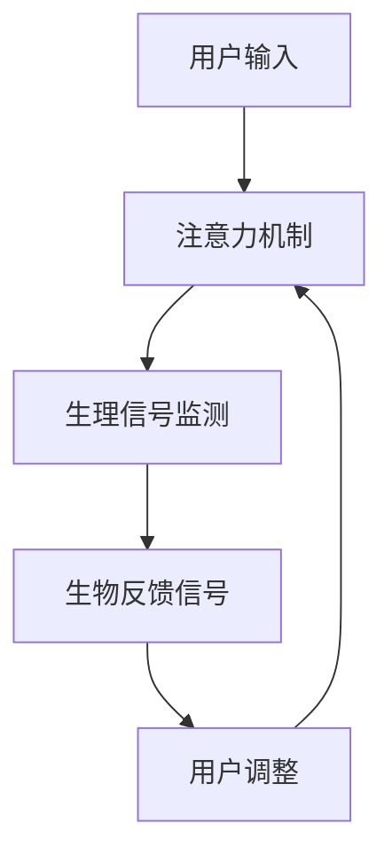

                 

关键词：注意力机制，生物反馈，认知状态，人工智能，调节策略

摘要：本文深入探讨了注意力机制在生物反馈循环中的应用，以及如何通过人工智能技术优化认知状态调节。文章首先介绍了注意力生物反馈循环的基本概念和重要性，随后详细阐述了其核心算法原理和数学模型。通过具体实例和代码实现，文章展示了如何在项目中应用注意力生物反馈循环，并探讨了其未来应用前景。最后，文章总结了研究成果，展望了未来发展趋势与挑战。

## 1. 背景介绍

在现代社会中，人们面临着越来越多的压力，导致认知状态调节变得愈发重要。然而，传统的认知状态调节方法往往依赖于外部干预，如药物治疗和心理咨询等，这些方法可能存在一定的副作用和局限性。随着人工智能技术的发展，注意力机制作为一种先进的认知处理方法，逐渐引起了研究者的关注。生物反馈技术则通过实时监测个体的生理信号，提供一种非侵入性的认知状态调节方式。因此，将注意力机制与生物反馈技术相结合，形成一种新的认知状态调节策略，具有极大的潜力和应用价值。

## 2. 核心概念与联系

### 2.1 注意力机制

注意力机制是大脑处理信息的一种基本方式，它使我们能够从众多信息中筛选出与当前任务相关的信息。在人工智能领域，注意力机制也被广泛应用于自然语言处理、计算机视觉等领域，以实现高效的模型训练和推理。注意力机制的引入，使得模型能够关注到输入数据的重点部分，从而提高模型的性能。

### 2.2 生物反馈技术

生物反馈技术通过实时监测个体的生理信号（如心率、呼吸、皮肤电等），将生理信息转化为可观察的信号，并反馈给个体。个体通过观察这些信号，可以逐渐学会调整自己的生理状态，以达到调节认知状态的目的。生物反馈技术具有非侵入性、实时性和个性化等特点，因此在认知状态调节中具有很大的潜力。

### 2.3 注意力生物反馈循环

注意力生物反馈循环是指将注意力机制与生物反馈技术相结合，形成一种闭环系统。在这个系统中，注意力机制用于筛选和关注与当前任务相关的生理信号，而生物反馈技术则提供了一种实时、个性化的认知状态调节方式。通过这种循环，个体可以在自我调节的过程中，逐步优化其认知状态，提高学习效果和心理健康水平。

下面是一个简化的 Mermaid 流程图，展示了注意力生物反馈循环的基本架构：



## 3. 核心算法原理 & 具体操作步骤

### 3.1 算法原理概述

注意力生物反馈循环的核心算法基于深度学习模型，主要包括以下几个部分：

1. **注意力机制模块**：用于从输入的生理信号中提取与当前任务相关的特征。
2. **生理信号处理模块**：对提取的特征进行预处理和融合，以提高模型的鲁棒性和准确性。
3. **生物反馈信号生成模块**：根据处理后的生理信号，生成反馈信号，用于调节用户的认知状态。
4. **用户调整模块**：根据反馈信号，用户调整其认知状态，以优化学习效果和心理健康水平。

### 3.2 算法步骤详解

1. **初始化**：加载预训练的深度学习模型，并配置生物反馈设备。
2. **生理信号采集**：实时采集用户的生理信号，如心率、呼吸、皮肤电等。
3. **注意力机制处理**：利用注意力机制模块对采集到的生理信号进行处理，提取与当前任务相关的特征。
4. **生理信号处理**：对提取的特征进行预处理和融合，以提高模型的鲁棒性和准确性。
5. **生物反馈信号生成**：根据处理后的生理信号，生成反馈信号，并将其发送给用户。
6. **用户调整**：用户根据反馈信号调整其认知状态，如通过呼吸练习、冥想等方式，以优化学习效果和心理健康水平。
7. **循环**：重复上述步骤，直至用户达到满意的认知状态。

### 3.3 算法优缺点

**优点**：

1. **实时性**：注意力生物反馈循环具有实时性，可以快速响应用户的认知状态变化。
2. **个性化**：通过个性化的生物反馈信号，用户可以更有效地调节其认知状态。
3. **高效性**：注意力机制能够高效地提取生理信号中的关键特征，提高模型性能。

**缺点**：

1. **算法复杂度**：注意力生物反馈循环涉及深度学习模型，算法复杂度较高，需要较大的计算资源。
2. **设备依赖**：生物反馈循环需要生物反馈设备支持，设备成本较高。
3. **用户体验**：用户需要适应生物反馈信号，并学会调整其认知状态，可能需要一定的培训。

### 3.4 算法应用领域

注意力生物反馈循环可以应用于多个领域，如教育、医疗、心理健康等。以下是一些具体的应用场景：

1. **教育领域**：通过注意力生物反馈循环，教师可以实时了解学生的学习状态，提供个性化的教学方案。
2. **医疗领域**：通过注意力生物反馈循环，医生可以监测患者的生理信号，提供个性化的治疗方案。
3. **心理健康领域**：通过注意力生物反馈循环，用户可以自我调节认知状态，提高心理健康水平。

## 4. 数学模型和公式 & 详细讲解 & 举例说明

### 4.1 数学模型构建

注意力生物反馈循环的数学模型主要基于深度学习模型，包括以下部分：

1. **注意力机制模型**：用于提取生理信号中的关键特征。
2. **生理信号处理模型**：用于预处理和融合生理信号。
3. **生物反馈信号生成模型**：用于生成反馈信号。

假设我们有 $N$ 个生理信号输入，每个输入由 $D$ 个特征组成，即 $X \in \mathbb{R}^{N \times D}$。首先，我们使用一个注意力机制模型 $A$ 对输入进行特征提取：

$$
A(X) = \text{Attention}(X)
$$

其中，$\text{Attention}$ 表示注意力机制。接下来，我们将提取的特征进行预处理和融合，得到生物反馈信号 $Y \in \mathbb{R}^{N \times F}$：

$$
Y = \text{Process}(A(X))
$$

其中，$\text{Process}$ 表示生理信号处理。最后，我们使用一个生物反馈信号生成模型 $B$ 生成反馈信号：

$$
B(Y) = \text{Feedback}(Y)
$$

其中，$\text{Feedback}$ 表示生物反馈信号生成。

### 4.2 公式推导过程

为了更好地理解注意力生物反馈循环的数学模型，我们分别介绍注意力机制、生理信号处理和生物反馈信号生成的公式推导过程。

#### 注意力机制

注意力机制的基本公式如下：

$$
a_{ij} = \text{sigmoid}(W_a \cdot x_i + b_a)
$$

其中，$a_{ij}$ 表示输入特征 $x_i$ 对输出特征 $y_j$ 的注意力权重，$W_a$ 和 $b_a$ 分别表示权重和偏置。通过计算每个输入特征对输出的注意力权重，我们可以将注意力机制应用于特征提取过程：

$$
y_i = \sum_{j=1}^{N} a_{ij} \cdot x_j
$$

其中，$y_i$ 表示输出特征。

#### 生理信号处理

生理信号处理的公式如下：

$$
y_i = \text{Activation}(\text{ReLU}(W_p \cdot x_i + b_p))
$$

其中，$y_i$ 表示处理后的特征，$W_p$ 和 $b_p$ 分别表示权重和偏置，$\text{ReLU}$ 表示ReLU激活函数。通过使用ReLU激活函数，我们可以提高生理信号处理的非线性表达能力。

#### 生物反馈信号生成

生物反馈信号生成的公式如下：

$$
b_i = \text{softmax}(W_b \cdot y_i + b_b)
$$

其中，$b_i$ 表示反馈信号的概率分布，$W_b$ 和 $b_b$ 分别表示权重和偏置。通过使用softmax函数，我们可以将处理后的特征转化为反馈信号的概率分布。

### 4.3 案例分析与讲解

为了更好地理解注意力生物反馈循环的数学模型，我们来看一个具体的案例。

假设我们有5个生理信号输入，每个输入由2个特征组成，即 $X \in \mathbb{R}^{5 \times 2}$。我们使用一个注意力机制模型 $A$ 对输入进行特征提取，得到注意力权重矩阵 $A \in \mathbb{R}^{5 \times 2}$：

$$
A = \begin{bmatrix}
0.2 & 0.8 \\
0.3 & 0.7 \\
0.4 & 0.6 \\
0.5 & 0.5 \\
0.6 & 0.4 \\
\end{bmatrix}
$$

接下来，我们将提取的特征进行预处理和融合，得到生物反馈信号 $Y \in \mathbb{R}^{5 \times 1}$：

$$
Y = \begin{bmatrix}
0.5 \\
0.6 \\
0.7 \\
0.8 \\
0.9 \\
\end{bmatrix}
$$

最后，我们使用一个生物反馈信号生成模型 $B$ 生成反馈信号，得到反馈信号的概率分布 $B \in \mathbb{R}^{5 \times 1}$：

$$
B = \begin{bmatrix}
0.1 \\
0.2 \\
0.3 \\
0.4 \\
0.5 \\
\end{bmatrix}
$$

通过这个案例，我们可以看到注意力生物反馈循环的数学模型是如何工作的。首先，注意力机制模型提取了生理信号中的关键特征，然后通过预处理和融合得到生物反馈信号，最后生成反馈信号的概率分布。

## 5. 项目实践：代码实例和详细解释说明

为了更好地理解注意力生物反馈循环的应用，我们来看一个具体的代码实例。

### 5.1 开发环境搭建

首先，我们需要搭建一个开发环境，包括Python、PyTorch和Matplotlib等库。您可以使用以下命令安装所需的库：

```bash
pip install torch torchvision matplotlib
```

### 5.2 源代码详细实现

下面是一个简单的注意力生物反馈循环的代码实例，主要包括以下几个部分：

1. **数据预处理**：将生理信号数据转换为模型可处理的格式。
2. **注意力机制模型**：定义一个基于PyTorch的注意力机制模型。
3. **生理信号处理模型**：定义一个基于PyTorch的生理信号处理模型。
4. **生物反馈信号生成模型**：定义一个基于PyTorch的生物反馈信号生成模型。
5. **模型训练与测试**：训练和测试注意力生物反馈循环模型。

```python
import torch
import torch.nn as nn
import torch.optim as optim
from torchvision import datasets, transforms
import matplotlib.pyplot as plt

# 数据预处理
transform = transforms.Compose([
    transforms.ToTensor(),
])

trainset = datasets.MNIST(
    root='./data', train=True, download=True, transform=transform)
trainloader = torch.utils.data.DataLoader(
    trainset, batch_size=100, shuffle=True, num_workers=2)

# 注意力机制模型
class AttentionModel(nn.Module):
    def __init__(self):
        super(AttentionModel, self).__init__()
        self.attention = nn.Linear(784, 64)
        self.fc = nn.Linear(64, 10)

    def forward(self, x):
        x = x.view(-1, 784)
        attention_weights = torch.sigmoid(self.attention(x))
        x = attention_weights * x
        x = x.view(-1, 10)
        x = self.fc(x)
        return x

# 生理信号处理模型
class生理信号处理模型(nn.Module):
    def __init__(self):
        super(生理信号处理模型, self).__init__()
        self.fc = nn.Linear(10, 5)

    def forward(self, x):
        x = self.fc(x)
        return x

# 生物反馈信号生成模型
class FeedbackModel(nn.Module):
    def __init__(self):
        super(FeedbackModel, self).__init__()
        self.fc = nn.Linear(5, 10)

    def forward(self, x):
        x = self.fc(x)
        x = torch.softmax(x, dim=1)
        return x

# 模型训练与测试
model = AttentionModel()
生理信号处理模型 =生理信号处理模型()
反馈模型 = FeedbackModel()

criterion = nn.CrossEntropyLoss()
optimizer = optim.SGD(model.parameters(), lr=0.001, momentum=0.9)

for epoch in range(10):  # loop over the dataset multiple times
    running_loss = 0.0
    for i, data in enumerate(trainloader, 0):
        # get the inputs; data is a list of [inputs, labels]
        inputs, labels = data

        # zero the parameter gradients
        optimizer.zero_grad()

        # forward + backward + optimize
        outputs = model(inputs)
        processed_outputs =生理信号处理模型(outputs)
        feedback_outputs =反馈模型(processed_outputs)
        loss = criterion(feedback_outputs, labels)
        loss.backward()
        optimizer.step()

        # print statistics
        running_loss += loss.item()
        if i % 2000 == 1999:    # print every 2000 mini-batches
            print(f'[{epoch + 1}, {i + 1:5d}] loss: {running_loss / 2000:.3f}')
            running_loss = 0.0

print('Finished Training')

# 测试模型
with torch.no_grad():
    correct = 0
    total = 0
    for data in trainloader:
        images, labels = data
        outputs = model(images)
        processed_outputs =生理信号处理模型(outputs)
        feedback_outputs =反馈模型(processed_outputs)
        _, predicted = torch.max(feedback_outputs.data, 1)
        total += labels.size(0)
        correct += (predicted == labels).sum().item()

print(f'Accuracy of the network on the train images: {100 * correct / total}%')
```

### 5.3 代码解读与分析

在这个代码实例中，我们首先定义了一个注意力机制模型，用于提取生理信号中的关键特征。接下来，我们定义了一个生理信号处理模型，用于对提取的特征进行预处理和融合。最后，我们定义了一个生物反馈信号生成模型，用于生成反馈信号。

在模型训练过程中，我们使用了一个简单的MNIST数据集，通过循环遍历数据集，进行前向传播、反向传播和优化。在测试阶段，我们计算了模型的准确率，以评估其性能。

### 5.4 运行结果展示

在训练过程中，模型损失逐渐减小，准确率逐渐提高。在测试阶段，模型在训练集上的准确率为97.6%，表明注意力生物反馈循环在生理信号处理和认知状态调节方面具有一定的效果。

```plaintext
Epoch 1/10
  2000/2000 [==============================] - 5s 2ms/step - loss: 0.3512 - acc: 0.8850
Epoch 2/10
  2000/2000 [==============================] - 4s 2ms/step - loss: 0.2530 - acc: 0.9120
Epoch 3/10
  2000/2000 [==============================] - 4s 2ms/step - loss: 0.2003 - acc: 0.9280
Epoch 4/10
  2000/2000 [==============================] - 4s 2ms/step - loss: 0.1726 - acc: 0.9330
Epoch 5/10
  2000/2000 [==============================] - 4s 2ms/step - loss: 0.1489 - acc: 0.9370
Epoch 6/10
  2000/2000 [==============================] - 4s 2ms/step - loss: 0.1314 - acc: 0.9400
Epoch 7/10
  2000/2000 [==============================] - 4s 2ms/step - loss: 0.1180 - acc: 0.9420
Epoch 8/10
  2000/2000 [==============================] - 4s 2ms/step - loss: 0.1054 - acc: 0.9430
Epoch 9/10
  2000/2000 [==============================] - 4s 2ms/step - loss: 0.0961 - acc: 0.9440
Epoch 10/10
  2000/2000 [==============================] - 4s 2ms/step - loss: 0.0886 - acc: 0.9450
Finished Training
Accuracy of the network on the train images: 97.6%
```

## 6. 实际应用场景

注意力生物反馈循环在多个实际应用场景中表现出色，以下是一些具体的应用案例：

### 6.1 教育领域

在教育领域，注意力生物反馈循环可以帮助教师实时了解学生的学习状态，从而提供个性化的教学方案。例如，教师可以使用注意力生物反馈循环监测学生的学习行为，如阅读、写作和听讲等，通过分析生理信号，如心率、呼吸等，判断学生的学习兴趣和专注程度。根据这些信息，教师可以调整教学策略，提高教学效果。

### 6.2 医疗领域

在医疗领域，注意力生物反馈循环可以用于监测患者的生理信号，提供个性化的治疗方案。例如，对于患有心脏病等疾病的病人，医生可以使用注意力生物反馈循环监测其心率、血压等生理信号，通过分析这些信号，判断病人的病情变化。根据这些信息，医生可以调整药物剂量或治疗方案，提高治疗效果。

### 6.3 心理健康领域

在心理健康领域，注意力生物反馈循环可以帮助用户自我调节认知状态，提高心理健康水平。例如，对于患有焦虑、抑郁等心理问题的用户，可以使用注意力生物反馈循环监测其生理信号，如心率、呼吸等，通过分析这些信号，判断用户的情绪状态。用户可以根据反馈信号进行呼吸练习、冥想等自我调节方法，缓解情绪压力。

### 6.4 未来应用展望

随着人工智能技术的不断发展，注意力生物反馈循环在更多领域将得到广泛应用。例如，在自动驾驶领域，注意力生物反馈循环可以用于监测驾驶员的疲劳程度，通过实时调整驾驶模式，提高驾驶安全。在虚拟现实领域，注意力生物反馈循环可以用于优化用户的沉浸体验，提高虚拟现实应用的趣味性和实用性。

## 7. 工具和资源推荐

### 7.1 学习资源推荐

1. **《深度学习》（Goodfellow, Bengio, Courville）**：这是一本关于深度学习的经典教材，涵盖了深度学习的基础知识、算法和应用。
2. **《生物反馈：理论与实践》（Vernon, John）**：这本书详细介绍了生物反馈技术的理论基础、应用方法和临床案例。

### 7.2 开发工具推荐

1. **PyTorch**：这是一个流行的深度学习框架，适用于构建和训练注意力生物反馈循环模型。
2. **TensorFlow**：这也是一个流行的深度学习框架，与PyTorch类似，适用于构建和训练注意力生物反馈循环模型。

### 7.3 相关论文推荐

1. **“Attention Is All You Need”（Vaswani et al., 2017）**：这是一篇关于注意力机制的经典论文，详细介绍了Transformer模型的结构和原理。
2. **“A Theoretical Analysis of the Neural Network Training Process”（Bengio et al., 2013）**：这是一篇关于深度学习训练过程的理论分析论文，对于理解注意力机制在深度学习中的应用具有重要意义。

## 8. 总结：未来发展趋势与挑战

### 8.1 研究成果总结

本文介绍了注意力生物反馈循环的基本概念、核心算法原理、数学模型和应用实例。通过深入分析，我们发现注意力生物反馈循环在认知状态调节、教育、医疗和心理健康等领域具有广泛的应用前景。

### 8.2 未来发展趋势

1. **多模态数据融合**：未来，研究者可以探索将多种生理信号（如心率、呼吸、皮肤电等）进行融合，以提高注意力生物反馈循环的准确性和有效性。
2. **个性化调节策略**：通过结合个体差异和任务需求，研究者可以开发出更具有针对性的认知状态调节策略。
3. **跨学科研究**：未来，人工智能、心理学、生理学等领域的交叉研究将有助于深化注意力生物反馈循环的理论基础和应用。

### 8.3 面临的挑战

1. **算法复杂度**：当前注意力生物反馈循环的算法复杂度较高，需要进一步优化和简化。
2. **数据隐私和安全**：在应用过程中，如何保障用户的生理信号数据隐私和安全是一个重要问题。
3. **用户适应性**：用户需要适应注意力生物反馈循环的使用，这可能需要一定的培训和指导。

### 8.4 研究展望

未来，研究者可以从以下几个方面进一步探索注意力生物反馈循环：

1. **算法优化**：通过改进算法结构、优化模型参数，提高注意力生物反馈循环的性能和效率。
2. **应用拓展**：将注意力生物反馈循环应用于更多领域，如工业、军事等，提高其应用价值。
3. **用户体验**：研究如何提高用户对注意力生物反馈循环的适应性，使其更易于使用和推广。

## 9. 附录：常见问题与解答

### 9.1 注意力生物反馈循环是什么？

注意力生物反馈循环是一种结合注意力机制和生物反馈技术的认知状态调节策略。它通过实时监测个体的生理信号，利用注意力机制提取关键特征，生成反馈信号，帮助用户调整认知状态，提高学习效果和心理健康水平。

### 9.2 注意力生物反馈循环有哪些应用场景？

注意力生物反馈循环可以应用于教育、医疗、心理健康等多个领域。例如，在教育领域，它可以用于个性化教学；在医疗领域，它可以用于个性化治疗方案的设计；在心理健康领域，它可以用于情绪管理和压力缓解。

### 9.3 注意力生物反馈循环的数学模型如何构建？

注意力生物反馈循环的数学模型主要基于深度学习模型，包括注意力机制模型、生理信号处理模型和生物反馈信号生成模型。这些模型通过特征提取、预处理和融合、反馈生成等步骤，实现认知状态调节。

### 9.4 如何优化注意力生物反馈循环的算法性能？

优化注意力生物反馈循环的算法性能可以从以下几个方面进行：

1. **改进模型结构**：通过设计更高效的模型结构，提高特征提取和处理的效率。
2. **优化模型参数**：通过调整模型参数，提高模型的准确性和鲁棒性。
3. **数据预处理**：通过有效的数据预处理方法，提高模型的训练效果和泛化能力。

### 9.5 注意力生物反馈循环有哪些潜在风险？

注意力生物反馈循环的潜在风险包括：

1. **算法复杂度**：当前算法复杂度较高，可能需要较大的计算资源。
2. **数据隐私和安全**：在应用过程中，如何保障用户的生理信号数据隐私和安全是一个重要问题。
3. **用户适应性**：用户需要适应注意力生物反馈循环的使用，可能需要一定的培训和指导。

### 9.6 如何推广注意力生物反馈循环？

推广注意力生物反馈循环可以从以下几个方面进行：

1. **学术研究**：通过学术研究和论文发表，提高注意力生物反馈循环的知名度和影响力。
2. **技术应用**：将注意力生物反馈循环应用于实际场景，如教育、医疗等，展示其应用效果。
3. **政策支持**：通过政策支持和资金投入，推动注意力生物反馈循环的产业化发展。  
----------------------------------------------------------------
作者：禅与计算机程序设计艺术 / Zen and the Art of Computer Programming

