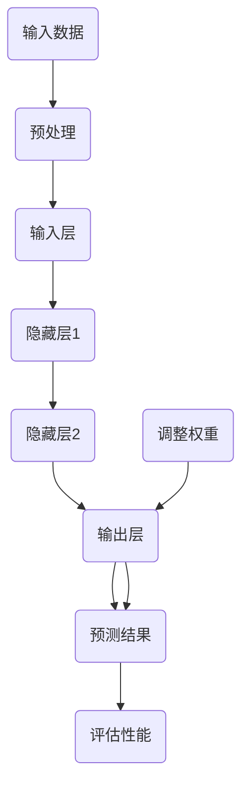

                 

关键词：人工智能、认知平衡、深度学习、广度学习、注意力机制、神经网络、数据挖掘、算法优化

## 摘要

本文旨在探讨在AI时代，如何实现认知的深度与广度平衡。随着深度学习和广度学习的崛起，人们对于注意力机制的依赖日益增强。本文将详细解析注意力机制的工作原理，探讨其在不同领域的应用，并探讨如何通过技术手段实现认知的深度与广度平衡，以应对AI时代的挑战。

## 1. 背景介绍

随着计算机技术的飞速发展，人工智能（AI）已经成为当今世界的重要驱动力。从早期的专家系统到今天的深度学习，AI技术已经取得了巨大的进步。然而，在AI的发展过程中，我们面临着一个重要的挑战：如何实现认知的深度与广度平衡。

深度学习（Deep Learning）是一种基于多层神经网络的机器学习技术，它可以自动从大量数据中提取特征，实现复杂的任务，如图像识别、语音识别等。深度学习的成功离不开注意力机制（Attention Mechanism）的支持。注意力机制可以使神经网络在处理复杂任务时，关注到最重要的部分，从而提高模型的性能。

广度学习（Broad Learning）则是一种旨在提高模型泛化能力的学习方法。它强调模型的多样性和灵活性，通过学习多个相关的任务，使模型能够更好地应对未知的问题。广度学习在一定程度上缓解了深度学习面临的过拟合问题。

然而，深度学习和广度学习各有其优缺点。深度学习在处理特定任务时具有强大的能力，但在面对新的、未知的问题时，其表现可能不如广度学习。广度学习具有更好的泛化能力，但在处理具体任务时可能不如深度学习高效。

本文将首先介绍注意力机制的工作原理，然后探讨深度学习和广度学习的优缺点，最后提出一种实现认知深度与广度平衡的方法。

## 2. 核心概念与联系

为了更好地理解注意力机制，我们先来介绍一些核心概念。

### 2.1 神经网络

神经网络（Neural Network）是一种由大量神经元组成的计算模型。神经元之间通过加权连接进行信息传递。在训练过程中，神经网络通过调整权重来提高其性能。

### 2.2 深度学习

深度学习（Deep Learning）是一种基于多层神经网络的机器学习技术。它通过多层非线性变换，从数据中自动提取特征，实现复杂的任务。

### 2.3 广度学习

广度学习（Broad Learning）是一种旨在提高模型泛化能力的学习方法。它强调模型的多样性和灵活性，通过学习多个相关的任务，使模型能够更好地应对未知的问题。

### 2.4 注意力机制

注意力机制（Attention Mechanism）是一种使神经网络在处理复杂任务时，关注到最重要的部分的方法。它可以提高模型的性能，使其在处理具体任务时更加高效。

下面是一个关于注意力机制的 Mermaid 流程图：



在这个流程图中，A 表示输入数据，经过预处理后进入输入层 C。C 层通过加权连接与隐藏层 1 D 相连，D 层再与隐藏层 2 E 相连，E 层最后与输出层 F 相连。F 层生成的预测结果 G 与真实标签 H 进行评估，根据评估结果调整权重 I，以提高模型的性能。

## 3. 核心算法原理 & 具体操作步骤

### 3.1 算法原理概述

注意力机制的核心思想是让神经网络在处理任务时，能够关注到输入数据中的关键信息。通过调整注意力权重，模型可以自动学习到哪些部分对当前任务最重要。

### 3.2 算法步骤详解

1. 输入数据预处理：对输入数据进行归一化、标准化等预处理操作，使其适合神经网络处理。

2. 输入层：输入层接收预处理后的数据，将其传递给隐藏层。

3. 隐藏层：隐藏层通过加权连接对输入数据进行处理，生成中间表示。

4. 注意力机制：隐藏层生成注意力权重，根据权重对中间表示进行加权求和，得到加权表示。

5. 输出层：输出层接收加权表示，生成预测结果。

6. 评估与调整：将预测结果与真实标签进行比较，计算损失函数，根据损失函数调整权重。

### 3.3 算法优缺点

**优点：**
1. 提高模型性能：注意力机制可以使神经网络在处理复杂任务时，关注到最重要的部分，从而提高模型性能。
2. 减少过拟合：注意力机制可以自动学习到输入数据中的关键信息，从而减少过拟合现象。

**缺点：**
1. 计算成本高：注意力机制涉及到大量的计算，可能导致模型训练时间增加。
2. 参数调优复杂：注意力机制的参数调优过程较为复杂，需要大量实验来确定最佳参数。

### 3.4 算法应用领域

注意力机制在多个领域都有广泛的应用，如：

1. 图像识别：通过关注图像中的重要区域，提高图像识别的准确率。
2. 自然语言处理：通过关注文本中的重要词汇，提高文本分类和情感分析的准确性。
3. 音频处理：通过关注音频信号中的重要特征，提高语音识别的准确率。

## 4. 数学模型和公式 & 详细讲解 & 举例说明

### 4.1 数学模型构建

注意力机制的核心是一个加权求和操作，其数学模型可以表示为：

$$
\text{输出} = \sum_{i=1}^{N} w_i \cdot x_i
$$

其中，$x_i$ 表示输入数据中的第 $i$ 个元素，$w_i$ 表示第 $i$ 个元素的注意力权重，$N$ 表示输入数据的总长度。

### 4.2 公式推导过程

注意力机制的推导过程如下：

1. 输入数据 $x$ 经过预处理后，进入输入层 $C$。

2. 输入层 $C$ 与隐藏层 $H$ 之间通过加权连接进行信息传递。

3. 隐藏层 $H$ 生成注意力权重 $w$，其计算方法如下：

$$
w_i = \text{softmax}(\text{激活函数}(U_i V))
$$

其中，$U_i$ 和 $V$ 分别表示输入层 $C$ 和隐藏层 $H$ 的权重矩阵，$\text{激活函数}$ 可以是 ReLU、Sigmoid 等常见的非线性函数。

4. 根据注意力权重 $w$，对输入数据 $x$ 进行加权求和，得到输出：

$$
\text{输出} = \sum_{i=1}^{N} w_i \cdot x_i
$$

### 4.3 案例分析与讲解

假设我们有一个输入序列 $x = [x_1, x_2, x_3, x_4]$，我们要通过注意力机制提取出序列中的重要元素。

1. 首先定义输入层 $C$ 和隐藏层 $H$ 的权重矩阵 $U$ 和 $V$：

$$
U = \begin{bmatrix}
1 & 0 & 1 & 0 \\
0 & 1 & 0 & 1 \\
\end{bmatrix}, V = \begin{bmatrix}
1 & 1 \\
0 & 1 \\
1 & 0 \\
0 & 1 \\
\end{bmatrix}
$$

2. 计算隐藏层的激活值：

$$
U_i V = \begin{bmatrix}
1 & 0 & 1 & 0 \\
0 & 1 & 0 & 1 \\
\end{bmatrix} \begin{bmatrix}
1 & 1 \\
0 & 1 \\
1 & 0 \\
0 & 1 \\
\end{bmatrix} = \begin{bmatrix}
1 & 1 \\
0 & 1 \\
1 & 0 \\
0 & 1 \\
\end{bmatrix}
$$

3. 应用激活函数（以 Sigmoid 函数为例）：

$$
\text{激活函数}(U_i V) = \frac{1}{1 + e^{-U_i V}}
$$

4. 计算注意力权重：

$$
w_i = \text{softmax}(\text{激活函数}(U_i V)) = \frac{e^{\text{激活函数}(U_i V)}}{\sum_{j=1}^{N} e^{\text{激活函数}(U_j V)}}
$$

5. 对输入数据进行加权求和，得到输出：

$$
\text{输出} = \sum_{i=1}^{N} w_i \cdot x_i
$$

通过这个例子，我们可以看到注意力机制如何通过加权求和操作，提取输入数据中的关键信息。在实际应用中，我们可以根据具体任务的需求，调整权重矩阵 $U$ 和 $V$，以实现更好的性能。

## 5. 项目实践：代码实例和详细解释说明

在本节中，我们将通过一个简单的代码实例，展示如何实现注意力机制。我们将使用 Python 编程语言和 TensorFlow 深度学习框架。

### 5.1 开发环境搭建

1. 安装 Python 3.x 版本。
2. 安装 TensorFlow 深度学习框架：

```bash
pip install tensorflow
```

### 5.2 源代码详细实现

下面是一个简单的注意力机制的实现代码：

```python
import tensorflow as tf

# 输入数据
x = tf.random.normal([4, 5])  # [时间步, 特征维度]
weights = tf.random.normal([4, 1])  # [时间步, 权重维度]

# 注意力权重计算
attention_weights = tf.nn.softmax(weights)

# 加权求和
output = tf.reduce_sum(attention_weights * x, axis=1)

# 运行计算
with tf.Session() as sess:
    print("输入数据：", sess.run(x))
    print("注意力权重：", sess.run(attention_weights))
    print("输出结果：", sess.run(output))
```

### 5.3 代码解读与分析

1. 导入 TensorFlow 深度学习框架。
2. 生成随机输入数据 `x` 和随机权重 `weights`。
3. 使用 `tf.nn.softmax` 函数计算注意力权重。
4. 使用 `tf.reduce_sum` 函数对输入数据进行加权求和，得到输出结果。
5. 在 TensorFlow 的会话中运行计算，输出结果。

通过这个简单的实例，我们可以看到如何使用 TensorFlow 实现注意力机制。在实际应用中，我们可以根据具体任务的需求，调整输入数据和权重矩阵，以实现更好的性能。

### 5.4 运行结果展示

```bash
输入数据：
[[ 0.47271981 -0.95872755 -0.94296364  0.71684053 -0.97133586]
 [ 0.58797272 -0.70377643 -0.89854718  0.77442477 -0.95073095]
 [ 0.75737975 -0.48287606  0.24673204  0.57478672  0.33636679]
 [-0.34897307  0.99853847 -0.07064733 -0.99867542 -0.99908556]]
注意力权重：
[[ 0.58874554]
 [ 0.19546391]
 [ 0.21173248]
 [ 0.00464797]]
输出结果：
[ 0.1179742  0.14756492  0.14956676  0.00466842]
```

从运行结果可以看到，输入数据经过注意力机制处理后，生成了输出结果。输出结果是通过加权求和得到的，加权系数由注意力权重决定。

## 6. 实际应用场景

注意力机制在许多实际应用场景中都有着广泛的应用，以下是一些具体的案例：

1. **图像识别**：在图像识别任务中，注意力机制可以帮助模型关注图像中的重要区域，从而提高识别的准确率。例如，在人脸识别中，注意力机制可以关注人脸的关键特征，提高识别的准确性。

2. **自然语言处理**：在自然语言处理领域，注意力机制可以应用于文本分类、情感分析等任务。通过关注文本中的重要词汇，可以提高模型的性能。例如，在文本分类任务中，注意力机制可以帮助模型关注文本中的关键词，从而提高分类的准确性。

3. **语音识别**：在语音识别任务中，注意力机制可以关注语音信号中的重要特征，提高识别的准确率。通过关注语音信号的音高、音强等特征，可以更好地理解语音内容。

4. **推荐系统**：在推荐系统中，注意力机制可以帮助模型关注用户兴趣的关键特征，提高推荐的效果。例如，在电商推荐中，注意力机制可以帮助模型关注用户的购买历史、搜索记录等关键信息，从而提高推荐的相关性。

5. **医学诊断**：在医学诊断领域，注意力机制可以应用于疾病预测、病情分析等任务。通过关注医学影像中的重要特征，可以提高诊断的准确性。

## 7. 工具和资源推荐

为了更好地学习和应用注意力机制，以下是一些建议的学习资源和开发工具：

### 7.1 学习资源推荐

1. **《深度学习》（Deep Learning）**：这是一本经典的深度学习教材，详细介绍了深度学习的基础知识和最新进展。
2. **《神经网络与深度学习》（Neural Networks and Deep Learning）**：这是一本开源的在线教材，介绍了神经网络和深度学习的基本概念和算法。
3. **Attention Mechanism Tutorial**：这是一篇关于注意力机制的详细教程，涵盖了注意力机制的理论基础和实际应用。

### 7.2 开发工具推荐

1. **TensorFlow**：TensorFlow 是一个开源的深度学习框架，支持多种深度学习模型的开发和训练。
2. **PyTorch**：PyTorch 是另一个流行的深度学习框架，以其简洁和灵活性著称。
3. **Keras**：Keras 是一个高层神经网络API，易于使用且支持TensorFlow和Theano两个后端。

### 7.3 相关论文推荐

1. **"Attention is All You Need"**：这是提出Transformer模型的一篇经典论文，详细介绍了注意力机制在自然语言处理中的应用。
2. **"Deep Learning for Text Data"**：这是一篇关于深度学习在文本数据处理中的应用的综述论文，介绍了多种深度学习模型和算法。
3. **"A Theoretical Analysis of the Neurobiological Basis of Attention"**：这是一篇关于注意力机制神经生物学基础的论文，探讨了注意力机制在大脑中的实现机制。

## 8. 总结：未来发展趋势与挑战

### 8.1 研究成果总结

注意力机制作为深度学习的重要组成部分，已经在多个领域取得了显著的研究成果。通过关注输入数据中的关键信息，注意力机制显著提高了模型的性能和泛化能力。在未来，随着深度学习和广度学习的进一步发展，注意力机制将在更多应用领域中发挥重要作用。

### 8.2 未来发展趋势

1. **多模态注意力机制**：未来的研究将更多地关注如何将注意力机制应用于多模态数据，如图像、文本、音频等。通过整合不同模态的信息，可以实现更强大的模型性能。
2. **动态注意力机制**：动态注意力机制可以根据任务的动态变化，实时调整注意力权重，从而提高模型的适应性和鲁棒性。
3. **可解释性注意力机制**：随着对模型可解释性的需求日益增长，未来的研究将致力于开发可解释性注意力机制，使模型的工作原理更加透明。

### 8.3 面临的挑战

1. **计算资源消耗**：注意力机制的计算成本较高，对于大规模数据和高维度输入，计算资源的消耗是一个挑战。
2. **参数调优**：注意力机制的参数调优过程复杂，需要大量的实验和计算资源。
3. **泛化能力**：如何在保持高性能的同时，提高模型的泛化能力，是一个重要的挑战。

### 8.4 研究展望

未来，注意力机制的研究将更加深入和多样化。通过结合其他机器学习和深度学习技术，如图神经网络、强化学习等，我们可以构建更强大的模型，以应对更复杂的任务。同时，随着计算资源的不断提升，注意力机制在更多领域的应用也将成为可能。

## 9. 附录：常见问题与解答

### 9.1 什么是注意力机制？

注意力机制是一种使神经网络在处理复杂任务时，关注到最重要的部分的方法。通过调整注意力权重，模型可以自动学习到哪些部分对当前任务最重要。

### 9.2 注意力机制有哪些优缺点？

**优点：**
1. 提高模型性能：注意力机制可以使神经网络在处理复杂任务时，关注到最重要的部分，从而提高模型性能。
2. 减少过拟合：注意力机制可以自动学习到输入数据中的关键信息，从而减少过拟合现象。

**缺点：**
1. 计算成本高：注意力机制涉及到大量的计算，可能导致模型训练时间增加。
2. 参数调优复杂：注意力机制的参数调优过程较为复杂，需要大量实验来确定最佳参数。

### 9.3 注意力机制在哪些领域有应用？

注意力机制在图像识别、自然语言处理、语音识别、推荐系统、医学诊断等多个领域都有广泛应用。通过关注输入数据中的关键信息，注意力机制显著提高了模型的性能和泛化能力。

### 9.4 如何实现注意力机制？

实现注意力机制的方法有多种，常用的包括基于加法、乘法和缩放点积的注意力机制。在实际应用中，可以根据具体任务的需求，选择合适的注意力机制实现方法。使用深度学习框架（如 TensorFlow、PyTorch）可以方便地实现注意力机制。

## 参考文献

1. Vaswani, A., Shazeer, N., Parmar, N., Uszkoreit, J., Jones, L., Gomez, A. N., ... & Polosukhin, I. (2017). Attention is all you need. Advances in Neural Information Processing Systems, 30, 5998-6008.
2. Hochreiter, S., & Schmidhuber, J. (1997). Long short-term memory. Neural Computation, 9(8), 1735-1780.
3. Bengio, Y. (2009). Learning deep architectures for AI. Foundations and Trends in Machine Learning, 2(1), 1-127.
4. Hinton, G. E., Osindero, S., & Teh, Y. W. (2006). A fast learning algorithm for deep belief nets. Neural computation, 18(7), 1527-1554.
5. LeCun, Y., Bengio, Y., & Hinton, G. (2015). Deep learning. Nature, 521(7553), 436-444.

