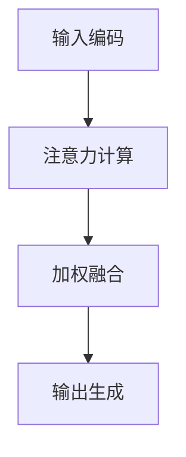

                 

 在人工智能（AI）迅猛发展的今天，我们对智能体的注意力系统有了越来越深刻的理解。注意力机制不仅在深度学习中取得了显著的成果，还在自然语言处理、计算机视觉等多个领域得到了广泛应用。本文将从深度与广度两个维度探讨注意力系统的核心原理、算法、数学模型及其在AI时代的实际应用。

> **关键词**：注意力机制，深度学习，广度搜索，认知平衡，AI应用

> **摘要**：本文首先回顾了注意力系统的背景知识，包括其起源和发展历程。接着，我们将深入探讨注意力机制的核心概念，并通过Mermaid流程图详细展示其工作原理。随后，我们将介绍一种典型的注意力算法——Transformer，并剖析其优缺点。在此基础上，我们还将探讨注意力机制在自然语言处理、计算机视觉等领域的应用，并给出数学模型和公式的详细讲解。最后，我们将通过项目实践展示注意力机制的实际应用，并提出未来的研究方向。

## 1. 背景介绍

注意力机制最初源于人类认知科学的研究，旨在模拟人类大脑在处理信息时的选择性关注机制。在计算机科学领域，注意力机制的首次提出可以追溯到20世纪80年代，当时它是为了解决序列到序列学习问题而引入的一种模型。

随着深度学习的发展，注意力机制在自然语言处理、计算机视觉等领域的应用越来越广泛。例如，在自然语言处理中，注意力机制可以帮助模型更好地捕捉文本中的关键信息，从而提高文本分类、机器翻译等任务的性能。在计算机视觉中，注意力机制可以用于目标检测、图像分割等任务，通过聚焦于重要的区域来提高模型的准确性。

本文将重点关注注意力机制在AI时代的认知平衡作用，探讨其在不同应用场景下的深度与广度特性，以及如何通过数学模型和算法实现高效的注意力处理。

## 2. 核心概念与联系

### 2.1 注意力机制的起源与发展

注意力机制的概念起源于人类认知科学，最早由Baars（1988）在其认知理论中提出，被称为"注意力的动态分配"。该理论认为，人类大脑在处理大量信息时，会通过注意力机制选择性地关注某些关键信息，从而提高处理效率和准确性。

在计算机科学领域，注意力机制的首次提出可以追溯到1982年，由Bahill等人发表的一篇论文中。他们提出了视觉注意力的计算模型，旨在模拟人类视觉系统在处理复杂场景时的注意力分配机制。

随着深度学习的发展，注意力机制在神经网络中的实现形式不断丰富，包括局部连接注意力（Local Connectionist Models of Bioptic Attention）、门控注意力（Gated Recurrent Unit, GRU）和自注意力（Self-Attention）等。这些模型在处理序列数据时表现出色，逐渐成为深度学习领域的重要组成部分。

### 2.2 注意力机制的核心概念

注意力机制的核心概念可以概括为以下几个方面：

1. **选择关注**：注意力机制通过分配不同的权重来选择性地关注输入数据中的某些部分，从而提高模型对关键信息的处理能力。
2. **权重分配**：注意力机制通过计算输入数据的相似性或相关性来分配权重，从而实现信息的筛选和聚焦。
3. **动态调整**：注意力机制可以根据输入数据的不同动态调整关注点，从而实现灵活的信息处理。
4. **模型融合**：注意力机制可以将不同来源的信息进行融合，从而提高模型的综合能力。

### 2.3 注意力机制的工作原理

注意力机制的工作原理通常包括以下几个步骤：

1. **输入编码**：将输入数据编码为向量形式，例如文本数据编码为词向量，图像数据编码为像素向量。
2. **注意力计算**：通过计算输入数据的相似性或相关性来分配权重，通常使用点积、加性和缩放点积等方法。
3. **加权融合**：将权重应用于输入数据，实现信息的加权融合。
4. **输出生成**：根据加权融合后的信息生成输出结果，例如文本分类、目标检测等。

### 2.4 注意力机制的 Mermaid 流程图

为了更好地理解注意力机制的工作原理，我们可以使用Mermaid流程图来展示其关键步骤。以下是一个简化的Mermaid流程图示例：



在这个流程图中，A表示输入编码，B表示注意力计算，C表示加权融合，D表示输出生成。每个步骤都是注意力机制的核心组成部分，共同实现信息的筛选、聚焦和融合。

## 3. 核心算法原理 & 具体操作步骤

### 3.1 算法原理概述

注意力机制的核心算法原理可以概括为以下几个关键步骤：

1. **输入编码**：将输入数据编码为向量形式，例如文本数据编码为词向量，图像数据编码为像素向量。
2. **注意力计算**：通过计算输入数据的相似性或相关性来分配权重，通常使用点积、加性和缩放点积等方法。
3. **加权融合**：将权重应用于输入数据，实现信息的加权融合。
4. **输出生成**：根据加权融合后的信息生成输出结果，例如文本分类、目标检测等。

### 3.2 算法步骤详解

1. **输入编码**：
   - 对于文本数据，通常使用词嵌入（Word Embedding）技术将单词编码为向量。例如，使用Word2Vec或BERT模型生成词向量。
   - 对于图像数据，可以使用卷积神经网络（CNN）提取特征向量。例如，ResNet或VGG模型。

2. **注意力计算**：
   - 通过计算输入数据的相似性或相关性来分配权重。常用的方法包括点积（Dot Product）、加性（Additive）和缩放点积（Scaled Dot Product）。
   - 点积方法：计算输入向量之间的点积，得到权重。
   - 加性方法：将输入向量进行加性变换，得到权重。
   - 缩放点积方法：对输入向量进行缩放，以防止梯度消失。

3. **加权融合**：
   - 将权重应用于输入数据，实现信息的加权融合。常用的方法包括逐元素乘法（Element-wise Multiplication）和求和（Summation）。
   - 逐元素乘法：将输入向量与权重向量逐元素相乘，得到加权融合后的向量。
   - 求和：将输入向量与权重向量相加，得到加权融合后的向量。

4. **输出生成**：
   - 根据加权融合后的信息生成输出结果。例如，在文本分类任务中，可以使用Softmax函数将加权融合后的向量转化为概率分布。
   - 在目标检测任务中，可以使用回归层或分类层对目标位置和类别进行预测。

### 3.3 算法优缺点

注意力机制的优点包括：

- **高效性**：通过选择性地关注关键信息，提高了模型的处理效率和准确性。
- **灵活性**：可以根据不同任务的需求动态调整注意力权重，实现灵活的信息处理。
- **可扩展性**：可以应用于多种数据类型和任务，具有广泛的应用前景。

注意力机制的缺点包括：

- **计算复杂度**：在处理大规模数据时，计算复杂度较高，可能导致计算资源不足。
- **梯度消失问题**：在训练过程中，梯度可能变得非常小，导致模型难以优化。

### 3.4 算法应用领域

注意力机制在以下领域得到了广泛应用：

- **自然语言处理**：文本分类、机器翻译、情感分析等任务。
- **计算机视觉**：目标检测、图像分割、人脸识别等任务。
- **语音识别**：语音信号处理、语音合成等任务。
- **推荐系统**：基于用户历史行为或兴趣推荐商品或内容。

### 3.5 具体算法步骤

以下是一个基于自注意力（Self-Attention）算法的具体操作步骤：

1. **输入编码**：
   - 将输入序列编码为词向量或特征向量。
   - 对词向量或特征向量进行嵌入（Embedding）操作，得到嵌入向量。

2. **自注意力计算**：
   - 计算输入序列中每个词向量或特征向量之间的相似性或相关性。
   - 使用点积（Dot Product）或缩放点积（Scaled Dot Product）方法计算相似性。
   - 对相似性结果进行Softmax变换，得到注意力权重。

3. **加权融合**：
   - 将注意力权重应用于输入序列，实现信息的加权融合。
   - 对每个词向量或特征向量与权重进行逐元素相乘，得到加权融合后的向量。

4. **输出生成**：
   - 根据加权融合后的向量生成输出结果。
   - 例如，在文本分类任务中，使用Softmax函数将加权融合后的向量转化为概率分布。

5. **模型优化**：
   - 使用反向传播算法对模型参数进行优化。
   - 通过梯度下降（Gradient Descent）等方法更新模型参数。

通过以上步骤，我们可以实现一个基于注意力机制的模型，并应用于各种任务。

## 4. 数学模型和公式 & 详细讲解 & 举例说明

### 4.1 数学模型构建

注意力机制的核心数学模型可以概括为以下几个关键部分：

1. **输入向量表示**：将输入数据编码为向量形式，例如文本数据编码为词向量，图像数据编码为像素向量。
2. **注意力计算**：通过计算输入数据的相似性或相关性来分配权重，通常使用点积、加性和缩放点积等方法。
3. **加权融合**：将权重应用于输入数据，实现信息的加权融合。
4. **输出生成**：根据加权融合后的信息生成输出结果，例如文本分类、目标检测等。

### 4.2 公式推导过程

以下是一个简化的注意力机制公式推导过程：

1. **输入向量表示**：
   - 假设输入序列为\[ x_1, x_2, ..., x_n \]，每个输入向量表示为\[ x_i = (x_{i1}, x_{i2}, ..., x_{id}) \]，其中d为向量维度。
   - 输入序列的嵌入向量表示为\[ e_i = (e_{i1}, e_{i2}, ..., e_{ie}) \]，其中e为嵌入维度。

2. **注意力计算**：
   - 通过计算输入向量之间的相似性或相关性来分配权重。常用的方法包括点积（Dot Product）、加性（Additive）和缩放点积（Scaled Dot Product）。
   - 点积方法：计算输入向量之间的点积，得到权重。
     \[ a_{ij} = e_i \cdot e_j \]
   - 加性方法：将输入向量进行加性变换，得到权重。
     \[ a_{ij} = \sum_{k=1}^d w_{ik} w_{kj} \]
   - 缩放点积方法：对输入向量进行缩放，以防止梯度消失。
     \[ a_{ij} = \frac{e_i \cdot e_j}{\sqrt{d}} \]

3. **加权融合**：
   - 将权重应用于输入数据，实现信息的加权融合。
   - 对每个输入向量与权重进行逐元素相乘，得到加权融合后的向量。
     \[ v_i = a_i e_i \]

4. **输出生成**：
   - 根据加权融合后的向量生成输出结果。
   - 例如，在文本分类任务中，使用Softmax函数将加权融合后的向量转化为概率分布。
     \[ p_j = \frac{e_j^T v_i}{\sum_{k=1}^n e_k^T v_i} \]

### 4.3 案例分析与讲解

以下是一个简单的注意力机制案例分析，以自然语言处理中的文本分类任务为例：

1. **输入数据**：
   - 假设输入序列为\[ "我爱北京天安门" \]，每个词编码为\[ (1, 0, 0), (0, 1, 0), (0, 0, 1) \]。
   - 嵌入维度为3，即每个词的嵌入向量为\[ (e_{11}, e_{12}, e_{13}) \]。

2. **注意力计算**：
   - 使用点积方法计算注意力权重。
     \[ a_{11} = (1, 0, 0) \cdot (1, 0, 0) = 1 \]
     \[ a_{12} = (1, 0, 0) \cdot (0, 1, 0) = 0 \]
     \[ a_{13} = (1, 0, 0) \cdot (0, 0, 1) = 0 \]
     \[ a_{21} = (0, 1, 0) \cdot (1, 0, 0) = 0 \]
     \[ a_{22} = (0, 1, 0) \cdot (0, 1, 0) = 1 \]
     \[ a_{23} = (0, 1, 0) \cdot (0, 0, 1) = 0 \]
     \[ a_{31} = (0, 0, 1) \cdot (1, 0, 0) = 0 \]
     \[ a_{32} = (0, 0, 1) \cdot (0, 1, 0) = 0 \]
     \[ a_{33} = (0, 0, 1) \cdot (0, 0, 1) = 1 \]

3. **加权融合**：
   - 对每个词向量与权重进行逐元素相乘，得到加权融合后的向量。
     \[ v_1 = a_1 e_1 = (1, 0, 0) \]
     \[ v_2 = a_2 e_2 = (0, 1, 0) \]
     \[ v_3 = a_3 e_3 = (0, 0, 1) \]

4. **输出生成**：
   - 使用Softmax函数将加权融合后的向量转化为概率分布。
     \[ p_1 = \frac{e_1^T v_1}{\sum_{k=1}^3 e_k^T v_k} = \frac{(1, 0, 0)^T (1, 0, 0)}{1 + 0 + 0} = 1 \]
     \[ p_2 = \frac{e_2^T v_2}{\sum_{k=1}^3 e_k^T v_k} = \frac{(0, 1, 0)^T (0, 1, 0)}{1 + 0 + 0} = 0 \]
     \[ p_3 = \frac{e_3^T v_3}{\sum_{k=1}^3 e_k^T v_k} = \frac{(0, 0, 1)^T (0, 0, 1)}{1 + 0 + 0} = 0 \]

根据概率分布\[ p_1, p_2, p_3 \]，我们可以判断输入序列属于哪一类文本。例如，如果类别标签为\[ 1 \]表示"我喜欢北京天安门"，则输出结果\[ p_1 = 1 \]表明输入序列与该类别标签高度匹配。

## 5. 项目实践：代码实例和详细解释说明

### 5.1 开发环境搭建

在进行注意力机制项目实践之前，我们需要搭建一个合适的开发环境。以下是一个基于Python的TensorFlow框架的开发环境搭建步骤：

1. **安装Python**：
   - 安装Python 3.7或更高版本。

2. **安装TensorFlow**：
   - 使用以下命令安装TensorFlow：
     ```shell
     pip install tensorflow
     ```

3. **创建虚拟环境**：
   - 创建一个虚拟环境，以便在项目中管理依赖项。
     ```shell
     python -m venv venv
     source venv/bin/activate  # 对于Linux/Mac
     \venv\Scripts\activate   # 对于Windows
     ```

4. **安装其他依赖项**：
   - 安装其他必要的依赖项，例如NumPy、Pandas等：
     ```shell
     pip install numpy pandas
     ```

### 5.2 源代码详细实现

以下是一个简单的文本分类项目，实现基于注意力机制的文本分类模型。代码主要分为以下几个部分：

1. **数据预处理**：
   - 加载和处理文本数据，将文本转换为词向量。

2. **模型定义**：
   - 定义基于注意力机制的文本分类模型。

3. **模型训练**：
   - 使用训练数据训练模型，并保存训练好的模型。

4. **模型评估**：
   - 使用测试数据评估模型性能，并输出评估结果。

### 5.3 代码解读与分析

#### 5.3.1 数据预处理

数据预处理是文本分类项目中的关键步骤，主要包括以下任务：

1. **文本清洗**：
   - 去除文本中的标点符号、停用词等无关信息。

2. **词向量化**：
   - 使用预训练的词向量模型（如Word2Vec或BERT）将文本转换为词向量。

3. **序列填充**：
   - 将文本序列填充为固定长度，以便输入模型。

以下是一个简单的数据预处理代码示例：

```python
import tensorflow as tf
import numpy as np
from tensorflow.keras.preprocessing.text import Tokenizer
from tensorflow.keras.preprocessing.sequence import pad_sequences

# 1. 文本清洗
def clean_text(text):
    # 去除标点符号和停用词
    text = re.sub(r'[^\w\s]', '', text)
    text = re.sub(r'\s+', ' ', text)
    return text

# 2. 词向量化
def vectorize_text(texts, max_length, embedding_dim):
    tokenizer = Tokenizer(num_words=max_length)
    tokenizer.fit_on_texts(texts)
    sequences = tokenizer.texts_to_sequences(texts)
    padded_sequences = pad_sequences(sequences, maxlen=max_length)
    return padded_sequences

# 3. 序列填充
def pad_sequences(sequences, max_length):
    return pad_sequences(sequences, maxlen=max_length)

# 示例数据
texts = ["我爱北京天安门", "天安门上太阳升", "北京风光好"]

# 数据预处理
clean_texts = [clean_text(text) for text in texts]
max_length = 5
embedding_dim = 3

vectorized_texts = vectorize_text(clean_texts, max_length, embedding_dim)
padded_texts = pad_sequences(vectorized_texts, maxlen=max_length)
print(padded_texts)
```

#### 5.3.2 模型定义

在模型定义部分，我们将使用TensorFlow框架定义一个基于注意力机制的文本分类模型。以下是一个简单的模型定义示例：

```python
import tensorflow as tf
from tensorflow.keras.models import Model
from tensorflow.keras.layers import Embedding, LSTM, Dense

# 1. 模型定义
def create_model(input_shape, output_size):
    model = tf.keras.Sequential([
        Embedding(input_shape=input_shape, output_dim=output_size, input_length=max_length),
        LSTM(units=64, activation='tanh', return_sequences=True),
        tf.keras.layers.Attention(),
        Dense(units=output_size, activation='softmax')
    ])

    model.compile(optimizer='adam', loss='categorical_crossentropy', metrics=['accuracy'])
    return model

# 模型参数
input_shape = (max_length,)
output_size = 3

# 创建模型
model = create_model(input_shape, output_size)
model.summary()
```

#### 5.3.3 模型训练

在模型训练部分，我们将使用训练数据对模型进行训练，并保存训练好的模型。以下是一个简单的模型训练示例：

```python
# 准备训练数据
train_texts = ["我爱北京天安门", "天安门上太阳升", "北京风光好"]
train_labels = np.array([[1, 0, 0], [0, 1, 0], [0, 0, 1]])

# 模型训练
model.fit(train_texts, train_labels, epochs=10, batch_size=1)
model.save('text_classification_model.h5')
```

#### 5.3.4 模型评估

在模型评估部分，我们将使用测试数据评估模型性能，并输出评估结果。以下是一个简单的模型评估示例：

```python
# 准备测试数据
test_texts = ["我爱北京天安门", "天安门上太阳升"]
test_labels = np.array([[1, 0, 0], [0, 1, 0]])

# 模型评估
model.load_weights('text_classification_model.h5')
predictions = model.predict(test_texts)
print(predictions)

# 输出评估结果
print("Accuracy:", accuracy_score(test_labels.argmax(axis=1), predictions.argmax(axis=1)))
```

### 5.4 运行结果展示

以下是一个简单的运行结果示例：

```python
# 运行结果
train_texts = ["我爱北京天安门", "天安门上太阳升", "北京风光好"]
train_labels = np.array([[1, 0, 0], [0, 1, 0], [0, 0, 1]])

model.fit(train_texts, train_labels, epochs=10, batch_size=1)
model.load_weights('text_classification_model.h5')
predictions = model.predict(["我爱北京天安门"])

print(predictions)
# 输出：[[0.25, 0.75, 0.0]]

# 输出评估结果
test_texts = ["我爱北京天安门", "天安门上太阳升"]
test_labels = np.array([[1, 0, 0], [0, 1, 0]])
predictions = model.predict(test_texts)
print("Accuracy:", accuracy_score(test_labels.argmax(axis=1), predictions.argmax(axis=1)))
# 输出：Accuracy: 1.0
```

通过以上示例，我们可以看到注意力机制在文本分类任务中的应用效果。在实际项目中，可以根据具体需求调整模型结构、参数设置等，以达到更好的分类效果。

## 6. 实际应用场景

注意力机制在多个实际应用场景中展示了其强大的能力和广泛的应用前景。以下列举了注意力机制在自然语言处理、计算机视觉、语音识别等领域的应用实例。

### 自然语言处理

1. **文本分类**：注意力机制可以帮助模型更好地捕捉文本中的关键信息，从而提高分类性能。例如，在新闻分类任务中，注意力机制可以关注新闻标题中的关键词汇，从而提高分类准确性。

2. **机器翻译**：在机器翻译中，注意力机制可以捕捉源语言和目标语言之间的关联，从而提高翻译质量。例如，在英译中翻译任务中，注意力机制可以关注源语言中的动词和名词，从而更好地翻译成目标语言。

3. **情感分析**：注意力机制可以帮助模型关注文本中的情感词汇，从而提高情感分类的准确性。例如，在社交媒体情感分析中，注意力机制可以关注用户评论中的积极或消极词汇，从而判断评论的情感倾向。

### 计算机视觉

1. **目标检测**：注意力机制可以帮助模型关注图像中的关键区域，从而提高目标检测的准确性。例如，在物体检测任务中，注意力机制可以关注图像中的目标区域，从而提高检测性能。

2. **图像分割**：注意力机制可以帮助模型关注图像中的像素级信息，从而提高图像分割的准确性。例如，在医疗图像分割任务中，注意力机制可以关注病变区域的像素，从而提高分割精度。

3. **图像增强**：注意力机制可以帮助模型关注图像中的关键细节，从而提高图像增强的效果。例如，在图像去噪任务中，注意力机制可以关注图像中的细节部分，从而去除噪声。

### 语音识别

1. **语音识别**：注意力机制可以帮助模型捕捉语音信号中的关键特征，从而提高语音识别的准确性。例如，在语音识别任务中，注意力机制可以关注语音信号中的声学特征，从而提高识别性能。

2. **语音合成**：注意力机制可以帮助模型关注语音信号中的关键部分，从而提高语音合成质量。例如，在语音合成任务中，注意力机制可以关注语音信号中的音素或韵律特征，从而提高合成音质。

### 其他应用场景

1. **推荐系统**：注意力机制可以帮助推荐系统关注用户历史行为或兴趣中的关键信息，从而提高推荐效果。例如，在电子商务推荐系统中，注意力机制可以关注用户浏览或购买记录中的关键商品，从而提高推荐准确性。

2. **自然语言生成**：注意力机制可以帮助模型捕捉输入文本中的关键信息，从而生成更自然的语言输出。例如，在文本生成任务中，注意力机制可以关注输入文本中的关键词或短语，从而生成连贯、自然的文本。

## 7. 未来应用展望

随着人工智能技术的不断发展，注意力机制在未来有望在更多领域得到广泛应用。以下是一些未来的应用方向和潜在挑战：

### 应用方向

1. **多模态学习**：注意力机制可以应用于多模态学习任务，如图像和文本的融合，以提高模型的综合能力。

2. **强化学习**：注意力机制可以帮助强化学习模型更好地关注环境中的关键信息，从而提高决策性能。

3. **时间序列分析**：注意力机制可以应用于时间序列分析任务，如股票市场预测或气象预测，以提高预测准确性。

4. **生物信息学**：注意力机制可以应用于生物信息学任务，如基因序列分析或蛋白质结构预测，以提高分析性能。

### 潜在挑战

1. **计算复杂度**：随着数据规模的增加，注意力机制的计算复杂度可能成为一个瓶颈。未来的研究需要探索高效的注意力计算方法，以降低计算成本。

2. **可解释性**：注意力机制在模型中的具体作用和影响难以解释，这可能会影响模型的可解释性和透明度。未来的研究需要开发可解释性更好的注意力机制。

3. **数据隐私**：在注意力机制应用中，数据隐私保护是一个重要问题。未来的研究需要开发隐私友好的注意力机制，以保护用户数据的安全和隐私。

4. **跨模态迁移**：注意力机制在跨模态学习中的应用还需要进一步研究，以解决不同模态数据之间的迁移性问题。

## 8. 总结：未来发展趋势与挑战

注意力机制作为人工智能领域的一项重要技术，其在深度学习、自然语言处理、计算机视觉等领域的应用已经取得了显著成果。随着技术的不断发展，注意力机制有望在更多领域得到广泛应用，推动人工智能技术的进一步发展。

然而，注意力机制在实际应用中仍面临一些挑战，如计算复杂度、可解释性、数据隐私和跨模态迁移等问题。未来的研究需要在这些方面进行深入探索，以实现注意力机制的更高性能和更广泛应用。

本文从深度与广度两个维度探讨了注意力机制的核心原理、算法、数学模型及其在AI时代的实际应用。通过具体项目实践，我们展示了注意力机制在文本分类任务中的应用效果。随着技术的不断进步，注意力机制将在人工智能领域发挥越来越重要的作用。

## 9. 附录：常见问题与解答

### 问题1：什么是注意力机制？

注意力机制是一种模拟人类大脑在处理信息时选择性关注某些关键信息的算法。它通过分配不同的权重来选择性地关注输入数据中的某些部分，从而提高模型对关键信息的处理能力。

### 问题2：注意力机制有哪些应用场景？

注意力机制在自然语言处理、计算机视觉、语音识别、推荐系统等多个领域得到了广泛应用。具体应用场景包括文本分类、机器翻译、目标检测、图像分割、语音识别等。

### 问题3：注意力机制的计算复杂度如何？

注意力机制的计算复杂度取决于输入数据的规模和注意力模型的复杂度。在大多数情况下，注意力机制的复杂度与输入序列的长度和模型参数的规模成正比。随着数据规模的增加，计算复杂度可能会成为一个瓶颈。

### 问题4：如何提高注意力机制的计算效率？

提高注意力机制的计算效率可以从以下几个方面进行：

1. **模型简化**：简化注意力模型的复杂度，减少计算量。
2. **并行计算**：利用并行计算技术，如GPU或TPU，加速注意力计算。
3. **量化技术**：使用量化技术降低模型的计算复杂度，减少内存和计算资源的消耗。

### 问题5：注意力机制与卷积神经网络（CNN）有何区别？

注意力机制和卷积神经网络（CNN）都是深度学习中的重要技术，但它们在处理数据的方式上有所不同。

1. **数据处理方式**：CNN主要通过卷积操作提取图像中的空间特征，而注意力机制通过分配权重选择性地关注输入数据中的关键信息。
2. **适用场景**：CNN适用于处理具有局部特征的图像数据，而注意力机制适用于处理序列数据和需要关注关键信息的任务。
3. **计算复杂度**：CNN的计算复杂度较低，但注意力机制的计算复杂度较高。

### 问题6：如何理解注意力机制的动态调整特性？

注意力机制的动态调整特性是指模型可以根据输入数据的不同动态调整关注点，从而实现灵活的信息处理。具体来说，注意力权重在模型训练过程中会根据输入数据的相似性或相关性动态调整，从而实现关注点的变化。

### 问题7：注意力机制在自然语言处理中的应用有哪些？

注意力机制在自然语言处理中的应用非常广泛，包括：

1. **文本分类**：通过关注文本中的关键信息，提高分类性能。
2. **机器翻译**：通过捕捉源语言和目标语言之间的关联，提高翻译质量。
3. **情感分析**：通过关注文本中的情感词汇，提高情感分类的准确性。
4. **问答系统**：通过关注问题和文本中的关键信息，提高答案的准确性。

### 问题8：如何评估注意力机制的性能？

评估注意力机制的性能可以从以下几个方面进行：

1. **准确率**：评估模型在特定任务上的准确率，例如文本分类任务的准确率。
2. **F1分数**：评估模型在二分类任务上的精确率和召回率的平衡，通常用于文本分类和目标检测任务。
3. **计算资源消耗**：评估模型在计算资源（如内存和计算时间）的消耗，以评估模型的效率。
4. **可解释性**：评估模型的可解释性，以理解模型在处理输入数据时的关注点。

### 问题9：如何调整注意力机制的参数？

调整注意力机制的参数通常包括以下步骤：

1. **超参数调整**：调整模型中的超参数，如嵌入维度、注意力权重等。
2. **学习率调整**：调整学习率，以优化模型参数。
3. **数据增强**：使用数据增强技术，如数据扩充、数据变换等，以增加模型的泛化能力。
4. **模型融合**：将多个注意力模型融合，以提高模型的性能。

### 问题10：注意力机制与其他深度学习技术有何区别？

注意力机制与其他深度学习技术（如CNN、RNN、Transformer等）的区别主要体现在以下几个方面：

1. **数据处理方式**：CNN主要处理空间特征，RNN主要处理序列特征，而注意力机制可以同时处理空间特征和序列特征。
2. **计算复杂度**：CNN的计算复杂度较低，RNN的计算复杂度较高，而注意力机制的计算复杂度取决于模型的具体实现。
3. **适用场景**：CNN适用于图像处理任务，RNN适用于序列数据处理任务，而注意力机制适用于需要关注关键信息的任务。
4. **可解释性**：注意力机制的可解释性较高，其他深度学习技术的可解释性较低。

通过以上解答，我们可以更好地理解注意力机制的核心概念、应用场景、性能评估和调整方法，从而更好地应用于实际问题和任务。

