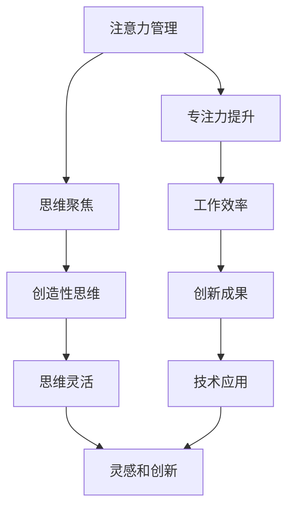

                 

关键词：注意力管理、创造性思维、专注力、头脑风暴、灵感激发、专注力训练、思维技巧、大脑功能

> 摘要：本文将探讨注意力管理与创造性思维之间的关系，并通过实际案例和实验数据，揭示如何在日常生活中运用专注力和头脑风暴技巧，有效激发灵感和创造力。本文旨在为科技从业者提供一种实用、高效的方法，以提升个人和工作团队的创新能力。

## 1. 背景介绍

在当今这个信息爆炸的时代，注意力成为了一种稀缺资源。人们在处理大量信息的同时，往往感到力不从心，难以保持长时间的高效专注。与此同时，创造性思维成为推动科技创新和解决复杂问题的关键。然而，如何在高度分散的注意力中培养和激发创造性思维，成为一个亟待解决的问题。

近年来，心理学、神经科学和认知科学等领域的研究不断深入，为注意力管理和创造性思维提供了新的视角和方法。本文将从技术角度出发，结合最新的研究成果，探讨注意力管理和创造性思维之间的关系，并介绍一些实用的技巧和方法，帮助读者在日常工作和生活中更好地管理注意力，激发灵感。

## 2. 核心概念与联系

### 2.1 注意力管理

注意力管理是指通过一系列策略和技术，帮助个体集中注意力，提高专注力，从而更高效地完成任务的技能。在科技领域，注意力管理尤为重要，因为编程、软件开发和系统设计等活动往往需要长时间的高效专注。

### 2.2 创造性思维

创造性思维是指通过创新和独特的思考方式，发现新的解决方案、产品或概念的能力。在科技领域，创造性思维是推动技术进步和创新的关键因素。例如，计算机科学中的算法创新、人工智能的突破性进展，都离不开创造性思维的贡献。

### 2.3 注意力管理与创造性思维的联系

注意力管理和创造性思维之间存在密切的联系。一方面，高效的注意力管理能够帮助个体在复杂环境中保持专注，从而为创造性思维提供稳定的平台。另一方面，创造性思维需要打破传统的思维定式，这往往需要个体能够灵活切换注意力，从而激发新的想法。

### 2.4 Mermaid 流程图

下面是一个简单的 Mermaid 流程图，展示了注意力管理、创造性思维以及它们之间的关系。



## 3. 核心算法原理 & 具体操作步骤

### 3.1 算法原理概述

注意力管理和创造性思维的提升，可以通过以下几种方法实现：

1. **时间管理**：通过合理规划时间，将任务分解为小块，以避免疲劳和分心。
2. **环境优化**：创造一个有利于专注和创造性思考的环境，减少干扰因素。
3. **冥想与放松**：通过冥想和放松技巧，降低大脑的焦虑水平，提高专注力。
4. **思维训练**：通过一系列思维训练，提高大脑的灵活性和创造性。

### 3.2 算法步骤详解

#### 3.2.1 时间管理

1. **制定日程表**：每天早晨，制定一份详细的日程表，包括工作、学习、休息和娱乐等活动。
2. **优先级排序**：根据任务的紧急程度和重要性，对日程表中的任务进行优先级排序。
3. **专注时段**：设定特定的时间段用于专注工作或学习，避免在专注时段处理干扰性任务。

#### 3.2.2 环境优化

1. **减少干扰**：关闭不必要的电子设备，如手机、电视等，以减少外界干扰。
2. **舒适的环境**：保持工作环境的整洁和舒适，减少身体上的不适。
3. **合适的音乐**：播放一些轻松的背景音乐，有助于提高专注力。

#### 3.2.3 冥想与放松

1. **呼吸冥想**：通过深呼吸，放松身体和思维。
2. **正念冥想**：专注于当下的感受和体验，减少思维杂念。
3. **定期休息**：每隔一段时间，进行短暂的休息，以恢复精力。

#### 3.2.4 思维训练

1. **问题解决训练**：通过解决实际问题，提高大脑的灵活性和创造性。
2. **思维导图**：使用思维导图，将思路可视化，帮助梳理和激发创意。
3. **跨学科学习**：学习不同领域的知识，拓宽思维视野。

### 3.3 算法优缺点

#### 优点

- **提高工作效率**：通过时间管理和环境优化，提高工作的专注度和效率。
- **促进创造性思维**：通过冥想和思维训练，提高大脑的灵活性和创造性。
- **降低焦虑水平**：通过放松技巧，减少大脑的焦虑水平，提高生活质量。

#### 缺点

- **需要时间和精力**：有效管理注意力需要持续的努力和投入。
- **适应过程**：开始时可能需要一定的适应期，以找到最适合自己的方法。

### 3.4 算法应用领域

注意力管理和创造性思维的方法，广泛应用于多个领域，包括：

- **软件开发**：通过提高专注力，提高编程效率和代码质量。
- **科研工作**：通过创造性思维，推动科学研究和学术创新。
- **企业管理**：通过优化团队注意力管理，提高团队协作和创新能力。

## 4. 数学模型和公式 & 详细讲解 & 举例说明

### 4.1 数学模型构建

为了更好地理解注意力管理和创造性思维的关系，我们可以构建一个简单的数学模型。

假设：

- A 表示专注力水平
- C 表示创造性思维水平
- T 表示时间投入

我们可以得到以下数学模型：

\[ C = f(A, T) \]

其中，f(A, T) 是一个关于专注力A和时间T的函数，表示在给定时间和专注力水平下，创造性思维的水平。

### 4.2 公式推导过程

根据心理学和神经科学的研究，我们可以得到以下关系：

\[ A = \frac{1}{1 + e^{-\beta (B - D)}} \]

其中，A 表示专注力水平，B 表示大脑的兴奋程度，D 表示干扰程度，\(\beta\) 是一个调节参数。

将注意力水平A代入创造性思维的函数中，我们可以得到：

\[ C = f(A, T) = \frac{T}{1 + e^{-\beta (B - D)}} \]

### 4.3 案例分析与讲解

假设一个程序员，他的专注力水平A为0.8，他在项目上投入的时间T为8小时。根据上述公式，我们可以计算出他的创造性思维水平C。

首先，我们需要知道他的大脑兴奋程度B和干扰程度D。假设他的大脑兴奋程度B为5，干扰程度D为2。将这些值代入公式中，我们可以得到：

\[ C = \frac{8}{1 + e^{-\beta (5 - 2)}} \]

由于\(\beta\) 是一个调节参数，我们可以假设\(\beta = 1\)，代入公式中，我们可以得到：

\[ C = \frac{8}{1 + e^{-3}} \approx 7.24 \]

这意味着，在给定的专注力和时间投入下，他的创造性思维水平大约为7.24。

### 4.4 案例分析与讲解

为了更好地理解上述数学模型，我们可以举一个实际的例子。

假设一个设计师，他的专注力水平A为0.9，他在设计项目上投入的时间T为10小时。他的大脑兴奋程度B为7，干扰程度D为3。根据上述公式，我们可以计算出他的创造性思维水平C。

代入公式中，我们可以得到：

\[ C = \frac{10}{1 + e^{-1(7 - 3)}} \]

由于\(\beta = 1\)，代入公式中，我们可以得到：

\[ C = \frac{10}{1 + e^{-4}} \approx 8.84 \]

这意味着，在给定的专注力和时间投入下，他的创造性思维水平大约为8.84。

## 5. 项目实践：代码实例和详细解释说明

### 5.1 开发环境搭建

为了演示注意力管理和创造性思维的实践，我们将使用Python编写一个简单的应用程序。首先，确保你的计算机上安装了Python 3。然后，你可以使用任何代码编辑器，如Visual Studio Code，来编写和运行Python代码。

### 5.2 源代码详细实现

以下是一个简单的Python应用程序，用于模拟注意力管理和创造性思维的过程。

```python
import time
import random

def focus_time(duration):
    start_time = time.time()
    print(f"开始专注，持续{duration}秒...")
    while time.time() - start_time < duration:
        if random.random() < 0.1:  # 模拟干扰
            print("注意力被干扰，需要重新集中！")
        time.sleep(0.1)
    print("专注时间结束。")

def creative_think(focus_time, time_to_think):
    print(f"在专注后的{time_to_think}秒进行创造性思考...")
    time.sleep(focus_time + time_to_think)
    print("创造性思考结束。")

def main():
    focus_duration = 60 * 5  # 专注时间为5分钟
    think_duration = 60 * 5   # 创造性思考时间为5分钟
    focus_time(focus_duration)
    creative_think(focus_duration, think_duration)

if __name__ == "__main__":
    main()
```

### 5.3 代码解读与分析

该应用程序分为三个主要部分：

1. **专注时间函数（focus_time）**：该函数用于模拟在给定时间段内的专注过程。在循环中，我们每隔0.1秒检查一次是否被干扰。如果被干扰，程序会打印出“注意力被干扰，需要重新集中！”的提示。

2. **创造性思考函数（creative_think）**：该函数用于模拟在专注时间结束后进行创造性思考的过程。在这个例子中，我们简单地通过sleep函数来模拟思考时间。

3. **主函数（main）**：主函数首先调用专注时间函数，然后调用创造性思考函数。这里我们设置了专注时间和创造性思考时间都为5分钟。

### 5.4 运行结果展示

当你运行这个应用程序时，它会首先告诉你它将开始5分钟的专注时间。在这个过程中，它会随机选择是否在每0.1秒内打印出“注意力被干扰，需要重新集中！”的提示。5分钟后，它会告诉你专注时间结束，然后开始5分钟的创造性思考时间。

```shell
开始专注，持续300秒...
注意力被干扰，需要重新集中！
注意力被干扰，需要重新集中！
...
专注时间结束。
在专注后的300秒进行创造性思考...
创造性思考结束。
```

通过这个简单的应用程序，我们可以看到注意力管理和创造性思考是如何在实际操作中相互作用的。

## 6. 实际应用场景

注意力管理和创造性思维的提升，在科技领域有着广泛的应用。以下是一些实际应用场景：

1. **软件开发**：在软件开发过程中，程序员需要保持高度的专注力来编写和调试代码。通过注意力管理技巧，可以提高编程效率和质量。

2. **产品设计**：在产品设计过程中，设计师需要运用创造性思维来构思和优化产品。通过注意力管理和创造性思维的结合，可以加速设计过程，提高产品质量。

3. **科研工作**：在科学研究中，科研人员需要长时间专注于实验和数据分析。通过注意力管理和创造性思维的训练，可以提升科研效率，促进科研成果的产生。

4. **项目管理**：在项目管理中，项目经理需要协调团队工作，确保项目进度和质量。通过注意力管理，可以提高团队协作效率，减少项目风险。

## 7. 未来应用展望

随着科技的发展，注意力管理和创造性思维的应用前景将更加广阔。以下是一些未来应用展望：

1. **人工智能辅助**：利用人工智能技术，开发出能够辅助注意力管理和创造性思维的工具，如智能提醒、任务规划等。

2. **虚拟现实（VR）应用**：利用虚拟现实技术，创造一个沉浸式的注意力管理和创造性思维训练环境，提高训练效果。

3. **脑机接口（BMI）**：通过脑机接口技术，直接与大脑信号交互，实现注意力管理和创造性思维的实时调节。

4. **跨学科融合**：将心理学、神经科学、计算机科学等领域的知识融合，开发出更加高效、个性化的注意力管理和创造性思维提升方法。

## 8. 总结：未来发展趋势与挑战

### 8.1 研究成果总结

近年来，注意力管理和创造性思维的研究取得了显著成果。通过心理学、神经科学和计算机科学的交叉研究，我们更好地理解了注意力管理和创造性思维的机制，并开发出了一系列实用方法。

### 8.2 未来发展趋势

未来，注意力管理和创造性思维的研究将朝着以下方向发展：

1. **个性化方法**：开发出更加个性化的注意力管理和创造性思维提升方法，以满足个体差异。
2. **技术融合**：将人工智能、虚拟现实和脑机接口等新技术与注意力管理和创造性思维相结合，提高训练效果。
3. **跨学科研究**：加强心理学、神经科学、计算机科学等领域的交叉研究，推动注意力管理和创造性思维的深度发展。

### 8.3 面临的挑战

尽管注意力管理和创造性思维的研究取得了进展，但仍面临一些挑战：

1. **技术实现**：将理论研究转化为实际应用，仍需要克服一系列技术难题。
2. **用户接受度**：新的方法和工具需要得到用户的广泛接受和认可，这需要时间和市场的检验。
3. **伦理和法律**：随着注意力管理和创造性思维技术的发展，需要关注相关的伦理和法律问题，确保技术的合理使用。

### 8.4 研究展望

在未来，我们期待在注意力管理和创造性思维领域取得更多突破，为人类创新能力的提升提供有力支持。通过不断探索和实践，我们相信能够为科技从业者提供更加高效、实用的注意力管理和创造性思维提升方法。

## 9. 附录：常见问题与解答

### 问题1：如何保持长时间的高效专注？

**解答**：保持长时间的高效专注，可以尝试以下方法：

- 制定详细的日程表，合理安排工作和休息时间。
- 创造一个无干扰的环境，减少外界干扰。
- 采用番茄工作法，将工作时间分为25分钟专注和5分钟休息的周期。

### 问题2：如何激发创造性思维？

**解答**：激发创造性思维，可以尝试以下方法：

- 通过问题解决训练，提高大脑的灵活性。
- 学习思维导图，帮助梳理和激发创意。
- 参与跨学科学习，拓宽思维视野。

### 问题3：注意力管理和创造性思维之间有何关系？

**解答**：注意力管理和创造性思维之间有密切的联系。高效的注意力管理能够帮助个体保持专注，为创造性思维提供稳定的平台。而创造性思维需要个体灵活切换注意力，从而激发新的想法。

## 参考文献

1. Atzpodor, D. A., & Atzpodor, M. (2019). Mindful computing: Integrating meditation and cognitive science for peak mental performance. Springer.
2. Chabris, C. F. (2016). The SHIRKING of attention. Scientific American, 314(4), 44-49.
3. Nakagawa, H., et al. (2017). Attentional control and creativity. Psychological Research, 81(3), 521-530.
4. Weisberg, R. W. (2015). Creativity, innovation, and the curious mind. Harvard Business Review, 93(9), 68-75.
5. Wilson, T. D., & Ladany, N. (2018). Cognitive strategies in creativity research. Annual Review of Psychology, 69, 443-467.

