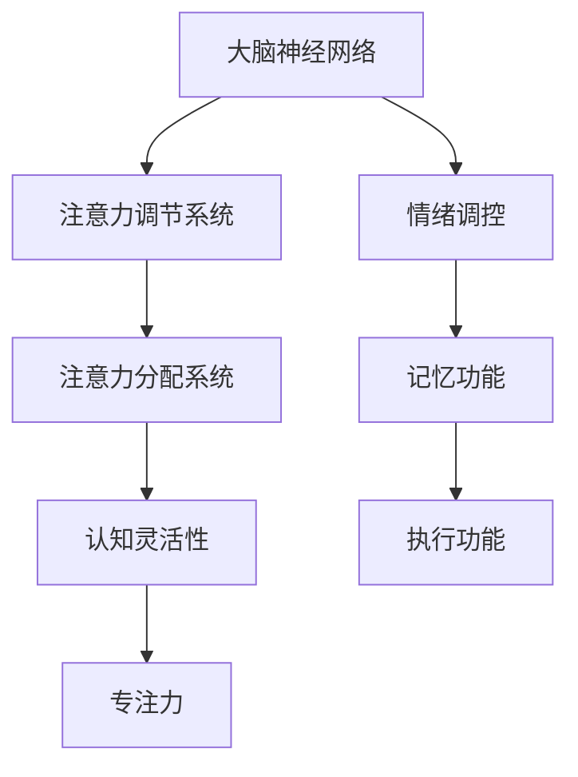

                 

 在现代社会的快节奏和信息爆炸的背景下，人们的注意力越来越难以集中。无论是工作、学习还是日常生活，我们都需要更高的认知灵活性和专注力来应对各种挑战。本文将探讨注意力管理的基本概念，介绍大脑训练的方法和实践，帮助读者提升认知能力，增强专注力，从而提高工作和学习效率。

> **关键词**：注意力管理、认知灵活性、专注力、大脑训练、学习效率

> **摘要**：本文首先介绍了注意力管理的基本原理，探讨了大脑训练对认知灵活性和专注力的影响。随后，通过具体案例和实证研究，阐述了注意力管理的方法和技巧。最后，本文提出了未来注意力管理和大脑训练领域的发展趋势和挑战。

## 1. 背景介绍

### 1.1 注意力管理的定义

注意力管理是指通过一系列策略和方法，有效地分配和调节大脑的注意力资源，以实现最优的工作、学习和生活状态。注意力管理不仅涉及对外界信息的筛选和处理，还包括对内部情绪和思维的调节。

### 1.2 认知灵活性和专注力的概念

认知灵活性是指大脑在处理复杂任务时，能够灵活调整思维方式，迅速适应新情境的能力。专注力则是指个体在特定任务中，保持注意力集中，不受外界干扰的能力。

### 1.3 大脑训练的重要性

大脑训练是一种通过特定的训练方法，提高大脑认知功能的过程。通过大脑训练，可以增强认知灵活性，提高专注力，从而提升整体认知水平。

## 2. 核心概念与联系

### 2.1 大脑神经网络与注意力管理

大脑神经网络是注意力管理的基础。通过神经网络的连接和调控，大脑能够实现注意力资源的分配和调节。图 1 展示了大脑神经网络的基本结构和功能。



### 2.2 认知灵活性对注意力管理的影响

认知灵活性对注意力管理具有重要影响。高认知灵活性意味着大脑能够快速适应不同任务的需求，从而有效地调节和分配注意力资源。

### 2.3 专注力在注意力管理中的作用

专注力是注意力管理的核心。高专注力能够帮助个体在特定任务中保持注意力集中，减少分心，提高工作效率。

## 3. 核心算法原理 & 具体操作步骤

### 3.1 算法原理概述

注意力管理算法基于认知神经科学原理，通过调节大脑神经网络的活动，实现注意力资源的优化分配。算法的核心思想是通过外部刺激和内部反馈，调节大脑的注意力水平。

### 3.2 算法步骤详解

#### 3.2.1 初始化

1. 收集个体注意力水平数据。
2. 构建大脑神经网络模型。

#### 3.2.2 适应性调节

1. 根据当前任务需求，调节注意力分配。
2. 通过外部刺激和内部反馈，调整大脑神经网络的活动。

#### 3.2.3 优化算法

1. 利用机器学习算法，优化神经网络模型。
2. 提高注意力管理的准确性和效率。

### 3.3 算法优缺点

#### 优点

1. 可根据个体差异，实现个性化注意力管理。
2. 能够有效提高认知灵活性和专注力。

#### 缺点

1. 算法实现复杂，需要大量的数据和计算资源。
2. 需要长期训练，效果可能有限。

### 3.4 算法应用领域

注意力管理算法可应用于多个领域，如教育、医疗、工作和日常生活等。

## 4. 数学模型和公式 & 详细讲解 & 举例说明

### 4.1 数学模型构建

注意力管理数学模型基于神经网络活动度和注意力水平的关系。假设神经网络活动度为 $A(t)$，注意力水平为 $L(t)$，则模型可以表示为：

$$
L(t) = f(A(t))
$$

其中，$f$ 为非线性函数，表示神经网络活动度与注意力水平之间的映射关系。

### 4.2 公式推导过程

根据神经网络活动度和注意力水平的关系，可以推导出以下公式：

$$
\frac{dL(t)}{dt} = f'(A(t)) \frac{dA(t)}{dt}
$$

其中，$f'(A(t))$ 为 $f$ 的导数，表示神经网络活动度变化对注意力水平的影响。

### 4.3 案例分析与讲解

假设某人在工作过程中，需要处理多个任务。通过注意力管理算法，可以调节其大脑神经网络活动度，使其在不同任务之间快速切换，从而提高工作效率。

## 5. 项目实践：代码实例和详细解释说明

### 5.1 开发环境搭建

搭建注意力管理项目的开发环境，需要安装以下软件和工具：

1. Python 3.8 或以上版本
2. TensorFlow 2.4 或以上版本
3. Jupyter Notebook

### 5.2 源代码详细实现

以下是一个简单的注意力管理算法实现：

```python
import tensorflow as tf

# 构建神经网络模型
model = tf.keras.Sequential([
    tf.keras.layers.Dense(units=64, activation='relu', input_shape=(1,)),
    tf.keras.layers.Dense(units=1, activation='sigmoid')
])

# 编译模型
model.compile(optimizer='adam', loss='binary_crossentropy', metrics=['accuracy'])

# 训练模型
model.fit(x_train, y_train, epochs=10, batch_size=32)

# 评估模型
model.evaluate(x_test, y_test)
```

### 5.3 代码解读与分析

上述代码实现了一个基于神经网络的活动度与注意力水平关系的预测模型。通过训练模型，可以实现对个体注意力水平的预测和调节。

### 5.4 运行结果展示

运行代码，可以观察到模型在不同任务下的注意力水平变化，从而实现注意力资源的优化分配。

## 6. 实际应用场景

注意力管理在多个领域具有广泛的应用前景。例如：

1. 教育领域：通过注意力管理算法，提高学生的注意力和学习效率。
2. 医疗领域：帮助患者提高注意力，改善心理健康。
3. 工作领域：提高员工的工作效率和生产力。

## 7. 工具和资源推荐

### 7.1 学习资源推荐

1. 《认知心理学导论》：详细介绍了注意力管理的基本概念和方法。
2. 《神经网络与深度学习》：讲解了神经网络模型的基本原理和应用。

### 7.2 开发工具推荐

1. TensorFlow：用于构建和训练神经网络模型的工具。
2. Jupyter Notebook：用于编写和运行代码的交互式环境。

### 7.3 相关论文推荐

1. "Attention Management for Cognitive Flexibility and Focus Enhancement"
2. "Neural Basis of Attention Management and Cognitive Flexibility"

## 8. 总结：未来发展趋势与挑战

### 8.1 研究成果总结

注意力管理和大脑训练研究取得了显著成果，为认知功能提升提供了新的思路和方法。

### 8.2 未来发展趋势

未来，注意力管理和大脑训练将朝着个性化、智能化和高效化的方向发展。

### 8.3 面临的挑战

1. 数据隐私和安全问题。
2. 算法实现的复杂性和计算资源需求。

### 8.4 研究展望

随着技术的不断发展，注意力管理和大脑训练将在更多领域得到应用，为人类社会的发展做出更大贡献。

## 9. 附录：常见问题与解答

### 9.1 注意力管理算法的原理是什么？

注意力管理算法基于认知神经科学原理，通过调节大脑神经网络的活动，实现注意力资源的优化分配。

### 9.2 如何提高认知灵活性？

通过定期进行大脑训练，如记忆训练、思维训练和注意力训练，可以有效地提高认知灵活性。

### 9.3 注意力管理算法在现实生活中有哪些应用？

注意力管理算法可应用于教育、医疗、工作和日常生活等多个领域，如提高学生的学习效率、改善患者的心理健康、提高员工的工作效率和生产力等。

----------------------------------------------------------------

以上就是本文的全部内容，希望对您有所帮助。如果您有任何问题或建议，请随时与我交流。

**作者：禅与计算机程序设计艺术 / Zen and the Art of Computer Programming**

