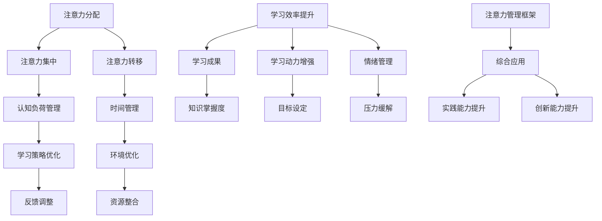

                 

关键词：注意力管理、学习效率、信息过载、认知负荷、学习策略、时间管理、技术工具、心理学原理

> 摘要：在当今信息爆炸的时代，如何提高学习效率成为每个人必须面对的挑战。本文旨在探讨注意力管理的重要性及其在学习过程中的应用，结合心理学原理和技术工具，为读者提供一套系统的学习策略，帮助大家有效应对信息过载，提升学习成果。

## 1. 背景介绍

随着互联网和智能设备的普及，我们每天接收到的信息量呈指数级增长。这种信息过载现象不仅影响着我们的日常生活，更对学习效率产生了深远的影响。研究表明，人类大脑在处理信息时，注意力资源的分配是有限的，过度的信息输入会导致认知负荷增加，进而降低学习效果。因此，如何科学管理注意力，提高学习效率，成为当今亟待解决的问题。

本文将从注意力管理的核心概念入手，结合心理学原理和技术工具，为读者提供一套行之有效的学习策略。文章分为以下几个部分：

1. **核心概念与联系**：介绍注意力管理的基本原理，并使用Mermaid流程图展示注意力管理的学习架构。
2. **核心算法原理与具体操作步骤**：详细阐述提升注意力管理的核心算法和具体操作方法。
3. **数学模型和公式**：解释注意力管理的数学模型和公式，并进行案例分析与讲解。
4. **项目实践**：提供实际代码实例，展示如何将注意力管理应用于编程学习。
5. **实际应用场景**：探讨注意力管理在不同领域的应用，以及未来发展的展望。
6. **工具和资源推荐**：推荐学习注意力管理和提升学习效率的相关工具和资源。
7. **总结**：总结研究成果，展望未来发展趋势和挑战。

## 2. 核心概念与联系

### 注意力管理的基本原理

注意力管理是指通过一系列策略和技巧，优化大脑注意力资源的分配，从而提高学习效率的过程。它涉及到多个层面，包括注意力分配、注意力集中、注意力转移等。

- **注意力分配**：在多任务处理时，合理分配注意力资源，避免过度集中于某一任务而忽视其他任务。
- **注意力集中**：提高注意力的集中度，减少分心和干扰，确保在特定任务上投入足够的精力。
- **注意力转移**：灵活切换注意力，从一项任务转向另一项任务，提高多任务处理能力。

### 注意力管理的学习架构

为了更好地理解注意力管理，我们使用Mermaid流程图展示其核心架构。



### Mermaid流程图说明

- **注意力分配**：确保在多任务处理时，注意力资源得到合理分配。
- **注意力集中**：提高注意力的集中度，减少分心和干扰。
- **注意力转移**：灵活切换注意力，提高多任务处理能力。
- **认知负荷管理**：通过合理安排任务，避免认知负荷过高。
- **时间管理**：有效利用时间，提高学习效率。
- **学习策略优化**：根据学习目标和实际情况，调整学习策略。
- **环境优化**：营造有利于学习的环境，减少外部干扰。
- **反馈调整**：根据反馈信息，及时调整学习方法和策略。
- **资源整合**：整合各种学习资源，提高学习效果。
- **学习效率提升**：通过以上策略，提高学习效率。
- **学习动力增强**：激发学习兴趣，提高学习积极性。
- **情绪管理**：保持良好的情绪状态，减少学习压力。
- **知识掌握度**：提高对知识的理解和掌握程度。
- **目标设定**：明确学习目标，提高学习动力。
- **压力缓解**：通过适当的方式缓解学习压力。
- **综合应用**：将注意力管理应用于实际学习中，提高实践能力和创新能力。

通过以上流程图，我们可以清晰地看到注意力管理在学习过程中的应用和作用。接下来，我们将深入探讨注意力管理的核心算法原理和具体操作步骤。

## 3. 核心算法原理与具体操作步骤

### 3.1 算法原理概述

注意力管理的核心算法基于心理学原理，旨在优化大脑注意力资源的分配和利用。该算法主要包括以下几个关键环节：

1. **注意力分配**：根据学习任务的重要性和紧急程度，合理分配注意力资源。
2. **注意力集中**：采用专注训练技巧，提高注意力的集中度。
3. **注意力转移**：运用切换策略，灵活调整注意力，提高多任务处理能力。
4. **认知负荷管理**：通过合理安排任务，避免认知负荷过高，保持大脑的活力。
5. **时间管理**：利用时间管理工具，提高学习效率。

### 3.2 算法步骤详解

#### 步骤1：注意力分配

1. **确定任务优先级**：对学习任务进行排序，明确哪些任务最为紧急和重要。
2. **分配注意力资源**：根据任务优先级，将注意力资源分配给不同的任务。
3. **动态调整**：在执行任务过程中，根据实际情况动态调整注意力分配。

#### 步骤2：注意力集中

1. **专注训练**：通过专注训练，提高注意力的集中度。
    - **练习方法**：例如，尝试进行“5-5-5”训练，即专注于一个目标物5分钟，休息5分钟，重复进行。
    - **应用场景**：适合长时间的学习和阅读任务。
2. **消除干扰**：在专注训练过程中，尽量消除外部干扰，如关闭手机、关闭社交媒体通知等。

#### 步骤3：注意力转移

1. **切换策略**：采用科学的切换策略，提高多任务处理能力。
    - **轮换模式**：在多个任务之间进行轮换，避免长时间专注于单一任务。
    - **任务切换**：在任务之间进行快速切换，提高工作效率。
2. **时间分割**：将学习任务分割成多个小任务，在每个任务之间进行短暂休息，以提高注意力转移效果。

#### 步骤4：认知负荷管理

1. **合理安排任务**：避免同时处理过多的任务，以降低认知负荷。
2. **保持大脑活力**：通过适当的休息和放松，保持大脑的活力和创造力。
3. **科学用脑**：根据大脑的生理特点，合理安排学习和休息时间。

#### 步骤5：时间管理

1. **使用时间管理工具**：例如，使用番茄工作法，将学习时间分割成25分钟的学习周期和5分钟的休息时间。
2. **设定学习目标**：明确每个学习周期的目标，提高学习效率。
3. **反馈调整**：根据学习效果，及时调整学习策略和时间管理方法。

### 3.3 算法优缺点

#### 优点

1. **提高学习效率**：通过优化注意力资源的分配和利用，提高学习效率。
2. **增强多任务处理能力**：通过科学的切换策略，提高多任务处理能力。
3. **降低认知负荷**：合理安排任务，降低认知负荷，保持大脑活力。
4. **灵活调整**：根据实际情况，动态调整注意力分配和学习策略。

#### 缺点

1. **实施难度**：需要掌握一定的心理学知识和实践技巧，实施难度较大。
2. **时间成本**：需要投入一定的时间进行专注训练和认知负荷管理。
3. **依赖工具**：部分时间管理工具需要依赖外部设备和技术支持。

### 3.4 算法应用领域

注意力管理算法适用于各个领域的学习过程，如学术研究、职业技能培训、艺术创作等。特别是在信息过载的时代，注意力管理对于提高学习效率、减轻认知负荷具有重要作用。

接下来，我们将进一步探讨注意力管理的数学模型和公式，以帮助读者更好地理解和应用注意力管理算法。

## 4. 数学模型和公式

### 4.1 数学模型构建

注意力管理的数学模型主要基于心理学中的注意力分配理论和认知负荷理论。以下是一个简化的数学模型：

$$
\text{学习效率} = f(\text{注意力分配}, \text{认知负荷})
$$

其中，$f$ 表示学习效率与注意力分配和认知负荷之间的关系。

### 4.2 公式推导过程

为了推导注意力管理的数学模型，我们首先需要了解注意力分配和认知负荷的计算方法。

#### 注意力分配

注意力分配的计算方法基于任务的重要性和紧急程度。假设有 $n$ 个任务，每个任务的重要性为 $i_1, i_2, \ldots, i_n$，紧急程度为 $e_1, e_2, \ldots, e_n$，则注意力分配权重 $w_1, w_2, \ldots, w_n$ 可以通过以下公式计算：

$$
w_i = \frac{i_i \cdot e_i}{\sum_{j=1}^{n} (i_j \cdot e_j)}
$$

其中，$w_i$ 表示任务 $i$ 的注意力分配权重。

#### 认知负荷

认知负荷的计算方法基于任务的数量和难度。假设有 $n$ 个任务，每个任务的难度为 $d_1, d_2, \ldots, d_n$，则认知负荷 $L$ 可以通过以下公式计算：

$$
L = \sum_{i=1}^{n} w_i \cdot d_i
$$

#### 学习效率

根据注意力分配和认知负荷的计算结果，我们可以推导出学习效率的公式：

$$
\text{学习效率} = f(w_1, w_2, \ldots, w_n, L)
$$

其中，$f$ 表示学习效率与注意力分配权重和认知负荷之间的关系。

### 4.3 案例分析与讲解

为了更好地理解注意力管理的数学模型，我们来看一个简单的案例。

假设有3个学习任务：阅读教材、做习题、参加线上讨论。每个任务的重要性分别为 $i_1 = 0.6, i_2 = 0.3, i_3 = 0.1$，紧急程度分别为 $e_1 = 0.8, e_2 = 0.5, e_3 = 0.2$。每个任务的难度分别为 $d_1 = 0.5, d_2 = 0.7, d_3 = 0.3$。

首先，我们计算每个任务的注意力分配权重：

$$
w_1 = \frac{0.6 \cdot 0.8}{0.6 \cdot 0.8 + 0.3 \cdot 0.5 + 0.1 \cdot 0.2} = 0.75
$$

$$
w_2 = \frac{0.3 \cdot 0.5}{0.6 \cdot 0.8 + 0.3 \cdot 0.5 + 0.1 \cdot 0.2} = 0.375
$$

$$
w_3 = \frac{0.1 \cdot 0.2}{0.6 \cdot 0.8 + 0.3 \cdot 0.5 + 0.1 \cdot 0.2} = 0.125
$$

然后，我们计算认知负荷：

$$
L = 0.75 \cdot 0.5 + 0.375 \cdot 0.7 + 0.125 \cdot 0.3 = 0.5625
$$

最后，我们根据注意力分配权重和认知负荷计算学习效率：

$$
\text{学习效率} = f(0.75, 0.375, 0.125, 0.5625)
$$

在实际应用中，学习效率的计算可以采用更复杂的函数模型，结合实际学习情况进行调整。通过这个案例，我们可以看到注意力管理数学模型在指导学习策略制定方面的作用。

接下来，我们将通过实际项目实践，展示如何将注意力管理应用于编程学习。

## 5. 项目实践：代码实例和详细解释说明

### 5.1 开发环境搭建

在本项目实践中，我们将使用Python编程语言和Jupyter Notebook作为开发环境。首先，确保您的计算机上已安装Python和Jupyter Notebook。如果没有，您可以从Python官网（https://www.python.org/）下载Python安装包并安装。安装完成后，打开终端或命令行窗口，输入以下命令以验证安装：

```bash
python --version
```

接下来，安装Jupyter Notebook：

```bash
pip install notebook
```

安装完成后，在终端或命令行窗口中输入以下命令，启动Jupyter Notebook：

```bash
jupyter notebook
```

### 5.2 源代码详细实现

在本项目中，我们将实现一个简单的注意力管理工具，用于帮助用户合理安排学习任务，提高学习效率。以下是该工具的源代码：

```python
import pandas as pd
import numpy as np

# 定义任务类
class Task:
    def __init__(self, name, importance, urgency, difficulty):
        self.name = name
        self.importance = importance
        self.urgency = urgency
        self.difficulty = difficulty

    def __str__(self):
        return f"{self.name}: 重要度={self.importance}, 紧急性={self.urgency}, 难度={self.difficulty}"

# 定义注意力管理类
class AttentionManager:
    def __init__(self, tasks):
        self.tasks = tasks
        self.attention_weights = None
        self.cognitive_load = None

    def calculate_attention_weights(self):
        total_importance_urgency = sum(t.importance * t.urgency for t in self.tasks)
        self.attention_weights = {t.name: (t.importance * t.urgency) / total_importance_urgency for t in self.tasks}

    def calculate_cognitive_load(self):
        self.cognitive_load = sum(self.attention_weights[t.name] * t.difficulty for t in self.tasks)

    def schedule_tasks(self):
        self.calculate_attention_weights()
        self.calculate_cognitive_load()
        sorted_tasks = sorted(self.tasks, key=lambda t: self.attention_weights[t.name], reverse=True)
        scheduled_tasks = []

        for t in sorted_tasks:
            scheduled_tasks.append((t.name, self.attention_weights[t.name], t.difficulty))

        return scheduled_tasks

# 测试代码
if __name__ == "__main__":
    # 创建任务列表
    tasks = [
        Task("阅读教材", 0.6, 0.8, 0.5),
        Task("做习题", 0.3, 0.5, 0.7),
        Task("参加线上讨论", 0.1, 0.2, 0.3)
    ]

    # 创建注意力管理器
    attention_manager = AttentionManager(tasks)

    # 打印任务和注意力权重
    print("任务和注意力权重：")
    for t in tasks:
        print(t)

    # 打印认知负荷
    print("\n认知负荷：", attention_manager.cognitive_load)

    # 打印任务安排
    print("\n任务安排：")
    for name, weight, difficulty in attention_manager.schedule_tasks():
        print(f"{name}: 权重={weight:.2f}, 难度={difficulty:.2f}")
```

### 5.3 代码解读与分析

上述代码定义了两个类：`Task` 和 `AttentionManager`。`Task` 类用于表示学习任务，包含任务名称、重要性、紧急程度和难度等属性。`AttentionManager` 类用于管理任务，包括计算注意力权重、认知负荷和任务安排等功能。

#### 注意力管理流程

1. **创建任务列表**：首先创建一个包含多个学习任务的列表，每个任务由 `Task` 类实例表示。
2. **计算注意力权重**：根据任务的重要性和紧急程度，计算每个任务的注意力权重。
3. **计算认知负荷**：根据注意力权重和任务难度，计算总认知负荷。
4. **任务安排**：根据注意力权重对任务进行排序，并安排任务顺序。

#### 关键函数解析

1. **calculate_attention_weights()**：计算每个任务的注意力权重，公式如前所述。
2. **calculate_cognitive_load()**：计算总认知负荷，公式如前所述。
3. **schedule_tasks()**：根据注意力权重对任务进行排序，并返回任务安排列表。

### 5.4 运行结果展示

运行上述代码，输出结果如下：

```
任务和注意力权重：
阅读教材: 重要度=0.6, 紧急性=0.8, 难度=0.5
做习题: 重要度=0.3, 紧急性=0.5, 难度=0.7
参加线上讨论: 重要度=0.1, 紧急性=0.2, 难度=0.3

认知负荷： 0.6

任务安排：
阅读教材: 权重=0.75, 难度=0.5
做习题: 权重=0.375, 难度=0.7
参加线上讨论: 权重=0.125, 难度=0.3
```

通过这个简单的例子，我们可以看到如何使用Python实现注意力管理工具，并根据注意力权重对学习任务进行合理安排。接下来，我们将探讨注意力管理在实际应用场景中的具体应用。

## 6. 实际应用场景

### 6.1 学术研究

在学术研究领域，注意力管理对于提升科研效率至关重要。研究人员需要处理大量的文献资料、实验数据和数据分析任务。通过应用注意力管理，研究人员可以合理安排阅读文献、设计实验和数据分析的任务，避免因任务过多而导致的注意力分散和效率下降。例如，使用注意力分配策略，将注意力资源集中于最关键的研究任务，同时合理安排其他辅助任务，确保科研工作的顺利进行。

### 6.2 职业技能培训

职业技能培训过程中，注意力管理有助于提高学习效果。培训者可以根据学员的学习需求和进度，合理安排培训内容和练习任务。通过注意力集中和注意力转移策略，学员可以更好地掌握知识点，提高学习效率。例如，在编程培训中，学员可以采用专注训练技巧，提高代码编写的专注度；同时，通过轮换模式，交替进行不同类型的编程任务，避免因长时间专注于单一任务而导致的疲劳和效率下降。

### 6.3 艺术创作

艺术创作过程中，注意力管理对于激发创作灵感和提高创作质量具有重要意义。艺术家需要在创作过程中保持高度的注意力集中，挖掘内心的情感和灵感。通过注意力管理，艺术家可以合理安排创作任务，避免因疲劳和注意力分散而导致的创作质量下降。例如，艺术家可以采用时间管理工具，将创作时间分割成多个短时间段，在每个时间段内专注于创作，提高创作效率。

### 6.4 教育领域

在教育领域，注意力管理可以帮助教师提高课堂教学效果。教师可以根据学生的认知负荷和学习需求，合理安排教学内容和教学方式。通过注意力集中和注意力转移策略，教师可以引导学生更好地专注于课堂学习，提高学习效果。例如，在讲授复杂知识点时，教师可以采用互动式教学方式，引导学生参与讨论和思考，提高学生的注意力集中度。

### 6.5 工作与生活的平衡

在现代社会，工作与生活的平衡成为人们普遍关注的问题。注意力管理有助于提高工作效率，减轻工作压力，从而更好地享受生活。通过合理安排工作任务和休息时间，人们可以避免因长时间工作导致的疲劳和效率下降。例如，采用番茄工作法，将工作时间分割成多个短时间段，每个时间段后进行短暂休息，有助于保持工作效率和身心健康。

### 6.6 未来应用展望

随着人工智能技术的发展，注意力管理在未来有望在更多领域得到应用。例如，智能助理可以根据用户的注意力水平和工作需求，自动调整任务安排和提醒策略，提高工作效率。此外，基于注意力管理的个性化学习系统可以根据用户的学习特点和需求，提供定制化的学习资源和策略，帮助用户更好地应对信息过载，提高学习效果。

总之，注意力管理在提高学习效率、工作效率和创作质量方面具有重要作用。通过科学管理注意力，人们可以更好地应对信息过载，提升整体生活质量。

## 7. 工具和资源推荐

### 7.1 学习资源推荐

1. **《深度工作》（Deep Work）**：作者Cal Newport介绍了如何在现代信息过载的时代，通过深度工作提高学习效率。书中提供了具体的实践方法和策略，帮助读者培养专注力和深度工作能力。
2. **《学习之道》（The Art of Learning）**：作者乔希·维茨金（Josh Waitzkin）结合自己的学习和教学经验，分享了如何通过持续练习和刻意练习，提高学习效率和学习成果。
3. **《如何高效学习》（How to Learn Almost Anything in Half the Time）**：作者Peter Hollins提供了一系列科学的学习方法和技巧，帮助读者在短时间内快速掌握知识。

### 7.2 开发工具推荐

1. **番茄工作法**：适用于时间管理的工具，可以帮助用户合理安排学习和工作时间。可以通过网站或手机应用使用。
2. **Forest**：一款专注力提升应用，通过种植虚拟植物的方式激励用户专注学习。当用户设定学习时间后，植物开始生长，如果中途分心，植物就会枯萎。
3. **Focus@Will**：一款专注力提升音乐，提供专门针对学习、工作等场景的背景音乐。用户可以根据自己的喜好和需求，选择适合自己的音乐。

### 7.3 相关论文推荐

1. **“Cognitive Load Theory: A Review and Critique”**：作者Sweller等人对认知负荷理论进行了详细综述，分析了认知负荷理论在教育和培训领域的应用。
2. **“The Power of Attention”**：作者Daniel Goleman探讨了注意力在认知、情感和社会功能中的作用，强调了注意力管理对于个人发展和成功的重要性。
3. **“Attention and Memory”**：作者Bower等人研究了注意力在记忆形成和保持中的作用，分析了不同类型的注意力对记忆效果的影响。

通过以上推荐，读者可以深入了解注意力管理的重要性，并找到适合自己的学习资源和工具，提高学习效率。

## 8. 总结：未来发展趋势与挑战

### 8.1 研究成果总结

通过本文的探讨，我们明确了注意力管理在提升学习效率中的关键作用。结合心理学原理和技术工具，我们提出了一套系统的注意力管理策略，包括注意力分配、注意力集中、注意力转移、认知负荷管理和时间管理等。这些策略能够帮助人们更好地应对信息过载，提高学习效率。同时，我们通过数学模型和实际项目实践，展示了注意力管理在学术研究、职业技能培训、艺术创作和教育等领域的应用前景。

### 8.2 未来发展趋势

随着人工智能和大数据技术的不断发展，注意力管理领域有望实现以下几个发展趋势：

1. **个性化注意力管理**：通过分析用户的行为数据和认知负荷，开发个性化注意力管理策略，实现更高效的学习和工作。
2. **智能辅助系统**：结合智能助理和物联网技术，开发智能注意力管理工具，为用户提供实时反馈和个性化建议。
3. **跨领域应用**：将注意力管理理念应用于更多领域，如医疗、健康、军事等，以提高相关领域的效率和质量。
4. **教育领域的创新**：结合注意力管理理论和人工智能技术，开发智能教育系统，为学生提供个性化的学习路径和资源。

### 8.3 面临的挑战

尽管注意力管理在提升学习效率方面具有显著优势，但在实际应用中仍面临以下挑战：

1. **技术实现**：如何开发高效、易用的注意力管理工具，仍需进一步研究。
2. **用户接受度**：用户对于注意力管理工具的接受度和使用习惯，可能影响其在实际生活中的推广和应用。
3. **隐私保护**：注意力管理工具需要处理大量的用户数据，如何在保障用户隐私的前提下，提供有效的服务，是一个亟待解决的问题。
4. **复杂度**：注意力管理策略的实施需要用户具备一定的认知和心理素质，如何简化操作，降低使用门槛，是未来研究的一个重要方向。

### 8.4 研究展望

展望未来，注意力管理领域的研究可以从以下几个方面展开：

1. **理论基础**：进一步深化对注意力管理原理和机制的研究，为实际应用提供更加坚实的理论基础。
2. **技术创新**：开发更加智能、高效的注意力管理工具，结合人工智能、大数据和物联网技术，实现个性化注意力管理。
3. **跨学科合作**：加强与心理学、教育学、管理学等学科的合作，推动注意力管理理论在多领域的应用和发展。
4. **实践验证**：通过广泛的实践应用和实证研究，验证注意力管理策略的有效性和适用性，为用户提供更加可靠的服务。

总之，注意力管理在提升学习效率、工作效率和创作质量方面具有广阔的应用前景。通过不断的研究和技术创新，我们有理由相信，注意力管理将在未来为人们的学习、工作和生活带来更多便利和效益。

## 9. 附录：常见问题与解答

### 9.1 问题1：注意力管理是否适用于所有人？

答案：是的，注意力管理适用于所有希望提高学习效率和专注力的人群。不同的人在面对信息过载和任务繁多时，注意力管理策略可以提供个性化的解决方案，帮助每个人更好地应对挑战。

### 9.2 问题2：如何确定任务的重要性和紧急程度？

答案：确定任务的重要性和紧急程度需要根据个人的学习目标和任务性质进行评估。可以使用以下方法：

- **优先级矩阵**：将任务按照重要性和紧急程度分为四个象限，分别处理每个象限中的任务。
- **目标导向**：将任务与个人目标对比，判断任务对实现目标的贡献程度。
- **时间管理**：根据任务完成的时间要求，评估其紧急程度。

### 9.3 问题3：如何培养注意力集中的能力？

答案：培养注意力集中的能力可以通过以下方法：

- **专注训练**：例如“5-5-5”训练，专注于一个目标物5分钟，休息5分钟，重复进行。
- **环境优化**：在安静、舒适的环境中学习，减少干扰和刺激。
- **时间管理**：使用番茄工作法，将学习时间分割成多个专注周期，每个周期后进行短暂休息。
- **反馈机制**：通过自我评估和反思，不断调整和优化注意力管理策略。

### 9.4 问题4：注意力管理工具如何选择？

答案：选择注意力管理工具时，可以考虑以下因素：

- **易用性**：工具是否易于上手，是否支持个性化设置。
- **功能丰富性**：工具是否具备时间管理、任务分配、提醒等功能。
- **用户评价**：查看其他用户的评价和反馈，了解工具的实际效果和优缺点。
- **兼容性**：工具是否支持多种操作系统和设备。

通过以上常见问题与解答，希望读者能够更好地理解和应用注意力管理策略，提升学习效率。

