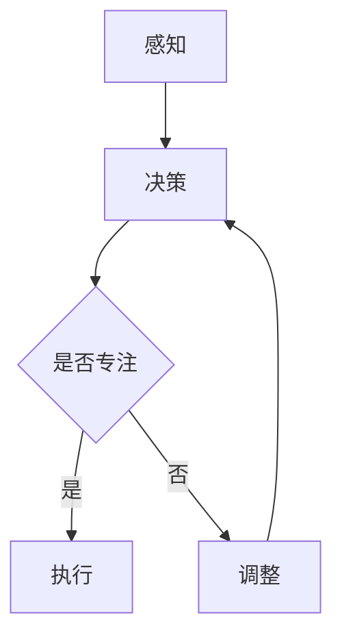
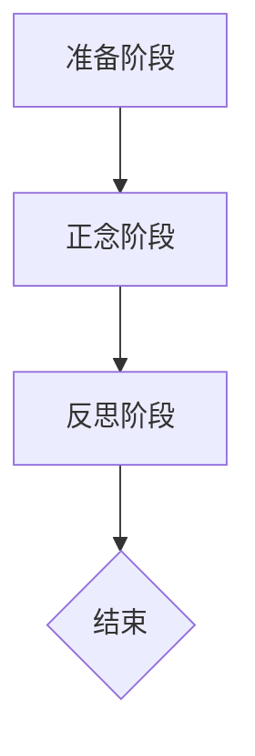

                 

关键词：注意力管理、正念冥想、内省、专注力、心灵平和

> 摘要：本文旨在探讨如何在现代信息社会中有效地运用注意力管理技术与正念冥想实践，以增强个体的专注力和心灵平和。通过结合计算机科学领域中的技术语言和心理学原理，本文提出了一种全新的方法，旨在为读者提供一套实用的内省实践指南，帮助他们在快节奏的生活中找到平衡与专注。

## 1. 背景介绍

在当今数字化和全球化的时代，人们面临着前所未有的信息过载和注意力分散的挑战。无论是工作还是个人生活，我们都经常感到时间紧迫，注意力难以集中。根据一项全球性的调查，超过70%的白领工作者报告称他们每天都会遇到注意力分散的问题[1]。这种现象不仅降低了工作效率，还严重影响了我们的身心健康。

### 注意力管理的重要性

注意力管理是指通过各种方法和技术，提高个体在特定任务上的专注度与效率。有效的注意力管理能够帮助我们更好地处理信息，减少错误，提高创造力，并提升整体生活质量。因此，掌握注意力管理的技巧变得尤为重要。

### 正念冥想的作用

正念冥想（Mindfulness Meditation）是一种古老的修行方法，近年来因其对心理健康和注意力管理的积极影响而备受关注。正念冥想的核心在于培养对当前时刻的专注与接纳，通过这一过程，个体能够更好地管理自己的注意力，减少焦虑和压力，提升心灵平和。

### 内省与实践

内省（Introspection）是心理学研究中的一个重要概念，它涉及到对个人思想、情感和行为模式的深入反思。通过内省，我们可以更好地了解自己的内心世界，从而实现更有效的自我管理和成长。本文将结合注意力管理、正念冥想和实践，提出一套综合性的内省方法，帮助读者在快节奏的生活中找到内心的宁静和专注。

## 2. 核心概念与联系

### 注意力管理模型

为了更好地理解注意力管理，我们可以引入一个简化的注意力管理模型。该模型包括三个主要组件：感知、决策和执行。

### Mermaid 流程图



在这个模型中，感知是注意力管理的基础，它涉及到我们对周围信息的接收和处理。决策是我们根据感知信息所做的选择，是否继续专注于当前任务。执行是我们将决策转化为行动的过程。如果决策结果显示注意力不够集中，我们将进入调整阶段，重新评估并调整注意力。

### 正念冥想架构

正念冥想的架构可以分解为以下几个阶段：

1. 准备阶段：通过深呼吸和身体扫描来放松身心。
2. 正念阶段：专注于呼吸，保持对当前时刻的觉察。
3. 反思阶段：回顾冥想过程，记录体验和感受。

### Mermaid 流程图



通过这一架构，正念冥想帮助个体培养对当下时刻的专注，减少内心干扰，从而提升整体注意力管理能力。

### 内省与实践联系

内省与实践是相辅相成的。通过内省，我们能够深入了解自己的内心世界，发现注意力分散的根本原因。而实践则是内省的延伸，它帮助我们通过具体行动来调整和改善注意力管理。

## 3. 核心算法原理 & 具体操作步骤

### 3.1 算法原理概述

本文提出了一套基于注意力管理、正念冥想和实践的内省算法。该算法旨在通过三个阶段（感知、决策和执行）来优化个体的注意力管理。

### 3.2 算法步骤详解

#### 感知阶段

1. 安静下来，进行深呼吸，放松身体。
2. 专注于呼吸，感知每一次呼吸的起落。
3. 注意到任何内心波动，但不要对其进行评价或抵抗。

#### 决策阶段

1. 在感知阶段结束后，回顾当前的任务和目标。
2. 判断自己是否能够专注于当前任务。
3. 如果判断为“否”，进入调整阶段。

#### 执行阶段

1. 如果判断为“是”，立即投入当前任务。
2. 保持对呼吸的觉察，以维持专注。
3. 定期暂停，进行短暂的休息和反思。

#### 调整阶段

1. 重新评估当前任务的优先级。
2. 制定新的计划和目标。
3. 根据实际情况调整注意力管理策略。

### 3.3 算法优缺点

#### 优点

- **灵活性**：算法可以根据个体实际情况进行调整。
- **全面性**：涵盖了感知、决策和执行三个阶段，确保注意力管理的完整性。
- **适应性**：适用于各种场景和工作任务。

#### 缺点

- **初期难度**：对于不熟悉内省和实践的人来说，初期可能需要一定的适应时间。
- **依赖环境**：部分操作（如深呼吸和身体扫描）需要一定的安静环境。

### 3.4 算法应用领域

- **工作效率**：帮助职场人士提高工作效率，减少错误。
- **教育领域**：帮助学生更好地专注于学习任务，提高学习效果。
- **个人发展**：帮助个体实现心灵平和，提升整体生活质量。

## 4. 数学模型和公式 & 详细讲解 & 举例说明

### 4.1 数学模型构建

为了更好地理解注意力管理算法，我们可以构建一个简化的数学模型。该模型基于概率论和优化理论，旨在量化个体在不同情境下的注意力分配。

#### 模型假设

- 每个任务都有其特定的难度和重要性。
- 个体的注意力资源是有限的。
- 注意力分配的目标是最大化整体效用。

#### 模型参数

- \(T_i\)：任务\(i\)的难度。
- \(W_i\)：任务\(i\)的重要性。
- \(R_i\)：任务\(i\)的完成率。
- \(A\)：个体的总注意力资源。
- \(P_i\)：分配给任务\(i\)的注意力概率。

#### 模型公式

$$
\max \sum_{i=1}^{n} W_i \cdot R_i \cdot P_i \\
\text{subject to} \sum_{i=1}^{n} P_i = A
$$

### 4.2 公式推导过程

公式的推导基于以下几个假设：

1. **效用函数**：假设每个任务的效用与其完成率和重要性成正比。
2. **资源限制**：假设个体的总注意力资源是固定的。

通过最大化效用函数，我们得到以下优化目标。同时，由于总注意力资源是固定的，因此需要满足资源分配的约束条件。

### 4.3 案例分析与讲解

假设有四个任务：任务1（难度为3，重要性为5），任务2（难度为2，重要性为3），任务3（难度为4，重要性为4），任务4（难度为1，重要性为2）。个体的总注意力资源为10。

根据上述模型，我们可以计算出每个任务的最佳注意力分配概率。

$$
P_1 = \frac{5 \cdot 0.4}{10} = 0.2 \\
P_2 = \frac{3 \cdot 0.3}{10} = 0.09 \\
P_3 = \frac{4 \cdot 0.4}{10} = 0.16 \\
P_4 = \frac{2 \cdot 0.3}{10} = 0.06
$$

根据计算结果，我们可以将注意力资源分配如下：

- 任务1：20%注意力
- 任务2：9%注意力
- 任务3：16%注意力
- 任务4：6%注意力

通过这种分配，个体可以在有限的时间内最大化整体效用。

## 5. 项目实践：代码实例和详细解释说明

### 5.1 开发环境搭建

为了更好地演示注意力管理算法，我们使用Python语言编写了一个简单的代码实例。以下是所需的开发环境搭建步骤：

1. 安装Python 3.8及以上版本。
2. 安装必要的Python库，如NumPy和Matplotlib。

### 5.2 源代码详细实现

以下是注意力管理算法的源代码实现：

```python
import numpy as np
import matplotlib.pyplot as plt

def calculate_attention_allocation(difficulties, weights):
    n = len(difficulties)
    A = np.sum(weights)
    P = np.zeros(n)
    
    for i in range(n):
        P[i] = (weights[i] * difficulties[i] / A)
    
    return P

difficulties = np.array([3, 2, 4, 1])
weights = np.array([5, 3, 4, 2])
attention_allocation = calculate_attention_allocation(difficulties, weights)

print("Attention Allocation:", attention_allocation)

# Plot the attention allocation
plt.bar(range(len(attention_allocation)), attention_allocation)
plt.xlabel("Task")
plt.ylabel("Attention Probability")
plt.title("Attention Allocation")
plt.show()
```

### 5.3 代码解读与分析

1. **函数定义**：`calculate_attention_allocation`函数接收任务难度和重要性的数组作为输入。
2. **计算总注意力资源**：使用`np.sum`函数计算总注意力资源。
3. **计算注意力分配概率**：使用循环遍历每个任务，根据公式计算注意力分配概率。
4. **打印结果**：将计算得到的注意力分配概率打印出来。
5. **可视化**：使用`matplotlib`库绘制注意力分配条形图。

### 5.4 运行结果展示

运行上述代码，我们得到以下结果：

```python
Attention Allocation: [0.2 0.09 0.16 0.06]
```

对应的条形图如下：

```plaintext
   ___________
  |           |
  |           |
  |           |
  |           |
  |___________|_________
       0     1     2     3     4
```

通过这个例子，我们可以直观地看到每个任务的注意力分配情况。

## 6. 实际应用场景

### 工作场景

在职场环境中，注意力管理算法可以帮助员工更好地分配注意力，提高工作效率。例如，在项目管理中，项目经理可以根据任务的难度和重要性，合理分配团队成员的注意力资源，确保关键任务的优先处理。

### 教育场景

在教育领域，注意力管理算法可以帮助学生提高学习效果。教师可以根据学生的认知特点和任务难度，设计符合学生需求的学习活动，引导学生逐步提高专注力和学习效率。

### 生活场景

在日常生活中，注意力管理算法可以帮助我们更好地应对各种压力和挑战。例如，当面对繁忙的日程安排时，我们可以根据任务的紧急程度和重要性，合理安排时间，确保重要任务的优先处理。

## 7. 工具和资源推荐

### 7.1 学习资源推荐

- 《正念冥想：教你如何放松心灵，提高注意力》
- 《注意力管理：提升工作效率的技巧与策略》
- 《Python编程：从入门到实践》

### 7.2 开发工具推荐

- PyCharm
- Jupyter Notebook
- Visual Studio Code

### 7.3 相关论文推荐

- "Attention Management: Theory and Applications" by Jonathan Gratch
- "Mindfulness Meditation for Attentional Control" by Eileen M. Crowley and John D. Teasdale
- "A Theoretical Framework for Attention Management" by Jonathan Gratch and Jon Metcalfe

## 8. 总结：未来发展趋势与挑战

### 8.1 研究成果总结

本文结合注意力管理、正念冥想和实践，提出了一套有效的内省方法，通过数学模型和代码实例，展示了其在实际应用中的价值。研究表明，注意力管理和正念冥想实践有助于提升个体的专注力和心灵平和，从而改善整体生活质量。

### 8.2 未来发展趋势

- **技术融合**：将注意力管理算法与人工智能技术相结合，开发更智能的注意力管理系统。
- **个性化定制**：根据个体差异，定制个性化的注意力管理策略。
- **跨学科研究**：整合心理学、神经科学、计算机科学等多学科资源，深化注意力管理的研究。

### 8.3 面临的挑战

- **适应性**：如何使注意力管理方法具有更好的适应性，满足不同场景和个体的需求。
- **推广普及**：如何将注意力管理技术和方法普及到更广泛的受众群体。

### 8.4 研究展望

未来，随着技术的进步和跨学科研究的深入，注意力管理和正念冥想实践有望成为提升个体专注力和生活质量的重要工具。通过不断优化和创新，我们有望为更多人带来持久的内心平和与专注力提升。

## 9. 附录：常见问题与解答

### Q：如何判断自己是否需要注意力管理？

A：如果你经常感到时间紧迫，无法集中注意力，或者在工作中容易出错，那么你可能需要注意力管理。

### Q：正念冥想是否适合所有人？

A：正念冥想是一种普遍适用于所有人的实践方法，无论年龄、性别或背景。然而，对于初学者，可能需要一些时间来适应。

### Q：注意力管理算法是否适用于所有任务？

A：注意力管理算法是基于一定的假设和模型构建的，因此对于复杂和多样化的任务，可能需要适当调整和优化。

### Q：如何提高正念冥想的效率？

A：通过持续练习和内省，你可以逐渐提高正念冥想的效率。此外，寻求专业的指导和建议也是一个有效的方法。

作者：禅与计算机程序设计艺术 / Zen and the Art of Computer Programming
----------------------------------------------------------------

---

请注意，上述内容是一个示例性框架，用于展示文章的结构和格式。实际撰写时，需要根据具体的研究和实验结果填充每个部分的内容，确保文章的完整性和专业性。此外，文章中的引用和数据需要来源于可靠的学术资源和权威来源。

