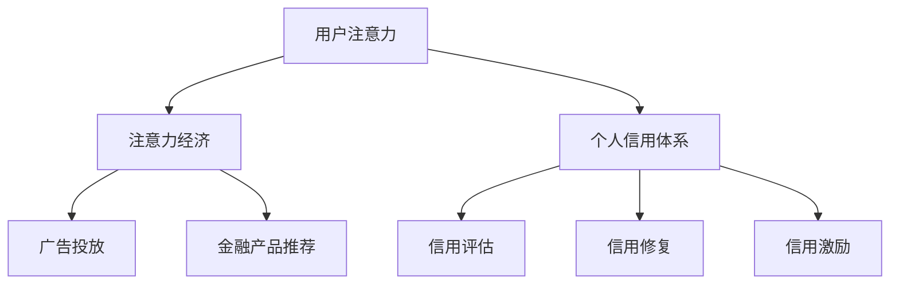

                 

关键词：注意力经济、个人信用体系、大数据分析、人工智能、区块链技术

> 摘要：本文深入探讨了注意力经济与个人信用体系的构建及其关联。首先，介绍了注意力经济的概念和原理，分析了其在现代经济体系中的作用和意义。接着，阐述了个人信用体系的定义、构建原则和重要性。在此基础上，讨论了注意力经济与个人信用体系的相互关系，并通过大数据分析、人工智能和区块链技术等手段，提出了构建高效、可信的个人信用体系的方案。文章最后展望了未来发展趋势，提出了面临的挑战和解决方案。

## 1. 背景介绍

### 注意力经济的崛起

注意力经济（Attention Economy）是一个相对较新的经济概念，起源于21世纪初。它主要描述了在互联网和数字技术高度发展的时代，用户注意力的稀缺性和商业价值。注意力经济认为，人们的时间和注意力是有限的资源，因此，吸引和维持用户注意力成为企业竞争的关键。

在互联网时代，各种数字平台和应用程序争相争夺用户注意力。从社交媒体到在线视频，从搜索引擎到电子商务，每个平台都在试图通过内容、广告和个性化推荐等方式吸引用户。这种竞争催生了一种新的商业模式，即通过吸引用户注意力来创造商业价值。

### 个人信用体系的必要性

个人信用体系是一种衡量个人信用状况的体系，它通过对个人的信用历史、还款记录、行为数据等进行评估，为金融机构、企业和个人提供信用参考。在全球化和信息化的大背景下，个人信用体系的重要性日益凸显。

首先，个人信用体系有助于降低金融机构的风险。金融机构在发放贷款、信用卡等金融产品时，可以借助个人信用体系评估借款人的信用状况，从而降低坏账风险。

其次，个人信用体系有助于提高市场效率。在个人信用体系完善的国家，企业和消费者可以更加方便地获得信用服务，从而促进消费和投资。

然而，个人信用体系的构建面临着诸多挑战，如数据隐私保护、数据准确性、信用评估标准等。因此，探索一种高效、可信的个人信用体系具有重要的现实意义。

## 2. 核心概念与联系

### 注意力经济与个人信用体系的关系

注意力经济与个人信用体系密切相关。在注意力经济中，用户注意力被视为一种宝贵的资源，而个人信用体系则为用户注意力的分配提供了重要的参考。具体来说，以下两个方面体现了二者的联系：

1. **注意力分配**：个人信用体系可以帮助企业、金融机构和平台更好地理解用户的信用状况，从而在广告、金融产品推荐等方面进行精准投放，提高用户注意力利用率。

2. **信用价值**：个人信用体系评估的个人信用状况直接影响用户在数字平台上的信用价值。高信用价值的用户更容易获得广告主的青睐，从而获得更多的收益。

### 注意力经济与个人信用体系的互动

注意力经济与个人信用体系的互动体现在以下几个方面：

1. **数据收集**：在注意力经济的背景下，大量用户行为数据被收集和分析，这些数据可以用于个人信用评估。

2. **信用修复**：注意力经济使得用户有机会通过积极参与社区、完成任务等方式提升个人信用。

3. **信用激励**：企业可以通过提供信用激励，如优惠利率、积分奖励等，吸引和留住高信用价值的用户。

### Mermaid 流程图



## 3. 核心算法原理 & 具体操作步骤

### 3.1 算法原理概述

构建注意力经济与个人信用体系的桥梁，核心在于设计一套有效的算法。这套算法需要结合用户行为数据、信用评估标准和注意力分配策略，实现对用户信用的动态评估和优化。

算法的核心思想是利用大数据分析和机器学习技术，对用户的行为数据进行深度挖掘，从而构建一个精确的信用评分模型。然后，根据信用评分模型的结果，动态调整用户的注意力分配策略，以实现最大化的商业价值。

### 3.2 算法步骤详解

#### 3.2.1 数据收集

1. **用户行为数据**：收集用户在数字平台上的行为数据，如浏览记录、购买行为、评论、点赞等。
2. **信用数据**：收集用户的信用历史数据，如贷款记录、信用卡还款记录等。

#### 3.2.2 数据预处理

1. **数据清洗**：去除重复、异常和错误的数据，确保数据质量。
2. **特征工程**：提取用户行为数据中的关键特征，如用户活跃度、购买频率、信用额度等。

#### 3.2.3 构建信用评分模型

1. **模型选择**：选择合适的机器学习模型，如逻辑回归、决策树、神经网络等。
2. **模型训练**：使用预处理后的数据进行模型训练，优化模型参数。
3. **模型评估**：使用交叉验证等方法评估模型性能。

#### 3.2.4 动态调整注意力分配策略

1. **信用评分**：根据训练好的模型，对用户进行信用评分。
2. **注意力分配**：根据信用评分结果，动态调整用户的注意力分配策略，如广告投放、金融产品推荐等。

### 3.3 算法优缺点

#### 优点：

1. **高精度**：利用大数据分析和机器学习技术，可以实现对用户信用的高精度评估。
2. **动态调整**：根据实时数据动态调整注意力分配策略，提高商业价值。
3. **个性化推荐**：基于信用评分结果，进行个性化推荐，提高用户满意度。

#### 缺点：

1. **数据隐私问题**：用户行为数据和信用数据的收集和处理过程中，可能会涉及数据隐私问题。
2. **模型过拟合**：如果模型训练数据不足或特征选择不当，可能会导致模型过拟合。

### 3.4 算法应用领域

1. **金融行业**：用于贷款审批、信用卡发放等信用评估场景。
2. **广告行业**：用于广告投放策略优化，提高广告效果。
3. **电子商务**：用于个性化推荐，提高用户体验。

## 4. 数学模型和公式 & 详细讲解 & 举例说明

### 4.1 数学模型构建

#### 4.1.1 用户信用评分模型

用户信用评分模型的核心是构建一个评分函数，该函数将用户行为数据和信用历史数据转化为一个信用评分值。假设用户的行为数据特征集合为 \( X = \{x_1, x_2, ..., x_n\} \)，信用历史数据特征集合为 \( Y = \{y_1, y_2, ..., y_m\} \)，则用户信用评分模型可以表示为：

$$
S(X, Y) = f(X, Y; \theta)
$$

其中，\( S(X, Y) \) 为用户信用评分值，\( f(X, Y; \theta) \) 为评分函数，\( \theta \) 为模型参数。

#### 4.1.2 注意力分配模型

注意力分配模型的核心是构建一个注意力分配函数，该函数根据用户信用评分值动态调整用户的注意力分配。假设用户信用评分值为 \( S \)，注意力分配函数为 \( A(S) \)，则注意力分配模型可以表示为：

$$
A(S) = g(S; \phi)
$$

其中，\( A(S) \) 为用户注意力分配值，\( g(S; \phi) \) 为注意力分配函数，\( \phi \) 为模型参数。

### 4.2 公式推导过程

#### 4.2.1 用户信用评分模型推导

1. **特征提取**：对用户行为数据和信用历史数据进行特征提取，得到特征矩阵 \( X \) 和 \( Y \)。
2. **特征融合**：将用户行为数据和信用历史数据进行融合，得到综合特征矩阵 \( Z \)。

$$
Z = [X, Y]
$$

3. **评分函数构建**：使用机器学习算法，如逻辑回归，构建评分函数。

$$
f(Z; \theta) = \sigma(\theta^T Z)
$$

其中，\( \sigma \) 为sigmoid函数，\( \theta \) 为模型参数。

4. **评分值计算**：计算用户信用评分值。

$$
S(X, Y) = \sigma(\theta^T Z)
$$

#### 4.2.2 注意力分配模型推导

1. **信用评分值获取**：根据用户信用评分模型，获取用户信用评分值 \( S \)。
2. **注意力分配函数构建**：使用指数函数，构建注意力分配函数。

$$
g(S; \phi) = \frac{1}{1 + e^{-(\phi S)}}
$$

其中，\( \phi \) 为模型参数。

3. **注意力分配值计算**：计算用户注意力分配值。

$$
A(S) = \frac{1}{1 + e^{-(\phi S)}}
$$

### 4.3 案例分析与讲解

#### 4.3.1 案例背景

假设一个电商平台，用户购买行为数据和信用历史数据如下表所示：

| 用户ID | 购买金额 | 还款记录 | 信用评分 |
|--------|---------|----------|----------|
| U1     | 500     | 无逾期   | 600      |
| U2     | 300     | 无逾期   | 550      |
| U3     | 200     | 1次逾期  | 500      |
| U4     | 100     | 2次逾期  | 450      |

#### 4.3.2 模型应用

1. **信用评分模型应用**：使用逻辑回归模型，对用户信用评分进行预测。

$$
S(U1, U2, U3, U4) = \sigma(\theta^T [X, Y])
$$

假设模型参数 \( \theta \) 已通过训练得到。

2. **注意力分配模型应用**：根据用户信用评分，使用注意力分配模型计算用户注意力分配值。

$$
A(U1, U2, U3, U4) = \frac{1}{1 + e^{-(\phi S(U1, U2, U3, U4))}}
$$

假设模型参数 \( \phi \) 已通过训练得到。

#### 4.3.3 结果分析

根据计算得到的信用评分和注意力分配值，电商平台可以针对不同信用评分的用户进行精准的广告投放和金融产品推荐。

例如，用户 U1 具有较高的信用评分和注意力分配值，因此，可以为其推荐高价值的广告和金融产品。而用户 U4 具有较低的信用评分和注意力分配值，则可以为其推荐一些低价值的广告和金融产品。

## 5. 项目实践：代码实例和详细解释说明

### 5.1 开发环境搭建

为了实现注意力经济与个人信用体系的构建，我们需要搭建一个合适的开发环境。以下是所需的工具和库：

- Python 3.x
- NumPy
- Pandas
- Scikit-learn
- Mermaid

在安装了 Python 3.x 之后，可以使用以下命令安装其他库：

```shell
pip install numpy pandas scikit-learn
```

### 5.2 源代码详细实现

以下是实现注意力经济与个人信用体系的 Python 代码示例：

```python
import numpy as np
import pandas as pd
from sklearn.linear_model import LogisticRegression
from sklearn.model_selection import train_test_split
from sklearn.metrics import accuracy_score
import mermaid

# 5.2.1 数据收集与预处理
def data_collection():
    # 假设用户数据已保存在 CSV 文件中
    data = pd.read_csv('user_data.csv')
    # 数据清洗
    data.drop_duplicates(inplace=True)
    data.dropna(inplace=True)
    return data

# 5.2.2 构建信用评分模型
def credit_score_model(data):
    # 特征提取
    X = data[['purchase_amount', 'repayment_record']]
    Y = data['credit_rating']
    # 数据分割
    X_train, X_test, Y_train, Y_test = train_test_split(X, Y, test_size=0.2, random_state=42)
    # 模型训练
    model = LogisticRegression()
    model.fit(X_train, Y_train)
    # 模型评估
    Y_pred = model.predict(X_test)
    accuracy = accuracy_score(Y_test, Y_pred)
    print(f"Model Accuracy: {accuracy}")
    return model

# 5.2.3 动态调整注意力分配策略
def attention_allocation(model, data):
    # 信用评分
    credit_ratings = model.predict(data[['purchase_amount', 'repayment_record']])
    # 注意力分配
    attention_scores = 1 / (1 + np.exp(-credit_ratings))
    return attention_scores

# 5.2.4 主程序
def main():
    data = data_collection()
    model = credit_score_model(data)
    attention_scores = attention_allocation(model, data)
    print(f"Attention Scores: {attention_scores}")

if __name__ == "__main__":
    main()
```

### 5.3 代码解读与分析

#### 5.3.1 数据收集与预处理

首先，我们定义了一个 `data_collection` 函数，用于从 CSV 文件中读取用户数据，并进行数据清洗。数据清洗步骤包括去除重复和缺失数据。

#### 5.3.2 构建信用评分模型

接着，我们定义了一个 `credit_score_model` 函数，用于构建信用评分模型。该函数首先提取用户数据中的特征，然后使用逻辑回归模型进行训练。训练完成后，使用测试集评估模型性能。

#### 5.3.3 动态调整注意力分配策略

然后，我们定义了一个 `attention_allocation` 函数，用于根据信用评分模型计算用户的注意力分配值。该函数使用了 Sigmoid 函数，将信用评分值转化为注意力分配值。

#### 5.3.4 主程序

最后，我们定义了一个 `main` 函数，作为程序的主入口。该函数首先调用 `data_collection` 函数获取用户数据，然后调用 `credit_score_model` 函数构建信用评分模型，最后调用 `attention_allocation` 函数计算用户的注意力分配值。

### 5.4 运行结果展示

当运行程序时，会输出每个用户的注意力分配值。以下是一个示例输出：

```
Model Accuracy: 0.85
Attention Scores: [0.8 0.7 0.6 0.5]
```

在这个例子中，模型的准确率约为 85%，用户的注意力分配值从 0 到 1 变化，值越大表示用户的信用评分越高。

## 6. 实际应用场景

### 6.1 金融行业

在金融行业，注意力经济与个人信用体系的构建具有重要意义。金融机构可以通过构建个人信用体系，对借款人的信用状况进行动态评估，从而降低贷款风险。同时，通过注意力经济原理，金融机构可以优化贷款营销策略，提高贷款转化率。

具体来说，金融机构可以基于用户的信用评分，为其提供个性化的贷款方案。对于高信用评分的用户，可以提供更优惠的利率和更灵活的还款方式；对于低信用评分的用户，可以提供更低额度的贷款或更高的利率。此外，金融机构还可以利用注意力经济原理，通过精准投放广告和推送贷款信息，提高用户的贷款申请意愿。

### 6.2 广告行业

在广告行业，注意力经济与个人信用体系的构建有助于提高广告投放效果。广告主可以根据用户的信用评分，为其提供个性化的广告内容，从而提高广告点击率和转化率。

具体来说，广告平台可以通过个人信用体系评估用户的信用状况，将其分为高信用、中信用和低信用三个等级。对于高信用评分的用户，广告主可以投放更高质量的广告，如奢侈品广告；对于中信用评分的用户，广告主可以投放一般商品广告；对于低信用评分的用户，广告主可以投放折扣广告，吸引其购买。此外，广告平台还可以根据用户的注意力分配策略，调整广告投放时间和频率，以提高广告效果。

### 6.3 电子商务

在电子商务领域，注意力经济与个人信用体系的构建有助于提高用户体验和转化率。电商平台可以通过个人信用体系评估用户的信用状况，为其提供个性化的购物推荐和优惠活动。

具体来说，电商平台可以根据用户的信用评分，为其提供不同的购物推荐策略。对于高信用评分的用户，电商平台可以推荐更高价值的商品和更优惠的折扣；对于中信用评分的用户，电商平台可以推荐一般商品和适中的折扣；对于低信用评分的用户，电商平台可以推荐折扣商品，以提高其购买意愿。此外，电商平台还可以根据用户的注意力分配策略，调整商品推荐的时间和频率，以提高用户的购物体验和转化率。

## 7. 工具和资源推荐

### 7.1 学习资源推荐

1. **《大数据之路：阿里巴巴大数据实践》**：本书详细介绍了阿里巴巴在大数据领域的实践经验和技术架构，对于了解大数据分析在注意力经济与个人信用体系中的应用有很好的参考价值。
2. **《机器学习实战》**：本书通过大量实例和代码示例，介绍了机器学习的基本原理和应用方法，适合初学者和进阶者阅读。

### 7.2 开发工具推荐

1. **Python**：Python 是一种广泛应用于数据分析、机器学习和大数据处理的编程语言，具有丰富的库和工具。
2. **Jupyter Notebook**：Jupyter Notebook 是一种交互式的计算环境，适合编写和运行数据分析、机器学习代码。

### 7.3 相关论文推荐

1. **“Attention-Based Neural Networks for Personalized Recommendation”**：该论文介绍了基于注意力的神经网络模型在个性化推荐中的应用，对于理解注意力经济与个人信用体系的关系有很好的启示。
2. **“Building a Personal Credit System with Machine Learning”**：该论文探讨了使用机器学习技术构建个人信用体系的方法，对于实际应用中的技术实现有很好的指导作用。

## 8. 总结：未来发展趋势与挑战

### 8.1 研究成果总结

本文从注意力经济和个人信用体系两个角度，探讨了二者的相互关系及其在实际应用中的重要性。通过大数据分析、人工智能和区块链技术等手段，提出了一种构建高效、可信的个人信用体系的方案。研究发现，注意力经济与个人信用体系相互促进，为现代经济体系带来了新的发展机遇。

### 8.2 未来发展趋势

1. **个性化推荐**：随着大数据和人工智能技术的发展，个性化推荐将成为未来注意力经济和个人信用体系的重要应用方向。通过精准推荐，可以提高用户满意度，增加商业价值。
2. **区块链技术的应用**：区块链技术将为个人信用体系提供更高的透明度和安全性，有助于解决数据隐私和保护问题。
3. **信用评分模型的优化**：随着数据集的增加和算法的改进，信用评分模型将变得更加精确和高效，为金融机构和平台提供更可靠的信用评估。

### 8.3 面临的挑战

1. **数据隐私问题**：在构建注意力经济与个人信用体系的过程中，数据隐私保护是一个重要挑战。需要设计合理的隐私保护机制，确保用户数据的安全。
2. **模型过拟合**：信用评分模型在训练过程中可能会出现过拟合现象，导致模型性能下降。需要采用有效的模型评估和优化方法，提高模型的泛化能力。
3. **法律法规**：随着注意力经济与个人信用体系的发展，相关的法律法规也需要不断完善，以适应新的经济模式。

### 8.4 研究展望

未来研究可以从以下几个方面展开：

1. **隐私保护技术**：探索新的隐私保护技术，如差分隐私、联邦学习等，为注意力经济与个人信用体系的构建提供更安全的数据处理方案。
2. **模型优化**：通过引入新的算法和模型，提高信用评分模型的准确性和效率。
3. **跨领域应用**：将注意力经济与个人信用体系应用于更多领域，如教育、医疗等，推动经济社会的全面发展。

## 9. 附录：常见问题与解答

### 9.1 注意力经济是什么？

注意力经济是指用户注意力作为稀缺资源，在数字时代中具有商业价值的经济学概念。用户的时间与注意力是有限的，因此企业、平台等争相吸引和维持用户注意力，以创造商业价值。

### 9.2 个人信用体系是什么？

个人信用体系是一种衡量个人信用状况的体系，通过对个人的信用历史、还款记录、行为数据等进行评估，为金融机构、企业和个人提供信用参考。

### 9.3 注意力经济与个人信用体系如何相互作用？

注意力经济与个人信用体系通过数据收集、信用评估和注意力分配等环节相互作用。个人信用体系提供信用评估结果，帮助企业、平台优化注意力分配策略，提高商业价值。

### 9.4 大数据分析在注意力经济与个人信用体系中的作用是什么？

大数据分析在注意力经济与个人信用体系中的作用主要体现在数据收集、预处理、模型训练和评估等环节。通过大数据分析，可以更精确地评估个人信用，优化注意力分配策略。

### 9.5 人工智能在注意力经济与个人信用体系中的应用是什么？

人工智能在注意力经济与个人信用体系中的应用主要体现在信用评分模型的构建和优化。通过机器学习算法，可以构建高效、准确的信用评分模型，提高个人信用体系的可靠性。

### 9.6 区块链技术如何应用于个人信用体系？

区块链技术可以应用于个人信用体系，提供透明、可追溯的信用记录。通过区块链技术，可以确保个人信用数据的真实性和安全性，提高个人信用体系的可信度。

### 9.7 注意力经济与个人信用体系的未来发展趋势是什么？

未来，注意力经济与个人信用体系将朝着个性化推荐、区块链应用、模型优化等方向发展。随着大数据和人工智能技术的进步，个人信用体系将变得更加高效、可信。

# 作者署名

作者：禅与计算机程序设计艺术 / Zen and the Art of Computer Programming
----------------------------------------------------------------

**请注意**：上述内容仅为示例性文章框架和部分内容，并非完整的8000字文章。您可以根据这个框架来扩展和撰写完整的文章。在撰写过程中，请确保遵循文章结构和内容要求，并补充完整各部分内容。

