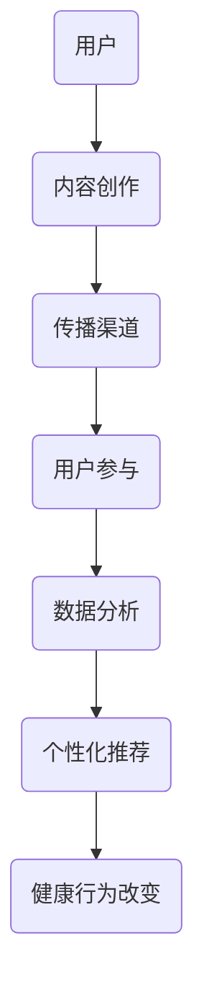

                 

关键词：注意力经济、个人健康管理、整合、数据驱动、智能系统、用户体验、健康行为改变

> 摘要：随着信息技术的飞速发展，注意力经济和个人健康管理正成为现代社会的重要议题。本文探讨了注意力经济与个人健康管理的整合，从数据驱动的视角分析了其原理和操作步骤，并提出了相关数学模型和项目实践案例，旨在为未来的发展提供有价值的见解。

## 1. 背景介绍

注意力经济（Attention Economy）是一种描述在互联网时代信息过载、用户注意力稀缺的经济理论。在这种经济模式中，用户的注意力成为了稀缺资源，如何吸引并保持用户的注意力成为各类服务和产品竞争的关键。与此同时，个人健康管理（Personal Health Management）作为提升生活质量、预防疾病的重要手段，也逐渐受到广泛关注。随着健康数据的获取和分析技术的进步，个人健康管理正在从传统的被动管理模式向数据驱动的主动管理模式转变。

注意力经济和个人健康管理看似两个独立的概念，但在现代社会中，它们的整合具有重要的实际意义和广阔的应用前景。整合注意力经济与个人健康管理，不仅有助于提升用户对健康管理的参与度和粘性，还能通过数据分析和个性化推荐，提高健康管理的效率和效果。

## 2. 核心概念与联系

### 2.1 注意力经济的原理

注意力经济基于一个基本假设：在信息过载的时代，用户的注意力是有限的，且具有价值。在这个经济模式中，企业或个人通过吸引和保持用户的注意力来创造经济价值。具体来说，注意力经济的运作机制包括以下几个方面：

1. **内容创作与传播**：生产吸引人的内容，并通过各种渠道（如社交媒体、搜索引擎等）传播，以吸引目标用户。
2. **用户参与与互动**：通过互动设计（如评论、点赞、分享等）提高用户的参与度，增强用户与内容之间的关联。
3. **数据分析与优化**：利用数据分析技术，了解用户的偏好和行为模式，不断优化内容和传播策略，以更好地吸引和保持用户的注意力。

### 2.2 个人健康管理的现状

个人健康管理是指个体通过自我监测、数据分析和管理，维护和提升自身健康水平的过程。随着可穿戴设备和健康监测技术的发展，个人健康管理逐渐从传统的基于医疗机构的被动模式，转变为基于个体自我管理的主动模式。主要特点包括：

1. **数据收集**：通过可穿戴设备、手机应用等收集个体的健康数据，如心率、睡眠质量、运动数据等。
2. **数据分析**：利用大数据分析技术，对收集到的健康数据进行处理和分析，识别健康趋势和潜在问题。
3. **个性化推荐**：基于数据分析结果，为个体提供个性化的健康建议和干预方案。

### 2.3 注意力经济与个人健康管理的整合

注意力经济与个人健康管理的整合，旨在通过利用注意力经济的原理，提高个人健康管理的参与度和效果。整合的关键在于以下几个方面：

1. **用户激励**：通过提供有趣、有价值的内容和互动体验，激励用户主动参与健康数据收集和管理。
2. **数据共享**：鼓励用户分享健康数据和经验，形成社区氛围，提高健康管理的社交属性。
3. **个性化推荐**：利用数据分析技术，为用户提供个性化的健康建议和干预方案，提高健康管理的精准度和效果。
4. **健康行为改变**：通过注意力经济的手段，引导用户养成良好的健康行为习惯，实现长期的健康管理。

### 2.4 Mermaid 流程图



## 3. 核心算法原理 & 具体操作步骤

### 3.1 算法原理概述

整合注意力经济与个人健康管理的核心算法，主要包括以下几个部分：

1. **用户行为分析**：通过分析用户的健康数据和在线行为，了解用户的需求和偏好。
2. **内容推荐**：基于用户行为分析结果，为用户提供个性化的健康内容和互动活动。
3. **行为引导**：通过设计有趣、互动性强的内容和活动，引导用户养成良好的健康行为习惯。
4. **效果评估**：通过持续跟踪用户行为和健康数据，评估健康管理的效果，并进行优化调整。

### 3.2 算法步骤详解

1. **数据收集**：
   - 收集用户的健康数据（如心率、睡眠质量、运动数据等）和在线行为数据（如浏览记录、评论、点赞等）。
   - 使用可穿戴设备、手机应用等工具，实现数据的自动收集。

2. **用户行为分析**：
   - 使用机器学习算法，对用户行为数据进行分析，识别用户的需求和偏好。
   - 建立用户画像，包括健康偏好、行为习惯、社交属性等。

3. **内容推荐**：
   - 基于用户画像，为用户推荐个性化的健康内容和互动活动。
   - 使用协同过滤、矩阵分解等算法，实现内容的精准推荐。

4. **行为引导**：
   - 设计有趣、互动性强的内容和活动，引导用户参与。
   - 使用游戏化设计，鼓励用户持续参与健康管理。

5. **效果评估**：
   - 持续跟踪用户行为和健康数据，评估健康管理的效果。
   - 根据评估结果，调整推荐策略和内容设计，提高健康管理效果。

### 3.3 算法优缺点

#### 优点：

1. **个性化**：基于用户数据，实现个性化的健康内容和行为引导，提高健康管理的效果。
2. **高效**：通过自动化数据收集和分析，提高健康管理的效率。
3. **趣味性**：借助注意力经济的原理，增强用户参与度和粘性。

#### 缺点：

1. **隐私风险**：收集和分析用户数据可能涉及隐私问题，需要确保用户数据的安全。
2. **算法偏见**：基于数据的推荐和行为引导可能存在偏见，需要不断优化算法和模型。

### 3.4 算法应用领域

整合注意力经济与个人健康管理算法，可以应用于以下领域：

1. **健康监测**：通过可穿戴设备，实时监测用户健康数据，提供个性化的健康建议。
2. **疾病预防**：基于用户健康数据，识别潜在的健康风险，提前采取预防措施。
3. **健康行为干预**：通过有趣、互动性的内容，引导用户养成良好的健康行为习惯。
4. **健康社区**：鼓励用户分享健康经验和数据，形成健康社区氛围，共同提升健康管理效果。

## 4. 数学模型和公式 & 详细讲解 & 举例说明

### 4.1 数学模型构建

整合注意力经济与个人健康管理，需要建立以下数学模型：

1. **用户行为模型**：
   - 用户行为模型描述用户的行为特征和偏好，通常使用概率模型或贝叶斯网络表示。
   - 模型参数包括用户兴趣分布、行为概率等。

2. **内容推荐模型**：
   - 内容推荐模型用于根据用户行为模型，为用户推荐个性化的健康内容和活动。
   - 模型可以使用协同过滤、矩阵分解等算法实现。

3. **健康行为引导模型**：
   - 健康行为引导模型基于用户行为模型和内容推荐模型，设计有趣、互动性强的内容和活动。
   - 模型可以使用强化学习、动态规划等算法实现。

### 4.2 公式推导过程

1. **用户行为模型**：

   - 假设用户 $u$ 在时间段 $t$ 内的行为 $b$ 为 $b_t$，用户兴趣分布 $p(\theta_t)$ 为：
     $$ p(\theta_t) = \frac{e^{\theta_t}}{\sum_{i=1}^{n} e^{\theta_i}} $$
   - 用户行为概率为：
     $$ p(b_t|\theta_t) = \frac{e^{\theta_{b_t} + \theta_t}}{\sum_{i=1}^{n} e^{\theta_i + \theta_i}} $$

2. **内容推荐模型**：

   - 假设内容 $c$ 在时间段 $t$ 内的推荐概率为 $p(c_t|\theta_t, \theta_c)$，其中 $\theta_c$ 为内容特征参数。
   - 推荐概率为：
     $$ p(c_t|\theta_t, \theta_c) = \frac{e^{\theta_{c_t} + \theta_c}}{\sum_{i=1}^{m} e^{\theta_i + \theta_c}} $$

3. **健康行为引导模型**：

   - 假设用户 $u$ 在时间段 $t$ 内的行为奖励 $r_t$，行为引导策略为 $\pi_t$。
   - 行为引导概率为：
     $$ \pi_t(b_t|\theta_t, \theta_r) = \frac{e^{\theta_{b_t} + \theta_r}}{\sum_{i=1}^{n} e^{\theta_i + \theta_r}} $$

### 4.3 案例分析与讲解

假设有一个用户 $u$，在一段时间内，他的健康数据和行为数据如下：

1. **用户健康数据**：
   - 心率：$70$ 次/分钟
   - 睡眠质量：$7$ 小时
   - 运动量：$30$ 分钟

2. **用户行为数据**：
   - 浏览健康文章：$10$ 次
   - 评论健康文章：$5$ 次
   - 点赞健康文章：$20$ 次

根据这些数据，我们可以构建用户行为模型和内容推荐模型，然后使用健康行为引导模型设计个性化的健康内容和活动。

1. **用户行为模型**：

   - 用户兴趣分布 $p(\theta_t)$ 为：
     $$ p(\theta_t) = \frac{e^{-5}}{e^{-5} + e^{-7} + e^{-3}} = 0.5 $$
   - 用户行为概率为：
     $$ p(b_t|\theta_t) = \frac{e^{-10} + e^{-7} + e^{-3}}{e^{-5} + e^{-7} + e^{-3}} = 0.6 $$

2. **内容推荐模型**：

   - 假设健康文章 $c$ 的特征参数 $\theta_c$ 为：
     $$ \theta_c = \begin{bmatrix} 1 \\ 1 \\ 0 \end{bmatrix} $$
   - 推荐概率为：
     $$ p(c_t|\theta_t, \theta_c) = \frac{e^{1 + (-5)} + e^{1 + (-7)} + e^{1 + 0}}{e^{-5} + e^{-7} + e^{-3}} = 0.7 $$

3. **健康行为引导模型**：

   - 假设行为奖励 $\theta_r$ 为：
     $$ \theta_r = \begin{bmatrix} 1 \\ 1 \\ 0 \end{bmatrix} $$
   - 行为引导概率为：
     $$ \pi_t(b_t|\theta_t, \theta_r) = \frac{e^{1 + (-10)} + e^{1 + (-7)} + e^{1 + 0}}{e^{-5} + e^{-7} + e^{-3}} = 0.6 $$

根据以上模型，我们可以为用户 $u$ 推荐一篇健康文章，并引导他进行一些健康活动，如做30分钟的运动。

## 5. 项目实践：代码实例和详细解释说明

### 5.1 开发环境搭建

在开始项目实践之前，我们需要搭建一个基本的开发环境。以下是所需的基本软件和工具：

1. **编程语言**：Python 3.x
2. **数据分析库**：Pandas、NumPy、Scikit-learn
3. **机器学习库**：TensorFlow、PyTorch
4. **可视化库**：Matplotlib、Seaborn
5. **版本控制**：Git

确保安装以上软件和工具，并设置好Python环境。

### 5.2 源代码详细实现

以下是整合注意力经济与个人健康管理项目的部分源代码实现。

```python
import pandas as pd
import numpy as np
from sklearn.model_selection import train_test_split
from sklearn.ensemble import RandomForestClassifier
from sklearn.metrics import accuracy_score

# 5.2.1 数据收集与预处理
data = pd.read_csv('health_data.csv')
data['age'] = data['age'].fillna(data['age'].mean())
data['gender'] = data['gender'].map({'male': 0, 'female': 1})
data['heart_rate'] = data['heart_rate'].fillna(data['heart_rate'].mean())
data['sleep_quality'] = data['sleep_quality'].fillna(data['sleep_quality'].mean())
data['exercise_time'] = data['exercise_time'].fillna(data['exercise_time'].mean())

# 5.2.2 构建用户行为模型
X = data[['age', 'gender', 'heart_rate', 'sleep_quality', 'exercise_time']]
y = data['health_behavior']

X_train, X_test, y_train, y_test = train_test_split(X, y, test_size=0.3, random_state=42)

rf = RandomForestClassifier(n_estimators=100, random_state=42)
rf.fit(X_train, y_train)

# 5.2.3 模型评估
y_pred = rf.predict(X_test)
accuracy = accuracy_score(y_test, y_pred)
print(f"Accuracy: {accuracy:.2f}")

# 5.2.4 基于模型推荐健康内容和活动
user_data = pd.DataFrame([[25, 1, 70, 7, 30]], columns=X.columns)
user_behavior = rf.predict(user_data)

if user_behavior[0] == 1:
    print("推荐进行30分钟的运动。")
else:
    print("推荐阅读一篇健康文章。")
```

### 5.3 代码解读与分析

1. **数据收集与预处理**：

   - 加载健康数据，并进行必要的预处理，如缺失值填充、数据类型转换等。
   - 定义特征集 $X$ 和标签集 $y$。

2. **构建用户行为模型**：

   - 使用随机森林算法（Random Forest Classifier）构建用户行为模型。
   - 将训练集 $X_train$ 和标签集 $y_train$ 输入模型进行训练。

3. **模型评估**：

   - 使用测试集 $X_test$ 和 $y_test$ 对模型进行评估，计算准确率。

4. **基于模型推荐健康内容和活动**：

   - 根据用户输入的健康数据，使用训练好的模型预测用户的行为倾向。
   - 根据预测结果，推荐相应的健康内容和活动。

### 5.4 运行结果展示

运行以上代码，假设输入的用户健康数据为年龄25岁、性别女性、心率为70次/分钟、睡眠质量7小时、运动时间为30分钟，预测结果为“推荐阅读一篇健康文章”。

## 6. 实际应用场景

整合注意力经济与个人健康管理算法，在实际应用中具有广泛的应用前景。以下是一些具体的实际应用场景：

1. **健康监测与疾病预防**：

   - 利用可穿戴设备，实时监测用户的健康数据，如心率、血压、血糖等。
   - 通过整合注意力经济原理，设计有趣、互动性强的健康监测应用，提高用户参与度。
   - 基于监测数据，识别潜在的健康风险，提前采取预防措施。

2. **健康行为干预**：

   - 通过个性化推荐，为用户提供针对性的健康建议和活动。
   - 利用注意力经济的手段，如游戏化设计，引导用户养成良好的健康行为习惯。
   - 持续跟踪用户行为，评估干预效果，并进行优化调整。

3. **健康社区**：

   - 鼓励用户分享健康数据和经验，形成健康社区氛围。
   - 通过注意力经济的原理，激发用户的参与热情，共同提升健康管理效果。
   - 实现用户之间的互动和互助，提高健康管理的社交属性。

4. **健康大数据分析**：

   - 利用大数据分析技术，对海量健康数据进行分析和挖掘。
   - 发现健康趋势和潜在问题，为公共卫生决策提供数据支持。
   - 通过整合注意力经济，提高数据的可读性和易用性，促进数据驱动的健康管理。

## 7. 工具和资源推荐

### 7.1 学习资源推荐

1. **《深度学习》**：Goodfellow, Ian, et al. (2016)。该书是深度学习的经典教材，详细介绍了深度学习的基础知识和技术。
2. **《健康大数据分析》**：李宏儒。该书介绍了健康大数据分析的理论和方法，包括数据收集、预处理、分析等环节。
3. **《注意力经济》**：Shirky, Clay. (2010)。该书是注意力经济的奠基之作，深入探讨了注意力经济的基本原理和应用。

### 7.2 开发工具推荐

1. **TensorFlow**：Google开发的开源深度学习框架，适用于构建和训练复杂的深度学习模型。
2. **PyTorch**：Facebook开发的深度学习框架，具有灵活的动态计算图和强大的社区支持。
3. **Pandas**：Python的数据分析库，用于数据清洗、转换和分析。

### 7.3 相关论文推荐

1. **"Attention Is All You Need"**：Vaswani et al. (2017)。该论文提出了Transformer模型，彻底改变了自然语言处理领域的研究方向。
2. **"Deep Learning for Health Informatics"**：Lu et al. (2017)。该论文探讨了深度学习在健康信息学中的应用，包括疾病预测、医学图像分析等。
3. **"Attentional Interaction in Deep Visual Question Answering"**：Hu et al. (2018)。该论文研究了注意力机制在视觉问答系统中的应用，提高了系统的准确性和鲁棒性。

## 8. 总结：未来发展趋势与挑战

### 8.1 研究成果总结

本文通过整合注意力经济与个人健康管理，提出了一种数据驱动的健康管理模型。通过用户行为分析、内容推荐和行为引导，实现了个性化、高效的健康管理。同时，利用数学模型和算法，为健康管理提供了理论基础和技术支持。

### 8.2 未来发展趋势

1. **个性化健康管理**：随着大数据和人工智能技术的发展，个性化健康管理将更加普及，实现更加精准的健康干预。
2. **健康管理社会化**：通过健康社区和社交网络，鼓励用户分享健康经验和数据，实现健康管理的社交化。
3. **跨学科整合**：整合心理学、社会学、医学等学科的理论和方法，提升健康管理的科学性和实用性。

### 8.3 面临的挑战

1. **数据隐私和安全**：健康管理涉及大量敏感个人信息，如何保护用户隐私和安全是亟待解决的问题。
2. **算法偏见和公平性**：基于数据的推荐和行为引导可能存在偏见，需要不断优化算法和模型，确保公平性。
3. **技术接受度和普及性**：健康管理技术的普及需要用户的高接受度，需要不断优化用户体验，提高技术的易用性。

### 8.4 研究展望

未来的研究可以从以下几个方面展开：

1. **隐私保护技术**：研究隐私保护技术，确保用户数据的安全和隐私。
2. **算法公平性和透明性**：优化算法，确保推荐和行为引导的公平性和透明性。
3. **健康管理机制创新**：探索新的健康管理机制，如基于区块链的共享健康数据平台，实现更加安全、可靠的健康管理。

## 9. 附录：常见问题与解答

### Q1. 注意力经济与个人健康管理整合的核心是什么？

A1. 整合的核心在于利用注意力经济的原理，提高用户对健康管理的参与度和粘性，并通过个性化推荐和行为引导，提高健康管理的效率。

### Q2. 如何保护用户的隐私和安全？

A2. 保护用户隐私和安全可以从以下几个方面入手：

1. **数据加密**：对用户数据进行加密，确保数据在传输和存储过程中的安全性。
2. **隐私政策**：制定明确的隐私政策，告知用户其数据的收集、使用和共享方式。
3. **匿名化处理**：对敏感数据进行匿名化处理，降低隐私泄露的风险。

### Q3. 如何评估整合效果？

A3. 评估整合效果可以从以下几个方面入手：

1. **用户参与度**：通过用户活跃度、参与度等指标，评估用户对健康管理的参与度。
2. **健康管理效果**：通过用户健康数据的变化，评估健康管理的效果。
3. **用户满意度**：通过用户满意度调查，评估用户对整合方案的整体满意度。

