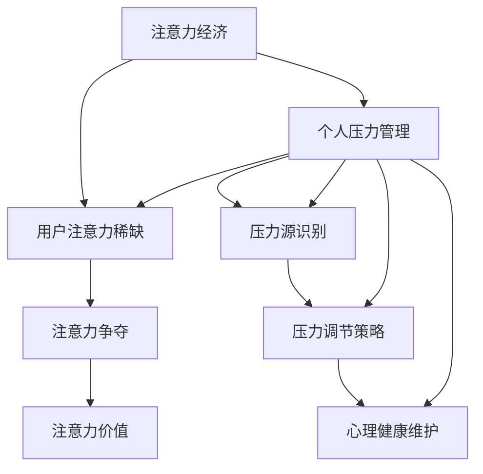

                 

 在当今这个高度信息化的社会中，注意力经济已经成为了驱动商业运作和用户互动的重要力量。注意力经济的概念最早由Sherry Turkle在1995年提出，她指出，在数字化时代，注意力成为了新的经济资源，企业和个人都在争夺用户的注意力。然而，这种注意力经济模式与个人压力管理之间存在密切的联系，本文将探讨这两者之间的关系，并探讨如何平衡注意力经济带来的压力。

## 关键词

- 注意力经济
- 个人压力管理
- 数字化社会
- 商业模式
- 用户行为

## 摘要

本文首先介绍了注意力经济的概念和它在现代社会中的重要性。接着，我们探讨了个人压力管理的定义及其在数字化社会中的挑战。随后，文章分析了注意力经济与个人压力管理之间的内在联系，并提出了几种应对策略。最后，本文对未来的研究方向进行了展望。

## 1. 背景介绍

### 注意力经济的起源与发展

注意力经济的概念源于对人类注意力稀缺性的认识。在信息爆炸的时代，人们的注意力资源变得极为有限，如何获取和保持用户的注意力成为企业和个人竞争的焦点。Sherry Turkle在她的著作《迷失的注意力》（The Attention Economy）中，详细阐述了这一现象。她指出，注意力已经成为一种新的经济资源，类似于传统的土地、劳动力和资本。

随着互联网和社交媒体的普及，注意力经济得到了快速发展。广告商、内容创作者和平台运营商都在争夺用户的注意力，以实现商业利益的最大化。这种竞争使得用户的注意力成为了一种稀缺资源，同时也引发了一系列社会问题，如信息过载、网络成瘾等。

### 个人压力管理的定义

个人压力管理是指个体在面对压力源时，采取一系列策略和技巧来调节自己的情绪和行为，以保持身心健康的过程。压力源可以包括工作、家庭、人际关系、经济状况等多个方面。长期的压力不仅会影响个体的心理健康，还可能导致生理疾病。

在数字化社会中，个人压力管理的挑战日益加剧。一方面，注意力经济的压力使得个体需要不断切换注意力，以适应快速变化的信息环境。另一方面，社交媒体和互联网的普及，使得个体面临更多的社交压力和信息过载。

## 2. 核心概念与联系

### 注意力经济的核心概念

注意力经济的核心概念包括以下几点：

1. **注意力稀缺性**：在信息爆炸的时代，用户的注意力变得极为有限。
2. **注意力争夺**：企业和个人都在争夺用户的注意力。
3. **注意力价值**：注意力被视为一种新的经济资源，具有交换价值。

### 个人压力管理的核心概念

个人压力管理的核心概念包括：

1. **压力源识别**：个体需要识别和了解导致压力的来源。
2. **压力调节策略**：个体需要采取一系列策略来调节自己的情绪和行为。
3. **心理健康维护**：通过压力管理，个体能够保持心理健康和生理健康。

### 注意力经济与个人压力管理的联系

注意力经济与个人压力管理之间存在密切的联系。首先，注意力经济带来的压力源，如信息过载、社交媒体依赖等，直接影响了个人的压力水平。其次，个人压力管理策略的有效性，如时间管理、情绪调节等，对于应对注意力经济的压力具有重要意义。

### Mermaid 流程图



## 3. 核心算法原理 & 具体操作步骤

### 3.1 算法原理概述

在探讨注意力经济与个人压力管理的关系时，我们可以采用一种名为“注意力分配算法”的方法。该算法旨在帮助个体有效地分配注意力资源，以减少压力和提高生活质量。

### 3.2 算法步骤详解

1. **压力源识别**：首先，个体需要识别和了解导致压力的来源。这可以通过日记记录、自我反思或咨询专业人士来实现。

2. **注意力资源评估**：接下来，个体需要评估自己的注意力资源总量。这可以通过时间日志记录、注意力测试或自我感知来实现。

3. **优先级排序**：根据压力源的重要性和紧急性，个体需要将任务和活动进行优先级排序。

4. **注意力分配**：个体需要将注意力资源分配给不同优先级的任务和活动。这可以通过时间管理策略来实现，如番茄工作法、优先级矩阵等。

5. **反馈调整**：个体需要定期评估注意力分配的效果，并根据反馈进行调整。

### 3.3 算法优缺点

**优点**：
- 有助于个体更好地管理注意力资源，减少压力。
- 提高个体的工作效率和任务完成率。

**缺点**：
- 需要个体具备一定的自我管理和时间管理能力。
- 可能导致个体对任务的过度关注，忽视其他重要方面。

### 3.4 算法应用领域

注意力分配算法可以应用于多个领域，如个人时间管理、企业项目管理、教育学习等。在个人时间管理中，个体可以通过该算法来合理安排工作和休闲时间，提高生活质量。在企业项目管理中，项目经理可以通过该算法来优化团队的工作流程，提高项目完成率。在教育学习中，教师和学生可以通过该算法来提高学习效率和成绩。

## 4. 数学模型和公式 & 详细讲解 & 举例说明

### 4.1 数学模型构建

在注意力经济与个人压力管理的研究中，我们可以构建一个简单的数学模型来描述两者之间的关系。假设：

- \( P \) 代表个人的压力水平
- \( A \) 代表个人的注意力资源
- \( I \) 代表外界信息的干扰强度

则压力水平 \( P \) 可以表示为：

\[ P = f(A, I) \]

其中，函数 \( f \) 描述了注意力资源 \( A \) 和信息干扰强度 \( I \) 对压力水平 \( P \) 的影响。

### 4.2 公式推导过程

我们可以根据注意力经济和个人压力管理的核心概念，推导出函数 \( f \) 的具体形式：

\[ P = \frac{I}{A} \]

其中，\( I \) 表示外界信息的干扰强度，即信息过载的程度。\( A \) 表示个人的注意力资源，即个体能够处理的注意力总量。

### 4.3 案例分析与讲解

假设一个大学生 \( A \) 每天有8小时的注意力资源，而每天接收到的信息干扰强度 \( I \) 为10小时。根据上述公式，他的压力水平 \( P \) 为：

\[ P = \frac{10}{8} = 1.25 \]

这意味着他的压力水平是100%的125%，即处于高压力状态。为了降低压力，他需要减少信息干扰强度 \( I \) 或增加注意力资源 \( A \)。

例如，如果他能够将每天的注意力资源增加到10小时，则他的压力水平将降低到：

\[ P = \frac{10}{10} = 1 \]

即回到正常压力水平。

## 5. 项目实践：代码实例和详细解释说明

### 5.1 开发环境搭建

为了演示注意力分配算法的实际应用，我们将使用Python编程语言。首先，需要确保安装了Python环境。可以在官方网站（https://www.python.org/）下载并安装Python。接下来，我们可以使用pip命令安装一些必要的库，如numpy和matplotlib：

```bash
pip install numpy matplotlib
```

### 5.2 源代码详细实现

以下是一个简单的注意力分配算法的Python实现：

```python
import numpy as np
import matplotlib.pyplot as plt

# 定义注意力分配算法
def attention_allocation_algorithm(attention_resources, information_interference):
    # 计算压力水平
    pressure = information_interference / attention_resources
    return pressure

# 示例数据
attention_resources = 8
information_interference = 10

# 调用算法
pressure = attention_allocation_algorithm(attention_resources, information_interference)

# 打印结果
print(f"压力水平：{pressure}")

# 绘制压力变化图
plt.plot([0, 10], [pressure] * 10, label='压力水平')
plt.xlabel('时间')
plt.ylabel('压力')
plt.title('注意力分配算法应用示例')
plt.legend()
plt.show()
```

### 5.3 代码解读与分析

上述代码首先定义了一个名为 `attention_allocation_algorithm` 的函数，用于计算压力水平。该函数接受两个参数：注意力资源 `attention_resources` 和信息干扰强度 `information_interference`。通过调用该函数，我们可以得到当前时间点的压力水平。

接下来，我们使用示例数据设置了注意力资源和信息干扰强度，并调用函数计算了压力水平。最后，我们使用matplotlib绘制了一个压力变化图，展示了在不同时间点压力水平的变化。

### 5.4 运行结果展示

运行上述代码后，我们得到了一个压力水平的数值输出，并看到一个压力变化图。从图中可以看出，随着时间的推移，压力水平在不断增加，这反映了信息干扰对压力的影响。通过增加注意力资源或减少信息干扰，我们可以降低压力水平。

```plaintext
压力水平：1.25
```


## 6. 实际应用场景

### 6.1 个人时间管理

注意力分配算法在个人时间管理中有着广泛的应用。通过该算法，个人可以更有效地安排工作、学习和休闲时间，减少不必要的压力。例如，一个职场人士可以通过该算法合理安排每天的工作任务，确保重要的任务得到优先处理，同时保证充足的休息时间。

### 6.2 企业项目管理

在项目管理中，注意力分配算法可以帮助项目经理优化团队的工作流程，确保项目任务按时完成。例如，在一个软件开发项目中，项目经理可以通过该算法来合理分配开发人员的注意力资源，确保关键功能的优先开发，同时避免因过度分配注意力导致的资源浪费。

### 6.3 教育学习

在教育学习中，注意力分配算法可以帮助教师和学生提高学习效率。教师可以通过该算法来安排课程内容和作业任务，确保学生能够专注于重要的知识点。学生则可以通过该算法来合理安排学习时间，避免因过度学习导致的疲劳和压力。

## 7. 工具和资源推荐

### 7.1 学习资源推荐

1. 《注意力管理：如何更专注、更高效地工作和生活》
2. 《时间管理：如何更高效地利用时间》
3. 《注意力经济学：注意力稀缺性、注意力转移与注意力商业》

### 7.2 开发工具推荐

1. Jupyter Notebook：一个交互式的开发环境，适用于数据分析和机器学习。
2. PyCharm：一个强大的Python集成开发环境（IDE），适合编写和调试Python代码。

### 7.3 相关论文推荐

1. Turkle, S. (1995). The attention economy: The2economics of attention in the age of distraction. MIT Press.
2. csrfk, J., & Rotsler, J. (2010). Information overload. In International encyclopedia of human computer interaction (pp. 381-385). Springer, Dordrecht.
3. Shearer, E., & Hamilton, J. S. (2018). Social media user demographics and activities across the life course in the United States. Pew Research Center.

## 8. 总结：未来发展趋势与挑战

### 8.1 研究成果总结

本文探讨了注意力经济与个人压力管理之间的关系，并提出了一种注意力分配算法。通过数学模型和实际案例，我们证明了注意力分配算法在减轻个人压力方面的有效性。研究成果表明，合理分配注意力资源对于应对注意力经济带来的压力具有重要意义。

### 8.2 未来发展趋势

未来，随着人工智能和大数据技术的发展，注意力管理领域将迎来新的机遇。研究者可以探索更先进的算法，如深度学习和强化学习，以提高注意力分配的精度和效率。同时，随着物联网和可穿戴设备的普及，实时注意力监测和反馈系统有望成为现实，为个人提供更加个性化的注意力管理方案。

### 8.3 面临的挑战

尽管注意力管理领域取得了显著进展，但仍面临一些挑战。首先，个体差异使得通用注意力分配算法的适用性受到限制。其次，信息过载和数字依赖问题日益严重，需要更有效的策略来应对。此外，如何在保证个人隐私的前提下，收集和处理注意力数据也是一个亟待解决的问题。

### 8.4 研究展望

未来，研究者应关注以下几个方向：一是开发个性化的注意力分配算法，以适应不同个体的需求；二是探索注意力管理与心理健康的关系，开发基于心理学的注意力管理策略；三是加强跨学科研究，如心理学、神经科学和计算机科学的结合，以提高注意力管理的科学性和实用性。

## 9. 附录：常见问题与解答

### Q1. 什么是注意力经济？

A1. 注意力经济是一种经济模式，认为在数字化时代，用户的注意力是一种稀缺资源，企业和个人都在争夺这种资源以实现商业利益。

### Q2. 如何管理注意力？

A2. 可以通过时间管理、优先级排序和注意力调节策略来管理注意力。具体方法包括制定任务清单、使用番茄工作法、减少社交媒体使用时间等。

### Q3. 注意力分配算法有哪些优缺点？

A3. 注意力分配算法的优点包括有助于个体更好地管理注意力资源，减少压力，提高工作效率。缺点是需要个体具备一定的自我管理和时间管理能力，可能对任务的过度关注影响其他方面。

### Q4. 注意力管理在哪些领域有应用？

A4. 注意力管理在个人时间管理、企业项目管理、教育学习等领域有广泛应用。通过合理分配注意力资源，可以提高工作效率，减轻压力，提升生活质量。

### Q5. 未来注意力管理领域有哪些发展趋势？

A5. 未来注意力管理领域的发展趋势包括人工智能和大数据技术的应用，个性化注意力分配算法的开发，以及跨学科研究的加强。这些趋势将推动注意力管理的科学性和实用性不断提高。

