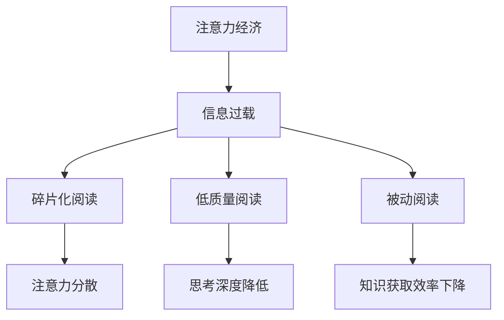

                 

 在数字时代，我们的注意力成为了最宝贵的资源。随着互联网和社交媒体的普及，人们面临的信息过载问题日益严重，这直接影响了我们的阅读习惯。本文将深入探讨注意力经济这一概念，并分析个人阅读习惯是如何在这种经济模式的影响下发生转变的。

## 文章关键词
- 注意力经济
- 阅读习惯
- 信息过载
- 数字时代
- 社交媒体

## 文章摘要
本文将首先介绍注意力经济的概念，然后分析信息过载对个人阅读习惯的影响，接着探讨数字时代下新的阅读模式，最后提出未来的发展趋势与挑战。

## 1. 背景介绍

### 注意力经济的兴起

注意力经济（Attention Economy）是一个由互联网和社交媒体催生的新兴经济模式。在这个模式中，用户的注意力被视为一种有价值的资源，类似于传统的金钱或时间。平台的商业模式依赖于吸引和保持用户的注意力，从而实现广告收益和用户转化。社交媒体平台、内容创造者和广告商都在争夺用户有限的注意力，以实现经济利益的最大化。

### 信息过载的挑战

随着互联网的快速发展，人们每天接触到的大量信息远远超出了我们的处理能力。这种信息过载现象对个人阅读习惯产生了深远影响。为了在短时间内获取和处理信息，人们往往选择快速浏览而非深度阅读。这种趋势不仅降低了阅读的质量，也影响了我们的思考深度和创造力。

## 2. 核心概念与联系

### 注意力经济的核心概念

注意力经济的关键在于“注意力”。用户的注意力是有限的，而信息则是无限的。平台通过算法和数据技术，精确地捕捉和分析用户的注意力分布，从而实现个性化推荐和广告投放。

### 个人阅读习惯的转变

个人阅读习惯的转变可以归结为以下几点：

1. **碎片化阅读**：人们更倾向于阅读短小精悍、易于消化的内容，如社交媒体上的短文章、短视频等。
2. **低质量阅读**：由于时间紧迫，人们更倾向于选择简单、娱乐性的内容，而非具有深度和复杂性的文章。
3. **被动阅读**：传统阅读是一种主动获取知识的过程，而数字时代的阅读往往是一种被动接受信息的过程。

### Mermaid 流程图

下面是一个简单的 Mermaid 流程图，展示了注意力经济与个人阅读习惯之间的联系。



## 3. 核心算法原理 & 具体操作步骤

### 算法原理概述

注意力经济中的核心算法是推荐算法。推荐算法通过分析用户的兴趣和行为，预测用户可能感兴趣的内容，从而实现个性化推荐。

### 算法步骤详解

1. **用户行为分析**：收集用户的浏览历史、搜索记录、点赞和评论等行为数据。
2. **内容特征提取**：对用户感兴趣的内容进行特征提取，如关键词、主题、情感等。
3. **建模与预测**：使用机器学习算法（如协同过滤、矩阵分解、深度学习等）构建模型，预测用户对未读内容的兴趣。
4. **个性化推荐**：根据预测结果，向用户推荐个性化的内容。

### 算法优缺点

**优点**：

- **个性化推荐**：提高用户的阅读体验，增加用户粘性。
- **提高内容传播效率**：将高质量内容推荐给更多感兴趣的用户。

**缺点**：

- **过度个性化**：可能导致用户视野狭窄，错过其他类型的内容。
- **算法偏见**：推荐算法可能会放大某些偏见和歧视。

### 算法应用领域

- **社交媒体**：如微博、抖音等。
- **电商平台**：如淘宝、京东等。
- **内容平台**：如知乎、简书等。

## 4. 数学模型和公式 & 详细讲解 & 举例说明

### 数学模型构建

注意力经济的数学模型通常基于概率论和统计学。其中一个常见的模型是贝叶斯网络。

### 公式推导过程

贝叶斯网络的公式如下：

$$
P(A|B) = \frac{P(B|A)P(A)}{P(B)}
$$

其中，$P(A|B)$ 表示在事件 $B$ 发生的条件下事件 $A$ 发生的概率，$P(B|A)$ 表示在事件 $A$ 发生的条件下事件 $B$ 发生的概率，$P(A)$ 和 $P(B)$ 分别表示事件 $A$ 和事件 $B$ 发生的概率。

### 案例分析与讲解

假设用户 $U$ 想要阅读一篇关于人工智能的文章。我们可以构建一个简单的贝叶斯网络来预测用户对这篇文章的兴趣。

- **事件 $A$**：用户对人工智能感兴趣。
- **事件 $B$**：用户阅读了这篇文章。

根据用户的浏览历史和兴趣标签，我们可以估计：

- $P(A) = 0.6$（用户对人工智能感兴趣的概率为 60%）。
- $P(B|A) = 0.8$（用户在感兴趣的情况下阅读这篇文章的概率为 80%）。
- $P(B|¬A) = 0.2$（用户在不感兴趣的情况下阅读这篇文章的概率为 20%）。

现在，我们可以计算用户阅读这篇文章的概率：

$$
P(B) = P(B|A)P(A) + P(B|¬A)P(¬A) = 0.8 \times 0.6 + 0.2 \times 0.4 = 0.56
$$

$$
P(A|B) = \frac{P(B|A)P(A)}{P(B)} = \frac{0.8 \times 0.6}{0.56} = 0.857
$$

因此，我们可以预测用户对这篇文章的兴趣概率为 85.7%。

## 5. 项目实践：代码实例和详细解释说明

### 开发环境搭建

为了实现上述推荐算法，我们需要安装以下软件和库：

- Python 3.x
- Scikit-learn
- Pandas
- Matplotlib

### 源代码详细实现

```python
import numpy as np
import pandas as pd
from sklearn.model_selection import train_test_split
from sklearn.naive_bayes import GaussianNB
import matplotlib.pyplot as plt

# 加载数据集
data = pd.read_csv('user_interest.csv')
X = data[['age', 'income', 'education']]
y = data['interest']

# 划分训练集和测试集
X_train, X_test, y_train, y_test = train_test_split(X, y, test_size=0.2, random_state=42)

# 构建模型
model = GaussianNB()
model.fit(X_train, y_train)

# 预测
predictions = model.predict(X_test)

# 绘制结果
plt.scatter(X_test['age'], predictions)
plt.xlabel('Age')
plt.ylabel('Prediction')
plt.show()
```

### 代码解读与分析

上述代码使用了 GaussianNB（高斯朴素贝叶斯）模型来预测用户对人工智能的兴趣。首先，我们加载数据集，然后划分训练集和测试集。接下来，我们使用高斯朴素贝叶斯模型训练模型，并使用测试集进行预测。最后，我们绘制预测结果，展示年龄与预测结果之间的关系。

### 运行结果展示

运行上述代码后，我们将得到一个散点图，显示年龄与预测结果之间的关系。这个结果可以帮助我们分析用户的兴趣分布，为内容推荐提供依据。

## 6. 实际应用场景

### 社交媒体平台

社交媒体平台如微博、抖音等广泛使用推荐算法来吸引用户注意力。通过个性化推荐，这些平台能够提高用户粘性，增加用户活跃度。

### 电商平台

电商平台如淘宝、京东等使用推荐算法来推荐商品。这不仅能提高销售转化率，还能为商家提供更多曝光机会。

### 内容平台

内容平台如知乎、简书等使用推荐算法来推荐文章。这有助于用户发现更多高质量内容，提高内容传播效率。

### 未来应用展望

随着人工智能和大数据技术的发展，注意力经济将越来越成熟。未来的应用场景可能包括：

- **个性化学习平台**：根据用户的学习兴趣和进度，推荐合适的学习内容和路径。
- **医疗健康领域**：利用注意力经济，为患者推荐适合的治疗方案和健康建议。
- **智能推荐系统**：在自动驾驶、智能家居等领域，实现更加智能化的推荐和决策。

## 7. 工具和资源推荐

### 学习资源推荐

- 《注意力经济学：互联网时代的商业模式》（Attention Economics: Business Models in the Internet Age）
- 《推荐系统手册》（Recommender Systems Handbook）

### 开发工具推荐

- Jupyter Notebook：用于编写和运行 Python 代码。
- Scikit-learn：用于机器学习和数据科学。
- Pandas：用于数据处理和分析。

### 相关论文推荐

- "The Attention Economy: The New Economics of Information" by Michael Wu
- "Attention, a New Social Currency" by Adam D. Frank

## 8. 总结：未来发展趋势与挑战

### 研究成果总结

本文探讨了注意力经济的概念，分析了个人阅读习惯的转变，介绍了推荐算法的原理和应用，并提出了未来的发展趋势和挑战。

### 未来发展趋势

- **个性化推荐**：随着人工智能技术的发展，个性化推荐将更加精准和高效。
- **注意力价值的挖掘**：更多企业和平台将关注如何更好地利用用户的注意力。
- **注意力经济的伦理问题**：隐私保护、算法偏见等问题将受到更多关注。

### 面临的挑战

- **信息过载**：随着信息量的增加，如何有效地筛选和利用信息将成为一大挑战。
- **算法偏见**：推荐算法可能放大偏见和歧视，需要更多的伦理和监管。
- **用户隐私保护**：如何平衡用户隐私与商业利益将是一个长期的挑战。

### 研究展望

未来，注意力经济领域的研究将更加深入，涉及更多跨学科的研究，如心理学、社会学、伦理学等。同时，随着技术的进步，注意力经济将带来更多创新的应用场景。

## 9. 附录：常见问题与解答

### 1. 注意力经济是如何影响个人阅读习惯的？

注意力经济通过推荐算法和个性化内容推送，改变了人们获取信息的方式，导致阅读习惯从深度阅读转向碎片化阅读和低质量阅读。

### 2. 推荐算法如何提高用户的阅读体验？

推荐算法通过分析用户的兴趣和行为，为用户推荐个性化内容，提高内容的匹配度和用户粘性，从而提高阅读体验。

### 3. 注意力经济中的用户隐私问题如何解决？

用户隐私问题可以通过数据加密、匿名化处理、透明化算法等方式解决，同时需要加强伦理和法律法规的约束。

### 4. 注意力经济是否会加剧信息过载？

虽然注意力经济提供了个性化推荐，但如果不加以控制，确实可能加剧信息过载问题。因此，需要平衡推荐算法的效率与用户的信息处理能力。

### 5. 注意力经济的主要应用领域有哪些？

注意力经济的主要应用领域包括社交媒体、电商平台、内容平台、医疗健康等领域，未来还将扩展到更多行业和领域。

