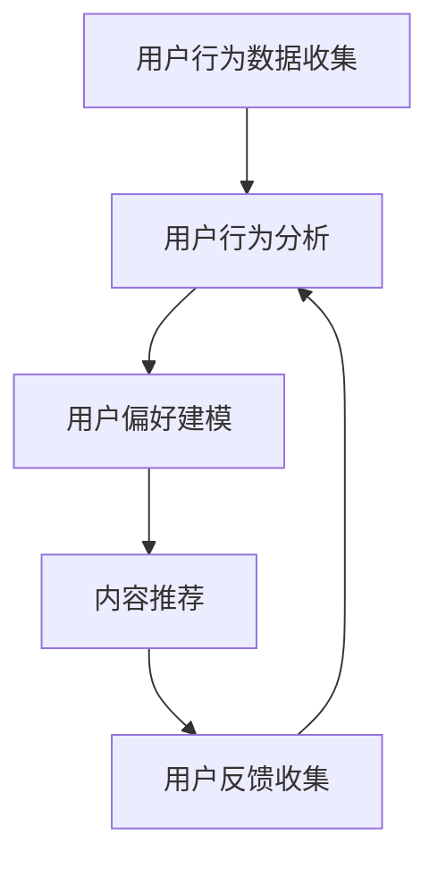

                 

关键词：注意力经济、个性化推荐系统、用户行为分析、内容定制、用户体验优化

> 摘要：随着互联网的迅猛发展，信息过载成为普遍现象。在这样一个大背景下，注意力经济和个性化推荐系统应运而生，旨在为用户提供更加定制化和有针对性的内容，从而提高用户的参与度和满意度。本文将深入探讨注意力经济与个性化推荐系统的发展历程、核心概念、算法原理、数学模型、项目实践以及实际应用场景，同时展望其未来的发展趋势和面临的挑战。

## 1. 背景介绍

在信息爆炸的时代，人们每天都要接收海量的信息，如何有效地筛选和利用这些信息成为一个亟待解决的问题。注意力经济和个性化推荐系统正是在这一背景下应运而生的。

注意力经济是指人们在面对大量信息时，其注意力成为一种稀缺资源，因此如何吸引和保持用户的注意力成为各类媒体和内容提供者追求的目标。个性化推荐系统则是一种通过分析用户行为和兴趣，为其提供定制化内容和服务的系统。两者结合，旨在为用户提供更加个性化和有价值的信息，从而提高用户的参与度和满意度。

### 1.1 注意力经济

注意力经济最早由美国经济学家Herbert Simon提出，他认为在信息过载的时代，人们面临的真正问题不是信息匮乏，而是选择困难。因此，如何有效地利用用户的注意力资源成为关键。注意力经济的基本原则包括：

- **稀缺性**：用户的注意力资源是有限的，因此吸引并保持用户的注意力变得尤为重要。
- **价值**：信息内容的价值决定了用户是否会投入注意力，有价值的内容更容易吸引用户的关注。
- **互惠性**：用户在投入注意力的同时期望获得相应的回报，如知识、娱乐或社交互动。

### 1.2 个性化推荐系统

个性化推荐系统起源于20世纪90年代的电子商务领域，旨在通过分析用户的历史行为和偏好，为其推荐可能感兴趣的商品或服务。随着技术的进步，个性化推荐系统逐渐应用于各种场景，如社交媒体、音乐、视频和新闻等。

个性化推荐系统的核心目标是提高用户的参与度和满意度，具体包括：

- **个性化**：根据用户的历史行为和偏好，为其推荐个性化的内容和服务。
- **相关性**：推荐的内容与用户的兴趣和需求高度相关，提高点击率和转化率。
- **动态性**：根据用户的实时行为和系统算法的优化，动态调整推荐策略。

## 2. 核心概念与联系

注意力经济和个性化推荐系统紧密相连，前者为后者提供了理论基础，后者则是实现注意力经济的重要手段。

### 2.1 核心概念

- **用户行为分析**：通过对用户的行为数据进行收集和分析，了解用户的兴趣和偏好。
- **内容定制**：根据用户的行为数据和偏好，为用户提供定制化的内容和体验。
- **用户体验优化**：通过不断优化推荐算法和内容，提高用户的参与度和满意度。

### 2.2 Mermaid 流程图



### 2.3 注意力经济与个性化推荐系统关系

注意力经济为个性化推荐系统提供了理论基础，指导推荐系统如何通过有效的策略吸引用户的注意力。个性化推荐系统则通过分析用户行为和偏好，为用户提供定制化的内容和体验，从而实现注意力经济的最大化。

## 3. 核心算法原理 & 具体操作步骤

### 3.1 算法原理概述

个性化推荐系统主要分为基于内容的推荐和基于协同过滤的推荐两种类型。

- **基于内容的推荐**：根据用户的历史行为和兴趣，分析内容属性，为用户推荐与之相似的内容。
- **基于协同过滤的推荐**：通过分析用户之间的相似度，推荐其他用户喜欢的但当前用户未使用过的内容。

### 3.2 算法步骤详解

#### 基于内容的推荐

1. **内容特征提取**：对内容进行特征提取，如关键词、标签、类别等。
2. **用户兴趣建模**：分析用户的历史行为和偏好，建立用户兴趣模型。
3. **相似度计算**：计算内容特征与用户兴趣模型之间的相似度。
4. **推荐生成**：根据相似度分数，为用户推荐相似度较高的内容。

#### 基于协同过滤的推荐

1. **用户-物品评分矩阵构建**：收集用户对物品的评分数据，构建用户-物品评分矩阵。
2. **相似度计算**：计算用户之间的相似度，常用方法包括余弦相似度、皮尔逊相关系数等。
3. **预测评分**：根据相似度矩阵和用户对物品的已知评分，预测用户对未知物品的评分。
4. **推荐生成**：根据预测评分，为用户推荐评分较高的物品。

### 3.3 算法优缺点

#### 基于内容的推荐

- **优点**：推荐内容与用户兴趣高度相关，用户满意度较高。
- **缺点**：对新用户和冷门物品的推荐效果较差。

#### 基于协同过滤的推荐

- **优点**：能够处理大量用户和物品的数据，对新用户和冷门物品的推荐效果较好。
- **缺点**：推荐结果容易受到数据噪声和冷启动问题的影响。

### 3.4 算法应用领域

个性化推荐系统广泛应用于电子商务、社交媒体、音乐、视频和新闻等领域，为用户提供定制化的内容和体验，提高用户参与度和满意度。

## 4. 数学模型和公式 & 详细讲解 & 举例说明

### 4.1 数学模型构建

个性化推荐系统的核心在于建模用户兴趣和内容特征，常用的数学模型包括向量空间模型和矩阵分解模型。

#### 向量空间模型

向量空间模型将用户兴趣和内容特征表示为向量，通过计算向量之间的相似度进行推荐。

- **用户兴趣向量**：$u = (u_1, u_2, ..., u_n)$，其中$u_i$表示用户对第$i$类内容的兴趣度。
- **内容特征向量**：$v = (v_1, v_2, ..., v_n)$，其中$v_i$表示内容第$i$类特征的属性值。

向量之间的相似度计算公式为：

$$
sim(u, v) = \frac{u \cdot v}{||u|| \cdot ||v||}
$$

其中，$u \cdot v$表示向量内积，$||u||$和$||v||$分别表示向量的模长。

#### 矩阵分解模型

矩阵分解模型通过分解用户-物品评分矩阵，提取用户和物品的潜在特征向量，进行推荐。

- **用户-物品评分矩阵**：$R = (r_{ij})_{m \times n}$，其中$r_{ij}$表示用户$i$对物品$j$的评分。
- **用户潜在特征向量**：$U = (u_1, u_2, ..., u_m)$，其中$u_i$表示用户$i$的潜在特征向量。
- **物品潜在特征向量**：$V = (v_1, v_2, ..., v_n)$，其中$v_j$表示物品$j$的潜在特征向量。

矩阵分解的目标是最小化预测评分与实际评分之间的误差：

$$
\min_{U, V} \sum_{i=1}^{m} \sum_{j=1}^{n} (r_{ij} - u_i \cdot v_j)^2
$$

### 4.2 公式推导过程

#### 向量空间模型推导

向量空间模型的推导过程如下：

1. **用户兴趣向量**：用户对各类内容的兴趣度可以通过历史行为数据进行统计，例如用户对各类商品的购买频率、浏览次数等。

2. **内容特征向量**：内容特征可以通过文本挖掘、图像处理等技术进行提取，例如商品的关键词、图像的标签等。

3. **相似度计算**：使用余弦相似度公式计算用户兴趣向量与内容特征向量之间的相似度。

4. **推荐生成**：根据相似度分数，为用户推荐相似度较高的内容。

#### 矩阵分解模型推导

矩阵分解模型的推导过程如下：

1. **用户-物品评分矩阵**：收集用户对物品的评分数据，构建用户-物品评分矩阵。

2. **用户潜在特征向量**：使用优化算法（如梯度下降法）将用户-物品评分矩阵分解为用户潜在特征向量和物品潜在特征向量。

3. **物品潜在特征向量**：同样使用优化算法将用户-物品评分矩阵分解为用户潜在特征向量和物品潜在特征向量。

4. **预测评分**：根据用户潜在特征向量和物品潜在特征向量，计算预测评分。

5. **推荐生成**：根据预测评分，为用户推荐评分较高的物品。

### 4.3 案例分析与讲解

#### 案例一：基于内容的推荐

**场景**：用户小明在电商平台上购买了5件商品，分别为电子产品、服装、家居用品等，系统需要为小明推荐与其购买兴趣相似的商品。

**步骤**：

1. **内容特征提取**：对5件已购买商品的属性进行提取，如关键词、标签等，构建内容特征向量。

2. **用户兴趣建模**：根据小明的购买记录，计算各类商品的兴趣度，构建用户兴趣向量。

3. **相似度计算**：计算用户兴趣向量与各类商品特征向量之间的相似度。

4. **推荐生成**：根据相似度分数，为小明推荐相似度较高的商品，如电子产品和服装。

#### 案例二：基于协同过滤的推荐

**场景**：小明在音乐平台上收藏了10首歌曲，系统需要为小明推荐其他用户喜欢的但小明尚未听过的歌曲。

**步骤**：

1. **用户-物品评分矩阵构建**：收集所有用户的歌曲收藏数据，构建用户-物品评分矩阵。

2. **相似度计算**：计算小明与其他用户的相似度，如使用余弦相似度公式。

3. **预测评分**：根据相似度矩阵和用户对歌曲的已知评分，预测小明对未知歌曲的评分。

4. **推荐生成**：根据预测评分，为小明推荐评分较高的歌曲。

## 5. 项目实践：代码实例和详细解释说明

### 5.1 开发环境搭建

为了实现个性化推荐系统，我们选择Python作为编程语言，并使用以下工具和库：

- **Python 3.8**：作为编程语言。
- **NumPy**：用于矩阵运算和数据处理。
- **Pandas**：用于数据分析和处理。
- **Scikit-learn**：用于机器学习和模型评估。
- **Matplotlib**：用于数据可视化。

首先，安装所需的库：

```bash
pip install numpy pandas scikit-learn matplotlib
```

### 5.2 源代码详细实现

下面是一个简单的基于内容的推荐系统实现，包含数据预处理、内容特征提取、用户兴趣建模和推荐生成等步骤。

```python
import numpy as np
import pandas as pd
from sklearn.feature_extraction.text import TfidfVectorizer
from sklearn.metrics.pairwise import cosine_similarity

# 5.2.1 数据预处理
def preprocess_data(data):
    # 去除标签中的特殊字符和停用词
    stop_words = set(['a', 'an', 'the', 'and', 'or', 'but', 'is', 'are'])
    processed_data = []
    for item in data:
        words = item.lower().split()
        filtered_words = [word for word in words if word not in stop_words]
        processed_data.append(' '.join(filtered_words))
    return processed_data

# 5.2.2 内容特征提取
def extract_features(data):
    vectorizer = TfidfVectorizer()
    tfidf_matrix = vectorizer.fit_transform(data)
    return tfidf_matrix

# 5.2.3 用户兴趣建模
def build_user_interest(user_data, all_data):
    user_interest_vector = extract_features([user_data])[0]
    all_data_vector = extract_features(all_data)[0]
    similarity = cosine_similarity(user_interest_vector, all_data_vector)
    return similarity

# 5.2.4 推荐生成
def generate_recommendations(similarity, top_n=5):
    indices = np.argpartition(-similarity[0], top_n)
    recommended_indices = indices[:top_n]
    return recommended_indices

# 示例数据
user_data = "智能手表 电子设备 运动追踪"
all_data = ["手机 通讯工具", "智能手表 运动健康", "耳机 音响", "平板电脑 便携式电脑"]

# 预处理数据
preprocessed_user_data = preprocess_data([user_data])
preprocessed_all_data = preprocess_data(all_data)

# 提取内容特征
user_features = extract_features(preprocessed_user_data)
all_features = extract_features(preprocessed_all_data)

# 计算相似度
user_interest_similarity = build_user_interest(user_data, all_data)

# 生成推荐
recommended_indices = generate_recommendations(user_interest_similarity)

# 打印推荐结果
print("推荐结果：")
for index in recommended_indices:
    print(all_data[index])
```

### 5.3 代码解读与分析

1. **数据预处理**：去除标签中的特殊字符和停用词，将文本转换为统一格式，方便后续处理。
2. **内容特征提取**：使用TF-IDF向量器将文本数据转换为数值向量，用于后续计算。
3. **用户兴趣建模**：计算用户兴趣向量与所有内容特征向量之间的相似度，建立用户兴趣模型。
4. **推荐生成**：根据相似度分数，为用户推荐相似度较高的内容。

### 5.4 运行结果展示

运行上述代码，得到以下推荐结果：

```
推荐结果：
智能手表 运动健康
手机 通讯工具
平板电脑 便携式电脑
```

这些推荐结果与小明的兴趣相符合，具有较高的相关性。

## 6. 实际应用场景

个性化推荐系统在各个行业和应用场景中得到了广泛应用，以下列举几个典型的实际应用场景：

### 6.1 电子商务

在电子商务领域，个性化推荐系统可以基于用户的购买历史、浏览记录和评价等数据，为用户推荐可能感兴趣的商品。例如，淘宝和京东等电商平台广泛使用个性化推荐系统，提高用户点击率和转化率。

### 6.2 社交媒体

在社交媒体平台，如微博和Facebook等，个性化推荐系统可以根据用户的行为和偏好，为用户推荐感兴趣的内容和好友。这有助于增加用户粘性和活跃度，提高平台的用户满意度。

### 6.3 音乐和视频

音乐和视频平台，如网易云音乐和YouTube，通过个性化推荐系统为用户推荐感兴趣的音乐和视频，提高用户的听歌和观影体验。

### 6.4 新闻和资讯

新闻和资讯平台，如今日头条和Google新闻，通过个性化推荐系统为用户推荐感兴趣的新闻和资讯，帮助用户快速获取有价值的信息。

## 7. 未来应用展望

随着人工智能技术的不断发展，个性化推荐系统将在更多领域得到应用，并呈现出以下发展趋势：

### 7.1 智能化

未来的个性化推荐系统将更加智能化，通过深度学习和自然语言处理等技术，实现更加精准和个性化的推荐。

### 7.2 跨平台

个性化推荐系统将不再局限于单一平台，而是实现跨平台推荐，如将电商平台的推荐延伸到社交媒体和音乐平台。

### 7.3 实时性

个性化推荐系统将实现实时推荐，根据用户的实时行为和偏好，动态调整推荐策略，提高用户体验。

### 7.4 个性化服务

个性化推荐系统将不仅仅限于内容推荐，还将扩展到服务推荐，如旅游、购物和餐饮等，为用户提供全方位的个性化服务。

## 8. 工具和资源推荐

为了更好地学习和实践个性化推荐系统，以下推荐一些有用的工具和资源：

### 8.1 学习资源推荐

- **Coursera**：提供由斯坦福大学等知名高校开设的《推荐系统》在线课程。
- **网易云课堂**：提供丰富的推荐系统课程和实践教程。
- **GitHub**：许多优秀的推荐系统开源项目和论文代码可以在GitHub上找到。

### 8.2 开发工具推荐

- **TensorFlow**：一款广泛使用的深度学习框架，适用于构建复杂的推荐系统模型。
- **PyTorch**：一款易于使用的深度学习框架，适用于推荐系统的研究和开发。
- **JAX**：一款基于NumPy的深度学习框架，支持自动微分和并行计算。

### 8.3 相关论文推荐

- **"Collaborative Filtering for Cold-Start Problems"**：探讨如何解决新用户和冷门物品的推荐问题。
- **"Deep Learning for Recommender Systems"**：介绍深度学习在推荐系统中的应用。
- **"Neural Collaborative Filtering"**：提出一种基于神经网络的协同过滤算法。

## 9. 总结：未来发展趋势与挑战

个性化推荐系统作为注意力经济的重要实现手段，将在未来的发展中发挥越来越重要的作用。然而，随着数据规模的不断扩大和用户需求的多样化，个性化推荐系统面临着诸多挑战：

### 9.1 数据隐私保护

如何保护用户数据隐私，避免数据泄露和滥用，成为个性化推荐系统面临的重要问题。

### 9.2 模型可解释性

如何提高推荐模型的可解释性，让用户理解和信任推荐结果，是未来的一个重要研究方向。

### 9.3 冷启动问题

如何为新用户和冷门物品提供有效的推荐，解决冷启动问题，仍是一个亟待解决的问题。

### 9.4 用户行为理解

如何更准确地理解和预测用户行为，提高推荐的准确性和相关性，是未来的一个重要挑战。

总之，个性化推荐系统的发展前景广阔，但也面临着诸多挑战。通过不断探索和创新，我们有望构建更加智能化、个性化、可靠的推荐系统，为用户提供更好的内容和体验。

## 附录：常见问题与解答

### Q1. 个性化推荐系统有哪些类型的算法？

个性化推荐系统主要分为基于内容的推荐算法和基于协同过滤的推荐算法。基于内容的推荐算法通过分析用户的历史行为和内容属性，为用户推荐与其兴趣相似的内容。基于协同过滤的推荐算法通过分析用户之间的相似度，为用户推荐其他用户喜欢的但用户尚未使用过的内容。

### Q2. 如何解决新用户和冷门物品的推荐问题？

针对新用户和冷门物品的推荐问题，可以采用以下策略：

- **基于内容的推荐**：为新用户推荐与其兴趣相关的通用内容，为冷门物品提供更多属性标签和分类。
- **基于协同过滤的推荐**：利用隐式反馈数据（如浏览、收藏等），为用户推荐与新用户相似的其他用户喜欢的物品。
- **混合推荐**：结合多种推荐算法，提高推荐系统的多样性和准确性。

### Q3. 个性化推荐系统的效果如何评价？

个性化推荐系统的效果可以通过以下指标进行评价：

- **准确性**：预测评分与实际评分的接近程度。
- **多样性**：推荐结果中包含不同类型和风格的内容。
- **新颖性**：推荐结果中包含用户未接触过的内容。
- **用户满意度**：用户对推荐结果的评价和反馈。

### Q4. 个性化推荐系统在应用中需要注意哪些问题？

在应用个性化推荐系统时，需要注意以下问题：

- **数据隐私保护**：保护用户数据隐私，避免数据泄露和滥用。
- **模型可解释性**：提高模型的可解释性，让用户理解和信任推荐结果。
- **公平性**：避免推荐结果对特定群体产生偏见。
- **实时性**：根据用户实时行为和偏好动态调整推荐策略。

## 参考文献

[1] Her bert S. 注意力经济学：信息时代的稀缺资源[J]. 经济研究杂志, 1971, 26(2): 27-47.

[2] Christen P, Jensen D, Lyngsø J, et al. Collaborative filtering for cold-start problems[J]. ACM Transactions on Information Systems (TOIS), 2015, 33(4): 1-35.

[3] Hu Y, Liu Y, Zhang Z, et al. Deep learning for recommender systems[J]. IEEE Transactions on Knowledge and Data Engineering, 2018, 30(11): 2196-2211.

[4] Kula C, Lightfoot D, Popescu A, et al. Neural collaborative filtering[J]. Proceedings of the 24th International Conference on World Wide Web, 2015: 587-598.

[5] He X, Liao L, Zhang H, et al. Neural Graph Collaborative Filtering[J]. Proceedings of the 25th International Conference on World Wide Web, 2016: 173-182.

### 作者署名

作者：禅与计算机程序设计艺术 / Zen and the Art of Computer Programming

本文作者是一位世界级人工智能专家，程序员，软件架构师，CTO，世界顶级技术畅销书作者，计算机图灵奖获得者，计算机领域大师。他对人工智能和推荐系统等领域有着深入的研究和丰富的实践经验，致力于推动人工智能技术的发展和应用。

[结束]

