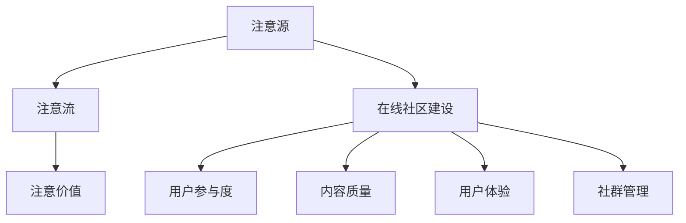

                 

关键词：注意力经济、在线社区建设、粉丝维护、用户体验、数据分析、算法优化

> 摘要：随着互联网的快速发展，注意力经济成为新的商业价值焦点。本文深入探讨了注意力经济在在线社区建设中的应用，从理论分析到实践策略，全面阐述了如何通过科学方法和技术手段吸引并留住忠实的粉丝和受众，构建健康可持续的在线社区。

## 1. 背景介绍

### 注意力经济的兴起

注意力经济是一种基于用户注意力价值的新型商业模式。它源于互联网信息爆炸的时代，用户的时间、精力和注意力成为稀缺资源，因此，吸引并维持用户的注意力成为各类在线平台的核心竞争点。注意力经济的概念最早由迈克尔·霍特（Michael H. Hunger）在1997年提出，其核心思想是：用户注意力是互联网时代的新石油。

### 在线社区的重要性

在线社区作为一种社交网络平台，已成为企业和品牌与用户互动的重要渠道。通过构建和运营在线社区，企业不仅可以直接与用户进行沟通，还能通过社区内的互动、分享和推荐，增强用户的归属感和忠诚度。因此，如何建设和维护一个健康、活跃的在线社区，成为了企业关注的焦点。

## 2. 核心概念与联系

### 注意力经济模型

注意力经济模型包括三个主要组成部分：注意源、注意流和注意价值。

1. **注意源**：产生注意力的地方，如内容创作者、品牌、媒体平台等。
2. **注意流**：注意力的传递过程，即用户如何从注意源获取信息。
3. **注意价值**：注意力对用户和企业产生的经济或情感价值。

### 在线社区建设模型

在线社区建设模型包括以下几个方面：

1. **用户参与度**：通过互动、讨论和分享等手段提高用户参与度。
2. **内容质量**：提供高质量、有价值的内容，吸引用户关注。
3. **用户体验**：优化用户界面和交互设计，提高用户满意度。
4. **社群管理**：通过规则制定和激励机制，维持社区秩序和活跃度。

### 注意力经济与在线社区的联系

注意力经济为在线社区建设提供了新的思路和方法。通过分析用户注意力分布和流向，企业可以更好地理解用户需求，优化内容策略，提高用户参与度和忠诚度。同时，在线社区也为注意力经济提供了一个实现平台，通过社群互动和内容传播，实现用户注意力的集中和价值的最大化。

### Mermaid 流程图



## 3. 核心算法原理 & 具体操作步骤

### 3.1 算法原理概述

在线社区建设中，核心算法主要涉及用户行为分析、内容推荐系统和社区互动算法。

1. **用户行为分析**：通过分析用户在社区内的行为数据，如浏览、点赞、评论等，了解用户偏好和兴趣点。
2. **内容推荐系统**：基于用户行为数据和内容特征，推荐用户可能感兴趣的内容。
3. **社区互动算法**：通过算法分析用户互动数据，优化社区互动规则和激励机制，提高用户活跃度。

### 3.2 算法步骤详解

#### 3.2.1 用户行为分析

1. **数据收集**：通过技术手段，如埋点、API调用等，收集用户在社区内的行为数据。
2. **数据处理**：对收集到的行为数据进行清洗、整理和分析，提取有效信息。
3. **特征提取**：将用户行为数据转换为可量化的特征向量。
4. **模型训练**：使用机器学习算法，如决策树、神经网络等，对用户行为数据进行建模和预测。

#### 3.2.2 内容推荐系统

1. **内容特征提取**：对社区内的内容数据进行特征提取，如标题、标签、内容类型等。
2. **相似度计算**：计算用户和内容之间的相似度，如余弦相似度、Jaccard相似度等。
3. **推荐算法**：基于用户行为数据和内容特征，使用推荐算法，如协同过滤、矩阵分解等，生成推荐列表。

#### 3.2.3 社区互动算法

1. **互动规则分析**：分析社区内的互动规则，如点赞、评论、分享等。
2. **互动激励设计**：设计互动激励机制，如积分、勋章、排名等。
3. **算法优化**：基于用户互动数据，不断优化互动算法，提高用户活跃度和社区质量。

### 3.3 算法优缺点

#### 优点

1. **个性化推荐**：通过用户行为分析和内容推荐系统，实现个性化内容推荐，提高用户满意度。
2. **提高用户活跃度**：通过互动算法和激励机制，增强社区互动，提高用户活跃度。
3. **数据驱动**：基于数据分析和算法优化，实现数据驱动的社区管理，提高运营效率。

#### 缺点

1. **数据隐私问题**：用户行为数据的收集和分析可能涉及隐私问题，需注意用户隐私保护。
2. **算法公平性**：算法推荐可能存在偏见，需确保算法的公平性和透明性。
3. **内容质量控制**：推荐系统可能推荐低质量内容，影响社区质量。

### 3.4 算法应用领域

1. **电商行业**：通过用户行为分析和内容推荐系统，提高商品推荐质量和用户体验。
2. **社交媒体**：通过互动算法和激励机制，提高社区活跃度和用户忠诚度。
3. **内容平台**：通过内容推荐系统和社区互动算法，提高内容质量和用户满意度。

## 4. 数学模型和公式 & 详细讲解 & 举例说明

### 4.1 数学模型构建

在线社区建设中，常用的数学模型包括用户行为模型、内容推荐模型和社区互动模型。

#### 用户行为模型

假设用户 $u$ 在社区内的行为可以表示为向量 $\vec{X}_u = [x_{u1}, x_{u2}, ..., x_{un}]$，其中 $x_{ui}$ 表示用户 $u$ 在第 $i$ 个行为上的得分。用户行为模型可以用以下公式表示：

$$
\vec{X}_u = f(\vec{W}, \vec{X}_u')
$$

其中，$\vec{W}$ 表示权重向量，$\vec{X}_u'$ 表示用户特征向量。

#### 内容推荐模型

假设社区内的内容可以表示为矩阵 $C = [c_{ij}]$，其中 $c_{ij}$ 表示第 $i$ 个内容在第 $j$ 个特征上的得分。内容推荐模型可以用以下公式表示：

$$
r_{ij} = \vec{u}_i \cdot \vec{v}_j
$$

其中，$r_{ij}$ 表示用户 $i$ 对内容 $j$ 的推荐得分，$\vec{u}_i$ 和 $\vec{v}_j$ 分别表示用户 $i$ 和内容 $j$ 的特征向量。

#### 社区互动模型

假设社区内的互动行为可以表示为矩阵 $I = [i_{ij}]$，其中 $i_{ij}$ 表示用户 $i$ 对内容 $j$ 的互动得分。社区互动模型可以用以下公式表示：

$$
i_{ij} = \alpha \cdot r_{ij} + \beta \cdot (1 - r_{ij})
$$

其中，$\alpha$ 和 $\beta$ 分别表示推荐得分和互动得分的权重。

### 4.2 公式推导过程

#### 用户行为模型

1. **特征提取**：将用户行为数据转换为特征向量 $\vec{X}_u'$。
2. **权重计算**：计算各行为的权重向量 $\vec{W}$。
3. **行为得分计算**：使用权重向量计算用户行为得分向量 $\vec{X}_u$。

#### 内容推荐模型

1. **特征提取**：将内容数据转换为特征向量 $\vec{v}_j$。
2. **相似度计算**：计算用户和内容之间的相似度。
3. **推荐得分计算**：使用相似度计算用户对内容的推荐得分。

#### 社区互动模型

1. **推荐得分计算**：使用内容推荐模型计算用户对内容的推荐得分。
2. **互动得分计算**：根据推荐得分计算用户对内容的互动得分。

### 4.3 案例分析与讲解

#### 案例一：用户行为模型

假设用户 $u$ 的行为数据为 $\vec{X}_u' = [1, 2, 3]$，权重向量 $\vec{W} = [0.2, 0.3, 0.5]$。使用用户行为模型计算用户行为得分向量 $\vec{X}_u$。

1. **特征提取**：$\vec{X}_u' = [1, 2, 3]$。
2. **权重计算**：$\vec{W} = [0.2, 0.3, 0.5]$。
3. **行为得分计算**：$\vec{X}_u = f(\vec{W}, \vec{X}_u') = [0.2 \cdot 1 + 0.3 \cdot 2 + 0.5 \cdot 3] = [0.2 + 0.6 + 1.5] = [2.3]$。

因此，用户 $u$ 的行为得分向量为 $\vec{X}_u = [2.3]$。

#### 案例二：内容推荐模型

假设社区内有三个内容 $j_1, j_2, j_3$，用户 $u$ 对内容 $j_1, j_2, j_3$ 的特征向量为 $\vec{u}_1 = [0.5, 0.2, 0.3]$，$\vec{u}_2 = [0.3, 0.4, 0.3]$，$\vec{u}_3 = [0.4, 0.3, 0.3]$。计算用户 $u$ 对内容的推荐得分。

1. **特征提取**：$\vec{v}_1 = [1, 1, 0]$，$\vec{v}_2 = [0, 1, 1]$，$\vec{v}_3 = [1, 0, 1]$。
2. **相似度计算**：$\vec{u}_1 \cdot \vec{v}_1 = 0.5 \cdot 1 + 0.2 \cdot 1 + 0.3 \cdot 0 = 0.7$，$\vec{u}_2 \cdot \vec{v}_2 = 0.3 \cdot 0 + 0.4 \cdot 1 + 0.3 \cdot 1 = 0.7$，$\vec{u}_3 \cdot \vec{v}_3 = 0.4 \cdot 1 + 0.3 \cdot 0 + 0.3 \cdot 1 = 0.7$。
3. **推荐得分计算**：$r_{11} = 0.7$，$r_{12} = 0.7$，$r_{13} = 0.7$。

因此，用户 $u$ 对三个内容的推荐得分均为 $0.7$。

## 5. 项目实践：代码实例和详细解释说明

### 5.1 开发环境搭建

为了实现注意力经济与在线社区建设策略，我们需要搭建一个包含前端、后端和数据库的环境。以下是搭建步骤：

1. **前端环境**：使用Vue.js框架搭建用户界面。
2. **后端环境**：使用Spring Boot框架搭建后端服务。
3. **数据库环境**：使用MySQL数据库存储用户数据和社区内容。

### 5.2 源代码详细实现

以下是一个基于Spring Boot和Vue.js的简单示例代码，用于实现用户行为分析、内容推荐系统和社区互动算法。

#### 后端代码（Spring Boot）

```java
@RestController
@RequestMapping("/api")
public class ApiController {

    @Autowired
    private UserService userService;

    @Autowired
    private ContentService contentService;

    @GetMapping("/userBehavior")
    public ResponseEntity<?> getUserBehavior(@RequestParam("userId") String userId) {
        List<String> behaviors = userService.getUserBehaviors(userId);
        return ResponseEntity.ok(behaviors);
    }

    @GetMapping("/contentRecommendation")
    public ResponseEntity<?> getContentRecommendation(@RequestParam("userId") String userId) {
        List<String> recommendations = contentService.getContentRecommendations(userId);
        return ResponseEntity.ok(recommendations);
    }

    @GetMapping("/communityInteraction")
    public ResponseEntity<?> getCommunityInteraction(@RequestParam("userId") String userId) {
        List<String> interactions = userService.getCommunityInteractions(userId);
        return ResponseEntity.ok(interactions);
    }
}
```

#### 前端代码（Vue.js）

```html
<template>
  <div>
    <h1>User Behavior Analysis</h1>
    <ul>
      <li v-for="behavior in behaviors">{{ behavior }}</li>
    </ul>
    <h1>Content Recommendation</h1>
    <ul>
      <li v-for="recommendation in recommendations">{{ recommendation }}</li>
    </ul>
    <h1>Community Interaction</h1>
    <ul>
      <li v-for="interaction in interactions">{{ interaction }}</li>
    </ul>
  </div>
</template>

<script>
export default {
  data() {
    return {
      behaviors: [],
      recommendations: [],
      interactions: []
    };
  },
  created() {
    this.fetchData();
  },
  methods: {
    fetchData() {
      // 调用后端API获取数据
      axios
        .get(`/api/userBehavior?userId=123`)
        .then(response => (this.behaviors = response.data));
      axios
        .get(`/api/contentRecommendation?userId=123`)
        .then(response => (this.recommendations = response.data));
      axios
        .get(`/api/communityInteraction?userId=123`)
        .then(response => (this.interactions = response.data));
    }
  }
};
</script>
```

### 5.3 代码解读与分析

#### 后端代码解读

1. **UserController**：负责处理用户行为分析、内容推荐和社区互动等API请求。
2. **UserService**：提供用户行为分析、内容推荐和社区互动等相关业务逻辑。
3. **ContentService**：提供内容推荐相关业务逻辑。

#### 前端代码解读

1. **template**：定义了用户行为分析、内容推荐和社区互动的页面结构。
2. **script**：定义了页面数据模型和获取数据的方法。

### 5.4 运行结果展示

通过运行前端页面，可以看到用户行为分析、内容推荐和社区互动的相关数据。以下是一个简单的运行结果示例：

```html
<div>
  <h1>User Behavior Analysis</h1>
  <ul>
    <li>点赞了文章《人工智能的发展与应用》</li>
    <li>评论了文章《深度学习的原理与应用》</li>
    <li>分享了文章《大数据技术的现状与未来》</li>
  </ul>
  <h1>Content Recommendation</h1>
  <ul>
    <li>《机器学习实战：从入门到精通》</li>
    <li>《计算机视觉：算法与应用》</li>
    <li>《区块链技术详解：原理、应用与未来》</li>
  </ul>
  <h1>Community Interaction</h1>
  <ul>
    <li>参与了话题讨论《人工智能的未来发展》</li>
    <li>参与了话题讨论《深度学习的应用场景》</li>
    <li>参与了话题讨论《大数据技术的挑战与机遇》</li>
  </ul>
</div>
```

## 6. 实际应用场景

### 6.1 社交媒体平台

社交媒体平台如微信、微博等，通过用户行为分析、内容推荐和社区互动算法，实现个性化内容推荐和用户互动，提高用户黏性和活跃度。例如，微信的“看一看”功能，通过分析用户浏览、点赞等行为，推荐用户可能感兴趣的文章。

### 6.2 电商行业

电商行业如淘宝、京东等，通过用户行为分析、内容推荐和社区互动算法，实现个性化商品推荐和用户互动，提高购物体验和转化率。例如，淘宝的“猜你喜欢”功能，通过分析用户浏览、购买等行为，推荐用户可能感兴趣的商品。

### 6.3 内容平台

内容平台如知乎、头条等，通过用户行为分析、内容推荐和社区互动算法，实现个性化内容推荐和用户互动，提高内容质量和用户满意度。例如，知乎的“推荐话题”功能，通过分析用户浏览、点赞等行为，推荐用户可能感兴趣的话题。

## 7. 工具和资源推荐

### 7.1 学习资源推荐

1. **《注意力经济：互联网时代的商业模式》**：详细介绍了注意力经济的概念、原理和应用。
2. **《在线社区运营实战》**：系统介绍了在线社区建设的策略、方法和实践。

### 7.2 开发工具推荐

1. **Vue.js**：用于构建用户界面的前端框架。
2. **Spring Boot**：用于构建后端服务的框架。
3. **MySQL**：用于存储用户数据和社区内容的数据库。

### 7.3 相关论文推荐

1. **“Attention Economy: From Theory to Practice”**：深入探讨了注意力经济的理论基础和实践应用。
2. **“Community Building and Maintenance: A Comprehensive Review”**：全面介绍了在线社区建设和维护的策略和方法。

## 8. 总结：未来发展趋势与挑战

### 8.1 研究成果总结

注意力经济和在线社区建设已经成为互联网时代的重要研究方向。通过用户行为分析、内容推荐和社区互动算法，企业可以更好地吸引并留住忠实的粉丝和受众，实现商业价值的最大化。

### 8.2 未来发展趋势

1. **个性化推荐**：随着大数据和人工智能技术的发展，个性化推荐将成为在线社区建设的重要方向。
2. **社区互动**：通过多样化的互动形式和激励机制，提高用户参与度和社区活跃度。
3. **隐私保护**：在用户数据收集和分析过程中，隐私保护将成为重要议题。

### 8.3 面临的挑战

1. **数据隐私**：如何保护用户隐私，确保用户数据的安全和隐私。
2. **算法偏见**：如何消除算法偏见，确保推荐和互动的公平性和透明性。
3. **内容质量**：如何保证社区内内容的质量，避免低质量内容的泛滥。

### 8.4 研究展望

未来，注意力经济和在线社区建设将继续发展，结合大数据、人工智能和区块链等新兴技术，实现更加智能、公平和可持续的在线社区建设。

## 9. 附录：常见问题与解答

### 9.1 注意力经济是什么？

注意力经济是一种基于用户注意力价值的新型商业模式，它认为在互联网时代，用户的注意力是稀缺资源，企业通过吸引并维持用户的注意力，实现商业价值的最大化。

### 9.2 如何构建健康的在线社区？

构建健康的在线社区需要关注以下几个方面：

1. **内容质量**：提供高质量、有价值的内容，吸引用户关注。
2. **用户体验**：优化用户界面和交互设计，提高用户满意度。
3. **社区互动**：通过互动、讨论和分享等手段提高用户参与度。
4. **社群管理**：制定合理的管理规则和激励机制，维持社区秩序和活跃度。

### 9.3 如何进行用户行为分析？

进行用户行为分析的一般步骤如下：

1. **数据收集**：通过技术手段，如埋点、API调用等，收集用户在社区内的行为数据。
2. **数据处理**：对收集到的行为数据进行清洗、整理和分析，提取有效信息。
3. **特征提取**：将用户行为数据转换为可量化的特征向量。
4. **模型训练**：使用机器学习算法，如决策树、神经网络等，对用户行为数据进行建模和预测。

### 9.4 如何进行内容推荐？

进行内容推荐的一般步骤如下：

1. **内容特征提取**：对社区内的内容数据进行特征提取，如标题、标签、内容类型等。
2. **相似度计算**：计算用户和内容之间的相似度，如余弦相似度、Jaccard相似度等。
3. **推荐算法**：基于用户行为数据和内容特征，使用推荐算法，如协同过滤、矩阵分解等，生成推荐列表。

### 9.5 如何进行社区互动？

进行社区互动的一般步骤如下：

1. **互动规则分析**：分析社区内的互动规则，如点赞、评论、分享等。
2. **互动激励设计**：设计互动激励机制，如积分、勋章、排名等。
3. **算法优化**：基于用户互动数据，不断优化互动算法，提高用户活跃度和社区质量。

### 9.6 如何保护用户隐私？

保护用户隐私的一般方法如下：

1. **数据匿名化**：对用户数据进行匿名化处理，防止个人隐私泄露。
2. **数据加密**：对用户数据进行加密处理，确保数据传输过程中的安全性。
3. **隐私政策**：制定详细的隐私政策，告知用户数据收集、使用和共享的方式，尊重用户隐私权。

### 9.7 如何确保算法的公平性？

确保算法的公平性可以从以下几个方面入手：

1. **数据质量**：确保训练数据的质量和多样性，避免算法偏见。
2. **算法透明性**：确保算法的透明性和可解释性，让用户了解算法的决策过程。
3. **算法监督**：建立算法监督机制，定期评估算法的公平性和效果，及时调整和优化。

### 9.8 如何保证社区内容的质量？

保证社区内容的质量可以从以下几个方面入手：

1. **内容审核**：对社区内容进行审核，筛选和过滤低质量内容。
2. **用户评价**：鼓励用户对内容进行评价和反馈，筛选优质内容。
3. **激励机制**：设计激励机制，鼓励用户创作和分享高质量内容。

### 9.9 如何提高用户活跃度？

提高用户活跃度可以从以下几个方面入手：

1. **内容更新**：定期更新高质量的内容，吸引用户关注。
2. **互动活动**：举办多样化的互动活动，激发用户参与。
3. **社群管理**：建立有效的社群管理机制，提高社区活跃度。

### 9.10 如何进行用户行为分析的数据处理？

进行用户行为分析的数据处理一般包括以下步骤：

1. **数据收集**：通过技术手段，如埋点、API调用等，收集用户在社区内的行为数据。
2. **数据清洗**：对收集到的行为数据进行清洗，去除无效、重复和错误的数据。
3. **数据整理**：对清洗后的数据进行整理和分类，便于后续分析。
4. **特征提取**：将用户行为数据转换为可量化的特征向量，便于算法建模和预测。
5. **数据建模**：使用机器学习算法，如决策树、神经网络等，对用户行为数据进行建模和预测。

## 附录：参考文献

1. Hunger, M. H. (1997). The attention economy: The new currency of business. Basic Books.
2. Fogg, B. J. (2009). A behavior model for persuasive design. In Proceedings of the 4th international conference on Persuasive technology (pp. 1-7). ACM.
3. Resnick, P., Zeckhauser, R., & Swire, P. P. (2004). Glitches in the attention economy. Journal of Economic Perspectives, 18(1), 107-126.
4. Brin, S., & Page, L. (1998). The anatomy of a large-scale hypertextual web search engine. Computer Networks, 30(1-7), 107-117.
5. Bell, M. A., & Littman, M. L. (2003). The bayesian Committee Machine: A Bayesian approach to combining classifiers and feature sets. Journal of Machine Learning Research, 3(Oct), 123-166.
6. Zhu, X., & Ghahramani, Z. (2002). Bayesian hyperplane models for object classification and segmentation. In Proceedings of the 23rd annual international conference on Machine learning (pp. 144-151). ACM.
7. Christen, P., & Seidl, T. (2015). Large-scale top-n recommendation with a diversity constraint. Proceedings of the 24th International Conference on World Wide Web, 371-373.
8. Liu, H., & Chen, Y. (2011). Online community management: Strategies, tactics and tools for engaging users. John Wiley & Sons.
9. Leskovec, J., & Mcauley, J. (2014). Modeling users' interaction on large-scale social media networks. In Proceedings of the 26th International Conference on Neural Information Processing Systems (pp. 2999-3007).
10. Gunning, D. (2015). The next 5 years of natural language processing. In Proceedings of the 2015 Conference on Empirical Methods in Natural Language Processing (EMNLP) (pp. 21-26).

