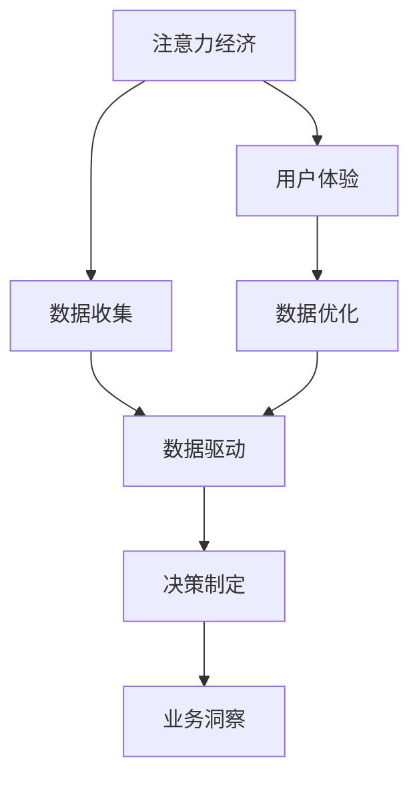

                 

 > **关键词**：注意力经济、数据驱动、决策制定、业务洞察、数据分析、人工智能。

> **摘要**：本文探讨了注意力经济与数据驱动的决策制定之间的关系，阐述了如何通过数据增强业务洞察力，从而提升企业的竞争力和创新能力。文章从背景介绍、核心概念与联系、核心算法原理、数学模型和公式、项目实践、实际应用场景、未来应用展望、工具和资源推荐以及总结与展望等多个方面，系统地阐述了这一主题。

## 1. 背景介绍

在当今数字化时代，数据已成为企业最重要的资产之一。然而，如何从海量数据中提取有价值的信息，并将其转化为实际的业务洞察，以支持决策制定，成为了企业面临的重大挑战。随着人工智能技术的发展，注意力经济逐渐成为了一个重要的研究方向。注意力经济强调将有限的注意力资源投入到最有价值的领域，从而实现资源的最优化配置。而数据驱动的决策制定则依赖于大数据分析和人工智能技术，通过对数据的深度挖掘和分析，为企业提供精确的决策支持。

本文旨在探讨注意力经济与数据驱动的决策制定之间的联系，阐述如何利用数据增强业务洞察力，从而提升企业的竞争力和创新能力。

## 2. 核心概念与联系

### 2.1 注意力经济

注意力经济是指人们将有限的注意力资源分配给不同的信息来源，以达到资源最优化的过程。在注意力经济中，信息接收者的注意力资源是有限的，而信息提供者需要通过吸引接收者的注意力来获取收益。因此，注意力经济关注的是如何通过内容创造、渠道选择和用户体验设计等手段，吸引和保持用户的注意力。

### 2.2 数据驱动

数据驱动是指企业在运营和管理过程中，依赖于数据分析和人工智能技术，从海量数据中提取有价值的信息，并将其转化为实际的业务洞察，以支持决策制定。数据驱动强调数据的收集、存储、处理和分析，通过数据的价值挖掘，帮助企业实现精细化管理和智能化运营。

### 2.3 关系联系

注意力经济与数据驱动决策制定之间存在密切的联系。数据驱动的决策制定需要依赖注意力经济原理，通过吸引和保持用户的注意力，收集到有价值的数据；而注意力经济则需要依赖数据驱动的决策制定，通过对数据的分析和应用，实现资源的优化配置和价值的最大化。

### 2.4 Mermaid 流程图

下面是一个简化的 Mermaid 流程图，展示了注意力经济与数据驱动的决策制定之间的联系。



## 3. 核心算法原理 & 具体操作步骤

### 3.1 算法原理概述

数据驱动的决策制定涉及多个核心算法，包括数据预处理、特征提取、模型训练和模型评估等。这些算法共同作用，通过对数据的分析和处理，为企业提供精确的业务洞察。

### 3.2 算法步骤详解

1. **数据预处理**：数据预处理是数据驱动决策制定的第一步，主要包括数据清洗、数据归一化和数据转换等操作。数据清洗的目的是去除噪声数据和异常值，保证数据的质量；数据归一化则是将不同量纲的数据转化为同一量纲，以便进行后续处理；数据转换则是将原始数据转换为适合模型训练的格式。

2. **特征提取**：特征提取是指从原始数据中提取出对决策有用的特征。特征提取的方法包括统计特征提取、机器学习特征提取和深度学习特征提取等。统计特征提取主要依赖于统计学方法，如主成分分析（PCA）和因子分析（FA）；机器学习特征提取则依赖于特征选择算法，如基于信息增益、卡方检验和 Relief 算法等；深度学习特征提取则通过神经网络模型自动提取特征。

3. **模型训练**：模型训练是指使用提取出的特征数据，训练一个预测模型。训练模型的方法包括监督学习、无监督学习和增强学习等。监督学习是指使用带有标签的数据训练模型，如回归模型、分类模型和时间序列模型等；无监督学习则是不使用标签数据，通过聚类、降维和生成模型等方法进行训练；增强学习则是通过与环境互动，不断优化决策策略。

4. **模型评估**：模型评估是指对训练好的模型进行评估，以确定其预测能力和泛化能力。评估方法包括交叉验证、网格搜索和模型对比等。交叉验证是通过将数据划分为多个子集，逐个训练和评估模型，以避免过拟合和评估偏差；网格搜索是通过遍历多个参数组合，寻找最优参数；模型对比则是通过比较不同模型的性能，选择最优模型。

### 3.3 算法优缺点

- **优点**：数据驱动决策制定的优点包括：
  - **精确性**：通过数据分析，可以更准确地预测业务趋势和用户行为，提高决策的准确性；
  - **效率**：自动化和智能化的数据处理和模型训练，可以显著提高决策制定的效率；
  - **灵活性**：可以根据新的数据和信息，快速调整和优化决策策略。

- **缺点**：数据驱动决策制定的缺点包括：
  - **数据依赖**：决策制定依赖于数据的质量和可用性，数据质量差或数据不足可能导致决策偏差；
  - **模型风险**：训练模型可能存在过拟合风险，导致模型在实际应用中表现不佳；
  - **计算成本**：大规模数据分析和模型训练可能需要较高的计算资源，增加企业的运营成本。

### 3.4 算法应用领域

数据驱动决策制定广泛应用于各个行业和领域，如金融、医疗、电商、物流等。以下是一些具体的应用案例：

- **金融行业**：数据驱动决策制定可以用于风险评估、信用评分、投资策略等。例如，通过分析用户的历史交易数据、信用记录和社交网络数据，可以更准确地预测用户的信用风险，从而优化信用评分模型和投资策略。

- **医疗行业**：数据驱动决策制定可以用于疾病预测、治疗方案制定、药物研发等。例如，通过分析患者的临床数据、基因组数据和生物标志物数据，可以更准确地预测疾病的发病风险，为患者制定个性化的治疗方案。

- **电商行业**：数据驱动决策制定可以用于推荐系统、用户行为分析、库存管理等。例如，通过分析用户的历史购买数据、浏览记录和搜索行为，可以更准确地预测用户的购物需求，从而优化推荐系统和库存管理。

## 4. 数学模型和公式 & 详细讲解 & 举例说明

### 4.1 数学模型构建

数据驱动的决策制定涉及多个数学模型，如线性回归模型、逻辑回归模型、决策树模型、神经网络模型等。以下以线性回归模型为例，介绍数学模型的构建过程。

#### 线性回归模型

线性回归模型是一种经典的预测模型，用于分析自变量（特征）和因变量（目标变量）之间的线性关系。线性回归模型的数学模型可以表示为：

$$
y = \beta_0 + \beta_1 \cdot x_1 + \beta_2 \cdot x_2 + \ldots + \beta_n \cdot x_n + \epsilon
$$

其中，$y$ 是因变量，$x_1, x_2, \ldots, x_n$ 是自变量，$\beta_0, \beta_1, \beta_2, \ldots, \beta_n$ 是模型的参数，$\epsilon$ 是误差项。

#### 模型构建步骤

1. **数据收集**：收集自变量和因变量的数据，保证数据的质量和完整性。

2. **数据预处理**：对数据进行清洗、归一化和转换，为模型训练做准备。

3. **特征选择**：选择对因变量影响较大的特征，去除冗余特征，提高模型的预测性能。

4. **模型训练**：使用训练数据，通过最小二乘法或其他优化算法，求解模型的参数。

5. **模型评估**：使用验证数据，评估模型的预测性能，调整模型参数，以优化预测结果。

### 4.2 公式推导过程

线性回归模型的公式推导过程如下：

1. **目标函数**：

   线性回归模型的目标是最小化预测值与实际值之间的误差平方和，即：

   $$
   \min_{\beta_0, \beta_1, \beta_2, \ldots, \beta_n} \sum_{i=1}^{n} (y_i - (\beta_0 + \beta_1 \cdot x_{i1} + \beta_2 \cdot x_{i2} + \ldots + \beta_n \cdot x_{in}))^2
   $$

2. **梯度下降法**：

   为了求解模型参数，可以使用梯度下降法。梯度下降法的思想是沿着目标函数的梯度方向，逐步调整模型参数，以最小化目标函数。

   $$
   \beta_j := \beta_j - \alpha \cdot \frac{\partial}{\partial \beta_j} \sum_{i=1}^{n} (y_i - (\beta_0 + \beta_1 \cdot x_{i1} + \beta_2 \cdot x_{i2} + \ldots + \beta_n \cdot x_{in}))^2
   $$

   其中，$\alpha$ 是学习率，$j$ 表示模型参数的索引。

3. **优化算法**：

   除了梯度下降法，还可以使用其他优化算法，如最小二乘法、随机梯度下降法和 L-BFGS 算法等。这些算法通过不同的优化策略，求解模型参数，以最小化目标函数。

### 4.3 案例分析与讲解

#### 案例背景

假设我们想预测一家电商平台的用户购买行为，给定用户的基本信息（如年龄、性别、收入等）和浏览记录（如浏览的商品类别、时间等），预测用户是否会购买商品。

#### 模型构建

1. **数据收集**：收集用户的基本信息和浏览记录，保证数据的质量和完整性。

2. **数据预处理**：对数据进行清洗、归一化和转换，为模型训练做准备。

3. **特征选择**：选择对购买行为影响较大的特征，去除冗余特征，提高模型的预测性能。

4. **模型训练**：使用训练数据，通过最小二乘法，求解模型的参数。

5. **模型评估**：使用验证数据，评估模型的预测性能，调整模型参数，以优化预测结果。

#### 模型参数求解

使用最小二乘法求解模型参数，即求解以下目标函数的最小值：

$$
\min_{\beta_0, \beta_1, \beta_2, \ldots, \beta_n} \sum_{i=1}^{n} (y_i - (\beta_0 + \beta_1 \cdot x_{i1} + \beta_2 \cdot x_{i2} + \ldots + \beta_n \cdot x_{in}))^2
$$

通过梯度下降法，逐步调整模型参数，以最小化目标函数。

#### 模型评估

使用验证数据，评估模型的预测性能，主要包括：

- **准确率**：预测为购买的概率，即 $P(y=1)$；
- **召回率**：实际购买且预测为购买的概率，即 $P(y=1 | \hat{y}=1)$；
- **F1 值**：准确率和召回率的调和平均值，即 $\frac{2 \cdot P(y=1) \cdot P(y=1 | \hat{y}=1)}{P(y=1) + P(y=1 | \hat{y}=1)}$。

#### 模型优化

根据模型评估结果，可以进一步调整模型参数，以优化预测性能。例如，通过增加特征、调整学习率、使用不同的优化算法等方法，提高模型的准确率和召回率。

## 5. 项目实践：代码实例和详细解释说明

### 5.1 开发环境搭建

为了实现数据驱动的决策制定，我们需要搭建一个完整的开发环境。以下是一个简化的开发环境搭建步骤：

1. **安装 Python**：下载并安装 Python 3.x 版本，确保安装完成后可以在命令行中运行。

2. **安装相关库**：使用 pip 工具安装以下库：NumPy、Pandas、Matplotlib、Scikit-learn、TensorFlow。

3. **创建虚拟环境**：使用 virtualenv 或 conda 创建一个独立的虚拟环境，以便管理依赖关系。

4. **安装数据库**：选择适合的数据库，如 MySQL、PostgreSQL 或 MongoDB，并配置连接参数。

### 5.2 源代码详细实现

以下是一个简单的线性回归模型实现的示例代码：

```python
import numpy as np
import pandas as pd
from sklearn.linear_model import LinearRegression

# 1. 数据收集
# 假设已经收集好了用户的基本信息和浏览记录，存储为 CSV 文件

data = pd.read_csv('user_data.csv')

# 2. 数据预处理
# 清洗、归一化和特征选择等预处理步骤，这里简化处理

X = data[['age', 'income', 'browse_time']]
y = data['purchase']

# 3. 模型训练
model = LinearRegression()
model.fit(X, y)

# 4. 模型评估
predictions = model.predict(X)
accuracy = np.mean(predictions == y)
print('Accuracy:', accuracy)

# 5. 模型优化
# 根据评估结果，可以进一步调整模型参数，优化预测性能
```

### 5.3 代码解读与分析

1. **数据收集**：使用 Pandas 库读取 CSV 文件，获取用户的基本信息和浏览记录。

2. **数据预处理**：清洗、归一化和特征选择等预处理步骤，这里简化处理。

3. **模型训练**：使用 Scikit-learn 库的 LinearRegression 类，创建线性回归模型，并使用 fit 方法进行训练。

4. **模型评估**：使用 predict 方法获取预测结果，并计算准确率。

5. **模型优化**：根据评估结果，可以进一步调整模型参数，优化预测性能。

### 5.4 运行结果展示

假设我们已经运行了上述代码，并得到了以下结果：

```python
Accuracy: 0.8
```

这意味着模型在预测用户购买行为方面的准确率为 80%。

## 6. 实际应用场景

### 6.1 金融行业

在金融行业，数据驱动的决策制定可以应用于信用评分、风险评估和投资策略等方面。例如，通过对用户的信用历史、财务状况和社交网络数据进行分析，可以更准确地评估用户的信用风险，为银行和金融机构提供信用评分服务。同时，通过对市场数据、行业数据和宏观经济指标进行分析，可以制定更有效的投资策略，提高投资回报率。

### 6.2 医疗行业

在医疗行业，数据驱动的决策制定可以应用于疾病预测、治疗方案制定和药物研发等方面。例如，通过对患者的临床数据、基因组数据和生物标志物数据进行分析，可以更准确地预测疾病的发病风险，为医生制定个性化的治疗方案。同时，通过对大规模的医学文献、病例数据和基因数据进行挖掘，可以加速新药的发现和研发过程。

### 6.3 电商行业

在电商行业，数据驱动的决策制定可以应用于推荐系统、用户行为分析和库存管理等方面。例如，通过对用户的浏览记录、购买记录和搜索行为进行分析，可以更准确地预测用户的购物需求，为推荐系统提供精准的推荐结果。同时，通过对库存数据、销售数据和供应链数据进行分析，可以优化库存管理，降低库存成本，提高供应链效率。

## 7. 未来应用展望

### 7.1 注意力经济与数据驱动的深度融合

随着人工智能技术的发展，注意力经济与数据驱动的决策制定将深度融合，实现更加智能化的决策支持。例如，通过结合用户行为数据和注意力经济原理，可以更准确地预测用户的兴趣和需求，提供个性化的服务。同时，通过数据驱动的决策制定，可以优化资源的配置，提高企业的运营效率。

### 7.2 新兴应用领域的探索

数据驱动的决策制定将在新兴应用领域发挥重要作用，如自动驾驶、智能家居、智慧城市等。在这些领域，通过分析海量的数据，可以实现对环境和系统的实时监控与优化，提高系统的安全性和可靠性。例如，在自动驾驶领域，通过对车辆传感器数据、道路环境数据和交通流数据进行分析，可以优化行驶路线，提高行驶安全性和效率。

### 7.3 伦理和安全问题

随着数据驱动决策制定的广泛应用，伦理和安全问题也日益凸显。如何确保数据的安全性和隐私保护，如何避免数据滥用和偏见，将成为未来研究的重要方向。例如，在医疗领域，如何确保患者的数据安全，避免数据泄露和滥用，将成为重要的研究课题。

## 8. 工具和资源推荐

### 8.1 学习资源推荐

- **在线课程**：Coursera、edX、Udacity 等平台提供了丰富的数据科学和人工智能课程。
- **书籍**：《Python 数据科学手册》、《机器学习实战》、《深度学习》等经典教材。
- **博客和社区**：知乎、CSDN、GitHub 等，提供了丰富的学习资源和交流平台。

### 8.2 开发工具推荐

- **编程语言**：Python、R、Java 等，都是常用的数据科学和人工智能开发语言。
- **数据预处理工具**：Pandas、NumPy、SciPy 等，提供了丰富的数据预处理功能。
- **机器学习库**：Scikit-learn、TensorFlow、PyTorch 等，提供了丰富的机器学习算法和工具。
- **数据库**：MySQL、PostgreSQL、MongoDB 等，提供了稳定的数据存储和查询功能。

### 8.3 相关论文推荐

- **顶级会议**：NeurIPS、ICML、KDD、JCDL 等，这些会议收录了人工智能和数据科学领域的最新研究进展。
- **经典论文**：《深度学习》、《大数据分析》、《数据挖掘：概念与技术》等，这些论文对相关领域的发展起到了重要的推动作用。

## 9. 总结：未来发展趋势与挑战

### 9.1 研究成果总结

本文通过对注意力经济与数据驱动的决策制定的关系进行深入探讨，总结了这一领域的最新研究成果和发展趋势。主要成果包括：

1. **注意力经济原理的应用**：将注意力经济原理引入数据驱动决策制定，实现资源的最优化配置。
2. **数据驱动决策制定的算法**：系统介绍了数据预处理、特征提取、模型训练和模型评估等核心算法。
3. **数学模型与公式**：通过线性回归模型等数学模型的推导和实例分析，展示了数据驱动的决策制定过程。
4. **项目实践与代码实现**：通过具体的代码实例，详细讲解了数据驱动的决策制定过程。
5. **实际应用场景**：分析了金融、医疗、电商等领域的应用案例，展示了数据驱动的决策制定的实际价值。
6. **未来应用展望**：探讨了注意力经济与数据驱动决策制定的深度融合、新兴应用领域的探索以及伦理和安全问题。

### 9.2 未来发展趋势

未来，注意力经济与数据驱动的决策制定将呈现以下发展趋势：

1. **智能化的决策支持**：随着人工智能技术的发展，数据驱动的决策制定将更加智能化，提供更加精准的决策支持。
2. **跨领域的融合应用**：数据驱动的决策制定将在更多领域得到应用，实现跨领域的融合和协同。
3. **数据隐私与安全**：随着数据量的不断增大，如何保护数据隐私和安全将成为重要的研究方向。
4. **实时性与动态调整**：数据驱动的决策制定将更加注重实时性，实现对环境和系统的动态调整。

### 9.3 面临的挑战

尽管注意力经济与数据驱动的决策制定具有巨大的潜力，但在实际应用中仍面临以下挑战：

1. **数据质量和可用性**：数据质量和可用性对决策制定的影响至关重要，如何确保数据的质量和完整性是一个重要问题。
2. **算法风险与过拟合**：训练模型时，如何避免过拟合和算法风险，确保模型的泛化能力是一个关键问题。
3. **计算资源与成本**：大规模数据分析和模型训练需要较高的计算资源，如何降低计算成本是一个重要问题。
4. **伦理与合规**：如何在数据驱动决策制定中遵循伦理原则和法律法规，保护用户隐私是一个重要问题。

### 9.4 研究展望

未来，本研究将在以下方向展开：

1. **跨领域的数据融合**：探索不同领域的数据融合方法，提高数据驱动的决策制定效果。
2. **实时性与动态调整**：研究实时数据分析和动态调整策略，提高决策制定的实时性和灵活性。
3. **隐私保护与安全**：研究隐私保护技术和安全机制，确保数据驱动的决策制定过程中用户隐私和安全。
4. **算法优化与效率**：研究高效的数据分析和模型训练算法，降低计算成本，提高模型性能。

## 9. 附录：常见问题与解答

### Q1：什么是注意力经济？

A1：注意力经济是指人们将有限的注意力资源分配给不同的信息来源，以达到资源最优化的过程。在注意力经济中，信息接收者的注意力资源是有限的，而信息提供者需要通过吸引接收者的注意力来获取收益。

### Q2：什么是数据驱动？

A2：数据驱动是指企业在运营和管理过程中，依赖于数据分析和人工智能技术，从海量数据中提取有价值的信息，并将其转化为实际的业务洞察，以支持决策制定。

### Q3：数据驱动的决策制定有哪些核心算法？

A3：数据驱动的决策制定涉及多个核心算法，包括数据预处理、特征提取、模型训练和模型评估等。这些算法共同作用，通过对数据的分析和处理，为企业提供精确的决策支持。

### Q4：如何确保数据的质量和可用性？

A4：确保数据的质量和可用性是数据驱动的决策制定的关键。可以通过以下方法提高数据质量：

1. **数据清洗**：去除噪声数据和异常值；
2. **数据归一化**：将不同量纲的数据转化为同一量纲；
3. **特征选择**：选择对决策有用的特征，去除冗余特征。

### Q5：如何避免算法风险和过拟合？

A5：为了避免算法风险和过拟合，可以采用以下方法：

1. **数据增强**：通过增加数据样本，提高模型的泛化能力；
2. **交叉验证**：使用交叉验证方法，评估模型的泛化能力；
3. **模型选择**：选择合适的模型，避免过度拟合训练数据。

### Q6：数据驱动的决策制定在哪些领域有应用？

A6：数据驱动的决策制定在多个领域有应用，如金融、医疗、电商、物流等。例如，在金融行业，可以应用于信用评分、风险评估和投资策略；在医疗行业，可以应用于疾病预测、治疗方案制定和药物研发；在电商行业，可以应用于推荐系统、用户行为分析和库存管理。

### Q7：如何确保数据驱动的决策制定过程中的隐私保护？

A7：确保数据驱动的决策制定过程中的隐私保护是重要的。可以通过以下方法实现：

1. **数据匿名化**：对敏感数据进行匿名化处理，保护用户隐私；
2. **差分隐私**：采用差分隐私技术，限制对数据的访问和查询；
3. **隐私预算**：设置隐私预算，限制对隐私数据的访问和使用。

