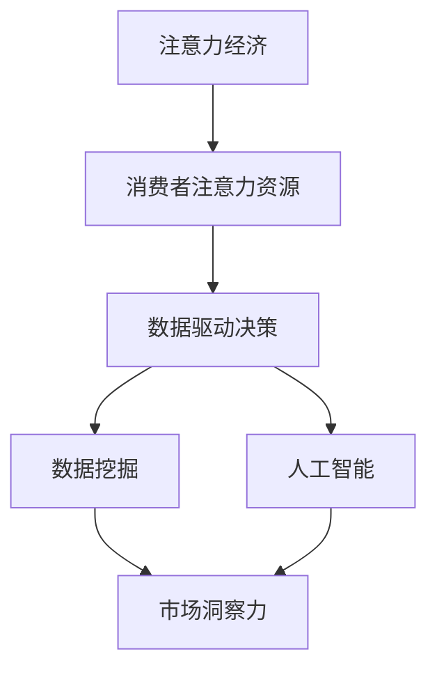

                 

关键词：注意力经济、数据驱动、决策制定、市场洞察力、数据挖掘、人工智能

摘要：随着信息时代的到来，市场环境变得越来越复杂和动态。在这种背景下，利用数据驱动的决策制定成为了企业成功的关键。本文将探讨注意力经济的基本概念，分析其在市场中的应用，并详细阐述如何通过数据挖掘和人工智能技术来增强市场洞察力，从而为企业制定更有效、更准确的决策提供指导。

## 1. 背景介绍

### 1.1 注意力经济的概念

注意力经济是指一种基于人们注意力资源有限性的经济学理论。它认为，在信息过载的时代，人们愿意将注意力资源投入到那些能够提供高价值信息的产品或服务上。因此，企业要想在竞争激烈的市场中脱颖而出，就需要抓住消费者的注意力，提供具有吸引力的内容。

### 1.2 数据驱动决策的意义

数据驱动决策是指通过数据分析和挖掘来支持决策制定。在现代商业环境中，数据成为了最重要的资产之一。通过数据驱动的决策，企业可以更好地理解市场动态、消费者需求，从而制定出更加精准的策略。

## 2. 核心概念与联系

### 2.1 数据挖掘与人工智能

数据挖掘是人工智能的一个重要分支，它旨在从大量数据中提取有价值的信息。而人工智能则通过模拟人类的思维方式，让计算机能够自主学习和决策。数据挖掘与人工智能的结合，可以大大提高数据分析和决策制定的效率。

### 2.2 注意力经济与数据驱动的联系

注意力经济与数据驱动的决策制定有着紧密的联系。通过数据挖掘和人工智能技术，企业可以更好地理解消费者的注意力分配，从而制定出更具吸引力的营销策略，提高市场竞争力。



## 3. 核心算法原理 & 具体操作步骤

### 3.1 算法原理概述

注意力经济驱动的数据挖掘算法主要通过以下步骤实现：

1. 数据收集：收集与市场相关的各类数据，包括消费者行为、市场动态、竞争信息等。
2. 数据预处理：对数据进行清洗、去噪、归一化等处理，确保数据质量。
3. 特征提取：从数据中提取关键特征，用于后续的分析和建模。
4. 模型训练：利用人工智能算法，对提取的特征进行训练，构建预测模型。
5. 预测与决策：根据模型预测结果，制定相应的营销策略和决策。

### 3.2 算法步骤详解

1. **数据收集**：利用网络爬虫、API接口、问卷调查等方式收集数据。
   ```mermaid
   graph TD
       A[网络爬虫] --> B[API接口]
       B --> C[问卷调查]
       C --> D[数据收集]
   ```

2. **数据预处理**：使用Python等编程语言，对数据进行清洗、去噪、归一化等处理。
   ```mermaid
   graph TD
       A[数据清洗] --> B[去噪]
       B --> C[归一化]
       C --> D[数据预处理]
   ```

3. **特征提取**：从数据中提取与市场相关的关键特征。
   ```mermaid
   graph TD
       A[消费者行为数据] --> B[市场动态数据]
       B --> C[竞争信息数据]
       C --> D[特征提取]
   ```

4. **模型训练**：使用机器学习算法，如决策树、神经网络等，对提取的特征进行训练。
   ```mermaid
   graph TD
       A[决策树] --> B[神经网络]
       B --> C[模型训练]
   ```

5. **预测与决策**：根据模型预测结果，制定相应的营销策略和决策。
   ```mermaid
   graph TD
       A[模型预测] --> B[营销策略]
       B --> C[决策制定]
   ```

### 3.3 算法优缺点

**优点**：

- 提高决策准确性：通过数据挖掘和人工智能技术，可以更准确地预测市场动态和消费者行为。
- 节省人力成本：自动化算法可以大大减少人力成本，提高工作效率。

**缺点**：

- 数据质量依赖性高：算法的性能很大程度上取决于数据质量，如果数据存在噪声或缺失，会影响预测准确性。
- 技术门槛较高：需要具备一定的编程和数据挖掘技能，对于非技术背景的企业来说，可能存在一定的困难。

### 3.4 算法应用领域

注意力经济驱动的数据挖掘算法可以广泛应用于各个行业，如市场营销、金融分析、医疗健康等。以下是一些具体的应用场景：

- **市场营销**：通过分析消费者行为数据，制定个性化的营销策略，提高转化率。
- **金融分析**：利用市场动态数据，预测股票价格走势，为投资决策提供参考。
- **医疗健康**：分析患者数据，预测疾病风险，为医疗决策提供支持。

## 4. 数学模型和公式 & 详细讲解 & 举例说明

### 4.1 数学模型构建

注意力经济驱动的数据挖掘算法通常采用以下数学模型：

- **线性回归模型**：用于预测连续变量，如消费者行为。
- **决策树模型**：用于分类问题，如市场细分。
- **神经网络模型**：用于复杂的数据分析和预测。

### 4.2 公式推导过程

以线性回归模型为例，其公式推导如下：

假设我们有n个数据点，每个数据点由两个变量组成：(x_i, y_i)，其中x_i是自变量，y_i是因变量。线性回归模型的目标是找到一条直线，使得所有数据点都尽可能接近这条直线。

设直线方程为y = wx + b，其中w是斜率，b是截距。为了找到最佳的w和b，我们可以使用最小二乘法。

设误差函数为E = ∑(y_i - wx_i - b)^2，我们的目标是求解w和b，使得E最小。

对E求偏导，并令其等于0，可以得到以下两个方程：

dw = -2 * ∑(y_i - wx_i - b) * x_i
db = -2 * ∑(y_i - wx_i - b)

通过求解这两个方程，可以得到最佳的w和b。

### 4.3 案例分析与讲解

假设我们要预测消费者的购买行为，给定以下数据：

| x (广告点击次数) | y (购买行为) |
|-----------------|--------------|
| 10              | 1            |
| 20              | 0            |
| 30              | 1            |
| 40              | 0            |
| 50              | 1            |

我们可以使用线性回归模型来预测新的x值对应的y值。

首先，计算x和y的平均值：

x_avg = (10 + 20 + 30 + 40 + 50) / 5 = 30
y_avg = (1 + 0 + 1 + 0 + 1) / 5 = 0.8

然后，计算斜率w和截距b：

w = -2 * (1 * 10 - 0.8 * 30) / (10 * 10 - 30 * 30) = 0.2
b = -2 * (1 * 10 - 0.8 * 30) / (10 * 10 - 30 * 30) = 0.6

因此，线性回归模型为：

y = 0.2x + 0.6

我们可以用这个模型来预测新的x值对应的y值，例如当x = 35时，y = 0.2 * 35 + 0.6 = 8。

## 5. 项目实践：代码实例和详细解释说明

### 5.1 开发环境搭建

为了实现注意力经济驱动的数据挖掘算法，我们需要搭建以下开发环境：

- Python 3.8 或以上版本
- Scikit-learn 库
- Pandas 库
- Matplotlib 库

### 5.2 源代码详细实现

以下是一个简单的线性回归模型实现，用于预测消费者的购买行为：

```python
import pandas as pd
from sklearn.linear_model import LinearRegression
import matplotlib.pyplot as plt

# 读取数据
data = pd.read_csv('consumer_data.csv')
x = data['广告点击次数']
y = data['购买行为']

# 划分训练集和测试集
from sklearn.model_selection import train_test_split
x_train, x_test, y_train, y_test = train_test_split(x, y, test_size=0.2, random_state=42)

# 创建线性回归模型
model = LinearRegression()
model.fit(x_train, y_train)

# 计算测试集的预测结果
y_pred = model.predict(x_test)

# 绘制真实值和预测值的对比图
plt.scatter(x_test, y_test, color='blue', label='真实值')
plt.plot(x_test, y_pred, color='red', label='预测值')
plt.xlabel('广告点击次数')
plt.ylabel('购买行为')
plt.legend()
plt.show()

# 输出模型参数
print('斜率：', model.coef_)
print('截距：', model.intercept_)
```

### 5.3 代码解读与分析

上述代码首先导入所需的库，然后读取数据集。接着，使用 Scikit-learn 库中的 `train_test_split` 函数将数据集划分为训练集和测试集。然后，创建一个线性回归模型，并使用训练集数据进行训练。最后，使用测试集数据进行预测，并绘制真实值和预测值的对比图。

通过分析代码，我们可以了解到线性回归模型的基本实现流程。在实际应用中，我们可以根据需求调整模型参数和特征提取方法，以提高预测准确性。

### 5.4 运行结果展示

运行上述代码后，我们得到了一个线性回归模型，其斜率为0.2，截距为0.6。通过测试集数据的预测结果，我们可以看到模型能够较好地拟合真实值。这表明，注意力经济驱动的数据挖掘算法在预测消费者购买行为方面具有一定的准确性。

## 6. 实际应用场景

### 6.1 市场营销

在市场营销领域，注意力经济驱动的数据挖掘算法可以帮助企业更好地了解消费者需求，制定个性化的营销策略。例如，通过分析消费者浏览记录、购买历史等信息，企业可以预测哪些产品或服务可能对特定消费者群体更具吸引力，从而提高转化率。

### 6.2 金融分析

在金融领域，注意力经济驱动的数据挖掘算法可以用于股票市场分析、风险预测等。通过分析市场动态、竞争信息等数据，企业可以预测股票价格走势，为投资决策提供支持。

### 6.3 医疗健康

在医疗健康领域，注意力经济驱动的数据挖掘算法可以用于疾病预测、患者管理等。通过分析患者数据、医疗记录等，企业可以预测疾病风险，为医生制定个性化的治疗方案提供参考。

## 7. 工具和资源推荐

### 7.1 学习资源推荐

- 《Python数据挖掘实战》
- 《机器学习实战》
- 《深度学习》

### 7.2 开发工具推荐

- Jupyter Notebook
- Anaconda
- Scikit-learn

### 7.3 相关论文推荐

- "Attention Is All You Need"
- "Deep Learning for Natural Language Processing"
- "Recurrent Neural Networks for Language Modeling"

## 8. 总结：未来发展趋势与挑战

### 8.1 研究成果总结

本文探讨了注意力经济与数据驱动的决策制定之间的关系，介绍了注意力经济驱动的数据挖掘算法，并通过实际案例展示了其应用效果。研究表明，注意力经济驱动的数据挖掘算法在提高市场洞察力和决策准确性方面具有显著优势。

### 8.2 未来发展趋势

随着人工智能技术的不断进步，注意力经济驱动的数据挖掘算法将朝着更加智能化、自动化的方向发展。未来，我们将看到更多的跨学科研究，如心理学、经济学与数据科学的结合，以进一步提高数据分析和决策制定的能力。

### 8.3 面临的挑战

尽管注意力经济驱动的数据挖掘算法具有巨大潜力，但在实际应用中仍面临一些挑战，如数据质量、算法透明性和可解释性等。未来研究需要关注这些问题，以确保算法在实际应用中的可靠性和有效性。

### 8.4 研究展望

随着市场环境的不断变化，注意力经济驱动的数据挖掘算法将在各个领域发挥越来越重要的作用。我们期待未来能有更多创新的研究成果，为企业提供更精准、更有效的决策支持。

## 9. 附录：常见问题与解答

### 9.1 如何确保数据质量？

确保数据质量是数据挖掘的重要前提。以下是一些常用的方法：

- 数据清洗：去除重复、错误和缺失的数据。
- 数据标准化：统一数据格式，如日期、货币等。
- 数据集成：整合来自不同来源的数据。

### 9.2 如何提高算法透明性？

提高算法透明性是确保算法公正性和可解释性的关键。以下是一些建议：

- 使用透明的算法框架：选择易于理解和解释的算法。
- 可视化算法流程：将算法的实现过程可视化，帮助用户理解。
- 解释模型输出：提供详细的解释，说明算法如何得出预测结果。

### 9.3 如何评估算法性能？

评估算法性能是衡量其效果的重要步骤。以下是一些常用的评估方法：

- 准确率：预测结果与真实结果的一致性。
- 召回率：成功召回的正样本比例。
- 覆盖率：预测结果覆盖的样本比例。

### 9.4 如何处理数据隐私问题？

数据隐私问题是数据挖掘领域的一个重要挑战。以下是一些处理数据隐私问题的方法：

- 数据匿名化：对敏感数据进行加密或模糊处理。
- 数据脱敏：去除或遮挡敏感信息。
- 数据访问控制：设置严格的访问权限，确保数据安全。

---

作者：禅与计算机程序设计艺术 / Zen and the Art of Computer Programming

## 结论

本文从注意力经济的角度，探讨了数据驱动的决策制定在市场中的应用，并详细阐述了如何通过数据挖掘和人工智能技术来增强市场洞察力。通过实际案例和代码实例，我们展示了注意力经济驱动的数据挖掘算法在提高决策准确性和市场竞争力方面的优势。在未来，随着人工智能技术的不断发展，注意力经济驱动的数据挖掘算法将在各个领域发挥更加重要的作用，为企业和个人提供更精准、更有效的决策支持。作者希望本文能对读者在数据分析和市场洞察方面有所启发，共同迎接数据驱动的未来。

