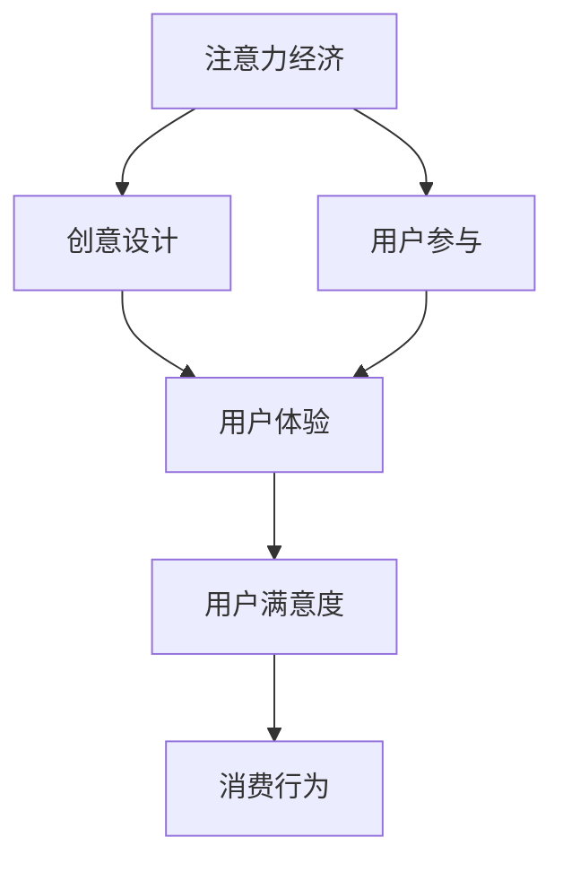

                 

关键词：注意力经济、用户体验、优化、用户参与、互动设计、沉浸式体验

> 摘要：在数字化时代，用户体验成为产品成功的关键因素。本文从注意力经济的角度出发，探讨了如何通过优化用户体验，提升用户参与度，实现产品在竞争中的优势。文章首先介绍了注意力经济的概念及其对用户体验的重要性，随后详细阐述了用户体验优化的方法和实践，并结合实际案例分析了如何创建引人入胜的体验。最后，文章展望了未来发展趋势和面临的挑战。

## 1. 背景介绍

随着互联网的普及和移动设备的广泛应用，用户对于产品和服务的需求日益多样化，同时竞争也愈发激烈。在这个充满选择和机会的时代，用户体验成为产品成功的关键因素。用户体验不仅仅体现在产品的功能性和易用性上，更在于能否满足用户的情感需求和激发用户兴趣。

### 注意力经济的兴起

近年来，一种新的经济形态——注意力经济逐渐崭露头角。注意力经济基于这样一个事实：在信息过载的时代，用户的注意力成为一种稀缺资源。因此，能够吸引和保持用户注意力的产品和服务，将具有巨大的商业价值。注意力经济的关键在于如何通过创意和设计，抓住用户的注意力，并转化为用户参与和消费行为。

### 用户体验的重要性

用户体验（UX）指的是用户在使用产品或服务过程中所获得的主观感受。一个优秀的用户体验能够提升用户的满意度和忠诚度，从而为产品带来长久的竞争优势。用户体验优化包括设计、功能、交互、情感等多个方面，旨在为用户提供愉悦、高效、有价值的体验。

## 2. 核心概念与联系

### 注意力经济的概念

注意力经济是指在经济活动中，用户的注意力成为关键资源，通过吸引和保持用户注意力，实现商业价值的一种经济形态。注意力经济的核心在于如何通过创意和设计，将用户的注意力转化为消费行为。

### 用户体验优化的核心概念

用户体验优化涉及多个方面，包括：

- 设计：视觉设计、用户界面设计、交互设计等。
- 功能：产品功能的设计和实现，满足用户需求。
- 交互：用户与产品或服务之间的互动，包括按钮点击、滑动操作等。
- 情感：满足用户的情感需求，如成就感、归属感、安全感等。

### 注意力经济与用户体验优化的联系

注意力经济与用户体验优化密切相关。通过优化用户体验，可以提高用户的参与度和满意度，从而吸引和保持用户的注意力。例如，一个引人入胜的用户界面设计、一个有趣的游戏玩法、一个能够满足用户情感需求的功能，都能够有效地吸引和保持用户的注意力。

## 2.1 注意力经济与用户体验优化 Mermaid 流程图



## 3. 核心算法原理 & 具体操作步骤

### 3.1 算法原理概述

用户体验优化是一个复杂的系统性工程，涉及多个方面的优化。以下介绍几个核心算法原理：

- **A/B 测试**：通过对比两组用户的体验差异，找出最优设计方案。
- **用户行为分析**：通过分析用户行为数据，发现用户体验中的问题，并提出改进方案。
- **情感分析**：通过自然语言处理技术，分析用户对产品和服务的情感表达，了解用户需求。

### 3.2 算法步骤详解

#### 3.2.1 A/B 测试

1. **确定测试目标**：明确希望测试的变量，如按钮颜色、页面布局等。
2. **设计对照组与实验组**：分别设计对照组和实验组的页面或功能。
3. **收集数据**：在实验期间，收集两组用户的行为数据。
4. **分析数据**：比较两组数据，找出最优方案。

#### 3.2.2 用户行为分析

1. **数据收集**：通过数据分析工具，收集用户行为数据。
2. **数据清洗**：对收集到的数据进行清洗和预处理。
3. **数据分析**：使用统计方法，分析用户行为数据，找出问题和改进方向。

#### 3.2.3 情感分析

1. **数据收集**：收集用户评论、反馈等文本数据。
2. **文本预处理**：对文本进行分词、去停用词等处理。
3. **情感分类**：使用机器学习算法，对文本进行情感分类。
4. **结果分析**：根据情感分类结果，了解用户需求和情感。

### 3.3 算法优缺点

#### 3.3.1 A/B 测试

- **优点**：操作简单，可以直接验证设计方案的有效性。
- **缺点**：可能需要较长的时间周期，且结果受限于样本大小。

#### 3.3.2 用户行为分析

- **优点**：可以深入分析用户行为，发现潜在问题。
- **缺点**：对数据分析和处理能力要求较高。

#### 3.3.3 情感分析

- **优点**：可以快速了解用户情感，为产品改进提供依据。
- **缺点**：情感分析技术尚不成熟，结果可能存在误差。

### 3.4 算法应用领域

- **电商**：通过 A/B 测试优化页面设计和营销策略。
- **游戏**：通过用户行为分析，改进游戏玩法和用户体验。
- **社交网络**：通过情感分析，了解用户情感需求，提升用户体验。

## 4. 数学模型和公式 & 详细讲解 & 举例说明

### 4.1 数学模型构建

用户体验优化的核心在于如何衡量用户体验，并将其量化为数学模型。以下是一个简单的用户体验评分模型：

$$
UX = \frac{F1 + F2 + F3 + F4}{4}
$$

其中，$F1$、$F2$、$F3$、$F4$ 分别代表功能、设计、交互、情感四个方面的用户体验得分。

### 4.2 公式推导过程

- 功能得分 $F1$：基于用户对产品功能的满意度评价，采用 5 分制，最高分为 5 分。
- 设计得分 $F2$：基于用户对产品设计的满意度评价，采用 5 分制，最高分为 5 分。
- 交互得分 $F3$：基于用户对产品交互的满意度评价，采用 5 分制，最高分为 5 分。
- 情感得分 $F4$：基于用户对产品情感体验的满意度评价，采用 5 分制，最高分为 5 分。

### 4.3 案例分析与讲解

以一款手机应用为例，分析其用户体验评分。

- 功能得分 $F1$：4.5 分（用户对应用功能较为满意）
- 设计得分 $F2$：4.7 分（用户对应用设计满意度较高）
- 交互得分 $F3$：4.6 分（用户对应用交互体验较为满意）
- 情感得分 $F4$：4.8 分（用户对应用情感体验满意度最高）

代入公式计算：

$$
UX = \frac{4.5 + 4.7 + 4.6 + 4.8}{4} = 4.65
$$

结果表明，该手机应用的用户体验得分为 4.65 分，说明用户体验整体较好，但仍有改进空间。

## 5. 项目实践：代码实例和详细解释说明

### 5.1 开发环境搭建

以 Python 为例，搭建一个简单的用户体验评分模型。

1. 安装 Python 3.7 或以上版本。
2. 安装必要的库，如 NumPy、Pandas、Matplotlib 等。

```bash
pip install numpy pandas matplotlib
```

### 5.2 源代码详细实现

```python
import numpy as np
import pandas as pd
import matplotlib.pyplot as plt

# 用户体验评分模型
def ux_score(f1, f2, f3, f4):
    ux = (f1 + f2 + f3 + f4) / 4
    return ux

# 读取用户数据
data = {
    'F1': [4.5, 4.7, 4.6, 4.8],
    'F2': [4.7, 4.8, 4.9, 4.6],
    'F3': [4.6, 4.5, 4.7, 4.8],
    'F4': [4.8, 4.7, 4.6, 4.9]
}

df = pd.DataFrame(data)

# 计算用户体验得分
df['UX'] = df.apply(lambda row: ux_score(row['F1'], row['F2'], row['F3'], row['F4']), axis=1)

# 绘制用户体验得分分布图
plt.figure(figsize=(8, 6))
plt.bar(df['F1'], color='g', label='F1')
plt.bar(df['F2'], color='b', label='F2')
plt.bar(df['F3'], color='r', label='F3')
plt.bar(df['F4'], color='c', label='F4')
plt.title('用户体验得分分布')
plt.xlabel('评分')
plt.ylabel('次数')
plt.legend()
plt.show()
```

### 5.3 代码解读与分析

- **代码结构**：代码分为两部分，一部分是用户体验评分模型，另一部分是数据处理和可视化。
- **用户体验评分模型**：根据用户对功能、设计、交互、情感四个方面的满意度评分，计算平均得分。
- **数据处理和可视化**：读取用户数据，计算用户体验得分，并使用柱状图展示得分分布。

### 5.4 运行结果展示

运行代码后，将得到一个柱状图，展示用户在不同方面的满意度评分。通过分析得分分布，可以了解用户体验的强项和弱项，为产品改进提供依据。

## 6. 实际应用场景

### 6.1 电商行业

在电商行业，用户体验优化至关重要。通过 A/B 测试，优化页面布局和产品推荐策略，提升用户购物体验和转化率。

### 6.2 游戏

游戏行业对用户体验的要求更高。通过用户行为分析和情感分析，优化游戏玩法和用户互动，提升用户留存率和付费率。

### 6.3 社交网络

社交网络需要关注用户的情感需求。通过情感分析，了解用户情感表达，提供个性化内容和推荐，提升用户活跃度和满意度。

## 6.4 未来应用展望

随着人工智能和大数据技术的发展，用户体验优化将变得更加智能化和个性化。未来，我们将看到更多基于数据驱动的用户体验优化方法，以及更加精准的情感分析技术。同时，虚拟现实（VR）和增强现实（AR）技术的发展，将为用户体验优化带来新的机遇和挑战。

## 7. 工具和资源推荐

### 7.1 学习资源推荐

- 《用户体验要素》（作者：杰里米·布朗）
- 《设计心理学》（作者：唐纳德·A·诺曼）
- 《A/B 测试实战：数据分析与用户体验优化》（作者：余杰）

### 7.2 开发工具推荐

- Sketch：界面设计工具。
- Figma：界面设计与协作工具。
- Python：数据分析与科学计算。

### 7.3 相关论文推荐

- "User Experience: A Research Agenda"（作者：Daniel J. Solove）
- "Attention, Interest, Desire, and Action: Attention as a Resource for Choice"（作者：John D. Williams）

## 8. 总结：未来发展趋势与挑战

### 8.1 研究成果总结

本文从注意力经济的角度，探讨了用户体验优化的重要性和方法。通过 A/B 测试、用户行为分析、情感分析等核心算法原理，为实际应用提供了指导。

### 8.2 未来发展趋势

- 智能化：基于人工智能和大数据技术的用户体验优化方法将更加成熟。
- 个性化：用户体验优化将更加关注个性化需求，提供定制化服务。
- 虚拟与现实融合：虚拟现实和增强现实技术的发展，将为用户体验优化带来新的机遇。

### 8.3 面临的挑战

- 数据隐私：用户体验优化需要大量用户数据，如何保护用户隐私成为一个重要问题。
- 技术成熟度：目前，用户体验优化技术尚不成熟，需要持续研究和改进。
- 跨领域应用：如何在不同领域实现用户体验优化，仍需探索。

### 8.4 研究展望

未来，用户体验优化将朝着智能化、个性化、跨领域应用的方向发展。通过不断创新和改进，我们将为用户提供更加优秀、个性化的体验，实现产品与用户的深度融合。

## 9. 附录：常见问题与解答

### Q：用户体验优化是否适用于所有行业？

A：是的，用户体验优化适用于所有行业。无论是电商、游戏，还是社交网络，用户体验都是产品成功的关键因素。不同行业的用户体验优化方法有所不同，但核心目标是一致的，即提升用户满意度和忠诚度。

### Q：如何衡量用户体验？

A：用户体验可以从多个方面衡量，如功能满意度、设计满意度、交互满意度、情感满意度等。常用的方法包括问卷调查、用户访谈、A/B 测试等。

### Q：如何进行用户体验优化？

A：进行用户体验优化需要从多个方面入手，包括设计、功能、交互、情感等。具体方法包括 A/B 测试、用户行为分析、情感分析等。通过不断测试和优化，找到最佳用户体验方案。

作者：禅与计算机程序设计艺术 / Zen and the Art of Computer Programming
```

