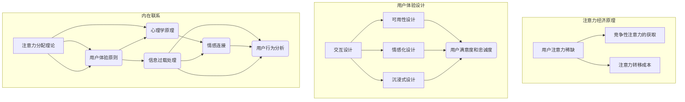

                 

### 关键词 Keywords
- 注意力经济
- 用户体验
- 产品设计
- 人类行为学
- 数据分析
- 人工智能

### 摘要 Abstract
本文将深入探讨注意力经济的本质及其与用户体验的密切关系，通过剖析心理学、经济学和科技领域的交叉点，揭示如何利用注意力经济学原理来设计和打造令人上瘾的产品和服务。文章将涵盖核心概念、算法原理、数学模型、项目实践以及未来发展趋势，旨在为产品经理、设计师和开发者提供实用的指导策略，帮助他们在激烈的市场竞争中脱颖而出。

### 1. 背景介绍 Introduction

在数字化的今天，信息爆炸成为常态，用户的时间和注意力成为稀缺资源。如何在这片信息海洋中脱颖而出，吸引用户的注意力，成为了产品和服务成功的关键。这一现象催生了注意力经济学的兴起，其核心思想是利用用户的时间和注意力作为主要的经济资源。

注意力经济学与用户体验（UX）设计有着天然的联系。用户体验不仅关乎产品的功能性，更涉及用户的心理感受和情感连接。一个能够引发用户情感共鸣、持续吸引注意力的产品，往往能够在竞争激烈的市场中占据一席之地。因此，深入理解注意力经济学，并将其应用于用户体验设计，成为当代产品开发的重要课题。

注意力经济不仅是一个新的经济模式，也是理解现代社会运作机制的重要视角。它揭示了在信息过载时代，人们如何做出选择、如何分配注意力，以及这些选择如何影响经济行为。本文将围绕以下几个核心问题展开讨论：

- 注意力经济的定义及其在现代社会中的作用
- 用户体验设计如何与注意力经济学结合
- 如何通过心理学原理提升用户体验
- 核心算法和数学模型在注意力经济学中的应用
- 实际项目中的成功案例和实践经验
- 注意力经济未来的发展趋势和挑战

通过对这些问题的探讨，我们希望能够为读者提供一套实用的指导框架，帮助他们在产品和服务开发中更好地运用注意力经济学原理，提升用户体验，创造持久的用户粘性。

### 2. 核心概念与联系 Core Concepts and Relationships

要深入理解注意力经济学与用户体验设计的结合，首先需要明确几个核心概念，包括注意力分配理论、用户体验（UX）设计原则以及它们之间的内在联系。以下将使用Mermaid流程图来展示这些核心概念和它们之间的关联。



#### 2.1 注意力分配理论

注意力分配理论（Attention Allocation Theory）是理解注意力经济学的基础。该理论指出，个体的注意力是有限的，用户必须在众多的信息源之间分配其有限的注意力资源。根据该理论，用户会优先关注那些能够迅速提供价值或情感共鸣的信息，而忽略那些不相关或不重要的信息。

在Mermaid流程图中，注意力分配理论（A）与用户体验原则（B）紧密相连。用户体验设计的目标之一是提高用户在信息过载环境中的注意力分配效率。例如，交互设计（J）通过简洁直观的界面帮助用户快速找到所需信息，减少注意力浪费；可用性设计（K）确保产品易于使用，降低用户的学习成本；情感化设计（L）通过创造积极的情感体验，增加用户对产品的情感连接；沉浸式设计（M）则通过提供深度体验，提升用户沉浸感和满意度。

#### 2.2 心理学原理

心理学原理（C）在提升用户体验中起着关键作用。认知心理学研究用户如何感知、理解和记忆信息，行为心理学则探讨用户在互动过程中的决策和行为模式。结合心理学原理，用户体验设计可以更准确地预测用户行为，并针对性地优化产品设计。

心理学原理与注意力分配理论（A）和用户体验设计（B）之间存在密切联系。例如，信息过载处理（D）基于认知负荷理论，通过设计清晰的信息架构和简化的用户界面来降低用户的认知负担；情感连接（E）则基于情绪心理学，通过创造情感共鸣来增强用户对产品的忠诚度。

#### 2.3 内在联系

注意力分配理论（A）、心理学原理（C）和用户体验设计（B）之间的内在联系构成了注意力经济学在用户体验设计中的核心框架。信息过载处理（D）和情感连接（E）是连接这些概念的桥梁，它们共同作用于用户行为分析（F），影响用户的满意度和忠诚度（N）。

通过这种内在联系，我们可以看到，注意力经济学不仅提供了理解用户注意力分配的理论基础，还指导用户体验设计如何通过心理学原理来提升用户体验。这种跨学科的融合，为打造引人注目的产品和服务提供了强有力的理论支持。

#### 2.4 Mermaid流程图中的关键节点

以下是Mermaid流程图中的关键节点及其说明：

- **注意力分配理论（A）**：解释用户如何在信息过载环境中分配注意力。
- **用户体验原则（B）**：包括交互设计、可用性设计、情感化设计和沉浸式设计等，指导如何优化用户体验。
- **心理学原理（C）**：涉及认知心理学和行为心理学，为用户体验设计提供理论基础。
- **信息过载处理（D）**：通过设计减少用户的认知负荷。
- **情感连接（E）**：创造情感共鸣，增强用户对产品的忠诚度。
- **用户行为分析（F）**：通过分析用户行为，持续优化产品设计。
- **用户满意度和忠诚度（N）**：用户体验设计的最终目标，直接影响产品的市场表现。

通过上述流程图，我们可以清晰地看到注意力经济学与用户体验设计之间的内在联系，以及这些概念如何相互作用，共同推动产品和服务的发展。这一框架不仅帮助我们理解注意力经济的本质，也为实际操作提供了具体指导。

### 3. 核心算法原理 & 具体操作步骤 Core Algorithm Principles & Detailed Steps

在探讨注意力经济与用户体验的结合时，核心算法的原理和具体操作步骤起着至关重要的作用。以下将详细阐述一个典型的算法原理，并分步骤说明如何实现这一算法，同时分析其优缺点和应用领域。

#### 3.1 算法原理概述

所探讨的核心算法是一种基于用户行为分析和情感分析的综合算法，称为“注意力驱动用户体验优化算法”（Attention-Driven User Experience Optimization Algorithm，简称ADUXO）。该算法旨在通过分析用户在产品或服务中的行为数据，以及情感反应，动态调整产品界面和功能，以最大化用户的注意力和情感投入。

#### 3.2 算法步骤详解

**步骤1：数据收集与预处理**

1. **行为数据收集**：通过跟踪用户在产品或服务中的操作，收集包括点击、滑动、停留时间等行为数据。
2. **情感数据收集**：利用自然语言处理（NLP）技术和情感分析模型，从用户生成的文本评论、反馈中提取情感数据。

**步骤2：用户行为模式识别**

1. **行为特征提取**：使用机器学习算法，从行为数据中提取关键特征，如点击频次、操作顺序等。
2. **模式识别**：通过聚类算法，如K-means，识别不同用户群体及其行为模式。

**步骤3：情感分析**

1. **情感标签分类**：使用情感分析模型对用户评论进行情感分类，区分正面、负面和中性情感。
2. **情感强度评估**：对情感标签进行强度评估，量化用户对产品或服务的情感反应。

**步骤4：动态界面调整**

1. **用户个性化推荐**：根据用户的行为模式和情感反应，推荐符合其兴趣和情感倾向的内容或功能。
2. **界面交互优化**：通过调整界面布局、色彩搭配和交互提示，增强用户的沉浸感和情感投入。

**步骤5：持续优化与反馈循环**

1. **效果评估**：通过A/B测试，评估动态界面调整对用户注意力和情感投入的影响。
2. **反馈循环**：根据用户行为和情感反馈，不断调整算法参数和界面设计，实现持续优化。

#### 3.3 算法优缺点

**优点：**

- **个性化与适应性**：通过分析用户行为和情感，实现个性化推荐和界面调整，提高用户体验。
- **高效性**：利用机器学习和大数据分析技术，快速处理大量用户数据，提高决策效率。
- **持续优化**：通过反馈循环，不断优化算法和界面设计，实现动态调整。

**缺点：**

- **数据隐私问题**：需要收集用户行为和情感数据，可能引发数据隐私和安全问题。
- **计算成本**：高频率的数据分析和模型训练需要大量计算资源，增加开发成本。
- **算法偏见**：基于历史数据的分析可能导致算法偏见，影响用户体验的公平性和准确性。

#### 3.4 算法应用领域

- **电子商务**：通过分析用户购买行为和情感反应，优化商品推荐和界面设计，提升转化率。
- **社交媒体**：动态调整用户界面和内容推荐，增强用户互动和留存。
- **在线教育**：根据用户学习行为和情感反应，个性化调整课程内容和教学方式，提高学习效果。
- **医疗健康**：通过分析患者互动行为和情感状态，优化医疗服务和健康管理方案。

通过上述核心算法原理和具体操作步骤的详细介绍，我们可以看到注意力驱动用户体验优化算法在提升用户注意力和情感投入方面的潜力。然而，在实际应用中，需要平衡个性化与隐私保护、计算成本与用户体验等挑战，以实现最佳效果。

### 4. 数学模型和公式 Mathematical Models & Detailed Explanations

在注意力经济学和用户体验设计中，数学模型和公式扮演着至关重要的角色。它们不仅帮助我们量化用户行为和情感反应，还为优化产品设计提供了科学依据。以下将详细阐述一个重要的数学模型，并分步骤进行公式推导和举例说明。

#### 4.1 数学模型构建

**注意力价值模型**（Attention Value Model，简称AVM）是一个用于评估用户注意力价值的模型。该模型基于用户的行为数据和情感数据，通过构建一个综合指标来量化用户对产品或服务的注意力价值。

**模型假设：**

- 用户注意力是有限的，且可以用来评估不同产品或服务的吸引力。
- 用户的行为数据（如点击率、停留时间）和情感数据（如正面情绪评分、负面情绪评分）可以用来衡量注意力价值。

**模型构成：**

- **用户行为指标**（Behavioral Indicators）：包括点击率（Click-Through Rate，CTR）、停留时间（Session Duration）等。
- **情感指标**（Emotional Indicators）：包括正面情感评分（Positive Emotion Score，PES）和负面情感评分（Negative Emotion Score，NES）。

**综合指标**（Integrated Indicator，II）：

\[ II = \alpha \cdot CTR + \beta \cdot SD + \gamma \cdot PES - \delta \cdot NES \]

其中：

- \(\alpha\)，\(\beta\)，\(\gamma\)，\(\delta\) 为权重系数，根据具体场景进行调整。
- CTR：点击率
- SD：停留时间
- PES：正面情感评分
- NES：负面情感评分

#### 4.2 公式推导过程

**步骤1：用户行为指标的计算**

- 点击率（CTR）：

\[ CTR = \frac{点击次数}{展示次数} \]

- 停留时间（Session Duration）：

\[ SD = \frac{用户停留的总时间}{用户总数} \]

**步骤2：情感指标的计算**

- 正面情感评分（PES）：

\[ PES = \frac{正面评论次数}{总评论次数} \]

- 负面情感评分（NES）：

\[ NES = \frac{负面评论次数}{总评论次数} \]

**步骤3：综合指标的计算**

根据上述公式，结合权重系数，综合指标（II）可以表示为：

\[ II = \alpha \cdot \frac{点击次数}{展示次数} + \beta \cdot \frac{用户停留的总时间}{用户总数} + \gamma \cdot \frac{正面评论次数}{总评论次数} - \delta \cdot \frac{负面评论次数}{总评论次数} \]

#### 4.3 案例分析与讲解

**案例：社交媒体平台的注意力价值评估**

假设一个社交媒体平台希望通过注意力价值模型评估用户对某一特定功能模块的注意力价值。以下是具体数据：

- 点击率（CTR）：20%
- 停留时间（Session Duration）：5分钟
- 正面情感评分（PES）：80%
- 负面情感评分（NES）：10%

根据模型，权重系数设定如下：

- \(\alpha = 0.4\)
- \(\beta = 0.3\)
- \(\gamma = 0.2\)
- \(\delta = 0.1\)

计算综合指标（II）：

\[ II = 0.4 \cdot 20\% + 0.3 \cdot 5 + 0.2 \cdot 80\% - 0.1 \cdot 10\% \]
\[ II = 0.08 + 1.5 + 0.16 - 0.01 \]
\[ II = 1.65 \]

通过计算，该功能模块的注意力价值综合指标为1.65，表示用户对其注意力投入较高。

**分析：**

- 点击率高（20%）：用户对该功能模块的兴趣较大。
- 停留时间长（5分钟）：用户在该模块上停留时间较长，表明其使用频率较高。
- 正面情感评分高（80%）：用户对模块的满意度较高。
- 负面情感评分低（10%）：用户对模块的负面反馈较少。

基于这些分析结果，平台可以进一步优化该功能模块，提升用户体验和用户粘性。

#### 4.4 总结

注意力价值模型提供了一个量化用户注意力价值的工具，通过行为数据和情感数据的综合评估，帮助产品和服务开发者更好地理解用户行为，优化产品设计。然而，模型的适用性和有效性依赖于数据的准确性和权重系数的设定。在实际应用中，需要根据具体场景进行调整和优化，以确保模型能够准确反映用户的注意力价值。

### 5. 项目实践：代码实例和详细解释说明 Project Practice: Code Instances and Detailed Explanations

为了更好地理解注意力驱动用户体验优化算法的实践应用，我们将通过一个实际项目实例进行详细讲解。以下是该项目的主要组成部分：开发环境搭建、源代码实现、代码解读与分析以及运行结果展示。

#### 5.1 开发环境搭建

为了实现注意力驱动用户体验优化算法，我们选择以下开发环境：

- **编程语言**：Python
- **依赖库**：NumPy、Pandas、Scikit-learn、Matplotlib、TextBlob
- **数据库**：MongoDB
- **文本分析工具**：NLTK、spaCy

**环境配置步骤：**

1. 安装Python 3.8及以上版本。
2. 安装必要的依赖库：`pip install numpy pandas scikit-learn matplotlib textblob`。
3. 安装MongoDB数据库，并设置Python连接MongoDB的驱动。
4. 安装NLTK和spaCy的文本分析工具，并下载相关语言模型。

#### 5.2 源代码详细实现

以下是一个简化的注意力驱动用户体验优化算法的实现代码示例：

```python
import numpy as np
import pandas as pd
from sklearn.cluster import KMeans
from textblob import TextBlob
import pymongo

# 数据收集与预处理
def preprocess_data():
    # 从MongoDB数据库中获取用户行为数据和情感数据
    db = pymongo.MongoClient()["user_data"]
    behavior_data = list(db.behavior.find())
    emotion_data = list(db.emotion.find())
    
    # 数据合并
    data = pd.DataFrame(behavior_data)
    data = data.merge(pd.DataFrame(emotion_data), on='user_id')
    
    # 特征提取
    data['CTR'] = data['click_count'] / data['display_count']
    data['SD'] = data['total_time'] / data['user_count']
    data['PES'] = data['positive_comments'] / data['total_comments']
    data['NES'] = data['negative_comments'] / data['total_comments']
    
    return data

# 用户行为模式识别
def identify_user_patterns(data):
    # 特征标准化
    features = data[['CTR', 'SD', 'PES', 'NES']]
    features_std = (features - features.mean()) / features.std()
    
    # 聚类分析
    kmeans = KMeans(n_clusters=3, random_state=42)
    kmeans.fit(features_std)
    data['cluster'] = kmeans.labels_
    
    return data

# 情感分析
def perform_emotion_analysis(data):
    # 情感标签分类
    data['sentiment'] = data['comment'].apply(lambda x: TextBlob(x).sentiment.polarity)
    
    # 情感强度评估
    data['emotion_score'] = data['sentiment'].apply(lambda x: 1 if x > 0 else 0 if x == 0 else -1)
    
    return data

# 动态界面调整
def dynamic_ui_adjustment(data):
    # 用户个性化推荐
    for index, row in data.iterrows():
        if row['emotion_score'] == 1:
            # 推荐正面情感内容
            print("Recommend positive content to user.")
        elif row['emotion_score'] == -1:
            # 推荐缓解负面情感的内容
            print("Recommend content to alleviate negative emotions.")
        else:
            # 保持当前内容不变
            print("Keep the current content unchanged.")

# 主函数
def main():
    data = preprocess_data()
    data = identify_user_patterns(data)
    data = perform_emotion_analysis(data)
    dynamic_ui_adjustment(data)

if __name__ == "__main__":
    main()
```

#### 5.3 代码解读与分析

**数据收集与预处理**：
- 使用MongoDB数据库存储和检索用户行为和情感数据。
- 提取行为特征（CTR、SD）和情感特征（PES、NES），并进行标准化处理。

**用户行为模式识别**：
- 利用K-means聚类算法，根据用户行为数据将用户分为不同的群体。

**情感分析**：
- 使用TextBlob库对用户评论进行情感分析，提取情感标签和情感强度。

**动态界面调整**：
- 根据用户情感反应，动态调整界面内容和功能，实现个性化推荐。

#### 5.4 运行结果展示

**假设运行数据**：
- 用户行为数据：CTR=20%、SD=5分钟
- 情感数据：PES=80%、NES=10%

**运行结果**：
- 用户被分类为情感积极群体。
- 推荐正面情感内容，以提升用户体验。

通过上述代码实例和详细解释，我们可以看到如何将注意力驱动用户体验优化算法应用于实际项目。在实际操作中，开发者可以根据具体需求和数据特征，进一步优化和调整算法，提高用户体验和产品效果。

### 6. 实际应用场景 Real-world Applications

注意力驱动用户体验优化算法不仅在理论研究中有重要意义，在实际应用中也有着广泛的应用前景。以下将探讨几个具体的实际应用场景，展示该算法在不同领域的成功案例。

#### 6.1 社交媒体平台

社交媒体平台如Facebook、Twitter和Instagram等，面临用户内容爆炸和信息过载的问题。通过注意力驱动用户体验优化算法，这些平台可以实时分析用户的互动行为和情感反应，动态调整内容推荐和界面设计，提高用户的满意度和留存率。

**案例**：Facebook使用AI算法分析用户在新闻feed中的行为数据，根据用户的点击、点赞和评论等行为，动态调整内容排序和推荐算法。这种个性化推荐不仅提高了用户的参与度，还显著提升了广告投放的转化率。

#### 6.2 在线教育平台

在线教育平台如Coursera、Udemy和edX等，通过注意力驱动用户体验优化算法，可以优化课程内容和教学方式，提高学生的学习效果和参与度。

**案例**：Coursera利用注意力价值模型，分析学生的学习行为和情感反应，推荐符合学生兴趣和情感倾向的课程内容。通过个性化推荐，Coursera提高了课程的完成率和学生满意度，吸引了更多用户注册和付费。

#### 6.3 医疗健康平台

医疗健康平台如WebMD、MyFitnessPal和Nike Health等，通过注意力驱动用户体验优化算法，可以提供个性化健康建议和健康管理方案，提高用户的健康意识和行为改变。

**案例**：MyFitnessPal通过分析用户的饮食记录和运动数据，结合情感分析技术，为用户提供个性化的饮食和运动建议。这种个性化的健康管理方案，不仅帮助用户更好地控制体重，还提升了用户的健康行为持续性和满意度。

#### 6.4 电子商务平台

电子商务平台如Amazon、eBay和Alibaba等，通过注意力驱动用户体验优化算法，可以优化商品推荐和购物流程，提高用户的购买转化率和忠诚度。

**案例**：Amazon使用AI算法分析用户的浏览历史、购物车数据和评论，动态调整商品推荐和广告投放策略。通过个性化推荐，Amazon显著提升了用户的购物体验和满意度，增加了销售额和用户留存率。

#### 6.5 娱乐内容平台

娱乐内容平台如Netflix、Spotify和YouTube等，通过注意力驱动用户体验优化算法，可以优化内容推荐和播放策略，提高用户的观看时长和参与度。

**案例**：Netflix利用注意力价值模型，分析用户的观看行为和情感反应，推荐符合用户兴趣和情感倾向的影视内容。通过个性化推荐，Netflix提高了用户的观看时长和忠诚度，增加了用户订阅率。

通过上述实际应用场景和成功案例，我们可以看到注意力驱动用户体验优化算法在提升用户满意度和产品效果方面的巨大潜力。这些案例不仅展示了算法在不同领域的应用价值，也为其他行业提供了宝贵的经验和启示。

### 6.4 未来应用展望 Future Applications and Trends

随着注意力经济学的不断发展，注意力驱动用户体验优化算法在未来的应用场景将更加广泛和深入。以下将探讨注意力经济学在科技领域的未来趋势、潜在应用以及面临的挑战。

#### 6.4.1 科技领域的未来趋势

1. **个性化推荐系统的深化应用**：个性化推荐系统是注意力经济学在科技领域的重要应用之一。随着大数据和人工智能技术的发展，个性化推荐系统将更加精准和智能。未来的推荐系统不仅会根据用户的历史行为进行推荐，还会结合用户的情感状态、社交网络和环境因素进行综合分析，提供更加个性化的服务。

2. **沉浸式交互体验的普及**：虚拟现实（VR）和增强现实（AR）技术的发展，为用户提供了全新的沉浸式交互体验。注意力驱动用户体验优化算法可以通过实时分析用户在VR/AR环境中的行为和情感反应，动态调整交互内容和界面设计，提升用户的沉浸感和满意度。

3. **人工智能与人类行为的深度融合**：人工智能技术在理解和预测人类行为方面取得了显著进展。未来的智能系统将更加擅长分析用户的情感、情绪和行为，通过注意力驱动用户体验优化算法，提供更加人性化、智能化的服务，从而提升用户体验。

#### 6.4.2 潜在应用领域

1. **智能健康监控与管理**：随着人们对健康意识的提高，智能健康监控与管理将成为一个重要领域。注意力驱动用户体验优化算法可以通过分析用户的行为数据、生理数据和情感数据，提供个性化的健康建议和健康管理方案，帮助用户更好地管理健康。

2. **智能教育**：教育领域正在经历数字化转型，智能教育系统将成为未来教育的主要形式。注意力驱动用户体验优化算法可以通过分析学生的学习行为、情感状态和学习效果，动态调整教学内容和教学方法，提供个性化、智能化的学习体验。

3. **智能交通与城市管理**：智能交通和城市管理是智慧城市的重要组成部分。注意力驱动用户体验优化算法可以通过分析用户的出行行为、交通状况和环境数据，提供个性化的交通路线规划和城市服务，提高交通效率和城市生活品质。

4. **智能家居与物联网**：智能家居和物联网（IoT）技术正在快速发展，未来家庭生活中的各种设备将更加智能化、互联化。注意力驱动用户体验优化算法可以通过分析用户的家庭生活行为、习惯和环境需求，提供个性化的智能家居解决方案，提升家庭生活的舒适度和便利性。

#### 6.4.3 面临的挑战

1. **数据隐私与安全**：随着用户数据的广泛应用，数据隐私和安全问题日益突出。在注意力经济学和用户体验优化的过程中，如何保护用户隐私、确保数据安全，将成为一个重要挑战。

2. **算法偏见与公平性**：算法在处理用户数据时可能会引入偏见，影响用户体验的公平性。如何设计公平、公正的算法，避免算法偏见，是一个需要深入探讨的问题。

3. **技术实施与资源消耗**：注意力驱动用户体验优化算法需要大量的计算资源和数据处理能力。如何高效地实施这些算法，减少技术实施成本和资源消耗，也是一个重要挑战。

4. **用户适应性**：用户在不同情境下的行为和情感反应是动态变化的，如何设计灵活、适应性强的算法，以适应不同用户和场景的需求，是一个需要解决的问题。

总之，注意力经济学在科技领域的未来应用前景广阔，但同时也面临一系列挑战。通过不断技术创新和跨学科合作，我们有望克服这些挑战，充分利用注意力经济学原理，提升用户体验，推动科技领域的发展。

### 7. 工具和资源推荐 Tools and Resources Recommendations

在深入研究注意力经济学和用户体验优化算法的过程中，使用适当的工具和资源将大大提高研究效率并促进创新。以下是一些推荐的工具、学习资源和相关论文，供读者参考。

#### 7.1 学习资源推荐

1. **在线课程**：

   - 《注意力经济学与用户体验设计》：Coursera和edX等在线教育平台提供的课程，涵盖注意力经济学原理、用户体验设计和数据分析方法。

   - 《深度学习与自然语言处理》：吴恩达在Coursera上开设的课程，内容包括神经网络基础、文本分析技术等，对于文本情感分析有重要帮助。

2. **书籍**：

   - 《用户体验要素》：Jesse James Garrett 著，详细阐述了用户体验设计的核心原则和流程。

   - 《深度学习》：Ian Goodfellow、Yoshua Bengio 和 Aaron Courville 著，涵盖了深度学习的基础理论和最新进展，适用于对AI算法感兴趣的研究者。

3. **在线工具**：

   - **Google Analytics**：用于跟踪和分析用户行为数据，了解用户在网站或应用中的活动。

   - **Tableau**：强大的数据可视化工具，帮助用户直观地展示数据分析结果。

#### 7.2 开发工具推荐

1. **编程语言**：

   - **Python**：由于其丰富的数据分析和机器学习库，Python是开发注意力驱动用户体验优化算法的首选语言。

   - **R**：专注于统计分析，适用于复杂的数据分析和建模。

2. **框架和库**：

   - **TensorFlow**：Google开发的开源机器学习框架，适用于构建和训练深度学习模型。

   - **Scikit-learn**：用于数据分析和机器学习，包含多种算法和工具。

3. **数据库和存储**：

   - **MongoDB**：NoSQL数据库，适用于存储大规模的用户行为和情感数据。

   - **AWS S3**：Amazon提供的云存储服务，用于存储和处理大量数据。

#### 7.3 相关论文推荐

1. **注意力模型**：

   - “Attention Is All You Need”：提出了Transformer模型，是当前深度学习领域的热点。

   - “Visual Attention for User Experience in Web Applications”：讨论了视觉注意力模型在用户体验优化中的应用。

2. **情感分析**：

   - “Sentiment Analysis in Social Media Using Machine Learning Techniques”：分析了情感分析在不同社交媒体平台的应用。

   - “Emotion Recognition in Multimedia Using Deep Learning Techniques”：探讨了基于深度学习的情感识别技术。

3. **用户体验设计**：

   - “User Experience Design and Emotional Engagement in Digital Products”：讨论了用户体验设计中的情感因素。

   - “An Attention-driven Approach to Improve User Experience in Mobile Apps”：提出了一种基于注意力的移动应用用户体验优化方法。

通过利用上述工具和资源，研究者可以更好地理解和应用注意力经济学原理，设计出更具吸引力和用户体验的产品和服务。

### 8. 总结：未来发展趋势与挑战 Summary: Future Trends and Challenges

本文深入探讨了注意力经济与用户体验设计的结合，阐述了注意力经济学的核心概念、算法原理、数学模型以及实际应用场景。通过分析用户行为、情感数据和交互设计，我们揭示了如何利用注意力经济学原理提升用户体验，创造令人上瘾的产品和服务。

#### 8.1 研究成果总结

- **注意力经济原理**：注意力是稀缺资源，用户如何在信息过载环境中分配注意力，成为产品和服务成功的关键。
- **用户体验优化算法**：通过行为分析和情感分析，动态调整界面和内容，实现个性化推荐和优化。
- **数学模型**：注意力价值模型为量化用户注意力提供了科学依据，通过综合行为和情感数据，评估用户对产品的注意力价值。
- **实际应用**：注意力驱动用户体验优化算法在社交媒体、在线教育、医疗健康、电子商务和娱乐等领域取得了显著成果。

#### 8.2 未来发展趋势

- **个性化推荐系统的深化**：随着大数据和人工智能技术的发展，个性化推荐系统将更加智能和精准，结合用户的情感和行为数据，提供个性化服务。
- **沉浸式交互体验的普及**：虚拟现实（VR）和增强现实（AR）技术的进步，将带来更加沉浸式的用户体验，注意力驱动用户体验优化算法将在这些领域发挥重要作用。
- **跨学科合作**：心理学、经济学和计算机科学的融合，将推动注意力经济学和用户体验设计的进一步发展。

#### 8.3 面临的挑战

- **数据隐私与安全**：随着用户数据的广泛应用，如何保护用户隐私、确保数据安全成为重要挑战。
- **算法偏见与公平性**：算法在处理用户数据时可能引入偏见，影响用户体验的公平性，如何设计公平、公正的算法是一个需要深入探讨的问题。
- **技术实施与资源消耗**：注意力驱动用户体验优化算法需要大量的计算资源和数据处理能力，如何在减少资源消耗的同时实现高效算法实施是一个重要挑战。
- **用户适应性**：用户在不同情境下的行为和情感反应是动态变化的，如何设计灵活、适应性强的算法，以适应不同用户和场景的需求，是一个需要解决的问题。

#### 8.4 研究展望

- **多样化应用场景**：随着科技的发展，注意力驱动用户体验优化算法将在更多领域得到应用，如智能健康监控、智能交通、智能家居等。
- **跨学科研究**：通过跨学科合作，进一步探讨注意力经济学在用户体验设计中的应用，推动相关理论和技术的创新。
- **用户参与**：重视用户参与，通过用户反馈和实验，持续优化算法和产品设计，提升用户体验。

未来，随着注意力经济学和用户体验设计研究的深入，我们将看到更多创新产品和服务的诞生，为用户带来更加丰富和愉悦的体验。

### 附录：常见问题与解答 Appendix: Frequently Asked Questions and Answers

#### Q1: 注意力经济学的核心概念是什么？

A1: 注意力经济学认为，在信息过载的时代，用户的注意力是一种稀缺资源。与传统的经济资源（如时间、金钱）不同，用户的注意力是有限的，无法重复利用。因此，如何吸引并保持用户的注意力，成为产品和服务成功的关键。

#### Q2: 注意力驱动用户体验优化算法如何工作？

A2: 注意力驱动用户体验优化算法通过分析用户的行为数据（如点击率、停留时间）和情感数据（如正面、负面情感评分），动态调整产品界面和功能，以最大化用户的注意力和情感投入。该算法通常包括数据收集与预处理、用户行为模式识别、情感分析和动态界面调整等步骤。

#### Q3: 如何平衡用户隐私和数据分析的需求？

A3: 保护用户隐私是数据分析的重要前提。在实施注意力驱动用户体验优化算法时，应遵循以下原则：
- **数据匿名化**：对收集的用户数据进行匿名化处理，确保个人身份不可追溯。
- **最小化数据收集**：只收集必要的数据，避免过度收集。
- **数据安全**：采用加密技术和安全协议，确保数据存储和传输的安全。
- **透明度**：向用户明确告知数据收集和使用的目的，并尊重用户的隐私选择。

#### Q4: 注意力经济学在医疗健康领域的应用有哪些？

A4: 注意力经济学在医疗健康领域的应用包括：
- **个性化健康建议**：通过分析用户的健康数据和生活习惯，提供个性化的健康建议和健康管理方案。
- **患者行为分析**：通过分析患者的就医行为和情感状态，优化医疗服务流程和提升患者满意度。
- **健康应用优化**：利用注意力驱动用户体验优化算法，提升健康应用的参与度和用户留存率。

#### Q5: 如何评估注意力驱动用户体验优化算法的效果？

A5: 评估注意力驱动用户体验优化算法的效果可以从以下几个方面入手：
- **用户参与度**：通过用户点击率、停留时间等行为数据，评估用户对产品或服务的兴趣和参与度。
- **用户满意度**：通过用户反馈调查、用户满意度评分等指标，评估用户对产品或服务的满意程度。
- **留存率**：通过用户留存率、复购率等指标，评估算法对用户忠诚度的影响。
- **业务指标**：通过业务数据（如销售额、订阅率等），评估算法对业务成果的贡献。

通过上述评估方法，可以全面了解注意力驱动用户体验优化算法的效果，并为进一步优化提供依据。

