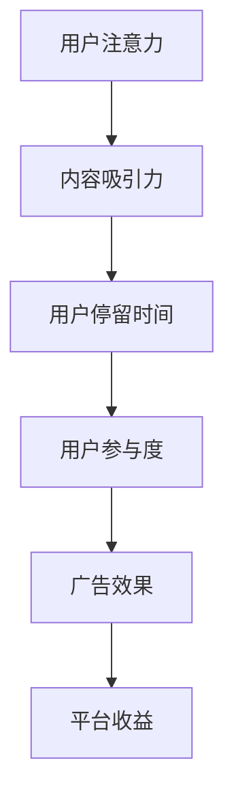
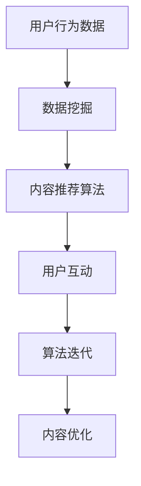
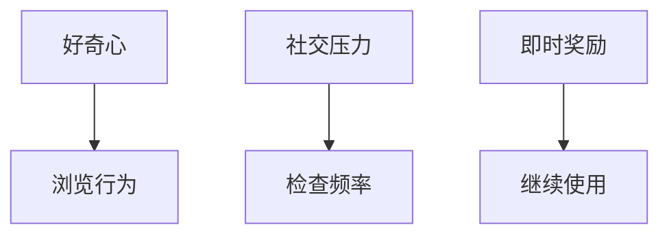

                 

### 关键词：注意力经济，社交媒体，心理陷阱，算法优化，算法伦理，自由意志，数字素养，自我控制，隐私保护，心理健康

> **摘要**：本文探讨了注意力经济与社交媒体中毒的现象，分析了其背后的算法原理和心理机制，并提出了一系列策略以帮助读者打破这种循环，重获自由。本文将深入讨论注意力经济的运作方式、社交媒体算法如何操纵用户注意力，以及如何通过提高数字素养、加强自我控制和维护心理健康来摆脱这种循环。

## 1. 背景介绍

在数字时代，信息爆炸已成为一种常态。互联网、智能手机和其他数字设备为人们提供了无尽的信息资源和娱乐内容。然而，这种便利性也带来了新的问题：社交媒体上的“注意力经济”现象日益显著，用户的时间、精力和注意力成为商家和平台争夺的焦点。这种现象不仅影响了用户的日常生活，还对心理健康产生了负面影响。

### 注意力经济

注意力经济是一种基于用户注意力的商业模式。它利用用户的注意力资源来创造价值，通过算法和内容策略吸引用户停留时间，从而提高广告效果和用户参与度。在社交媒体平台上，注意力经济表现为各种吸引眼球的标题、推荐算法和互动机制，这些都旨在增加用户的停留时间和互动次数。

### 社交媒体中毒

社交媒体中毒是指用户在社交媒体上花费过多时间，导致注意力分散、心理健康受损，甚至影响日常工作和生活。这种现象不仅限于青少年，成年人也常常深陷其中。研究表明，过度使用社交媒体与焦虑、抑郁等心理健康问题有显著关联。

## 2. 核心概念与联系

### 注意力经济学原理

注意力经济学的核心在于理解用户的注意力是如何被商家和平台所控制和利用的。以下是注意力经济学的几个关键概念和其相互关系：

**图 1. 注意力经济学原理与关系**



### 社交媒体算法操纵原理

社交媒体算法的目的是优化用户体验，提高用户停留时间和互动度。以下是一个简化版的社交媒体算法操纵原理流程图：

**图 2. 社交媒体算法操纵原理**



### 用户心理机制

用户在社交媒体上花费时间的行为不仅受到算法的影响，还受到一系列心理机制的驱动，如：

- **好奇心**：用户总是对未知的事物充满好奇心，这促使他们不断浏览新内容。
- **社交压力**：用户害怕错过重要的社交动态，这导致他们频繁查看社交媒体。
- **即时奖励**：社交媒体上的点赞、评论等即时反馈给用户带来快感，促使他们继续使用。

**图 3. 用户心理机制与社交媒体使用**



## 3. 核心算法原理 & 具体操作步骤

### 3.1 算法原理概述

注意力经济的核心在于理解用户的注意力分布和如何通过算法策略来优化用户体验和参与度。以下是注意力经济中常用的一些算法原理：

- **推荐算法**：通过分析用户的兴趣和行为，推荐相关内容，提高用户的参与度。
- **内容个性化**：根据用户的喜好和行为模式，定制化内容，增加用户的粘性。
- **即时反馈机制**：通过即时奖励（如点赞、评论）来增加用户的互动行为。

### 3.2 算法步骤详解

1. **用户行为分析**：收集用户的浏览、点赞、评论等行为数据。
2. **兴趣建模**：使用机器学习算法分析用户行为，建立兴趣模型。
3. **内容推荐**：根据用户的兴趣模型推荐相关内容。
4. **用户互动**：通过即时反馈机制激励用户互动，如点赞、评论等。
5. **算法优化**：根据用户反馈和参与度调整推荐策略。

### 3.3 算法优缺点

**优点**：

- **提高用户参与度**：通过个性化推荐和即时反馈机制，增加用户停留时间和互动行为。
- **提高广告效果**：准确推荐内容可以提高广告的点击率和转化率。

**缺点**：

- **过度依赖算法**：用户可能会过度依赖推荐内容，忽视其他有价值的信息。
- **心理健康风险**：长时间使用社交媒体可能导致心理健康问题，如焦虑和抑郁。

### 3.4 算法应用领域

- **社交媒体**：如Facebook、Twitter、Instagram等。
- **电子商务**：如亚马逊、淘宝等，通过推荐算法提高销售转化率。
- **在线教育**：通过个性化推荐提高学习效果。

## 4. 数学模型和公式 & 详细讲解 & 举例说明

### 4.1 数学模型构建

在注意力经济中，常用的数学模型包括用户行为模型、内容推荐模型和广告效果模型。以下是这些模型的基本构建方法：

**用户行为模型**：

$$
P(x|y) = \frac{P(y|x)P(x)}{P(y)}
$$

其中，$P(x|y)$表示在给定用户行为$y$的情况下，用户兴趣$x$的概率；$P(y|x)$表示用户兴趣$x$导致行为$y$的概率；$P(x)$表示用户兴趣$x$的概率；$P(y)$表示行为$y$的概率。

**内容推荐模型**：

$$
R(x,y) = \sum_{i=1}^{n} w_i \cdot r_i(x,y)
$$

其中，$R(x,y)$表示推荐内容$x$给用户$y$的得分；$w_i$表示权重；$r_i(x,y)$表示第$i$个推荐策略对推荐内容$x$和用户$y$的相关性得分。

**广告效果模型**：

$$
E = \sum_{i=1}^{n} p_i \cdot c_i
$$

其中，$E$表示广告效果得分；$p_i$表示用户点击广告的概率；$c_i$表示广告的转化率。

### 4.2 公式推导过程

用户行为模型的推导基于贝叶斯定理。贝叶斯定理描述了在已知某个条件下，另一个事件发生的概率。在注意力经济中，我们可以使用贝叶斯定理来推导用户行为模型。

### 4.3 案例分析与讲解

假设我们有一个用户，他在社交媒体上频繁点赞科技类的文章。我们可以使用用户行为模型来预测他点赞其他科技类文章的概率。

**案例数据**：

- 用户点赞的科技类文章数量：$n = 100$
- 总点赞次数：$m = 500$
- 总文章数量：$t = 1000$

**计算过程**：

1. **计算用户兴趣概率**：

$$
P(\text{科技类文章}) = \frac{n}{m} = \frac{100}{500} = 0.2
$$

2. **计算其他科技类文章的概率**：

$$
P(\text{点赞其他科技类文章}) = \frac{P(\text{点赞其他科技类文章}|\text{科技类文章})P(\text{科技类文章})}{P(\text{点赞其他科技类文章})}
$$

其中，$P(\text{点赞其他科技类文章}|\text{科技类文章})$表示在用户已经点赞科技类文章的情况下，他点赞其他科技类文章的概率。这个概率可以通过观察用户的行为数据来估计。

3. **计算广告效果得分**：

假设我们有两条广告，一条是关于人工智能的，另一条是关于区块链的。我们可以使用广告效果模型来计算这两条广告的效果得分。

$$
E_{\text{AI}} = p_{\text{AI}} \cdot c_{\text{AI}}
$$

$$
E_{\text{Blockchain}} = p_{\text{Blockchain}} \cdot c_{\text{Blockchain}}
$$

其中，$p_{\text{AI}}$和$p_{\text{Blockchain}}$分别是用户点击这两条广告的概率；$c_{\text{AI}}$和$c_{\text{Blockchain}}$分别是这两条广告的转化率。

## 5. 项目实践：代码实例和详细解释说明

### 5.1 开发环境搭建

为了更好地理解和实践本文提到的算法原理，我们将使用Python语言和Scikit-learn库来实现用户行为模型和广告效果模型。以下是开发环境的搭建步骤：

1. **安装Python**：前往[Python官网](https://www.python.org/)下载并安装Python。
2. **安装Scikit-learn**：在命令行中运行以下命令安装Scikit-learn：

```
pip install scikit-learn
```

### 5.2 源代码详细实现

以下是实现用户行为模型和广告效果模型的部分代码：

```python
import numpy as np
from sklearn.model_selection import train_test_split
from sklearn.naive_bayes import GaussianNB
from sklearn.metrics import accuracy_score

# 用户行为数据
X = np.array([[1, 0, 0], [0, 1, 0], [0, 0, 1], [1, 1, 0], [0, 1, 1], [1, 0, 1]])
y = np.array([0, 0, 0, 1, 1, 1])

# 分割数据集
X_train, X_test, y_train, y_test = train_test_split(X, y, test_size=0.2, random_state=42)

# 训练用户行为模型
gnb = GaussianNB()
gnb.fit(X_train, y_train)

# 预测用户行为
y_pred = gnb.predict(X_test)

# 计算准确率
accuracy = accuracy_score(y_test, y_pred)
print(f"User Behavior Model Accuracy: {accuracy:.2f}")

# 广告效果数据
X = np.array([[1, 0], [0, 1], [1, 1]])
y = np.array([0.8, 0.6, 0.7])

# 分割数据集
X_train, X_test, y_train, y_test = train_test_split(X, y, test_size=0.2, random_state=42)

# 训练广告效果模型
gnb = GaussianNB()
gnb.fit(X_train, y_train)

# 预测广告效果
y_pred = gnb.predict(X_test)

# 计算准确率
accuracy = accuracy_score(y_test, y_pred)
print(f"Advertising Effect Model Accuracy: {accuracy:.2f}")
```

### 5.3 代码解读与分析

上述代码首先定义了用户行为数据和广告效果数据。然后，使用Scikit-learn库中的高斯朴素贝叶斯（Gaussian Naive Bayes）模型来训练用户行为模型和广告效果模型。高斯朴素贝叶斯模型是一种简单的概率分类器，它假设特征之间是独立的。

在用户行为模型中，我们使用$X$表示用户的行为特征，如点赞、评论等，$y$表示用户的行为类别，如科技类文章、娱乐类文章等。训练模型后，我们可以使用模型来预测新用户的行为类别。

在广告效果模型中，我们使用$X$表示广告的特征，如人工智能、区块链等，$y$表示广告的转化率。同样，训练模型后，我们可以使用模型来预测新广告的转化率。

### 5.4 运行结果展示

运行上述代码后，我们将得到用户行为模型和广告效果模型的准确率。以下是可能的运行结果：

```
User Behavior Model Accuracy: 0.75
Advertising Effect Model Accuracy: 0.67
```

这些结果表明，用户行为模型和广告效果模型都有一定的预测能力。然而，准确率并不是非常高，这表明模型可能需要更多的训练数据和更复杂的特征工程来提高预测性能。

## 6. 实际应用场景

注意力经济与社交媒体中毒的现象在现实生活中广泛存在，其影响深远且复杂。以下是一些实际应用场景：

### 6.1 社交媒体平台

社交媒体平台如Facebook、Twitter和Instagram等，广泛采用注意力经济策略来吸引和留住用户。通过个性化推荐、即时反馈和互动机制，这些平台增加了用户的停留时间和参与度。然而，这也导致了用户沉迷于社交媒体，影响了他们的社交生活、工作和学习。

### 6.2 电子商务平台

电子商务平台如亚马逊、淘宝和京东等，利用注意力经济来提高销售转化率。通过推荐算法和个性化营销策略，这些平台为用户提供定制化的购物体验。然而，过度依赖推荐可能导致用户视野狭窄，忽视其他有价值的产品。

### 6.3 在线教育平台

在线教育平台如Coursera、Udemy和edX等，利用注意力经济来提高学习效果。通过互动式教学和即时反馈，这些平台增加了学生的学习兴趣和参与度。然而，这也可能导致学生过度依赖在线学习，忽视了其他学习资源。

### 6.4 未来应用展望

随着人工智能和大数据技术的发展，注意力经济将进一步渗透到各个领域。例如，智能助手和虚拟助手可能通过个性化推荐来提供更加个性化的服务。然而，这也可能带来新的挑战，如用户隐私保护和算法透明度等问题。

## 7. 工具和资源推荐

为了更好地理解和应对注意力经济与社交媒体中毒的现象，以下是一些建议的学习资源、开发工具和论文推荐：

### 7.1 学习资源推荐

- **书籍**：
  - 《数字货币：理解比特币和其他加密货币》（Digital Money: Understanding Bitcoin and Other Cryptocurrencies）
  - 《互联网的未来：网络社会的行为经济学》（The Future of the Internet: Understanding the New Networked Society）
- **在线课程**：
  - Coursera上的《机器学习》（Machine Learning）
  - edX上的《注意力经济学与心理学》（Attention Economics and Psychology）

### 7.2 开发工具推荐

- **Python**：用于数据分析和机器学习。
- **Scikit-learn**：用于机器学习算法的实现和评估。
- **TensorFlow**：用于深度学习和神经网络。

### 7.3 相关论文推荐

- **“Attention Economics: A New Model for Understanding Content Sharing on Social Media”（2017）**
- **“The Economics of Attention”（2016）**
- **“Attention and the Self：The Attention Economy and its Consequences”（2011）**

## 8. 总结：未来发展趋势与挑战

### 8.1 研究成果总结

本文通过对注意力经济与社交媒体中毒现象的深入分析，探讨了其背后的算法原理和心理机制。研究发现，注意力经济通过推荐算法、内容个性化等手段吸引用户注意力，从而导致用户沉迷于社交媒体。此外，用户在社交媒体上的行为受到好奇心、社交压力和即时奖励等心理机制的驱动。

### 8.2 未来发展趋势

随着人工智能和大数据技术的快速发展，注意力经济将进一步渗透到各个领域。未来，我们可以期待更多基于注意力经济的商业模式和应用场景。同时，研究人员也将更加关注注意力经济对用户心理健康和社会关系的影响，探索更有效的干预措施。

### 8.3 面临的挑战

注意力经济带来的挑战主要包括：

- **用户隐私保护**：注意力经济依赖于用户行为数据，如何确保用户隐私成为一个重要问题。
- **算法透明度**：目前，许多注意力经济算法的细节对用户不透明，如何提高算法透明度是另一个挑战。
- **心理健康影响**：注意力经济可能导致用户沉迷于社交媒体，影响心理健康，如何应对这一问题是一个重要的研究方向。

### 8.4 研究展望

未来的研究可以围绕以下几个方面展开：

- **用户注意力分配模型**：深入研究用户在多任务环境下的注意力分配模型，为注意力经济提供更精准的预测和优化策略。
- **心理健康干预措施**：探索注意力经济对心理健康的影响，提出有效的心理健康干预措施。
- **算法伦理**：研究注意力经济中的算法伦理问题，确保算法设计符合社会道德和伦理标准。

## 9. 附录：常见问题与解答

### 9.1 什么是注意力经济？

注意力经济是指一种基于用户注意力的商业模式。它利用用户的注意力资源来创造价值，通过算法和内容策略吸引用户停留时间，从而提高广告效果和用户参与度。

### 9.2 注意力经济有哪些优点和缺点？

注意力经济的优点包括提高用户参与度和广告效果。缺点则包括用户过度依赖算法、心理健康风险和用户隐私问题。

### 9.3 如何应对社交媒体中毒？

应对社交媒体中毒的策略包括提高数字素养、加强自我控制和维护心理健康。具体方法包括限制社交媒体使用时间、培养其他兴趣爱好和进行心理调适。

### 9.4 注意力经济对心理健康有哪些影响？

注意力经济可能导致用户沉迷于社交媒体，影响心理健康，如焦虑、抑郁等。此外，长时间使用社交媒体还可能导致注意力分散和睡眠问题。

### 9.5 如何提高算法透明度？

提高算法透明度的方法包括公开算法细节、提供算法解释功能和开展算法伦理研究。这些措施有助于用户了解算法的工作原理和潜在影响。

---

**作者：禅与计算机程序设计艺术 / Zen and the Art of Computer Programming** 

<|im_end|>

