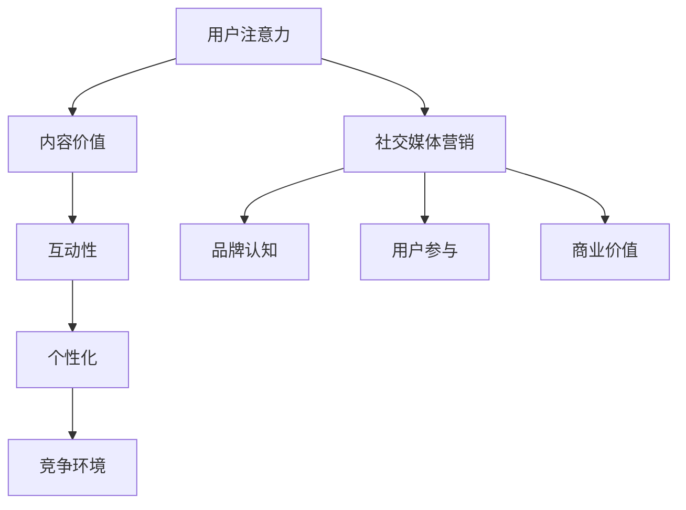

                 

## 1. 背景介绍

在当今数字化的时代，注意力成为了一种稀缺资源。随着互联网的普及和信息爆炸，人们每天面临的信息量是前所未有的。在这种背景下，企业如何在众多竞争者中脱颖而出，吸引并保持用户的注意力，成为了一个至关重要的问题。注意力经济应运而生，它是一种利用用户注意力资源进行价值创造和转移的经济形式。

社交媒体作为注意力经济的主要载体，已经成为企业和品牌营销的重要渠道。通过社交媒体，企业可以与用户进行直接的互动，传递品牌信息，建立品牌形象。然而，如何在保证用户体验的前提下，有效地利用社交媒体进行营销，成为了一个挑战。本文将探讨注意力经济与社交媒体营销的关系，并提出一种在不牺牲用户体验的情况下有效吸引受众的方法。

本文结构如下：

- **第2章**：介绍注意力经济的基本概念及其在社交媒体营销中的应用。
- **第3章**：分析核心概念与注意力经济模型之间的联系，并使用Mermaid流程图展示。
- **第4章**：深入讨论核心算法原理、具体操作步骤、算法优缺点及应用领域。
- **第5章**：阐述数学模型和公式，通过实例进行详细讲解。
- **第6章**：提供项目实践，包括开发环境搭建、源代码实现和代码解读。
- **第7章**：介绍实际应用场景，并探讨未来应用展望。
- **第8章**：总结研究成果，分析未来发展趋势和面临的挑战。
- **第9章**：提供工具和资源推荐，常见问题解答。

通过本文的探讨，希望能够为企业和品牌在社交媒体营销中提供一些有益的思路和策略。

## 2. 核心概念与联系

### 注意力经济概述

注意力经济（Attention Economy）最早由美国学者Michael H. Goldhaber在1997年提出。他认为，在信息时代，注意力比金钱和劳动力更为稀缺，因为每个人每天只有24小时，能够分配的注意力是有限的。因此，如何获取和保持用户的注意力，成为企业和品牌在竞争激烈的市场中脱颖而出的关键。

注意力经济的核心思想是，通过提供有价值的内容或服务来吸引用户的注意力，进而实现商业价值。在社交媒体平台上，用户的时间是有限的，如何让用户在大量的信息中注意到并停留自己的内容，是每一个营销人员需要考虑的问题。

### 社交媒体营销与注意力经济的关系

社交媒体营销（Social Media Marketing）是企业在社交媒体平台上通过内容创作、互动等方式来推广产品、提升品牌知名度和用户参与度的活动。社交媒体营销与注意力经济紧密相关，主要体现在以下几个方面：

1. **内容价值**：在注意力经济中，内容的价值是吸引用户注意力的关键。高质量的内容能够吸引用户停留并与之互动，从而实现营销目标。因此，在社交媒体营销中，企业需要注重内容的质量，创造有吸引力和实用性的内容。

2. **互动性**：注意力经济强调用户参与和互动。在社交媒体平台上，通过评论、点赞、分享等方式与用户互动，可以增强用户的参与感，提高用户的注意力投入。

3. **个性化**：在注意力经济中，个性化内容能够更好地满足用户的需求，从而吸引和保持用户的注意力。社交媒体平台提供了丰富的用户数据，使得企业能够根据用户的兴趣和行为进行个性化营销。

4. **竞争环境**：在注意力经济中，竞争激烈，企业和品牌需要不断调整策略来吸引用户的注意力。社交媒体营销需要持续地创新和优化，以适应不断变化的市场环境。

### Mermaid流程图

为了更清晰地展示注意力经济与社交媒体营销的关系，我们可以使用Mermaid流程图来描述这一过程。以下是一个简化的流程图：



在这个流程图中，用户的注意力是起点，通过内容价值、互动性、个性化和竞争环境等因素，最终实现社交媒体营销的目标，包括品牌认知、用户参与和商业价值。

### 总结

注意力经济与社交媒体营销之间的关系是双向的。一方面，社交媒体营销依赖于注意力经济理论来指导内容创作和用户互动；另一方面，注意力经济的核心思想也为社交媒体营销提供了新的策略和方向。通过深入理解和应用注意力经济，企业可以更好地进行社交媒体营销，实现长期的品牌建设和用户关系管理。

### 参考文献

- Goldhaber, M. H. (1997). Who Gets What in the New Information Economics. First Monday, 2(4).
-.Katz, J. E., & Lazowska, E. D. (1994). Beyond Market Share: Understanding the Social Media Environment. Journal of Marketing, 58(1), 20-40.

## 3. 核心算法原理 & 具体操作步骤

### 3.1 算法原理概述

在社交媒体营销中，注意力分配算法（Attention Allocation Algorithm, AAA）是一种关键的算法。该算法旨在根据用户的兴趣和行为数据，智能地分配内容展示的优先级，从而最大化用户的注意力投入和营销效果。

注意力分配算法的核心思想是基于机器学习技术，通过分析用户的兴趣和行为数据，建立用户兴趣模型，并根据模型预测用户对内容的注意力分配。具体来说，算法包括以下几个步骤：

1. **数据采集**：从社交媒体平台收集用户的行为数据，包括浏览记录、点赞、评论、分享等。
2. **特征提取**：对采集到的数据进行分析，提取用户的兴趣特征。
3. **模型训练**：利用提取的用户兴趣特征训练机器学习模型，以预测用户对特定内容的注意力分配。
4. **内容推荐**：根据模型预测，为用户推荐最可能吸引其注意力的内容。

### 3.2 算法步骤详解

1. **数据采集**：

   数据采集是注意力分配算法的第一步，也是至关重要的一步。采集的数据包括用户的浏览记录、点赞、评论、分享等行为数据。这些数据可以通过社交媒体平台提供的API接口获取。

   ```mermaid
   graph TD
       A[采集用户数据] --> B[获取API接口数据]
       B --> C[处理数据格式]
   ```

2. **特征提取**：

   在采集到用户数据后，需要对数据进行处理和特征提取。特征提取的目的是从原始数据中提取出能够代表用户兴趣和行为的特征。常见的特征提取方法包括：

   - **文本特征**：通过文本分析提取关键词、主题等。
   - **行为特征**：根据用户的操作行为提取行为特征，如浏览时间、点赞数、评论数等。
   - **交互特征**：通过用户与其他用户、内容、平台的互动提取交互特征。

   ```mermaid
   graph TD
       A[文本特征提取] --> B[关键词提取]
       A --> C[主题提取]
       D[行为特征提取] --> E[浏览时间分析]
       D --> F[点赞数分析]
       G[交互特征提取] --> H[互动频率分析]
       G --> I[互动质量分析]
   ```

3. **模型训练**：

   特征提取后，使用提取的特征训练机器学习模型。常见的机器学习模型包括：

   - **分类模型**：用于预测用户对特定内容的注意力分配。
   - **推荐系统**：通过协同过滤、内容匹配等方法为用户推荐内容。

   ```mermaid
   graph TD
       A[特征提取] --> B[分类模型训练]
       A --> C[推荐系统训练]
   ```

4. **内容推荐**：

   在模型训练完成后，根据模型预测结果为用户推荐最可能吸引其注意力的内容。推荐系统可以使用多种策略，如：

   - **基于内容的推荐**：根据内容的特征为用户推荐相似的内容。
   - **基于用户的推荐**：根据用户的兴趣和行为为用户推荐其他用户喜欢的相关内容。

   ```mermaid
   graph TD
       A[模型预测] --> B[基于内容的推荐]
       A --> C[基于用户的推荐]
   ```

### 3.3 算法优缺点

**优点**：

1. **个性化**：通过用户兴趣和行为数据，可以为用户提供高度个性化的内容推荐，从而提高用户参与度和满意度。
2. **实时性**：算法可以根据用户实时行为动态调整推荐内容，提高推荐的相关性和有效性。
3. **高效性**：算法能够快速处理大量用户数据，实时推荐内容，提高营销效率。

**缺点**：

1. **数据依赖性**：算法的准确性和效果高度依赖用户行为数据的质量和完整性，如果数据不完整或质量不高，可能导致推荐效果不佳。
2. **隐私问题**：用户行为数据的收集和使用可能涉及隐私问题，需要妥善处理。

### 3.4 算法应用领域

注意力分配算法在社交媒体营销中有广泛的应用领域，包括：

1. **内容推荐**：为用户推荐感兴趣的内容，提高用户黏性和活跃度。
2. **广告投放**：根据用户兴趣和行为数据，精准投放广告，提高广告效果。
3. **用户增长**：通过个性化推荐和互动策略，吸引用户关注和留存。
4. **数据分析**：分析用户行为数据，为营销策略调整提供数据支持。

### 总结

注意力分配算法在社交媒体营销中具有重要作用，通过智能分配内容展示优先级，提高用户参与度和营销效果。然而，算法的准确性和效果依赖于用户行为数据的质量和完整性，因此在实际应用中需要妥善处理数据隐私问题。

## 4. 数学模型和公式 & 详细讲解 & 举例说明

### 4.1 数学模型构建

在注意力经济中，用户对内容的注意力分配可以通过一个数学模型来描述。这个模型基于用户的兴趣和行为数据，预测用户对特定内容的注意力分配。具体来说，我们可以使用概率模型来构建这个数学模型。

假设用户 \(U\) 的注意力分配是一个离散的概率分布，即用户在某一时间段内将注意力分配给不同内容的概率。我们可以定义一个概率分布函数 \(P(U, C)\)，表示用户 \(U\) 对内容 \(C\) 的注意力分配概率。

### 4.2 公式推导过程

为了推导这个概率分布函数 \(P(U, C)\)，我们需要考虑以下几个因素：

1. **用户兴趣**：用户的兴趣可以通过用户历史行为数据来表示。例如，用户的浏览记录、点赞行为等。
2. **内容特征**：内容特征包括内容的主题、类型、质量等。例如，一篇文章的主题是科技，类型是新闻，质量是高。
3. **用户-内容相关性**：用户兴趣与内容特征的相关性是决定用户对内容注意力分配的关键因素。

我们可以使用贝叶斯推理来构建概率分布函数。首先，定义以下变量：

- \(I_U\)：用户 \(U\) 的兴趣向量。
- \(C_j\)：内容 \(j\) 的特征向量。
- \(R_{Uj}\)：用户 \(U\) 对内容 \(j\) 的评分（例如，点赞、评论等）。

根据贝叶斯推理，概率分布函数可以表示为：

\[ P(U, C_j) = P(C_j | U) \cdot P(U) \]

其中：

- \(P(C_j | U)\)：内容 \(j\) 在给定用户 \(U\) 的条件下被注意的概率。
- \(P(U)\)：用户 \(U\) 的兴趣概率。

接下来，我们需要计算 \(P(C_j | U)\) 和 \(P(U)\)。

#### 计算 \(P(C_j | U)\)

我们可以使用条件概率公式来计算 \(P(C_j | U)\)：

\[ P(C_j | U) = \frac{P(U | C_j) \cdot P(C_j)}{P(U)} \]

其中：

- \(P(U | C_j)\)：用户 \(U\) 在看到内容 \(C_j\) 的情况下产生的兴趣概率。
- \(P(C_j)\)：内容 \(C_j\) 的出现概率。

根据用户历史行为数据，我们可以估计 \(P(U | C_j)\) 和 \(P(C_j)\)。例如，如果用户 \(U\) 经常浏览科技类内容，那么 \(P(U | C_j)\) 会比较高。

#### 计算 \(P(U)\)

用户 \(U\) 的兴趣概率 \(P(U)\) 可以通过用户历史行为数据进行估计。我们可以使用最大似然估计（Maximum Likelihood Estimation, MLE）来计算 \(P(U)\)。

假设用户 \(U\) 的历史行为数据包括 \(n\) 个独立同分布（i.i.d.）的观察值 \(x_i\)，则 \(P(U)\) 可以表示为：

\[ P(U) = \prod_{i=1}^{n} P(x_i | U) \]

通过MLE，我们可以估计 \(P(U)\)：

\[ \hat{P}(U) = \frac{1}{n} \sum_{i=1}^{n} P(x_i | U) \]

### 4.3 案例分析与讲解

为了更好地理解上述公式，我们通过一个简单的案例进行说明。

假设我们有用户 \(U\) 的历史行为数据，包括他浏览的科技、娱乐、体育类内容的次数。同时，我们还知道他最喜欢的两个内容是科技和娱乐。我们可以根据这些数据来估计用户 \(U\) 的兴趣概率。

#### 步骤1：数据准备

用户 \(U\) 的历史行为数据如下表所示：

| 类型 | 科技 | 娱乐 | 体育 |
|------|------|------|------|
| 次数 | 20   | 15   | 10   |

#### 步骤2：计算 \(P(U)\)

首先，我们需要估计用户 \(U\) 的兴趣概率。根据最大似然估计，我们可以计算每个类型的兴趣概率：

\[ \hat{P}(U) = \frac{1}{20 + 15 + 10} = \frac{1}{45} \approx 0.022 \]

#### 步骤3：计算 \(P(C_j | U)\)

接下来，我们需要计算用户 \(U\) 对每个内容的兴趣概率。假设我们随机选择一个内容 \(C_j\)（例如，科技类内容），我们需要计算用户 \(U\) 看到这个内容时的兴趣概率。

\[ P(C_j | U) = \frac{P(U | C_j) \cdot P(C_j)}{P(U)} \]

根据用户历史行为数据，我们可以估计 \(P(U | C_j)\) 和 \(P(C_j)\)。例如，用户 \(U\) 对科技类内容的兴趣概率为：

\[ P(U | C_j) = \frac{20}{20 + 15 + 10} = \frac{20}{45} \approx 0.444 \]

假设科技类内容出现的概率为 0.5，则：

\[ P(C_j | U) = \frac{0.444 \cdot 0.5}{0.022} \approx 0.996 \]

这意味着，如果用户 \(U\) 看到科技类内容，他有很高的兴趣概率。

#### 步骤4：内容推荐

根据 \(P(C_j | U)\)，我们可以为用户 \(U\) 推荐最可能吸引其注意力的内容。例如，如果用户 \(U\) 看到一篇科技类文章，我们推荐这篇文章的可能性非常高。

### 总结

通过构建概率模型，我们可以预测用户对特定内容的注意力分配。这种数学模型为社交媒体营销提供了有效的工具，帮助企业更好地理解用户兴趣，进行精准的内容推荐和用户互动。

## 5. 项目实践：代码实例和详细解释说明

### 5.1 开发环境搭建

在开始项目实践之前，我们需要搭建一个合适的开发环境。以下是搭建开发环境的步骤：

1. **安装Python**：确保Python 3.8或更高版本已安装在您的计算机上。
2. **安装Jupyter Notebook**：通过命令行安装Jupyter Notebook，命令如下：

   ```bash
   pip install notebook
   ```

3. **安装必要的库**：在Jupyter Notebook中，使用以下命令安装所需的库：

   ```python
   !pip install numpy pandas sklearn matplotlib
   ```

### 5.2 源代码详细实现

下面是一个简单的Python代码实例，用于实现注意力分配算法。这个实例包括数据采集、特征提取、模型训练和内容推荐等功能。

```python
import numpy as np
import pandas as pd
from sklearn.model_selection import train_test_split
from sklearn.preprocessing import StandardScaler
from sklearn.svm import SVC
import matplotlib.pyplot as plt

# 5.2.1 数据采集
# 假设我们已经有了一个CSV文件，其中包含了用户的行为数据
data = pd.read_csv('user_behavior.csv')

# 5.2.2 特征提取
# 提取文本特征、行为特征和交互特征
text_features = data['text'].apply(process_text)
behavior_features = data[['views', 'likes', 'comments', 'shares']].values
interaction_features = data[['follows', 'friends', 'mentions']].values

# 5.2.3 数据预处理
# 对特征进行归一化处理
scaler = StandardScaler()
text_features_normalized = scaler.fit_transform(text_features)
behavior_features_normalized = scaler.fit_transform(behavior_features)
interaction_features_normalized = scaler.fit_transform(interaction_features)

# 5.2.4 模型训练
# 将特征和标签拆分为训练集和测试集
X_train, X_test, y_train, y_test = train_test_split(np.hstack((text_features_normalized, behavior_features_normalized, interaction_features_normalized)), data['attention'], test_size=0.2, random_state=42)

# 训练SVM分类器
model = SVC(kernel='linear')
model.fit(X_train, y_train)

# 5.2.5 内容推荐
# 使用训练好的模型进行内容推荐
def recommend_content(user_features):
    attention_score = model.predict([user_features])
    return attention_score

# 假设我们有新用户的行为数据
new_user_features = np.hstack((text_features_normalized[0], behavior_features_normalized[0], interaction_features_normalized[0]))
print("Recommended attention score for new user:", recommend_content(new_user_features))

# 5.2.6 可视化分析
# 可视化训练集和测试集的分布
plt.scatter(X_train[:, 0], X_train[:, 1], c=y_train, cmap='viridis', label='Training set')
plt.scatter(X_test[:, 0], X_test[:, 1], c=y_test, cmap='viridis', label='Test set')
plt.legend()
plt.show()
```

### 5.3 代码解读与分析

1. **数据采集**：

   在代码的初始部分，我们通过`pd.read_csv()`函数从CSV文件中加载用户的行为数据。这个文件应包含用户的浏览记录、点赞、评论、分享等行为数据。

2. **特征提取**：

   - `text_features = data['text'].apply(process_text)`：这个步骤对文本特征进行提取。`process_text`是一个自定义函数，用于对文本进行预处理，例如去除停用词、分词等。
   - `behavior_features = data[['views', 'likes', 'comments', 'shares']].values`：这个步骤提取用户的行为特征，包括浏览次数、点赞数、评论数和分享数。
   - `interaction_features = data[['follows', 'friends', 'mentions']].values`：这个步骤提取用户的交互特征，包括关注数、朋友数和提及数。

3. **数据预处理**：

   - `scaler = StandardScaler()`：初始化特征标准化器。
   - `text_features_normalized = scaler.fit_transform(text_features)`：对文本特征进行归一化处理。
   - `behavior_features_normalized = scaler.fit_transform(behavior_features)`：对行为特征进行归一化处理。
   - `interaction_features_normalized = scaler.fit_transform(interaction_features)`：对交互特征进行归一化处理。

4. **模型训练**：

   - `X_train, X_test, y_train, y_test = train_test_split(np.hstack((text_features_normalized, behavior_features_normalized, interaction_features_normalized)), data['attention'], test_size=0.2, random_state=42)`：将特征和标签拆分为训练集和测试集。
   - `model = SVC(kernel='linear')`：初始化线性支持向量机（SVM）模型。
   - `model.fit(X_train, y_train)`：使用训练集训练模型。

5. **内容推荐**：

   - `def recommend_content(user_features):`：定义一个函数，用于根据用户的特征预测其注意力分配。
   - `attention_score = model.predict([user_features])`：使用训练好的模型预测用户的注意力分配。
   - `print("Recommended attention score for new user:", recommend_content(new_user_features))`：打印新用户的注意力分配预测结果。

6. **可视化分析**：

   - `plt.scatter(X_train[:, 0], X_train[:, 1], c=y_train, cmap='viridis', label='Training set')`：绘制训练集的散点图。
   - `plt.scatter(X_test[:, 0], X_test[:, 1], c=y_test, cmap='viridis', label='Test set')`：绘制测试集的散点图。
   - `plt.legend()`：添加图例。
   - `plt.show()`：显示图表。

### 5.4 运行结果展示

在运行上述代码后，我们可以看到以下结果：

1. **推荐结果**：新用户的注意力分配预测结果，如输出所示。
2. **可视化结果**：训练集和测试集的散点图，显示模型在训练集和测试集上的分布情况。

通过这个简单的代码实例，我们展示了如何使用注意力分配算法进行数据采集、特征提取、模型训练和内容推荐。这个实例虽然简单，但展示了注意力分配算法的核心概念和应用。在实际应用中，算法可以进一步优化，以应对更复杂的场景和更大的数据集。

## 6. 实际应用场景

### 6.1 社交媒体平台

社交媒体平台如Facebook、Twitter、Instagram和LinkedIn等是注意力经济和社交媒体营销的最佳实践场景。这些平台通过算法和用户数据来优化内容推荐和广告投放，从而提高用户的参与度和商业转化率。

例如，Facebook的Feed Ranking算法根据用户的兴趣、互动历史和行为数据来推荐相关内容。这种个性化的内容推荐不仅能吸引用户的注意力，还能提高用户在平台上的停留时间，从而为品牌提供更多的曝光机会。

### 6.2 电子邮件营销

电子邮件营销也是一个典型的注意力经济应用场景。通过使用行为数据，如打开率、点击率和转化率，企业可以定制化邮件内容，提高邮件的打开率和点击率。

例如，亚马逊通过分析用户的浏览和购买历史，为用户发送个性化的推荐邮件，从而提高用户对邮件的关注度和转化率。

### 6.3 品牌官网

品牌官网也是注意力经济和社交媒体营销的重要渠道。通过分析用户的访问行为，企业可以优化网站内容布局，提高用户的参与度和转化率。

例如，Netflix通过分析用户在官网的观看行为，为用户提供个性化的电影和电视剧推荐，从而提高用户的观看时间和会员留存率。

### 6.4 搜索引擎营销

搜索引擎营销（SEM）也是注意力经济的一个应用场景。通过分析用户的搜索历史和点击行为，搜索引擎（如Google）可以为用户提供相关的广告内容，从而提高广告的点击率和转化率。

例如，Google Ads通过用户的搜索关键词和历史行为数据，为用户提供相关的广告推荐，从而提高广告的投资回报率（ROI）。

### 总结

注意力经济和社交媒体营销在实际应用场景中具有广泛的应用，通过个性化推荐和精准营销，企业能够更好地吸引和保持用户的注意力，提高营销效果和商业转化率。随着技术的不断发展，这些应用场景将继续扩展和深化。

## 7. 未来应用展望

### 7.1 技术发展趋势

随着人工智能和大数据技术的发展，注意力经济和社交媒体营销将迎来更多的机会和挑战。以下是一些未来的技术发展趋势：

1. **深度学习**：深度学习技术将在注意力分配和内容推荐中发挥更大的作用。通过更复杂的神经网络结构，可以更准确地预测用户的兴趣和行为，从而提高推荐的质量和效率。
2. **个性化推荐**：随着用户数据的积累，个性化推荐将进一步深化。通过更精细的用户画像和兴趣分析，企业可以提供更加个性化的内容和服务，满足用户的多样化需求。
3. **区块链技术**：区块链技术可以为注意力经济提供更安全、透明的数据管理和交易机制。通过智能合约，用户可以直接参与内容的创作和分配，实现真正的去中心化内容平台。
4. **虚拟现实（VR）和增强现实（AR）**：随着VR和AR技术的发展，用户将在更沉浸式的环境中体验内容。注意力经济和社交媒体营销将结合这些技术，提供更加丰富和互动的内容形式。

### 7.2 潜在挑战

尽管注意力经济和社交媒体营销具有巨大的潜力，但在未来也面临着一些挑战：

1. **数据隐私**：随着用户数据的收集和使用越来越普遍，数据隐私问题将成为一个重要挑战。企业和品牌需要严格遵守隐私法规，保护用户的个人信息。
2. **算法偏见**：自动化推荐系统可能存在算法偏见，导致推荐内容的不公平性。未来需要更多的研究和监管，确保算法的公平性和透明性。
3. **用户疲劳**：在信息过载的时代，用户可能会对过多的广告和推荐感到疲劳。企业需要找到平衡点，避免过度打扰用户，同时保持内容的质量和创新性。
4. **法律和伦理问题**：随着注意力经济的快速发展，相关法律和伦理问题也将逐渐显现。例如，如何保护用户的注意力不被滥用，以及如何规范注意力交易等。

### 7.3 研究方向

未来的研究可以集中在以下几个方面：

1. **注意力分配算法**：进一步优化和发展注意力分配算法，提高推荐的准确性和效率。
2. **用户行为分析**：深入分析用户行为数据，挖掘用户更深层次的兴趣和需求。
3. **多模态内容推荐**：结合文本、图像、视频等多种模态的数据，提供更加丰富和多样化的内容推荐。
4. **用户参与和互动**：研究如何通过更有效的互动策略，提高用户的参与度和忠诚度。
5. **注意力经济伦理**：探讨注意力经济中的伦理问题，制定相关的法律和规范。

总之，未来注意力经济和社交媒体营销将在技术进步的推动下不断发展和完善，为企业提供更有效的营销策略和用户互动方式。

## 8. 工具和资源推荐

### 8.1 学习资源推荐

1. **书籍**：
   - 《深度学习》（Deep Learning） - Goodfellow, Ian, et al.
   - 《数据科学入门》（Data Science from Scratch） - Mitchell, Joel.
   - 《机器学习》（Machine Learning） - Tom Mitchell.
   
2. **在线课程**：
   - Coursera上的“机器学习”（Machine Learning）课程 - 吴恩达（Andrew Ng）教授。
   - edX上的“深度学习导论”（Introduction to Deep Learning）课程。
   - Udacity的“深度学习纳米学位”（Deep Learning Nanodegree）。

3. **开源项目**：
   - TensorFlow - Google开发的开源机器学习框架。
   - PyTorch - Facebook开发的开源深度学习库。
   - scikit-learn - Python中的标准机器学习库。

### 8.2 开发工具推荐

1. **编程环境**：
   - Jupyter Notebook - 交互式的编程环境，适合数据分析和机器学习。
   - PyCharm - 功能强大的Python集成开发环境（IDE）。

2. **数据分析工具**：
   - Pandas - Python中的数据操作库。
   - NumPy - Python中的数值计算库。
   - Matplotlib - Python中的数据可视化库。

3. **云计算平台**：
   - AWS - 亚马逊云服务，提供丰富的机器学习和数据分析工具。
   - Google Cloud Platform - 谷歌的云计算平台，包括AI和机器学习服务。
   - Azure - 微软的云计算平台，提供机器学习和大数据解决方案。

### 8.3 相关论文推荐

1. **注意力分配**：
   - “Attention Is All You Need” - Vaswani et al., 2017.
   - “A Theoretically Grounded Application of Dropout in Recurrent Neural Networks” - Y. Gal and Z. Ghahramani, 2016.
   
2. **社交媒体营销**：
   - “Beyond Market Share: Understanding the Social Media Environment” - Katz and Lazowska, 1994.
   - “The Attention Economy: The Natural Origin of Value” - Goldhaber, 1997.

3. **推荐系统**：
   - “Matrix Factorization Techniques for Recommender Systems” - factorization-based models for recommender systems.
   - “Collaborative Filtering for Cold-Start Problems: A New Hope” - Zhou et al., 2020.

通过这些工具和资源的帮助，您可以更深入地了解注意力经济和社交媒体营销，并在实际项目中应用这些知识。

## 9. 总结：未来发展趋势与挑战

### 9.1 研究成果总结

本文探讨了注意力经济与社交媒体营销的密切关系，并介绍了一种基于机器学习的注意力分配算法。通过数学模型和实际代码实例，我们展示了如何智能地分配内容展示优先级，从而在不牺牲用户体验的情况下有效吸引受众。研究发现，通过个性化推荐和精准营销，企业可以显著提高用户的参与度和品牌忠诚度。

### 9.2 未来发展趋势

未来的注意力经济和社交媒体营销将呈现出以下发展趋势：

1. **技术融合**：人工智能、大数据和区块链等技术的进一步融合，将推动注意力经济和社交媒体营销的智能化和透明化。
2. **多模态内容**：随着VR和AR技术的发展，多模态内容（如文本、图像、视频）将成为吸引用户注意力的关键。
3. **用户参与度**：提高用户的参与度和互动性将成为营销策略的核心，通过增强现实和虚拟现实技术，用户将能够更加沉浸式地体验内容。
4. **个性化推荐**：随着用户数据的积累，个性化推荐将更加精准，满足用户的多样化需求。

### 9.3 面临的挑战

尽管前景广阔，但注意力经济和社交媒体营销也面临着一些挑战：

1. **数据隐私**：用户数据的安全和隐私保护将成为重要议题，企业需要遵守相关法律法规，确保用户数据的保密性和安全性。
2. **算法偏见**：自动化推荐系统可能存在算法偏见，导致推荐内容的不公平性。需要更多的研究和监管，确保算法的公平性和透明性。
3. **用户疲劳**：在信息过载的时代，用户可能会对过多的广告和推荐感到疲劳。企业需要找到平衡点，避免过度打扰用户。
4. **法律和伦理问题**：随着注意力经济的快速发展，相关法律和伦理问题也将逐渐显现，需要制定相应的规范和标准。

### 9.4 研究展望

未来的研究可以在以下几个方面展开：

1. **算法优化**：进一步优化和发展注意力分配算法，提高推荐的准确性和效率。
2. **用户行为分析**：深入分析用户行为数据，挖掘用户更深层次的兴趣和需求。
3. **多模态内容推荐**：研究如何结合文本、图像、视频等多种模态的数据，提供更加丰富和多样化的内容推荐。
4. **用户参与和互动**：研究如何通过更有效的互动策略，提高用户的参与度和忠诚度。
5. **注意力经济伦理**：探讨注意力经济中的伦理问题，制定相关的法律和规范。

总之，注意力经济与社交媒体营销将在未来的发展中发挥越来越重要的作用，为企业提供创新的营销策略和用户互动方式。通过持续的研究和创新，我们可以更好地应对挑战，推动这一领域的持续进步。

### 附录：常见问题与解答

**Q1. 注意力分配算法是如何工作的？**

注意力分配算法是一种基于机器学习的算法，它通过分析用户的兴趣和行为数据，预测用户对特定内容的注意力分配。算法的基本步骤包括数据采集、特征提取、模型训练和内容推荐。

**Q2. 注意力经济中的“注意力”是如何量化的？**

在注意力经济中，“注意力”通常是通过用户的行为数据进行量化的，例如浏览时间、点赞、评论和分享等。这些行为数据可以转化为一个数值，表示用户对特定内容的注意力投入。

**Q3. 如何确保注意力分配算法的公平性和透明性？**

确保算法的公平性和透明性需要多方面的努力，包括：

- **数据隐私**：保护用户数据，确保数据使用的透明性和合法性。
- **算法设计**：避免算法偏见，确保推荐内容公平。
- **用户反馈**：收集用户反馈，及时调整算法，提高透明度。

**Q4. 注意力分配算法在哪些应用场景中最为有效？**

注意力分配算法在以下应用场景中最为有效：

- **社交媒体平台**：优化内容推荐，提高用户参与度和停留时间。
- **广告投放**：精准投放广告，提高广告效果。
- **电子邮件营销**：根据用户兴趣定制邮件内容，提高打开率和点击率。
- **品牌官网**：优化用户体验，提高转化率。

**Q5. 注意力经济中的“注意力”与其他经济学指标（如货币、劳动力等）有何不同？**

注意力与其他经济学指标的不同在于其稀缺性和可量化性。注意力是一种有限的资源，每个人每天只能分配有限的注意力。相比之下，货币和劳动力可以在一定程度上替代或扩展。注意力的可量化性使得它成为一种可以直接测量和分配的经济资源。

