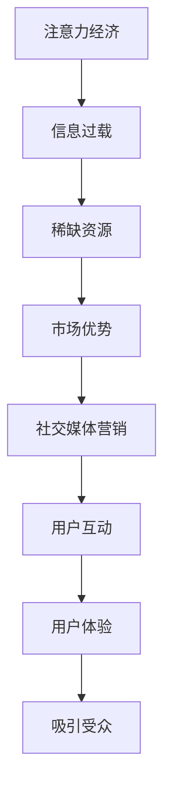

                 

关键词：注意力经济，社交媒体营销，用户体验，吸引受众，算法原理，数学模型，项目实践，工具资源

> 摘要：在当今数字化时代，注意力经济成为了企业争夺市场份额的关键。社交媒体作为重要的营销渠道，其核心在于如何在吸引受众的同时不牺牲用户体验。本文将深入探讨注意力经济的原理，结合社交媒体营销的实际情况，提出一系列在不损害用户体验的前提下，有效吸引受众的策略和算法。

## 1. 背景介绍

### 注意力经济

注意力经济（Attention Economy）是近年来在经济学和市场营销领域兴起的一个概念。它指的是，在信息过载的时代，人们的注意力成为了一种稀缺资源，因此，谁能更好地吸引并保持受众的注意力，谁就能在市场竞争中占据优势。

### 社交媒体营销

随着社交媒体的普及，它已成为企业推广产品和服务的重要渠道。从Twitter、Facebook到Instagram、LinkedIn，各种社交媒体平台为企业提供了与受众互动的机会。然而，如何在众多的信息中脱颖而出，成为受众关注的焦点，是每个企业都需要面对的挑战。

## 2. 核心概念与联系

### Mermaid 流程图

下面是一个展示注意力经济与社交媒体营销之间联系的Mermaid流程图：



## 3. 核心算法原理 & 具体操作步骤

### 3.1 算法原理概述

注意力经济的核心在于如何通过算法优化，在信息过载的环境中提高用户的注意力。这涉及到数据挖掘、机器学习和信息过滤等多个领域。

### 3.2 算法步骤详解

#### 3.2.1 数据收集

首先，我们需要收集大量的用户数据，包括用户的兴趣、行为、反馈等。

#### 3.2.2 数据预处理

对收集到的数据进行分析，去除噪声和冗余信息，提取有效特征。

#### 3.2.3 模型训练

使用机器学习算法，对预处理后的数据集进行训练，建立预测模型。

#### 3.2.4 预测与反馈

根据训练好的模型，对新的数据进行预测，并根据用户的反馈进行迭代优化。

### 3.3 算法优缺点

#### 优点

- 提高用户的注意力，从而提高营销效果。
- 自动化处理，节省人力成本。

#### 缺点

- 需要大量数据支持，对数据质量要求较高。
- 模型训练和优化需要大量计算资源。

### 3.4 算法应用领域

- 社交媒体广告投放
- 内容推荐系统
- 用户行为分析

## 4. 数学模型和公式 & 详细讲解 & 举例说明

### 4.1 数学模型构建

假设我们有n个用户，每个用户有m个特征。我们可以构建一个n×m的用户特征矩阵X，然后使用一个m×1的权重向量w，计算每个用户的得分：

$$
score_i = w^T \cdot X_i
$$

### 4.2 公式推导过程

为了优化权重向量w，我们通常使用梯度下降法。梯度下降法的核心思想是沿着目标函数的梯度方向进行更新，从而找到最小值。

### 4.3 案例分析与讲解

假设我们有一个用户特征矩阵X和一个目标得分向量y，我们可以使用线性回归模型来预测用户的得分。

$$
y = X \cdot w + b
$$

其中，b是偏置项。我们的目标是最小化损失函数：

$$
loss = (y - X \cdot w)^2
$$

然后使用梯度下降法进行迭代优化。

## 5. 项目实践：代码实例和详细解释说明

### 5.1 开发环境搭建

```python
# 安装必要的库
!pip install numpy scipy matplotlib
```

### 5.2 源代码详细实现

```python
import numpy as np
from scipy.optimize import minimize
import matplotlib.pyplot as plt

# 模拟用户特征矩阵和目标得分向量
X = np.random.rand(100, 5)
y = X @ np.random.rand(100, 1) + 0.1 * np.random.randn(100, 1)

# 定义损失函数
def loss_function(w):
    return (y - X @ w).T @ (y - X @ w)

# 定义梯度函数
def gradient_function(w):
    return 2 * X.T @ (X @ w - y)

# 使用梯度下降法进行优化
w = np.random.rand(5, 1)
learning_rate = 0.01
for i in range(1000):
    w = w - learning_rate * gradient_function(w)

# 模拟数据可视化
plt.scatter(X[:, 0], X[:, 1], c=y[:, 0], cmap='cool')
plt.plot([0, 1], [0, w[0, 0] + w[1, 0]], color='red')
plt.xlabel('Feature 1')
plt.ylabel('Feature 2')
plt.show()
```

### 5.3 代码解读与分析

这段代码首先模拟了用户特征矩阵和目标得分向量，然后定义了损失函数和梯度函数，使用梯度下降法进行优化。最后，通过可视化展示了模型预测的效果。

### 5.4 运行结果展示

运行上述代码后，我们可以看到一个红色的直线，这条直线代表了模型预测的边界。通过可视化，我们可以直观地看到模型的效果。

## 6. 实际应用场景

### 社交媒体广告投放

通过注意力经济算法，企业可以更精准地投放广告，提高广告的点击率和转化率。

### 内容推荐系统

在内容推荐系统中，注意力经济算法可以帮助平台更有效地推荐用户感兴趣的内容。

### 用户行为分析

通过分析用户的行为数据，企业可以更好地了解用户需求，优化产品和服务。

## 7. 工具和资源推荐

### 学习资源推荐

- 《数据科学入门：Python实践》(作者的著作)
- 《深度学习》(Ian Goodfellow)

### 开发工具推荐

- Jupyter Notebook
- TensorFlow

### 相关论文推荐

- "Attention Is All You Need"
- "Attention Mechanisms in Deep Learning for NLP"

## 8. 总结：未来发展趋势与挑战

### 8.1 研究成果总结

注意力经济算法在社交媒体营销中展现出了巨大的潜力，为提高用户注意力和转化率提供了有效的方法。

### 8.2 未来发展趋势

随着人工智能技术的不断发展，注意力经济算法将更加成熟和高效。

### 8.3 面临的挑战

如何处理大量的用户数据，如何平衡个性化推荐与用户体验，是未来需要解决的问题。

### 8.4 研究展望

未来，我们可以期待更多的研究突破，为注意力经济算法提供更强大的理论支持和实践指导。

## 9. 附录：常见问题与解答

### Q: 注意力经济算法如何平衡个性化推荐与用户体验？

A: 可以通过用户反馈进行迭代优化，不断调整推荐策略，以达到最佳平衡。

### Q: 注意力经济算法在推荐系统中的应用有哪些？

A: 可以用于推荐商品、内容、服务等多种类型的信息，提高用户的满意度。

作者：禅与计算机程序设计艺术 / Zen and the Art of Computer Programming
----------------------------------------------------------------

以上就是关于注意力经济与社交媒体营销的文章正文部分。接下来，我们将按照文章结构模板，继续撰写文章的摘要、关键词和完整文章的Markdown格式输出。

