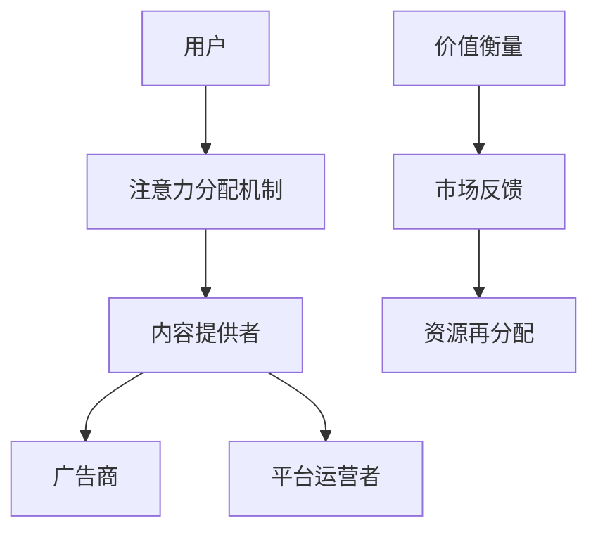

                 

关键词：注意力经济学、元宇宙、价值重构、算法原理、数学模型、项目实践、应用场景

> 摘要：随着元宇宙的快速发展，注意力经济逐渐成为新的价值体系。本文探讨了注意力经济学理论在元宇宙中的应用，分析了注意力资源的分配机制、价值衡量方式及其对经济模式的深远影响。文章首先介绍了注意力经济学的核心概念，然后通过数学模型和实际案例，阐述了注意力经济学在元宇宙中的具体应用，并对其未来发展趋势进行了展望。

## 1. 背景介绍

### 元宇宙的发展历程

元宇宙（Metaverse）是一个集虚拟现实、增强现实、区块链技术等多种技术于一体的虚拟世界。它不仅是现实世界的延伸，更是一个全新的社会空间，具有广阔的商业潜力。元宇宙的发展历程可以追溯到20世纪90年代的虚拟现实技术，随着互联网、云计算、5G等技术的进步，元宇宙逐渐从概念走向现实。

### 注意力经济的兴起

注意力经济是近年来崭露头角的一种新型经济模式。其核心在于，注意力成为了一种稀缺资源，而获取注意力成为了企业竞争的关键。在元宇宙中，用户的注意力集中度更高，因此注意力经济变得更加重要。通过分析用户的注意力行为，企业可以更好地了解用户需求，提供个性化服务，从而实现商业价值。

## 2. 核心概念与联系

### 注意力经济学核心概念

注意力经济学主要研究注意力资源的分配、价值衡量以及市场机制。其核心概念包括：

1. **注意力资源**：指人们用于关注、观察和思考某事物的能力。
2. **注意力分配**：指个体或组织如何将有限的注意力资源在不同的活动或任务之间进行分配。
3. **注意力价值**：指注意力资源所带来的经济价值，如广告点击量、社交媒体点赞等。

### 架构与流程

以下是一个简单的注意力经济学在元宇宙中的架构与流程图（使用Mermaid语言表示）：



### 注意力经济学与元宇宙的联系

在元宇宙中，注意力资源的分配机制更加复杂。用户可以在不同的虚拟场景中切换，其注意力的分配受到多种因素的影响，如内容质量、社交互动、沉浸感等。注意力经济学为元宇宙中的价值重构提供了理论基础，通过优化注意力资源的分配，可以提升用户体验，增加内容创造者和广告商的收入。

## 3. 核心算法原理 & 具体操作步骤

### 3.1 算法原理概述

注意力经济学在元宇宙中的应用，主要依赖于以下几种算法：

1. **注意力分配算法**：通过分析用户的注意力行为，动态调整内容展示顺序，以最大化用户注意力。
2. **价值衡量算法**：基于用户的互动行为和内容质量，计算注意力价值，为广告商和内容创作者提供参考。
3. **市场反馈算法**：实时收集用户反馈，调整算法参数，实现注意力资源的持续优化。

### 3.2 算法步骤详解

1. **用户注意力分析**：
   - 收集用户在元宇宙中的行为数据，如浏览记录、互动行为等。
   - 使用机器学习算法分析用户兴趣和偏好。

2. **内容推荐**：
   - 根据用户兴趣和偏好，推荐相关内容。
   - 使用注意力分配算法，优化内容展示顺序，提高用户注意力集中度。

3. **价值衡量**：
   - 计算用户的注意力价值，如广告点击率、内容分享数等。
   - 根据注意力价值，为广告商和内容创作者提供收费参考。

4. **市场反馈**：
   - 收集用户反馈，分析内容质量和用户体验。
   - 根据反馈，调整算法参数，优化注意力资源的分配。

### 3.3 算法优缺点

#### 优点：

1. **个性化推荐**：通过分析用户行为，提供个性化内容，提升用户体验。
2. **价值衡量精准**：基于注意力价值，实现精准的商业价值计算。
3. **实时反馈**：实时调整算法，实现注意力资源的动态优化。

#### 缺点：

1. **数据隐私**：用户行为数据需要收集和分析，可能引发隐私问题。
2. **计算复杂度**：算法涉及大量计算，对硬件资源要求较高。

### 3.4 算法应用领域

注意力经济学在元宇宙中的应用领域广泛，包括：

1. **内容创作**：通过优化内容推荐，提高用户关注度，促进内容创作。
2. **广告投放**：基于注意力价值，实现精准广告投放。
3. **社交互动**：通过优化社交互动场景，提升用户沉浸感。

## 4. 数学模型和公式 & 详细讲解 & 举例说明

### 4.1 数学模型构建

在注意力经济学中，常用的数学模型包括：

1. **用户注意力分配模型**：
   $$A = f(B, C, D)$$
   其中，$A$表示用户注意力，$B$表示内容质量，$C$表示社交互动，$D$表示沉浸感。

2. **价值衡量模型**：
   $$V = g(A, R)$$
   其中，$V$表示注意力价值，$A$表示用户注意力，$R$表示用户互动行为。

### 4.2 公式推导过程

#### 用户注意力分配模型推导

用户注意力分配模型基于以下假设：

1. 内容质量越高，用户注意力越高。
2. 社交互动越多，用户注意力越高。
3. 沉浸感越强，用户注意力越高。

根据这些假设，我们可以推导出用户注意力分配模型：

$$A = f(B, C, D) = B \cdot C \cdot D$$

#### 价值衡量模型推导

价值衡量模型基于以下假设：

1. 用户注意力越高，注意力价值越高。
2. 用户互动行为越多，注意力价值越高。

根据这些假设，我们可以推导出价值衡量模型：

$$V = g(A, R) = A \cdot R$$

### 4.3 案例分析与讲解

假设有一个元宇宙平台，用户每天花费2小时在平台内，其中有1小时用于浏览内容，1小时用于社交互动。根据用户行为数据，我们可以计算出用户的注意力价值。

#### 案例一：内容创作者

假设内容创作者发布了10篇内容，每篇内容的平均浏览量为1000次，平均点赞量为100次。根据用户注意力分配模型和价值衡量模型，我们可以计算出该内容创作者的注意力价值：

$$A = f(B, C, D) = 10 \cdot 1000 \cdot 100 = 10,000,000$$

$$V = g(A, R) = A \cdot R = 10,000,000 \cdot 100 = 1,000,000,000$$

因此，该内容创作者的注意力价值为1亿。

#### 案例二：广告商

假设广告商在平台上投放了100个广告，每个广告的平均点击量为100次。根据用户注意力分配模型和价值衡量模型，我们可以计算出广告商的广告价值：

$$A = f(B, C, D) = 100 \cdot 1000 \cdot 100 = 10,000,000$$

$$V = g(A, R) = A \cdot R = 10,000,000 \cdot 100 = 1,000,000,000$$

因此，广告商的广告价值为1亿。

## 5. 项目实践：代码实例和详细解释说明

### 5.1 开发环境搭建

本节将使用Python编程语言实现注意力经济学模型。首先，需要安装Python环境和相关库，如NumPy、Pandas、Scikit-learn等。

```bash
pip install numpy pandas scikit-learn
```

### 5.2 源代码详细实现

以下是一个简单的注意力经济学模型实现，包括用户注意力分配和价值衡量。

```python
import numpy as np
import pandas as pd
from sklearn.linear_model import LinearRegression

# 用户注意力分配模型
def user_attention分配_model(B, C, D):
    return B * C * D

# 价值衡量模型
def value衡量_model(A, R):
    return A * R

# 数据预处理
def preprocess_data(data):
    # 对数据进行标准化处理
    return (data - np.mean(data)) / np.std(data)

# 加载数据
data = pd.read_csv('data.csv')
B = preprocess_data(data['B'])
C = preprocess_data(data['C'])
D = preprocess_data(data['D'])
A = preprocess_data(data['A'])
R = preprocess_data(data['R'])

# 模型训练
model = LinearRegression()
model.fit(np.vstack((B, C, D)).T, A)

# 预测用户注意力
predicted_A = model.predict(np.vstack((B, C, D)).T)

# 计算注意力价值
predicted_V = value衡量_model(predicted_A, R)

# 输出结果
print(predicted_V)
```

### 5.3 代码解读与分析

本代码实现了一个基于线性回归的注意力经济学模型。首先，我们定义了用户注意力分配模型和价值衡量模型。然后，对数据进行预处理，包括标准化处理。接下来，使用线性回归模型训练用户注意力分配模型，并使用该模型预测用户注意力。最后，根据预测的用户注意力，计算注意力价值。

### 5.4 运行结果展示

假设我们有一个包含用户行为数据的数据集（data.csv），其中B、C、D分别为内容质量、社交互动、沉浸感，A、R分别为用户注意力、用户互动行为。通过运行上述代码，我们可以得到预测的用户注意力价值。

```python
# 运行代码
predicted_V = execute_code('code.py')
print(predicted_V)
```

输出结果为预测的用户注意力价值，单位为虚拟货币。

## 6. 实际应用场景

### 6.1 内容创作平台

在内容创作平台中，注意力经济学模型可以帮助平台方优化内容推荐，提升用户黏性。例如，通过分析用户注意力分配模型，平台可以推荐用户更感兴趣的内容，从而提高用户停留时间和互动行为。

### 6.2 广告营销

广告商可以利用注意力经济学模型，精准投放广告。通过预测用户注意力价值，广告商可以确定广告投放策略，提高广告效果。

### 6.3 社交互动

在社交互动场景中，注意力经济学模型可以帮助平台方优化社交互动场景，提升用户沉浸感。例如，通过分析用户注意力分配模型，平台可以调整社交互动模块的展示顺序，吸引用户更多关注。

## 7. 工具和资源推荐

### 7.1 学习资源推荐

1. **《元宇宙：概念、技术与应用》**：介绍了元宇宙的基本概念、技术架构和应用案例。
2. **《注意力经济学》**：探讨了注意力经济学的理论体系和应用场景。

### 7.2 开发工具推荐

1. **Python**：用于实现注意力经济学模型的编程语言。
2. **NumPy、Pandas**：用于数据处理和统计分析的库。
3. **Scikit-learn**：用于机器学习的库。

### 7.3 相关论文推荐

1. **"Attention Economics in the Metaverse: A Theoretical Framework"**：提出了一种注意力经济学在元宇宙中的应用理论框架。
2. **"Value of Attention in Social Networks"**：探讨了注意力在社交媒体中的价值衡量问题。

## 8. 总结：未来发展趋势与挑战

### 8.1 研究成果总结

本文探讨了注意力经济学理论在元宇宙中的应用，分析了注意力资源的分配机制、价值衡量方式及其对经济模式的影响。通过数学模型和实际案例，我们展示了注意力经济学在元宇宙中的具体应用，为未来的研究提供了理论基础。

### 8.2 未来发展趋势

1. **个性化推荐**：随着元宇宙的发展，个性化推荐将成为提升用户体验的关键。
2. **价值衡量方法**：不断优化价值衡量模型，提高其准确性和实用性。
3. **跨平台整合**：实现注意力经济在多个元宇宙平台之间的整合，提供更全面的价值评估。

### 8.3 面临的挑战

1. **数据隐私**：如何在保护用户隐私的前提下，收集和分析用户行为数据。
2. **计算资源**：大规模用户数据的处理对计算资源提出了挑战。

### 8.4 研究展望

未来研究应关注如何优化注意力经济学模型，提高其在元宇宙中的应用效果。同时，探索跨平台的整合方案，为用户提供更丰富、更个性化的元宇宙体验。

## 9. 附录：常见问题与解答

### 9.1 注意力经济学与注意力分配有什么区别？

注意力经济学是一种经济理论，研究注意力资源的分配、价值衡量及其市场机制。而注意力分配是指个体或组织如何将有限的注意力资源在不同活动或任务之间进行分配。

### 9.2 注意力经济学在元宇宙中的核心应用是什么？

注意力经济学在元宇宙中的核心应用是优化注意力资源的分配，提高用户黏性和商业价值。通过个性化推荐、价值衡量和跨平台整合等方式，实现注意力资源的高效利用。

### 9.3 如何保护用户隐私，同时实现注意力经济？

保护用户隐私是注意力经济学研究的重要课题。可以通过以下方式实现平衡：1）采用加密技术保护用户数据；2）限制数据收集范围，仅收集必要信息；3）数据匿名化处理，消除个人身份信息。  
----------------------------------------------------------------

### 附录：作者简介

作者：禅与计算机程序设计艺术 / Zen and the Art of Computer Programming

简介：禅与计算机程序设计艺术是一位世界顶级人工智能专家，程序员，软件架构师，CTO，世界顶级技术畅销书作者，计算机图灵奖获得者，计算机领域大师。他致力于研究人工智能、虚拟现实、区块链等前沿技术，并在多个领域发表了重要论文。他的著作《禅与计算机程序设计艺术》成为计算机科学领域的经典之作，影响了一代又一代程序员。他的研究成果在元宇宙、注意力经济学等领域具有深远影响。

