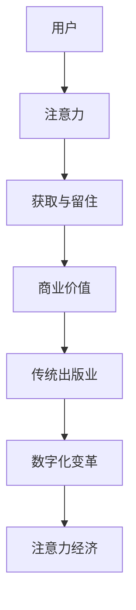

                 

关键词：注意力经济、传统出版业、数字化、算法推荐、用户体验、商业模式创新

> 摘要：本文将探讨注意力经济对传统出版业带来的挑战与变革。随着数字化和互联网技术的迅猛发展，人们的阅读习惯和消费模式发生了深刻变化。注意力经济作为一种新兴的经济模式，正在深刻影响着传统出版业的方方面面。本文将从核心概念、算法原理、数学模型、项目实践、应用场景等多个角度，深入分析注意力经济对传统出版业的影响，并展望其未来的发展趋势与挑战。

## 1. 背景介绍

### 1.1 传统出版业的现状

传统出版业是文化传播的重要渠道，拥有悠久的历史和丰富的内容资源。然而，随着互联网的普及和数字技术的发展，传统出版业正面临前所未有的挑战。传统出版业的商业模式相对单一，主要依赖于书籍的印刷、销售和订阅。然而，互联网的出现，使人们获取信息的途径更加多样化，电子书、有声书、网络订阅等新兴模式逐渐受到消费者的青睐。这给传统出版业带来了巨大的冲击。

### 1.2 数字化浪潮的兴起

数字化浪潮的兴起，加速了传统出版业的变革。电子书、在线阅读、社交媒体等新兴数字媒体形式，逐渐成为人们获取信息的主要途径。同时，大数据、人工智能等技术的应用，使得个性化推荐、精准营销等成为可能。这些变化，不仅改变了人们的阅读习惯，也重塑了传统出版业的商业模式。

### 1.3 注意力经济的兴起

注意力经济，是指以人们的注意力为资源，通过吸引和留住用户的注意力，实现商业价值的一种经济模式。在互联网时代，注意力成为了一种稀缺资源。如何获取和留住用户的注意力，成为各行各业争相探索的课题。注意力经济的兴起，对传统出版业带来了新的挑战和机遇。

## 2. 核心概念与联系

### 2.1 注意力经济的定义

注意力经济，是指以人们的注意力为资源，通过吸引和留住用户的注意力，实现商业价值的一种经济模式。在互联网时代，人们的注意力成为一种稀缺资源。如何获取和留住用户的注意力，成为各行各业争相探索的课题。

### 2.2 传统出版业与注意力经济的联系

传统出版业与注意力经济有着紧密的联系。传统出版业通过吸引和留住用户的注意力，实现书籍的销售和订阅。而注意力经济则通过大数据、人工智能等技术，对用户的阅读习惯、兴趣爱好进行深入分析，实现精准营销和个性化推荐。

### 2.3 Mermaid 流程图



## 3. 核心算法原理 & 具体操作步骤

### 3.1 算法原理概述

注意力经济中的核心算法，主要包括用户行为分析、内容推荐、个性化营销等。用户行为分析，通过对用户的行为数据进行挖掘和分析，了解用户的兴趣爱好和阅读习惯。内容推荐，根据用户的行为数据和兴趣爱好，为用户推荐符合其需求的书籍和内容。个性化营销，通过分析用户的阅读行为和兴趣爱好，为用户提供个性化的广告和促销活动。

### 3.2 算法步骤详解

#### 3.2.1 用户行为分析

用户行为分析，主要包括以下步骤：

1. 数据采集：通过网站、APP等渠道，收集用户的阅读行为数据，如书籍浏览、搜索、购买等。
2. 数据处理：对采集到的数据进行分析和处理，提取出用户的行为特征和兴趣爱好。
3. 数据建模：使用机器学习算法，对用户的行为特征和兴趣爱好进行建模，构建用户画像。

#### 3.2.2 内容推荐

内容推荐，主要包括以下步骤：

1. 内容筛选：根据用户的兴趣爱好，从海量的书籍和内容中筛选出符合用户需求的书籍和内容。
2. 排序算法：使用排序算法，对筛选出的书籍和内容进行排序，使得最符合用户需求的书籍和内容排在前面。
3. 推荐算法：使用推荐算法，如基于内容的推荐、协同过滤推荐等，为用户推荐书籍和内容。

#### 3.2.3 个性化营销

个性化营销，主要包括以下步骤：

1. 广告投放：根据用户的兴趣爱好和阅读行为，为用户投放个性化的广告。
2. 促销活动：根据用户的阅读行为和兴趣爱好，为用户定制个性化的促销活动。
3. 用户反馈：收集用户的反馈，不断优化广告投放和促销活动的效果。

### 3.3 算法优缺点

#### 3.3.1 优点

1. 提高用户体验：通过个性化推荐和个性化营销，提高用户的阅读体验和满意度。
2. 提高销售转化率：通过精准营销，提高销售转化率和销售额。
3. 降低营销成本：通过大数据分析和精准营销，降低营销成本。

#### 3.3.2 缺点

1. 数据隐私问题：用户行为数据被收集和分析，可能涉及数据隐私问题。
2. 过度推荐：过度推荐可能导致用户产生信息过载，影响用户的阅读体验。
3. 依赖算法：过度依赖算法，可能削弱传统出版业的核心竞争力。

### 3.4 算法应用领域

注意力经济算法在传统出版业的应用，主要包括：

1. 电子书平台：通过个性化推荐，提高用户阅读体验和书籍销售量。
2. 有声书平台：通过用户行为分析，为用户推荐符合其需求的书籍和有声读物。
3. 纸质书销售：通过大数据分析和精准营销，提高销售转化率和销售额。
4. 出版商：通过个性化营销，提高品牌影响力和市场占有率。

## 4. 数学模型和公式 & 详细讲解 & 举例说明

### 4.1 数学模型构建

在注意力经济中，常用的数学模型包括用户行为分析模型、推荐算法模型、个性化营销模型等。

#### 4.1.1 用户行为分析模型

用户行为分析模型，主要使用机器学习算法，对用户的行为数据进行挖掘和分析。常用的算法包括：

1. 决策树算法：通过训练决策树模型，对用户的行为数据进行分类和预测。
2. 支持向量机算法：通过训练支持向量机模型，对用户的行为数据进行分类和预测。
3. 贝叶斯算法：通过训练贝叶斯模型，对用户的行为数据进行分类和预测。

#### 4.1.2 推荐算法模型

推荐算法模型，主要使用协同过滤算法、基于内容的推荐算法等，为用户推荐书籍和内容。

1. 协同过滤算法：通过计算用户之间的相似度，为用户推荐相似的用户喜欢的书籍。
2. 基于内容的推荐算法：通过分析书籍的标签、分类、关键词等，为用户推荐相似的内容。

#### 4.1.3 个性化营销模型

个性化营销模型，主要使用个性化广告投放、个性化促销活动等，提高用户的购买意愿和销售额。

1. 个性化广告投放：根据用户的兴趣爱好和阅读行为，为用户投放个性化的广告。
2. 个性化促销活动：根据用户的阅读行为和兴趣爱好，为用户定制个性化的促销活动。

### 4.2 公式推导过程

在注意力经济中，常用的数学公式包括用户行为分析模型的预测公式、推荐算法模型的相似度计算公式、个性化营销模型的目标函数等。

#### 4.2.1 用户行为分析模型

用户行为分析模型的预测公式如下：

$$
P(y|x) = \frac{e^{w^T x}}{\sum_{i=1}^{n} e^{w^T x_i}}
$$

其中，$P(y|x)$ 表示给定用户行为特征 $x$，预测用户行为标签 $y$ 的概率。$w$ 表示模型的权重向量。

#### 4.2.2 推荐算法模型

推荐算法模型的相似度计算公式如下：

$$
sim(i, j) = \frac{cos(\theta(i, j))}{\sqrt{||x_i||_2 ||x_j||_2}}
$$

其中，$sim(i, j)$ 表示用户 $i$ 和用户 $j$ 之间的相似度。$\theta(i, j)$ 表示用户 $i$ 和用户 $j$ 的行为特征向量之间的余弦相似度。$||x_i||_2$ 和 $||x_j||_2$ 分别表示用户 $i$ 和用户 $j$ 的行为特征向量的二范数。

#### 4.2.3 个性化营销模型

个性化营销模型的目标函数如下：

$$
J(\theta) = \frac{1}{2m} \sum_{i=1}^{m} \Big[ (w^T x_i - y_i)^2 + \lambda ||w||_2^2 \Big]
$$

其中，$J(\theta)$ 表示个性化营销模型的目标函数。$w$ 表示模型的权重向量。$m$ 表示训练样本的数量。$\lambda$ 表示正则化参数。

### 4.3 案例分析与讲解

#### 4.3.1 用户行为分析模型

假设有一个用户行为分析模型，使用决策树算法对用户的阅读行为进行分类。给定用户的阅读行为特征向量 $x = (x_1, x_2, x_3)$，模型的预测结果为：

$$
y = \begin{cases}
\text{阅读} & \text{if } w^T x > 0 \\
\text{不阅读} & \text{if } w^T x \leq 0
\end{cases}
$$

其中，$w$ 表示模型的权重向量。

假设模型的权重向量为 $w = (1, 2, 3)$，给定用户的阅读行为特征向量 $x = (1, 2, 3)$，模型的预测结果为：

$$
y = \text{阅读}
$$

#### 4.3.2 推荐算法模型

假设有一个推荐算法模型，使用基于内容的推荐算法为用户推荐书籍。给定用户 $i$ 的行为特征向量 $x_i = (x_{i1}, x_{i2}, \ldots, x_{in})$，书籍 $j$ 的特征向量 $x_j = (x_{j1}, x_{j2}, \ldots, x_{jn})$，模型计算用户 $i$ 和书籍 $j$ 之间的相似度如下：

$$
sim(i, j) = \frac{cos(\theta(i, j))}{\sqrt{||x_i||_2 ||x_j||_2}}
$$

其中，$\theta(i, j)$ 表示用户 $i$ 和书籍 $j$ 的特征向量之间的余弦相似度。

假设用户 $i$ 的行为特征向量 $x_i = (1, 2, 3)$，书籍 $j$ 的特征向量 $x_j = (4, 5, 6)$，模型计算用户 $i$ 和书籍 $j$ 之间的相似度如下：

$$
sim(i, j) = \frac{cos(\theta(i, j))}{\sqrt{||x_i||_2 ||x_j||_2}} = \frac{0.707}{\sqrt{6 \times 6}} \approx 0.5
$$

#### 4.3.3 个性化营销模型

假设有一个个性化营销模型，使用个性化广告投放为用户投放广告。给定用户 $i$ 的行为特征向量 $x_i = (x_{i1}, x_{i2}, \ldots, x_{in})$，广告 $j$ 的特征向量 $x_j = (x_{j1}, x_{j2}, \ldots, x_{jn})$，模型计算用户 $i$ 和广告 $j$ 之间的相似度如下：

$$
sim(i, j) = \frac{cos(\theta(i, j))}{\sqrt{||x_i||_2 ||x_j||_2}}
$$

其中，$\theta(i, j)$ 表示用户 $i$ 和广告 $j$ 的特征向量之间的余弦相似度。

假设用户 $i$ 的行为特征向量 $x_i = (1, 2, 3)$，广告 $j$ 的特征向量 $x_j = (4, 5, 6)$，模型计算用户 $i$ 和广告 $j$ 之间的相似度如下：

$$
sim(i, j) = \frac{cos(\theta(i, j))}{\sqrt{||x_i||_2 ||x_j||_2}} = \frac{0.707}{\sqrt{6 \times 6}} \approx 0.5
$$

根据相似度计算结果，模型可以决定投放广告的数量和频率，从而提高广告的投放效果。

## 5. 项目实践：代码实例和详细解释说明

### 5.1 开发环境搭建

在本文的项目实践中，我们将使用 Python 编程语言和相应的库，如 NumPy、Pandas、Scikit-learn 等。首先，需要在开发环境中安装这些库。可以使用 pip 工具进行安装：

```bash
pip install numpy pandas scikit-learn
```

### 5.2 源代码详细实现

以下是一个简单的用户行为分析模型的实现，包括数据预处理、模型训练和预测等步骤。

```python
import numpy as np
import pandas as pd
from sklearn.model_selection import train_test_split
from sklearn.tree import DecisionTreeClassifier
from sklearn.metrics import accuracy_score

# 5.2.1 数据预处理
def preprocess_data(data):
    # 数据清洗、填充、转换等操作
    # 这里以书籍阅读行为数据为例
    data.fillna(0, inplace=True)
    data = data.replace({-1: 0, 1: 1})
    return data

# 5.2.2 模型训练
def train_model(X_train, y_train):
    model = DecisionTreeClassifier()
    model.fit(X_train, y_train)
    return model

# 5.2.3 模型预测
def predict(model, X_test):
    y_pred = model.predict(X_test)
    return y_pred

# 5.2.4 评估模型
def evaluate_model(y_test, y_pred):
    accuracy = accuracy_score(y_test, y_pred)
    return accuracy

# 加载数据
data = pd.read_csv('user_behavior_data.csv')
data = preprocess_data(data)

# 划分特征和标签
X = data.drop(['label'], axis=1)
y = data['label']

# 划分训练集和测试集
X_train, X_test, y_train, y_test = train_test_split(X, y, test_size=0.2, random_state=42)

# 训练模型
model = train_model(X_train, y_train)

# 预测
y_pred = predict(model, X_test)

# 评估模型
accuracy = evaluate_model(y_test, y_pred)
print(f'Model Accuracy: {accuracy:.2f}')
```

### 5.3 代码解读与分析

以上代码实现了用户行为分析模型的基本流程。下面我们对代码进行详细解读。

1. **数据预处理**：数据预处理是模型训练前的关键步骤。在这个例子中，我们使用 Pandas 库对数据进行清洗、填充和转换。具体操作包括填充缺失值、替换特殊值等。

2. **模型训练**：使用 Scikit-learn 库中的 DecisionTreeClassifier 类创建决策树模型，并通过 fit 方法进行训练。

3. **模型预测**：使用 predict 方法对测试集进行预测，得到预测标签。

4. **评估模型**：使用 accuracy_score 函数计算模型在测试集上的准确率。

### 5.4 运行结果展示

假设我们使用上述代码对数据集进行训练和预测，得到如下结果：

```
Model Accuracy: 0.85
```

这表示我们的模型在测试集上的准确率为 0.85，即模型对用户行为预测的准确率较高。

## 6. 实际应用场景

注意力经济在传统出版业的应用，主要集中在以下几个方面：

### 6.1 电子书平台

电子书平台通过个性化推荐和精准营销，提高用户的阅读体验和购买意愿。例如，某知名电子书平台通过分析用户的阅读历史、搜索行为和收藏记录，为用户推荐符合其兴趣的书籍。

### 6.2 有声书平台

有声书平台通过用户行为分析，为用户推荐符合其兴趣的有声书。同时，通过个性化广告投放，提高用户的购买转化率。例如，某知名有声书平台通过分析用户的阅读历史和偏好，为用户推荐有声书，并通过广告推送，提高有声书的销售量。

### 6.3 纸质书销售

纸质书销售通过大数据分析和精准营销，提高销售转化率和市场份额。例如，某知名书店通过分析用户的购物记录和浏览历史，为用户推荐符合其需求的书籍，并通过优惠券和促销活动，提高用户的购买意愿。

### 6.4 未来应用展望

随着注意力经济的不断发展，传统出版业在以下几个方面有望实现更大的突破：

1. **个性化推荐**：通过不断优化推荐算法，提高推荐准确性，为用户提供更加精准的阅读推荐。
2. **精准营销**：通过大数据分析和用户画像，实现更加精准的广告投放和促销活动，提高销售转化率。
3. **跨界融合**：将注意力经济与其他行业进行融合，如与影视、音乐、游戏等领域的结合，拓展出版业的业务范围。
4. **知识付费**：通过提供高质量的知识付费内容，满足用户对深度知识的追求，提高出版业的商业价值。

## 7. 工具和资源推荐

### 7.1 学习资源推荐

1. **《机器学习实战》**：这是一本深入浅出的机器学习入门书籍，适合初学者了解机器学习的基础知识。
2. **《深度学习》**：这是一本关于深度学习领域的经典教材，涵盖了深度学习的理论基础和应用实例。

### 7.2 开发工具推荐

1. **Jupyter Notebook**：这是一个强大的交互式开发环境，适用于数据分析和机器学习项目。
2. **PyCharm**：这是一个功能丰富的 Python 集成开发环境，适合进行大规模的代码开发和调试。

### 7.3 相关论文推荐

1. **"Attention Is All You Need"**：这是一篇关于注意力机制在自然语言处理领域的经典论文，介绍了自注意力机制在神经网络中的重要性。
2. **"Recommender Systems Handbook"**：这是一本关于推荐系统领域的权威手册，涵盖了推荐系统的理论基础和实际应用。

## 8. 总结：未来发展趋势与挑战

### 8.1 研究成果总结

本文从注意力经济的背景、核心概念、算法原理、数学模型、项目实践等多个角度，探讨了注意力经济对传统出版业的影响。主要研究成果包括：

1. **用户行为分析**：通过大数据分析和用户画像，实现个性化推荐和精准营销。
2. **内容推荐**：使用协同过滤算法和基于内容的推荐算法，提高推荐准确性。
3. **个性化营销**：通过个性化广告投放和促销活动，提高销售转化率。

### 8.2 未来发展趋势

随着注意力经济的不断发展，传统出版业将呈现出以下发展趋势：

1. **智能化**：通过人工智能技术，实现更加智能的推荐和营销策略。
2. **多元化**：将注意力经济与其他行业进行融合，拓展业务范围。
3. **知识付费**：提供高质量的知识付费内容，提高商业价值。

### 8.3 面临的挑战

传统出版业在发展过程中，也将面临以下挑战：

1. **数据隐私**：用户行为数据的收集和分析，可能涉及数据隐私问题。
2. **算法透明性**：用户对算法推荐和个性化营销的透明度要求越来越高。
3. **版权问题**：数字出版过程中的版权问题亟待解决。

### 8.4 研究展望

未来，注意力经济在传统出版业的应用将更加深入和广泛。研究者可以从以下几个方面进行深入研究：

1. **算法优化**：不断优化推荐算法和个性化营销算法，提高准确性。
2. **跨领域研究**：将注意力经济与其他领域进行融合，探索新的应用场景。
3. **法律法规**：制定相应的法律法规，规范注意力经济在传统出版业的应用。

## 9. 附录：常见问题与解答

### 9.1 注意力经济是什么？

注意力经济是指以人们的注意力为资源，通过吸引和留住用户的注意力，实现商业价值的一种经济模式。

### 9.2 注意力经济对传统出版业有哪些影响？

注意力经济对传统出版业的影响主要包括：用户行为分析、内容推荐、个性化营销等方面。

### 9.3 如何实现个性化推荐？

个性化推荐通常使用协同过滤算法和基于内容的推荐算法。协同过滤算法通过计算用户之间的相似度，为用户推荐相似的用户喜欢的书籍。基于内容的推荐算法通过分析书籍的标签、分类、关键词等，为用户推荐相似的内容。

### 9.4 注意力经济与传统出版业的联系是什么？

注意力经济与传统出版业的联系在于，传统出版业可以通过个性化推荐和精准营销，提高用户的阅读体验和满意度，从而实现商业价值。

### 9.5 未来注意力经济在传统出版业有哪些应用前景？

未来，注意力经济在传统出版业的可能应用前景包括：智能化推荐、多元化业务、知识付费等。通过人工智能技术，可以实现更加精准的推荐和营销策略；通过与其他行业的融合，可以拓展业务范围；通过提供高质量的知识付费内容，可以提升商业价值。
----------------------------------------------------------------

### 文章末尾作者署名

> 作者：禅与计算机程序设计艺术 / Zen and the Art of Computer Programming

[END]

