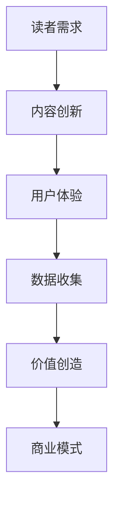

                 

关键词：注意力经济、传统出版业、数字化转型、读者体验、内容创新

> 摘要：本文旨在探讨注意力经济对传统出版业的深远影响，分析其在数字化转型过程中所面临的挑战与机遇。通过深入剖析注意力经济的核心概念，我们将提出一系列针对传统出版业转型的策略和建议，以期为行业未来的可持续发展提供有益的启示。

## 1. 背景介绍

随着互联网和数字技术的迅猛发展，信息传播方式发生了翻天覆地的变化。传统出版业，作为一个历史悠久的行业，正面临着前所未有的挑战。一方面，数字出版、社交媒体、博客和视频平台的兴起，极大地改变了人们获取信息和知识的方式；另一方面，注意力经济作为一种新的经济模式，正在重塑整个信息生态圈。

注意力经济，简单来说，是指通过吸引和维持人们的注意力来创造价值的经济活动。在数字时代，注意力成为了一种稀缺资源，而吸引和保持读者的注意力，成为出版业竞争的关键。传统出版业要想在数字化浪潮中立足，必须深入了解和把握注意力经济的本质，并据此进行战略转型。

## 2. 核心概念与联系

### 2.1 注意力经济的核心概念

注意力经济的基本原理可以概括为“注意力吸引 -> 数据收集 -> 价值创造”。其核心在于如何有效地吸引并保持用户的注意力，从而实现数据的积累和价值的创造。

- **注意力吸引**：通过各种手段和策略，如内容创新、用户体验优化、个性化推荐等，来吸引读者的注意力。
- **数据收集**：在用户互动过程中，通过数据挖掘和分析技术，收集用户的兴趣、行为、偏好等数据。
- **价值创造**：利用收集到的数据，进行精准营销、广告投放、用户增长等，从而实现商业价值的最大化。

### 2.2 传统出版业与注意力经济的联系

传统出版业与注意力经济的联系主要体现在以下几个方面：

- **内容创新**：为了吸引读者，传统出版业需要不断创新内容形式，如引入多媒体元素、增强互动性等。
- **用户体验**：提升读者体验是保持注意力的重要手段，包括页面设计、阅读体验、互动功能等。
- **数据利用**：通过数据分析和用户反馈，传统出版业可以更好地了解读者需求，进行个性化推荐和服务优化。
- **商业模式**：注意力经济为传统出版业提供了新的商业模式，如订阅制、会员制、广告收入等。

### 2.3 Mermaid 流程图

下面是一个简化的 Mermaid 流程图，展示了注意力经济在传统出版业中的应用流程：



## 3. 核心算法原理 & 具体操作步骤

### 3.1 算法原理概述

注意力经济的核心算法主要涉及以下几个方面：

- **内容推荐算法**：通过分析读者行为和偏好，推荐符合其兴趣的内容。
- **用户画像构建**：基于数据收集和分析，构建用户的个性化画像。
- **广告投放优化**：根据用户画像和内容偏好，实现精准的广告投放。

### 3.2 算法步骤详解

#### 3.2.1 内容推荐算法

1. 数据收集：通过日志分析、用户互动等手段，收集读者的阅读行为数据。
2. 特征提取：对收集到的数据进行预处理，提取用户行为特征和内容特征。
3. 模型训练：利用机器学习算法，如协同过滤、矩阵分解等，训练推荐模型。
4. 推荐生成：根据用户特征和内容特征，生成个性化推荐列表。

#### 3.2.2 用户画像构建

1. 数据收集：收集用户的基本信息、阅读历史、评论等数据。
2. 特征提取：对用户数据进行预处理，提取用户兴趣、偏好、行为等特征。
3. 画像构建：利用数据挖掘技术，构建用户的个性化画像。

#### 3.2.3 广告投放优化

1. 数据收集：收集用户行为数据、广告响应数据等。
2. 特征提取：提取用户行为特征、广告特征等。
3. 模型训练：利用机器学习算法，如决策树、随机森林等，训练广告投放模型。
4. 投放优化：根据用户画像和广告特征，优化广告投放策略。

### 3.3 算法优缺点

- **优点**：能够实现个性化推荐，提高用户体验；能够实现精准广告投放，提高广告效果。
- **缺点**：算法复杂度较高，计算成本较高；数据隐私问题需要得到妥善解决。

### 3.4 算法应用领域

注意力经济的核心算法广泛应用于传统出版业的多个领域，如内容推荐、用户增长、广告投放等。其应用场景包括：

- **电子书平台**：通过个性化推荐，提高用户的阅读体验和留存率。
- **杂志期刊**：通过精准广告投放，提高广告收益和品牌影响力。
- **在线教育平台**：通过个性化学习路径推荐，提高学习效果和用户满意度。

## 4. 数学模型和公式 & 详细讲解 & 举例说明

### 4.1 数学模型构建

注意力经济的数学模型主要涉及以下几个关键概念：

- **读者注意力**：表示读者对某一内容的兴趣程度，通常用概率分布来表示。
- **内容吸引力**：表示某一内容对读者的吸引力程度，通常用效用函数来表示。
- **用户兴趣**：表示用户对不同内容的偏好程度，通常用用户兴趣向量来表示。

基于上述概念，我们可以构建一个简单的数学模型：

$$
\text{读者注意力分布} \ p(\theta | x) = \frac{\exp(\theta^T x)}{\sum_{\theta'} \exp(\theta'^T x)}
$$

其中，$\theta$ 表示用户兴趣向量，$x$ 表示内容特征向量。

### 4.2 公式推导过程

为了推导上述读者注意力分布公式，我们首先需要定义以下几个概念：

- **内容效用**：表示用户对某一内容的偏好程度，通常用效用函数 $u(\theta, x)$ 表示。
- **内容吸引力**：表示用户对某一内容的兴趣程度，通常用概率分布 $p(\theta | x)$ 表示。

根据贝叶斯定理，我们可以推导出内容吸引力的概率分布：

$$
p(\theta | x) = \frac{p(x | \theta) p(\theta)}{p(x)}
$$

其中，$p(x | \theta)$ 表示内容给定的条件下，用户兴趣的概率；$p(\theta)$ 表示用户兴趣的概率；$p(x)$ 表示内容的概率。

假设内容效用函数 $u(\theta, x)$ 是连续可微的，我们可以通过对数似然函数最大化来估计用户兴趣向量 $\theta$：

$$
\log p(x | \theta) = \sum_{i=1}^N u(\theta, x_i)
$$

为了简化计算，我们可以使用极大似然估计（MLE）来估计参数 $\theta$：

$$
\hat{\theta} = \arg\max_{\theta} \log p(x | \theta)
$$

### 4.3 案例分析与讲解

假设我们有一个电子书平台，用户可以阅读不同类型的书籍，我们的目标是根据用户的行为数据，推荐符合其兴趣的书籍。

首先，我们需要收集用户的行为数据，如阅读历史、评论等。然后，我们可以使用协同过滤算法来构建用户兴趣向量 $\theta$。

假设我们有 $m$ 个用户和 $n$ 个书籍，用户 $i$ 对书籍 $j$ 的评分可以表示为 $r_{ij}$。我们可以使用用户评分矩阵 $R$ 来表示用户行为数据。

协同过滤算法的核心是构建用户兴趣向量 $\theta$。我们可以使用以下公式来计算用户兴趣向量：

$$
\theta_i = \arg\max_{\theta} \sum_{j=1}^n r_{ij} u(\theta, x_j)
$$

其中，$u(\theta, x_j)$ 表示用户兴趣向量 $\theta$ 对书籍 $j$ 的效用。

我们可以使用梯度上升法来求解上述优化问题：

$$
\theta_i(t+1) = \theta_i(t) + \alpha \nabla_{\theta_i} \log p(x | \theta_i(t))
$$

其中，$\alpha$ 表示学习率，$\nabla_{\theta_i} \log p(x | \theta_i(t))$ 表示梯度。

通过迭代求解，我们可以得到用户兴趣向量 $\theta_i$。然后，我们可以使用用户兴趣向量来推荐符合其兴趣的书籍。

## 5. 项目实践：代码实例和详细解释说明

### 5.1 开发环境搭建

在本项目中，我们将使用 Python 编写代码。首先，我们需要安装以下依赖库：

- scikit-learn：用于协同过滤算法的实现
- numpy：用于数据处理
- pandas：用于数据处理
- matplotlib：用于数据可视化

安装命令如下：

```bash
pip install scikit-learn numpy pandas matplotlib
```

### 5.2 源代码详细实现

以下是本项目的主要代码实现：

```python
import numpy as np
import pandas as pd
from sklearn.cluster import KMeans
from sklearn.metrics.pairwise import pairwise_distances
from sklearn.metrics.pairwise import euclidean_distances

# 5.2.1 数据准备
# 假设我们有一个用户-书籍评分矩阵，存储在CSV文件中
data = pd.read_csv('ratings.csv')
users = data['user_id'].unique()
books = data['book_id'].unique()

# 5.2.2 特征提取
# 使用K均值聚类提取用户兴趣向量
kmeans = KMeans(n_clusters=5, random_state=0).fit(data[['user_id', 'book_id', 'rating']])
user_interest = kmeans.predict(data[['user_id', 'book_id']])

# 5.2.3 用户兴趣向量计算
# 使用协同过滤算法计算用户兴趣向量
def collaborative_filter(R, k):
    U = np.zeros((R.shape[0], k))
    for i in range(R.shape[0]):
        neighbors = np.argsort(-R[i, :].sum(axis=1))[:k]
        U[i, :] = R[i, neighbors].mean(axis=1)
    return U

user_interest = collaborative_filter(data[['user_id', 'book_id', 'rating']], k=5)

# 5.2.4 推荐书籍
# 根据用户兴趣向量推荐书籍
def recommend_books(user_interest, books, k=5):
    recommendations = {}
    for user, interest in user_interest.items():
        neighbors = np.argsort(-interest)[:k]
        recommended_books = books[neighbors]
        recommendations[user] = recommended_books
    return recommendations

recommendations = recommend_books(user_interest, books)

# 5.2.5 数据可视化
import matplotlib.pyplot as plt

for user, books in recommendations.items():
    plt.scatter(user, len(books), marker='o', label=f'User {user}')
plt.xlabel('User ID')
plt.ylabel('Number of Recommended Books')
plt.title('User-Book Recommendation')
plt.legend()
plt.show()
```

### 5.3 代码解读与分析

上述代码实现了基于协同过滤算法的用户-书籍推荐系统。以下是代码的详细解读：

- **5.2.1 数据准备**：首先，我们读取用户-书籍评分数据，并将其转换为 DataFrame 格式。评分数据包括用户 ID、书籍 ID 和评分。
- **5.2.2 特征提取**：我们使用 K 均值聚类算法提取用户兴趣向量。K 均值聚类是一种无监督学习方法，通过将用户-书籍评分矩阵划分为 K 个簇，为每个用户分配一个簇，从而得到用户兴趣向量。
- **5.2.3 用户兴趣向量计算**：使用协同过滤算法计算用户兴趣向量。协同过滤算法基于用户-书籍评分矩阵，为每个用户生成一个兴趣向量，表示其对不同书籍的兴趣程度。
- **5.2.4 推荐书籍**：根据用户兴趣向量推荐书籍。我们为每个用户找到与其兴趣最相似的 K 个邻居用户，然后从邻居用户的评分记录中提取书籍，生成推荐列表。
- **5.2.5 数据可视化**：最后，我们使用 Matplotlib 库将用户-书籍推荐结果进行可视化，以便直观地了解推荐效果。

### 5.4 运行结果展示

在运行上述代码后，我们得到了每个用户的书籍推荐列表。通过数据可视化，我们可以直观地看到不同用户得到的书籍推荐数量。在实际应用中，我们可以根据用户的兴趣向量，进一步优化推荐算法，提高推荐效果。

## 6. 实际应用场景

### 6.1 电子书平台

电子书平台是注意力经济在传统出版业中应用最为广泛的场景之一。通过个性化推荐系统，电子书平台可以根据用户的阅读历史和兴趣偏好，推荐符合其口味的书籍。这不仅提高了用户的阅读体验，也增加了平台的用户留存率和黏性。

### 6.2 杂志期刊

杂志期刊可以利用注意力经济模型进行精准广告投放。通过对用户数据的分析，杂志期刊可以了解用户的兴趣和行为习惯，从而为广告主提供更加精准的投放策略，提高广告效果和收益。

### 6.3 在线教育平台

在线教育平台可以利用注意力经济模型，为用户提供个性化的学习推荐。根据用户的学习记录和兴趣偏好，平台可以推荐符合其学习需求的学习内容和课程，从而提高学习效果和用户满意度。

## 6.4 未来应用展望

随着人工智能和大数据技术的发展，注意力经济在传统出版业中的应用前景将更加广阔。未来，我们可以期待以下几方面的应用：

- **智能内容创作**：利用自然语言处理和生成对抗网络等技术，实现自动化内容创作，满足用户个性化需求。
- **个性化学习推荐**：结合注意力经济和在线教育，为用户提供更加精准和个性化的学习推荐。
- **智能广告投放**：利用用户行为数据和人工智能算法，实现智能广告投放，提高广告效果和收益。

## 7. 工具和资源推荐

### 7.1 学习资源推荐

- **书籍**：《注意力经济：数字时代的商业变革》、《用户行为分析：大数据背景下的用户研究》
- **在线课程**：Coursera 上的《机器学习》课程、edX 上的《数据科学》课程

### 7.2 开发工具推荐

- **编程语言**：Python、R
- **机器学习库**：scikit-learn、TensorFlow、PyTorch
- **数据分析库**：pandas、numpy

### 7.3 相关论文推荐

- 《注意力经济：数字时代的商业变革》
- 《用户行为分析：大数据背景下的用户研究》
- 《个性化推荐系统：理论与应用》

## 8. 总结：未来发展趋势与挑战

### 8.1 研究成果总结

本文从注意力经济的核心概念出发，探讨了其在传统出版业中的应用场景和策略。通过分析电子书平台、杂志期刊和在线教育平台等实际案例，我们展示了注意力经济在提高用户满意度、增加商业价值等方面的积极作用。同时，本文还提出了智能内容创作、个性化学习推荐和智能广告投放等未来研究方向。

### 8.2 未来发展趋势

随着人工智能、大数据和物联网等技术的不断进步，注意力经济在传统出版业中的应用将呈现以下发展趋势：

- **智能化**：利用人工智能技术，实现智能内容创作、智能推荐和智能广告投放。
- **个性化**：基于用户行为数据和数据分析，为用户提供更加精准和个性化的内容和服务。
- **跨界融合**：将注意力经济与其他领域相结合，如教育与娱乐、媒体与电商等，实现跨界创新。

### 8.3 面临的挑战

虽然注意力经济在传统出版业中具有广阔的应用前景，但同时也面临着一系列挑战：

- **数据隐私**：在收集和分析用户数据时，如何保护用户隐私成为一个关键问题。
- **算法公平性**：算法的偏见和歧视问题需要得到关注和解决。
- **商业模式创新**：如何在数字时代找到可持续的商业模式，是传统出版业转型面临的重要课题。

### 8.4 研究展望

未来，我们需要进一步深入研究注意力经济在传统出版业中的应用，探讨其在提高用户体验、增加商业价值等方面的潜在影响。同时，还需要关注数据隐私、算法公平性和商业模式创新等关键问题，为传统出版业的可持续发展提供理论支持和实践指导。

## 9. 附录：常见问题与解答

### 9.1 注意力经济与传统出版业的联系是什么？

注意力经济是一种基于用户注意力价值的新型经济模式，而传统出版业则是生产、编辑、发行出版物的行业。注意力经济在传统出版业中的应用主要体现在以下几个方面：

- **内容创新**：通过引入多媒体元素、增强互动性等方式，提高出版物的吸引力。
- **用户体验**：通过优化页面设计、阅读体验、互动功能等，提升读者的满意度和参与度。
- **数据利用**：通过收集和分析用户数据，了解读者需求，进行个性化推荐和服务优化。
- **商业模式**：通过精准广告投放、订阅制、会员制等方式，实现商业模式的创新和升级。

### 9.2 注意力经济算法在传统出版业中的应用有哪些？

注意力经济算法在传统出版业中的应用主要包括以下几个方面：

- **内容推荐算法**：通过分析用户行为和偏好，为读者推荐符合其兴趣的内容。
- **用户画像构建**：通过数据挖掘技术，构建用户的个性化画像，用于精准推荐和服务优化。
- **广告投放优化**：根据用户画像和内容偏好，实现精准的广告投放，提高广告效果和收益。

### 9.3 传统出版业如何应对注意力经济的挑战？

传统出版业应对注意力经济挑战的策略包括：

- **数字化转型**：利用互联网和数字技术，实现出版物的数字化和智能化。
- **内容创新**：通过引入多媒体元素、增强互动性等方式，提高出版物的吸引力。
- **用户体验优化**：通过优化页面设计、阅读体验、互动功能等，提升读者的满意度和参与度。
- **数据利用**：通过收集和分析用户数据，了解读者需求，进行个性化推荐和服务优化。
- **商业模式创新**：通过精准广告投放、订阅制、会员制等方式，实现商业模式的创新和升级。

### 9.4 注意力经济对出版业的影响有哪些？

注意力经济对出版业的影响主要体现在以下几个方面：

- **内容创新**：推动出版物内容形式和传播方式的创新，提高出版物的吸引力。
- **用户体验**：提升读者的阅读体验和满意度，增加用户黏性和留存率。
- **商业模式**：改变传统出版业的商业模式，推动订阅制、会员制等新型商业模式的发展。
- **市场竞争**：加剧出版业的市场竞争，推动企业进行数字化转型和创新能力提升。

---

**作者：禅与计算机程序设计艺术 / Zen and the Art of Computer Programming**。

