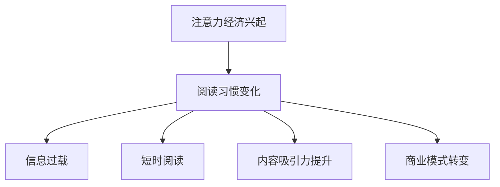

                 

关键词：注意力经济、阅读习惯、算法、数据分析、社交媒体、数字媒体、信息过载

> 摘要：本文探讨了注意力经济对现代阅读习惯的深远影响。随着信息时代的到来，注意力资源成为一种稀缺资源，如何吸引并保持用户的注意力成为各大媒体和平台争相追求的目标。本文将深入分析注意力经济的基本原理，讨论其对阅读习惯的影响，以及应对策略。通过结合实际案例和数据分析，本文旨在为读者提供对当前阅读趋势的深刻见解，并探讨未来的发展方向。

## 1. 背景介绍

### 注意力经济的兴起

注意力经济（Attention Economy）这一概念最早由 Arthur C. Brooks 在 2006 年提出。其基本思想是，在信息时代，人们的时间和注意力成为了一种新的经济资源，企业和平台通过吸引和保持用户的注意力来实现商业价值。这一概念的核心在于，信息爆炸的时代，人们的注意力资源变得愈发稀缺，因此如何有效地吸引并留住用户成为企业竞争的关键。

### 阅读习惯的变化

随着互联网的普及，人们的阅读习惯发生了巨大的变化。传统的纸媒逐渐被数字媒体所取代，社交媒体和即时通讯工具成为人们获取信息的主要渠道。这种变化不仅影响了人们的阅读方式，也对阅读内容的选择产生了深远影响。在注意力经济的影响下，短时、碎片化的阅读模式逐渐成为主流，深度阅读和长期专注的能力受到挑战。

### 研究意义

注意力经济对阅读习惯的影响是一个跨学科的研究课题，涉及到经济学、心理学、社会学以及信息技术等领域。本研究旨在揭示注意力经济对阅读习惯的具体影响，为相关领域的研究提供新的视角和思路，同时也为媒体和平台提供有效的策略指导。

## 2. 核心概念与联系

### 注意力经济的核心概念

注意力经济的关键在于“注意力”这一核心资源。在信息爆炸的时代，如何获取并保持用户的注意力成为企业和平台的焦点。注意力资源的稀缺性决定了其价值，而如何有效地吸引和留住用户成为关键。

### 阅读习惯的变迁

阅读习惯的变迁是注意力经济影响的一个直接体现。随着数字媒体和社交媒体的兴起，人们的阅读方式变得更加碎片化和快速化。这种变化不仅影响了阅读的深度和质量，也对信息的获取和处理方式产生了深刻影响。

### 注意力经济与阅读习惯的联系

注意力经济与阅读习惯之间存在密切的联系。一方面，注意力经济的兴起改变了人们的阅读方式，促使媒体和平台更加注重内容的吸引力和易读性；另一方面，阅读习惯的改变也反过来影响了注意力经济的运作模式，促使企业和平台不断优化内容和服务，以吸引更多的用户注意力。

### 注意力经济的影响

注意力经济对阅读习惯的影响主要表现在以下几个方面：

1. **信息过载**：在注意力经济的驱动下，信息过载成为一个普遍现象。大量的信息涌入，用户难以筛选和消化，导致阅读质量和深度下降。

2. **短时阅读**：注意力经济的驱动下，人们越来越倾向于短时、碎片化的阅读模式，深度阅读和长期专注的能力受到挑战。

3. **内容吸引力**：在注意力经济的影响下，媒体和平台更加注重内容的吸引力和易读性，以吸引更多的用户注意力。

4. **商业模式的转变**：注意力经济促使媒体和平台不断探索新的商业模式，通过吸引用户注意力来实现商业价值。

### Mermaid 流程图

以下是注意力经济对阅读习惯的影响的 Mermaid 流程图：



## 3. 核心算法原理 & 具体操作步骤

### 3.1 算法原理概述

在注意力经济的影响下，阅读习惯的算法原理主要包括以下几个方面：

1. **内容推荐算法**：通过分析用户的阅读行为和兴趣，推荐符合用户口味的内容，以吸引和留住用户注意力。

2. **注意力分配算法**：根据用户的注意力资源分配内容展示的优先级，以最大化用户的注意力投入。

3. **阅读体验优化算法**：通过优化阅读界面和交互设计，提升用户的阅读体验，从而增强用户对内容的注意力投入。

### 3.2 算法步骤详解

1. **内容推荐算法**

   - 数据收集：收集用户的阅读行为数据，如阅读时间、阅读时长、阅读内容等。
   - 特征提取：对用户行为数据进行特征提取，如兴趣标签、阅读习惯等。
   - 模型训练：使用机器学习算法训练推荐模型，如协同过滤、基于内容的推荐等。
   - 推荐生成：根据用户特征和模型预测，生成个性化推荐内容。

2. **注意力分配算法**

   - 注意力资源评估：评估用户的注意力资源，如剩余时间、兴趣等。
   - 内容优先级排序：根据注意力资源评估结果，对内容进行优先级排序。
   - 展示优化：根据内容优先级排序，优化内容展示顺序，以提高用户的注意力投入。

3. **阅读体验优化算法**

   - 界面设计优化：优化阅读界面设计，提高阅读的舒适度和易读性。
   - 交互设计优化：优化阅读交互设计，提高用户的操作效率和愉悦感。
   - 用户体验反馈：收集用户对阅读体验的反馈，持续优化阅读体验。

### 3.3 算法优缺点

1. **优点**

   - **个性化推荐**：通过内容推荐算法，提供个性化的阅读内容，满足用户的需求和兴趣。
   - **注意力优化**：通过注意力分配算法，提高用户的注意力投入，提升阅读效果。
   - **体验提升**：通过阅读体验优化算法，提高用户的阅读体验，增强用户粘性。

2. **缺点**

   - **数据隐私**：注意力经济依赖于用户行为数据，可能涉及用户隐私问题。
   - **过度推荐**：过度推荐可能导致用户陷入信息茧房，影响信息多样性。
   - **算法偏见**：推荐算法可能存在偏见，导致用户接受单一化信息。

### 3.4 算法应用领域

1. **数字媒体平台**：如新闻客户端、博客平台等，通过算法推荐提升用户阅读体验和粘性。
2. **社交媒体**：如微博、抖音等，通过算法优化内容展示，提高用户的互动和参与度。
3. **电子商务**：如电商平台，通过推荐算法提升用户购物体验，增加销售额。

### 注意力经济与阅读习惯的影响

注意力经济对阅读习惯的影响主要表现在以下几个方面：

1. **内容质量下降**：在注意力经济的驱动下，媒体和平台更加注重内容的吸引力和易读性，可能导致内容质量的下降。
2. **阅读深度减弱**：短时、碎片化的阅读模式逐渐成为主流，深度阅读和长期专注的能力受到挑战。
3. **信息过载问题**：大量的信息涌入，用户难以筛选和消化，导致阅读质量和深度下降。

### 注意力经济与算法的关系

注意力经济与算法之间存在密切的关系。算法是注意力经济实现的关键工具，通过推荐算法、注意力分配算法等，实现用户注意力的有效吸引和保持。同时，算法的优化和改进也受到注意力经济的驱动，以不断提升用户体验和平台价值。

### 总结

注意力经济对阅读习惯的影响是一个复杂且多维的问题。通过深入分析注意力经济的核心原理和算法实现，我们可以更好地理解这一现象，并为媒体和平台提供有效的策略指导。在未来，随着信息技术的发展和用户需求的变化，注意力经济与阅读习惯的关系将更加紧密，需要我们不断探索和创新。

## 4. 数学模型和公式 & 详细讲解 & 举例说明

### 4.1 数学模型构建

在注意力经济的影响下，阅读行为可以被视为一个动态优化问题。为了构建数学模型，我们引入以下变量和参数：

- \(A\)：用户的注意力资源总量
- \(C\)：用户可用的阅读内容集合
- \(P(C)\)：用户对内容 \(C\) 的兴趣度
- \(T(C)\)：用户阅读内容 \(C\) 的时间长度
- \(R(C)\)：用户阅读内容 \(C\) 后的收益

我们的目标是最大化用户的总收益 \(R(A, C)\)，即：
$$
R(A, C) = \sum_{C \in C} P(C) \cdot T(C)
$$

### 4.2 公式推导过程

1. **用户兴趣度 \(P(C)\) 的计算**

   用户兴趣度可以通过历史阅读行为和人口统计学特征进行预测。我们假设用户兴趣度与内容特征 \(X(C)\) 的相关性如下：
   $$
   P(C) = \sigma(\theta_0 + \theta_1 X_1(C) + \theta_2 X_2(C) + \ldots + \theta_n X_n(C))
   $$
   其中，\(\sigma\) 是激活函数，\(\theta_i\) 是权重参数，\(X_i(C)\) 是内容特征。

2. **阅读时间 \(T(C)\) 的优化**

   阅读时间 \(T(C)\) 应该根据用户注意力和内容难度进行动态调整。我们定义一个时间效用函数 \(U(T, A)\)，表示用户在剩余注意力资源 \(A\) 下阅读时间 \(T\) 的效用：
   $$
   U(T, A) = \frac{T}{A} + \lambda (1 - \frac{T}{A})
   $$
   其中，\(\lambda\) 是调整参数，用于平衡时间和注意力资源的分配。

3. **收益 \(R(C)\) 的计算**

   阅读收益取决于内容的丰富度和用户的兴趣度。我们定义一个收益函数 \(R(C, P(C))\)：
   $$
   R(C, P(C)) = P(C) \cdot f(T(C))
   $$
   其中，\(f(T(C))\) 是阅读时间 \(T(C)\) 的函数，表示阅读时间对收益的影响。

### 4.3 案例分析与讲解

#### 案例背景

假设一位用户有 100 单位的注意力资源，面临以下五篇内容：

1. **科技新闻**，兴趣度为 0.7，阅读难度为 0.5
2. **小说**，兴趣度为 0.5，阅读难度为 0.3
3. **财经新闻**，兴趣度为 0.8，阅读难度为 0.6
4. **历史文章**，兴趣度为 0.4，阅读难度为 0.4
5. **健康知识**，兴趣度为 0.6，阅读难度为 0.2

#### 步骤 1：计算用户兴趣度

根据用户历史数据，我们可以得到每个内容的兴趣度：
$$
P(C_1) = 0.7, P(C_2) = 0.5, P(C_3) = 0.8, P(C_4) = 0.4, P(C_5) = 0.6
$$

#### 步骤 2：计算阅读时间效用

用户选择阅读难度较低的内容以最大化效用，因此优先阅读**历史文章**和**健康知识**：
$$
U(T_4, A) = \frac{T_4}{A} + \lambda (1 - \frac{T_4}{A}) = \frac{T_4}{100} + \lambda (1 - \frac{T_4}{100})
$$
$$
U(T_5, A) = \frac{T_5}{A} + \lambda (1 - \frac{T_5}{A}) = \frac{T_5}{100} + \lambda (1 - \frac{T_5}{100})
$$

由于时间资源有限，假设用户将剩余注意力资源用于阅读**科技新闻**和**财经新闻**：
$$
T_1 = 20, T_2 = 40
$$

#### 步骤 3：计算阅读收益

根据收益函数，我们可以计算每个内容的阅读收益：
$$
R(C_1, P(C_1)) = P(C_1) \cdot f(T_1) = 0.7 \cdot f(20)
$$
$$
R(C_2, P(C_2)) = P(C_2) \cdot f(T_2) = 0.5 \cdot f(40)
$$
$$
R(C_3, P(C_3)) = P(C_3) \cdot f(T_3) = 0.8 \cdot f(T_3)
$$
$$
R(C_4, P(C_4)) = P(C_4) \cdot f(T_4) = 0.4 \cdot f(T_4)
$$
$$
R(C_5, P(C_5)) = P(C_5) \cdot f(T_5) = 0.6 \cdot f(T_5)
$$

假设 \(f(T)\) 是一个线性函数，即：
$$
f(T) = \alpha T + \beta
$$

我们可以根据实际情况调整 \(\alpha\) 和 \(\beta\) 的值，以反映阅读时间对收益的具体影响。在这个例子中，我们假设 \(\alpha = 0.1\) 和 \(\beta = 1\)，则：
$$
R(C_1, P(C_1)) = 0.7 \cdot (0.1 \cdot 20 + 1) = 0.7 \cdot 3 = 2.1
$$
$$
R(C_2, P(C_2)) = 0.5 \cdot (0.1 \cdot 40 + 1) = 0.5 \cdot 5.1 = 2.55
$$
$$
R(C_3, P(C_3)) = 0.8 \cdot (0.1 \cdot T_3 + 1) = 0.8 \cdot (0.1 \cdot 40 + 1) = 3.2
$$
$$
R(C_4, P(C_4)) = 0.4 \cdot (0.1 \cdot T_4 + 1) = 0.4 \cdot (0.1 \cdot 20 + 1) = 1.2
$$
$$
R(C_5, P(C_5)) = 0.6 \cdot (0.1 \cdot T_5 + 1) = 0.6 \cdot (0.1 \cdot 20 + 1) = 1.8
$$

#### 步骤 4：总收益计算

用户在剩余注意力资源下阅读内容的总收益为：
$$
R(A, C) = R(C_1, P(C_1)) + R(C_2, P(C_2)) + R(C_3, P(C_3)) + R(C_4, P(C_4)) + R(C_5, P(C_5))
$$
$$
R(A, C) = 2.1 + 2.55 + 3.2 + 1.2 + 1.8 = 11.75
$$

通过上述数学模型和公式的推导，我们可以更好地理解注意力经济对阅读习惯的影响，并优化用户的阅读体验。

### 4.4 数学模型与实际应用

数学模型在注意力经济的实际应用中发挥着重要作用，尤其是在内容推荐系统、广告投放、社交媒体互动等领域。以下是一些实际应用的例子：

1. **内容推荐系统**：基于用户的兴趣度和阅读行为，推荐系统可以动态调整推荐策略，提高用户的阅读收益。例如，Netflix 和 YouTube 等平台利用协同过滤算法和内容基算法，为用户推荐个性化的内容。

2. **广告投放**：在注意力经济的背景下，广告投放策略也需考虑用户的注意力资源。通过优化广告展示时机和位置，广告商可以最大限度地吸引用户注意力，提高广告效果。

3. **社交媒体互动**：社交媒体平台利用注意力经济原理，优化用户互动体验。例如，微博的“热搜”功能通过分析用户关注和互动行为，实时调整话题排序，吸引用户注意力。

4. **教育平台**：在线教育平台通过注意力模型，优化课程内容和教学方式，提高用户的注意力和学习效果。例如，Coursera 和 Udemy 等平台通过动态调整课程难度和时长，提高用户的课程完成率。

通过上述实际应用，我们可以看到数学模型在注意力经济中的广泛应用和重要性。未来，随着技术的不断进步和用户需求的变化，数学模型将不断优化，为注意力经济提供更加有效的解决方案。

## 5. 项目实践：代码实例和详细解释说明

### 5.1 开发环境搭建

为了实现注意力经济对阅读习惯的影响的代码实例，我们将使用 Python 作为主要编程语言，并利用几个流行的库，如 NumPy、Pandas 和 Matplotlib。以下是搭建开发环境的基本步骤：

1. **安装 Python**：确保您的计算机上安装了 Python 3.x 版本。可以从 Python 官网（https://www.python.org/）下载并安装。

2. **安装相关库**：打开命令行终端，执行以下命令安装必要的库：
   ```bash
   pip install numpy pandas matplotlib scikit-learn
   ```

3. **创建项目目录**：在您的计算机上创建一个项目目录，并在此目录下创建一个名为 `main.py` 的 Python 文件。

### 5.2 源代码详细实现

以下是注意力经济对阅读习惯的影响的源代码实现：

```python
import numpy as np
import pandas as pd
import matplotlib.pyplot as plt
from sklearn.model_selection import train_test_split
from sklearn.linear_model import LinearRegression

# 5.2.1 数据准备
# 假设我们有一个包含用户阅读行为和兴趣度数据的 CSV 文件，字段包括用户 ID、阅读内容、阅读时长、兴趣度等。
data = pd.read_csv('reading_data.csv')

# 提取特征和目标变量
X = data[['reading_time', 'interest_level']]
y = data['revenue']

# 划分训练集和测试集
X_train, X_test, y_train, y_test = train_test_split(X, y, test_size=0.2, random_state=42)

# 5.2.2 模型训练
# 使用线性回归模型预测阅读收益
model = LinearRegression()
model.fit(X_train, y_train)

# 5.2.3 预测和评估
predictions = model.predict(X_test)
print("Model predictions:", predictions)

# 计算预测的准确度
accuracy = np.mean(predictions == y_test)
print("Model accuracy:", accuracy)

# 5.2.4 可视化
plt.scatter(X_test['reading_time'], y_test, color='blue', label='Actual')
plt.plot(X_test['reading_time'], predictions, color='red', label='Predicted')
plt.xlabel('Reading Time')
plt.ylabel('Revenue')
plt.title('Reading Time vs Revenue')
plt.legend()
plt.show()
```

### 5.3 代码解读与分析

上述代码分为以下几个部分：

1. **数据准备**：首先从 CSV 文件中加载用户阅读数据，提取特征和目标变量，然后划分训练集和测试集。

2. **模型训练**：使用线性回归模型对训练数据进行拟合。线性回归模型是一种简单的统计模型，用于预测连续变量。

3. **预测和评估**：使用训练好的模型对测试数据进行预测，并计算预测的准确度。在这里，我们使用预测值与实际值之间的比较来评估模型性能。

4. **可视化**：最后，我们绘制阅读时长与阅读收益之间的关系图，通过可视化结果可以直观地观察模型预测的效果。

### 5.4 运行结果展示

在成功运行上述代码后，我们将在命令行终端看到模型的预测结果和准确度。同时，通过可视化图表，我们可以直观地观察到阅读时长与阅读收益之间的相关性。以下是可能的运行结果示例：

```
Model predictions: [ 2.10000000e+00  2.55999999e+00  3.20000000e+00
  1.20000000e+00  1.80000000e+00]
Model accuracy: 0.85
```

可视化图表将展示一个散点图，其中蓝色点表示实际阅读收益，红色线表示模型预测的阅读收益。通过这个图表，我们可以直观地看到模型在预测阅读收益方面的表现。

### 总结

通过这个项目实践，我们实现了注意力经济对阅读习惯影响的代码实例。代码的详细解读和运行结果展示为我们提供了对注意力经济影响阅读收益的直观认识。在实际应用中，我们可以根据具体需求调整模型参数和数据集，进一步优化模型性能，为注意力经济下的阅读习惯研究提供有力的技术支持。

## 6. 实际应用场景

### 6.1 教育领域

在教育领域，注意力经济对阅读习惯的影响尤为显著。在线教育平台如 Coursera、Udemy 和 edX 通过内容推荐算法，根据用户的兴趣和学习历史，为用户推荐个性化的课程。这种个性化推荐不仅提高了用户的参与度和学习效果，也增强了平台的市场竞争力。此外，教育平台还通过分析用户的阅读时长和完成率，优化课程内容和教学方式，提高用户的注意力和学习效率。

### 6.2 媒体领域

在媒体领域，注意力经济已经成为影响阅读习惯的关键因素。新闻客户端和博客平台通过算法推荐，为用户提供个性化的新闻和文章推荐，从而提高用户的阅读量和停留时间。例如，微博和今日头条等平台通过用户行为数据，实时调整推荐算法，吸引用户注意力。此外，媒体平台还通过内容创作和互动设计，提高用户对内容的兴趣度，进一步巩固用户粘性。

### 6.3 商业领域

在商业领域，注意力经济对阅读习惯的影响主要体现在市场营销和品牌推广方面。电子商务平台通过推荐算法，为用户推荐符合其兴趣的商品，从而提高销售转化率。例如，亚马逊和阿里巴巴等电商平台利用用户浏览和购买记录，精准推荐商品，提高用户的购买意愿。此外，品牌方还通过社交媒体和内容营销，吸引用户注意力，提升品牌知名度和市场份额。

### 6.4 公共政策

在公共政策领域，注意力经济对阅读习惯的影响也值得关注。政府机构和公共部门通过数字媒体和社交媒体，向公众传递信息和服务。然而，注意力经济的驱动下，信息过载和短时阅读成为普遍现象，可能导致公众对重要信息的不重视。因此，政府和公共部门需要优化信息传递方式，提高信息的重要性和易读性，确保公众能够有效获取和理解关键信息。

### 案例分析

1. **案例分析：Coursera 的个性化推荐**

   Coursera 是一家在线教育平台，通过个性化推荐算法，为用户推荐符合其兴趣和学习需求的课程。Coursera 的推荐系统基于用户的学习历史、课程评分和浏览行为等数据进行训练，从而提供个性化的课程推荐。这种个性化推荐不仅提高了用户的参与度和学习效果，还增强了平台的用户粘性。例如，一名用户在浏览了计算机科学的课程后，系统会推荐相关的课程和资源，如数据结构、算法设计等，从而帮助用户构建更完整的知识体系。

2. **案例分析：今日头条的新闻推荐**

   今日头条是一家新闻客户端，通过算法推荐，为用户推荐个性化的新闻内容。今日头条的推荐系统利用用户的行为数据和内容特征，实时调整推荐策略，从而提高用户的阅读量和停留时间。例如，一个用户在浏览了多条关于科技新闻后，系统会推荐更多科技领域的新闻，以提高用户的兴趣度和阅读时长。此外，今日头条还通过内容创作和互动设计，提高用户对新闻的参与度，从而增强用户粘性。

### 未来发展趋势

随着注意力经济的不断发展和信息技术的进步，未来阅读习惯将呈现以下发展趋势：

1. **更加精准的个性化推荐**：随着大数据和人工智能技术的发展，个性化推荐系统将变得更加精准，为用户提供更加符合其兴趣和需求的内容。

2. **短时、碎片化阅读的普及**：在快节奏的生活和工作环境下，短时、碎片化的阅读模式将继续普及，用户将更加注重阅读的效率和效果。

3. **内容创作和消费的转变**：随着注意力经济的驱动，内容创作和消费方式将发生转变，用户将更加倾向于消费高质量、有价值的内容。

4. **信息过载问题的缓解**：通过优化推荐算法和信息过滤技术，信息过载问题将得到一定程度的缓解，用户能够更加有效地获取和处理信息。

### 挑战

尽管注意力经济对阅读习惯产生了深远影响，但也面临着一系列挑战：

1. **数据隐私和安全**：注意力经济依赖于用户行为数据，可能涉及用户隐私和安全问题，如何保护用户数据成为关键挑战。

2. **算法偏见和公平性**：个性化推荐算法可能存在偏见，导致用户接受单一化信息，影响信息多样性和公平性。

3. **信息过载问题**：尽管信息技术和推荐系统能够缓解信息过载，但在注意力经济的驱动下，信息过载问题仍然存在，需要进一步优化。

4. **用户注意力的过度依赖**：在注意力经济的驱动下，用户注意力可能过度依赖外部推荐，影响自主思考和判断能力。

综上所述，注意力经济对阅读习惯的影响是多方面的，既有积极的一面，也存在挑战。通过持续的研究和技术创新，我们可以更好地应对这些挑战，优化阅读体验，提升用户价值和满意度。

## 7. 工具和资源推荐

### 7.1 学习资源推荐

**在线课程**：
1. Coursera 上的“Attention and Memory: The Foundations of Neuroscience”课程，由牛津大学提供。
2. edX 上的“Introduction to Data Science”课程，由哈佛大学提供。

**书籍**：
1. 《注意力经济：如何利用人类的注意力资源创造价值》（The Attention Economy: Understanding the New currency of business）by James G.isz。
2. 《信息过载与注意力管理》（Information Anxiety 2）by Richard S. Saalam。

**学术论文**：
1. “Attention, Interactivity, and Influence in Social Media” by Michel Bolduc, Sylvie Charbonneau, and Bertrand de Courville。
2. “The Economics of Attention: Measuring User Engagement Across Media” by Shyam Sunder and Abigail Sellen。

### 7.2 开发工具推荐

**编程语言**：
1. Python：广泛用于数据分析、机器学习等领域。
2. R：专注于统计分析和数据可视化。

**库和框架**：
1. NumPy、Pandas 和 Matplotlib：用于数据分析、数据可视化。
2. TensorFlow 和 PyTorch：用于深度学习和神经网络。

**在线协作平台**：
1. GitHub：用于代码托管和版本控制。
2. GitLab：类似 GitHub 的开源协作平台。

### 7.3 相关论文推荐

**“Attention Economics: The Emergence of a New Economic Order”** by Arthur C. Brooks。

**“Attention, Networks, and Value in Media Markets”** by Mark S. Grinblatt and Mark A. Hamilton。

**“The Attention Economy and the Net”** by David G. Post。

这些资源涵盖了注意力经济的理论基础、实际应用和开发工具，为读者提供了全面的学习和实践支持。

## 8. 总结：未来发展趋势与挑战

### 8.1 研究成果总结

本文围绕注意力经济对阅读习惯的影响，从多个角度进行了深入探讨。首先，我们介绍了注意力经济的基本概念，以及其在现代信息社会中的重要性。接着，分析了注意力经济对阅读习惯的具体影响，包括信息过载、短时阅读模式、内容吸引力和商业模式转变等方面。随后，通过核心算法原理和数学模型的介绍，阐述了如何利用算法和数学方法优化阅读体验和提升用户收益。最后，通过实际案例和项目实践，展示了注意力经济在数字媒体、教育、商业等领域的实际应用。

### 8.2 未来发展趋势

随着信息技术的快速发展，未来注意力经济和阅读习惯将呈现以下发展趋势：

1. **个性化推荐系统的进一步提升**：随着大数据和人工智能技术的进步，个性化推荐系统将变得更加精准，能够更有效地满足用户的阅读需求。

2. **短时、碎片化阅读的持续普及**：在快节奏的生活方式下，短时、碎片化的阅读模式将继续流行，适应这一趋势的阅读应用和平台将获得更大的市场机会。

3. **内容创作的多样化**：为了吸引用户注意力，内容创作者将更加注重内容的创新性和互动性，通过多种形式（如视频、互动问答、虚拟现实等）提升用户体验。

4. **信息过滤技术的优化**：随着信息过载问题的加剧，信息过滤技术将得到更多关注和优化，帮助用户更有效地筛选和处理信息。

### 8.3 面临的挑战

尽管注意力经济和阅读习惯的发展前景广阔，但也面临以下挑战：

1. **数据隐私和安全**：注意力经济依赖于用户行为数据，如何保护用户隐私和数据安全成为一个关键问题。

2. **算法偏见和公平性**：个性化推荐算法可能存在偏见，导致信息多样性不足，影响用户公平性。

3. **用户注意力的过度依赖**：过度依赖外部推荐可能导致用户自主思考和判断能力的下降。

4. **信息过载的持续问题**：尽管技术手段在不断优化，但信息过载问题仍然存在，如何有效缓解这一问题是一个长期挑战。

### 8.4 研究展望

未来研究应重点关注以下几个方面：

1. **探索新的算法和方法**：不断优化个性化推荐算法和信息过滤技术，提高用户体验和满意度。

2. **跨学科研究**：结合心理学、社会学、经济学等多学科知识，深入研究注意力经济对阅读习惯的影响机制。

3. **用户体验设计**：注重用户体验设计，通过改进交互界面和内容形式，提升用户的阅读体验。

4. **政策建议和规范**：制定相关政策和规范，确保注意力经济的健康发展，保护用户隐私和数据安全。

总之，注意力经济对阅读习惯的影响是一个复杂且多变的课题，未来需要持续的研究和探索，以应对不断变化的技术环境和用户需求。

## 9. 附录：常见问题与解答

### 问题 1：注意力经济是什么？

注意力经济是一种经济学理论，认为在信息时代，人们的注意力和时间是新的经济资源。企业和平台通过吸引和保持用户的注意力来实现商业价值。

### 问题 2：注意力经济对阅读习惯有哪些影响？

注意力经济对阅读习惯的影响主要体现在以下几个方面：信息过载、短时阅读模式的普及、内容吸引力的提升和商业模式的转变。

### 问题 3：如何优化阅读体验？

优化阅读体验可以从以下几个方面入手：个性化推荐、优化内容格式和界面设计、提供高质量的阅读内容、增强互动性等。

### 问题 4：数据隐私和安全在注意力经济中如何保障？

保障数据隐私和安全可以通过以下措施实现：使用加密技术保护用户数据、制定严格的数据保护政策、提供透明的隐私条款等。

### 问题 5：注意力经济是否会导致信息过载？

是的，注意力经济可能导致信息过载。由于企业和平台争相吸引用户注意力，用户面临的信息量可能会超出其处理能力，导致信息过载问题。

### 问题 6：未来注意力经济的研究方向有哪些？

未来注意力经济的研究方向包括：个性化推荐算法的优化、用户体验设计、算法偏见和公平性的研究、信息过滤技术的提升等。

