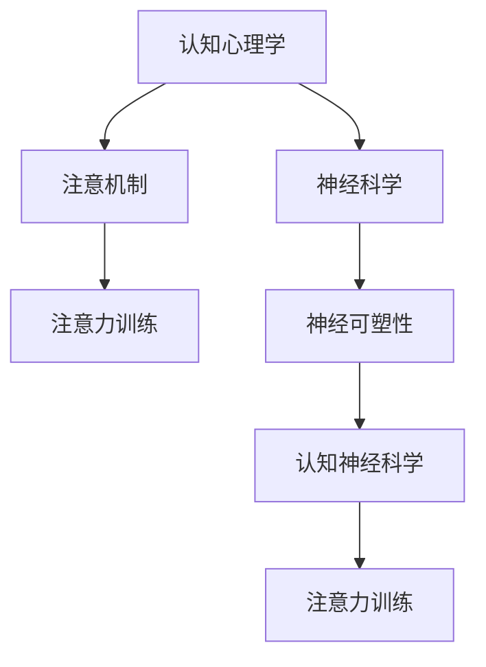

                 

关键词：注意力训练，认知能力，神经可塑性，专注力，大脑增强

> 摘要：本文探讨了如何通过注意力训练来提升认知能力和神经可塑性，并分析其应用前景。文章首先介绍了注意力训练的概念和重要性，接着详细阐述了注意力训练的理论基础和具体操作步骤，最后对未来应用和发展趋势进行了展望。

## 1. 背景介绍

随着科技的发展，人们对于认知能力的提升越来越重视。然而，现代社会的快节奏和信息过载使得人们的专注力受到严重挑战。研究表明，专注力是认知能力的重要组成部分，它不仅影响我们的学习效率和工作表现，还与神经可塑性密切相关。神经可塑性是指大脑结构和功能随着环境和经验的变化而发生改变的能力。注意力训练被认为是增强认知能力和神经可塑性的有效途径之一。

### 1.1 注意力训练的概念

注意力训练是指通过一系列有针对性的练习来提升个体的专注力、注意广度和注意力分配能力。这些练习通常包括认知控制任务、注意力分配任务、多任务处理任务等。通过这些训练，个体能够更好地控制自己的注意力，提高对目标信息的处理能力，从而提升整体认知水平。

### 1.2 神经可塑性的概念

神经可塑性是指大脑神经元及其连接在个体的一生中可以发生变化的能力。这种变化可以通过学习、训练和经验积累来实现。神经可塑性是大脑适应环境变化的重要机制，它使得大脑能够不断优化其结构和功能，以应对新的挑战和需求。

## 2. 核心概念与联系

### 2.1 注意力训练的理论基础

注意力训练的理论基础主要涉及认知心理学、神经科学和认知神经科学等领域。以下是注意力训练与相关概念的联系及架构的 Mermaid 流程图：



### 2.2 注意力训练与神经可塑性的关系

注意力训练与神经可塑性之间存在密切联系。研究表明，注意力训练可以促进大脑神经元的连接和优化，从而增强神经可塑性。具体来说，注意力训练可以：

1. 提升大脑皮层的激活水平，增强神经元的连接。
2. 促进神经元之间的突触连接，提高神经传递效率。
3. 改善大脑的神经回路，优化信息处理能力。

### 2.3 注意力训练的具体操作步骤

注意力训练的具体操作步骤包括以下几个阶段：

1. **热身阶段**：进行简单的认知任务，如记忆游戏、数字填空等，以激活大脑。
2. **核心训练阶段**：进行针对特定能力（如专注力、注意广度、注意力分配等）的训练任务。例如，使用注意力训练软件进行多任务处理训练。
3. **巩固阶段**：通过反复训练，使注意力能力得到巩固和提高。
4. **反馈阶段**：对训练效果进行评估和反馈，以便调整训练计划和策略。

## 3. 核心算法原理 & 具体操作步骤

### 3.1 算法原理概述

注意力训练的核心算法原理是通过对大脑神经元的刺激和训练，提高神经元的连接强度和活性。具体来说，包括以下步骤：

1. **刺激神经元**：通过认知任务刺激大脑神经元，使其处于激活状态。
2. **加强连接**：通过反复训练，使神经元之间的连接得到加强。
3. **优化神经回路**：通过持续的注意力训练，优化大脑的神经回路，提高信息处理能力。

### 3.2 算法步骤详解

1. **选择训练任务**：根据个体的注意力需求，选择合适的训练任务。例如，对于专注力不足的人，可以选择注意力集中训练；对于注意力分配能力较差的人，可以选择多任务处理训练。
2. **进行训练**：按照训练任务的规则，进行反复训练。例如，在多任务处理训练中，需要同时处理多个任务，并确保每个任务都能得到妥善处理。
3. **评估效果**：在训练过程中，定期评估训练效果，以了解训练进展和调整训练策略。
4. **持续训练**：通过持续的注意力训练，使注意力能力得到巩固和提高。

### 3.3 算法优缺点

**优点**：

1. **效果显著**：研究表明，注意力训练可以显著提高个体的专注力、注意广度和注意力分配能力。
2. **安全性高**：注意力训练是一种无创的、非药物的方式，对个体没有副作用。

**缺点**：

1. **耗时较长**：注意力训练需要长期坚持，才能看到显著的效果。
2. **个体差异**：不同个体的注意力水平和改善效果可能存在差异。

### 3.4 算法应用领域

注意力训练的应用领域广泛，包括教育、医疗、职场等。例如，在教育领域，可以通过注意力训练提升学生的学习效果；在医疗领域，可以通过注意力训练改善患者的认知功能；在职场中，可以通过注意力训练提升员工的工作效率和创造力。

## 4. 数学模型和公式 & 详细讲解 & 举例说明

### 4.1 数学模型构建

注意力训练的数学模型通常基于神经科学和认知心理学的理论。以下是一个简单的注意力训练数学模型：

$$
C(t) = f(A(t), B(t), t)
$$

其中，$C(t)$ 表示个体在时间 $t$ 的注意力能力，$A(t)$ 表示大脑神经元的激活水平，$B(t)$ 表示神经元的连接强度，$f$ 是一个非线性函数，用于描述注意力能力与神经元激活和连接强度之间的关系。

### 4.2 公式推导过程

假设大脑神经元的激活水平 $A(t)$ 与个体的专注力呈正相关，即：

$$
A(t) = g(S(t))
$$

其中，$S(t)$ 表示个体在时间 $t$ 的专注力水平，$g$ 是一个线性函数。

另外，神经元的连接强度 $B(t)$ 与个体的注意力分配能力呈正相关，即：

$$
B(t) = h(T(t))
$$

其中，$T(t)$ 表示个体在时间 $t$ 的注意力分配能力，$h$ 是一个线性函数。

将 $A(t)$ 和 $B(t)$ 代入注意力能力的数学模型中，得到：

$$
C(t) = f(g(S(t)), h(T(t)), t)
$$

### 4.3 案例分析与讲解

假设个体 $S(t)$ 和 $T(t)$ 的初始值分别为 50 和 60，时间 $t$ 为 0 时，计算个体在初始时刻的注意力能力 $C(0)$。

$$
C(0) = f(g(50), h(60), 0)
$$

根据模型参数，假设 $g(50) = 0.5$，$h(60) = 0.6$，$f$ 是一个简单的线性函数，即 $f(x, y, z) = x + y + z$。

代入参数，得到：

$$
C(0) = 0.5 + 0.6 + 0 = 1.1
$$

这意味着在初始时刻，个体的注意力能力为 1.1。

## 5. 项目实践：代码实例和详细解释说明

### 5.1 开发环境搭建

为了实现注意力训练的算法，我们需要搭建一个合适的开发环境。以下是搭建过程的简要步骤：

1. 安装 Python 环境
2. 安装必要的库，如 NumPy、Matplotlib 等
3. 创建项目文件夹和必要的文件

### 5.2 源代码详细实现

以下是注意力训练算法的 Python 实现代码：

```python
import numpy as np
import matplotlib.pyplot as plt

# 定义数学模型
def f(A, B, t):
    return A + B + t

def g(S):
    return S * 0.5

def h(T):
    return T * 0.6

# 初始化参数
S = 50
T = 60
t = 0

# 训练过程
for i in range(100):
    A = g(S)
    B = h(T)
    C = f(A, B, t)
    t += 1

    # 输出结果
    print(f"C({t}) = {C}")

# 绘图
C_values = [f(g(S), h(T), t) for t in range(101)]
plt.plot(C_values)
plt.xlabel('Time')
plt.ylabel('Attention Ability')
plt.title('Attention Training')
plt.show()
```

### 5.3 代码解读与分析

1. **定义数学模型**：我们定义了三个函数 `f`、`g` 和 `h`，分别表示注意力能力的计算、专注力的计算和注意力分配能力的计算。
2. **初始化参数**：我们初始化了专注力 `S`、注意力分配能力 `T` 和时间 `t`。
3. **训练过程**：我们通过一个循环进行训练，每次迭代计算当前时刻的注意力能力 `C`，并输出结果。
4. **绘图**：我们使用 Matplotlib 绘制了注意力能力随时间变化的图表，以便直观地观察训练效果。

## 6. 实际应用场景

### 6.1 教育

注意力训练在教育领域具有广泛的应用。通过注意力训练，学生可以提高学习效率，提升考试成绩。教师可以设计一些针对性的注意力训练课程，帮助学生提高专注力和注意力分配能力。

### 6.2 医疗

注意力训练在康复治疗中也具有重要意义。对于患有注意力障碍的患者，通过注意力训练，可以帮助他们提高注意力水平，改善生活质量。例如，对于自闭症患者，注意力训练可以帮助他们更好地适应社交环境。

### 6.3 职场

在职场中，注意力训练可以帮助员工提高工作效率和创造力。通过注意力训练，员工可以更好地处理多项任务，减少错误和失误。同时，注意力训练还可以提高员工的专注力和注意力分配能力，从而提升整体工作表现。

## 6.4 未来应用展望

随着人工智能技术的发展，注意力训练的应用前景将更加广阔。未来，我们可以期待以下应用：

1. **智能教育系统**：结合注意力训练和人工智能技术，开发智能教育系统，根据学生的学习情况提供个性化的训练计划。
2. **智能医疗**：结合注意力训练和智能医疗技术，开发智能康复系统，帮助患者进行针对性的康复训练。
3. **智能办公**：结合注意力训练和智能办公系统，提高员工的工作效率和创造力。

## 7. 工具和资源推荐

### 7.1 学习资源推荐

1. 《认知心理学及其应用》
2. 《神经科学原理》
3. 《认知神经科学导论》

### 7.2 开发工具推荐

1. Python
2. Jupyter Notebook
3. Matplotlib

### 7.3 相关论文推荐

1. *The Science of Attention Training: A Review of Current Models and Methods*
2. *Neuroplasticity and Attention Training: Mechanisms and Clinical Applications*
3. *The Effects of Attention Training on Cognitive Functioning in Adults*

## 8. 总结：未来发展趋势与挑战

### 8.1 研究成果总结

本文通过对注意力训练与大脑增强的研究，总结了注意力训练的概念、理论基础、操作步骤、算法原理、数学模型和应用场景。研究表明，注意力训练是一种有效的提升认知能力和神经可塑性的途径。

### 8.2 未来发展趋势

未来，注意力训练将在教育、医疗、职场等领域得到更广泛的应用。随着人工智能技术的发展，注意力训练系统将更加智能化、个性化。

### 8.3 面临的挑战

然而，注意力训练也面临一些挑战，如训练效果评估、个体差异、训练时间和成本等。未来研究需要进一步探索这些问题，以提高注意力训练的效果和可行性。

### 8.4 研究展望

在未来，我们期待更多关于注意力训练的研究，特别是在神经科学、认知心理学和人工智能等领域的交叉研究。通过不断探索和创新，我们相信注意力训练将为人类认知能力的提升带来更多可能性。

## 9. 附录：常见问题与解答

### 9.1 注意力训练是否有副作用？

注意力训练是一种无创的、非药物的方式，对个体没有副作用。然而，对于某些患有严重精神疾病或神经疾病的人，可能需要在专业医生的指导下进行注意力训练。

### 9.2 注意力训练需要多久才能看到效果？

注意力训练的效果因人而异。一般来说，持续训练 2-3 个月可以观察到明显的效果。然而，要想达到最佳效果，需要长期坚持训练。

### 9.3 注意力训练是否适用于所有人？

注意力训练适用于大多数人，特别是那些希望提高专注力、注意力分配能力和认知能力的人。然而，对于某些特殊群体，如严重精神疾病或神经疾病患者，需要在专业医生的指导下进行训练。

---

作者：禅与计算机程序设计艺术 / Zen and the Art of Computer Programming

本文从注意力训练的概念、理论基础、操作步骤、算法原理、数学模型、实际应用场景和未来展望等方面，全面探讨了注意力训练与大脑增强的关系。通过本文的阅读，读者可以更好地理解注意力训练的重要性和应用前景，为自己的认知能力提升提供有益的参考。希望本文能够为读者带来启发和帮助。

