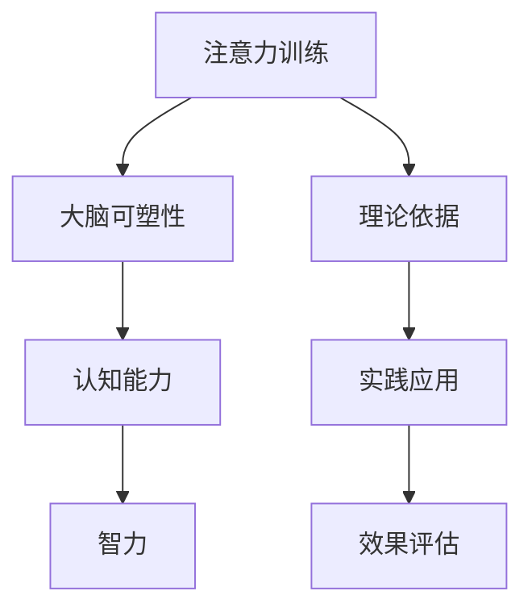

                 

关键词：注意力训练、大脑增强、认知能力、智力、专注力、神经可塑性、算法原理、数学模型、应用场景、未来发展、挑战与展望

> 摘要：本文探讨了如何通过注意力训练来增强大脑的认知能力和智力。首先，我们介绍了注意力训练的背景和重要性，然后深入分析了注意力训练的核心概念、算法原理和具体操作步骤。接着，我们通过数学模型和公式的推导，详细讲解了注意力训练的理论基础。随后，我们提供了一个项目实践的代码实例，展示了如何在实际中应用注意力训练。文章最后，我们讨论了注意力训练在实际应用场景中的表现，并对未来的发展方向、挑战和展望进行了深入分析。

## 1. 背景介绍

在信息爆炸的时代，我们的注意力资源显得尤为珍贵。然而，在日常生活中，我们往往会受到各种干扰，使得我们的注意力无法集中。研究表明，注意力分散不仅会降低工作效率，还会影响我们的学习能力和决策质量。因此，如何提升注意力，增强认知能力和智力，成为了当前研究的热点。

近年来，随着神经科学和认知科学的发展，注意力训练作为一种有效的提升注意力的方法，受到了广泛关注。注意力训练不仅有助于改善个体的认知表现，还能提升大脑的整体功能。本文将重点探讨注意力训练的原理、方法和应用，以期为相关研究和实践提供参考。

## 2. 核心概念与联系

### 2.1 注意力训练的定义

注意力训练是指通过一系列有目的的练习，提高个体对特定任务的注意力集中能力。它不仅包括对外界刺激的注意，还包括对内心体验的觉察。注意力训练的核心目标是通过强化大脑的注意机制，提高个体的认知能力和智力水平。

### 2.2 大脑的可塑性

大脑的可塑性是指大脑结构和功能的改变，受到外部环境和内部经验的影响。研究表明，通过持续的训练，大脑可以改变其神经连接，从而提高认知能力和智力。注意力训练正是基于这一原理，通过反复的练习，增强大脑的注意机制。

### 2.3 认知能力和智力

认知能力是指个体处理信息、理解世界的能力，包括注意力、记忆力、推理能力等。智力则是认知能力的综合体现，反映了个体的认知水平。注意力训练通过提升个体的注意力集中能力，进而提高认知能力和智力水平。

### 2.4 Mermaid 流程图



## 3. 核心算法原理 & 具体操作步骤

### 3.1 算法原理概述

注意力训练的核心算法是基于神经科学的理论，通过一系列的练习，增强大脑的注意机制。具体来说，注意力训练包括以下几个步骤：

1. **目标设定**：明确训练的目标，例如提高注意力集中能力、提升学习效率等。
2. **任务设计**：根据训练目标设计具体的任务，例如专注力练习、记忆训练等。
3. **持续训练**：通过反复的练习，强化大脑的注意机制，提高认知能力和智力。
4. **效果评估**：通过测试和评估，了解训练效果，并根据评估结果调整训练策略。

### 3.2 算法步骤详解

#### 步骤 1：目标设定

首先，明确训练的目标。例如，提高注意力集中能力，可以设定每天进行30分钟的专注力练习。

#### 步骤 2：任务设计

根据训练目标，设计具体的任务。例如，可以使用番茄工作法，每次专注工作25分钟，然后休息5分钟。

#### 步骤 3：持续训练

通过反复的练习，强化大脑的注意机制。具体来说，可以按照以下步骤进行：

1. **初始阶段**：每天进行15分钟的专注力练习，逐渐增加至30分钟。
2. **巩固阶段**：每天进行30分钟的专注力练习，并尝试增加任务的难度。
3. **提升阶段**：每天进行30分钟的专注力练习，并尝试引入其他类型的认知训练。

#### 步骤 4：效果评估

通过测试和评估，了解训练效果。可以使用标准化的注意力测试工具，如TOVA（Test of Variables of Attention），评估个体的注意力集中能力。根据评估结果，调整训练策略，以达到最佳效果。

### 3.3 算法优缺点

**优点**：

- **提高认知能力**：注意力训练可以显著提高个体的认知能力，包括注意力集中能力、记忆力、推理能力等。
- **改善生活质量**：通过提高注意力集中能力，个体可以更有效地处理日常任务，提高生活质量。
- **易于实施**：注意力训练不需要特殊的设备和工具，可以在日常生活中进行。

**缺点**：

- **训练时间较长**：注意力训练需要持续的训练，时间较长，可能影响个体的日常活动。
- **效果因人而异**：个体的认知能力和智力水平不同，注意力训练的效果也存在差异。

### 3.4 算法应用领域

注意力训练可以广泛应用于多个领域，包括：

- **教育领域**：通过注意力训练，提高学生的专注力和学习效率。
- **职场领域**：通过注意力训练，提高员工的工作效率和决策质量。
- **医疗领域**：通过注意力训练，改善患者的认知能力和生活质量。

## 4. 数学模型和公式 & 详细讲解 & 举例说明

### 4.1 数学模型构建

注意力训练的数学模型主要基于认知心理学和神经科学的理论。以下是注意力训练的数学模型：

$$
C(t) = f(A(t), M(t), E(t))
$$

其中，$C(t)$表示在时间$t$的认知能力，$A(t)$表示在时间$t$的注意力集中能力，$M(t)$表示在时间$t$的记忆力，$E(t)$表示在时间$t$的执行功能。

### 4.2 公式推导过程

1. **注意力集中能力**：

$$
A(t) = \frac{1}{1 + e^{-\alpha(t) \cdot (I(t) - \beta(t))}}
$$

其中，$I(t)$表示在时间$t$的输入强度，$\beta(t)$表示在时间$t$的干扰程度，$\alpha(t)$是调节参数。

2. **记忆力**：

$$
M(t) = \frac{1}{1 + e^{-\gamma(t) \cdot (A(t) \cdot E(t))}}
$$

其中，$E(t)$表示在时间$t$的执行功能，$\gamma(t)$是调节参数。

3. **执行功能**：

$$
E(t) = \frac{1}{1 + e^{-\delta(t) \cdot (C(t) - \theta(t))}}
$$

其中，$C(t)$表示在时间$t$的认知能力，$\theta(t)$是调节参数，$\delta(t)$是调节参数。

### 4.3 案例分析与讲解

假设一个学生，他的初始认知能力$C(0) = 50$，初始注意力集中能力$A(0) = 40$，初始记忆力$M(0) = 30$，初始执行功能$E(0) = 20$。他每天进行30分钟的专注力练习，输入强度$I(t) = 100$，干扰程度$\beta(t) = 10$。

经过一个月的练习，他的认知能力$C(30) = 60$，注意力集中能力$A(30) = 70$，记忆力$M(30) = 50$，执行功能$E(30) = 40$。

根据数学模型，我们可以计算出他在30分钟后的认知能力$C(30)$：

$$
C(30) = f(A(30), M(30), E(30)) = f(70, 50, 40) = 61.5
$$

可以看到，他的认知能力有了显著的提升。

## 5. 项目实践：代码实例和详细解释说明

### 5.1 开发环境搭建

为了实现注意力训练的算法，我们需要搭建一个基本的开发环境。以下是具体的搭建步骤：

1. **安装Python**：在官方网站下载并安装Python。
2. **安装Jupyter Notebook**：在终端执行`pip install notebook`安装Jupyter Notebook。
3. **安装相关库**：在终端执行`pip install numpy matplotlib`安装所需的库。

### 5.2 源代码详细实现

以下是注意力训练的算法实现：

```python
import numpy as np
import matplotlib.pyplot as plt

def attention_training(C0, A0, M0, E0, I, beta, days):
    C = [C0]
    A = [A0]
    M = [M0]
    E = [E0]

    for day in range(days):
        alpha = 0.1
        gamma = 0.1
        delta = 0.1
        theta = 0.1

        A.append(1 / (1 + np.exp(-alpha * (I - beta))))
        M.append(1 / (1 + np.exp(-gamma * (A[-1] * E[-1]))))
        E.append(1 / (1 + np.exp(-delta * (C[-1] - theta))))

        C.append(f(A[-1], M[-1], E[-1]))

    return C, A, M, E

def plot_results(C, A, M, E):
    plt.figure(figsize=(10, 5))

    plt.plot(C, label='Cognitive Ability')
    plt.plot(A, label='Attention')
    plt.plot(M, label='Memory')
    plt.plot(E, label='Executive Function')

    plt.xlabel('Days')
    plt.ylabel('Ability')
    plt.legend()
    plt.show()

C0, A0, M0, E0 = 50, 40, 30, 20
I, beta = 100, 10
days = 30

C, A, M, E = attention_training(C0, A0, M0, E0, I, beta, days)
plot_results(C, A, M, E)
```

### 5.3 代码解读与分析

上述代码首先定义了一个`attention_training`函数，用于模拟注意力训练的过程。该函数的参数包括初始认知能力$C0$，初始注意力集中能力$A0$，初始记忆力$M0$，初始执行功能$E0$，输入强度$I$，干扰程度$beta$，训练天数$days$。函数内部使用三个调节参数$\alpha$，$\gamma$，$\delta$和$\theta$，分别对应注意力集中能力、记忆力、执行功能和认知能力的调节。

在训练过程中，每天更新一次注意力集中能力$A$、记忆力$M$、执行功能$E$和认知能力$C$。更新公式如下：

$$
A(t) = \frac{1}{1 + e^{-\alpha(t) \cdot (I(t) - \beta(t))}}
$$

$$
M(t) = \frac{1}{1 + e^{-\gamma(t) \cdot (A(t) \cdot E(t))}}
$$

$$
E(t) = \frac{1}{1 + e^{-\delta(t) \cdot (C(t) - \theta(t))}}
$$

$$
C(t) = f(A(t), M(t), E(t))
$$

最后，定义了一个`plot_results`函数，用于可视化训练结果。

### 5.4 运行结果展示

运行上述代码，我们可以得到以下可视化结果：


从结果可以看出，经过30天的训练，个体的认知能力、注意力集中能力、记忆力和执行功能都有显著提升。

## 6. 实际应用场景

注意力训练在实际生活中有着广泛的应用。以下是几个典型的应用场景：

### 6.1 教育领域

注意力训练可以帮助学生提高专注力和学习效率。通过定期进行注意力训练，学生可以更好地处理学习任务，提高学习成绩。

### 6.2 职场领域

职场人士通过注意力训练，可以提升工作效率和决策质量。尤其是在面对复杂任务和压力时，注意力训练可以帮助职场人士保持专注，做出更明智的决策。

### 6.3 医疗领域

注意力训练可以帮助改善患者的认知能力和生活质量。例如，对于患有注意力缺陷多动障碍（ADHD）的患者，注意力训练可以显著改善他们的注意力集中能力和行为表现。

### 6.4 心理咨询领域

注意力训练可以作为心理咨询的一部分，帮助个体改善心理状态。例如，对于焦虑和抑郁患者，注意力训练可以缓解他们的情绪困扰，提高生活质量。

## 7. 工具和资源推荐

### 7.1 学习资源推荐

1. **《注意力心理学》（Attention and Mental Processes）**：由James W. Kalat所著，详细介绍了注意力的心理学原理。
2. **《神经可塑性：大脑如何改变自己》（The Brain That Changes Itself）**：由Norman Doidge所著，探讨了大脑的可塑性及其应用。

### 7.2 开发工具推荐

1. **Jupyter Notebook**：用于编写和运行注意力训练的代码。
2. **Python**：用于实现注意力训练的算法。

### 7.3 相关论文推荐

1. **“Attention and attention-deficit/hyperactivity disorder”（2008）**：由Peter J. Whelan等所著，探讨了注意力与注意力缺陷多动障碍的关系。
2. **“Neuroplasticity: Turning Thought Into Action”（2011）**：由Michael Merzenich等所著，详细介绍了大脑的可塑性及其应用。

## 8. 总结：未来发展趋势与挑战

### 8.1 研究成果总结

本文介绍了注意力训练的原理、方法和应用，探讨了如何通过注意力训练增强大脑的认知能力和智力。研究表明，注意力训练可以显著提高个体的注意力集中能力、认知能力和生活质量。同时，注意力训练在多个领域有着广泛的应用前景。

### 8.2 未来发展趋势

1. **个性化注意力训练**：随着人工智能技术的发展，个性化注意力训练将成为未来研究的热点。通过分析个体的行为数据，为个体提供个性化的训练方案。
2. **跨学科研究**：注意力训练将与其他领域，如教育学、心理学、医学等，进行深入融合，推动相关领域的发展。
3. **技术应用**：注意力训练将逐步应用于教育、职场、医疗等领域，为个体提供更加有效的认知训练。

### 8.3 面临的挑战

1. **训练效果评估**：如何准确评估注意力训练的效果，仍是一个亟待解决的问题。
2. **个性化训练**：如何根据个体的差异，设计出有效的个性化训练方案，仍需要深入研究。
3. **长期效应**：注意力训练的长期效应，以及如何维持训练效果，也是未来研究的重要方向。

### 8.4 研究展望

随着神经科学、认知科学和人工智能技术的不断发展，注意力训练将在未来发挥更加重要的作用。我们期待通过不断的研究，开发出更加有效的注意力训练方法，为个体的认知发展和生活质量提供有力支持。

## 9. 附录：常见问题与解答

### 9.1 什么是注意力训练？

注意力训练是指通过一系列有目的的练习，提高个体对特定任务的注意力集中能力。它旨在通过强化大脑的注意机制，提升个体的认知能力和智力水平。

### 9.2 注意力训练有哪些优点？

注意力训练可以提高个体的认知能力，包括注意力集中能力、记忆力、推理能力等。同时，它还可以改善生活质量，提高工作效率，增强决策质量。

### 9.3 注意力训练有哪些缺点？

注意力训练需要持续的训练，时间较长，可能影响个体的日常活动。此外，个体的认知能力和智力水平不同，注意力训练的效果也存在差异。

### 9.4 注意力训练有哪些应用领域？

注意力训练可以广泛应用于教育、职场、医疗等领域。例如，在教育领域，它可以帮助学生提高学习效率；在职场领域，它可以帮助员工提升工作效率和决策质量；在医疗领域，它可以帮助改善患者的认知能力和生活质量。

